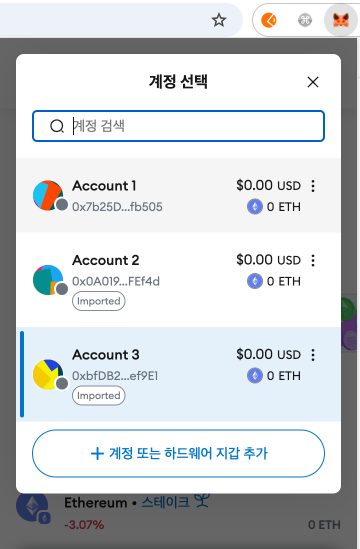

# 42강. 3의 배수번째 사람에게 적립된 이더 주는 스마트 컨트랙트

## 3번째 사람에게만 적립된 이더를 주는 컨트랙트 만들기

---

- Solidity를 사용하여 특정 조건에 따라 이더를 적립하고 지급하는 스마트 컨트랙트를 구현하려면 다음과 같은 기능이 필요하다:
    1. 이더 수신 및 적립: 각 참가자가 1 이더를 전송하면 컨트랙트는 이를 수신하고 적립한다.
    2. 3의 배수 번째 참가자에게 지급: 세 번째 참가자마다 적립된 이더를 해당 참가자에게 전송하고, 적립금을 초기화한다.
    3. 중복 참여 방지: 각 참가자는 한 번만 참여할 수 있도록 제한한다.
    4. 관리자만 적립금 확인 가능: 적립된 이더의 총액은 관리자만 확인할 수 있도록 설정한다.

### 예제

---

- lec42.sol
    
    ```solidity
    // SPDX-License-Identifier: GPL-3.0
    pragma solidity >=0.7.0 < 0.9.0;
    
    /*
    1. 1 이더만 내야한다
    2. 중복해서 참여 불가 (단, 누군가 적립금을 받으면 초기화)
    3. 관리자만 적립된 이더 볼 수 있다.
    4. 3의 배수 번째 사람에게만 적립된 이더를 준다.
    */
    contract MoneyBox {
        event WhoPaid(address indexed sender, uint256 payment);
    
        address ownwer;
        mapping (uint256=> mapping(address => bool)) paidMemberList;    
        /*
        1 round : A: true, B: true, C: true paidMemberList
        2 round : E, R, D paidMemberList
        3 round : A, R, B paidMemberList
        4 round : All false
        */
        uint256 round = 1;
        
        constructor(){
            ownwer = msg.sender;
        }
       
        receive() external payable {
            require(msg.value == 1 ether, "Must be 1 ether.");
            require(paidMemberList[round][msg.sender] == false, "Must be a new player in each game.");
            
            paidMemberList[round][msg.sender] = true;
            
            emit WhoPaid(msg.sender, msg.value);
            
            if(address(this).balance == 3 ether){
                (bool sent,)= payable(msg.sender).call{value:address(this).balance}("");
                require(sent,"Failed to pay");
                round++;
            }
        }
    
        function checkRound() public view returns(uint256){
            return round;
        }
        
        function checkValue() public view  returns(uint256){
            require(ownwer==msg.sender, "Only Onwer can check the value");
            return address(this).balance;
        }
    }
    ```
    

## 리믹스와 메타마스크 연결, 스마트 컨트랙트 testnet에 배포하기

---

### 1. MetaMask 설정 및 테스트넷 추가

---

- MetaMask 설치: MetaMask는 이더리움 지갑으로, 크롬 브라우저의 확장 프로그램으로 설치할 수 있다. 설치 후 지갑을 생성하거나 기존 지갑을 복구한다.
    
    
    
- 테스트넷 추가: MetaMask에 테스트넷을 추가하려면, 네트워크 목록에서 '네트워크 추가'를 선택하고, 해당 테스트넷의 정보를 입력한다.
    - Sepolia 테스트넷에 연결함

### 2. 테스트넷용 이더 확보

---

- 테스트넷에서 스마트 컨트랙트를 배포하려면 가스 수수료를 지불하기 위한 테스트넷 이더가 필요하다.
    - 이를 위해 해당 테스트넷의 Faucet 서비스를 이용하여 무료로 테스트넷 이더를 받을 수 있다.
    - ex> 메타마스크 디벨로퍼 가입 및 메타마스크 지갑 연결했으나, 결국 faucet 해서 받았다.
        - [https://docs.metamask.io/developer-tools/faucet/](https://docs.metamask.io/developer-tools/faucet/)
            
            
            
        - [https://faucetlink.to/sepolia](https://faucetlink.to/sepolia) (0.05 SepETH 부터 전송 가능)
            
            
            

### 3. Remix에서 스마트 컨트랙트 작성 및 컴파일

---

- Remix 접속: 웹 브라우저에서 Remix IDE에 접속한다.
- 컨트랙트 코드 작성: 생성한 파일에 Solidity 언어로 스마트 컨트랙트 코드를 작성한다.
    - lec42.sol - 0.01 이더 단위로 변경해준다.
- 저장해서 컴파일 해준다.

### 4. MetaMask와 Remix 연결 및 컨트랙트 배포

---

- Remix와 MetaMask 연결: 좌측 메뉴에서 'Deploy & Run Transactions' 탭을 선택하고, 'Environment' 드롭다운 메뉴에서 Injected Web3 (Injected Provider - MetaMask)를 선택한다.
    
    
    
- 계정 확인: MetaMask 팝업이 나타나면 연결을 승인하고, 올바른 테스트넷 계정이 선택되었는지 확인한다.
- 배포: 'Deploy' 버튼을 클릭하면 MetaMask에서 트랜잭션 확인 창이 나타난다. 가스 수수료를 확인한 후 '확인'을 클릭하여 배포를 완료한다.
    
    
    
    - 조금 기다리면 Sepolia 테스트넷 블록에 올라간다.
        
        
        
        
        
        
        
        - 이더스캔([https://sepolia.etherscan.io/tx/0x678cd441ea79b23dc855dc60c7a55c45155e4af687084bab4119caf1ed6159fa](https://sepolia.etherscan.io/tx/0x678cd441ea79b23dc855dc60c7a55c45155e4af687084bab4119caf1ed6159fa))에서 확인해본다.
        - 블록스아웃([https://eth-sepolia.blockscout.com/tx/0x678cd441ea79b23dc855dc60c7a55c45155e4af687084bab4119caf1ed6159fa](https://eth-sepolia.blockscout.com/tx/0x678cd441ea79b23dc855dc60c7a55c45155e4af687084bab4119caf1ed6159fa))에서 확인해본다.

### 5. 배포된 컨트랙트와 상호작용

---

- 배포가 완료되면 Remix의 'Deployed Contracts' 섹션에서 해당 컨트랙트를 확인할 수 있다. 여기서 컨트랙트의 함수를 호출하여 원하는 작업을 수행할 수 있다.
    - 10000000000000000 wei (0.01 ETH) Transact 클릭
        
        
        
        
        
        - 이더스캔: [https://sepolia.etherscan.io/tx/0x26114472c209e0ebc328c507b312a30e3550d053abcbb0d9fd43deea710b454d](https://sepolia.etherscan.io/tx/0x26114472c209e0ebc328c507b312a30e3550d053abcbb0d9fd43deea710b454d)
        - 블록스아웃: [https://eth-sepolia.blockscout.com/tx/0x26114472c209e0ebc328c507b312a30e3550d053abcbb0d9fd43deea710b454d](https://eth-sepolia.blockscout.com/tx/0x26114472c209e0ebc328c507b312a30e3550d053abcbb0d9fd43deea710b454d)
    - account2, account3 연결 후 0.02 ETH를 account2에 보내준다.
        
        
        
        
        
    - account2 선택 후 10000000000000000 wei (0.01 ETH) Transact 클릭
        
        
        
        - 이더스캔: [https://sepolia.etherscan.io/tx/0x3c9b56681f8d8f4a701f0e37fe20a8c7ce38c99cfe878af5761a485731cbad27](https://sepolia.etherscan.io/tx/0x3c9b56681f8d8f4a701f0e37fe20a8c7ce38c99cfe878af5761a485731cbad27)
        - 블록스아웃: [https://eth-sepolia.blockscout.com/tx/0x3c9b56681f8d8f4a701f0e37fe20a8c7ce38c99cfe878af5761a485731cbad27](https://eth-sepolia.blockscout.com/tx/0x3c9b56681f8d8f4a701f0e37fe20a8c7ce38c99cfe878af5761a485731cbad27)
    - 0.015 ETH를 account3 에 보내고, 10000000000000000 wei (0.01 ETH) Transact 클릭
        
        
        
        
        
        
        
        - 이더스캔: [https://sepolia.etherscan.io/tx/0x9f8e7375d9f7080b590a82f78157da15dce0e8917b6ed9d5cce32e7509e6f3b4](https://sepolia.etherscan.io/tx/0x9f8e7375d9f7080b590a82f78157da15dce0e8917b6ed9d5cce32e7509e6f3b4)
        - 블록스아웃: [https://eth-sepolia.blockscout.com/tx/0x9f8e7375d9f7080b590a82f78157da15dce0e8917b6ed9d5cce32e7509e6f3b4](https://eth-sepolia.blockscout.com/tx/0x9f8e7375d9f7080b590a82f78157da15dce0e8917b6ed9d5cce32e7509e6f3b4)
    - account3이 돈 가져간다.
        
        
        
- 스마트 컨트랙트 주소(0x796c7Cbb99fB71e30Be6B101262f2B7608469D79)에 돈 보낼 수 있다.
    - 스마트 컨트랙트 주소를 이더스캔 돌릴 수도 있다.
