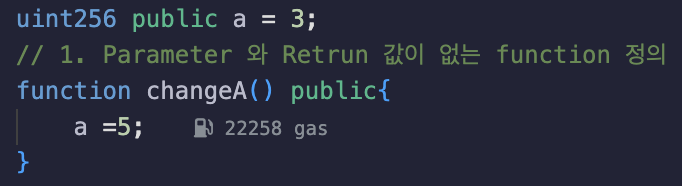

# 4강. function 정의

## 1. Parameter 와 Retrun 값이 없는 function 정의

---

```solidity
function 이름 () public { // (public, private, internal, external) 변경가능
  // 내용
}
```

- 접근제어자를 함수명 뒤에 써준다.
    - 접근제어자: `public`, `private`, `internal`, `external`

### 예제

---

- lec4.sol
    
    ```solidity
    // SPDX-License-Identifier: GPL-3.0
    pragma solidity >= 0.7.0 < 0.9.0;
    
    contract lec4{
    
        /*
        function 이름 () public { // (public, private, internal, external) 변경가능.
          // 내용
        }
        */
        uint256 public a = 3;
        // 1. Parameter 와 Retrun 값이 없는 function 정의
        function changeA() public{
            a =5;
        }
    }
    ```
    
    - changeA()라는 함수를 실행시키면 a는 5가 된다.
        
        
        
- 실행
    - a 클릭, 값은 3
        
        
        
    - changeA 클릭, 26222 gas가 사용됫다.
        
        
        
    - a 클릭, 값은 5
        
        
        

### 참고

---

1. `gas`: 이더리움 네트워크에서 트랜잭션을 실행하기 위해 소모되는 연료
    - 트랜잭션이 실행될 때 필요한 연산을 수행하기 위해 필요한 총 `gas`량, 트랜잭션이 사용 가능한 총 가스량
2. `execution cost`: 스마트 컨트랙트의 실행 로직을 수행하는 데 실제로 사용된 가스량
    - 스마트 컨트랙트의 연산을 처리하는 데 소모되는 가스이므로, 저장(storage) 업데이트, 계산(computation) 등의 비용이 포함된다.
3. `transaction cost`: 트랜잭션을 실행하는 데 필요한 총 가스량
    - `execution cost`와 `base fee` 등이 포함된다.
    - `transaction cost = Gas Used * Gas Price`로 계산되며, 네트워크 상태에 따라 비용이 변동될 수 있다.

- call은 왜 transaction cost가 없는가?
    - 트랜잭션(Transaction)
        - 상태 변경(state change)이 있는 스마트 컨트랙트 함수 실행.
        - EVM이 연산을 수행하고, 그에 대한 가스 비용(transaction cost)이 발생.
        - `changeA()` 같은 상태 변경 함수는 트랜잭션을 발생시키므로 비용이 필요함.
    - 호출(Call)
        - 상태 변경 없이 단순 조회(view function)만 수행.
        - 가스 비용이 발생하지 않음 (transaction cost 없음).
        - `a()` 함수는 스마트 컨트랙트에서 데이터를 조회하는 view function이므로, 네트워크에 트랜잭션을 제출하지 않음.(이더리움 네트워크를 통해 실행되지 않음)
    1. execution cost (2407 gas) 표시 이유
        - "execution cost: 2407 gas"는 컨트랙트 내부에서 다른 컨트랙트가 호출할 때 발생하는 가스 비용을 의미해.
        - 하지만 외부에서 직접 호출하는 경우에는 비용이 발생하지 않음.
        - 즉, "execution cost only applies when called by a contract"(다른 컨트랙트에서 호출할 때만 가스 비용이 발생함)라고 설명이 붙어 있음.

- 조회 함수(Call)에서도 execution cost가 발생하는 이유: EVM(Ethereum Virtual Machine)에서 연산을 수행하는 데는 항상 연산 비용이 필요하기 때문
    - 단, 이 비용은 네트워크에서 소모되는 것이 아니라 로컬에서 연산하는 데 필요한 가스량을 보여주는 것뿐이다.
    1. EVM은 코드 실행에 가스를 필요로 한다
        - 조회 함수(`view` 또는 `pure` 함수)는 네트워크에 트랜잭션을 제출하지 않지만, 여전히 EVM 내부에서는 실행이 이루어짐.
        - 스마트 컨트랙트의 `a()` 함수는 EVM이 내부적으로 실행하면서 가스를 필요로 하지만, 실제 이더리움 네트워크에서 소모되는 것이 아님.
    2. `execution cost`는 가스 사용량을 보여줄 뿐, 비용이 청구되지 않는다
        - 실행 비용(execution cost)은 스마트 컨트랙트가 연산을 수행하는 데 필요한 이론적인 가스량을 나타냄.
        - 하지만 `call`(조회 함수)로 실행된 경우, 네트워크 노드가 이를 무료로 실행해 주므로 실제 ETH가 소모되지 않음.
        - 즉, `execution cost`는 있지만, 실제 트랜잭션이 아니므로 비용이 발생하지 않음.
    3. `execution cost only applies when called by a contract` 메시지의 의미
        - 만약 이 함수를 다른 스마트 컨트랙트가 호출했을 때 소모될 가스량을 미리 보여주는 것.
        - 즉, 컨트랙트 내부에서 이 함수를 호출하면 실제 가스가 필요하지만, 사용자가 직접 호출하는 경우 가스가 소모되지 않음.

## 2. Parameter는 있고, Retrun 값이 없는 function 정의

---

```solidity
function 이름 (받고싶은 타입  변수명 ) public {
  // 내용
}
```

### 예제

---

- lec4.sol
    
    ```solidity
    // SPDX-License-Identifier: GPL-3.0
    pragma solidity >= 0.7.0 < 0.9.0;
    
    contract lec4{
    
        /*
        function 이름 () public { // (public, private, internal, external) 변경가능.
          // 내용
        }
        */
        uint256 public a = 3;
        // 1. Parameter 와 Retrun 값이 없는 function 정의
        function changeA1() public{
            a =5;
        }
    
        // 2. Parameter는 있고, Retrun 값이 없는 function 정의
        function changeA2(uint256 _value) public{
            a =_value;
        }
    }
    ```
    
    - changeA를 실행할때마다, _value의 파라미터 값을 넣어줘야 한다.
        
        
        
- 실행
    - changeA1, a 클릭 후, changeA2 클릭
        
        
        
    - a 클릭, 값은 10
        
        
        

## 3. Parameter는 있고, Retrun 값이 있는 function 정의

---

```solidity
function 이름 (받고싶은 타입  변수명 ) public returns(반환하고자 하는 type) {
  // 내용
}
```

- `returns`에는 변수명이 없고 타입만 써주시면 된다.

### 예제

---

- lec4.sol
    
    ```solidity
    // SPDX-License-Identifier: GPL-3.0
    pragma solidity >= 0.7.0 < 0.9.0;
    
    contract lec4{
    
        /*
        function 이름 () public { // (public, private, internal, external) 변경가능.
          // 내용
        }
        */
        uint256 public a = 3;
        // 1. Parameter 와 Retrun 값이 없는 function 정의
        function changeA1() public{
            a =5;
        }
    
        // 2. Parameter는 있고, Retrun 값이 없는 function 정의
        function changeA2(uint256 _value) public{
            a =_value;
        }
    
        // 3. Parameter는 있고, Retrun 값이 있는 function 정의
        function changeA3(uint256 _value) public returns(uint256){
            a =_value;
            return a;
        }
    }
    ```
    
- 실행
    - _value의 파라미터 값을 받고 a 변수에 _value 파라미터가 대입된 후, a 값이 리턴된다.(`output`)
        
        
        
    - a의 값은 `uint256` 타입이다.
