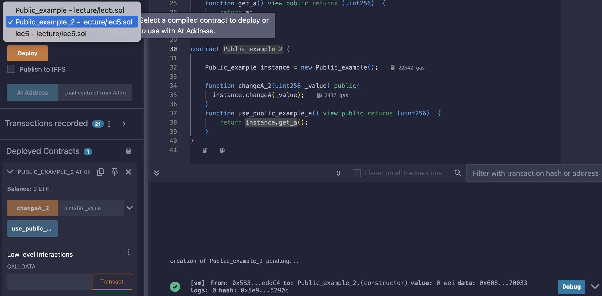

# 5강. function 2 - public, private, internal, external

- 사실 접근제어자는 변수 앞에도 쓰이기도 한다.

## 1. public : 어디서든 접근이 가능하다.

---

```solidity
contract Lec5 {
    uint256 public a = 3;
}
```

- `public`을 정의해줌으로써, 어디서든 접근이 가능한 `getter` 함수를 자동으로 만들어준다.
    
    ```solidity
    function a() external view returns (uint256) {
        return a;
    }
    ```
    

### 예제

---

- Public_example_2 컨트랙트 배포
    
    
    
- 실행
    - 10 넣고 changeA_2 클릭 후, use_public_example_a 클릭 시 결과값은 10
        
        
        

## 2. private: 오직 private이 정의된 스마트 컨트랙에서만 접근가능

---

```solidity
contract Lec5 {
    uint256 private a = 3;
}
```

- `private`을 사용하면, 은닉화 시킬 수 있다. 외부에서 접근이 힘들다.

### 예제

---

- lec5.sol
    
    ```solidity
    // SPDX-License-Identifier: GPL-3.0
    pragma solidity >= 0.7.0 < 0.9.0;
    
    contract lec5{
        /*
        public: 모든곳에서 접근 가능
        external: public 처럼 모든곳에서 접근 가능하나, external이 정의된 자기자신 컨트랙트 내에서 접근 불가
        private: 오직 private이 정의된 자기 컨트랙트에서만 가능 (private이 정의된 컨트랙트를 상속받은 자식도 불가능)
        internal: private처럼 오직 internal이 정의된 자기 컨트랙트에서만 가능하고, internal이 정의된 컨트랙트를 상속
        */
    
        //1. public
        uint256 public a = 5;
    
        //2. private
        uint256 private a2 = 5;
    }
    ```
    
- 실행
    
    
    

## 3. external : 오직 밖에서만 접근 가능

---

```solidity
contract external_example {
    uint256 private a = 3;
    
    function get_a() view external returns (uint256)  {
        return a;
    }

}

contract external_example_2 {
    
    external_example instance = new external_example();

    function external_example_get_a() view public returns (uint256)  {
        return instance.get_a();
    }
}
```

- `external`은 `public`과 성향이 비슷한데, 한가지만 다르다.
    - `external`이 정의된 스마트 컨트랙트 내에서는 사용이 불가능하다.(`private`과 반대)

- 가스 소모량은 다음과 같이 보이는 중이다.
    
    
    
- Public_example 인스턴스를 통해서 Public_example 컨트랙트에 접근이 가능하다.
    - Public_example 컨트랙트는 모든 부분이 `public`이니 쉽게 접근이 가능하다.

### 예제

---

- lec5.sol
    
    ```solidity
    // SPDX-License-Identifier: GPL-3.0
    pragma solidity >= 0.7.0 < 0.9.0;
    
    contract lec5{
        /*
        public: 모든곳에서 접근 가능
        external: public 처럼 모든곳에서 접근 가능하나, external이 정의된 자기자신 컨트랙트 내에서 접근 불가
        private: 오직 private이 정의된 자기 컨트랙트에서만 가능 (private이 정의된 컨트랙트를 상속받은 자식도 불가능)
        internal: private처럼 오직 internal이 정의된 자기 컨트랙트에서만 가능하고, internal이 정의된 컨트랙트를 상속
        */
    
        //1. public
        uint256 public a = 5;
    
        //2. private
        uint256 private a2 = 5; 
    }
    
    contract Public_example {
        uint256 public a = 3;
        
        function changeA(uint256 _value) public {
            a =_value;
        }
        function get_a() view public returns (uint256)  {
            return a;
        }
    }
    
    contract Public_example_2 {
        
        Public_example instance = new Public_example();
    
        function changeA_2(uint256 _value) public{
          instance.changeA(_value);
        }
        function use_public_example_a() view public returns (uint256)  {
            return instance.get_a();
        }
    }
    
    contract external_example {
        uint256 private a = 3;
        
        function get_a() view external returns (uint256)  {
            return a;
        }
    
    }
    
    contract external_example_2 {
        
        external_example instance = new external_example();
    
        function external_example_get_a() view public returns (uint256)  {
            return instance.get_a();
        }
    }
    
    ```
    
- 실행
    - external_example_2 컨트랙트 배포
    - external_example_get_a 클릭 시 결과값은 3
        
        
        
    - external_examle 의 get_a 는 `external`로 정의 되어 있기에, external_example 내에서는 접근이 불가능하다.
        - `DeclarationError: Undeclared identifier` 발생

## 4. **internal : 오직 internal이 정의된 스마트 컨트랙 내에서, 상속받은 자식 스마트 컨트랙에서 접근 가능**

---

- `internal`은 `private`과 비슷하다.
    - `private`에서 상속받은 자식 접근 가능이 더 추가 되었다고 생각하면 된다.
