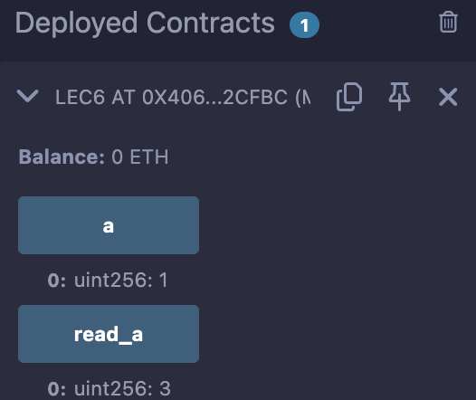

# 6강. function 3 - View 와 Pure

- 접근제한자 앞/뒤에 붙일 수 있다.
    
    ```solidity
    function use_public_example_a() view public returns (uint256)
    function use_public_example_a() public view returns (uint256)
    ```
    

## 1. view : storage state 를 읽을 수 있지만, 그 state 값을 변경할 수 없다.

---

```solidity
contract View_example{
     uint256 public a = 1;

    function read_a() public view returns(uint256){
        return a+2;
    }
}
```

- function 밖에 있는 것들은 storage에 저장된다.

### 예제

---

- lec6.sol
    
    ```solidity
    // SPDX-License-Identifier: GPL-3.0
    pragma solidity >= 0.7.0 < 0.9.0;
    
    contract lec6{
        /*
        function get_a() external view returns (uint256)
        */
    
        /*
        view: function 밖의 변수들을 읽을 수 있으나 변경 불가능
        pure: function 밖의 변수들을 읽지 못하고, 변경도 불가능
        view, pure 둘 다 명시 안할 때: function 밖의 변수들을 읽어서, 변경을 해야 함.
        */
    
        //1. view
        uint256 public a = 1;
    
        function read_a() public view returns(uint256){
            return a+2;
        }
    }
    ```
    
- 실행
    - 이 예제에서는 a가 storage state.
    - read_a는 a를 리턴하니, storage state를 읽었다고 할 수 있다.
        
        
        

- storage state의 값을 바꾼다면, `view`를 안쓰면 된다.
    - `view`, `pure` 둘 다 명시 안할때: `function` 밖의 변수들을 읽어서, 변경을 해야함.

## 2. pure : storage state 를 읽으면 안되고, 그 state값을 변경할 수도 없다.

---

```solidity
contract Pure_example{   
    function read_a() pure public returns(uint256){
        uint256 a = 3;
        return a+2;
    }
}
```

- storage state를 읽지 못하고, 변경도 불가. 함수 밖의 외부의 값을 가져올 수 없다.
- 함수 내에 정의된 로컬변수들만 사용한다.

### 예제

---

- lec6.sol
    
    ```solidity
    // SPDX-License-Identifier: GPL-3.0
    pragma solidity >= 0.7.0 < 0.9.0;
    
    contract lec6{
        /*
        function get_a() external view returns (uint256)
        */
    
        /*
        view: function 밖의 변수들을 읽을 수 있으나 변경 불가능
        pure: function 밖의 변수들을 읽지 못하고, 변경도 불가능
        view, pure 둘 다 명시 안할 때: function 밖의 변수들을 읽어서, 변경을 해야 함.
        */
    
        //1. view
        uint256 public a = 1;
    
        function read_a() public view returns(uint256){
            return a+2;
        }
    
        //2. pure
        function read_a2() pure public returns(uint256){
            uint256 a = 3;
            return a+2;
        }
    
        //3. pure, view: X
        function read_a3() public returns(uint256){
            a = 13;
            return a;
        }
    }
    ```
