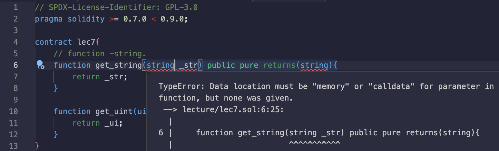

# 7강. 4개의 저장영역과 string

## 4개의 저장영역

---

- solidity 는 `storage`, `memory`, `calldata`, `stack` 이렇게 4개의 저장 영역으로 나뉘어 있다.
    - `storage`: 대부분의 변수, 함수들이 저장되며, 영속적으로 저장되어 가스 비용이 비싸다.
        - `block`에 들어가면 모든 노드들이 그 `block`을 다운로드 받아야 한다.
    - `memory`: 함수의 파라미터, 리턴값, 레퍼런스 타입이 주로 저장된다.
        - `storage`처럼 영속적이지 않고, 함수내에서만 유효하기에 `storage`보다 가스 비용이 싸다.
    - `calldata`: 주로 `external function` 의 파라미터에서 사용된다.
        - 예를 들어, 함수를 실행할 때 파라미터의 값 자체를 `calldata`로 받을 수 있다.
        - `calldata`로 받게 된다면, 값은 변경할 수 없고 읽기만 가능하다.
    - `stack`: EVM 에서 stack data를 관리할 때 쓰는 영역인데, 1024개의 data를 제한적으로 저장해 사용할 수 있다.
        - 예를 들어, 함수를 실행할 때 로컬 변수와 같은 것들을 잠시 기억할 때 EVM이 사용한다.

## string

---

- `string`을 `function` 내에서 쓰려면, `memory`라는 키워드가 필요하다.
    
    
    
    - `string`은 레퍼런스 타입이기 때문에, Solidity가 데이터가 어디에 저장될지 알아야 해서 `memory` 키워드를 넣어줘야 한다.

### 예제

---

- lec7.sol
    
    ```solidity
    // SPDX-License-Identifier: GPL-3.0
    pragma solidity >= 0.7.0 < 0.9.0;
    
    contract lec7{
        // function -string.
        function get_string(string memory _str) public pure returns(string memory){
            return _str;
        }
        
        function get_uint(uint256 _ui) public pure returns(uint256){
            return _ui;
        }
    }
    ```
    
    - 값 타입은 `memory`를 명시하지 않아도 된다. 기본적으로 스택(Stack)에 저장된다.
- 실행
    
    
    

### 참고

---

1. 값 타입: 기본적으로 스택(Stack)에 저장됨
    - 값 타입(Value Type): `uint`, `int`, `bool`, `address`, `enum`, `bytes32`
    - Solidity에서 값 타입은 함수 호출 시 EVM의 스택(Stack)에 저장된다.
    - 즉, 별도로 `memory`를 선언하지 않아도 자동으로 적절한 위치(stack)에 저장됨.
    - 스택(Stack)은 속도가 빠르고 가벼운 저장 방식이기 때문에 Solidity는 기본적으로 값 타입을 스택에 저장하도록 설계되어 있다.
2. 참조 타입: 스택에 저장할 수 없음
    - 참조 타입(Reference Type): `string`, `bytes`, `array`, `struct`, `mapping`
    - 참조 타입은 데이터 크기가 동적이기 때문에 스택에 저장할 수 없음.
    - Solidity는 참조 타입이 어디에 저장될지를 명확히 알아야 하므로 `memory` 또는 `storage`를 명시해줘야 한다.
