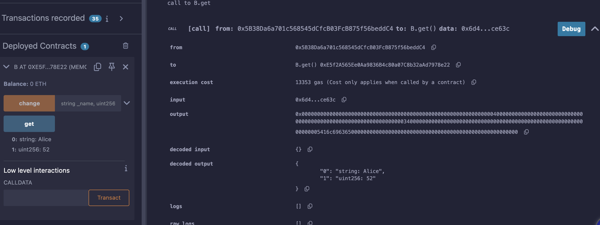

# 9강. instance 2 - constructor

## constructor

---

- 생성자: 스마트 컨트랙트가 생성, 배포, 인스턴스화 될 때 초기값을 설정해주는 용도로 사용된다.
    
    ```solidity
    contract A{
        string public name;
        uint256 public age;
        
        constructor(string memory _name, uint256 _age){
            name = _name;
            age = _age;
        }
    
        function change(string memory _name, uint256 _age) public {
             name = _name;
             age = _age;
        }
    }
    
    contract B{
    
        A instance = new A("Alice", 52);
    
        function change(string memory _name, uint256 _age) public {
            instance.change(_name,_age);
        }
      
      function get() public view returns(string memory, uint256) {
            return (instance.name(), instance.age());
        }
    }
    ```
    
    - A: 생성자를 통해서 파라메터를 받아, name 과 age에 값을 넣어주고 있다.
    - B의 get 함수에서는 여러개의 리턴을 하기에, `returns` 괄호 부분에 리턴하고자 하는 타입을 써주었다.

- 한 블록 당 제한하는 가스 양을 초과하면 스마트 컨트랙트 배포를 못하게 된다.
    - 클론 팩토리 패턴을 통해 가스 소비량을 획기적으로 줄일 수 있다.

## 예제

---

- lec9.sol
    
    ```solidity
    // SPDX-License-Identifier: GPL-3.0
    pragma solidity >= 0.7.0 < 0.9.0;
    
    contract A{
        string public name;
        uint256 public age;
        
        constructor(string memory _name, uint256 _age){
            name = _name;
            age = _age;
        }
    
        function change(string memory _name, uint256 _age) public {
             name = _name;
             age = _age;
        }
    }
    
    contract B{
    
        A instance = new A("Alice", 52);
    
        function change(string memory _name, uint256 _age) public {
            instance.change(_name,_age);
        }
      
      function get() public view returns(string memory, uint256) {
            return (instance.name(), instance.age());
        }
    }
    ```
    
- 실행
    - get 클릭하면 string, uint256 타입을 리턴받는다.
        
        
        
    - change 클릭한 후, get 클릭하면 변경되어 있다.
        
        
