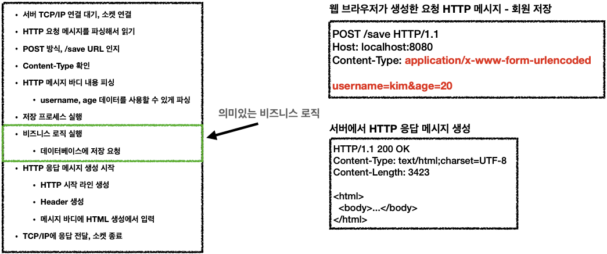

# 1. 웹 애플리케이션 이해

## 웹 서버, 웹 애플리케이션 서버

- 웹 - HTTP 기반
    - 모든 것이 HTTP: HTTP 메시지에 모든 것을 전송
        - HTML, TEXT
        - IMAGE, 음성, 영상, 파일
        - JSON, XML (API)
        - 거의 모든 형태의 데이터 전송 가능
        - 서버간에 데이터를 주고 받을 때도 대부분 HTTP 사용

- 웹 서버(Web Server)
    - HTTP 기반으로 동작
    - 정적 리소스 제공, 기타 부가기능
    - 정적(파일) HTML, CSS, JS, 이미지, 영상
    - ex> NGINX, APACHE
- 웹 애플리케이션 서버(WAS - Web Application Server)
    - HTTP 기반으로 동작
    - 웹 서버 기능 포함+ (정적 리소스 제공 가능)
    - 프로그램 코드를 실행해서 애플리케이션 로직 수행
        - 동적 HTML, HTTP API(JSON)
        - 서블릿, JSP, 스프링 MVC
        - ex> 톰캣(Tomcat) Jetty, Undertow

- 웹 시스템 구성 - WEB, WAS, DB
    - 정적 리소스는 웹 서버가 처리
        - 정적 리소스만 제공하는 웹 서버는 잘 죽지 않음
        - 웹 서버는 애플리케이션 로직같은 동적인 처리가 필요하면 WAS에 요청을 위임
    - WAS는 중요한 애플리케이션 로직 처리 전담
        - 애플리케이션 로직이 동작하는 WAS 서버는 잘 죽음
    - WAS, DB 장애시 WEB 서버가 오류 화면 제공 가능
    - 효율적인 리소스 관리
        - 정적 리소스가 많이 사용되면 Web 서버 증설
        - 애플리케이션 리소스가 많이 사용되면 WAS 증설

## 서블릿

- HTML 폼 데이터 전송 - POST 저장

    ```html
    <form action="/save" method="post">
    	<input type="text" name="username" />
    	<input type="text" name="age" />
    	<button type="submit">전송</button>
    </form>
    ```

    - 웹 브라우저가 생성한 요청 HTTP 메시지

    ```
    POST /save HTTP/1.1
    Host: localhost:8080
    Content-Type: application/x-www-form-urlencoded

    username=kim&age=20
    ```

- 서버에서 처리해야 하는 업무
    - 웹 애플리케이션 서버 직접 구현

        

    - 의미있는 비즈니스 로직을 제외한 부분을 전세계 개발자가 다 구현하긴 비효율적이라 서블릿이 등장한다.
    - 서블릿을 지원하는 WAS 들이 이 자동화를 수행한다.

- 서블릿
    - 특징

        ```java
        @WebServlet(name = "helloServlet", urlPatterns = "/hello")
        public class HelloServlet extends HttpServlet {
        	@Override
        	protected void service(HttpServletRequest request, HttpServletResponse response){
        		//애플리케이션 로직
        	}
        }
        ```

        - urlPatterns(/hello)의 URL이 호출되면 서블릿 코드가 실행
        - HTTP 요청 정보를 편리하게 사용할 수 있는 HttpServletRequest
        - HTTP 응답 정보를 편리하게 제공할 수 있는 HttpServletResponse
        - 개발자는 HTTP 스펙을 매우 편리하게 사용할 수 있게 되었다.
    - HTTP 요청, 응답 흐름: HTTP 요청 도착 시,

      

        - WAS 는 Request, Response 객체를 새로 만들어서 서블릿 객체 호출
        - 개발자는 Request 객체에서 HTTP 요청 정보를 편리하게 꺼내서 사용
        - 개발자는 Response 객체에 HTTP 응답 정보를 편리하게 입력
        - WAS 는 Response 객체에 담겨있는 내용으로 HTTP 응답 정보를 생성

- 서블릿 컨테이너: 서블릿을 지원하는 WAS (ex> 톰캣)
    - 서블릿 컨테이너는 서블릿 객체를 생성, 초기화, 호출, 종료하는 생명주기 관리
    - 서블릿 객체는 **싱글톤으로 관리**
        - 고객의 요청이 올 때 마다 계속 객체를 생성하는 것은 비효율
        - 최초 로딩 시점에 서블릿 객체를 미리 만들어두고 재활용
        - 모든 고객 요청은 동일한 서블릿 객체 인스턴스에 접근 → 공유 변수 사용 주의
        - 서블릿 컨테이너 종료시 함께 종료
    - JSP도 서블릿으로 변환 되어서 사용
    - 동시 요청을 위한 멀티 쓰레드 처리 지원

## 동시 요청 - 멀티 쓰레드

- 스레드
    - 애플리케이션 코드를 하나하나 순차적으로 실행하는 것은 쓰레드
    - 자바 메인 메서드를 처음 실행하면 main이라는 이름의 쓰레드가 실행
    - 쓰레드가 없다면 자바 애플리케이션 실행이 불가능
    - 쓰레드는 한번에 하나의 코드 라인만 수행
    - 동시 처리가 필요하면 쓰레드를 추가로 생성

- 요청마다 쓰레드 생성
    - 장점
        - 동시 요청을 처리할 수 있다.
        - 리소스(CPU, 메모리)가 허용할 때 까지 처리가능
        - 하나의 쓰레드가 지연 되어도, 나머지 쓰레드는 정상 동작한다.
    - 단점
        - 쓰레드는 생성 비용은 매우 비싸다.(CPU 많이 사용) → 고객의 요청이 올 때 마다 쓰레드를 생성하면, 응답 속도가 늦어진다.
        - 쓰레드는 컨텍스트 스위칭 비용이 발생한다.
        - 쓰레드 생성에 제한이 없다. → 고객 요청이 너무 많이 오면, CPU, 메모리 임계점을 넘어서 서버가 죽을 수 있다.

→

- 쓰레드 풀: 요청 마다 쓰레드 생성의 단점 보완
    - 특징
        - 필요한 쓰레드를 쓰레드 풀에 보관하고 관리한다.
        - 쓰레드 풀에 생성 가능한 쓰레드의 최대치를 관리한다. 톰캣은 최대 200개 기본 설정 (변경 가능)
    - 사용
        - 쓰레드가 필요하면, 이미 생성되어 있는 쓰레드를 쓰레드 풀에서 꺼내서 사용한다.
        - 사용을 종료하면 쓰레드 풀에 해당 쓰레드를 반납한다.
        - 최대 쓰레드가 모두 사용중이어서 쓰레드 풀에 쓰레드가 없으면? → 기다리는 요청은 거절하거나 특정 숫자만큼만 대기하도록 설정할 수 있다.
    - 장점
        - 쓰레드가 미리 생성되어 있으므로, 쓰레드를 생성하고 종료하는 비용(CPU)이 절약되고, 응답 시간이 빠르다.
        - 생성 가능한 쓰레드의 최대치가 있으므로 너무 많은 요청이 들어와도 기존 요청은 안전하게 처리할 수 있다.
    - 실무 팁
        - WAS의 주요 튜닝 포인트는 최대 쓰레드(max thread) 수이다.
        - 이 값을 너무 낮게 설정하면? → 동시 요청이 많으면, 서버 리소스는 여유롭지만, 클라이언트는 금방 응답 지연
        - 이 값을 너무 높게 설정하면? → 동시 요청이 많으면, CPU, 메모리 리소스 임계점 초과로 서버 다운
        - 장애 발생시? → 클라우드면 일단 서버부터 늘리고, 이후에 튜닝, 클라우드가 아니면 열심히 튜닝
    - 쓰레드 풀의 적정 숫자
        - 애플리케이션 로직의 복잡도, CPU, 메모리, IO 리소스 상황에 따라 모두 다름
        - 성능 테스트
            - 최대한 실제 서비스와 유사하게 성능 테스트 시도
            - 툴: 아파치 ab, 제이미터, nGrinder

- WAS의 멀티 쓰레드 지원
    - 멀티 쓰레드에 대한 부분은 WAS가 처리
    - **개발자가 멀티 쓰레드 관련 코드를 신경쓰지 않아도 됨**
    - 개발자는 마치 **싱글 쓰레드 프로그래밍을 하듯이 편리하게 소스 코드를 개발**
    - 멀티 쓰레드 환경이므로 싱글톤 객체(서블릿, 스프링 빈)는 주의해서 사용

## HTML, HTTP API, CSR, SSR

- 1. 정적 리소스, 주로 웹 브라우저
    - 고정된 HTML 파일, CSS, JS, 이미지, 영상 등을 제공


- 2. HTML 페이지
    - 동적으로 필요한 HTML 파일을 생성해서 전달
    - 웹 브라우저: HTML 해석


- 3. HTTP API
    - HTML이 아니라 데이터를 전달
        - 데이터만 주고 받음, UI 화면이 필요하면, 클라이언트가 별도 처리
    - 주로 JSON 형식 사용
    - 다양한 시스템에서 호출 → 앱, 웹 클라이언트, 서버 to 서버
        - UI 클라이언트 접점
        - 서버 to 서버

      


→ 백엔드 개발자가 데이터 내려주려고 할 때 고민해야 할 3가지

- SSR: 서버 사이드 렌더링
    - HTML 최종 결과를 서버에서 만들어서 웹 브라우저에 전달
    - 주로 정적인 화면에 사용
    - 관련기술: JSP, 타임리프 > 백엔드 개발자

  

- CSR: 클라이언트 사이드 렌더링
    - HTML 결과를 자바스크립트를 사용해 웹 브라우저에서 동적으로 생성해서 적용
    - 주로 동적인 화면에 사용, 웹 환경을 마치 앱 처럼 필요한 부분부분 변경할 수 있음 ex> 구글 지도, Gmail, 구글 캘린더
    - 관련기술: React, Vue.js → 웹 프론트엔드 개발자

  

## 자바 웹 기술 역사

- 과거 기술
    - 서블릿 - 1997: HTML 생성이 어려움
    - JSP - 1999: HTML 생성은 편리하지만, 비즈니스 로직까지 너무 많은 역할 담당
    - 서블릿, JSP 조합 MVC 패턴 사용: 모델, 뷰 컨트롤러로 역할을 나누어 개발
    - MVC 프레임워크 춘추 전국 시대 - 2000년 초 ~ 2010년 초
        - MVC 패턴 자동화, 복잡한 웹 기술을 편리하게 사용할 수 있는 다양한 기능 지원
        - 스트럿츠, 웹워크, 스프링 MVC(과거 버전)
- 현재 사용 기술
    - 애노테이션 기반의 스프링 MVC 등장
        - @Controller
        - MVC 프레임워크의 춘추 전국 시대 마무리
    - 스프링 부트의 등장
        - 스프링 부트는 서버를 내장
        - 과거에는 서버에 WAS를 직접 설치하고, 소스는 War 파일을 만들어서 설치한 WAS에 배포
        - 스프링 부트는 빌드 결과(Jar)에 WAS 서버 포함 -> 빌드 배포 단순화

- 최신 기술 - 스프링 웹 기술의 분화
    - Web Servlet - Spring MVC
    - Web Reactive - Spring WebFlux
        - 특징
            - 비동기 넌 블러킹 처리
            - 최소 쓰레드로 최대 성능 → 쓰레드 컨텍스트 스위칭 비용 효율화
            - 함수형 스타일로 개발 - 동시처리 코드 효율화
            - 서블릿 기술 사용X
        - But,
            - 웹 플럭스는 기술적 난이도 매우 높음
            - 아직은 RDB 지원 부족
            - 일반 MVC의 쓰레드 모델도 충분히 빠르다.
            - 실무에서 아직 많이 사용하지는 않음 (전체 1% 이하)

- 자바 뷰 템플릿 역사: HTML을 편리하게 생성하는 뷰 기능
    - JSP: 속도 느림, 기능 부족
    - 프리마커(Freemarker), Velocity(벨로시티): 속도 문제 해결, 다양한 기능
    - 타임리프(Thymeleaf)
        - 내추럴 템플릿: HTML의 모양을 유지하면서 뷰 템플릿 적용 가능
        - 스프링 MVC와 강력한 기능 통합
        - 최선의 선택, 단 성능은 프리마커, 벨로시티가 더 빠름


- [Notion link](https://www.notion.so/1-fb347e30d2e04cc8aaf5cde215f47d9e)
