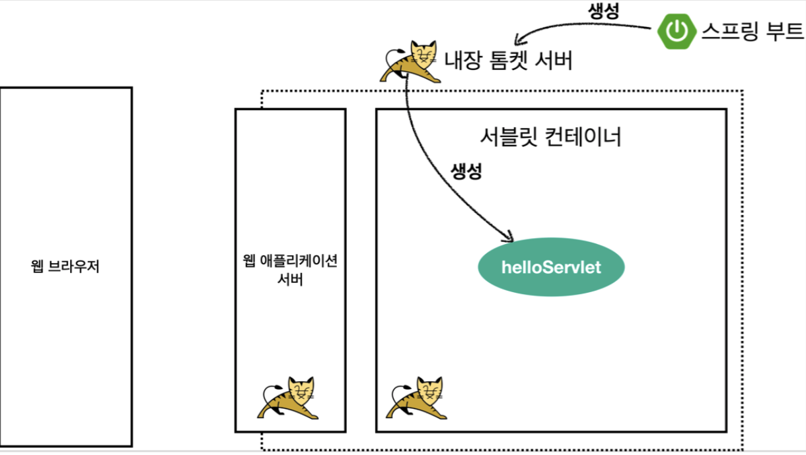

# 2. 서블릿

## 프로젝트 생성

- 사전 준비물
    - Java 11 설치
    - IDE: IntelliJ 또는 Eclipse 설치
- 스프링 부트 스타터 사이트로 이동해서 스프링 프로젝트 생성: [https://start.spring.io](https://start.spring.io/)
    - Project: Gradle Project, Language: Java, Spring Boot: 2.4.x
    - Project Metadata
        - Group: hello
        Artifact: servlet
        Name: servlet
        Package name: hello.servlet
        Packaging: **War (주의!) →** JSP를 실행하기 위해서 필요합니다.
        ****Java: 11
    - Dependencies: Spring Web, Lombok

- 설치 후 IntelliJ Gradle 대신에 자바 직접 실행
    - 최근 IntelliJ 버전은 Gradle을 통해서 실행 하는 것이 기본 설정이다. 이렇게 하면 실행속도가 느리다.
    - Preferences Build, Execution, Deployment Build Tools Gradle
        - Build and run using: Gradle IntelliJ IDEA
        - Run tests using: Gradle IntelliJ IDEA
    - IntelliJ 무료 버전의 경우 해당 설정을 IntelliJ IDEA가 아니라 Gradle로 설정해야 한다.
        - Jar 파일의 경우는 문제가 없는데, War의 경우 톰캣이 정상 시작되지 않는 문제가 발생한다.
        - 또는 build.gradle 에 있는 다음 코드를 제거해도 된다.
            - `providedRuntime 'org.springframework.boot:spring-boot-starter-tomcat'`
- 롬복 적용
    1. Preferences plugin lombok 검색 실행 (재시작)
    2. Preferences Annotation Processors 검색 Enable annotation processing 체크 (재시작)
    3. 임의의 테스트 클래스를 만들고 @Getter, @Setter 확인
- Postman을 설치하자: [https://www.postman.com/downloads](https://www.postman.com/downloads)


## Hello 서블릿

- 스프링 부트 환경에서 서블릿 등록, 사용
    - 서블릿은 톰캣 같은 웹 애플리케이션 서버를 직접 설치하고, 그 위에 서블릿 코드를 클래스 파일로 빌드해서 올린 다음, 톰캣 서버를 실행하면 된다. 하지만 이 과정은 매우 번거롭다.
    - 스프링 부트는 톰캣 서버를 내장하고 있으므로, 톰캣 서버 설치 없이 편리하게 서블릿 코드를 실행할 수 있다.

- 스프링 부트 서블릿 환경 구성
    - `@ServletComponentScan`: 스프링 부트는 서블릿을 직접 등록해서 사용할 수 있도록 지원한다. 서블릿 자동 등록.
        - hello.servlet.ServletApplication

            ```java
            @ServletComponentScan
            @SpringBootApplication
            public class ServletApplication {

                public static void main(String[] args) {
                    SpringApplication.run(ServletApplication.class, args);
                }
            }
            ```

- 서블릿 등록하기
    - hello.servlet.basic.HelloServlet

        ```java
        @WebServlet(name = "helloServlet", urlPatterns = "/hello")
        public class HelloServlet extends HttpServlet {

            @Override
            protected void service(HttpServletRequest request, HttpServletResponse response) throws ServletException, IOException {
                System.out.println("HelloServlet.service");

                // http://localhost:8080/hello
                // tomcat, jetty, undertow 같은 was 가 서블릿 표준 스펙을 구현하는데, 그 구현체가 찍힌다.
                // request = org.apache.catalina.connector.RequestFacade@2e7be4e5
                // response = org.apache.catalina.connector.ResponseFacade@4b34af1a
                System.out.println("request = " + request);
                System.out.println("response = " + response);

                // http://localhost:8080/hello?username=kim
                // 서블릿은 쿼리 파라미터를 읽기 편하게 지원해준다.
                String username = request.getParameter("username");
                System.out.println("username = " + username);

                // Header 정보에 들어간다.
                response.setContentType("text/plain");
                response.setCharacterEncoding("utf-8");
                // HTTP message body 에 데이터가 들어간다.
                response.getWriter().write("hello "+username);
            }
        }
        ```

    - `@WebServlet`: 서블릿 애노테이션
        - name: 서블릿 이름
        - urlPatterns: URL 매핑
    - `protected void service(HttpServletRequest request, HttpServletResponse response)`: HTTP 요청을 통해 매핑된 URL 이 호출되면 서블릿 컨테이너는 이 메서드를 실행한다.
- HTTP 요청 메시지 로그로 확인하기
    - `application.properties`: 아래처럼 logging 설정하면 해당 옵션으로 아파치 로그가 찍힌다.

        ```yaml
        logging.level.org.apache.coyote.http11=debug
        ```

### 서블릿 컨테이너 동작 방식 설명

---

- 내장 톰캣 서버 생성

    

    - 스프링 부트가 실행되면서 내장 톰캣 서버를 실행시켜 준다.
    - 내장 톰캣 서버는 서블릿 컨테이너를 가지고 있고, 이를 통해서 서블릿들을 다 생성해준다.
- HTTP 요청, HTTP 응답 메시지

    

- 웹 애플리케이션 서버의 요청 응답 구조
  
    

- HTTP 응답에서 Content-Length는 웹 애플리케이션 서버가 자동으로 생성해준다.

- welcome 페이지 추가
    - webapp 경로에 index.html 을 두면 [http://localhost:8080](http://localhost:8080/) 호출시 index.html 페이지가 열린다.
    - main/webapp/index.html

        ```html
        <!DOCTYPE html>
        <html>
        <head>
        	<meta charset="UTF-8">
          <title>Title</title>
        </head>
        <body>
        <ul>
        	<li><a href="basic.html">서블릿 basic</a></li>
        </ul>
        </body>
        </html>
        ```

    - main/webapp/basic.html

        ```html
        <!DOCTYPE html>
        <html>
        <head>
            <meta charset="UTF-8">
            <title>Title</title>
        </head>
        <body>
        <ul>
            <li>hello 서블릿
                <ul>
                    <li><a href="/hello?username=servlet">hello 서블릿 호출</a></li>
                </ul>
            </li>
            <li>HttpServletRequest
                <ul>
                    <li><a href="/request-header">기본 사용법, Header 조회</a></li>
                    <li>HTTP 요청 메시지 바디 조회
                        <ul>
                            <li><a href="/request-param?username=hello&age=20">GET -
                                쿼리 파라미터</a></li>
                            li>
                            <li><a href="/basic/hello-form.html">POST - HTML Form</a></
                            <li>HTTP API - MessageBody -> Postman 테스트</li>
                        </ul>
                    </li>
                </ul>
            </li>
            <li>HttpServletResponse
                <ul>
                    <li><a href="/response-header">기본 사용법, Header 조회</a></li>
                    <li>HTTP 요청 메시지 바디 조회
                        <ul>
                            <li><a href="/response-html">HTML 응답</a></li>
                            <li><a href="/response-json">HTTP API JSON 응답</a></li>
                        </ul>
                    </li>
                </ul>
            </li>
        </ul>
        </body>
        </html>
        ```


## HttpServletRequest

### 개요

---

- HttpServletRequest 역할
    - HTTP 요청 메시지를 개발자가 직접 파싱해서 사용해도 되지만, 매우 불편할 것이다.
    - 서블릿은 개발자가 HTTP 요청 메시지를 편리하게 사용할 수 있도록 개발자 대신에 HTTP 요청 메시지를 파싱한다.
    - 그리고 그 결과를 HttpServletRequest 객체에 담아서 제공한다.
1. HttpServletRequest를 사용하면 다음과 같은 HTTP 요청 메시지를 편리하게 조회할 수 있다.
    - HTTP 요청 메시지

        ```
        POST /save HTTP/1.1
        Host: localhost:8080
        Content-Type: application/x-www-form-urlencoded

        username=kim&age=20
        ```

        - START LINE
            - HTTP 메소드
            - URL
            - 쿼리 스트링
            - 스키마, 프로토콜
        - 헤더
            - 헤더 조회
        - 바디
            - form 파라미터 형식 조회
            - message body 데이터 직접 조회
2. HttpServletRequest 객체는 추가로 여러가지 부가기능도 함께 제공한다.
    - 임시 저장소 기능
        - 해당 HTTP 요청이 시작부터 끝날 때 까지 유지되는 임시 저장소 기능
        - HTTP 요청 메세지 안에 작은 저장소가 있다.
        - 저장: `request.setAttribute(name, value)`
        조회: `request.getAttribute(name)`
    - 세션 관리 기능
        - `request.getSession(create: true)`

### 기본 사용법

---

- HttpServletRequest가 제공하는 기본 기능
    - hello.servlet.basic.request.RequestHeaderServlet

        ```java
        // http://localhost:8080/request-header?username=hello
        @WebServlet(name = "requestHeaderServlet", urlPatterns = "/request-header")
        public class RequestHeaderServlet extends HttpServlet {

            @Override
            protected void service(HttpServletRequest request, HttpServletResponse response) throws ServletException, IOException {
                printStartLine(request);
                printHeaders(request);
                printHeaderUtils(request);
                printEtc(request);

                response.getWriter().write("ok");
            }
        }
        ```

    - start-line 정보

        ```java
        private void printStartLine(HttpServletRequest request) {
            System.out.println("--- REQUEST-LINE - start ---");
            System.out.println("request.getMethod() = " + request.getMethod()); //GET
            System.out.println("request.getProtocal() = " + request.getProtocol()); // HTTP/1.1
            System.out.println("request.getScheme() = " + request.getScheme()); //http

            // http://localhost:8080/request-header
            System.out.println("request.getRequestURL() = " + request.getRequestURL());
            // /request-test
            System.out.println("request.getRequestURI() = " + request.getRequestURI());
            //username=hi
            System.out.println("request.getQueryString() = " + request.getQueryString());
            System.out.println("request.isSecure() = " + request.isSecure()); //https 사용 유무
            System.out.println("--- REQUEST-LINE - end ---");
            System.out.println();
        }
        ```

        ```
        --- REQUEST-LINE - start ---
        request.getMethod() = GET
        request.getProtocal() = HTTP/1.1
        request.getScheme() = http
        request.getRequestURL() = http://localhost:8080/request-header request.getRequestURI() = /request-header request.getQueryString() = username=hello
        request.isSecure() = false --- REQUEST-LINE - end ---
        ```

    - 헤더 정보

        ```java
        private void printHeaders(HttpServletRequest request) {
            System.out.println("--- Headers - start ---");

            /*
                Enumeration<String> headerNames = request.getHeaderNames();
                while (headerNames.hasMoreElements()) {
                    String headerName = headerNames.nextElement();
                    System.out.println(headerName + ": " + request.getHeader(headerName));
                }
            */

            request.getHeaderNames().asIterator()
                    .forEachRemaining(headerName -> System.out.println(headerName + ":" +
                            request.getHeader(headerName)));
            System.out.println("--- Headers - end ---");
            System.out.println();
        }
        ```

        ```
        --- Headers - start ---
        host: localhost:8080
        connection: keep-alive
        cache-control: max-age=0
        sec-ch-ua: "Chromium";v="88", "Google Chrome";v="88", ";Not A Brand";v="99" sec-ch-ua-mobile: ?0
        upgrade-insecure-requests: 1
        user-agent: Mozilla/5.0 (Macintosh; Intel Mac OS X 11_2_0) AppleWebKit/537.36 (KHTML, like Gecko) Chrome/88.0.4324.150 Safari/537.36
        accept: text/html,application/xhtml+xml,application/xml;q=0.9,image/avif,image/ webp,image/apng,*/*;q=0.8,application/signed-exchange;v=b3;q=0.9 sec-fetch-site: none
        sec-fetch-mode: navigate
        ---
         sec-fetch-user: ?1
        sec-fetch-dest: document
        accept-encoding: gzip, deflate, br
        accept-language: ko,en-US;q=0.9,en;q=0.8,ko-KR;q=0.7 --- Headers - end ---
        ```

    - Header 편리한 조회

        ```java
        private void printHeaderUtils(HttpServletRequest request) {
            System.out.println("--- Header 편의 조회 start ---");
            System.out.println("[Host 편의 조회]");
            System.out.println("request.getServerName() = " + request.getServerName()); //Host 헤더
            System.out.println("request.getServerPort() = " + request.getServerPort()); //Host 헤더
            System.out.println();

            System.out.println("[Accept-Language 편의 조회]");
            request.getLocales().asIterator()
                    .forEachRemaining(locale -> System.out.println("locale = " + locale));
            System.out.println("request.getLocale() = " + request.getLocale());
            System.out.println();

            System.out.println("[cookie 편의 조회]");
            if (request.getCookies() != null) {
                for (Cookie cookie : request.getCookies()) {
                    System.out.println(cookie.getName() + ": " + cookie.getValue());
                }
            }
            System.out.println();

            System.out.println("[Content 편의 조회]");
            System.out.println("request.getContentType() = " + request.getContentType());
            System.out.println("request.getContentLength() = " + request.getContentLength());
            System.out.println("request.getCharacterEncoding() = " + request.getCharacterEncoding());
            System.out.println("--- Header 편의 조회 end ---");
            System.out.println();
        }
        ```

        ```
        --- Header 편의 조회 start ---
        [Host 편의 조회] request.getServerName() = localhost request.getServerPort() = 8080
        [Accept-Language 편의 조회] locale = ko
        locale = en_US
        locale = en
        locale = ko_KR request.getLocale() = ko
        [cookie 편의 조회]
        [Content 편의 조회] request.getContentType() = null request.getContentLength() = -1 request.getCharacterEncoding() = UTF-8 --- Header 편의 조회 end ---
        ```

    - 기타 정보: 기타 정보는 HTTP 메시지의 정보는 아니다.

        ```java
        private void printEtc(HttpServletRequest request) {
            System.out.println("--- 기타 조회 start ---");

            System.out.println("[Remote 정보]");
            System.out.println("request.getRemoteHost() = " + request.getRemoteHost()); //
            System.out.println("request.getRemoteAddr() = " + request.getRemoteAddr()); //
            System.out.println("request.getRemotePort() = " + request.getRemotePort()); //
            System.out.println();

            System.out.println("[Local 정보]");
            System.out.println("request.getLocalName() = " + request.getLocalName()); //
            System.out.println("request.getLocalAddr() = " + request.getLocalAddr()); //
            System.out.println("request.getLocalPort() = " + request.getLocalPort()); //

            System.out.println("--- 기타 조회 end ---");
            System.out.println();
        }
        ```

        ```
        --- 기타 조회 start ---
        [Remote 정보]
        request.getRemoteHost() = 0:0:0:0:0:0:0:1
        request.getRemoteAddr() = 0:0:0:0:0:0:0:1
        request.getRemotePort() = 54305

        [Local 정보]
        request.getLocalName() = localhost
        request.getLocalAddr() = 0:0:0:0:0:0:0:1
        request.getLocalPort() = 8080
        --- 기타 조회 end ---
        ```

- `-Djava.net.preferIPv4Stack=true`: 로컬에서 테스트하면 IPv6 정보가 나오는데, IPv4 정보를 보고 싶으면 다음 옵션을 VM options에 넣어주면 된다.


## HTTP 요청 데이터

### 개요

---

- GET - 쿼리 파라미터
    - /url`?username=hello&age=20`
    - 메시지 바디 없이, URL 의 쿼리 파라미터에 데이터를 포함해서 전달
    - ex> 검색, 필터, 페이징 등에서 많이 사용하는 방식
- POST - HTML Form

    

    - content-type: `application/x-www-form-urlencoded`
    - 메시지 바디에 쿼리 파리미터 형식으로 전달 `username=hello&age=20`
    - ex> 회원 가입, 상품 주문, HTML Form 사용
- HTTP message body 에 데이터를 직접 담아서 요청
    - HTTP API에서 주로 사용, JSON, XML, TEXT
    - 데이터 형식은 주로 JSON 사용
    - POST, PUT, PATCH

### GET 쿼리 파라미터

---

- [http://localhost:8080/request-param?username=hello&age=20](http://localhost:8080/request-param?username=hello&age=20)
    - 쿼리 파라미터는 URL에 다음과 같이 `?`를 시작으로 보낼 수 있다.
    - 추가 파라미터는 `&`로 구분하면 된다.

- 쿼리 파라미터 조회 메서드: 서버에서는 HttpServletRequest 가 제공하는 메서드를 통해 쿼리 파라미터를 편리하게 조회할 수 있다.
    - 단일 파라미터 조회: `String username = request.getParameter("username");`
    - 파라미터 이름들 모두 조회: `Enumeration<String> parameterNames = request.getParameterNames();`
    - 파라미터를 Map 으로 조회: `Map<String, String[]> parameterMap = request.getParameterMap();`
    - 복수 파라미터 조회: `String[] usernames = request.getParameterValues("username");`
    - RequestParamServlet

        ```java
        /**
         * 1. 파라미터 전송 기능
         * http://localhost:8080/request-param?username=hello&age=20
         * <p>
         * 2. 동일한 파라미터 전송 가능
         * http://localhost:8080/request-param?username=hello&username=kim&age=20
         */
        @WebServlet(name = "requestParamServlet", urlPatterns = "/request-param")
        public class RequestParamServlet extends HttpServlet {
            @Override
            protected void service(HttpServletRequest request, HttpServletResponse resp) throws ServletException, IOException {
                System.out.println("[전체 파라미터 조회] - start");

                /*
                Enumeration<String> parameterNames = request.getParameterNames(); while (parameterNames.hasMoreElements()) {
                 String paramName = parameterNames.nextElement();
                System.out.println(paramName + "=" + request.getParameter(paramName));
                } */

                request.getParameterNames().asIterator()
                        .forEachRemaining(paramName -> System.out.println(paramName + "=" + request.getParameter(paramName)));
                System.out.println("[전체 파라미터 조회] - end");
                System.out.println();

                System.out.println("[단일 파라미터 조회]");
                String username = request.getParameter("username");
                System.out.println("request.getParameter(username) = " + username);

                String age = request.getParameter("age");
                System.out.println("request.getParameter(age) = " + age);
                System.out.println();

                System.out.println("[이름이 같은 복수 파라미터 조회]");
                System.out.println("request.getParameterValues(username)");
                String[] usernames = request.getParameterValues("username");
                for (String name : usernames) {
                    System.out.println("username=" + name);
                }

                resp.getWriter().write("ok");
            }
        ```

        ```
        [전체 파라미터 조회] - start
        username=hello
        age=20
        [전체 파라미터 조회] - end

        [단일 파라미터 조회]
        request.getParameter(username) = hello
        request.getParameter(age) = 20

        [이름이 같은 복수 파라미터 조회]
        request.getParameterValues(username)
        username=hello
        ```

        ```
        [전체 파라미터 조회] - start
        username=hello
        age=20
        [전체 파라미터 조회] - end

        [단일 파라미터 조회]
        request.getParameter(username) = hello
        request.getParameter(age) = 20

        [이름이 같은 복수 파라미터 조회]
        request.getParameterValues(username)
        username=hello
        username=kim
        ```

    - username=hello&username=kim 같이 복수 파라미터 요청에서 단일 파라미터 조회 시
        - `request.getParameter()` 는 하나의 파라미터 이름에 대해서 단 하나의 값만 있을 때 사용해야 한다.
        - 위처럼 중복일 때는 `request.getParameterValues()` 를 사용해야 한다.
        - 중복일 때 `request.getParameter()` 를 사용하면 `request.getParameterValues()` 의 첫 번째 값을 반환한다.

### POST HTML Form

---

- [http://localhost:8080/basic/hello-form.html](http://localhost:8080/basic/hello-form.html)
    - src/main/webapp/basic/hello-form.html

        ```html
        <!DOCTYPE html>
        <html>
        <head>
            <meta charset="UTF-8">
            <title>Title</title>
        </head>
        <body>
        <form action="/request-param" method="post">
            username: <input type="text" name="username" />
            age: <input type="text" name="age" />
            <button type="submit">전송</button>
        </form>
        </body>
        </html>
        ```

    - 웹 브라우저가 결과를 캐시하고 있어서, 과거에 작성했던 html 결과가 보이는 경우도 있다.
        - 이 때는 웹 브라우저의 새로고침을 해주면 된다.
        - 물론 서버를 재시작하지 않아서 그럴 수도 있다.
- POST 의 HTML Form 을 전송하면 웹 브라우저는 다음 형식으로 HTTP 메시지를 만든다.(웹 브라우저 개발자 모드 확인)
    - 요청 URL: [http://localhost:8080/request-param](http://localhost:8080/request-param)
    - content-type: `application/x-www-form-urlencoded`
    - message body: `username=hello&age=20`

- `application/x-www-form-urlencoded` 형식은 앞서 GET에서 살펴본 쿼리 파라미터 형식과 같다.
    - 따라서 **쿼리 파라미터 조회 메서드를 그대로 사용**하면 된다.
    - 클라이언트(웹 브라우저) 입장에서는 두 방식에 차이가 있지만, 서버 입장에서는 둘의 형식이 동일하므로,
    `request.getParameter()` 로 편리하게 구분없이 조회할 수 있다.

→ `request.getParameter()`는 GET URL 쿼리 파라미터 형식도 지원하고, POST HTML Form 형식도 지원한다.

- content-type 은 HTTP 메시지 바디의 데이터 형식을 지정한다.
    - **GET URL 쿼리 파라미터 형식**으로 클라이언트에서 서버로 데이터를 전달할 때는 HTTP 메시지 바디를 사용하지 않기 때문에 content-type 이 없다.
    - **POST HTML Form 형식**으로 데이터를 전달하면 HTTP 메시지 바디에 해당 데이터를 포함해서 보내기 때문에 바디에 포함된 데이터가 어떤 형식인지 content-type 을 꼭 지정해야 한다. 이렇게 폼으로 데이터를 전송하는 형식을 `application/x-www-form-urlencoded` 라 한다.
- Postman 테스트 주의사항
    - POST 전송시 Body → `x-www-form-urlencoded` 선택, Headers 의 content-type 확인

### API 메시지 바디 - 단순 텍스트

---

- HTTP 메시지 바디의 데이터를 InputStream 을 사용해서 직접 읽을 수 있다.
- POST [http://localhost:8080/request-body-string](http://localhost:8080/request-body-string)
    - RequestBodyStringServlet

        ```java
        @WebServlet(name = "requestBodyStringServlet", urlPatterns = "/request-body- string")
        public class RequestBodyStringServlet extends HttpServlet {
            @Override
            protected void service(HttpServletRequest request, HttpServletResponse response) throws ServletException, IOException {
                ServletInputStream inputStream = request.getInputStream();
                String messageBody = StreamUtils.copyToString(inputStream, StandardCharsets.UTF_8);
         
                System.out.println("messageBody = " + messageBody);
                
                response.getWriter().write("ok");
            }
        }
        ```

    - 요청 시 결과는 `messageBody = hello`다.
        - content-type: text/plain
        - message body: hello
- inputStream은 byte 코드를 반환한다.
    - byte 코드를 우리가 읽을 수 있는 문자(String)로 보려면 문자표(Charset)를 지정해주어야 한다.
    - 여기서는 UTF_8 을 지정해주었다.

### API 메시지 바디 - JSON

---

- JSON 형식 파싱 추가
    - hello.servlet.basic.HelloData

        ```java
        @Getter
        @Setter
        public class HelloData {
            private String username;
            private int age;
        }
        ```

    - lombok이 제공하는 @Getter , @Setter 덕분에 다음 코드가 자동으로 추가된다.(눈에 보이지는 않는다)
- POST [http://localhost:8080/request-body-json](http://localhost:8080/request-body-json)
    - RequestBodyJsonServlet

        ```java
        /**
         * http://localhost:8080/request-body-json *
         * JSON 형식 전송
         * content-type: application/json
         * message body: {"username": "hello", "age": 20} *
         */
        @WebServlet(name = "requestBodyJsonServlet", urlPatterns = "/request-body- json")
        public class RequestBodyJsonServlet extends HttpServlet {

            private ObjectMapper objectMapper = new ObjectMapper();

            @Override
            protected void service(HttpServletRequest request, HttpServletResponse response) throws ServletException, IOException {
                ServletInputStream inputStream = request.getInputStream();
                String messageBody = StreamUtils.copyToString(inputStream, StandardCharsets.UTF_8);

                System.out.println("messageBody = " + messageBody);

                HelloData helloData = objectMapper.readValue(messageBody, HelloData.class);
                System.out.println("helloData.username = " + helloData.getUsername());
                System.out.println("helloData.age = " + helloData.getAge());

                response.getWriter().write("ok");
            }
        }
        ```

        ```
        messageBody={"username": "hello", "age": 20} data.username=hello
        data.age=20
        ```

    - 요청 시 결과는 `messageBody = {"username": "hello", "age": 20}`다.
        - content-type: **application/json**
        - message body: {"username": "hello", "age": 20}

- JSON 결과를 파싱해서, 사용할 수 있는 자바 객체로 변환하려면 Jackson, Gson 같은 JSON 변환 라이브러리를 추가해서 사용해야 한다.
    - 스프링 부트로 Spring MVC를 선택하면 기본으로 Jackson 라이브러리(ObjectMapper)를 함께 제공한다.
- HTML form 데이터도 메시지 바디를 통해 전송되므로 직접 읽을 수 있다
    - 하지만 편리한 파리미터 조회 기능 `request.getParameter()`을 이미 제공하기 때문에 파라미터 조회 기능을 사용하면 된다.


## HttpServletResponse

- HttpServletResponse 역할
    - HTTP 응답 메시지 생성
        - HTTP 응답코드 지정
        - 헤더 생성
        - 바디 생성
    - 편의 기능 제공
        - Content-type, 쿠키, Redirect(3xx)

### 기본 사용법

---

- hello.servlet.basic.response.ResponseHeaderServlet

    ```java
    /**
     * http://localhost:8080/response-header
     */
    @WebServlet(name = "responseHeaderServlet", urlPatterns = "/response-header")
    public class ResponseHeaderServlet extends HttpServlet {
        @Override
        protected void service(HttpServletRequest request, HttpServletResponse response) throws ServletException, IOException {
            //[status-line]
            response.setStatus(HttpServletResponse.SC_OK); // 매직넘버 200 대신 의미있는 값으로 쓰자!

            //[response-headers]
            response.setHeader("Content-Type", "text/plain;charset=utf-8");
            // 캐시를 아예 무효화하겠다 정의
            response.setHeader("Cache-Control", "no-cache, no-store, must- revalidate");
            response.setHeader("Pragma", "no-cache"); // 과거 버전까지 캐시 무효화해주는 부분
            response.setHeader("my-header", "hello");

            //[Header 편의 메서드]
            content(response);
            cookie(response);
            redirect(response);   // 여기 활성화 시 리다이렉트 된다.

            //[message body]
            PrintWriter writer = response.getWriter();
            writer.println("ok");
        }
    }
    ```

- 편의 기능
    - Content 편의 메서드

        ```java
        private void content(HttpServletResponse response) {
            //Content-Type: text/plain;charset=utf-8
            //Content-Length: 2
            // 이 헤더 부분은 아래의 2줄로 나눠 나타낼 수 있다.
            //response.setHeader("Content-Type", "text/plain;charset=utf-8");
            response.setContentType("text/plain");
            response.setCharacterEncoding("utf-8");
            //response.setContentLength(2); //(생략시 자동 생성)
        }
        ```

    - 쿠키 편의 메서드

        ```java
        private void cookie(HttpServletResponse response) {
            // 이 쿠키 부분은 아래와 같이 나타낼 수 있다.
            //Set-Cookie: myCookie=good; Max-Age=600; //response.setHeader("Set-Cookie", "myCookie=good; Max-Age=600");
            Cookie cookie = new Cookie("myCookie", "good");
            cookie.setMaxAge(600); //600초
            response.addCookie(cookie);
        }
        ```

    - redirect 편의 메서드

        ```java
        private void redirect(HttpServletResponse response) throws IOException {
            //Status Code 302
            //Location: /basic/hello-form.html

            // 이 redirect 하는 부분은 이렇게 한줄로 표현할 수 있다.
            //response.setStatus(HttpServletResponse.SC_FOUND); //302
            //response.setHeader("Location", "/basic/hello-form.html");
            response.sendRedirect("/basic/hello-form.html");
        }
        ```


## HTTP 응답 데이터

### 개요

---

- 단순 텍스트 응답: `writer.println("ok");`
- HTML 응답
- HTTP API - MessageBody JSON 응답

### HTML 응답

---

- [http://localhost:8080/response-html](http://localhost:8080/response-html)
    - hello.servlet.web.response.ResponseHtmlServlet

        ```java
        @WebServlet(name = "responseHtmlServlet", urlPatterns = "/response-html")
        public class ResponseHtmlServlet extends HttpServlet {
            @Override
            protected void service(HttpServletRequest request, HttpServletResponse response) throws ServletException, IOException {
                //Content-Type: text/html;charset=utf-8
                response.setContentType("text/html");
                response.setCharacterEncoding("utf-8");

                PrintWriter writer = response.getWriter();
                writer.println("<html>");
                writer.println("<body>");
                writer.println(" <div>안녕?</div>");
                writer.println("</body>");
                writer.println("</html>");
            }
        }
        ```

    - 페이지 소스보기를 사용하면 결과 HTML을 확인할 수 있다.
- HTTP 응답으로 HTML을 반환할 때는 content-type을 `text/html` 로 지정해야 한다.

### API JSON

---

- [http://localhost:8080/response-json](http://localhost:8080/response-json)
    - hello.servlet.web.response. ResponseJsonServlet

        ```java
        /**
         * http://localhost:8080/response-json
         */
        @WebServlet(name = "responseJsonServlet", urlPatterns = "/response-json")
        public class ResponseJsonServlet extends HttpServlet {
            private ObjectMapper objectMapper = new ObjectMapper();

            @Override
            protected void service(HttpServletRequest request, HttpServletResponse response) throws ServletException, IOException {
                //Content-Type: application/json
                response.setHeader("content-type", "application/json");
                // 출력 시 response.getWriter().write(result); 로 사용하고,
                // 이 부분 주석 시, Content-Type: application/json;charset=ISO-8859-1 로 자동 추가해버린다.
        //        response.setCharacterEncoding("utf-8");

                HelloData data = new HelloData();
                data.setUsername("kim");
                data.setAge(20);

                //{"username":"kim","age":20}
                // 객체를 문자열로 바꾸는 부분
                String result = objectMapper.writeValueAsString(data);

        //        response.getWriter().write(result);
                // 이렇게 사용 시 Response Header 의 Content-Type: application/json
                response.getOutputStream().write(result.getBytes());
            }
        }
        ```

- HTTP 응답으로 JSON을 반환할 때는 content-type을 `application/json`로 지정해야 한다.
- Jackson 라이브러리가 제공하는 `objectMapper.writeValueAsString()`를 사용하면 객체를 JSON 문자로 변경할 수 있다.

- `application/json`은 스펙상 utf-8 형식을 사용하도록 정의되어 있다.
    - 그래서 스펙에서 `charset=utf-8`과 같은 추가 파라미터를 지원하지 않는다.
    - `application/json;charset=utf-8`이라고 전달하는 것은 의미 없는 파라미터를 추가한 것이 된다.

→ `response.getWriter()`를 사용하면 추가 파라미터를 자동으로 추가해버린다.

이 때는 `response.getOutputStream()`으로 출력하면 그런 문제가 없다.


- [Notion link](https://www.notion.so/2-3ac3da623df54b379e9f2bde9298a931)
