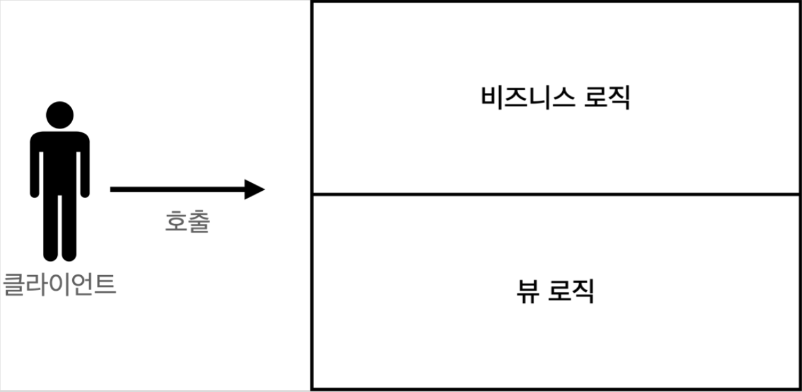

# 3. 서블릿, JSP, MVC 패턴

## 회원 관리 웹 애플리케이션

### 요구사항

---

- 회원 도메인 모델
- 회원 저장소

    ```java
    /**
     * 동시성 문제가 고려되어 있지 않음, 실무에서는 ConcurrentHashMap, AtomicLong 사용 고려
     */
    public class MemberRepository {
        private static Map<Long, Member> store = new HashMap<>(); //static 사용
        private static long sequence = 0L; //static 사용
        private static final MemberRepository instance = new MemberRepository();

        public static MemberRepository getInstance() {
            return instance;
        }

        // 위처럼 싱글톤 만들려면 생성자는 막아놔야 한다.
        // 싱글톤이라 변수 선언시 static 안해도 되지만, 한 단계 더 체크해주자!
        private MemberRepository() {
        }

        public Member save(Member member) {
            member.setId(++sequence);
            store.put(member.getId(), member);
            return member;
        }

        public Member findById(Long id) {
            return store.get(id);
        }

        public List<Member> findAll() {
            return new ArrayList<>(store.values());
        }

        public void clearStore() {
            store.clear();
        }
    }
    ```

    - 싱글톤 패턴 적용. 스프링을 사용하면 스프링 빈으로 등록하면 되지만, 지금은 최대한 스프링 없이 순수 서블릿 만으로 구현한다.
    - 싱글톤 패턴은 객체를 단 하나만 생생해서 공유해야 하므로 생성자를 private 접근자로 막아둔다.
- 회원 저장소 테스트 코드

    ```java
    package hello.servlet.domain.member;

    import org.junit.jupiter.api.AfterEach;
    import org.junit.jupiter.api.Test;

    import java.util.List;

    import static org.assertj.core.api.Assertions.assertThat;

    class MemberRepositoryTest {

        MemberRepository memberRepository = MemberRepository.getInstance();

        @AfterEach
        void afterEach() {
            memberRepository.clearStore();
        }

        @Test
        void save() {
            //given
            Member member = new Member("hello", 20);

            //when
            Member savedMember = memberRepository.save(member);

            //then
            Member findMember = memberRepository.findById(savedMember.getId());
            assertThat(findMember).isEqualTo(savedMember);
        }

        @Test
        void findAll() {
            //given
            Member member1 = new Member("member1", 20);
            Member member2 = new Member("member2", 30);

            memberRepository.save(member1);
            memberRepository.save(member2);

            //when
            List<Member> result = memberRepository.findAll();

            //then
            assertThat(result.size()).isEqualTo(2);
            assertThat(result).contains(member1, member2);
        }
    }
    ```

    - 각 테스트가 끝날 때 clearStore() 호출해서 , 다음 테스트에 영향을 주지 않도록 저장소 초기화.

### 서블릿으로 만들기

---

- [http://localhost:8080/servlet/members/new-form](http://localhost:8080/servlet/members/new-form)
    - MemberFormServlet: 회원 정보를 입력할 수 있는 HTML Form을 만들어서 응답한다.

        ```java
        @WebServlet(name = "memberFormServlet", urlPatterns = "/servlet/members/new-form")
        public class MemberFormServlet extends HttpServlet {

            private MemberRepository memberRepository = MemberRepository.getInstance();

            @Override
            protected void service(HttpServletRequest request, HttpServletResponse response) throws ServletException, IOException {
                response.setContentType("text/html");
                response.setCharacterEncoding("utf-8");

                PrintWriter w = response.getWriter();
                w.write("<!DOCTYPE html>\n" +
                        "<html>\n" +
                        "<head>\n" +
                        "    <meta charset=\"UTF-8\">\n" +
                        "    <title>Title</title>\n" +
                        "</head>\n" +
                        "<body>\n" +
                        "<form action=\"/servlet/members/save\" method=\"post\">\n" +
                        "    username: <input type=\"text\" name=\"username\" />\n" +
                        "    age:      <input type=\"text\" name=\"age\" />\n" +
                        " <button type=\"submit\">전송</button>\n" +
                        "</form>\n" +
                        "</body>\n" +
                        "</html>\n");
            }
        }
        ```

    - 회원 등록 폼 → 자바 코드로 HTML을 제공해야 하므로 쉽지 않은 작업이다.
    - MemberSaveServlet: 회원 저장

        ```java
        @WebServlet(name = "memberSaveServlet", urlPatterns = "/servlet/members/save")
        public class MemberSaveServlet extends HttpServlet {

            private MemberRepository memberRepository = MemberRepository.getInstance();

            @Override
            protected void service(HttpServletRequest request, HttpServletResponse response) throws ServletException, IOException {
                System.out.println("MemberSaveServlet.service");
                String username = request.getParameter("username");
                int age = Integer.parseInt(request.getParameter("age"));

                Member member = new Member(username, age);
                System.out.println("member = " + member);
                memberRepository.save(member);

                response.setContentType("text/html");
                response.setCharacterEncoding("utf-8");

                PrintWriter w = response.getWriter();
                w.write("<html>\n" +
                        "<head>\n" +
                        "    <meta charset=\"UTF-8\">\n" + "</head>\n" +
                        "<body>\n" +
                        "성공\n" +
                        "<ul>\n" +
                        "    <li>id=" + member.getId() + "</li>\n" +
                        "    <li>username=" + member.getUsername() + "</li>\n" +
                        "    <li>age=" + member.getAge() + "</li>\n" +
                        "</ul>\n" +
                        "<a href=\"/index.html\">메인</a>\n" +
                        "</body>\n" +
                        "</html>");
            }
        }
        ```

        1. 파라미터를 조회해서 Member 객체를 만든다.
        2. Member 객체를 MemberRepository 를 통해서 저장한다.
        3. Member 객체를 사용해서 결과 화면용 HTML 을 동적으로 만들어서 응답한다.
- [http://localhost:8080/servlet/members](http://localhost:8080/servlet/members)
    - MemberListServlet: 회원 목록

        ```java
        @WebServlet(name = "memberListServlet", urlPatterns = "/servlet/members")
        public class MemberListServlet extends HttpServlet {

            private MemberRepository memberRepository = MemberRepository.getInstance();

            @Override
            protected void service(HttpServletRequest request, HttpServletResponse response) throws ServletException, IOException {
                response.setContentType("text/html");
                response.setCharacterEncoding("utf-8");

                List<Member> members = memberRepository.findAll();

                PrintWriter w = response.getWriter();
                w.write("<html>");
                w.write("<head>");
                w.write("    <meta charset=\"UTF-8\">");
                w.write("    <title>Title</title>");
                w.write("</head>");
                w.write("<body>");
                w.write("<a href=\"/index.html\">메인</a>");
                w.write("<table>");
                w.write("    <thead>");
                w.write("    <th>id</th>");
                w.write("    <th>username</th>");
                w.write("    <th>age</th>");
                w.write("    </thead>");
                w.write("    <tbody>");

                for (Member member : members) {
                    w.write("    <tr>");
                    w.write("        <td>" + member.getId() + "</td>");
                    w.write("        <td>" + member.getUsername() + "</td>");
                    w.write("        <td>" + member.getAge() + "</td>");
                    w.write("    </tr>");
                }

                w.write("    </tbody>");
                w.write("</table>");
                w.write("</body>");
                w.write("</html>");
            }
        }
        ```

        1. `memberRepository.findAll()` 을 통해 모든 회원을 조회한다.
        2. 회원 목록 HTML을 for 루프를 통해서 회원 수 만큼 동적으로 생성하고 응답한다.

- 템플릿 엔진이 나온 이유
    - 위에서 서블릿과 자바 코드만으로 HTML을 만들어보았다.
    - 정적인 HTML 문서라면 화면이 계속 달라지는 회원 저장 결과, 목록 같은 동적인 HTML 만들기는 불가능할 것이다.(서블릿 덕분)
    - 그런데 이것은 매우 복잡하고 비효율 적이다.
        - 자바 코드로 HTML 을 만드는 것보다, 동적으로 변경해야 하는 부분만 자바 코드를 넣을 수 있다면 더 편리할 것이다.

    → 템플릿 엔진을 사용하면 HTML 문서에서 필요한 곳만 코드를 적용해서 동적으로 변경할 수 있다.

    - ex> JSP, Thymeleaf, Freemarker, Velocity
- index.html 변경

    ```html
    <!DOCTYPE html>
    <html>
    <head>
        <meta charset="UTF-8">
        <title>Title</title>
    </head>
    <body>
    <ul>
        <li><a href="basic.html">서블릿 basic</a></li>
        <li>서블릿
            <ul>
                <li><a href="/servlet/members/new-form">회원가입</a></li>
                <li><a href="/servlet/members">회원목록</a></li>
            </ul>
        </li>
        <li>JSP
            <ul>
                <li><a href="/jsp/members/new-form.jsp">회원가입</a></li>
                <li><a href="/jsp/members.jsp">회원목록</a></li>
            </ul>
        </li>
        <li>서블릿 MVC
            <ul>
                <li><a href="/servlet-mvc/members/new-form">회원가입</a></li>
                <li><a href="/servlet-mvc/members">회원목록</a></li>
            </ul>
        </li>
        <li>FrontController - v1
            <ul>
                <li><a href="/front-controller/v1/members/new-form">회원가입</a></li>
                <li><a href="/front-controller/v1/members">회원목록</a></li>
            </ul>
        </li>
        <li>FrontController - v2
            <ul>
                <li><a href="/front-controller/v2/members/new-form">회원가입</a></li>
                <li><a href="/front-controller/v2/members">회원목록</a></li>
            </ul>
        </li>
        <li>FrontController - v3
            <ul>
                <li><a href="/front-controller/v3/members/new-form">회원가입</a></li>
                <li><a href="/front-controller/v3/members">회원목록</a></li>
            </ul>
        </li>
        <li>FrontController - v4
            <ul>
                <li><a href="/front-controller/v4/members/new-form">회원가입</a></li>
                <li><a href="/front-controller/v4/members">회원목록</a></li>
            </ul>
        </li>
        <li>FrontController - v5 - v3
            <ul>
                <li><a href="/front-controller/v5/v3/members/new-form">회원가입</a></li>
                <li><a href="/front-controller/v5/v3/members">회원목록</a></li>
            </ul>
        </li>
        <li>FrontController - v5 - v4
            <ul>
                <li><a href="/front-controller/v5/v4/members/new-form">회원가입</a></li>
                <li><a href="/front-controller/v5/v4/members">회원목록</a></li>
            </ul>
        </li>
        <li>SpringMVC - v1
            <ul>
                <li><a href="/springmvc/v1/members/new-form">회원가입</a></li>
                <li><a href="/springmvc/v1/members">회원목록</a></li>
            </ul>
        </li>
        <li>SpringMVC - v2
            <ul>
                <li><a href="/springmvc/v2/members/new-form">회원가입</a></li>
                <li><a href="/springmvc/v2/members">회원목록</a></li>
            </ul>
        </li>
        <li>SpringMVC - v3
            <ul>
                <li><a href="/springmvc/v3/members/new-form">회원가입</a></li>
                <li><a href="/springmvc/v3/members">회원목록</a></li>
            </ul>
        </li>
    </ul>
    </body>
    </html>
    ```

### JSP 로 만들기

---

- JSP 라이브러리 추가
    - build.gradle 의 dependencies 에 추가

        ```yaml
        //JSP 추가 시작
        implementation 'org.apache.tomcat.embed:tomcat-embed-jasper'
        implementation 'javax.servlet:jstl'
        //JSP 추가 끝
        ```

- [http://localhost:8080/jsp/members/new-form.jsp](http://localhost:8080/jsp/members/new-form.jsp)
    - 실행시 .jsp 까지 함께 적어주어야 한다.
    - main/webapp/jsp/members/new-form.jsp: 회원 등록 폼 jsp

        ```jsx
        <%@ page contentType="text/html;charset=UTF-8" language="java" %>
        <html>
        <head>
            <title>Title</title>
        </head>
        <body>
        <form action="/jsp/members/save.jsp" method="post">
            username: <input type="text" name="username" />
            age:      <input type="text" name="age" />
            <button type="submit">전송</button>
        </form>
        </body>
        </html>
        ```

    - main/webapp/jsp/members/save.jsp: 회원 저장 JSP

        ```jsx
        <%@ page contentType="text/html;charset=UTF-8" language="java" %>
        <%@ page import="hello.servlet.domain.member.Member" %>
        <%@ page import="hello.servlet.domain.member.MemberRepository" %>
        <%
            //request, response 사용 가능
            MemberRepository memberRepository = MemberRepository.getInstance();

            System.out.println("MemberSaveServlet.service");
            String username = request.getParameter("username");
            int age = Integer.parseInt(request.getParameter("age"));

            Member member = new Member(username, age);
            memberRepository.save(member);

        %>
        <html>
        <head>
            <title>Title</title>
        </head>
        <body>
        성공
        <ul>
            <li>id=<%=member.getId()%></li>
            <li>username=<%=member.getUsername()%></li>
            <li>age=<%=member.getAge()%></li>
        </ul>
        <a href="/index.html">메인</a>
        </body>
        </html>
        ```

    - main/webapp/jsp/members.jsp: 회원 목록 JSP

        ```jsx
        <%@ page contentType="text/html;charset=UTF-8" language="java" %>
        <%@ page import="hello.servlet.domain.member.Member" %>
        <%@ page import="java.util.List" %>
        <%@ page import="hello.servlet.domain.member.MemberRepository" %>
        <%
            MemberRepository memberRepository = MemberRepository.getInstance();
            List<Member> members = memberRepository.findAll();
        %>
        <html>
        <head>
            <meta charset="UTF-8">
            <title>Title</title>
        </head>
        <body>
        <a href="/index.html">메인</a>
        <table>
            <thead>
            <th>id</th>
            <th>username</th>
            <th>age</th>
            </thead>
            <tbody>
            <%
                for (Member member : members) {
                    out.write("    <tr>");
                    out.write("        <td>" + member.getId() + "</td>");
                    out.write("        <td>" + member.getUsername() + "</td>");
                    out.write("        <td>" + member.getAge() + "</td>");
                    out.write("    </tr>");
                }
            %>
            </tbody>
        </table>

        </body>
        </html>
        ```

- `<%@ page contentType="text/html;charset=UTF-8" language="java" %>`: 첫 줄에 JSP 문서 표시로 시작해야 한다.

- JSP 는 서버 내부에서 서블릿으로 변환된다.
    - MemberFormServlet 과 거의 비슷한 모습으로 변환된다.
    - 로직 외의 부분은 완전히 HTML 과 똑같다.
- JSP 는 자바 코드를 그대로 다 사용할 수 있다.
    - `<%@ page import="hello.servlet.domain.member.MemberRepository" %>`: 자바의 import 문과 같다.
    - `<% ~~ %>`: 이 부분에는 자바 코드를 입력할 수 있다.
    - `<%= ~~ %>`: 이 부분에는 자바 코드를 출력할 수 있다.

- 서블릿과 JSP의 한계
    - 서블릿으로 개발할 때는 뷰(View)를 위한 HTML 작업이 자바 코드에 섞여서 지저분하고 복잡했다.
    - JSP를 사용한 덕분에 HTML 작업을 깔끔하게 가져가고, 중간중간 동적으로 변경이 필요한 부분에만 자바 코드를 적용했다.
    - 그럼에도 몇가지 고민이 남는다.
        - JSP를 보면, 코드의 상위 절반은 비즈니스 로직이고, 하위 절반만 뷰 영역이다.
        - JAVA 코드, 데이터를 조회하는 리포지토리 등 다양한 코드가 모두 JSP 에 노출되어 있다.
        - JSP가 너무 많은 역할을 한다. 수백 수천줄이 넘어가면 지옥 같을 것이다.
- MVC 패턴의 등장: 비즈니스 로직은 서블릿 처럼 다른곳에서 처리하고, JSP 는 목적에 맞게 HTML 로 화면(View)을 그리는 일에 집중하도록 한다.


## MVC 패턴

### 개요

---

- 너무 많은 역할
    - 하나의 서블릿이나 JSP 만으로 비즈니스 로직과 뷰 렌더링까지 모두 처리하게 되면, 너무 많은 역할을 하게되고, 결과적으로 유지보수가 어려워진다.
    - 비즈니스 로직을 호출하는 부분에 변경이 발생해도 해당 코드를 손대야하고, UI 를 변경할 일이 있어도 비즈니스 로직이 함께 있는 해당 파일을 수정해야 한다.
- 변경의 라이프 사이클
    - 사실 이게 정말 중요한데, 진짜 문제는 둘 사이에 변경의 라이프 사이클이 다르다는 점이다.
    - 예를 들어서 UI 를 일부 수정하는 일과 비즈니스 로직을 수정하는 일은 각각 다르게 발생할 가능성이 매우 높고 대부분 서로에게 영향을 주지 않는다.
    - 이렇게 변경의 라이프 사이클이 다른 부분을 하나의 코드로 관리하는 것은 유지보수하기 좋지 않다.
- 기능 특화
    - 특히 JSP 같은 뷰 템플릿은 화면을 렌더링 하는데 최적화 되어 있기 때문에 이 부분의 업무만 담당하는 것이 가장 효과적이다.

- Model View Controller
    - MVC 패턴은 지금까지 학습한 것 처럼 하나의 서블릿이나, JSP 로 처리하던 것을 컨트롤러(Controller)와 뷰(View)라는 영역으로 서로 역할을 나눈 것을 말한다.
    - 웹 애플리케이션은 보통 이 MVC 패턴을 사용한다.
    - 컨트롤러
        - HTTP 요청을 받아서 파라미터를 검증하고, 비즈니스 로직을 실행한다.
        - 그리고 뷰에 전달할 결과 데이터를 조회해서 모델에 담는다.
    - 모델
        - 뷰에 출력할 데이터를 담아둔다.
        - 뷰가 필요한 데이터를 모두 모델에 담아서 전달해주는 덕분에 뷰는 비즈니스 로직이나 데이터 접근을 몰라도 되고, 화면을 렌더링 하는 일에 집중할 수 있다.
    - 뷰
        - 모델에 담겨있는 데이터를 사용해서 화면을 그리는 일에 집중한다.
        - 여기서는 HTML을 생성하는 부분을 말한다.

- MVC 패턴 이전
  
    

- MVC 패턴1

    

- MVC 패턴2: 이걸 많이 쓴다.

    

### 적용

---

- 회원 등록 폼: [http://localhost:8080/servlet-mvc/members/new-form](http://localhost:8080/servlet-mvc/members/new-form)
    - MVC 패턴 적용
        - 서블릿을 컨트롤러로, JSP를 뷰로 사용한다.
        - Model은 HttpServletRequest 객체를 사용한다.
            - request는 내부에 데이터 저장소를 가지고 있는데, `request.setAttribute()`, `request.getAttribute()` 를 사용하면 데이터를 보관하고, 조회할 수 있다.
    - hello.servlet.web.servletmvc.MvcMemberFormServlet - 컨트롤러

        ```java
        @WebServlet(name = "mvcMemberFormServlet", urlPatterns = "/servlet-mvc/members/ new-form")
        public class MvcMemberFormServlet extends HttpServlet {

            @Override
            protected void service(HttpServletRequest request, HttpServletResponse response) throws ServletException, IOException {
                String viewPath = "/WEB-INF/views/new-form.jsp";
                RequestDispatcher dispatcher = request.getRequestDispatcher(viewPath);
                dispatcher.forward(request, response);
            }
        }
        ```

    - main/webapp/WEB-INF/views/new-form.jsp - 뷰

        ```jsx
        <%@ page contentType="text/html;charset=UTF-8" language="java" %>
        <html>
        <head>
            <meta charset="UTF-8">
            <title>Title</title>
        </head>
        <body>
        <!-- / 없으면 상대경로 사용, [현재 URL이 속한 계층 경로 + /save] -->
        <form action="save" method="post">
            username: <input type="text" name="username" /> age: <input type="text" name="age" /> <button type="submit">전송</button>
        </form>
        </body>
        </html>
        ```

        - 앞에 / 없으면 상대경로를 사용한다.
            - 현재 계층 경로: /servlet-mvc/members/
            결과: /servlet-mvc/members/save
- 회원 저장
    - MvcMemberSaveServlet - 컨트롤러

        ```java
        @WebServlet(name = "mvcMemberSaveServlet", urlPatterns = "/servlet-mvc/members/ save")
        public class MvcMemberSaveServlet extends HttpServlet {

            private MemberRepository memberRepository = MemberRepository.getInstance();

            @Override
            protected void service(HttpServletRequest request, HttpServletResponse response) throws ServletException, IOException {
                String username = request.getParameter("username");
                int age = Integer.parseInt(request.getParameter("age"));

                Member member = new Member(username, age);
                System.out.println("member = " + member);
                memberRepository.save(member);

                //Model에 데이터를 보관한다.
                request.setAttribute("member", member);

                String viewPath = "/WEB-INF/views/save-result.jsp";
                RequestDispatcher dispatcher = request.getRequestDispatcher(viewPath);
                dispatcher.forward(request, response);
            }
        }
        ```

    - main/webapp/WEB-INF/views/save-result.jsp - 뷰

        ```jsx
        <%@ page contentType="text/html;charset=UTF-8" language="java" %>
        <html>
        <head>
            <meta charset="UTF-8">
        </head>
        <body> 성공
        <ul>
            <li>id=${member.id}</li>
            <li>username=${member.username}</li>
            <li>age=${member.age}</li>
        </ul>
        <a href="/index.html">메인</a>
        </body>
        </html>
        ```

    - 뷰는 `<%= request.getAttribute("member")%>`를 사용해서 데이터를 꺼내면 되지만,
        - 너무 복잡해진다.
        - JSP는 `${}` 문법을 제공하는데, 이 문법을 사용하면 request의 attribute에 담긴 데이터를 편리하게 조회할 수 있다.
- 회원 목록 조회: [http://localhost:8080/servlet-mvc/members](http://localhost:8080/servlet-mvc/members)
    - MvcMemberListServlet - 컨트롤러

        ```java
        @WebServlet(name = "mvcMemberListServlet", urlPatterns = "/servlet-mvc/ members")
        public class MvcMemberListServlet extends HttpServlet {

            private MemberRepository memberRepository = MemberRepository.getInstance();

            @Override
            protected void service(HttpServletRequest request, HttpServletResponse response) throws ServletException, IOException {
                System.out.println("MvcMemberListServlet.service");
                List<Member> members = memberRepository.findAll();

                request.setAttribute("members", members);

                String viewPath = "/WEB-INF/views/members.jsp";
                RequestDispatcher dispatcher = request.getRequestDispatcher(viewPath);
                dispatcher.forward(request, response);
            }
        }
        ```

    - main/webapp/WEB-INF/views/members.jsp: 회원 목록 조회 - 뷰

        ```jsx
        <%@ page contentType="text/html;charset=UTF-8" language="java" %>
        <%@ taglib prefix="c" uri="http://java.sun.com/jsp/jstl/core"%>
        <html>
        <head>
            <meta charset="UTF-8">
            <title>Title</title>
        </head>
        <body>
        <a href="/index.html">메인</a>
        <table>
            <thead>
            <th>id</th>
            <th>username</th>
            <th>age</th>
            </thead>
            <tbody>
            <c:forEach var="item" items="${members}">
            <tr>
                <td>${item.id}</td> <td>${item.username}</td> <td>${item.age}</td>
            </tr>
            </c:forEach>
            </tbody>
        </table>
        </body>
        </html>
        ```

        - `<c:forEach>`: JSTL 사용
            - `<%@ taglib prefix="c" uri="[http://java.sun.com/jsp/jstl/core](http://java.sun.com/jsp/jstl/core)"%>`

- `dispatcher.forward(request, response)`: 다른 서블릿이나 JSP로 이동할 수 있는 기능이다. 서버 내부에서 다시 호출이 발생한다.
- `/WEB-INF`: 이 경로안에 JSP가 있으면 외부에서 직접 JSP를 호출할 수 없다.
    - 우리가 기대하는 것은 항상 컨트롤러를 통해서 JSP를 호출하는 것이다.
- `redirect` vs `forward`
    - 리다이렉트는 실제 클라이언트(웹 브라우저)에 응답이 나갔다가, 클라이언트가 redirect 경로로 다시 요청한다. 따라서 클라이언트가 인지할 수 있고, URL 경로도 실제로 변경된다.
    - 포워드는 서버 내부에서 일어나는 호출이기 때문에 클라이언트가 전혀 인지하지 못한다.

### 한계

---

- 포워드 중복
    - View로 이동하는 코드가 항상 중복 호출되어야 한다.
    - 물론 이 부분을 Util 메서드로 공통화해도 되지만, 해당 메서드도 항상 직접 호출해야 한다.

    ```java
    RequestDispatcher dispatcher = request.getRequestDispatcher(viewPath);
    dispatcher.forward(request, response);
    ```

- ViewPath에 중복

    ```java
    String viewPath = "/WEB-INF/views/new-form.jsp";
    ```

    - prefix: `/WEB-INF/views/`
    - suffix: `.jsp`

    → jsp가 아닌 thymeleaf 같은 다른 뷰로 변경한다면 전체 코드를 다 변경해야 한다.

- 사용하지 않는 코드

    ```java
    HttpServletRequest request, HttpServletResponse response
    ```

    - 위의 코드를 사용할 때도 있고, 사용하지 않을 때도 있다.
    - `HttpServletRequest`, `HttpServletResponse` 를 사용하는 코드는 테스트 케이스를 작성하기도 어렵다.
- 공통 처리가 어렵다.
    - 기능이 복잡해질 수 록 컨트롤러에서 공통으로 처리해야 하는 부분이 점점 더 많이 증가할 것이다.
    - 단순히 공통 기능을 메서드로 뽑으면 될 것 같지만, 결과적으로 해당 메서드를 항상 호출해야 하고, 실수로 호출하지 않으면 문제가 될 것이다. 그리고 호출하는 것 자체도 중복이다.

→

- 프론트 컨트롤러(Front Controller) 패턴 도입
    - 컨트롤러 호출 전에 먼저 공통 기능을 처리한다.(입구를 하나로!)
    - 스프링 MVC의 핵심도 바로 이 프론트 컨트롤러에 있다.


- [Notion link](https://www.notion.so/3-JSP-MVC-b53b577d2da94d25bfa0796dfe63efe1)
