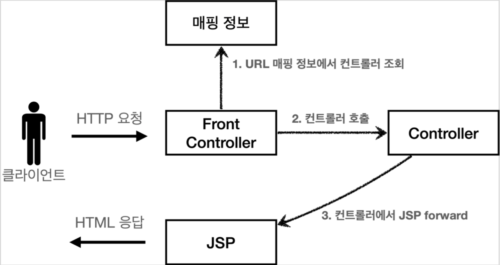

# 4. MVC 프레임워크 만들기

## 프론트 컨트롤러 패턴

### 소개

---

- FrontController 패턴 특징
    - 프론트 컨트롤러 서블릿 하나로 클라이언트의 요청을 받음
    - 프론트 컨트롤러가 요청에 맞는 컨트롤러를 찾아서 호출
    - 입구를 하나로! 공통 처리 가능
    - 프론트 컨트롤러를 제외한 나머지 컨트롤러는 서블릿을 사용하지 않아도 됨
- 스프링 웹 MVC와 프론트 컨트롤러
    - 스프링 웹 MVC의 핵심도 바로 FrontController
    - 스프링 웹 MVC의 DispatcherServlet이 FrontController 패턴으로 구현되어 있음

### 도입 - v1

---

- V1 구조

    

- ControllerV1: 서블릿과 비슷한 모양의 컨트롤러 인터페이스 도입

    ```java
    public interface ControllerV1 {

        void process(HttpServletRequest request, HttpServletResponse response) throws ServletException, IOException;
    }
    ```

    - 각 컨트롤러들은 이 인터페이스를 구현하면 된다.
    - 프론트 컨트롤러는 이 인터페이스를 호출해서 구현과 관계없이 로직의 일관성을 가져갈 수 있다.
- 인터페이스를 구현한 컨트롤러들
    - MemberFormControllerV1 - 회원 등록 컨트롤러

        ```java
        public class MemberFormControllerV1 implements ControllerV1 {

            @Override
            public void process(HttpServletRequest request, HttpServletResponse response) throws ServletException, IOException {
                String viewPath = "/WEB-INF/views/new-form.jsp";
                RequestDispatcher dispatcher = request.getRequestDispatcher(viewPath);
                dispatcher.forward(request, response);
            }
        }
        ```

    - MemberSaveControllerV1 - 회원 저장 컨트롤러

        ```java
        public class MemberSaveControllerV1 implements ControllerV1 {

            private MemberRepository memberRepository = MemberRepository.getInstance();

            @Override
            public void process(HttpServletRequest request, HttpServletResponse response) throws ServletException, IOException {
                String username = request.getParameter("username");
                int age = Integer.parseInt(request.getParameter("age"));

                Member member = new Member(username, age);
                memberRepository.save(member);

                request.setAttribute("member", member);

                String viewPath = "/WEB-INF/views/save-result.jsp";
                RequestDispatcher dispatcher = request.getRequestDispatcher(viewPath);
                dispatcher.forward(request, response);
            }
        }
        ```

    - MemberListControllerV1 - 회원 목록 컨트롤러

        ```java
        public class MemberListControllerV1 implements ControllerV1 {

            private MemberRepository memberRepository = MemberRepository.getInstance();

            @Override
            public void process(HttpServletRequest request, HttpServletResponse response) throws ServletException, IOException {
                List<Member> members = memberRepository.findAll();
                request.setAttribute("members", members);

                String viewPath = "/WEB-INF/views/members.jsp";
                RequestDispatcher dispatcher = request.getRequestDispatcher(viewPath);
                dispatcher.forward(request, response);
            }
        }
        ```

    - 내부 로직은 기존 서블릿과 거의 같다.
- FrontControllerServletV1 - 프론트 컨트롤러

    ```java
    @WebServlet(name = "frontControllerServletV1", urlPatterns = "/front-controller/v1/*")
    public class FrontControllerServletV1 extends HttpServlet {

        private Map<String, ControllerV1> controllerMap = new HashMap<>();

        public FrontControllerServletV1() {
            controllerMap.put("/front-controller/v1/members/new-form", new MemberFormControllerV1());
            controllerMap.put("/front-controller/v1/members/save", new MemberSaveControllerV1());
            controllerMap.put("/front-controller/v1/members", new MemberListControllerV1());
        }

        @Override
        protected void service(HttpServletRequest request, HttpServletResponse response) throws ServletException, IOException {
            System.out.println("FrontControllerServletV1.service");
            String requestURI = request.getRequestURI();

            ControllerV1 controller = controllerMap.get(requestURI);
            if (controller == null) {
                response.setStatus(HttpServletResponse.SC_NOT_FOUND);
                return;
            }

            controller.process(request, response);
        }
    }
    ```

    - 프론트 컨트롤러 분석
        - urlPatterns
            - `urlPatterns = "/front-controller/v1/*"` : `/front-controller/v1`를 포함한 하위 모든 요청은 이 서블릿에서 받아들인다.
            - ex> /front-controller/v1 , /front-controller/v1/a , /front-controller/v1/a/b
        - controllerMap
            - key: 매핑 URL
            - value: 호출될 컨트롤러
        - service()
            - 먼저 `requestURI`를 조회해서 실제 호출할 컨트롤러를 `controllerMap`에서 찾는다. 만약 없다면 404(SC_NOT_FOUND) 상태 코드를 반환한다.
            - 컨트롤러를 찾고 `controller.process(request, response);`을 호출해서 해당 컨트롤러를 실행한다.
        - JSP는 이전 MVC에서 사용했던 것을 그대로 사용한다.

- 실행
    - 등록: [http://localhost:8080/front-controller/v1/members/new-form](http://localhost:8080/front-controller/v1/members/new-form)
    - 목록: [http://localhost:8080/front-controller/v1/members](http://localhost:8080/front-controller/v1/members)

### View 분리 - v2

---

- 문제: 모든 컨트롤러에서 뷰로 이동하는 부분에 중복이 있고, 깔끔하지 않다.

    ```java
    String viewPath = "/WEB-INF/views/new-form.jsp";
    RequestDispatcher dispatcher = request.getRequestDispatcher(viewPath);
    dispatcher.forward(request, response);
    ```

- V2 구조

    

- MyView

    ```java
    public class MyView {
        private String viewPath;

        public MyView(String viewPath) {
            this.viewPath = viewPath;
        }

        public void render(HttpServletRequest request, HttpServletResponse response) throws ServletException, IOException {
            RequestDispatcher dispatcher = request.getRequestDispatcher(viewPath);
            dispatcher.forward(request, response);
        }
    }
    ```

- ControllerV2: 컨트롤러 인터페이스. 컨트롤러가 뷰를 반환한다.

    ```java
    public interface ControllerV2 {

        MyView process(HttpServletRequest request, HttpServletResponse response) throws ServletException, IOException;
    }
    ```

- 인터페이스를 구현한 컨트롤러들
    - MemberFormControllerV2 - 회원 등록 폼

        ```java
        public class MemberFormControllerV2 implements ControllerV2 {

            @Override
            public MyView process(HttpServletRequest request, HttpServletResponse response) throws ServletException, IOException {
                return new MyView("/WEB-INF/views/new-form.jsp");
            }
        }
        ```

    - MemberSaveControllerV2 - 회원 저장

        ```java
        public class MemberSaveControllerV2 implements ControllerV2 {

            private MemberRepository memberRepository = MemberRepository.getInstance();

            @Override
            public MyView process(HttpServletRequest request, HttpServletResponse response) throws ServletException, IOException {
                String username = request.getParameter("username");
                int age = Integer.parseInt(request.getParameter("age"));

                Member member = new Member(username, age);
                memberRepository.save(member);

                request.setAttribute("member", member);

                return new MyView("/WEB-INF/views/save-result.jsp");
            }
        }
        ```

    - MemberListControllerV2 - 회원 목록

        ```java
        public class MemberListControllerV2 implements ControllerV2 {

            private MemberRepository memberRepository = MemberRepository.getInstance();

            @Override
            public MyView process(HttpServletRequest request, HttpServletResponse response) throws ServletException, IOException {
                List<Member> members = memberRepository.findAll();
                request.setAttribute("members", members);

                return new MyView("/WEB-INF/views/members.jsp");
            }
        }
        ```

- 프론트 컨트롤러 V2

    ```java
    @WebServlet(name = "frontControllerServletV2", urlPatterns = "/front-controller/v2/*")
    public class FrontControllerServletV2 extends HttpServlet {

        private Map<String, ControllerV2> controllerMap = new HashMap<>();

        public FrontControllerServletV2() {
            controllerMap.put("/front-controller/v2/members/new-form", new MemberFormControllerV2());
            controllerMap.put("/front-controller/v2/members/save", new MemberSaveControllerV2());
            controllerMap.put("/front-controller/v2/members", new MemberListControllerV2());
        }

        @Override
        protected void service(HttpServletRequest request, HttpServletResponse response) throws ServletException, IOException {
            String requestURI = request.getRequestURI();

            ControllerV2 controller = controllerMap.get(requestURI);
            if (controller == null) {
                response.setStatus(HttpServletResponse.SC_NOT_FOUND);
                return;
            }

            MyView view = controller.process(request, response);
            view.render(request, response);
        }
    }
    ```

    - 프론트 컨트롤러는 컨트롤러 호출 결과로 MyView 를 반환받는다. 그리고 view.render() 를 호출하면 forward 로직을 수행해서 JSP 가 실행된다.

- 결과
    - 이제 각 컨트롤러는 복잡한 dispatcher.forward() 를 직접 생성해서 호출하지 않아도 된다.
    - 단순히 MyView 객체를 생성하고 거기에 뷰 이름만 넣고 반환하면 된다.
    - MVC 패턴의 등장: 비즈니스 로직은 서블릿 처럼 다른곳에서 처리하고, JSP 는 목적에 맞게 HTML 로 화면(View)을 그리는 일에 집중하도록 한다.

- 실행
    - 등록: [http://localhost:8080/front-controller/v2/members/new-form](http://localhost:8080/front-controller/v2/members/new-form)
    - 목록: [http://localhost:8080/front-controller/v2/members](http://localhost:8080/front-controller/v2/members)

### Model 추가 - v3

---

- 문제: 서블릿 종속적(컨트롤러에서 직접 쓰이지 않는 HttpServletRequest, HttpServletResponse)이고, 뷰 이름 중복이 있다.
    - 서블릿 종속성 제거
        - 요청 파라미터 정보는 자바의 Map 으로 대신 넘기도록 하면 지금 구조에서는 컨트롤러가 서블릿 기술을 몰라도 동작할 수 있다.
        - 그리고 request 객체를 Model 로 사용하는 대신에 별도의 Model 객체를 만들어서 반환하면 된다.
    - 뷰 이름 중복 제거
        - 컨트롤러는 **뷰의 논리 이름**을 반환하고, 실제 물리 위치의 이름은 프론트 컨트롤러에서 처리하도록 단순화하자. 이렇게 해두면 향후 뷰의 폴더 위치가 함께 이동해도 프론트 컨트롤러만 고치면 된다.
        - /WEB-INF/views/new-form.jsp → new-form
- V3 구조

    

- ModelView
    - 지금까지 컨트롤러에서 서블릿에 종속적인 HttpServletRequest 를 사용했다. 그리고 Model 도 `request.setAttribute()` 를 통해 데이터를 저장하고 뷰에 전달했다.
    - 서블릿의 종속성을 제거하기 위해 Model 을 직접 만들고, 추가로 View 이름까지 전달하는 객체를 만들어보자.
    - hello.servlet.web.frontcontroller.ModelView

        ```java
        public class ModelView {
            private String viewName;
            private Map<String, Object> model = new HashMap<>();

            public ModelView(String viewName) {
                this.viewName = viewName;
            }

            public String getViewName() {
                return viewName;
            }

            public void setViewName(String viewName) {
                this.viewName = viewName;
            }

            public Map<String, Object> getModel() {
                return model;
            }

            public void setModel(Map<String, Object> model) {
                this.model = model;
            }
        }
        ```

        - 뷰의 이름과 뷰를 렌더링할 때 필요한 model 객체를 가지고 있다. map 으로 되어 있으므로 컨트롤러에서 뷰에 필요한 데이터를 key, value로 넣어주면 된다.
- ControllerV3: 서블릿 기술을 전혀 사용하지 않는다.

    ```java
    public interface ControllerV3 {
        ModelView process(Map<String, String> paramMap);
    }
    ```

    - 구현이 매우 단순해지고, 테스트 코드 작성시 테스트 하기 쉽다.
    - HttpServletRequest 가 제공하는 파라미터는 프론트 컨트롤러가 paramMap 에 담아서 호출해주면 된다.
    - 응답 결과로 뷰 이름과 뷰에 전달할 Model 데이터를 포함하는 ModelView 객체를 반환하면 된다.
- 인터페이스를 구현한 컨트롤러들
    - MemberFormControllerV3 - 회원 등록 폼

        ```java
        public class MemberFormControllerV3 implements ControllerV3 {

            @Override
            public ModelView process(Map<String, String> paramMap) {
                return new ModelView("new-form");
            }
        }
        ```

    - MemberSaveControllerV3 - 회원 저장

        ```java
        public class MemberSaveControllerV3 implements ControllerV3 {

            private MemberRepository memberRepository = MemberRepository.getInstance();

            @Override
            public ModelView process(Map<String, String> paramMap) {
                String username = paramMap.get("username");
                int age = Integer.parseInt(paramMap.get("age"));

                Member member = new Member(username, age);
                memberRepository.save(member);

                ModelView mv = new ModelView("save-result");
                mv.getModel().put("member", member);
                return mv;
            }
        }
        ```

    - MemberListControllerV3 - 회원 목록

        ```java
        public class MemberListControllerV3 implements ControllerV3 {

            private MemberRepository memberRepository = MemberRepository.getInstance();

            @Override
            public ModelView process(Map<String, String> paramMap) {
                List<Member> members = memberRepository.findAll();

                ModelView mv = new ModelView("members");
                mv.getModel().put("members", members);

                return mv;
            }
        }
        ```

    - ModelView 를 생성할 때 new-form 이라는 view 의 논리적인 이름을 지정한다. 실제 물리적인 이름은 프론트 컨트롤러에서 처리한다.
    - `paramMap.get("username");`: 파라미터 정보는 map 에 담겨있다. map 에서 필요한 요청 파라미터를 조회하면 된다.
    - `mv.getModel().put("member", member);`: 모델은 단순한 map 이므로 모델에 뷰에서 필요한 member 객체를 담고 반환한다.
- 프론트 컨트롤러 V3

    ```java
    @WebServlet(name = "frontControllerServletV3", urlPatterns = "/front-controller/v3/*")
    public class FrontControllerServletV3 extends HttpServlet {

        private Map<String, ControllerV3> controllerMap = new HashMap<>();

        public FrontControllerServletV3() {
            controllerMap.put("/front-controller/v3/members/new-form", new MemberFormControllerV3());
            controllerMap.put("/front-controller/v3/members/save", new MemberSaveControllerV3());
            controllerMap.put("/front-controller/v3/members", new MemberListControllerV3());
        }

        @Override
        protected void service(HttpServletRequest request, HttpServletResponse response) throws ServletException, IOException {
            String requestURI = request.getRequestURI();

            ControllerV3 controller = controllerMap.get(requestURI);
            if (controller == null) {
                response.setStatus(HttpServletResponse.SC_NOT_FOUND);
                return;
            }

            // paramMap 넘겨줘야 한다.
            Map<String, String> paramMap = createParamMap(request);
            ModelView mv = controller.process(paramMap);

            String viewName = mv.getViewName(); // 논리이름 new-form
            MyView view = viewResolver(viewName);

            view.render(mv.getModel(), request, response);
        }

        private MyView viewResolver(String viewName) {
            return new MyView("/WEB-INF/views/" + viewName + ".jsp");
        }

        private Map<String, String> createParamMap(HttpServletRequest request) {
            Map<String, String> paramMap = new HashMap<>();
            request.getParameterNames().asIterator()
                    .forEachRemaining(paramName -> paramMap.put(paramName, request.getParameter(paramName)));
            return paramMap;
        }
    }
    ```

    - `createParamMap(HttpServletRequest request)`: HttpServletRequest 에서 파라미터 정보를 꺼내서 Map으로 변환한다. 그리고 해당 Map(`paramMap`)을 컨트롤러에 전달하면서 호출한다.
- 뷰 리졸버: 컨트롤러가 반환한 논리 뷰 이름을 실제 물리 뷰 경로로 변경한다. 그리고 실제 물리 경로가 있는 MyView 객체를 반환한다.
    - `MyView view = viewResolver(viewName)`
        - 논리 뷰 이름: members
        - 물리 뷰 경로: /WEB-INF/views/members.jsp
    - `view.render(mv.getModel(), request, response)`
        - 뷰 객체를 통해서 HTML 화면을 렌더링 한다.
        - 뷰 객체의 `render()`는 모델 정보도 함께 받는다.
        - JSP 는 `request.getAttribute()`로 데이터를 조회하기 때문에, 모델의 데이터를 꺼내서 `request.setAttribute()`로 담아둔다.
        - JSP로 포워드 해서 JSP를 렌더링 한다.
- MyView

    ```java
    public class MyView {
        private String viewPath;

        public MyView(String viewPath) {
            this.viewPath = viewPath;
        }

        public void render(HttpServletRequest request, HttpServletResponse response) throws ServletException, IOException {
            RequestDispatcher dispatcher = request.getRequestDispatcher(viewPath);
            dispatcher.forward(request, response);
        }

        public void render(Map<String, Object> model, HttpServletRequest request, HttpServletResponse response) throws ServletException, IOException {
            modelToRequestAttribute(model, request);
            RequestDispatcher dispatcher = request.getRequestDispatcher(viewPath);
            dispatcher.forward(request, response);
        }

        private void modelToRequestAttribute(Map<String, Object> model, HttpServletRequest request) {
            model.forEach(request::setAttribute);
        }
    }
    ```

- 실행
    - 등록: [http://localhost:8080/front-controller/v3/members/new-form](http://localhost:8080/front-controller/v3/members/new-form)
    - 목록: [http://localhost:8080/front-controller/v3/members](http://localhost:8080/front-controller/v3/members)

### 단순하고 실용적인 컨트롤러 - v4

---

- 문제: 컨트톨러 인터페이스를 구현하는 개발자는 항상 ModelView 를 생성 & 반환해야 한다.
- V4 구조

    

    - 컨트롤러가 `ModelView`를 반환하지 않고, `ViewName`만 반환한다.

- ControllerV4: ModelView 가 없다. model 객체는 파라미터로 전달되어 그냥 사용하면 되고, 결과로 뷰의 이름을 반환한다.

    ```java
    public interface ControllerV4 {

        /**
         * @param paramMap
         * @param model
         * @return viewName
         */
        String process(Map<String, String> paramMap, Map<String, Object> model);
    }
    ```

- 인터페이스를 구현한 컨트롤러들
    - MemberFormControllerV4

        ```java
        public class MemberFormControllerV4 implements ControllerV4 {

            @Override
            public String process(Map<String, String> paramMap, Map<String, Object> model) {
                return "new-form";
            }
        }
        ```

    - MemberSaveControllerV4

        ```java
        public class MemberSaveControllerV4 implements ControllerV4 {

            private MemberRepository memberRepository = MemberRepository.getInstance();

            @Override
            public String process(Map<String, String> paramMap, Map<String, Object> model) {
                String username = paramMap.get("username");
                int age = Integer.parseInt(paramMap.get("age"));

                Member member = new Member(username, age);
                memberRepository.save(member);

                model.put("member", member);
                return "save-result";
            }
        }
        ```

        - `model.put("member", member)`: 모델이 파라미터로 전달되기 때문에, 직접 생성하지 않아도 된다.
    - MemberListControllerV4

        ```java
        public class MemberListControllerV4 implements ControllerV4 {

            private MemberRepository memberRepository = MemberRepository.getInstance();

            @Override
            public String process(Map<String, String> paramMap, Map<String, Object> model) {
                List<Member> members = memberRepository.findAll();

                model.put("members", members);
                return "members";
            }
        }
        ```

- 프론트 컨트롤러 V4

    ```java
    @WebServlet(name = "frontControllerServletV4", urlPatterns = "/front-controller/v4/*")
    public class FrontControllerServletV4 extends HttpServlet {

        private Map<String, ControllerV4> controllerMap = new HashMap<>();

        public FrontControllerServletV4() {
            controllerMap.put("/front-controller/v4/members/new-form", new MemberFormControllerV4());
            controllerMap.put("/front-controller/v4/members/save", new MemberSaveControllerV4());
            controllerMap.put("/front-controller/v4/members", new MemberListControllerV4());
        }

        @Override
        protected void service(HttpServletRequest request, HttpServletResponse response) throws ServletException, IOException {
            String requestURI = request.getRequestURI();

            ControllerV4 controller = controllerMap.get(requestURI);
            if (controller == null) {
                response.setStatus(HttpServletResponse.SC_NOT_FOUND);
                return;
            }

            Map<String, String> paramMap = createParamMap(request);
            Map<String, Object> model = new HashMap<>();    // 추가
            String viewName = controller.process(paramMap, model);

            MyView view = viewResolver(viewName);
            view.render(model, request, response);
        }

        private MyView viewResolver(String viewName) {
            return new MyView("/WEB-INF/views/" + viewName + ".jsp");
        }

        private Map<String, String> createParamMap(HttpServletRequest request) {
            Map<String, String> paramMap = new HashMap<>();
            request.getParameterNames().asIterator()
                    .forEachRemaining(paramName -> paramMap.put(paramName, request.getParameter(paramName)));
            return paramMap;
        }
    }
    ```

    - 모델 객체 전달: `Map<String, Object> model = new HashMap<>(); //추가`
        - 모델 객체를 프론트 컨트롤러에서 생성해서 넘겨준다. 컨트롤러에서 모델 객체에 값을 담으면 여기에 그대로 담겨있게 된다.
    - 뷰의 논리 이름을 직접 반환

        ```java
        String viewName = controller.process(paramMap, model);
        MyView view = viewResolver(viewName);
        ```

- 실행
    - 등록: [http://localhost:8080/front-controller/v4/members/new-form](http://localhost:8080/front-controller/v4/members/new-form)
    - 목록: [http://localhost:8080/front-controller/v4/members](http://localhost:8080/front-controller/v4/members)

- 이쯤해서 정리하는 intelliJ 단축키
    - `option + command + N`: 변수에다 대고 실행하면 2줄을 한 줄로 만들어준다.
    - `soutm`, `soutv`: method, variable 기준으로 편리하게 print 해준다.
    - `F2`: 다음 에러로 간다.
    - `/**`: 메소드에 이렇게 치고 엔터하면 자동으로 주석 만들어준다.

### 유연한 컨트롤러1 - v5

---

- 문제: ControllerV3, ControllerV4 방식을 유연하게 바꿔쓸 수 없다.

    ```java
    public interface ControllerV3 {
        ModelView process(Map<String, String> paramMap);
    }
    ```

    ```java
    public interface ControllerV4 {
        String process(Map<String, String> paramMap, Map<String, Object> model);
    }
    ```

→ 어댑터 패턴 사용!

- V5 구조

    

    - 핸들러 어댑터: 다양한 종류의 컨트롤러를 호출할 수 있다.
    - 핸들러: 컨트롤러의 이름을 더 넓은 범위인 핸들러로 변경했다.
        - 이제 어댑터가 있기 때문에 꼭 컨트롤러의 개념 뿐 아니라, 어떤 것이든 해당 종류의 어댑터만 있으면 다 처리할 수 있기 때문이다.

- MyHandlerAdapter: 어댑터는 이렇게 구현해야 한다는 어댑터용 인터페이스

    ```java
    public interface MyHandlerAdapter {

        boolean supports(Object handler);

        ModelView handle(HttpServletRequest request, HttpServletResponse response, Object handler) throws ServletException, IOException;
    }
    ```

    - `supports`: 어댑터가 해당 컨트롤러를 처리할 수 있는지 판단
    - `handle`
        - 어댑터는 실제 컨트롤러를 호출하고, 그 결과로 ModelView 를 반환해야 한다.
        - 실제 컨트롤러가 ModelView를 반환하지 못하면, 어댑터가 ModelView를 직접 생성해서라도 반환해야 한다.
        - 이전에는 프론트 컨트롤러가 실제 컨트롤러를 호출했지만 이제는 이 어댑터를 통해서 실제 컨트롤러가 호출된다.
- ControllerV3HandlerAdapter: ControllerV3를 지원하는 어댑터

    ```java
    public class ControllerV3HandlerAdapter implements MyHandlerAdapter {

        @Override
        public boolean supports(Object handler) {
            return (handler instanceof ControllerV3);
        }

        @Override
        public ModelView handle(HttpServletRequest request, HttpServletResponse response, Object handler) throws ServletException, IOException {
            ControllerV3 controller = (ControllerV3) handler;

            Map<String, String> paramMap = createParamMap(request);
            return controller.process(paramMap);
        }

        private Map<String, String> createParamMap(HttpServletRequest request) {
            Map<String, String> paramMap = new HashMap<>();
            request.getParameterNames().asIterator()
                    .forEachRemaining(paramName -> paramMap.put(paramName, request.getParameter(paramName)));
            return paramMap;
        }
    }
    ```

- 프론트 컨트롤러 V5

    ```java
    @WebServlet(name = "frontControllerServletV5", urlPatterns = "/front-controller/v5/*")
    public class FrontControllerServletV5 extends HttpServlet {
        private final Map<String, Object> handlerMappingMap = new HashMap<>();
        private final List<MyHandlerAdapter> handlerAdapters = new ArrayList<>();

        public FrontControllerServletV5() {
            initHandlerMappingMap(); //핸들러 매핑 초기화
            initHandlerAdapters(); //어댑터 초기화
        }

        private void initHandlerMappingMap() {
            handlerMappingMap.put("/front-controller/v5/v3/members/new-form", new MemberFormControllerV3());
            handlerMappingMap.put("/front-controller/v5/v3/members/save", new MemberSaveControllerV3());
            handlerMappingMap.put("/front-controller/v5/v3/members", new MemberListControllerV3());
        }

        private void initHandlerAdapters() {
            handlerAdapters.add(new ControllerV3HandlerAdapter());
        }

        @Override
        protected void service(HttpServletRequest request, HttpServletResponse response) throws ServletException, IOException {
            Object handler = getHandler(request);
            if (handler == null) {
                response.setStatus(HttpServletResponse.SC_NOT_FOUND);
                return;
            }

            MyHandlerAdapter adapter = getHandlerAdapter(handler);

            ModelView mv = adapter.handle(request, response, handler);

            MyView view = viewResolver(mv.getViewName());
            view.render(mv.getModel(), request, response);
        }

        private Object getHandler(HttpServletRequest request) {
            String requestURI = request.getRequestURI();
            return handlerMappingMap.get(requestURI);
        }

        private MyHandlerAdapter getHandlerAdapter(Object handler) {
            for (MyHandlerAdapter adapter : handlerAdapters) {
                if (adapter.supports(handler)) {
                    return adapter;
                }
            }
            throw new IllegalArgumentException("handler adapter를 찾을 수 없습니다. handler=" + handler);
        }

        private MyView viewResolver(String viewName) {
            return new MyView("/WEB-INF/views/" + viewName + ".jsp");
        }
    }
    ```

    - 생성자: 핸들러 매핑 뿐 아니라 어댑터도 초기화(등록)한다.
    - 매핑 정보: `private final Map<String, Object> handlerMappingMap;`
        - 매핑 정보의 값이 ControllerV3 , ControllerV4 같은 인터페이스에서 아무 값이나 받을 수 있는 Object 로 변경되었다.
    - 핸들러 매핑: `Object handler = getHandler(request)`
    - 핸들러를 처리할 수 있는 어댑터 조회: `MyHandlerAdapter adapter = getHandlerAdapter(handler)`
    - 어댑터 호출: `ModelView mv = adapter.handle(request, response, handler);`

- 실행
    - 등록: [http://localhost:8080/front-controller/v5/v3/members/new-form](http://localhost:8080/front-controller/v5/v3/members/new-form)
    - 목록: [http://localhost:8080/front-controller/v5/v3/members](http://localhost:8080/front-controller/v5/v3/members)

### 유연한 컨트롤러2 - v5

---

- FrontControllerServletV5: ControllerV4 기능 추가

    ```java
    @WebServlet(name = "frontControllerServletV5", urlPatterns = "/front-controller/v5/*")
    public class FrontControllerServletV5 extends HttpServlet {
        private final Map<String, Object> handlerMappingMap = new HashMap<>();
        private final List<MyHandlerAdapter> handlerAdapters = new ArrayList<>();

        public FrontControllerServletV5() {
            initHandlerMappingMap(); //핸들러 매핑 초기화
            initHandlerAdapters(); //어댑터 초기화
        }

        private void initHandlerMappingMap() {
            handlerMappingMap.put("/front-controller/v5/v3/members/new-form", new MemberFormControllerV3());
            handlerMappingMap.put("/front-controller/v5/v3/members/save", new MemberSaveControllerV3());
            handlerMappingMap.put("/front-controller/v5/v3/members", new MemberListControllerV3());

            //V4 추가
            handlerMappingMap.put("/front-controller/v5/v4/members/new-form", new MemberFormControllerV4());
            handlerMappingMap.put("/front-controller/v5/v4/members/save", new MemberSaveControllerV4());
            handlerMappingMap.put("/front-controller/v5/v4/members", new MemberListControllerV4());
        }

        private void initHandlerAdapters() {
            handlerAdapters.add(new ControllerV3HandlerAdapter());
            handlerAdapters.add(new ControllerV4HandlerAdapter()); //V4 추가
        }

        @Override
        protected void service(HttpServletRequest request, HttpServletResponse response) throws ServletException, IOException {
            Object handler = getHandler(request);
            if (handler == null) {
                response.setStatus(HttpServletResponse.SC_NOT_FOUND);
                return;
            }

            MyHandlerAdapter adapter = getHandlerAdapter(handler);

            ModelView mv = adapter.handle(request, response, handler);

            MyView view = viewResolver(mv.getViewName());
            view.render(mv.getModel(), request, response);
        }

        private Object getHandler(HttpServletRequest request) {
            String requestURI = request.getRequestURI();
            return handlerMappingMap.get(requestURI);
        }

        private MyHandlerAdapter getHandlerAdapter(Object handler) {
            for (MyHandlerAdapter adapter : handlerAdapters) {
                if (adapter.supports(handler)) {
                    return adapter;
                }
            }
            throw new IllegalArgumentException("handler adapter를 찾을 수 없습니다. handler=" + handler);
        }

        private MyView viewResolver(String viewName) {
            return new MyView("/WEB-INF/views/" + viewName + ".jsp");
        }
    }
    ```

    - 핸들러 매핑(`handlerMappingMap`)에 `ControllerV4`를 사용하는 컨트롤러를 추가하고, 해당 컨트롤러를 처리할 수 있는 어댑터인 `ControllerV4HandlerAdapter`도 추가하자.
- ControllerV4HandlerAdapter

    ```java
    public class ControllerV4HandlerAdapter implements MyHandlerAdapter {

        @Override
        public boolean supports(Object handler) {
            return (handler instanceof ControllerV4);
        }

        @Override
        public ModelView handle(HttpServletRequest request, HttpServletResponse response, Object handler) throws ServletException, IOException {
            ControllerV4 controller = (ControllerV4) handler;

            Map<String, String> paramMap = createParamMap(request);
            Map<String, Object> model = new HashMap<>();

            String viewName = controller.process(paramMap, model);

            ModelView mv = new ModelView(viewName);
            mv.setModel(model);

            return mv;
        }

        private Map<String, String> createParamMap(HttpServletRequest request) {
            Map<String, String> paramMap = new HashMap<>();
            request.getParameterNames().asIterator()
                    .forEachRemaining(paramName -> paramMap.put(paramName, request.getParameter(paramName)));
            return paramMap;
        }
    }
    ```

    - handler 를 ControllerV4 로 캐스팅 하고 paramMap, model 을 만들어서 해당 컨트롤러를 호출한다. 그리고 viewName 을 반환 받는다.
    - 어댑터 변환: 어댑터가 꼭 필요한 이유

        ```java
        ModelView mv = new ModelView(viewName);
        mv.setModel(model);
        ```

        - 어댑터가 호출하는 ControllerV4 는 뷰의 이름을 반환한다. 그런데 어댑터는 뷰의 이름이 아니라 ModelView 를 만들어서 반환해야 한다.

- 실행
    - 등록: [http://localhost:8080/front-controller/v5/v4/members/new-form](http://localhost:8080/front-controller/v5/v4/members/new-form)
    - 목록: [http://localhost:8080/front-controller/v5/v4/members](http://localhost:8080/front-controller/v5/v4/members)

## 정리

### v1: 프론트 컨트롤러를 도입

---

- 기존 구조를 최대한 유지하면서 프론트 컨트롤러를 도입

### v2: View 분류

---

- 단순 반복 되는 뷰 로직 분리

### v3: Model 추가

---

- 서블릿 종속성 제거
- 뷰 이름 중복 제거

### v4: 단순하고 실용적인 컨트롤러

---

- v3와 거의 비슷
- 구현 입장에서 ModelView를 직접 생성해서 반환하지 않도록 편리한 인터페이스 제공

### v5: 유연한 컨트롤러

---

- 어댑터 도입
- 어댑터를 추가해서 프레임워크를 유연하고 확장성 있게 설계


- [Notion link](https://www.notion.so/4-MVC-1dfffaacefbf4b1bb841763b3c1e26e6)
