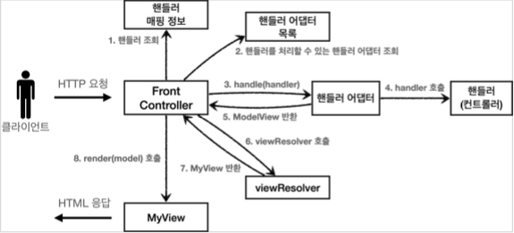

# 5. 스프링 MVC - 구조 이해

## 스프링 MVC 전체 구조

- 직접 만든 MVC 프레임워크 구조



- SpringMVC 구조


- **직접 만든 프레임워크 스프링 MVC 비교**
    - FrontController → DispatcherServlet
    - handlerMappingMap → HandlerMapping
    - MyHandlerAdapter → HandlerAdapter
    - ModelView → ModelAndView
    - viewResolver → ViewResolver
    - MyView → View

### DispatcherServlet 구조 살펴보기

---

- `org.springframework.web.servlet.DispatcherServlet`
    - 스프링 MVC도 프론트 컨트롤러 패턴으로 구현되어 있다.
    - 프론트 컨트롤러가 바로 디스패처 서블릿(DispatcherServlet)
- DispacherServlet 서블릿 등록
    - `DispacherServlet`도 부모 클래스에서 `HttpServlet`을 상속받아서 사용하고, 서블릿으로 동작
        - DispatcherServlet → FrameworkServlet → HttpServletBean → HttpServlet
    - 스프링 부트는 DispacherServlet 을 서블릿으로 자동으로 등록하면서 모든 경로(`urlPatterns="/"`)에 대해서 매핑한다.
        - 참고: 더 자세한 경로가 우선순위가 높다. 그래서 기존에 등록한 서블릿도 함께 동작한다.
- 요청 흐름
    - 서블릿이 호출되면 `HttpServlet`이 제공하는 `serivce()`가 호출된다.
    - 스프링 MVC는 `DispatcherServlet`의 부모인 `FrameworkServlet`에서 `service()`를 오버라이드 해두었다.
    - `FrameworkServlet.service()`를 시작으로 여러 메서드가 호출되면서 `DispacherServlet.doDispatch()`가 호출된다.

- `DispacherServlet.doDispatch()`

    ```java
    protected void doDispatch(HttpServletRequest request, HttpServletResponse response) throws Exception {
      HttpServletRequest processedRequest = request;
      HandlerExecutionChain mappedHandler = null;
      ModelAndView mv = null;

    	// 1. 핸들러 조회
    	mappedHandler = getHandler(processedRequest);
      if (mappedHandler == null) {
    		noHandlerFound(processedRequest, response);
    		return;
    	}

    	//2.핸들러 어댑터 조회-핸들러를 처리할 수 있는 어댑터
    	HandlerAdapter ha = getHandlerAdapter(mappedHandler.getHandler());

    	// 3. 핸들러 어댑터 실행 -> 4. 핸들러 어댑터를 통해 핸들러 실행 -> 5. ModelAndView 반환
    	mv = ha.handle(processedRequest, response, mappedHandler.getHandler());
      
    	processDispatchResult(processedRequest, response, mappedHandler, mv, dispatchException);

    }

    private void processDispatchResult(HttpServletRequest request, HttpServletResponse response, HandlerExecutionChain mappedHandler, ModelAndView mv, Exception exception) throws Exception {
    	// 뷰 렌더링 호출
    	render(mv, request, response);
    }

    protected void render(ModelAndView mv, HttpServletRequest request, HttpServletResponse response) throws Exception {
    	View view;
    	String viewName = mv.getViewName();

    	//6. 뷰 리졸버를 통해서 뷰 찾기, 7.View 반환
    	view = resolveViewName(viewName, mv.getModelInternal(), locale, request);

    	// 8. 뷰 렌더링
    	view.render(mv.getModelInternal(), request, response);
    }
    ```

- SpringMVC 동작 순서
    1. **핸들러 조회**: 핸들러 매핑을 통해 요청 URL에 매핑된 핸들러(컨트롤러)를 조회한다.
    2. **핸들러 어댑터 조회**: 핸들러를 실행할 수 있는 핸들러 어댑터를 조회한다.
    3. **핸들러 어댑터 실행**: 핸들러 어댑터를 실행한다.
    4. **핸들러 실행**: 핸들러 어댑터가 실제 핸들러를 실행한다.
    5. **ModelAndView 반환**: 핸들러 어댑터는 핸들러가 반환하는 정보를 ModelAndView로 **변환**해서 반환한다.
    6. **viewResolver 호출**: 뷰 리졸버를 찾고 실행한다.

        JSP의 경우: `InternalResourceViewResolver`가 자동 등록되고, 사용된다.

    7. **View반환**: 뷰 리졸버는 뷰의 논리 이름을 물리 이름으로 바꾸고, 렌더링 역할을 담당하는 뷰 객체를 반환한다.

        JSP의 경우 `InternalResourceView(JstlView)`를 반환하는데, 내부에 `forward()`로직이 있다.

    8. **뷰 렌더링**: 뷰를 통해서 뷰를 렌더링 한다.

- 인터페이스 살펴보기
    - 스프링 MVC 의 큰 강점은 `DispatcherServlet` 코드의 변경 없이, 원하는 기능을 변경하거나 확장할 수 있다는 점이다. 지금까지 설명한 대부분을 확장 가능할 수 있게 인터페이스로 제공한다.
    - 이 인터페이스들만 구현해서 `DispatcherServlet`에 등록하면 여러분만의 컨트롤러를 만들 수도 있다.
    - 주요 인터페이스 목록
        - 핸들러 매핑: `org.springframework.web.servlet.HandlerMapping`
        - 핸들러 어댑터: `org.springframework.web.servlet.HandlerAdapter`
        - 뷰 리졸버: `org.springframework.web.servlet.ViewResolver`
        - 뷰: `org.springframework.web.servlet.View`

### 핸들러 매핑과 핸들러 어댑터

---

- 과거 버전 스프링 컨트롤러: `org.springframework.web.servlet.mvc.Controller`

    ```java
    public interface Controller {
        ModelAndView handleRequest(HttpServletRequest request, HttpServletResponse response) throws Exception;
    }
    ```

    - `Controller` 인터페이스는 `@Controller` 애노테이션과는 전혀 다르다.
- 구현 컨트롤러 OldController

    ```java
    @Component("/springmvc/old-controller")
    public class OldController implements Controller {

        @Override
        public ModelAndView handleRequest(HttpServletRequest request, HttpServletResponse response) throws Exception {
            System.out.println("OldController.handleRequest");
            return null;
        }
    }
    ```

    - `@Component` : 이 컨트롤러는 `/springmvc/old-controller`라는 이름의 스프링 빈으로 등록되었다.
    - 빈의 이름으로 URL을 매핑할 것이다
- 실행: [http://localhost:8080/springmvc/old-controller](http://localhost:8080/springmvc/old-controller)
    - HandlerMapping(핸들러 매핑)
        - 핸들러 매핑에서 이 컨트롤러를 찾을 수 있어야 한다. → 스프링 빈의 이름으로 핸들러를 찾을 수 있는 핸들러 매핑이 필요하다.
    - HandlerAdapter(핸들러 어댑터)
        - 핸들러 매핑을 통해서 찾은 핸들러를 실행할 수 있는 핸들러 어댑터가 필요하다. → `Controller` 인터페이스를 실행할 수 있는 핸들러 어댑터를 찾고 실행해야 한다.
    1. 핸들러 매핑으로 핸들러 조회
        - `HandlerMapping`을 순서대로 실행해서, 핸들러를 찾는다.
        - 이 경우 빈 이름으로 핸들러를 찾아야 하기 때문에 이름 그대로 빈 이름으로 핸들러를 찾아주는 `BeanNameUrlHandlerMapping`가 실행에 성공하고 핸들러인 `OldController`를 반환한다.
    2. 핸들러 어댑터 조회
        - `HandlerAdapter`의 `supports()`를 순서대로 호출한다.
        - `SimpleControllerHandlerAdapter`가 `Controller` 인터페이스를 지원하므로 대상이 된다.
    3. 핸들러 어댑터 실행
        - 디스패처 서블릿이 조회한 `SimpleControllerHandlerAdapter`를 실행하면서 핸들러 정보도 함께 넘겨준다.
        - `SimpleControllerHandlerAdapter`는 핸들러인 `OldController`를 내부에서 실행하고, 그 결과를 반환한다.

- 스프링 부트가 자동 등록하는 핸들러 매핑과 핸들러 어댑터
    - HandlerMapping

        ```java
        0 = RequestMappingHandlerMapping : 애노테이션 기반의 컨트롤러인 @RequestMapping에서 사용
        1 = BeanNameUrlHandlerMapping : 스프링 빈의 이름으로 핸들러를 찾는다.
        ```

    - HandlerAdapter

        ```java
        0 = RequestMappingHandlerAdapter : 애노테이션 기반의 컨트롤러인 @RequestMapping에서 사용
        1 = HttpRequestHandlerAdapter : HttpRequestHandler 처리
        2 = SimpleControllerHandlerAdapter : Controller 인터페이스(애노테이션X, 과거에 사용) 처리
        ```

- HttpRequestHandler: Controller 인터페이스가 아닌 다른 핸들러
    - 서블릿과 가장 유사한 형태의 핸들러이다.

    ```java
    public interface HttpRequestHandler {
    		void handleRequest(HttpServletRequest request, HttpServletResponse response) throws ServletException, IOException;
    }
    ```

- 구현 MyHttpRequestHandler

    ```java
    @Component("/springmvc/request-handler")
    public class MyHttpRequestHandler implements HttpRequestHandler {
     
        @Override
        public void handleRequest(HttpServletRequest httpServletRequest, HttpServletResponse httpServletResponse) throws ServletException, IOException {
            System.out.println("MyHttpRequestHandler.handleRequest");
        }
    }
    ```

- 실행: [http://localhost:8080/springmvc/request-handler](http://localhost:8080/springmvc/request-handler)
    1. 핸들러 매핑으로 핸들러 조회
        - HandlerMapping 을 순서대로 실행해서, 핸들러를 찾는다.
        - 이 경우 빈 이름으로 핸들러를 찾아야 하기 때문에 이름 그대로 빈 이름으로 핸들러를 찾아주는 `BeanNameUrlHandlerMapping`가 실행에 성공하고 핸들러인 `MyHttpRequestHandler`를 반환한다.
    2. 핸들러 어댑터 조회
        - `HandlerAdapter`의 `supports()`를 순서대로 호출한다.
        - `HttpRequestHandlerAdapter`가 `HttpRequestHandler` 인터페이스를 지원하므로 대상이 된다.
    3. 핸들러 어댑터 실행
        - 디스패처 서블릿이 조회한 `HttpRequestHandlerAdapter`를 실행하면서 핸들러 정보도 함께 넘겨준다.
        - `HttpRequestHandlerAdapter`는 핸들러인 `MyHttpRequestHandler`를 내부에서 실행하고, 그 결과를 반환한다.

- @RequestMapping
    - 가장 우선순위가 높은 핸들러 매핑(`RequestMappingHandlerMapping`)과 핸들러 어댑터(`RequestMappingHandlerAdapter`)
    - 스프링에서 주로 사용하는 애노테이션 기반의 컨트롤러를 지원하는 매핑과 어댑터.
    - 실무에서는 99.9% 이 방식의 컨트롤러를 사용한다.

### 뷰 리졸버

---

- OldController - View 조회할 수 있도록 변경

    ```java
    @Component("/springmvc/old-controller")
    public class OldController implements Controller {

        @Override
        public ModelAndView handleRequest(HttpServletRequest request, HttpServletResponse response) throws Exception {
            System.out.println("OldController.handleRequest");
            return new ModelAndView("new-form");
        }
    }
    ```

    - View 사용할 수 있도록 `return new ModelAndView("new-form");`추가

        → Whitelabel Error Page 오류가 발생한다.

- `application.properties`: prefix, suffix 설정 추가

    ```yaml
    spring.mvc.view.prefix=/WEB-INF/views/
    spring.mvc.view.suffix=.jsp
    ```

- 뷰 리졸버 - InternalResourceViewResolver
    - 스프링 부트는 `InternalResourceViewResolver`라는 뷰 리졸버를 자동으로 등록하는데, 이때 `application.properties`에 등록한 `spring.mvc.view.prefix`, `spring.mvc.view.suffix` 설정 정보를 사용해서 등록한다.
    - `InternalResourceViewResolver`는 내부 자원으로 View resolve 하는 경우 선택 및 사용된다.
    - 아래와 동일한 기능을 한다.

        ```java
        /**
         * 이런 bean 부분을 스프링 부트는 application.properties 값을 보고 서블릿 자동 등록한다.<p>
         * * spring.mvc.view.prefix=/WEB-INF/views/<p>
         * * spring.mvc.view.suffix=.jsp
         */
        @Bean
        InternalResourceViewResolver internalResourceViewResolver() {
            return new InternalResourceViewResolver("/WEB-INF/views/", ".jsp");
        }
        ```

- 스프링 부트가 자동 등록하는 뷰 리졸버

    ```java
    1 = BeanNameViewResolver : 빈 이름으로 뷰를 찾아서 반환한다.(예: 엑셀 파일 생성 기능에 사용)
    2 = InternalResourceViewResolver : JSP를 처리할 수 있는 뷰를 반환한다.
    ```

- 실행: [http://localhost:8080/springmvc/old-controller](http://localhost:8080/springmvc/old-controller)
    1. 핸들러 어댑터 호출
        - 핸들러 어댑터를 통해 new-form 이라는 논리 뷰 이름을 획득한다.
    2. ViewResolver 호출
        - `new-form`이라는 뷰 이름으로 viewResolver를 순서대로 호출한다.
        - `BeanNameViewResolver`는 `new-form`이라는 이름의 스프링 빈으로 등록된 뷰를 찾아야 하는데 없다.
        - `InternalResourceViewResolver`가 호출된다.
    3. InternalResourceViewResolver
        - 이 뷰 리졸버는 `InternalResourceView`를 반환한다.
    4. 뷰 - InternalResourceView
        - `InternalResourceView`는 JSP처럼 포워드 `forward()`를 호출해서 처리할 수 있는 경우에 사용한다.
    5. view.render()
        - `view.render()`가 호출되고 `InternalResourceView`는 `forward()`를 사용해서 JSP를 실행한다.

- 참고
    - 다른 뷰는 실제 뷰를 렌더링하지만, JSP의 경우 `forward()`통해서 해당 JSP로 이동(실행)해야 렌더링 된다. JSP를 제외한 나머지 뷰 템플릿들은 `forward()` 과정 없이 바로 렌더링 된다.
    - Thymeleaf 뷰 템플릿을 사용하면 `ThymeleafViewResolver`를 등록해야 한다. 최근에는 라이브러리만 추가하면 스프링 부트가 이런 작업도 모두 자동화해준다.


## 스프링 MVC

### 시작하기

---

- @RequestMapping
    - 스프링은 애노테이션을 활용한 매우 유연하고, 실용적인 컨트롤러를 만들었는데 이것이 바로 `@RequestMapping` 애노테이션을 사용하는 컨트롤러이다.
    - `RequestMappingHandlerMapping`: 스프링 빈 중에서 `@RequestMapping` 또는 `@Controller`가 클래스 레벨에 붙어 있는 경우에 매핑 정보로 인식한다.
        - 컴포넌스 스캔 없이 다음과 같이 스프링 빈으로 직접 등록해도 동작한다.

            ```java
            @RequestMapping
            public class TestController {
            	
            		@RequestMapping("/springmvc/v1/members/new-form")
            		public ModelAndView process() {
            				return new ModelAndView("new-form");
            		}
            }
            ```

            - ServletApplication

            ```java
            //스프링 빈 직접 등록
            @Bean
            TestController testController() {
            	  return new TestController();
            }
            ```

    - `RequestMappingHandlerAdapter`

- SpringMemberFormControllerV1 - 회원 등록 폼

    ```java
    // @Controller
    // 아래 두 조합이 @Controller 랑 같은 역할을 한다. RequestMappingHandlerMapping#isHandler
    // @Bean + @RequestMapping 도 가능
    @Component
    @RequestMapping
    public class SpringMemberFormControllerV1 {

        @RequestMapping("/springmvc/v1/members/new-form")
        public ModelAndView process() {
            return new ModelAndView("new-form");
        }
    }
    ```

- `@Controller`
    - 스프링이 자동으로 스프링 빈으로 등록한다. (내부에 `@Component` 애노테이션이 있어서 컴포넌트 스캔의 대상이 됨)
    - 스프링 MVC에서 애노테이션 기반 컨트롤러로 인식한다.
- `@RequestMapping`
    - 요청 정보를 매핑한다. 해당 URL이 호출되면 이 메서드가 호출된다.
    - 애노테이션을 기반으로 동작하기 때문에, 메서드의 이름은 임의로 지으면 된다.
- `ModelAndView`: 모델과 뷰 정보를 담아서 반환하면 된다.

- 실행: [http://localhost:8080/springmvc/v1/members/new-form](http://localhost:8080/springmvc/v1/members/new-form)

- SpringMemberSaveControllerV1 - 회원 저장

    ```java
    @Controller
    public class SpringMemberSaveControllerV1 {

        private MemberRepository memberRepository = MemberRepository.getInstance();

        @RequestMapping("/springmvc/v1/members/save")
        public ModelAndView process(HttpServletRequest request, HttpServletResponse response) {
            String username = request.getParameter("username");
            int age = Integer.parseInt(request.getParameter("age"));

            Member member = new Member(username, age);
            System.out.println("member = " + member);
            memberRepository.save(member);

            ModelAndView mv = new ModelAndView("save-result");
            mv.addObject("member", member);
            return mv;
        }
    }
    ```

    - `mv.addObject("member", member)`: 스프링이 제공하는 `ModelAndView`를 통해 Model 데이터를 추가할 때는 `addObject()`를 사용하면 된다. 이 데이터는 이후 뷰를 렌더링 할 때 사용된다.
- SpringMemberListControllerV1 - 회원 목록

    ```java
    @Controller
    public class SpringMemberListControllerV1 {

        private MemberRepository memberRepository = MemberRepository.getInstance();

        @RequestMapping("/springmvc/v1/members")
        public ModelAndView process() {
            List<Member> members = memberRepository.findAll();

            ModelAndView mv = new ModelAndView("members");
            mv.addObject("members", members);
            return mv;
        }
    }
    ```

- 실행
    - 등록: [http://localhost:8080/springmvc/v1/members/new-form](http://localhost:8080/springmvc/v1/members/new-form)
    - 목록: [http://localhost:8080/springmvc/v1/members](http://localhost:8080/springmvc/v1/members)

### 컨트롤러 통합

---

- `@RequestMapping`을 메서드 단위에 적용하여 컨트롤러 클래스를 유연하게 하나로 통합할 수 있다.
- SpringMemberControllerV2

    ```java
    /**
     * 클래스 단위 -> 메서드 단위
     * @RequestMapping 클래스 레벨과 메서드 레벨 조합
     */
    @Controller
    @RequestMapping("/springmvc/v2/members")
    public class SpringMemberControllerV2 {

        private MemberRepository memberRepository = MemberRepository.getInstance();

        @RequestMapping("/new-form")
        public ModelAndView newForm() {
            return new ModelAndView("new-form");
        }

        @RequestMapping("/save")
        public ModelAndView save(HttpServletRequest request, HttpServletResponse response) {
            String username = request.getParameter("username");
            int age = Integer.parseInt(request.getParameter("age"));
            Member member = new Member(username, age);
            memberRepository.save(member);
            ModelAndView mav = new ModelAndView("save-result");
            mav.addObject("member", member);
            return mav;
        }

        @RequestMapping
        public ModelAndView members() {
            List<Member> members = memberRepository.findAll();
            ModelAndView mav = new ModelAndView("members");
            mav.addObject("members", members);
            return mav;
        }
    }
    ```

    - 조합 결과: 클래스 레벨 `@RequestMapping("/springmvc/v2/members")`
        - 메서드 레벨 `@RequestMapping("/new-form")` → `/springmvc/v2/members/new-form`
        - 메서드 레벨 `@RequestMapping("/save")` → `/springmvc/v2/members/save`
        - 메서드 레벨 `@RequestMapping` → `/springmvc/v2/members`

- 실행
    - 등록: [http://localhost:8080/springmvc/v2/members/new-form](http://localhost:8080/springmvc/v2/members/new-form)
    - 목록: [http://localhost:8080/springmvc/v2/members](http://localhost:8080/springmvc/v2/members)

### 실용적인 방식

---

- v3 은 ModelView 를 개발자가 직접 생성해서 반환했기 때문에, v4 같이 실용적으로 개선 해본다.
- SpringMemberControllerV3

    ```java
    /**
     * v3
     * Model 도입
     * ViewName 직접 반환
     * @RequestParam 사용
     * @RequestMapping -> @GetMapping, @PostMapping
     */
    @Controller
    @RequestMapping("/springmvc/v3/members")
    public class SpringMemberControllerV3 {

        private MemberRepository memberRepository = MemberRepository.getInstance();

        // GET request 안맞으면 405 method not allowed 에러 발생.
    //    @RequestMapping(value = "/new-form", method = RequestMethod.GET)
        @GetMapping("/new-form")
        public String newForm() {
            return "new-form";
        }

        @PostMapping("/save")
        public String save(@RequestParam("username") String username, @RequestParam("age") int age, Model model) {
            Member member = new Member(username, age);
            memberRepository.save(member);

            model.addAttribute("member", member);
            return "save-result";
        }

        @GetMapping
        public String members(Model model) {
            List<Member> members = memberRepository.findAll();
            model.addAttribute("members", members);
            return "members";
        }
    }
    ```

- `Model` 파라미터: 스프링 MVC 도 이런 편의 기능을 제공한다.
    - `save()` , `members()`를 보면 Model 을 파라미터로 받는 것을 확인할 수 있다.
- ViewName 직접 반환: String 으로 뷰의 논리 이름을 반환할 수 있다.
- `@RequestParam` 사용
    - 스프링은 HTTP 요청 파라미터를 `@RequestParam`으로 받을 수 있다.
    - `@RequestParam("username")`은 `request.getParameter("username")`와 거의 같은 코드라
    생각하면 된다.
    - 물론 GET 쿼리 파라미터, POST Form 방식을 모두 지원한다.
- `@RequestMapping` → `@GetMapping`, `@PostMapping`
    - `@RequestMapping`은 URL 만 매칭하는 것이 아니라, HTTP Method 도 함께 구분할 수 있다.
    - Get, Post, Put, Delete, Patch 모두 애노테이션이 준비되어 있다.

    ```java
    @RequestMapping(value = "/new-form", method = RequestMethod.GET)
    ```

- 실행
    - 등록: [http://localhost:8080/springmvc/v3/members/new-form](http://localhost:8080/springmvc/v3/members/new-form)
    - 목록: [http://localhost:8080/springmvc/v3/members](http://localhost:8080/springmvc/v3/members)


- [Notion link](https://www.notion.so/5-MVC-bb2ff0f97de94d7da0f63ae9ec10875e)
