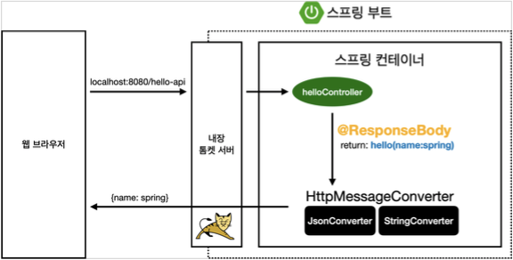

# 6. 스프링 MVC - 기본 기능

## 프로젝트 생성

- 스프링 부트 스타터 사이트로 이동해서 스프링 프로젝트 생성: [https://start.spring.io](https://start.spring.io/)
    - Project: Gradle Project, Language: Java, Spring Boot: 2.4.x
    - Project Metadata
        - Group: hello
        - Group: hello
        Artifact: springmvc
        Name: springmvc
        Package name: hello.springmvc
        Packaging: **Jar (주의!)**
        Java: 11
        - Dependencies: Spring Web, Thymeleaf, Lombok
- JSP를 사용하지 않기 때문에 Jar 사용
    - Jar 를 사용하면 항상 내장 서버(톰캣 등)를 사용하고, webapp 경로도 사용하지 않는다.
    - 내장 서버 사용에 최적화 되어 있는 기능이다. 최근에는 주로 이 방식을 사용한다.
    - War 를 사용하면 내장 서버도 사용가능 하지만, 주로 외부 서버에 배포하는 목적으로 사용한다.

### Welcome 페이지 만들기

---

- 스프링 부트에 Jar 를 사용하면 `/resources/static/index.hml`에 파일을 두면 Welcome 페이지로 처리해준다. (스프링 부트가 지원하는 정적 컨텐츠 위치에 `index.html`이 있으면 된다)

    ```html
    <!DOCTYPE html>
    <html>
    <head>
        <meta charset="UTF-8">
        <title>Title</title>
    </head>
    <body>
    <ul>
        <li>로그 출력
            <ul>
                <li><a href="/log-test">로그 테스트</a></li>
            </ul>
        </li>
        <!-- -->
        <li>요청 매핑
            <ul>
                <li><a href="/hello-basic">hello-basic</a></li>
                <li><a href="/mapping-get-v1">HTTP 메서드 매핑</a></li>
                <li><a href="/mapping-get-v2">HTTP 메서드 매핑 축약</a></li>
                <li><a href="/mapping/userA">경로 변수</a></li>
                <li><a href="/mapping/users/userA/orders/100">경로 변수 다중</a></li>
                <li><a href="/mapping-param?mode=debug">특정 파라미터 조건 매핑</a></li>
                <li><a href="/mapping-header">특정 헤더 조건 매핑(POST MAN 필요)</a></
                li>
                <li><a href="/mapping-consume">미디어 타입 조건 매핑 Content-Type(POST MAN 필요)</a></li>
                <li><a href="/mapping-produce">미디어 타입 조건 매핑 Accept(POST MAN 필요)</a></li>
            </ul>
        </li>
        <li>요청 매핑 - API 예시
            <ul>
                <li>POST MAN 필요</li>
            </ul>
        </li>
        <li>HTTP 요청 기본
            <ul>
                <li><a href="/headers">기본, 헤더 조회</a></li>
            </ul>
        </li>
        <li>HTTP 요청 파라미터
            <ul>
                v1</a></li>
                <li><a href="/request-param-v1?username=hello&age=20">요청 파라미터
                <li><a href="/request-param-v2?username=hello&age=20">요청 파라미터 v2</a></li>
                v3</a></li>
                v4</a></li>
                <li><a href="/request-param-v3?username=hello&age=20">요청 파라미터
                <li><a href="/request-param-v4?username=hello&age=20">요청 파라미터
                <li><a href="/request-param-required?username=hello&age=20">요청 파라미터 필수</a></li>
                <li><a href="/request-param-default?username=hello&age=20">요청 파라미터 기본 값</a></li>
                <li><a href="/request-param-map?username=hello&age=20">요청 파라미터
                <li><a href="/model-attribute-v1?username=hello&age=20">요청 파라미터
                    MAP</a></li>
                @ModelAttribute v1</a></li>
                <li><a href="/model-attribute-v2?username=hello&age=20">요청 파라미터 @ModelAttribute v2</a></li>
            </ul>
        </li>
        <li>HTTP 요청 메시지
            <ul>
                <li>POST MAN</li>
            </ul>
        </li>
        <li>HTTP 응답 - 정적 리소스, 뷰 템플릿
            <ul>
                <li><a href="/basic/hello-form.html">정적 리소스</a></li>
                <li><a href="/response-view-v1">뷰 템플릿 v1</a></li>
                <li><a href="/response-view-v2">뷰 템플릿 v2</a></li>
            </ul>
        </li>
        <li>HTTP 응답 - HTTP API, 메시지 바디에 직접 입력
            <ul>
                <li><a href="/response-body-string-v1">HTTP API String v1</a></li>
                <li><a href="/response-body-string-v2">HTTP API String v2</a></li>
                <li><a href="/response-body-string-v3">HTTP API String v3</a></li>
                <li><a href="/response-body-json-v1">HTTP API Json v1</a></li>
                <li><a href="/response-body-json-v2">HTTP API Json v2</a></li>
            </ul>
        </li>
    </ul>
    </body>
    </html>
    ```


## 로깅 간단히 알아보기

- 로깅 라이브러리: `spring-boot-starter-logging`
    - 스프링 부트 라이브러리를 사용하면 스프링 부트 로깅 라이브러리가 함께 포함된다.
    - `spring-boot-starter-logging`은 기본으로 다음 로깅 라이브러리를 사용한다.
        - SLF4J - [http://www.slf4j.org](http://www.slf4j.org/)
        - Logback - [http://logback.qos.ch](http://logback.qos.ch/)
    - 실무에서는 스프링 부트가 기본으로 제공하는 Logback 을 대부분 사용한다.
- SLF4J: 로그 라이브러리는 Logback, Log4J, Log4J2 등 많은 라이브러리가 있는데, 그것을 통합해서 인터페이스로 제공하는 라이브러리다.

- 로그 선언
    - `private Logger log = LoggerFactory.getLogger(getClass());`
    - `private static final Logger log = LoggerFactory.getLogger(Xxx.class);`
    - `@Slf4j`: 롬복 사용 가능
- 로그 호출: 시스템 콘솔로 직접 출력하는 것 보다 로그를 사용하면 여러 장점이 있다.
    - `log.info("hello")`
    - 실무에서는 항상 로그를 사용해야 한다.
- 로그 사용시 장점
    - 쓰레드 정보, 클래스 이름 같은 부가 정보를 함께 볼 수 있고, 출력 모양을 조정할 수 있다.
    - 로그 레벨에 따라 개발 서버에서는 모든 로그를 출력하고, 운영서버에서는 출력하지 않는 등 로그를 상황에 맞게 조절할 수 있다.
    - 시스템 아웃 콘솔에만 출력하는 것이 아니라, 파일이나 네트워크 등, 로그를 별도의 위치에 남길 수 있다.
    특히 파일로 남길 때는 일별, 특정 용량에 따라 로그를 분할하는 것도 가능하다.
    - 성능도 일반 `System.out`보다 좋다.(내부 버퍼링, 멀티 쓰레드 등등) 그래서 실무에서는 꼭 로그를
    사용해야 한다.

- LogTestController

    ```java
    @Slf4j  // lombok 제공
    @RestController
    public class LogTestController {
    //    private final Logger log = LoggerFactory.getLogger(LogTestController.class);
    //    private final Logger log = LoggerFactory.getLogger(getClass());

        @RequestMapping("/log-test")
        public String logTest() {
            String name = "Spring";

            System.out.println("name = " + name);

            log.trace("trace log = {}", name);
            log.debug("debug log = {}", name);
            // 디폴트는 info 레벨, 아래 3개만 보인다. application.properties 로 로그레벨 설정 가능
            log.info("info log = {}", name);
            log.info("info log2 = " + name);    // 로그를 사용하지 않아도 a+b 계산 로직이 먼저 실행됨, 이런 방식으로 사용하면 X
            log.warn("warn log = {}", name);
            log.error("error log = {}", name);

            return "ok";
        }
    }
    ```

- 실행: [http://localhost:8080/log-test](http://localhost:8080/log-test)

- `@RestController`
    - `@Controller`는 반환 값이 String 이면 뷰 이름으로 인식된다. 그래서 뷰를 찾고 뷰가 랜더링 된다.
    - `@RestController`는 반환 값으로 뷰를 찾는 것이 아니라, HTTP 메시지 바디에 바로 입력한다.
    - 따라서 위의 실행 결과로 ok 메세지를 받을 수 있다. `@ResponseBody`와 관련이 있다.
- 로그가 출력되는 포맷: 시간, 로그 레벨, 프로세스 ID, 쓰레드 명, 클래스명, 로그 메시지
- 로그 레벨 설정
    - LEVEL: `TRACE` > `DEBUG` > `INFO` > `WARN` > `ERROR`
    - 보통 개발 서버는 debug, 운영 서버는 info 출력
    - `application.properties`

        ```yaml
        # 전체 로그 레벨 설정(기본 info)
        logging.level.root=info

        # hello.springmvc 패키지와 그 하위 로그 레벨 설정
        logging.level.hello.springmvc=debug
        ```

- 올바른 로그 사용법
    - `log.debug("data="+data)`: 로그 출력 레벨을 info 로 설정해도 해당 코드에 있는 `"data="+data`가 실행이 되어 문자 더하기 연산이 발생한다.
    - `log.debug("data={}", data)`: 로그 출력 레벨을 info 로 설정하면 더하기 연산이 발생하지 않는다.


## 요청 매핑

- MappingController

    ```java
    package hello.springmvc.basic.requestmapping;

    import org.slf4j.Logger;
    import org.slf4j.LoggerFactory;
    import org.springframework.http.MediaType;
    import org.springframework.web.bind.annotation.*;

    @RestController
    public class MappingController {

        private Logger log = LoggerFactory.getLogger(getClass());

        /**
         * 기본 요청
         * 둘다 허용 /hello-basic, /hello-basic/
         * HTTP 메서드 모두 허용 GET, HEAD, POST, PUT, PATCH, DELETE
         */
        @RequestMapping("/hello-basic")
    //    @RequestMapping({"/hello-basic","/hello-go"}) // 배열로도 가능
        public String helloBasic() {
            log.info("helloBasic");
            return "ok";
        }

        /**
         * method 특정 HTTP 메서드 요청만 허용
         * GET, HEAD, POST, PUT, PATCH, DELETE
         */
        @RequestMapping(value = "/mapping-get-v1", method = RequestMethod.GET)
        public String mappingGetV1() {
            log.info("mappingGetV1");
            return "ok";
        }

        /**
         * 편리한 축약 애노테이션 (코드보기) * @GetMapping
         *
         * @PostMapping
         * @PutMapping
         * @DeleteMapping
         * @PatchMapping
         */
        @GetMapping(value = "/mapping-get-v2")
        public String mappingGetV2() {
            log.info("mapping-get-v2");
            return "ok";
        }

        /**
         * PathVariable 사용
         * 변수명이 같으면 생략 가능
         *
         * @PathVariable("userId") String userId -> @PathVariable userId
         */
        @GetMapping("/mapping/{userId}")
        public String mappingPath(@PathVariable("userId") String data) {
            log.info("mappingPath userId={}", data);
            return "ok";
        }

        /**
         * PathVariable 사용 다중
         */
        @GetMapping("/mapping/users/{userId}/orders/{orderId}")
        public String mappingPath(@PathVariable String userId, @PathVariable Long orderId) {
            log.info("mappingPath userId={}, orderId={}", userId, orderId);
            return "ok";
        }

        /**
         * 파라미터로 추가 매핑
         * params="mode",
         * params="!mode"
         * params="mode=debug"
         * params="mode!=debug" (! = )
         * params = {"mode=debug","data=good"}
         * <p>
         * mode=debug 가 있어야 호출된다. 파라미터 조건까지 매핑 조건으로 지정한 것.
         */
        @GetMapping(value = "/mapping-param", params = "mode=debug")
        public String mappingParam() {
            log.info("mappingParam");
            return "ok";
        }

        /**
         * 특정 헤더로 추가 매핑
         * headers="mode",
         * headers="!mode"
         * headers="mode=debug"
         * headers="mode!=debug" (! = )
         * <p>
         * 헤더까지 매핑 조건으로 지정한 것.
         */
        @GetMapping(value = "/mapping-header", headers = "mode=debug")
        public String mappingHeader() {
            log.info("mappingHeader");
            return "ok";
        }

        /**
         * Content-Type 헤더 기반 추가 매핑 Media Type * consumes="application/json"
         * consumes="!application/json"
         * consumes="application/*"
         * consumes="*\/*"
         * MediaType.APPLICATION_JSON_VALUE
         * <p>
         * 미디어 타입 조건 매핑. 배열로도 가능하다.
         * consumes: 요청의 Content-Type, produces: 내가 생산해내는 타입(클라이언트에서 Accept 가능 타입이어야 함)
         */
    //    @PostMapping(value = "/mapping-consume", consumes = MediaType.APPLICATION_JSON_VALUE)
        @PostMapping(value = "/mapping-consume", consumes = "application/json")
        public String mappingConsumes() {
            log.info("mappingConsumes");
            return "ok";
        }

        /**
         * Accept 헤더 기반 Media Type
         * produces = "text/html"
         * produces = "!text/html"
         * produces = "text/*"
         * produces = "*\/*"
         */
        @PostMapping(value = "/mapping-produce", produces = "text/html")
        public String mappingProduces() {
            log.info("mappingProduces");
            return "ok";
        }
    }
    ```

- `@RequestMapping("/hello-basic")`
    - `@RestController`는 반환 값으로 뷰를 찾는 것이 아니라, HTTP 메시지 바디에 바로 입력한다.

        → `@ResponseBody`

    - `/hello-basic`, `/hello-basic/` 두 요청은 다른 URL 이지만, 스프링은 같은 요청으로 매핑한다.

        → `/hello-basic`

- 대부분의 속성을 배열로 제공하므로 다중 설정 가능.`{"/hello-basic", "/hello-go"}`
- HTTP 메서드: `method` 속성을 지정하지 않으면 HTTP 메서드 무관하게 호출된다.
    - GET, HEAD, POST, PUT, PATCH, DELETE 모두 허용
    - HTTP 메서드와 일치하지 않는 요청이면 스프링 MVC 는 HTTP 405 상태코드(Method Not Allowed)를 반환한다.
- 편리한 축약 애노테이션: 내부에서 `@RequestMapping`과 `method` 지정.
    - `@GetMapping`, `@PostMapping`, `@PutMapping`, `@DeleteMapping`, `@PatchMapping`
- `@RequestMapping`의 URL 경로 템플릿화
    - `/users/1`
    - 최근 HTTP API 는 리소스 경로에 식별자를 넣는 스타일을 선호한다.
    - `@PathVariable`을 사용하면 매칭되는 부분을 편리하게 조회할 수 있다.
        - `@PathVariable`의 이름과 파라미터 이름이 같으면 생략할 수 있다.
        - ex> `@PathVariable("userId") String data` vs `@PathVariable String userId`
- 파라미터로 추가 매핑: 특정 파라미터가 있거나 없는 조건을 추가할 수 있다.
- 특정 헤더 조건 매핑: 파라미터 매핑과 비슷하지만, HTTP 헤더를 사용한다.
- 미디어 타입 조건 매핑: HTTP 요청의 Content-Type, Accept 헤더 기반 미디어 타입으로 매핑한다.
    - HTTP 요청 Content-Type, consume 기반 추가 매핑
        - 만약 맞지 않으면 HTTP 415 상태코드(Unsupported Media Type)을 반환한다.

        ```java
        consumes = "text/plain"
        consumes = {"text/plain", "application/*"}
        consumes = MediaType.TEXT_PLAIN_VALUE
        ```

    - HTTP 요청 Accept, produce 기반 추가 매핑
        - 만약 맞지 않으면 HTTP 406 상태코드(Not Acceptable)을 반환한다.

        ```java
        produces = "text/plain"
        produces = {"text/plain", "application/*"}
        produces = MediaType.TEXT_PLAIN_VALUE produces = "text/plain;charset=UTF-8"
        ```

- 실행
    - PathVariable 사용 - 다중: [http://localhost:8080/mapping/users/userA/orders/100](http://localhost:8080/mapping/users/userA/orders/100)
    - 특정 파라미터 조건 매핑: [http://localhost:8080/mapping-param?mode=debug](http://localhost:8080/mapping-param?mode=debug)

### API 예시

---

- 회원 관리 API
    - 회원 목록 조회: GET `/users`
    - 회원 등록: POST `/users`
    - 회원 조회: GET `/users/{userId}`
    - 회원수정: PATCH `/users/{userId}`
    - 회원 삭제: DELETE `/users/{userId}`
- MappingClassController

    ```java
    @RestController
    @RequestMapping("/mapping/users")
    public class MappingClassController {

        /**
         * GET /mapping/users
         */
        @GetMapping
        public String users() {
            return "get users";
        }

        /**
         * POST /mapping/users
         */
        @PostMapping
        public String addUser() {
            return "post user";
        }

        /**
         * GET /mapping/users/{userId}
         */
        @GetMapping("/{userId}")
        public String findUser(@PathVariable String userId) {
            return "get userId=" + userId;
        }

        /**
         * PATCH /mapping/users/{userId}
         */
        @PatchMapping("/{userId}")
        public String updateUser(@PathVariable String userId) {
            return "update userId=" + userId;
        }

        /**
         * DELETE /mapping/users/{userId}
         */
        @DeleteMapping("/{userId}")
        public String deleteUser(@PathVariable String userId) {
            return "delete userId=" + userId;
        }
    }
    ```


## HTTP 요청

### 기본, 헤더 조회

---

- RequestHeaderController

    ```java
    @Slf4j
    @RestController
    public class RequestHeaderController {
        @RequestMapping("/headers")
        public String headers(HttpServletRequest request,
                              HttpServletResponse response,
                              HttpMethod httpMethod,
                              Locale locale,
                              @RequestHeader MultiValueMap<String, String> headerMap,
                              @RequestHeader("host") String host,
                              @CookieValue(value = "myCookie", required = false) String cookie) {

            log.info("request={}", request);
            log.info("response={}", response);
            log.info("httpMethod={}", httpMethod);
            log.info("locale={}", locale);
            log.info("headerMap={}", headerMap);
            log.info("header host={}", host);
            log.info("myCookie={}", cookie);

            return "ok";
        }
    }
    ```

- 예제의 Controller 메소드 argument
    - `HttpServletRequest`, `HttpServletResponse`
    - `HttpMethod`: HTTP 메서드 조회. `org.springframework.http.HttpMethod`
    - `Locale`: Locale 정보 조회.
    - `@RequestHeader`: HTTP 헤더 조회.
        - `@RequestHeader MultiValueMap<String, String> headerMap`: 모든 HTTP 헤더를 MultiValueMap 형식으로 조회한다.
            - MAP 과 유사한데, 하나의 키에 여러 값을 받을 수 있다.
            - HTTP header, HTTP 쿼리 파라미터 같이 하나의 키에 여러 값을 받을 때 사용한다.
            - ex> keyA=value1&keyA=value2

                ```java
                MultiValueMap<String, String> map = new LinkedMultiValueMap();
                map.add("keyA", "value1");
                map.add("keyA", "value2");

                //[value1,value2]
                List<String> values = map.get("keyA");
                ```

        - `@RequestHeader("host") String host`: 특정 HTTP 헤더를 조회한다.
            - 속성
                - 필수 값 여부: `required`
                - 기본 값 속성: `defaultValue`
    - `@CookieValue`: 특정 쿠키 조회.
        - `@CookieValue(value = "myCookie", required = false) String cookie`
        - 속성
            - 필수 값 여부: `required`
            - 기본 값: `defaultValue`
- `@Slf4j`
    - 아래 코드를 자동으로 생성해서 로그를 선언해준다. 개발자는 편리하게 `log`라고 사용하면 된다.

    ```java
    private static final org.slf4j.Logger log = org.slf4j.LoggerFactory.getLogger(RequestHeaderController.class);
    ```

- 참고
    - `@Controller`의 사용 가능한 파라미터 목록: [https://docs.spring.io/spring-framework/docs/current/reference/html/web.html#mvc-ann-arguments](https://docs.spring.io/spring-framework/docs/current/reference/html/web.html#mvc-ann-arguments)
    - `@Controller`의 사용 가능한 응답 값 목록: [https://docs.spring.io/spring-framework/docs/current/reference/html/web.html#mvc-ann-return-types](https://docs.spring.io/spring-framework/docs/current/reference/html/web.html#mvc-ann-return-types)

### HTTP 요청 데이터 조회 - 개요

---

- 클라이언트에서 서버로 요청 데이터를 전달할 때는 주로 다음 3가지 방법을 사용한다.
    - GET - 쿼리 파라미터
        - /url**?username=hello&age=20**
        - 메시지 바디 없이, URL의 쿼리 파라미터에 데이터를 포함해서 전달
        - 예) 검색, 필터, 페이징등에서 많이 사용하는 방식
    - POST - HTML Form
        - content-type: application/x-www-form-urlencoded
        - 메시지 바디에 쿼리 파리미터 형식으로 전달 username=hello&age=20
        - 예) 회원 가입, 상품 주문, HTML Form 사용
    - HTTP message body 에 데이터를 직접 담아서 요청
        - HTTP API에서 주로 사용, JSON, XML, TEXT
        - 데이터 형식은 주로 JSON 사용
        - POST, PUT, PATCH

### HTTP 요청 파라미터 - 쿼리 파라미터, HTML Form

---

- RequestParamController

    ```java
    @Slf4j
    @Controller
    public class RequestParamController {

        /**
         * 반환 타입이 없으면서 이렇게 응답에 값을 직접 집어넣으면, view 조회 X
         */
        @RequestMapping("/request-param-v1")
        public void requestParamV1(HttpServletRequest request, HttpServletResponse response) throws IOException {

            String username = request.getParameter("username");
            int age = Integer.parseInt(request.getParameter("age"));
            log.info("username={}, age={}", username, age);

            response.getWriter().write("ok");
        }
    }
    ```

- main/resources/static/basic/hello-form.html
    - 리소스는 `/resources/static` 아래에 두면 스프링 부트가 자동으로 인식한다.

    ```html
    <!DOCTYPE html>
    <html>
    <head>
        <meta charset="UTF-8">
        <title>Title</title>
    </head>
    <body>
    <form action="/request-param-v1" method="post">
        username: <input type="text" name="username"/> age: <input type="text" name="age"/>
        <button type="submit">전송</button>
    </form>
    </body>
    </html>
    ```

    - `Jar`를 사용하면 `webapp` 경로를 사용할 수 없다.
    - 이제부터 정적 리소스도 클래스 경로에 함께 포함해야 한다.

- 실행

- 요청 파라미터(request parameter) 조회: `HttpServletRequest`의 `request.getParameter()`를 사용하면 다음 두가지 요청 파라미터를 조회할 수 있다.
    - GET, 쿼리 파라미터 전송: `http://localhost:8080/request-param?username=hello&age=20`
    - POST, HTML Form 전송

        ```java
        POST /request-param ...
        content-type: application/x-www-form-urlencoded

        username=hello&age=20
        ```

    → GET 쿼리 파리미터, POST HTML Form 전송 방식 둘 다 형식이 같으므로 구분없이 조회할 수 있다.

### HTTP 요청 파라미터 - @RequestParam

---

- requestParamV2 메소드

    ```java
    /**
     * @RequestParam 사용
     * - 파라미터 이름으로 바인딩
     * @ResponseBody 추가
     * - View 조회를 무시하고, HTTP message body에 직접 해당 내용 입력
     */
    @ResponseBody
    @RequestMapping("/request-param-v2")
    public String requestParamV2(@RequestParam("username") String memberName,
                                 @RequestParam("age") int memberAge) {
        log.info("username={}, age={}", memberName, memberAge);
        return "ok";
    }
    ```

- requestParamV3 메소드

    ```java
    /**
     * @RequestParam 사용
     * HTTP 파라미터 이름이 변수 이름과 같으면 @RequestParam(name="xx") 생략 가능
     */
    @ResponseBody
    @RequestMapping("/request-param-v3")
    public String requestParamV3(@RequestParam String username,
                                 @RequestParam int age) {
        log.info("username={}, age={}", username, age);
        return "ok";
    }
    ```

- requestParamV4 메소드

    ```java
    /**
     * @RequestParam 사용
     * String, int 등의 단순 타입이면 @RequestParam 도 생략 가능
     */
    @ResponseBody
    @RequestMapping("/request-param-v4")
    public String requestParamV4(String username, int age) {
        log.info("username={}, age={}", username, age);
        return "ok";
    }
    ```

- 파라미터 필수 여부 - requestParamRequired 메소드

    ```java
    /**
     * @RequestParam.required /request-param -> username이 없으므로 예외
     *
     * 주의!
     * /request-param?username= -> 빈문자로 통과
     *
     * 주의!
     * /request-param
     * int age -> null을 int에 입력하는 것은 불가능, 따라서 Integer 변경해야 함 (또는 다음에 나오는 defaultValue 사용)
     */
    @ResponseBody
    @RequestMapping("/request-param-required")
    public String requestParamRequired(@RequestParam(required = true) String username,
                                       @RequestParam(required = false) Integer age) {
        log.info("username={}, age={}", username, age);
        return "ok";
    }
    ```

- 기본 값 적용 - requestParamDefault

    ```java
    /**
     * @RequestParam
     * - defaultValue 사용
     *
     * 참고: defaultValue는 빈 문자의 경우에도 적용
     * /request-param?username=
     */
    @ResponseBody
    @RequestMapping("/request-param-default")
    public String requestParamDefault(@RequestParam(required = true, defaultValue = "guest") String username,
                                      @RequestParam(required = false, defaultValue = "-1") int age) {
        log.info("username={}, age={}", username, age);
        return "ok";
    }
    ```

- 파라미터를 Map으로 조회하기 - requestParamMap

    ```java
    /**
     * @RequestParam Map, MultiValueMap
     * Map(key=value)
     * MultiValueMap(key=[value1, value2, ...] ex) (key=userIds, value=[id1, id2])
     */
    @ResponseBody
    @RequestMapping("/request-param-map")
    public String requestParamMap(@RequestParam Map<String, Object> paramMap) {
        log.info("username={}, age={}", paramMap.get("username"), paramMap.get("age"));
        return "ok";
    }
    ```

- `@RequestParam`: 파라미터 이름으로 바인딩
    - `@RequestParam("username") String memberName`

        → `request.getParameter("username")`

    - HTTP 파라미터 이름이 변수 이름과 같으면 `@RequestParam(name="xx")` 생략 가능 - V3
    - String , int , Integer 등의 단순 타입이면 `@RequestParam`도 생략 가능 - V4
        - `@RequestParam` 생략하면 스프링 MVC는 내부에서 `required=false`를 적용한다.
        - 이렇게 완전히 생략해도 되는데, 약간 과하다는 주관적 생각이..
    - `required`: 파라미터 필수 여부, 기본값이 파라미터 필수(`true`)이다.
    - `defaultValue`: 파라미터에 값이 없는 경우 defaultValue 를 사용하면 기본 값을 적용할 수 있다. 빈 문자의 경우에도 설정한 기본 값이 적용된다. ex> `/request-param?username=`
    - 파라미터를 Map, MultiValueMap 으로 조회할 수 있다.
        - `@RequestParam Map<String, Object> paramMap`
        - 파라미터의 값이 1개가 확실하다면 `Map`을 사용해도 되지만, 그렇지 않다면 `MultiValueMap`을 사용하자.
- 주의!
    - 파라미터 이름만 있고 값이 없는 경우, 빈 문자로 통과 ex> `/request-param?username=`
    - 기본형(primitive)에 null 입력 불가능
        - `@RequestParam(required = false) int age` 인 경우, null 입력 시 500 예외 발생
        - `null`을 받을 수 있는 `Integer`로 변경하거나, `defaultValue` 사용
- `@ResponseBody`: View 조회를 무시하고, HTTP message body에 직접 해당 내용 입력

### HTTP 요청 파라미터 - @ModelAttribute

---

- HelloData

    ```java
    @Data
    public class HelloData {
        private String username;
        private int age;
    }
    ```

- `@ModelAttribute` 적용 전 - modelAttributeV1

    ```java
    /**
     * @ModelAttribute 사용
     * 참고: model.addAttribute(helloData) 코드도 함께 자동 적용됨, 뒤에 model 설명할 때 자세히 설명
     */
    @ResponseBody
    @RequestMapping("/model-attribute-v1")
    public String modelAttributeV1(@RequestParam String username, @RequestParam int age) {
        HelloData helloData = new HelloData();
        helloData.setUsername(username);
        helloData.setAge(age);

        log.info("username={}, age={}", helloData.getUsername(), helloData.getAge());
        log.info("helloData={}", helloData);

        return "ok";
    }
    ```

- `@ModelAttribute` 생략 - modelAttributeV2

    ```java
    /**
     * @ModelAttribute 생략 가능
     * String, int 같은 단순 타입 = @RequestParam
     * argument resolver 로 지정해둔 타입 외 = @ModelAttribute
     */
    @ResponseBody
    @RequestMapping("/model-attribute-v2")
    //    public String modelAttributeV2(@ModelAttribute HelloData helloData) {
    public String modelAttributeV2(HelloData helloData) {
        log.info("username={}, age={}", helloData.getUsername(), helloData.getAge());
        return "ok";
    }
    ```

- 스프링MVC 는 `@ModelAttribute`가 있으면 다음을 실행한다.
    - `HelloData` 객체를 생성한다.
    - 요청 파라미터의 이름으로 `HelloData` 객체의 프로퍼티를 찾는다. 그리고 해당 프로퍼티의 setter를
    호출해서 파라미터의 값을 입력(바인딩) 한다.
    - ex> 파라미터 이름이 `username`이면 `setUsername()` 메서드를 찾아 호출하면서 값을 입력한다.
    - 숫자가 들어가야 할 곳에 문자를 넣으면 바인딩 오류(BindException)가 발생한다.
- `@ModelAttribute`
    - 실제 개발을 하면 요청 파라미터를 받아서 필요한 객체를 만들고 그 객체에 값을 넣어주어야 한다.

        ```java
        @RequestParam String username;
        @RequestParam int age;

        HelloData data = new HelloData();
        data.setUsername(username);
        data.setAge(age);
        ```

    - 스프링은 이 과정을 완전히 자동화해주는 기능을 제공한다.
    - `@ModelAttribute` 생략할 수 있는데 `@RequestParam`도 생략할 수 있어, 혼란이 발생할 수 있다.
    - 생략 시 스프링이 적용하는 규칙
        - `String`, `int`, `Integer` 같은 단순 타입 = `@RequestParam`
        - 나머지 = `@ModelAttribute` (argument resolver 로 지정해둔 타입 외)
- `@Data`
    - `@Getter`, `@Setter`, `@ToString`, `@EqualsAndHashCode`, `@RequiredArgsConstructor`를 자동 적용해준다.

### HTTP 요청 메시지 - 단순 텍스트

---

- requestBodyString 메소드

    ```java
    @PostMapping("/request-body-string-v1")
    public void requestBodyString(HttpServletRequest request,
                                  HttpServletResponse response) throws IOException {
        ServletInputStream inputStream = request.getInputStream();
        String messageBody = StreamUtils.copyToString(inputStream, StandardCharsets.UTF_8);

        log.info("messageBody={}", messageBody);
        response.getWriter().write("ok");
    }
    ```

- 실행: POST [http://localhost:8080/request-body-string-v1](http://localhost:8080/request-body-string-v1)
    - Body → row, Text 선택

- Input, Output 스트림, Reader - requestBodyStringV2

    ```java
    /**
     * InputStream(Reader): HTTP 요청 메시지 바디의 내용을 직접 조회
     * OutputStream(Writer): HTTP 응답 메시지의 바디에 직접 결과 출력
     */
    @PostMapping("/request-body-string-v2")
    public void requestBodyStringV2(InputStream inputStream, Writer responseWriter) throws IOException {
        String messageBody = StreamUtils.copyToString(inputStream, StandardCharsets.UTF_8);

        log.info("messageBody={}", messageBody);
        responseWriter.write("ok");
    }
    ```

- HttpEntity - requestBodyStringV3

    ```java
    /**
     * HttpEntity: HTTP header, body 정보를 편라하게 조회
     * - 메시지 바디 정보를 직접 조회(@RequestParam X, @ModelAttribute X)
     * - HttpMessageConverter 사용 -> StringHttpMessageConverter 적용
     *
     * 응답에서도 HttpEntity 사용 가능
     * - 메시지 바디 정보 직접 반환(view 조회X)
     * - HttpMessageConverter 사용 -> StringHttpMessageConverter 적용
     */
    @PostMapping("/request-body-string-v3")
    public HttpEntity<String> requestBodyStringV3(HttpEntity<String> httpEntity) {
        String messageBody = httpEntity.getBody();
        log.info("messageBody={}", messageBody);

        return new HttpEntity<>("ok");
    }

    @PostMapping("/request-body-string-v3_1")
    public HttpEntity<String> requestBodyStringV3_1(RequestEntity<String> httpEntity) {
        String messageBody = httpEntity.getBody();
        log.info("messageBody={}", messageBody);

        return new ResponseEntity<>("ok", HttpStatus.CREATED);
    }
    ```

- `@RequestBody` - requestBodyStringV4

    ```java
    /**
     * @RequestBody
     * - 메시지 바디 정보를 직접 조회(@RequestParam X, @ModelAttribute X)
     * - HttpMessageConverter 사용 -> StringHttpMessageConverter 적용
     *
     * @ResponseBody
     * - 메시지 바디 정보 직접 반환(view 조회X)
     * - HttpMessageConverter 사용 -> StringHttpMessageConverter 적용
     */
    @ResponseBody
    @PostMapping("/request-body-string-v4")
    public String requestBodyStringV4(@RequestBody String messageBody) {
        log.info("messageBody={}", messageBody);
        return "ok";
    }
    ```

- 요청 파라미터와 다르게, HTTP 메시지 바디를 통해 데이터가 직접 데이터가 넘어오는 경우는 `@RequestParam`, `@ModelAttribute`를 사용할 수 없다.
    - 물론 HTML Form 형식으로 전달되는 경우는 요청 파라미터로 인정된다.
    - HTTP 메시지 바디의 데이터를 `InputStream`을 사용해서 직접 읽을 수 있다.
- 스프링 MVC 는 `InputStream`, `OutputStream` 파라미터를 지원한다. - V2
    - InputStream(Reader): HTTP 요청 메시지 바디의 내용을 직접 조회
    - OutputStream(Writer): HTTP 응답 메시지의 바디에 직접 결과 출력
- 스프링 MVC는 `HttpEntity` 파라미터를 지원한다. - V3
    - `HttpEntity`: HTTP header, body 정보를 편리하게 조회
        - 메시지 바디 정보를 직접 조회
        - 요청 파라미터를 조회하는 기능과 관계 없음 `@RequestParam` X, `@ModelAttribute` X
    - `HttpEntity`는 응답에도 사용 가능
        - 메시지 바디 정보 직접 반환
        - 헤더 정보 포함 가능
        - view 조회X
    - `HttpEntity` 상속받은 `RequestEntity`, `ResponseEntity`도 같은 기능을 제공한다. - V3_1
        - `RequestEntity`: HttpMethod, url 정보가 추가된다. 요청에서 사용
        - `ResponseEntity`: HTTP 상태 코드 설정 가능. 응답에서 사용
- 스프링 MVC 내부에서 HTTP 메시지 바디를 읽어서 문자나 객체로 변환해서 전달해주는데, 이때 HTTP 메시지 컨버터(`HttpMessageConverter`) 기능을 사용한다.
- 헤더 정보가 필요하다면 `HttpEntity`를 사용하거나 `@RequestHeader`를 사용하면 된다.
- `@RequestBody`: HTTP 메시지 바디 정보를 편리하게 조회할 수 있다.
    - 이렇게 메시지 바디를 직접 조회하는 기능은 요청 파라미터를 조회하는 `@RequestParam`, `@ModelAttribute`와는 전혀 관계가 없다.
- 요청 파라미터 vs HTTP 메시지 바디
    - 요청 파라미터를 조회하는 기능: `@RequestParam`, `@ModelAttribute`
    - HTTP 메시지 바디를 직접 조회하는 기능: `@RequestBody`
- `@ResponseBody`: 응답 결과를 HTTP 메시지 바디에 직접 담아서 전달할 수 있다.
    - 이 경우에도 view를 사용하지 않는다.

### HTTP 요청 메시지 - JSON

---

- RequestBodyJsonController: `HttpServletRequest`, `objectMapper`사용

    ```java
    /**
     * {"username":"hello", "age":20}
     * content-type: application/json
     */
    @Slf4j
    @Controller
    public class RequestBodyJsonController {

        private ObjectMapper objectMapper = new ObjectMapper();

        @PostMapping("/request-body-json-v1")
        public void requestBodyJsonV1(HttpServletRequest request,
    																	HttpServletResponse response) throws IOException {
            ServletInputStream inputStream = request.getInputStream();
            String messageBody = StreamUtils.copyToString(inputStream, StandardCharsets.UTF_8);

            log.info("messageBody={}", messageBody);
            HelloData data = objectMapper.readValue(messageBody, HelloData.class);
            log.info("username={}, age={}", data.getUsername(), data.getAge());

            response.getWriter().write("ok");
        }
    }
    ```

    - `HttpServletRequest`를 사용해서 직접 HTTP 메시지 바디에서 데이터를 읽어와서, 문자로 변환한다.
    - 문자로 된 JSON 데이터를 Jackson 라이브러리인 `objectMapper`를 사용해서 자바 객체로 변환한다.
- 실행: POST [http://localhost:8080/request-body-json-v1](http://localhost:8080/request-body-json-v1)
    - raw, JSON, content-type: application/json
    - `{"username":"hello", "age":20}`

- requestBodyJsonV2 - `@RequestBody` 문자 변환, `objectMapper`사용

    ```java
    /**
    * @RequestBody
    * HttpMessageConverter 사용 -> StringHttpMessageConverter 적용
    *
    * @ResponseBody
    * - 모든 메서드에 @ResponseBody 적용
    * - 메시지 바디 정보 직접 반환(view 조회X)
    * - HttpMessageConverter 사용 -> StringHttpMessageConverter 적용
    */
    @ResponseBody
    @PostMapping("/request-body-json-v2")
    public String requestBodyJsonV2(@RequestBody String messageBody) throws IOException {
        HelloData data = objectMapper.readValue(messageBody, HelloData.class);
        
        log.info("username={}, age={}", data.getUsername(), data.getAge());

        return "ok";
    }
    ```

    - `@RequestBody`를 사용해서 HTTP 메시지에서 데이터를 꺼내고 messageBody에 저장한다.
    - 문자로 된 JSON 데이터인 messageBody 를 `objectMapper`를 통해서 자바 객체로 변환한다.
- requestBodyJsonV3 - `@RequestBody` 객체 변환

    ```java
    /**
    * @RequestBody 생략 불가능(@ModelAttribute 가 적용되어 버림)
    * HttpMessageConverter 사용 -> MappingJackson2HttpMessageConverter (content-type: application/json)
    *
    */
    @ResponseBody
    @PostMapping("/request-body-json-v3")
    public String requestBodyJsonV3(@RequestBody HelloData data) {
        log.info("username={}, age={}", data.getUsername(), data.getAge());

        return "ok";
    }
    ```

- requestBodyJsonV4 - `HttpEntity`

    ```java
    @ResponseBody
    @PostMapping("/request-body-json-v4")
    public String requestBodyJsonV4(HttpEntity<HelloData> httpEntity) {
        HelloData data = httpEntity.getBody();
        log.info("username={}, age={}", data.getUsername(), data.getAge());

        return "ok";
    }
    ```

- requestBodyJsonV5

    ```java
    /**
     * @RequestBody 생략 불가능(@ModelAttribute 가 적용되어 버림)
     * HttpMessageConverter 사용 -> MappingJackson2HttpMessageConverter (content-type: application/json)
     *
     * @ResponseBody 적용
     * - 메시지 바디 정보 직접 반환(view 조회X)
     * - HttpMessageConverter 사용 -> MappingJackson2HttpMessageConverter 적용 (Accept: application/json)
     */
    @ResponseBody
    @PostMapping("/request-body-json-v5")
    public HelloData requestBodyJsonV5(@RequestBody HelloData data) {
        log.info("username={}, age={}", data.getUsername(), data.getAge());
        return data;
    }
    ```

- `@RequestBody` 객체 파라미터
    - `@RequestBody HelloData data`: 직접 만든 객체를 지정할 수 있다.
    - `HttpEntity`, `@RequestBody`를 사용하면 HTTP message converter 가 HTTP 메시지 바디의 내용을 우리가 원하는 문자나 객체 등으로 변환해준다.
    - HTTP message converter 는 문자 뿐만 아니라 JSON 도 객체로 변환해주는데, V2에서 했던 작업을 대신 처리해준다.
        - HTTP 요청시에 content-type이 application/json인지 확인해야 한다. 그래야 JSON 을 처리할 수 있는 HTTP message converter 가 실행된다.
    - JSON 요청 → HTTP 메시지 컨버터 → 객체
- `@RequestBody`는 생략 불가능
    - HelloData에 `@RequestBody`를 생략하면 `@ModelAttribute`가 적용되어버린다.
- `@ResponseBody`
    - 객체를 HTTP 메시지 바디에 직접 넣어줄 수 있다.
    - 이 경우에도 `HttpEntity`를 사용해도 된다.
    - 객체 → HTTP 메시지 컨버터 → JSON 응답

### HTTP 응답 - 정적 리소스, 뷰 템플릿

---

- 스프링(서버)에서 응답 데이터를 만드는 방법은 크게 3가지이다.
    - 정적 리소스
        - 스프링 부트는 클래스패스의 `/static`, `/public`, `/resources`, `/META-INF/resources` 디렉토리에 있는 정적 리소스를 제공한다.
        - `src/main/resources`는 리소스를 보관하는 곳이고, 또 클래스패스의 시작 경로이다.
        - 정적 리소스 경로: `src/main/resources/static`
            - src/main/resources/static/basic/hello-form.html 에 파일이 들어있으면
            - [http://localhost:8080/basic/hello-form.html](http://localhost:8080/basic/hello-form.html) 같이 실행하면 된다.
        - ex> 웹 브라우저에 정적인 HTML, css, js을 제공할 때는, 정적 리소스를 사용한다.
    - 뷰 템플릿 사용
        - 뷰 템플릿을 거쳐서 HTML이 생성되고, 뷰가 응답을 만들어서 전달한다.
        - 스프링 부트의 기본 뷰 템플릿 경로: `src/main/resources/templates`
        - ex> 웹 브라우저에 동적인 HTML을 제공할 때는 뷰 템플릿을 사용한다.
    - HTTP 메시지 사용
        - HTTP API 를 제공하는 경우에는 HTML 이 아니라 데이터를 전달해야 하므로, HTTP 메시지 바디에 JSON 같은 형식으로 데이터를 실어 보낸다.
        - `@ResponseBody`, `HttpEntity`를 사용하면, 뷰 템플릿을 사용하는 것이 아니라, HTTP 메시지 바디에 직접 응답 데이터를 출력할 수 있다.

- 뷰 템플릿 생성: src/main/resources/templates/response/hello.html

    ```html
    <!DOCTYPE html>
    <html xmlns:th="http://www.thymeleaf.org">
    <head>
        <meta charset="UTF-8">
        <title>Title</title>
    </head>
    <body>
    <p th:text="${data}">empty</p>
    </body>
    </html>
    ```

- ResponseViewController - 뷰 템플릿을 호출하는 컨트롤러

    ```java
    @Controller
    public class ResponseViewController {

        @RequestMapping("/response-view-v1")
        public ModelAndView responseViewV1() {
            ModelAndView mav = new ModelAndView("response/hello")
                    .addObject("data", "hello!");
            return mav;
        }

        @RequestMapping("/response-view-v2")
        public String responseViewV2(Model model) {
            model.addAttribute("data", "hello!!");
            return "response/hello";
        }

        @RequestMapping("/response/hello")
        public void responseViewV3(Model model) {
            model.addAttribute("data", "hello!!");
        }
    }
    ```

- String을 반환하는 경우 - View or HTTP 메시지
    - `@ResponseBody`가 없으면 response/hello 로 뷰 리졸버가 실행되어서 뷰를 찾고, 렌더링 한다.
    - `@ResponseBody`가 있으면 뷰 리졸버를 실행하지 않고, HTTP 메시지 바디에 직접 response/hello 라는 문자가 입력된다.
    - 실행: templates/response/hello.html
- Void를 반환하는 경우
    - `@Controller`를 사용하고, `HttpServletResponse`, `OutputStream(Writer)`같은 HTTP 메시지 바디 처리 파라미터가 없으면 요청 URL을 참고해 논리 뷰 이름으로 사용 → 명시성이 떨어져서 권장X
    - 요청 URL: /response/hello
    - 실행: templates/response/hello.html

- Thymeleaf 스프링 부트 설정
    - build.gradle

        ```yaml
        implementation 'org.springframework.boot:spring-boot-starter-thymeleaf'
        ```

    - 스프링 부트가 자동으로 `ThymeleafViewResolver`와 필요한 스프링 빈들을 등록한다.
- Thymeleaf prefix, suffix 기본 설정값
    - application.properties

        ```yaml
        spring.thymeleaf.prefix=classpath:/templates/
        spring.thymeleaf.suffix=.html
        ```

### HTTP 응답 - HTTP API, 메시지 바디에 직접 입력

---

- ResponseBodyController

    ```java
    @Slf4j
    @Controller
    //@RestController
    public class ResponseBodyController {

        @GetMapping("/response-body-string-v1")
        public void responseBodyV1(HttpServletResponse response) throws IOException {
            response.getWriter().write("ok");
        }

        /**
         * HttpEntity, ResponseEntity(Http Status 추가)
         */
        @GetMapping("/response-body-string-v2")
        public ResponseEntity<String> responseBodyV2() {
            return new ResponseEntity<>("ok", HttpStatus.OK);
        }

        @ResponseBody
        @GetMapping("/response-body-string-v3")
        public String responseBodyV3() {
            return "ok";
        }

        @GetMapping("/response-body-json-v1")
        public ResponseEntity<HelloData> responseBodyJsonV1() {
            HelloData helloData = new HelloData();
            helloData.setUsername("userA");
            helloData.setAge(20);
            return new ResponseEntity<>(helloData, HttpStatus.OK);
        }

        @ResponseStatus(HttpStatus.OK)
        @ResponseBody
        @GetMapping("/response-body-json-v2")
        public HelloData responseBodyJsonV2() {
            HelloData helloData = new HelloData();
            helloData.setUsername("userA");
            helloData.setAge(20);
            return helloData;
        }
    }
    ```

    - responseBodyV1: 서블릿을 직접 다룰 때 처럼 `HttpServletResponse` 객체를 통해서 HTTP 메시지 바디에 직접 ok 응답 메시지를 전달한다.
    - responseBodyJsonV1: `ResponseEntity`를 반환한다. HTTP 메시지 컨버터를 통해서 JSON 형식으로 변환되어서 반환된다.

- `ResponseEntity` - V2
    - `HttpEntity`를 상속 받았는데, `HttpEntity`는 HTTP 메시지의 헤더, 바디 정보를 가지고 있다.
    - `ResponseEntity`는 여기에 더해서 HTTP 응답 코드를 설정할 수 있다.
- `@ResponseBody`: view를 사용하지 않고, HTTP 메시지 컨버터를 통해서 HTTP 메시지를 직접 입력할 수 있다. - V3
    - `ResponseEntity`도 동일한 방식으로 동작한다.
- `@ResponseStatus(HttpStatus.OK)`: 응답 코드를 설정할 수 있다.
    - `ResponseEntity`는 HTTP 응답 코드를 설정할 수 있는데, `@ResponseBody`를 사용하면 이런 것을 설정하기 까다로워 같이 사용되곤 한다.
    - 애노테이션이기 때문에 응답 코드를 동적으로 변경할 수는 없다. 프로그램 조건에 따라서 동적으로 변경하려면 `ResponseEntity`를 사용하자.

### HTTP 메시지 컨버터

---

- `@ResponseBody` 사용 원리

    

    - HTTP의 BODY에 문자 내용을 직접 반환
    - `viewResolver` 대신 `HttpMessageConverter`가 동작
- `HttpMessageConverter`
    - 기본 문자처리: `StringHttpMessageConverter`
    - 기본 객체처리: `MappingJackson2HttpMessageConverter`
    - byte 처리 등등 기타 여러 HttpMessageConverter가 기본으로 등록되어 있음
    - 응답의 경우, 클라이언트의 HTTP Accept 해더와 서버의 컨트롤러 반환 타입 정보 둘을 조합해서 `HttpMessageConverter`가 선택된다.

- 스프링 MVC 는 다음의 경우에 HTTP 메시지 컨버터를 적용한다.
    - HTTP 요청: `@RequestBody`, `HttpEntity(RequestEntity)`
    - HTTP 응답: `@ResponseBody`, `HttpEntity(ResponseEntity)`
- HTTP 메시지 컨버터 인터페이스: `org.springframework.http.converter.HttpMessageConverter`

    ```java
    package org.springframework.http.converter;

    public interface HttpMessageConverter<T> {
        boolean canRead(Class<?> clazz, @Nullable MediaType mediaType);
        boolean canWrite(Class<?> clazz, @Nullable MediaType mediaType);

        List<MediaType> getSupportedMediaTypes();

    		T read(Class<? extends T> clazz, HttpInputMessage inputMessage) throws IOException, HttpMessageNotReadableException;

        void write(T t, @Nullable MediaType contentType, HttpOutputMessage outputMessage) throws IOException, HttpMessageNotWritableException;
    }
    ```

    - `canRead()`, `canWrite()`: 메시지 컨버터가 해당 클래스, 미디어타입을 지원하는지 체크
    - `read()`, `write()`: 메시지 컨버터를 통해서 메시지를 읽고 쓰는 기능
    - 스프링 부트는 다양한 메시지 컨버터를 제공하는데, 대상 클래스 타입과 미디어 타입 둘을 체크해서 사용여부를 결정한다. 만약 만족하지 않으면 다음 메시지 컨버터로 우선순위가 넘어간다.
- 스프링 부트 기본 메시지 컨버터 (일부 생략)

    ```java
    0 = ByteArrayHttpMessageConverter
    1 = StringHttpMessageConverter
    2 = MappingJackson2HttpMessageConverter
    ```

    - `ByteArrayHttpMessageConverter`: `byte[]` 데이터를 처리한다.
        - 클래스 타입: `byte[]`, 미디어타입: `*/*`
        - 요청 ex> `@RequestBody byte[] data`
        - 응답 ex> `@ResponseBody return byte[]` 쓰기 미디어타입 `application/octet-stream`
    - `StringHttpMessageConverter`: `String` 문자로 데이터를 처리한다.
        - 클래스 타입: `String`, 미디어타입: `*/*`
        - 요청 ex> `@RequestBody String data`

            ```java
            content-type: application/json

            @RequestMapping
            void hello(@RequetsBody String data) {}
            ```

        - 응답 ex> `@ResponseBody return "ok"` 쓰기 미디어타입 `text/plain`
    - `MappingJackson2HttpMessageConverter`: application/json
        - 클래스 타입: 객체 또는 `HashMap`, 미디어타입 `application/json` 관련
        - 요청 ex> `@RequestBody HelloData data`

            ```java
            content-type: application/json

            @RequestMapping
            void hello(@RequetsBody HelloData data) {}
            ```

        - 응답 ex> `@ResponseBody return helloData` 쓰기 미디어타입 `application/json` 관련

- HTTP 요청 데이터 읽기
    - HTTP 요청이 오고, 컨트롤러에서 `@RequestBody`, `HttpEntity` 파라미터를 사용한다.
    - 메시지 컨버터가 메시지를 읽을 수 있는지 확인하기 위해 `canRead()`를 호출한다.
        - 대상 클래스 타입을 지원하는가?
            - ex> `@RequestBody`의 대상 클래스(`byte[]`, `String`, `HelloData`)
        - HTTP 요청의 Content-Type 미디어 타입을 지원하는가?
            - ex> `text/plain`, `application/json`, `*/*`
    - `canRead()` 조건을 만족하면 `read()`를 호출해서 객체 생성하고, 반환한다.
- HTTP 응답 데이터 생성
    - 컨트롤러에서 `@ResponseBody`, `HttpEntity`로 값이 반환된다.
    - 메시지 컨버터가 메시지를 쓸 수 있는지 확인하기 위해 `canWrite()`를 호출한다.
        - 대상 클래스 타입을 지원하는가?
            - ex> return의 대상 클래스 (`byte[]`, `String`, `HelloData`)
        - HTTP 요청의 Accept 미디어 타입을 지원하는가? (더 정확히는 `@RequestMapping`의 `produces`)
            - ex> `text/plain`, `application/json`, `*/*`
    - `canWrite()` 조건을 만족하면 `write()`를 호출해서 HTTP 응답 메시지 바디에 데이터를 생성한다.

### 요청 매핑 핸들러 어댑터 구조

---

- 다시 보는 SpringMVC 구조

    

    - 위에서 HTTP 메시지 컨버터는 어디서 사용될까?
        - `@RequestMapping`을 처리하는 핸들러 어댑터인 `RequestMappingHandlerAdapter`(요청 매핑 핸들러 어댑터)에 있다.

- `RequestMappingHandlerAdapter` 동작 방식

    

- `ArgumentResolver`: 정확히는 `HandlerMethodArgumentResolver`
    - 애노테이션 기반 컨트롤러를 처리하는 `RequestMappingHandlerAdaptor`는 `ArgumentResolver`를 호출해서 컨트롤러(핸들러)가 필요로 하는 다양한 파라미터의 값(객체)을 생성한다.
    - 그리고 이렇게 파리미터의 값이 모두 준비되면 컨트롤러를 호출하면서 값을 넘겨준다.
    - 스프링은 30개가 넘는 `ArgumentResolver`를 기본으로 제공한다.
        - [https://docs.spring.io/spring-framework/docs/current/reference/html/web.html#mvc-ann-arguments](https://docs.spring.io/spring-framework/docs/current/reference/html/web.html#mvc-ann-arguments)

    ```java
    public interface HandlerMethodArgumentResolver {
        boolean supportsParameter(MethodParameter parameter);

    		@Nullable
        Object resolveArgument(MethodParameter parameter,
    													@Nullable ModelAndViewContainer mavContainer,
    						              NativeWebRequest webRequest,
    													@Nullable WebDataBinderFactory binderFactory) throws Exception;
    }
    ```

    - 동작방식
        - `ArgumentResolver`의 `supportsParameter()`를 호출해서 해당 파라미터를 지원하는지 체크하고, 지원하면 `resolveArgument()`를 호출해서 실제 객체를 생성한다. 그리고 이렇게 생성된 객체가 컨트롤러 호출시 넘어가는 것이다.
        - 원한다면 직접 이 인터페이스를 확장해서 원하는 `ArgumentResolver`를 만들 수도 있다.
- `ReturnValueHandler`: 정확히 `HandlerMethodReturnValueHandler`
    - `ArgumentResolver`와 비슷한데, 응답 값을 변환하고 처리한다. 컨트롤러에서 String 으로 뷰 이름을 반환해도, 동작하는 이유가 바로 `ReturnValueHandler` 덕분이다.
    - 스프링은 10여 개가 넘는 `ReturnValueHandler`를 지원한다.
        - ex> `ModelAndView`, `@ResponseBody`, `HttpEntity`, `String`
        - [https://docs.spring.io/spring-framework/docs/current/reference/html/web.html#mvc-ann-return-types](https://docs.spring.io/spring-framework/docs/current/reference/html/web.html#mvc-ann-return-types)

- HTTP 메시지 컨버터 위치

    

    - 스프링 MVC 는 `@RequestBody`, `@ResponseBody`가 있으면 `RequestResponseBodyMethodProcessor`(ArgumentResolver), `HttpEntity`가 있으면 `HttpEntityMethodProcessor`(ArgumentResolver)를 사용한다.

- 확장: 스프링은 다음을 모두 인터페이스로 제공한다. 필요하면 언제든지 기능을 확장할 수 있다.
    - `HandlerMethodArgumentResolver`
    - `HandlerMethodReturnValueHandler`
    - `HttpMessageConverter`
    - 기능 확장은 `WebMvcConfigurer`를 상속 받아서 스프링 빈으로 등록하면 된다.

        ```java
        @Bean
        public WebMvcConfigurer webMvcConfigurer() {
            return new WebMvcConfigurer() {
                @Override
                public void addArgumentResolvers(List<HandlerMethodArgumentResolver> resolvers) {
        						//...
        				}

        				@Override
                public void extendMessageConverters(List<HttpMessageConverter<?>> converters) {
        						//...
        				}
        }
        ```


- [Notion link](https://www.notion.so/6-MVC-c2a237ecb8ff449ab77ab52eb8b984d9)
