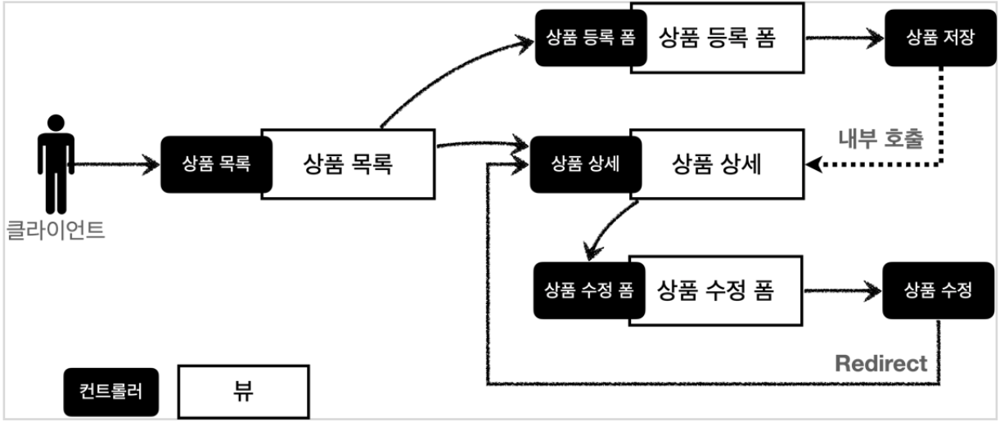

# 7. 스프링 MVC - 웹 페이지 만들기

## 프로젝트 생성

- 스프링 부트 스타터 사이트로 이동해서 스프링 프로젝트 생성: [https://start.spring.io](https://start.spring.io/)
    - Project: Gradle Project, Language: Java, Spring Boot: 2.4.x
    - Project Metadata
        - Group: hello
        - Group: hello
        Artifact: item-service
        Name: item-service
        Package name: hello.itemservice
        Packaging: **Jar (주의!)**
        Java: 11
        - Dependencies: Spring Web, Thymeleaf, Lombok

### Welcome 페이지 만들기

---

- `/resources/static/index.hml`

    ```html
    <!DOCTYPE html>
    <html>
    <head>
        <meta charset="UTF-8">
        <title>Title</title>
    </head>
    <body>
    <ul>
        <li>상품 관리
            <ul>
                <li><a href="/basic/items">상품 관리 - 기본</a></li>
            </ul>
        </li>
    </ul>
    </body>
    </html>
    ```


## 요구사항 분석

- 상품을 관리할 수 있는 서비스

- 상품 도메인 모델: 상품 ID, 상품명, 가격, 수량
- 상품 관리 기능: 상품 목록, 상품 상세, 상품 등록, 상품 수정

- 서비스 제공 흐름

    


## 상품 도메인 개발

- Item - 상품 객체

    ```java
    @Data
    public class Item {

        private Long id;
        private String itemName;
        private Integer price;
        private Integer quantity;

        public Item() {
        }

        public Item(String itemName, Integer price, Integer quantity) {
            this.itemName = itemName;
            this.price = price;
            this.quantity = quantity;
        }
    }
    ```

- ItemRepository - 상품 저장소

    ```java
    @Repository
    public class ItemRepository {

        private static final Map<Long, Item> store = new HashMap<>(); //static 사용
        private static long sequence = 0L; //static 사용

        public Item save(Item item) {
            item.setId(++sequence);
            store.put(item.getId(), item);
            return item;
        }

        public Item findById(Long id) {
            return store.get(id);
        }

        public List<Item> findAll() {
            return new ArrayList<>(store.values());
        }

        public void update(Long itemId, Item updateParam) {
            Item findItem = findById(itemId);
            findItem.setItemName(updateParam.getItemName());
            findItem.setPrice(updateParam.getPrice());
            findItem.setQuantity(updateParam.getQuantity());
        }

        public void clearStore() {
            store.clear();
        }
    }
    ```

- ItemRepositoryTest - 상품 저장소 테스트

    ```java
    class ItemRepositoryTest {

        ItemRepository itemRepository = new ItemRepository();

        @AfterEach
        void afterEach() {
            itemRepository.clearStore();
        }

        @Test
        void save() {
            //given
            Item item = new Item("itemA", 10000, 10);

            //when
            Item savedItem = itemRepository.save(item);

            //then
            Item findItem = itemRepository.findById(item.getId());
            assertThat(savedItem.getId()).isEqualTo(findItem.getId());
        }

        @Test
        void findAll() {
            //given
            Item item1 = new Item("item1", 10000, 10);
            Item item2 = new Item("item2", 20000, 20);
            itemRepository.save(item1);
            itemRepository.save(item2);

            //when
            List<Item> result = itemRepository.findAll();

            //then
            assertThat(result.size()).isEqualTo(2);
            assertThat(result).contains(item1, item2);
        }

        @Test
        void updateItem() {
            //given
            Item item = new Item("item1", 10000, 10);

            Item savedItem = itemRepository.save(item);
            Long itemId = savedItem.getId();

            //when
            Item updateItem = new Item("item2", 20000, 30);
            itemRepository.update(itemId, updateItem);

            Item findItem = itemRepository.findById(itemId);

            //then
            assertThat(findItem.getItemName()).isEqualTo(updateItem.getItemName());
            assertThat(findItem.getPrice()).isEqualTo(updateItem.getPrice());
            assertThat(findItem.getQuantity()).isEqualTo(updateItem.getQuantity());
        }
    }
    ```


## 상품 서비스 HTML

- 부트스트랩(Bootstrap): 웹사이트를 쉽게 만들 수 있게 도와주는 HTML, CSS, JS 프레임워크
    - 하나의 CSS 로 휴대폰, 태블릿, 데스크탑까지 다양한 기기에서 작동한다. 다양한 기능을 제공하여 사용자가 쉽게 웹사이트를 제작, 유지, 보수할 수 있도록 도와준다.
    - HTML 을 편리하게 개발하기 위해 부트스트랩을 사용하자.
    - 부트스트랩 Compiled CSS and JS 항목 다운로드: [https://getbootstrap.com/docs/5.0/getting-started/download/](https://getbootstrap.com/docs/5.0/getting-started/download/)

- HTML, css 파일: `/resources/static`에 넣어두었기 때문에 스프링 부트가 정적 리소스를 제공한다.
    - 부트스트랩 압축을 출고 `bootstrap.min.css`를 복사해서 `resources/static/css`에 추가
    - 상품 목록 HTML: /resources/static/html/items.html

        ```html
        <!DOCTYPE HTML>
        <html>
        <head>
            <meta charset="utf-8">
            <link href="../css/bootstrap.min.css" rel="stylesheet">
        </head>
        <body>
        <div class="container" style="max-width: 600px">
            <div class="py-5 text-center">
                <h2>상품 목록</h2></div>
            <div class="row">
                <div class="col">
                    <button class="btn btn-primary float-end" onclick="location.href='addForm.html'" type="button">상품 등록
                    </button>
                </div>
            </div>
            <hr class="my-4">
            <div>
                <table class="table">
                    <thead>
                    <tr>
                        <th>ID</th>
                        <th>상품명</th>
                        <th>가격</th>
                        <th>수량</th>
                    </tr>
                    </thead>
                    <tbody>
                    <tr>
                        <td><a href="item.html">1</a></td>
                        <td><a href="item.html">테스트 상품1</a></td>
                        <td>10000</td>
                        <td>10</td>
                    </tr>
                    <tr>
                        <td><a href="item.html">2</a></td>
                        <td><a href="item.html">테스트 상품2</a></td>
                        <td>20000</td>
                        <td>20</td>
                    </tr>
                    </tbody>
                </table>
            </div>
        </div> <!-- /container -->
        </body>
        </html>
        ```

    - 상품 상세 HTML: /resources/static/html/item.html

        ```html
        <!DOCTYPE HTML>
        <html>
        <head>
            <meta charset="utf-8">
            <link href="../css/bootstrap.min.css" rel="stylesheet">
            <style>
             .container { max-width: 560px;}
            </style>
        </head>
        <body>
        <div class="container">
            <div class="py-5 text-center">
                <h2>상품 상세</h2></div>
            <div>
                <label for="itemId">상품 ID</label>
                <input type="text" id="itemId" name="itemId" class="form-control" value="1" readonly>
            </div>
            <div>
                <label for="itemName">상품명</label>
                <input type="text" id="itemName" name="itemName" class="form-control"
                       value="상품A" readonly></div>
            <div>
                <label for="price">가격</label>
                <input type="text" id="price" name="price" class="form-control" value="10000" readonly>
            </div>
            <div>
                <label for="quantity">수량</label>
                <input type="text" id="quantity" name="quantity" class="form-control" value="10" readonly>
            </div>
            <hr class="my-4">
            <div class="row">
                <div class="col">
                    <button class="w-100 btn btn-primary btn-lg"
                            onclick="location.href='editForm.html'" type="button">상품 수정
                    </button>
                </div>
                <div class="col">
                    <button class="w-100 btn btn-primary btn-lg"
                            onclick="location.href='items.html'" type="button">목록으로
                    </button>
                </div>
            </div>
        </div> <!-- /container -->
        </body>
        </html>
        ```

    - 상품 등록 폼 HTML: /resources/static/html/addForm.html

        ```html
        <!DOCTYPE HTML>
        <html>
        <head>
            <meta charset="utf-8">
            <link href="../css/bootstrap.min.css" rel="stylesheet">
            <style>
            .container { max-width: 560px;}
            </style>
        </head>
        <body>
        <div class="container">
            <div class="py-5 text-center">
                <h2>상품 등록 폼</h2>
            </div>
            <h4 class="mb-3">상품 입력</h4>
            <form action="item.html" method="post">
                <div>
                    <label for="itemName">상품명</label>
                    <input type="text" id="itemName" name="itemName" class="form-control" placeholder="이름을 입력하세요">
                </div>
                <div>
                    <label for="price">가격</label>
                    <input type="text" id="price" name="price" class="form-control" placeholder="가격을 입력하세요">
                </div>
                <div>
                    <label for="quantity">수량</label>
                    <input type="text" id="quantity" name="quantity" class="form-control" placeholder="수량을 입력하세요">
                </div>
                <hr class="my-4">
                <div class="row">
                    <div class="col">
                        <button class="w-100 btn btn-primary btn-lg" type="submit">상품
                            등록
                        </button>
                    </div>
                    <div class="col">
                        <button class="w-100 btn btn-secondary btn-lg"
                                onclick="location.href='items.html'" type="button">취소
                        </button>
                    </div>
                </div>
            </form>
        </div> <!-- /container --> </body>
        </html>
        ```

    - 상품 수정 폼 HTML: /resources/static/html/editForm.html

        ```html
        <!DOCTYPE HTML>
        <html>
        <head>
            <meta charset="utf-8">
            <link href="../css/bootstrap.min.css" rel="stylesheet">
            <style>
            .container { max-width: 560px;}
            </style>
        </head>
        <body>
        <div class="container">
            <div class="py-5 text-center">
                <h2>상품 수정 폼</h2>
            </div>
            <form action="item.html" method="post">
                <div>
                    <label for="id">상품 ID</label>
                    <input type="text" id="id" name="id" class="form-control" value="1" readonly>
                </div>
                <div>
                    <label for="itemName">상품명</label>
                    <input type="text" id="itemName" name="itemName" class="form-control" value="상품A">
                </div>
                <div>
                    <label for="price">가격</label>
                    <input type="text" id="price" name="price" class="form-control" value="10000">
                </div>
                <div>
                    <label for="quantity">수량</label>
                    <input type="text" id="quantity" name="quantity" class="form-control" value="10">
                </div>
                <hr class="my-4">
                <div class="row">
                    <div class="col">
                        <button class="w-100 btn btn-primary btn-lg" type="submit">저장</button>
                    </div>
                    <div class="col">
                        <button class="w-100 btn btn-secondary btn-lg"
                                onclick="location.href='item.html'" type="button">취소
                        </button>
                    </div>
                </div>
            </form>
        </div> <!-- /container -->
        </body>
        </html>
        ```

- 이렇게 정적 리소스가 공개되는 `/resources/static` 폴더에 HTML 을 넣어두면, 실제 서비스에서도

    공개된다. 서비스를 운영한다면 지금처럼 공개할 필요없는 HTML 을 두는 것은 주의하자.


## 상품 목록 - 타임리프

- BasicItemController

    ```java
    @Controller
    @RequestMapping("/basic/items")
    @RequiredArgsConstructor
    public class BasicItemController {

        private final ItemRepository itemRepository;

        @GetMapping
        public String items(Model model) {
            List<Item> items = itemRepository.findAll();
            model.addAttribute("items", items);
            return "basic/items";
        }

        /**
         * 테스트용 데이터 추가
         */
        @PostConstruct
        public void init() {
            itemRepository.save(new Item("testA", 10000, 10));
            itemRepository.save(new Item("testB", 20000, 20));
        }
    }
    ```

- items.html 정적 HTML 을 뷰 템플릿(templates) 영역으로 복사하고 수정: /resources/templates/basic/items.html

    ```html
    <!DOCTYPE HTML>
    <html xmlns:th="http://www.thymeleaf.org">
    <head>
        <meta charset="utf-8">
        <link href="../css/bootstrap.min.css" th:href="@{/css/bootstrap.min.css}" rel="stylesheet">
    </head>
    <body>
    <div class="container" style="max-width: 600px">
        <div class="py-5 text-center">
            <h2>상품 목록</h2>
        </div>
        <div class="row">
            <div class="col">
                <button class="btn btn-primary float-end" onclick="location.href='addForm.html'"
                        th:onclick="|location.href='@{/basic/items/add}'|" type="button">상품 등록
                </button>
            </div>
        </div>
        <hr class="my-4">
        <div>
            <table class="table">
                <thead>
                <tr>
                    <th>ID</th>
                    <th>상품명</th>
                    <th>가격</th>
                    <th>수량</th>
                </tr>
                </thead>
                <tbody>
                <tr th:each="item : ${items}">
                    <td><a href="item.html" th:href="@{/basic/items/{itemId} (itemId=${item.id})}"
                           th:text="${item.id}">회원id</a></td>
                    <td><a href="item.html" th:href="@{|/basic/items/${item.id}|}" th:text="${item.itemName}">상품명</a></td>
                    <td th:text="${item.price}">10000</td>
                    <td th:text="${item.quantity}">10</td>
                </tr>
                </tbody>
            </table>
        </div>
    </div> <!-- /container -->
    </body>
    </html>
    ```

- `@RequiredArgsConstructor`: `final`이 붙은 멤버변수만 사용해서 생성자를 자동으로 만들어준다.
    - 이렇게 생성자가 딱 1개만 있으면 스프링이 해당 생성자에 `@Autowired`로 의존관계를 주입해준다.
    - 예제에서 `final` 키워드를 빼면 안된다! → ItemRepository 의존관계 주입이 안된다.
- `@PostConstruct`: 해당 빈의 의존관계가 모두 주입되고 나면 초기화 용도로 호출된다.
- 타임리프 간단히 알아보기
    - 타임리프 사용 선언: `<html xmlns:th="http://www.thymeleaf.org">`
    - 속성 변경 - `th:href`
        - `th:href="@{/css/bootstrap.min.css}"`
        - `href="value1"`을 `th:href="value2"` 값으로 변경한다.
        - 타임리프 뷰 템플릿을 거치게 되면 원래 값을 `th:xxx` 값으로 변경한다. 만약 값이 없다면 새로 생성한다. 대부분의 HTML 속성을 `th:xxx`로 변경할 수 있다.
        - HTML을 그대로 볼 때는 `href` 속성이 사용되고, 뷰 템플릿을 거치면 `th:href` 값으로 대체되면서 동적으로 변경할 수 있다.
    - URL 링크 표현식 - `@{...}`: 타임리프가 URL 링크를 사용하는 경우 사용
        - `th:href="@{/css/bootstrap.min.css}"`
        - URL 링크 표현식을 사용하면 서블릿 컨텍스트를 자동으로 포함한다.
        - `th:href="@{/basic/items/{itemId}(itemId=${item.id})}"`
        - 경로 변수(itemId) 뿐 아니라 쿼리 파라미터도 생성한다.
            - `th:href="@{/basic/items/{itemId}(itemId=${item.id}, query='test')}"`

                → 생성 링크: [http://localhost:8080/basic/items/1?query=test](http://localhost:8080/basic/items/1?query=test)

        - 위의 URL 링크를 `th:href="@{|/basic/items/${item.id}|}"`로 간단히 할 수 있다.
    - 리터럴 대체 - `|...|`
        - 타임리프에서 문자와 표현식 등은 분리되어 있기 때문에 `<span th:text="'Welcome to our application, ' + ${user.name} + '!'">` 와 같이 더해서 사용해야 한다.
        - 리터럴 대체 문법을 사용하면, 더하기 없이 편리하게 사용할 수 있다. `<span th:text="|Welcome to our application, ${user.name}!|">`
        - 상품 등록 폼으로 이동, 속성 변경 - `th:onclick`
            - `onclick="location.href='addForm.html'"`
            - `th:onclick="|location.href='@{/basic/items/add}'|"`: 리터럴 대체 문법 사용됨
                - 그냥 사용하면 `th:onclick="'location.href=' + '\'' + @{/basic/items/add} + '\''"`
    - 반복 출력 - `th:each`
        - `<tr th:each="item : ${items}">`
        - 모델에 포함된 items 컬렉션 데이터가 item 변수에 하나씩 포함되고, 반복문 안에서 item 변수를 사용할 수 있다.
    - 변수 표현식 - `${...}`
        - `<td th:text="${item.price}">10000</td>`
        - 모델에 포함된 값이나, 타임리프 변수로 선언한 값을 조회할 수 있다.
        - 프로퍼티 접근법을 사용한다.(`item.getPrice()`)
    - 내용 변경 - `th:text`
        - `<td th:text="${item.price}">10000</td>`
        - 내용의 값을 `th:text` 값으로 변경한다.
- 타임리프 핵심: 네츄럴 템플릿
    - `th:xxx`가 붙은 부분은 서버사이드에서 렌더링 되고, 기존 것을 대체한다. `th:xxx`이 없으면 기존 html 의 `xxx` 속성이 그대로 사용된다.
    - HTML 을 파일로 직접 열었을 때, `th:xxx`가 있어도 웹 브라우저는 `th:` 속성을 알지 못하므로 무시한다. 따라서 HTML 을 파일 보기를 유지하면서 템플릿 기능도 할 수 있다.
    - 네츄럴 템플릿 (natural templates): 순수 HTML을 그대로 유지하면서 뷰 템플릿도 사용할 수 있는 타임리프의 특징
        - JSP 파일은 웹 브라우저에서 그냥 열면 JSP 소스코드와 HTML 이 섞여서 정상적인 확인이 불가능하다. 오직 서버를 통해서 JSP 를 열어야 한다.


## 상품 상세

- BasicItemController 에 추가

    ```java
    @GetMapping("/{itemId}")
    public String item(@PathVariable Long itemId, Model model) {
        Item item = itemRepository.findById(itemId);
        model.addAttribute("item", item);
        return "basic/item";
    }
    ```

- 정적 HTML을 뷰 템플릿(templates) 영역으로 복사하고 수정, 상품 상세 뷰: /resources/templates/basic/item.html

    ```html
    <!DOCTYPE HTML>
    <html xmlns:th="http://www.thymeleaf.org">
    <head>
        <meta charset="utf-8">
        <link href="../css/bootstrap.min.css" th:href="@{/css/bootstrap.min.css}" rel="stylesheet">
        <style>
         .container { max-width: 560px;}
        </style>
    </head>
    <body>
    <div class="container">
        <div class="py-5 text-center">
            <h2>상품 상세</h2></div>
        <div>
            <label for="itemId">상품 ID</label>
            <input type="text" id="itemId" name="itemId" class="form-control" value="1" th:value="${item.id}" readonly>
        </div>
        <div>
            <label for="itemName">상품명</label>
            <input type="text" id="itemName" name="itemName" class="form-control"
                   value="상품A" th:value="${item.itemName}" readonly></div>
        <div>
            <label for="price">가격</label>
            <input type="text" id="price" name="price" class="form-control" value="10000" th:value="${item.price}" readonly>
        </div>
        <div>
            <label for="quantity">수량</label>
            <input type="text" id="quantity" name="quantity" class="form-control" value="10" th:value="${item.quantity}" readonly>
        </div>
        <hr class="my-4">
        <div class="row">
            <div class="col">
                <button class="w-100 btn btn-primary btn-lg" onclick="location.href='editForm.html'"
                        th:onclick="|location.href='@{/basic/items/{itemId}/edit(itemId=${item.id})}'|" type="button">상품 수정
                </button>
            </div>
            <div class="col">
                <button class="w-100 btn btn-primary btn-lg" onclick="location.href='items.html'"
                        th:onclick="|location.href='@{/basic/items}'|" type="button">목록으로
                </button>
            </div>
        </div>
    </div> <!-- /container -->
    </body>
    </html>
    ```


## 상품 등록

### 상품 등록 폼

---

- BasicItemController 에 추가
- 정적 HTML을 뷰 템플릿(templates) 영역으로 복사하고 수정, 상품 등록 폼 뷰: /resources/templates/basic/addForm.html

    ```html
    <!DOCTYPE HTML>
    <html xmlns:th="http://www.thymeleaf.org">
    <head>
        <meta charset="utf-8">
        <link href="../css/bootstrap.min.css" th:href="@{/css/bootstrap.min.css}" rel="stylesheet">
        <style>
        .container { max-width: 560px;}
        </style>
    </head>
    <body>
    <div class="container">
        <div class="py-5 text-center">
            <h2>상품 등록 폼</h2>
        </div>
        <h4 class="mb-3">상품 입력</h4>
        <form action="item.html" th:action method="post">
            <div>
                <label for="itemName">상품명</label>
                <input type="text" id="itemName" name="itemName" class="form-control" placeholder="이름을 입력하세요">
            </div>
            <div>
                <label for="price">가격</label>
                <input type="text" id="price" name="price" class="form-control" placeholder="가격을 입력하세요">
            </div>
            <div>
                <label for="quantity">수량</label>
                <input type="text" id="quantity" name="quantity" class="form-control" placeholder="수량을 입력하세요">
            </div>
            <hr class="my-4">
            <div class="row">
                <div class="col">
                    <button class="w-100 btn btn-primary btn-lg" type="submit">상품
                        등록
                    </button>
                </div>
                <div class="col">
                    <button class="w-100 btn btn-secondary btn-lg" onclick="location.href='items.html'"
                            th:onclick="|location.href='@{/basic/items}'|" type="button">취소
                    </button>
                </div>
            </div>
        </form>
    </div> <!-- /container -->
    </body>
    </html>
    ```

- `th:action`: HTML form 에서 `action`에 값이 없으면 현재 URL 에 데이터를 전송한다.

### 상품 등록 처리

---

- 상품 등록 폼이 서버에 데이터 전달하는 방식: POST - HTML Form
    - `content-type: application/x-www-form-urlencoded`
    - 메시지 바디에 쿼리 파리미터 형식으로 전달 `itemName=itemA&price=10000&quantity=10`
    - ex> 예) 회원 가입, 상품 주문, HTML Form 사용

- `@RequestParam` 버전: addItemV1 - BasicItemController에 추가

    ```java
    @PostMapping("/add")
    public String addItemV1(@RequestParam String itemName,
                            @RequestParam int price,
                            @RequestParam Integer quantity,
                            Model model) {
        
        Item item = new Item();
        item.setItemName(itemName);
        item.setPrice(price);
        item.setQuantity(quantity);

        itemRepository.save(item);

        model.addAttribute("item", item);

        return "basic/item";
    }
    ```

- `@ModelAttribute` 버전
    - addItemV2 - 상품 등록 처리 - ModelAttribute

        ```java
        /**
         * @ModelAttribute("item") Item item
         * model.addAttribute("item", item); 자동 추가
         */
        @PostMapping("/add")
        public String addItemV2(@ModelAttribute("item") Item item, Model model) {
            itemRepository.save(item);
            //model.addAttribute("item", item); //자동 추가, 생략 가능
            return "basic/item";
        }
        ```

    - addItemV3 - 상품 등록 처리 - ModelAttribute 이름 생략
        - `@ModelAttribute`의 이름을 생략할 수 있다.

        ```java
        /**
         * @ModelAttribute name 생략 가능
         * model.addAttribute(item); 자동 추가, 생략 가능
         * 생략시 model 에 저장되는 name 은 클래스명 첫글자만 소문자로 등록 Item -> item
         */
        @PostMapping("/add")
        public String addItemV3(@ModelAttribute Item item) {
            itemRepository.save(item);
            return "basic/item";
        }
        ```

    - addItemV4 - 상품 등록 처리 - ModelAttribute 전체 생략
        - @ModelAttribute 자체도 생략가능하다. 대상 객체는 모델에 자동 등록된다.

        ```java
        /**
         * @ModelAttribute 자체 생략 가능
         * model.addAttribute(item) 자동 추가
         */
        @PostMapping("/add")
        public String addItemV4(Item item) {
            itemRepository.save(item);
            return "basic/item";
        }
        ```

- `@ModelAttribute`
    - 요청 파라미터 처리: `@ModelAttribute`는 Item 객체를 생성하고, 요청 파라미터의 값을 프로퍼티 접근법(setXxx)으로 입력해준다.
    - Model 추가: 모델(Model)에 `@ModelAttribute`로 지정한 객체를 자동으로 넣어준다.

        ```java
        model.addAttribute("item", item); //자동 추가, 생략 가능
        ```

        - 모델에 데이터를 담을 때는 이름이 필요하다. 이름은 `@ModelAttribute`에 지정한 `name(value)` 속성을 사용한다. 만약 `@ModelAttribute`의 이름을 다르게 지정하면 다른 이름으로 모델에 포함된다.

            ```java
            @ModelAttribute("hello") Item item // 이름을 hello 로 지정
            model.addAttribute("hello", item); // 모델에 hello 이름으로 저장
            ```

    - `@ModelAttribute`의 이름을 생략하면 모델에 저장될 때 클래스명을 사용한다. 이때 클래스의 첫글자만 소문자로 변경해서 등록한다.
        - ex> `@ModelAttribute` 클래스명 → 모델에 자동 추가되는 이름
            - Item → item, HelloWorld → helloWorld


## 상품 수정

- 상품 수정 폼 컨트롤러: BasicItemController 에 추가

    ```java
    @GetMapping("/{itemId}/edit")
    public String editForm(@PathVariable Long itemId, Model model) {
        Item item = itemRepository.findById(itemId);
        model.addAttribute("item", item);
        return "basic/editForm";
    }
    ```

- 정적 HTML을 뷰 템플릿(templates) 영역으로 복사하고 수정, 상품 수정 폼 뷰: /resources/templates/basic/editForm.html

    ```html
    <!DOCTYPE HTML>
    <html xmlns:th="http://www.thymeleaf.org">
    <head>
        <meta charset="utf-8">
        <link href="../css/bootstrap.min.css" th:href="@{/css/bootstrap.min.css}" rel="stylesheet">
        <style>
        .container { max-width: 560px;}
        </style>
    </head>
    <body>
    <div class="container">
        <div class="py-5 text-center">
            <h2>상품 수정 폼</h2>
        </div>
        <form action="item.html" th:action method="post">
            <div>
                <label for="id">상품 ID</label>
                <input type="text" id="id" name="id" class="form-control" value="1" th:value="${item.id}" readonly>
            </div>
            <div>
                <label for="itemName">상품명</label>
                <input type="text" id="itemName" name="itemName" class="form-control" value="상품A" th:value="${item.itemName}">
            </div>
            <div>
                <label for="price">가격</label>
                <input type="text" id="price" name="price" class="form-control" value="10000" th:value="${item.price}">
            </div>
            <div>
                <label for="quantity">수량</label>
                <input type="text" id="quantity" name="quantity" class="form-control" value="10" th:value="${item.quantity}">
            </div>
            <hr class="my-4">
            <div class="row">
                <div class="col">
                    <button class="w-100 btn btn-primary btn-lg" type="submit">저장</button>
                </div>
                <div class="col">
                    <button class="w-100 btn btn-secondary btn-lg"
                            onclick="location.href='item.html'" type="button">취소
                    </button>
                </div>
            </div>
        </form>
    </div> <!-- /container -->
    </body>
    </html>
    ```

- 상품 수정 개발

    ```java
    @PostMapping("/{itemId}/edit")
    public String edit(@PathVariable Long itemId, @ModelAttribute Item item) {
        itemRepository.update(itemId, item);
        return "redirect:/basic/items/{itemId}";
    }
    ```

- 리다이렉트: 상품 수정은 뷰 템플릿 호출 대신, 상품 상세 화면으로 리다이렉트를 호출한다.
    - 스프링은 `redirect:/...`으로 편리하게 리다이렉트를 지원한다.
    - `redirect:/basic/items/{itemId}`: 컨트롤러에 매핑된 `@PathVariable` 값은 `redirect`에도 사용 할 수 있다.
- HTML Form 전송은 PUT, PATCH 를 지원하지 않는다. GET, POST만 사용할 수 있다.
    - PUT, PATCH는 HTTP API 전송시에 사용


## PRG Post/Redirect/Get

- PRG 적용: BasicItemController 에 추가

    ```java
    /**
     * PRG - Post/Redirect/Get
     */
    @PostMapping("/add")
    public String addItemV5(Item item) {
        itemRepository.save(item);
        return "redirect:/basic/items/" + item.getId();
    }
    ```

- 전체 흐름

    

    - POST 등록 후 새로 고침: 웹 브라우저의 새로 고침은 마지막에 서버에 전송한 데이터를 다시 전송한다.

        → 내용은 같고, ID 만 다른 상품 데이터가 계속 쌓이게 된다.

- PRG: POST, Redirect GET
    - 새로 고침 문제를 해결하려면 상품 저장 후, 상품 상세 화면으로 리다이렉트를 호출해주면 된다.
    - 이후 새로 고침을 해도 상품 상세 화면으로 이동하게 되므로 새로 고침 문제를 해결할 수 있다.

    


## RedirectAttributes

- RedirectAttributes 적용: BasicItemController 에 추가

    ```java
    /**
     * RedirectAttributes
     */
    @PostMapping("/add")
    public String addItemV6(Item item, RedirectAttributes redirectAttributes) {
        Item savedItem = itemRepository.save(item);
        redirectAttributes.addAttribute("itemId", savedItem.getId());
        redirectAttributes.addAttribute("status", true);
        return "redirect:/basic/items/{itemId}";
    }
    ```

- 뷰 템플릿 메시지 추가 resources/templates/basic/item.html

    ```html
    <div class="container">
    <div class="py-5 text-center"> <h2>상품 상세</h2></div>
    <!-- 추가 -->
    <h2 th:if="${param.status}" th:text="'저장 완료!'"></h2>
    ```

- `RedirectAttributes`: URL 에 변수를 더해서 사용하는 것은 URL 인코딩이 안되기 때문에 위험하다. `RedirectAttributes`는 URL 인코딩도 해주고, `pathVarible`, 쿼리 파라미터까지 처리해준다.
    - `redirect:/basic/items/{itemId}`: pathVariable 바인딩 후 나머지는 쿼리 파라미터로 처리
- `th:if`: 해당 조건이 참이면 실행
- `${param.status}`: 타임리프에서 쿼리 파라미터를 편리하게 조회하는 기능
    - param 은 예약어
    - 원래는 컨트롤러에서 모델에 직접 담고 값을 꺼내야 한다. 그런데 쿼리 파라미터는 자주 사용해서 타임리프에서 직접 지원한다.


- [Notion link](https://www.notion.so/7-MVC-8ad2afb599354ebfb181ff351b6459f4)
