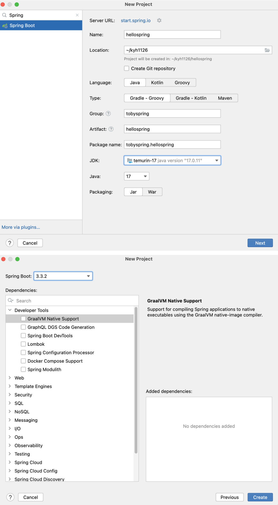

# 1. 스프링 개발 시작하기

## 개발환경 준비

---

### 스프링 개발환경

---

- Spring 6.0.12 또는 그 이후 버전 (SpringBoot 3.1.4+)

### 개발환경 셋업 (Mac)

---

- JDK: JDK 17 또는 이후 버전
    - IntelliJ 설치 후 SDK - Download JDK
    - 공개 JDK 다운로드 후 설치 (corretto / temurin)
    - sdkman (https://sdkman.io)
        - `sdk install java [jdk name]`
        - `sdk java use [jdk name]`
        - 프로젝트 폴더의 사용 JDK 저장: `sdk env init`
        - 프로젝트 폴더의 사용 JDK 복구: `sdk env`
- IDE: IntelliJ
- HTTPie: [https://httpie.io/](https://httpie.io/)
    
    ```powershell
    $ brew install pie
    ```
    

## HelloSpring 프로젝트 생성

---

### 스프링 부트 프로젝트로 생성

---

- 스프링 부트의 의존 라이브러리 설정을 이용하기 위함
    - IntelliJ Ultimate 의 New Project - Spring Initializr
    - IntelliJ Community
        - Web Spring Initializr - https://start.spring.io
            - 다운로드 후 zip 파일 풀고 import
        - Spring Initializr 플러그인

### 생성 옵션

---



- Language: Java
- Spring Boot: 3.1.4 (혹은 이후 버전)
- Project Metadata
    - Group: tobyspring

## PaymentService 요구사항

---

### 요구사항

---

- 해외직구를 위한 원화 결제 준비 기능 개발
- 주문번호, 외국 통화 종류, 외국 통화 기준 결제 금액을 전달 받아서 다음의 정보를 더해 Payment를 생성한다
    - 적용 환율
    - 원화 환산 금액
    - 원화 환산 금액 유효시간
- `PaymentService`.`prepare()` 메소드로 개발
    - Payment 오브젝트 리턴

### 개발방법

---

- 빠르게 완성해서 가장 간단한 방법을 찾는다
- 작성한 코드가 동작하는지 확인하는 방법을 찾는다
- 조금씩 기능을 추가하고 다시 검증한다
- 코드를 한눈에 이해하기 힘들다면 코멘트로 설명을 달아준다

## PaymentService 개발 (1)

---

- Gradle JDK 와 프로젝트 JDK 다른 경우 가끔 에러뜬다. IntelliJ 통해서 빌드와 런, 테스트 하도록 변경
    
    
    
- SpringBoot 디폴트로 생성해준 `HellospringApplication`, `application.properties`, `HellospringApplicationTests` 삭제해준다.
    
    
    

- `PaymentService` 추가
    
    ```java
    package tobyspring.hellospring;
    
    public class PaymentService {
        public Payment prepare() {
            return new Payment();
        }
    
        public static void main(String[] args) {
            PaymentService paymentService = new PaymentService();
            Payment payment = paymentService.prepare();
            System.out.println(payment);
        }
    }
    ```
    
- `Payment` 추가
    
    ```java
    package tobyspring.hellospring;
    
    public class Payment {
    }
    ```
    
- `PaymentService` run
    
    ```powershell
    /Users/yoonhee/.sdkman/candidates/java/17.0.11-tem/bin/java -javaagent:/Applications/IntelliJ IDEA.app/Contents/lib/idea_rt.jar=63415:/Applications/IntelliJ IDEA.app/Contents/bin -Dfile.encoding=UTF-8 -classpath /Users/yoonhee/kyh1126/hellospring/out/production/classes:/Users/yoonhee/.gradle/caches/modules-2/files-2.1/org.springframework.boot/spring-boot-starter/3.3.2/f9377a223dab5c4afe7aead05bf6ac567cf565ab/spring-boot-starter-3.3.2.jar:/Users/yoonhee/.gradle/caches/modules-2/files-2.1/org.springframework.boot/spring-boot-autoconfigure/3.3.2/6a9ab910b00f0b504a5903e3680ac10018da6247/spring-boot-autoconfigure-3.3.2.jar:/Users/yoonhee/.gradle/caches/modules-2/files-2.1/org.springframework.boot/spring-boot/3.3.2/72a257d5518b2b8b9949a26543cdb3a4e67de5f8/spring-boot-3.3.2.jar:/Users/yoonhee/.gradle/caches/modules-2/files-2.1/org.springframework.boot/spring-boot-starter-logging/3.3.2/b685c97f3c24dc30c53ae18151a798f701f2a640/spring-boot-starter-logging-3.3.2.jar:/Users/yoonhee/.gradle/caches/modules-2/files-2.1/jakarta.annotation/jakarta.annotation-api/2.1.1/48b9bda22b091b1f48b13af03fe36db3be6e1ae3/jakarta.annotation-api-2.1.1.jar:/Users/yoonhee/.gradle/caches/modules-2/files-2.1/org.springframework/spring-core/6.1.11/90fce4311852c68c1e87c65adf60db9add1a6dcb/spring-core-6.1.11.jar:/Users/yoonhee/.gradle/caches/modules-2/files-2.1/org.yaml/snakeyaml/2.2/3af797a25458550a16bf89acc8e4ab2b7f2bfce0/snakeyaml-2.2.jar:/Users/yoonhee/.gradle/caches/modules-2/files-2.1/org.springframework/spring-context/6.1.11/8fc69f776333713aa26be8821af8c6355ccad8d8/spring-context-6.1.11.jar:/Users/yoonhee/.gradle/caches/modules-2/files-2.1/ch.qos.logback/logback-classic/1.5.6/afc75d260d838a3bddfb8f207c2805ed7d1b34f9/logback-classic-1.5.6.jar:/Users/yoonhee/.gradle/caches/modules-2/files-2.1/org.apache.logging.log4j/log4j-to-slf4j/2.23.1/425ad1eb8a39904d2830e907a324e956fb456520/log4j-to-slf4j-2.23.1.jar:/Users/yoonhee/.gradle/caches/modules-2/files-2.1/org.slf4j/jul-to-slf4j/2.0.13/a3bcd9d9dd50c71ce69f06b1fd05e40fdeff6ba5/jul-to-slf4j-2.0.13.jar:/Users/yoonhee/.gradle/caches/modules-2/files-2.1/org.springframework/spring-jcl/6.1.11/97b34c6b72c8084759e71cd09a7dad16bfb8f1da/spring-jcl-6.1.11.jar:/Users/yoonhee/.gradle/caches/modules-2/files-2.1/org.springframework/spring-aop/6.1.11/3503ef99b759b81f8b0b3d5260bf4842e393a581/spring-aop-6.1.11.jar:/Users/yoonhee/.gradle/caches/modules-2/files-2.1/org.springframework/spring-beans/6.1.11/266176d132ab2bbf8e69e4aa6d7f47ec746ddc9a/spring-beans-6.1.11.jar:/Users/yoonhee/.gradle/caches/modules-2/files-2.1/org.springframework/spring-expression/6.1.11/7c12cf1cd39289cfab7c5933eda9e4704a7f2799/spring-expression-6.1.11.jar:/Users/yoonhee/.gradle/caches/modules-2/files-2.1/io.micrometer/micrometer-observation/1.13.2/a498ee0871596f41a61679a29bc8390defba4245/micrometer-observation-1.13.2.jar:/Users/yoonhee/.gradle/caches/modules-2/files-2.1/ch.qos.logback/logback-core/1.5.6/41cbe874701200c5624c19e0ab50d1b88dfcc77d/logback-core-1.5.6.jar:/Users/yoonhee/.gradle/caches/modules-2/files-2.1/org.slf4j/slf4j-api/2.0.13/80229737f704b121a318bba5d5deacbcf395bc77/slf4j-api-2.0.13.jar:/Users/yoonhee/.gradle/caches/modules-2/files-2.1/org.apache.logging.log4j/log4j-api/2.23.1/9c15c29c526d9c6783049c0a77722693c66706e1/log4j-api-2.23.1.jar:/Users/yoonhee/.gradle/caches/modules-2/files-2.1/io.micrometer/micrometer-commons/1.13.2/b2b69f7887f9bf6f5ae42e86a67a62367056aa3c/micrometer-commons-1.13.2.jar tobyspring.hellospring.PaymentService
    tobyspring.hellospring.Payment@6fadae5d
    
    Process finished with exit code 0
    ```
    

## PaymentService 개발 (2)

---

- `Payment` 객체 필드 추가
    - 우리의 주문이 21억개 이상일 것 같으면, `orderId`를 `Long`으로 지정해준다.
    - 통화: `currency`
    - 해외의 대부분 통화는 소숫점 자리가 있다. `Double`은 오차가 발생할 수 있다. 돈과 관련된 것은 `BigDecimal`을 사용해야 한다.
    
    ```java
    package tobyspring.hellospring;
    
    import java.math.BigDecimal;
    import java.time.LocalDateTime;
    
    public class Payment {
        private Long orderId;
        private String currency;
        private BigDecimal foreignCurrencyAmount;
        private BigDecimal exRate;
        private BigDecimal convertedAmount;
        private LocalDateTime validUntil;
    }
    ```
    
    → 생성과 동시에 값을 셋팅하는게 좋다.
    
    ```java
    public Payment(Long orderId, String currency, BigDecimal foreignCurrencyAmount, BigDecimal exRate, BigDecimal convertedAmount, LocalDateTime validUntil) {
        this.orderId = orderId;
        this.currency = currency;
        this.foreignCurrencyAmount = foreignCurrencyAmount;
        this.exRate = exRate;
        this.convertedAmount = convertedAmount;
        this.validUntil = validUntil;
    }
    ```
    
    - 그런데, 같은 타입이 순서대로 오면 실수하기 쉽다. 주의해서 써야 한다. 빌더 패턴을 사용해도 된다.
    - `toString` 추가
        
        ```java
        @Override
        public String toString() {
            return "Payment{" +
                    "orderId=" + orderId +
                    ", currency='" + currency + '\'' +
                    ", foreignCurrencyAmount=" + foreignCurrencyAmount +
                    ", exRate=" + exRate +
                    ", convertedAmount=" + convertedAmount +
                    ", validUntil=" + validUntil +
                    '}';
        }
        ```
        
- PaymentService 내용 추가
    
    ```java
    package tobyspring.hellospring;
    
    import java.math.BigDecimal;
    import java.time.LocalDateTime;
    
    public class PaymentService {
        public Payment prepare(Long orderId, String currency, BigDecimal foreignCurrencyAmount) {
            // 환율 가져오기
            // 금액 계산
            // 유효 시간 계산
            return new Payment(orderId, currency, foreignCurrencyAmount, BigDecimal.ZERO,
                    BigDecimal.ZERO, LocalDateTime.now());
        }
    
        public static void main(String[] args) {
            PaymentService paymentService = new PaymentService();
            Payment payment = paymentService.prepare(100L, "USD", BigDecimal.valueOf(50.7));
            System.out.println(payment);
        }
    }
    ```
    

## PaymentService 개발 (3)

---

### 환율 가져오기

---

- [https://open.er-api.com/v6/latest/{기준통화}](https://open.er-api.com/v6/latest/{기준통화}) 이용
    - 이 서비스가 더이상 유지되지 않는 경우 사용할 다른 서비스 URL을 강의자료에서 확인
    
    ```powershell
    yoonhee@Yoonhee ~ % http -v https://open.er-api.com/v6/latest/USD
    GET /v6/latest/USD HTTP/1.1
    Accept: */*
    Accept-Encoding: gzip, deflate
    Connection: keep-alive
    Host: open.er-api.com
    User-Agent: HTTPie/3.2.3
    
    HTTP/1.1 200 OK
    Accept-Ranges: bytes
    Age: 127
    CF-Cache-Status: HIT
    CF-RAY: 8b59cc10a8cb29d2-FUK
    Cache-Control: public, max-age=3600
    Connection: keep-alive
    Content-Encoding: gzip
    Content-Length: 1631
    Content-Type: application/json
    Date: Mon, 19 Aug 2024 11:27:55 GMT
    Last-Modified: Mon, 19 Aug 2024 10:37:03 GMT
    NEL: {"success_fraction":0,"report_to":"cf-nel","max_age":604800}
    Report-To: {"endpoints":[{"url":"https:\/\/a.nel.cloudflare.com\/report\/v4?s=jytdGUBSRj2HML8b67MGGv1PN%2B6UyFHK%2B510wttTDYljnI6%2BkALJ8MmZYoKM0B1fo2kqXr6vZP6vLXVIh8c68M8mEHnCfDtf%2B9jnewmvuURqC1fN%2ByJ%2FAW6pH9%2F5nkkXgA%3D%3D"}],"group":"cf-nel","max_age":604800}
    Server: cloudflare
    Vary: Accept-Encoding
    access-control-allow-origin: *
    x-content-type-options: NOSNIFF
    x-frame-options: SAMEORIGIN
    
    {
        "base_code": "USD",
        "documentation": "https://www.exchangerate-api.com/docs/free",
        "provider": "https://www.exchangerate-api.com",
        "rates": {
            "AED": 3.6725,
            "AFN": 71.016252,
            "ALL": 90.546764,
            "AMD": 388.108035,
            "ANG": 1.79,
            "AOA": 896.224421,
            "ARS": 944,
            "AUD": 1.500276,
            "AWG": 1.79,
            "AZN": 1.700134,
            "BAM": 1.774989,
            "BBD": 2,
            "BDT": 117.540636,
            "BGN": 1.775043,
            "BHD": 0.376,
            "BIF": 2881.348943,
            "BMD": 1,
            "BND": 1.316504,
            "BOB": 6.930177,
            "BRL": 5.472157,
            "BSD": 1,
            "BTN": 83.920117,
            "BWP": 13.400365,
            "BYN": 3.264038,
            "BZD": 2,
            "CAD": 1.368645,
            "CDF": 2850.844721,
            "CHF": 0.867267,
            "CLP": 936.549977,
            "CNY": 7.165629,
            "COP": 4017.47619,
            "CRC": 520.078062,
            "CUP": 24,
            "CVE": 100.06963,
            "CZK": 22.866531,
            "DJF": 177.721,
            "DKK": 6.769635,
            "DOP": 59.828471,
            "DZD": 134.353208,
            "EGP": 48.838355,
            "ERN": 15,
            "ETB": 109.541281,
            "EUR": 0.907539,
            "FJD": 2.234295,
            "FKP": 0.773355,
            "FOK": 6.769766,
            "GBP": 0.773358,
            "GEL": 2.686386,
            "GGP": 0.773355,
            "GHS": 15.611113,
            "GIP": 0.773355,
            "GMD": 70.421657,
            "GNF": 8704.905422,
            "GTQ": 7.750961,
            "GYD": 209.309134,
            "HKD": 7.79508,
            "HNL": 24.831503,
            "HRK": 6.837842,
            "HTG": 131.717583,
            "HUF": 358.428746,
            "IDR": 15688.05663,
            "ILS": 3.677988,
            "IMP": 0.773355,
            "INR": 83.920127,
            "IQD": 1310.696768,
            "IRR": 42069.27132,
            "ISK": 139.106032,
            "JEP": 0.773355,
            "JMD": 157.210066,
            "JOD": 0.709,
            "JPY": 148.042596,
            "KES": 128.979169,
            "KGS": 85.734152,
            "KHR": 4124.246671,
            "KID": 1.500269,
            "KMF": 446.479215,
            "KRW": 1350.003043,
            "KWD": 0.305712,
            "KYD": 0.833333,
            "KZT": 478.947251,
            "LAK": 22023.722412,
            "LBP": 89500,
            "LKR": 298.566193,
            "LRD": 195.260541,
            "LSL": 17.861494,
            "LYD": 4.792865,
            "MAD": 9.772076,
            "MDL": 17.582754,
            "MGA": 4577.467135,
            "MKD": 55.944868,
            "MMK": 2102.108564,
            "MNT": 3378.947165,
            "MOP": 8.028932,
            "MRU": 39.799971,
            "MUR": 46.314541,
            "MVR": 15.421968,
            "MWK": 1737.451325,
            "MXN": 18.63293,
            "MYR": 4.431477,
            "MZN": 63.913789,
            "NAD": 17.861494,
            "NGN": 1589.504939,
            "NIO": 36.850468,
            "NOK": 10.68785,
            "NPR": 134.272187,
            "NZD": 1.652117,
            "OMR": 0.384497,
            "PAB": 1,
            "PEN": 3.742677,
            "PGK": 3.887325,
            "PHP": 57.082917,
            "PKR": 278.486704,
            "PLN": 3.870604,
            "PYG": 7608.243841,
            "QAR": 3.64,
            "RON": 4.526961,
            "RSD": 106.443087,
            "RUB": 89.378323,
            "RWF": 1322.06323,
            "SAR": 3.75,
            "SBD": 8.505192,
            "SCR": 13.518586,
            "SDG": 458.739153,
            "SEK": 10.454472,
            "SGD": 1.316512,
            "SHP": 0.773355,
            "SLE": 22.451424,
            "SLL": 22451.423718,
            "SOS": 571.890189,
            "SRD": 28.893735,
            "SSP": 2683.857048,
            "STN": 22.23467,
            "SYP": 12860.52293,
            "SZL": 17.861494,
            "THB": 34.85934,
            "TJS": 10.605885,
            "TMT": 3.500532,
            "TND": 3.066811,
            "TOP": 2.338029,
            "TRY": 33.706931,
            "TTD": 6.79389,
            "TVD": 1.500269,
            "TWD": 32.092281,
            "TZS": 2702.2802,
            "UAH": 41.227988,
            "UGX": 3724.132235,
            "USD": 1,
            "UYU": 40.421881,
            "UZS": 12707.572003,
            "VES": 36.6848,
            "VND": 25048.492735,
            "VUV": 118.243894,
            "WST": 2.729339,
            "XAF": 595.30562,
            "XCD": 2.7,
            "XDR": 0.748415,
            "XOF": 595.30562,
            "XPF": 108.298273,
            "YER": 250.319587,
            "ZAR": 17.860111,
            "ZMW": 26.375513,
            "ZWL": 13.7902
        },
        "result": "success",
        "terms_of_use": "https://www.exchangerate-api.com/terms",
        "time_eol_unix": 0,
        "time_last_update_unix": 1724025751,
        "time_last_update_utc": "Mon, 19 Aug 2024 00:02:31 +0000",
        "time_next_update_unix": 1724113181,
        "time_next_update_utc": "Tue, 20 Aug 2024 00:19:41 +0000"
    }
    ```
    
- JSON 포맷으로 리턴되는 값을 분석해서 원화(KRW) 환율 값을 가져온다
    
    ```java
    package tobyspring.hellospring;
    
    import java.io.BufferedReader;
    import java.io.IOException;
    import java.io.InputStreamReader;
    import java.math.BigDecimal;
    import java.net.HttpURLConnection;
    import java.net.URL;
    import java.time.LocalDateTime;
    import java.util.stream.Collectors;
    
    public class PaymentService {
        public Payment prepare(Long orderId, String currency, BigDecimal foreignCurrencyAmount) throws IOException {
            // 환율 가져오기
            // https://open.er-api.com/v6/latest/USD
            URL url = new URL("https://open.er-api.com/v6/latest/" + currency);
            HttpURLConnection connection = (HttpURLConnection) url.openConnection();
            BufferedReader br = new BufferedReader(new InputStreamReader(connection.getInputStream()));
            String response = br.lines().collect(Collectors.joining());
            br.close();
    
            System.out.println(response);
    
            // 금액 계산
            // 유효 시간 계산
            return new Payment(orderId, currency, foreignCurrencyAmount, BigDecimal.ZERO,
                    BigDecimal.ZERO, LocalDateTime.now());
        }
    
        public static void main(String[] args) throws IOException {
            PaymentService paymentService = new PaymentService();
            Payment payment = paymentService.prepare(100L, "USD", BigDecimal.valueOf(50.7));
            System.out.println(payment);
        }
    }
    ```
    
    - 실행
        
        ```powershell
        /Users/yoonhee/.sdkman/candidates/java/17.0.11-tem/bin/java -javaagent:/Applications/IntelliJ IDEA.app/Contents/lib/idea_rt.jar=65209:/Applications/IntelliJ IDEA.app/Contents/bin -Dfile.encoding=UTF-8 -classpath /Users/yoonhee/kyh1126/hellospring/out/production/classes:/Users/yoonhee/.gradle/caches/modules-2/files-2.1/org.springframework.boot/spring-boot-starter/3.3.2/f9377a223dab5c4afe7aead05bf6ac567cf565ab/spring-boot-starter-3.3.2.jar:/Users/yoonhee/.gradle/caches/modules-2/files-2.1/org.springframework.boot/spring-boot-autoconfigure/3.3.2/6a9ab910b00f0b504a5903e3680ac10018da6247/spring-boot-autoconfigure-3.3.2.jar:/Users/yoonhee/.gradle/caches/modules-2/files-2.1/org.springframework.boot/spring-boot/3.3.2/72a257d5518b2b8b9949a26543cdb3a4e67de5f8/spring-boot-3.3.2.jar:/Users/yoonhee/.gradle/caches/modules-2/files-2.1/org.springframework.boot/spring-boot-starter-logging/3.3.2/b685c97f3c24dc30c53ae18151a798f701f2a640/spring-boot-starter-logging-3.3.2.jar:/Users/yoonhee/.gradle/caches/modules-2/files-2.1/jakarta.annotation/jakarta.annotation-api/2.1.1/48b9bda22b091b1f48b13af03fe36db3be6e1ae3/jakarta.annotation-api-2.1.1.jar:/Users/yoonhee/.gradle/caches/modules-2/files-2.1/org.springframework/spring-core/6.1.11/90fce4311852c68c1e87c65adf60db9add1a6dcb/spring-core-6.1.11.jar:/Users/yoonhee/.gradle/caches/modules-2/files-2.1/org.yaml/snakeyaml/2.2/3af797a25458550a16bf89acc8e4ab2b7f2bfce0/snakeyaml-2.2.jar:/Users/yoonhee/.gradle/caches/modules-2/files-2.1/org.springframework/spring-context/6.1.11/8fc69f776333713aa26be8821af8c6355ccad8d8/spring-context-6.1.11.jar:/Users/yoonhee/.gradle/caches/modules-2/files-2.1/ch.qos.logback/logback-classic/1.5.6/afc75d260d838a3bddfb8f207c2805ed7d1b34f9/logback-classic-1.5.6.jar:/Users/yoonhee/.gradle/caches/modules-2/files-2.1/org.apache.logging.log4j/log4j-to-slf4j/2.23.1/425ad1eb8a39904d2830e907a324e956fb456520/log4j-to-slf4j-2.23.1.jar:/Users/yoonhee/.gradle/caches/modules-2/files-2.1/org.slf4j/jul-to-slf4j/2.0.13/a3bcd9d9dd50c71ce69f06b1fd05e40fdeff6ba5/jul-to-slf4j-2.0.13.jar:/Users/yoonhee/.gradle/caches/modules-2/files-2.1/org.springframework/spring-jcl/6.1.11/97b34c6b72c8084759e71cd09a7dad16bfb8f1da/spring-jcl-6.1.11.jar:/Users/yoonhee/.gradle/caches/modules-2/files-2.1/org.springframework/spring-aop/6.1.11/3503ef99b759b81f8b0b3d5260bf4842e393a581/spring-aop-6.1.11.jar:/Users/yoonhee/.gradle/caches/modules-2/files-2.1/org.springframework/spring-beans/6.1.11/266176d132ab2bbf8e69e4aa6d7f47ec746ddc9a/spring-beans-6.1.11.jar:/Users/yoonhee/.gradle/caches/modules-2/files-2.1/org.springframework/spring-expression/6.1.11/7c12cf1cd39289cfab7c5933eda9e4704a7f2799/spring-expression-6.1.11.jar:/Users/yoonhee/.gradle/caches/modules-2/files-2.1/io.micrometer/micrometer-observation/1.13.2/a498ee0871596f41a61679a29bc8390defba4245/micrometer-observation-1.13.2.jar:/Users/yoonhee/.gradle/caches/modules-2/files-2.1/ch.qos.logback/logback-core/1.5.6/41cbe874701200c5624c19e0ab50d1b88dfcc77d/logback-core-1.5.6.jar:/Users/yoonhee/.gradle/caches/modules-2/files-2.1/org.slf4j/slf4j-api/2.0.13/80229737f704b121a318bba5d5deacbcf395bc77/slf4j-api-2.0.13.jar:/Users/yoonhee/.gradle/caches/modules-2/files-2.1/org.apache.logging.log4j/log4j-api/2.23.1/9c15c29c526d9c6783049c0a77722693c66706e1/log4j-api-2.23.1.jar:/Users/yoonhee/.gradle/caches/modules-2/files-2.1/io.micrometer/micrometer-commons/1.13.2/b2b69f7887f9bf6f5ae42e86a67a62367056aa3c/micrometer-commons-1.13.2.jar tobyspring.hellospring.PaymentService
        {"result":"success","provider":"https://www.exchangerate-api.com","documentation":"https://www.exchangerate-api.com/docs/free","terms_of_use":"https://www.exchangerate-api.com/terms","time_last_update_unix":1724025751,"time_last_update_utc":"Mon, 19 Aug 2024 00:02:31 +0000","time_next_update_unix":1724113181,"time_next_update_utc":"Tue, 20 Aug 2024 00:19:41 +0000","time_eol_unix":0,"base_code":"USD","rates":{"USD":1,"AED":3.6725,"AFN":71.016252,"ALL":90.546764,"AMD":388.108035,"ANG":1.79,"AOA":896.224421,"ARS":944,"AUD":1.500276,"AWG":1.79,"AZN":1.700134,"BAM":1.774989,"BBD":2,"BDT":117.540636,"BGN":1.775043,"BHD":0.376,"BIF":2881.348943,"BMD":1,"BND":1.316504,"BOB":6.930177,"BRL":5.472157,"BSD":1,"BTN":83.920117,"BWP":13.400365,"BYN":3.264038,"BZD":2,"CAD":1.368645,"CDF":2850.844721,"CHF":0.867267,"CLP":936.549977,"CNY":7.165629,"COP":4017.47619,"CRC":520.078062,"CUP":24,"CVE":100.06963,"CZK":22.866531,"DJF":177.721,"DKK":6.769635,"DOP":59.828471,"DZD":134.353208,"EGP":48.838355,"ERN":15,"ETB":109.541281,"EUR":0.907539,"FJD":2.234295,"FKP":0.773355,"FOK":6.769766,"GBP":0.773358,"GEL":2.686386,"GGP":0.773355,"GHS":15.611113,"GIP":0.773355,"GMD":70.421657,"GNF":8704.905422,"GTQ":7.750961,"GYD":209.309134,"HKD":7.79508,"HNL":24.831503,"HRK":6.837842,"HTG":131.717583,"HUF":358.428746,"IDR":15688.05663,"ILS":3.677988,"IMP":0.773355,"INR":83.920127,"IQD":1310.696768,"IRR":42069.27132,"ISK":139.106032,"JEP":0.773355,"JMD":157.210066,"JOD":0.709,"JPY":148.042596,"KES":128.979169,"KGS":85.734152,"KHR":4124.246671,"KID":1.500269,"KMF":446.479215,"KRW":1350.003043,"KWD":0.305712,"KYD":0.833333,"KZT":478.947251,"LAK":22023.722412,"LBP":89500,"LKR":298.566193,"LRD":195.260541,"LSL":17.861494,"LYD":4.792865,"MAD":9.772076,"MDL":17.582754,"MGA":4577.467135,"MKD":55.944868,"MMK":2102.108564,"MNT":3378.947165,"MOP":8.028932,"MRU":39.799971,"MUR":46.314541,"MVR":15.421968,"MWK":1737.451325,"MXN":18.63293,"MYR":4.431477,"MZN":63.913789,"NAD":17.861494,"NGN":1589.504939,"NIO":36.850468,"NOK":10.68785,"NPR":134.272187,"NZD":1.652117,"OMR":0.384497,"PAB":1,"PEN":3.742677,"PGK":3.887325,"PHP":57.082917,"PKR":278.486704,"PLN":3.870604,"PYG":7608.243841,"QAR":3.64,"RON":4.526961,"RSD":106.443087,"RUB":89.378323,"RWF":1322.06323,"SAR":3.75,"SBD":8.505192,"SCR":13.518586,"SDG":458.739153,"SEK":10.454472,"SGD":1.316512,"SHP":0.773355,"SLE":22.451424,"SLL":22451.423718,"SOS":571.890189,"SRD":28.893735,"SSP":2683.857048,"STN":22.23467,"SYP":12860.52293,"SZL":17.861494,"THB":34.85934,"TJS":10.605885,"TMT":3.500532,"TND":3.066811,"TOP":2.338029,"TRY":33.706931,"TTD":6.79389,"TVD":1.500269,"TWD":32.092281,"TZS":2702.2802,"UAH":41.227988,"UGX":3724.132235,"UYU":40.421881,"UZS":12707.572003,"VES":36.6848,"VND":25048.492735,"VUV":118.243894,"WST":2.729339,"XAF":595.30562,"XCD":2.7,"XDR":0.748415,"XOF":595.30562,"XPF":108.298273,"YER":250.319587,"ZAR":17.860111,"ZMW":26.375513,"ZWL":13.7902}}
        Payment{orderId=100, currency='USD', foreignCurrencyAmount=50.7, exRate=0, convertedAmount=0, validUntil=2024-08-19T20:33:53.430942}
        
        Process finished with exit code 0
        ```
        

### JSON을 자바 오브젝트로 변환

---

- Jackson 프로젝트의 `ObjectMapper` 사용
- `build.gradle` 의존성 추가
    
    ```powershell
    implementation 'org.springframework.boot:spring-boot-starter-json'
    ```
    
- `PaymentService` 내용 추가
    
    ```java
    ...
    System.out.println(response);
    
    ObjectMapper mapper = new ObjectMapper();
    ExRateData data = mapper.readValue(response, ExRateData.class);
    BigDecimal exRate = data.rates().get("KRW");
    System.out.println(exRate);
    
    // 금액 계산
    ...
    ```
    
- `ExRateData()` 추가
    
    ```java
    package tobyspring.hellospring;
    
    import java.math.BigDecimal;
    import java.util.Map;
    
    @JsonIgnoreProperties(ignoreUnknown = true)
    public record ExRateData(String result, Map<String, BigDecimal> rates) {
    }
    ```
    

### 금액 계산 & 유효 시간 계산

---

- `PaymentService` 내용 추가
    
    ```java
    ...
        // 금액 계산
        BigDecimal convertedAmount = foreignCurrencyAmount.multiply(exRate);
    
        // 유효 시간 계산
        LocalDateTime validUntil = LocalDateTime.now().plusMinutes(30);
    
        return new Payment(orderId, currency, foreignCurrencyAmount, exRate, convertedAmount, validUntil);
    }
    ...
    ```
    
    - 실행
        
        ```powershell
        /Users/yoonhee/.sdkman/candidates/java/17.0.11-tem/bin/java -javaagent:/Applications/IntelliJ IDEA.app/Contents/lib/idea_rt.jar=49535:/Applications/IntelliJ IDEA.app/Contents/bin -Dfile.encoding=UTF-8 -classpath /Users/yoonhee/kyh1126/hellospring/out/production/classes:/Users/yoonhee/.gradle/caches/modules-2/files-2.1/org.springframework.boot/spring-boot-starter-json/3.3.2/d8b8b73e7820092b4e41d730eeb968add7957c45/spring-boot-starter-json-3.3.2.jar:/Users/yoonhee/.gradle/caches/modules-2/files-2.1/org.springframework.boot/spring-boot-starter/3.3.2/f9377a223dab5c4afe7aead05bf6ac567cf565ab/spring-boot-starter-3.3.2.jar:/Users/yoonhee/.gradle/caches/modules-2/files-2.1/org.springframework/spring-web/6.1.11/8910d08f15492273543d2c8032b2b895e08ed9e/spring-web-6.1.11.jar:/Users/yoonhee/.gradle/caches/modules-2/files-2.1/com.fasterxml.jackson.datatype/jackson-datatype-jsr310/2.17.2/267b85e9ba2892a37be6d80aa9ca1438a0d8c210/jackson-datatype-jsr310-2.17.2.jar:/Users/yoonhee/.gradle/caches/modules-2/files-2.1/com.fasterxml.jackson.module/jackson-module-parameter-names/2.17.2/d27b9f95ccce98984c1ba58d61c5a9c072b1ad95/jackson-module-parameter-names-2.17.2.jar:/Users/yoonhee/.gradle/caches/modules-2/files-2.1/com.fasterxml.jackson.datatype/jackson-datatype-jdk8/2.17.2/efd3dd0e1d0db8bc72abbe71c15e697bb83b4b45/jackson-datatype-jdk8-2.17.2.jar:/Users/yoonhee/.gradle/caches/modules-2/files-2.1/com.fasterxml.jackson.core/jackson-databind/2.17.2/e6deb029e5901e027c129341fac39e515066b68c/jackson-databind-2.17.2.jar:/Users/yoonhee/.gradle/caches/modules-2/files-2.1/org.springframework.boot/spring-boot-autoconfigure/3.3.2/6a9ab910b00f0b504a5903e3680ac10018da6247/spring-boot-autoconfigure-3.3.2.jar:/Users/yoonhee/.gradle/caches/modules-2/files-2.1/org.springframework.boot/spring-boot/3.3.2/72a257d5518b2b8b9949a26543cdb3a4e67de5f8/spring-boot-3.3.2.jar:/Users/yoonhee/.gradle/caches/modules-2/files-2.1/org.springframework.boot/spring-boot-starter-logging/3.3.2/b685c97f3c24dc30c53ae18151a798f701f2a640/spring-boot-starter-logging-3.3.2.jar:/Users/yoonhee/.gradle/caches/modules-2/files-2.1/jakarta.annotation/jakarta.annotation-api/2.1.1/48b9bda22b091b1f48b13af03fe36db3be6e1ae3/jakarta.annotation-api-2.1.1.jar:/Users/yoonhee/.gradle/caches/modules-2/files-2.1/org.springframework/spring-core/6.1.11/90fce4311852c68c1e87c65adf60db9add1a6dcb/spring-core-6.1.11.jar:/Users/yoonhee/.gradle/caches/modules-2/files-2.1/org.yaml/snakeyaml/2.2/3af797a25458550a16bf89acc8e4ab2b7f2bfce0/snakeyaml-2.2.jar:/Users/yoonhee/.gradle/caches/modules-2/files-2.1/org.springframework/spring-beans/6.1.11/266176d132ab2bbf8e69e4aa6d7f47ec746ddc9a/spring-beans-6.1.11.jar:/Users/yoonhee/.gradle/caches/modules-2/files-2.1/io.micrometer/micrometer-observation/1.13.2/a498ee0871596f41a61679a29bc8390defba4245/micrometer-observation-1.13.2.jar:/Users/yoonhee/.gradle/caches/modules-2/files-2.1/com.fasterxml.jackson.core/jackson-annotations/2.17.2/147b7b9412ffff24339f8aba080b292448e08698/jackson-annotations-2.17.2.jar:/Users/yoonhee/.gradle/caches/modules-2/files-2.1/com.fasterxml.jackson.core/jackson-core/2.17.2/969a35cb35c86512acbadcdbbbfb044c877db814/jackson-core-2.17.2.jar:/Users/yoonhee/.gradle/caches/modules-2/files-2.1/org.springframework/spring-context/6.1.11/8fc69f776333713aa26be8821af8c6355ccad8d8/spring-context-6.1.11.jar:/Users/yoonhee/.gradle/caches/modules-2/files-2.1/ch.qos.logback/logback-classic/1.5.6/afc75d260d838a3bddfb8f207c2805ed7d1b34f9/logback-classic-1.5.6.jar:/Users/yoonhee/.gradle/caches/modules-2/files-2.1/org.apache.logging.log4j/log4j-to-slf4j/2.23.1/425ad1eb8a39904d2830e907a324e956fb456520/log4j-to-slf4j-2.23.1.jar:/Users/yoonhee/.gradle/caches/modules-2/files-2.1/org.slf4j/jul-to-slf4j/2.0.13/a3bcd9d9dd50c71ce69f06b1fd05e40fdeff6ba5/jul-to-slf4j-2.0.13.jar:/Users/yoonhee/.gradle/caches/modules-2/files-2.1/org.springframework/spring-jcl/6.1.11/97b34c6b72c8084759e71cd09a7dad16bfb8f1da/spring-jcl-6.1.11.jar:/Users/yoonhee/.gradle/caches/modules-2/files-2.1/io.micrometer/micrometer-commons/1.13.2/b2b69f7887f9bf6f5ae42e86a67a62367056aa3c/micrometer-commons-1.13.2.jar:/Users/yoonhee/.gradle/caches/modules-2/files-2.1/org.springframework/spring-aop/6.1.11/3503ef99b759b81f8b0b3d5260bf4842e393a581/spring-aop-6.1.11.jar:/Users/yoonhee/.gradle/caches/modules-2/files-2.1/org.springframework/spring-expression/6.1.11/7c12cf1cd39289cfab7c5933eda9e4704a7f2799/spring-expression-6.1.11.jar:/Users/yoonhee/.gradle/caches/modules-2/files-2.1/ch.qos.logback/logback-core/1.5.6/41cbe874701200c5624c19e0ab50d1b88dfcc77d/logback-core-1.5.6.jar:/Users/yoonhee/.gradle/caches/modules-2/files-2.1/org.slf4j/slf4j-api/2.0.13/80229737f704b121a318bba5d5deacbcf395bc77/slf4j-api-2.0.13.jar:/Users/yoonhee/.gradle/caches/modules-2/files-2.1/org.apache.logging.log4j/log4j-api/2.23.1/9c15c29c526d9c6783049c0a77722693c66706e1/log4j-api-2.23.1.jar tobyspring.hellospring.PaymentService
        {"result":"success","provider":"https://www.exchangerate-api.com","documentation":"https://www.exchangerate-api.com/docs/free","terms_of_use":"https://www.exchangerate-api.com/terms","time_last_update_unix":1724025751,"time_last_update_utc":"Mon, 19 Aug 2024 00:02:31 +0000","time_next_update_unix":1724113181,"time_next_update_utc":"Tue, 20 Aug 2024 00:19:41 +0000","time_eol_unix":0,"base_code":"USD","rates":{"USD":1,"AED":3.6725,"AFN":71.016252,"ALL":90.546764,"AMD":388.108035,"ANG":1.79,"AOA":896.224421,"ARS":944,"AUD":1.500276,"AWG":1.79,"AZN":1.700134,"BAM":1.774989,"BBD":2,"BDT":117.540636,"BGN":1.775043,"BHD":0.376,"BIF":2881.348943,"BMD":1,"BND":1.316504,"BOB":6.930177,"BRL":5.472157,"BSD":1,"BTN":83.920117,"BWP":13.400365,"BYN":3.264038,"BZD":2,"CAD":1.368645,"CDF":2850.844721,"CHF":0.867267,"CLP":936.549977,"CNY":7.165629,"COP":4017.47619,"CRC":520.078062,"CUP":24,"CVE":100.06963,"CZK":22.866531,"DJF":177.721,"DKK":6.769635,"DOP":59.828471,"DZD":134.353208,"EGP":48.838355,"ERN":15,"ETB":109.541281,"EUR":0.907539,"FJD":2.234295,"FKP":0.773355,"FOK":6.769766,"GBP":0.773358,"GEL":2.686386,"GGP":0.773355,"GHS":15.611113,"GIP":0.773355,"GMD":70.421657,"GNF":8704.905422,"GTQ":7.750961,"GYD":209.309134,"HKD":7.79508,"HNL":24.831503,"HRK":6.837842,"HTG":131.717583,"HUF":358.428746,"IDR":15688.05663,"ILS":3.677988,"IMP":0.773355,"INR":83.920127,"IQD":1310.696768,"IRR":42069.27132,"ISK":139.106032,"JEP":0.773355,"JMD":157.210066,"JOD":0.709,"JPY":148.042596,"KES":128.979169,"KGS":85.734152,"KHR":4124.246671,"KID":1.500269,"KMF":446.479215,"KRW":1350.003043,"KWD":0.305712,"KYD":0.833333,"KZT":478.947251,"LAK":22023.722412,"LBP":89500,"LKR":298.566193,"LRD":195.260541,"LSL":17.861494,"LYD":4.792865,"MAD":9.772076,"MDL":17.582754,"MGA":4577.467135,"MKD":55.944868,"MMK":2102.108564,"MNT":3378.947165,"MOP":8.028932,"MRU":39.799971,"MUR":46.314541,"MVR":15.421968,"MWK":1737.451325,"MXN":18.63293,"MYR":4.431477,"MZN":63.913789,"NAD":17.861494,"NGN":1589.504939,"NIO":36.850468,"NOK":10.68785,"NPR":134.272187,"NZD":1.652117,"OMR":0.384497,"PAB":1,"PEN":3.742677,"PGK":3.887325,"PHP":57.082917,"PKR":278.486704,"PLN":3.870604,"PYG":7608.243841,"QAR":3.64,"RON":4.526961,"RSD":106.443087,"RUB":89.378323,"RWF":1322.06323,"SAR":3.75,"SBD":8.505192,"SCR":13.518586,"SDG":458.739153,"SEK":10.454472,"SGD":1.316512,"SHP":0.773355,"SLE":22.451424,"SLL":22451.423718,"SOS":571.890189,"SRD":28.893735,"SSP":2683.857048,"STN":22.23467,"SYP":12860.52293,"SZL":17.861494,"THB":34.85934,"TJS":10.605885,"TMT":3.500532,"TND":3.066811,"TOP":2.338029,"TRY":33.706931,"TTD":6.79389,"TVD":1.500269,"TWD":32.092281,"TZS":2702.2802,"UAH":41.227988,"UGX":3724.132235,"UYU":40.421881,"UZS":12707.572003,"VES":36.6848,"VND":25048.492735,"VUV":118.243894,"WST":2.729339,"XAF":595.30562,"XCD":2.7,"XDR":0.748415,"XOF":595.30562,"XPF":108.298273,"YER":250.319587,"ZAR":17.860111,"ZMW":26.375513,"ZWL":13.7902}}
        1350.003043
        Payment{orderId=100, currency='USD', foreignCurrencyAmount=50.7, exRate=1350.003043, convertedAmount=68445.1542801, validUntil=2024-08-19T21:12:14.080968}
        
        Process finished with exit code 0
        ```
        
- 검증: `jshell`로 Terminal 열고 확인
    
    ```powershell
    yoonhee@Yoonhee hellospring % jshell
    |  Welcome to JShell -- Version 17.0.11
    |  For an introduction type: /help intro
    
    jshell> // foreignCurrencyAmount=50.7, exRate=1350.003043, convertedAmount=68445.1542801
    
    jshell> 50.7 * 1350.003043
    $1 ==> 68445.1542801
    
    jshell> 
    ```
