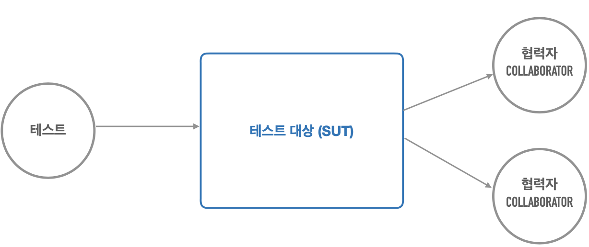

# 3. 테스트

## 자동으로 수행되는 테스트

---

- 테스트를 만들지 않을 거면 스프링을 도대체 뭐하러 쓰는 거죠?
- 수동 테스트의 한계
    1. 프린트된 메시지를 수동으로 확인하는 방법은 불편하다
    2. 사용자 웹 UI까지 개발한 뒤에 확인하는 방법은 테스트가 실패했을 때 확인할 코드가 많다
    3. 테스트할 대상이 많아질 수록 검증하는데 시간이 많이 걸리고 부정확함

- 수동으로 개발한 코드를 테스트하는 방법은 번거롭고 활용하는데 한계가 있다.
- 코드로 만들어져 언제든 실행해서 테스트할 수 있는 자동으로 수행되는 테스트가 필요하다. 이를 통해서 지속적인 개선과 점진적인 개발이 가능해진다.

- 개발자가 만드는 테스트
    - 테스트를 코드로 만들고 자동으로 수행되는 테스트를 실행해서 작성한 코드에 대한 피드백을 받는다
    - 테스트 작성과 실행이 개발을 하는 과정의 일부가 된다
    - 테스팅 프레임워크를 이용해서 테스트 작성과 실행 과정을 효율적으로 진행할 수 있다

## JUnit 테스트 작성

---

- JUnit은 켄트 벡과 에릭 감마가 처음 개발한 가장 대표적인 자동화된 테스트 수행 도구이다. 자바 외의 다른 언어로도 유사하게 개발되어지면서 이를 통틀어 xUnit이라고 부르기도 한다.

- JUnit5
    - [https://junit.org/junit5/](https://junit.org/junit5/), [https://junit.org/junit5/docs/current/user-guide](https://junit.org/junit5/docs/current/user-guide)
    - 최신 JUnit 버전이며 현재 스프링 프레임워크 자체의 테스트에 사용되고, 스프링을 이용해서 개발하는 프로젝트에서도 가장 많이 사용된다.

- 테스트 메소드엔 준비, 실행, 검증 단계가 있다.
    - 메소드명을 sortTest 하지말고, sort 메소드명에 `@Test` 어노테이션을 달아준다.

- ex> SortTest.java
    - Sort.java
        
        ```java
        package tobyspring.hellospring;
        
        import java.util.Arrays;
        import java.util.Collections;
        import java.util.List;
        
        public class Sort {
            public List<String> sortByLength(List<String> list) {
                list.sort((o1, o2) -> o1.length() - o2.length());
                return list;
            }
        
            public static void main(String[] args) {
                List<String> scores = Arrays.asList("z", "x", "spring", "java");
                Collections.sort(scores);
        
                scores.forEach(System.out::println);
            }
        }
        ```
        
    - `@Test` 테스트 메소드
    - `@BeforeEach` 테스트
        - 각 테스트 전에 실행된다
        - 테스트마다 새로운 인스턴스가 만들어진다.
    
    ```java
    package tobyspring.hellospring;
    
    import org.assertj.core.api.Assertions;
    import org.junit.jupiter.api.BeforeEach;
    import org.junit.jupiter.api.Test;
    
    import java.util.Arrays;
    import java.util.List;
    
    class SortTest {
        Sort sort;
    
        @BeforeEach
        void setUp() {
            sort = new Sort();
        }
    
        @Test
        void sort() {
            // 준비 (given)
    
            // 실행 (when)
            List<String> list = sort.sortByLength(Arrays.asList("aa", "b"));
    
            // 검증 (then)
            Assertions.assertThat(list).isEqualTo(Arrays.asList("b", "aa"));
        }
    
        @Test
        void sort3Items() {
            List<String> list = sort.sortByLength(Arrays.asList("aa", "ccc", "b"));
    
            Assertions.assertThat(list).isEqualTo(Arrays.asList("b", "aa", "ccc"));
        }
    
        @Test
        void sortAlreadySorted() {
            List<String> list = sort.sortByLength(Arrays.asList("b", "aa", "ccc"));
    
            Assertions.assertThat(list).isEqualTo(Arrays.asList("b", "aa", "ccc"));
        }
    }
    ```
    

## PaymentService 테스트

---

- 자동화된 테스트는 언제든 실행할 수 있고 항상 동일한 테스트 결과를 얻어야 한다.
    - 때로는 외부 시스템에 대한 테스트, 현재 시간과 같이 코드에서 쉽게 제어할 수 없는 값을 이용하는 테스트를 작성해야 하는데 이런 경우에 일관된 결과를 보장하는 테스트 코드를 작성하기가 쉽지 않다.

- 실습
    
    ```java
    package tobyspring.hellospring.payment;
    
    import org.junit.jupiter.api.DisplayName;
    import org.junit.jupiter.api.Test;
    import tobyspring.hellospring.exrate.WebApiExRateProvider;
    
    import java.io.IOException;
    import java.math.BigDecimal;
    import java.time.LocalDateTime;
    
    import static org.assertj.core.api.Assertions.assertThat;
    
    class PaymentServiceTest {
    
        @Test
        @DisplayName("prepare")
        void prepare() throws IOException {
            PaymentService paymentService = new PaymentService(new WebApiExRateProvider());
    
            Payment payment = paymentService.prepare(1L, "USD", BigDecimal.TEN);
    
            // 환율정보 가져온다
            assertThat(payment.getExRate()).isNotNull();
    
            // 원화환산금액 계산
            assertThat(payment.getConvertedAmount())
                    .isEqualTo(payment.getExRate().multiply(payment.getForeignCurrencyAmount()));
    
            // 원화환산금액의 유효시간 계산
            assertThat(payment.getValidUntil()).isAfter(LocalDateTime.now());
            assertThat(payment.getValidUntil()).isAfter(LocalDateTime.now().plusMinutes(30));
    
        }
    }
    ```
    

## 테스트의 구성 요소

---

- PaymentService 테스트의 문제점
    1. 우리가 제어할 수 없는 외부 시스템에 문제가 생기면?
    2. ExRateProvider가 제공하는 환율 값으로 계산한 것인가?
    3. 환율 유효시간 계산은 정확한 것인가?



- 영향을 미칠만한 제3의 오브젝트(협력자)는 stub을 만들어서 처리할 수 있다.
    
    
    

## 테스트와 DI (1)

---

- Stub을 사용한 PaymentServiceTest.java
    
    ```java
    package tobyspring.hellospring.payment;
    
    import org.junit.jupiter.api.DisplayName;
    import org.junit.jupiter.api.Test;
    
    import java.io.IOException;
    import java.math.BigDecimal;
    
    import static java.math.BigDecimal.valueOf;
    import static org.assertj.core.api.Assertions.assertThat;
    
    class PaymentServiceTest {
    
        @Test
        @DisplayName("prepare")
        void prepare() throws IOException {
            testAmout(valueOf(500), valueOf(5_000));
            testAmout(valueOf(1_000), valueOf(10_000));
            testAmout(valueOf(3_000), valueOf(30_000));
    
            // 원화환산금액의 유효시간 계산
    //        assertThat(payment.getValidUntil()).isAfter(LocalDateTime.now());
    //        assertThat(payment.getValidUntil()).isBefore(LocalDateTime.now().plusMinutes(30));
    
        }
    
        private void testAmout(BigDecimal exRate, BigDecimal convertedAmount) throws IOException {
            PaymentService paymentService = new PaymentService(new ExRateProviderStub(exRate));
    
            Payment payment = paymentService.prepare(1L, "USD", BigDecimal.TEN);
    
            // 환율정보 가져온다
            // 원화환산금액 계산
            assertThat(payment.getExRate()).isEqualByComparingTo(exRate);
            assertThat(payment.getConvertedAmount()).isEqualByComparingTo(convertedAmount);
        }
    }
    ```
    
    - `isEqualByComparingTo`: `BigDecimal`의 자릿수까지 체크한다.

- 테스트 대역(Test Double, Imposter), 스텁(Stub), 목(Mock)
    - [https://martinfowler.com/bliki/TestDouble.html](https://martinfowler.com/bliki/TestDouble.html)
    - [https://martinfowler.com/articles/mocksArentStubs.html](https://martinfowler.com/articles/mocksArentStubs.html)

### 스프링 DI를 이용하는 테스트

---

- 수동 DI를 이용하는 테스트 → 이걸로 가능하면 이걸로 테스트를 구성한다.
    - 테스트용 협력자(Collaborator)/의존 오브젝트를 테스트 대상에 직접 주입하고 테스트
- 스프링 DI를 이용하는 테스트 → 의존관계가 많이 엮여있는 경우에 사용한다.
    - 테스트용 협력자(Collaborator)/의존 오브젝트를 스프링의 구성 정보를 이용해서 지정하고 컨테이너로부터 테스트 대상을 가져와서 테스트
    - `@ContextConfiguration` + `@Autowired`

### 실습

---

- TestObjectFactory.java
    
    ```java
    package tobyspring.hellospring;
    
    import org.springframework.context.annotation.Bean;
    import org.springframework.context.annotation.Configuration;
    import tobyspring.hellospring.payment.ExRateProvider;
    import tobyspring.hellospring.payment.ExRateProviderStub;
    import tobyspring.hellospring.payment.PaymentService;
    
    import java.math.BigDecimal;
    
    @Configuration
    public class TestObjectFactory {
        @Bean
        public PaymentService paymentService() {
            return new PaymentService(exRateProvider());
        }
    
        @Bean
        public ExRateProvider exRateProvider() {
            return new ExRateProviderStub(BigDecimal.valueOf(1_000));
        }
    }
    ```
    
- PaymentServiceSpringTest.java
    
    ```java
    package tobyspring.hellospring.payment;
    
    import org.junit.jupiter.api.Test;
    import org.springframework.beans.factory.BeanFactory;
    import org.springframework.context.annotation.AnnotationConfigApplicationContext;
    import tobyspring.hellospring.TestObjectFactory;
    
    import java.io.IOException;
    import java.math.BigDecimal;
    
    import static java.math.BigDecimal.valueOf;
    import static org.assertj.core.api.Assertions.assertThat;
    
    class PaymentServiceSpringTest {
    
        @Test
        void convertedAmount() throws IOException {
            BeanFactory beanFactory = new AnnotationConfigApplicationContext(TestObjectFactory.class);
            PaymentService paymentService = beanFactory.getBean(PaymentService.class);
    
            Payment payment = paymentService.prepare(1L, "USD", BigDecimal.TEN);
    
            // 환율정보 가져온다 & 원화환산금액 계산
            assertThat(payment.getExRate()).isEqualByComparingTo(valueOf(1_000));
            assertThat(payment.getConvertedAmount()).isEqualByComparingTo(valueOf(10_000));
        }
    }
    ```
    

## 테스트와 DI (2)

---

- BeanFactory에서 직접 꺼내지 않고 `@ContextConfiguration` + `@Autowired` 방식으로 테스트하기
    
    ```java
    package tobyspring.hellospring.payment;
    
    import org.junit.jupiter.api.Test;
    import org.junit.jupiter.api.extension.ExtendWith;
    import org.springframework.beans.factory.annotation.Autowired;
    import org.springframework.test.context.ContextConfiguration;
    import org.springframework.test.context.junit.jupiter.SpringExtension;
    import tobyspring.hellospring.TestObjectFactory;
    
    import java.io.IOException;
    import java.math.BigDecimal;
    
    import static java.math.BigDecimal.valueOf;
    import static org.assertj.core.api.Assertions.assertThat;
    
    @ExtendWith(SpringExtension.class)
    @ContextConfiguration(classes = TestObjectFactory.class)
    class PaymentServiceSpringTest {
    
        @Autowired
        PaymentService paymentService;
    
        @Test
        void convertedAmount() throws IOException {
            Payment payment = paymentService.prepare(1L, "USD", BigDecimal.TEN);
    
            // 환율정보 가져온다 & 원화환산금액 계산
            assertThat(payment.getExRate()).isEqualByComparingTo(valueOf(1_000));
            assertThat(payment.getConvertedAmount()).isEqualByComparingTo(valueOf(10_000));
        }
    }
    ```
    
    - `@ExtendWith`: 스프링을 이용해서 확장해달라는 의미

👉

- 만들어놓은 Stub을 주입받으면 테스트코드 내에서 변경할 수 있다.
    
    ```java
    package tobyspring.hellospring.payment;
    
    import org.junit.jupiter.api.Test;
    import org.junit.jupiter.api.extension.ExtendWith;
    import org.springframework.beans.factory.annotation.Autowired;
    import org.springframework.test.context.ContextConfiguration;
    import org.springframework.test.context.junit.jupiter.SpringExtension;
    import tobyspring.hellospring.TestObjectFactory;
    
    import java.io.IOException;
    import java.math.BigDecimal;
    
    import static java.math.BigDecimal.valueOf;
    import static org.assertj.core.api.Assertions.assertThat;
    
    @ExtendWith(SpringExtension.class)
    @ContextConfiguration(classes = TestObjectFactory.class)
    class PaymentServiceSpringTest {
    
        @Autowired
        PaymentService paymentService;
        @Autowired ExRateProviderStub exRateProviderStub;
    
        @Test
        void convertedAmount() throws IOException {
            Payment payment = paymentService.prepare(1L, "USD", BigDecimal.TEN);
    
            // 환율정보 가져온다 & 원화환산금액 계산
            assertThat(payment.getExRate()).isEqualByComparingTo(valueOf(1_000));
            assertThat(payment.getConvertedAmount()).isEqualByComparingTo(valueOf(10_000));
    
            // exRate: 500
            exRateProviderStub.setExRate(valueOf(500));
            Payment payment2 = paymentService.prepare(1L, "USD", BigDecimal.TEN);
    
            assertThat(payment2.getExRate()).isEqualByComparingTo(valueOf(500));
            assertThat(payment2.getConvertedAmount()).isEqualByComparingTo(valueOf(5_000));
    
        }
    }
    ```
    

- 스프링 컨테이너를 구성하고 여기서 테스트에 필요한 대상과 의존 오브젝트를 설정하거나 테스트에서 참고할 빈 오브젝트를 가져오게 할 수 있다.
- 스프링은 방대한 양의 테스팅 지원 기술을 제공한다.([문서](https://docs.spring.io/spring-framework/reference/testing.html))
- JUnit에서 스프링 컨테이너를 만들어 테스트를 수행할 때 `@ExtendWith`와 `@ContextConfiguration`를 이용한다.
    - `@ExtendWith`: JUnit 5 테스트 클래스가 스프링 테스팅 기능을 사용하도록 지정한다
        - 아래 `@ContextConfiguration`과 결합한 합성 애노테이션인 `@SpringJUnitConfig`를 이용할 수도 있다.([문서](https://docs.spring.io/spring-framework/reference/testing/annotations/integration-junit-jupiter.html#integration-testing-annotations-junit-jupiter-springjunitconfig))
    - `@ContextConfiguration`([문서](https://docs.spring.io/spring-framework/reference/testing/annotations/integration-spring/annotation-contextconfiguration.html#page-title))
    - `@Autowired`: 테스트 코드에 `@Autowired`가 붙은 인스턴스 변수를 선언하며 스프링 테스트에 의해서 인스턴스 변수의 타입과 일치하는 스프링 컨테이너의 빈 오브젝트를 주입해준다.
        - `@Autowired` 외에도 스프링에서 지원하는 여러가지 종류의 애노테이션을 지원한다.([문서](https://docs.spring.io/spring-framework/reference/testing/annotations/integration-standard.html#page-title))

## 학습 테스트

---

- 켄트 벡의 테스트주도개발, 로버트 마틴의 클린 코드 에서 소개된 테스트 방법의 한 가지이다.
- 학습 테스트: 내가 만들지 않은 코드, 라이브러리, API, 레거시 시스템 등에 대한 테스트이다.
    - 목적: 사용할 API나 프레임워크의 기능을 테스트로 작성하고 실행해보면서 사용방법을 바르게 이해했는지 확인할 수 있다.
    - 테스트 대상의 사용방법을 익히고 동작방식을 확인하는데 유용하다.
    - 외부 기술, 서비스가 버전이 올라갔을 때 이전과 동일하게 동작하는지 확인할 수도 있다.

- `assertj`의 `Assertions` 라이브템플릿 등록하기
    
    
    

- ClockTest.java (`java.time.Clock`)
    
    ```java
    package tobyspring.hellospring.learningtest;
    
    import org.assertj.core.api.Assertions;
    import org.junit.jupiter.api.Test;
    
    import java.time.Clock;
    import java.time.Instant;
    import java.time.LocalDateTime;
    import java.time.ZoneId;
    
    public class ClockTest {
        // Clock을 이용해서 LocalDateTime.now?
        @Test
        void clock() {
            Clock clock = Clock.systemDefaultZone();
    
            LocalDateTime dt1 = LocalDateTime.now(clock);
            LocalDateTime dt2 = LocalDateTime.now(clock);
    
            Assertions.assertThat(dt2).isAfter(dt1);
        }
    
        // Clock을 Test에서 사용할 때 내가 원하는 시간을 지정해서 현재 시간을 가져오게 할 수 있는가?
        @Test
        void fixedClock() {
            Clock clock = Clock.fixed(Instant.now(), ZoneId.systemDefault());
    
            LocalDateTime dt1 = LocalDateTime.now(clock);
            LocalDateTime dt2 = LocalDateTime.now(clock);
    
            LocalDateTime dt3 = LocalDateTime.now(clock).plusHours(1);
    
            Assertions.assertThat(dt2).isEqualTo(dt1);
            Assertions.assertThat(dt3).isEqualTo(dt1.plusHours(1));
        }
    }
    ```
    

## Clock을 이용한 시간 테스트

---


→


- ObjectFactory → PaymentConfig 로 네이밍 변경, Clock bean 추가
    - PaymentConfig: `Clock.systemDefaultZone()`
    - TestPaymentConfig: `Clock.fixed(Instant.now(), ZoneId.systemDefault())`

### 실습

---

- PaymentService.java
    
    ```java
    package tobyspring.hellospring.payment;
    
    import org.springframework.stereotype.Component;
    
    import java.io.IOException;
    import java.math.BigDecimal;
    import java.time.Clock;
    import java.time.LocalDateTime;
    
    @Component
    public class PaymentService {
        private final ExRateProvider exRateProvider;
        private final Clock clock;
    
        public PaymentService(ExRateProvider exRateProvider, Clock clock) {
            this.exRateProvider = exRateProvider;
            this.clock = clock;
        }
    
        public Payment prepare(Long orderId, String currency, BigDecimal foreignCurrencyAmount) throws IOException {
            BigDecimal exRate = exRateProvider.getExRate(currency);
            BigDecimal convertedAmount = foreignCurrencyAmount.multiply(exRate);
            LocalDateTime validUntil = LocalDateTime.now(clock).plusMinutes(30);
    
            return new Payment(orderId, currency, foreignCurrencyAmount, exRate, convertedAmount, validUntil);
        }
    }
    ```
    
- PaymentServiceTest.java
    
    ```java
    package tobyspring.hellospring.payment;
    
    import org.assertj.core.api.Assertions;
    import org.junit.jupiter.api.BeforeEach;
    import org.junit.jupiter.api.DisplayName;
    import org.junit.jupiter.api.Test;
    
    import java.io.IOException;
    import java.math.BigDecimal;
    import java.time.Clock;
    import java.time.Instant;
    import java.time.LocalDateTime;
    import java.time.ZoneId;
    
    import static java.math.BigDecimal.valueOf;
    import static org.assertj.core.api.Assertions.assertThat;
    
    class PaymentServiceTest {
        Clock clock;
    
        @BeforeEach
        void beforeEach() {
            this.clock = Clock.fixed(Instant.now(), ZoneId.systemDefault());
        }
    
        @Test
        void convertAmount() throws IOException {
            testAmout(valueOf(500), valueOf(5_000), this.clock);
            testAmout(valueOf(1_000), valueOf(10_000), this.clock);
            testAmout(valueOf(3_000), valueOf(30_000), this.clock);
        }
    
        @Test
        void validUntil() throws IOException {
            PaymentService paymentService = new PaymentService(new ExRateProviderStub(valueOf(1_000)), clock);
    
            Payment payment = paymentService.prepare(1L, "USD", BigDecimal.TEN);
    
            // valid until이 prepare() 30분 뒤로 설정됐는가?
            LocalDateTime now = LocalDateTime.now(this.clock);
            LocalDateTime expectedValidUntil = now.plusMinutes(30);
    
            Assertions.assertThat(payment.getValidUntil()).isEqualTo(expectedValidUntil);
        }
    
        private void testAmout(BigDecimal exRate, BigDecimal convertedAmount, Clock clock) throws IOException {
            PaymentService paymentService = new PaymentService(new ExRateProviderStub(exRate), clock);
    
            Payment payment = paymentService.prepare(1L, "USD", BigDecimal.TEN);
    
            // 환율정보 가져온다
            // 원화환산금액 계산
            assertThat(payment.getExRate()).isEqualByComparingTo(exRate);
            assertThat(payment.getConvertedAmount()).isEqualByComparingTo(convertedAmount);
        }
    }
    
    ```
    
- PaymentServiceSpringTest.java
    
    ```java
    package tobyspring.hellospring.payment;
    
    import org.assertj.core.api.Assertions;
    import org.junit.jupiter.api.Test;
    import org.junit.jupiter.api.extension.ExtendWith;
    import org.springframework.beans.factory.annotation.Autowired;
    import org.springframework.test.context.ContextConfiguration;
    import org.springframework.test.context.junit.jupiter.SpringExtension;
    import tobyspring.hellospring.TestPaymentConfig;
    
    import java.io.IOException;
    import java.math.BigDecimal;
    import java.time.Clock;
    import java.time.LocalDateTime;
    
    import static java.math.BigDecimal.valueOf;
    import static org.assertj.core.api.Assertions.assertThat;
    
    @ExtendWith(SpringExtension.class)
    @ContextConfiguration(classes = TestPaymentConfig.class)
    class PaymentServiceSpringTest {
    
        @Autowired
        PaymentService paymentService;
        @Autowired
        Clock clock;
        @Autowired
        ExRateProviderStub exRateProviderStub;
    
        @Test
        void convertedAmount() throws IOException {
            Payment payment = paymentService.prepare(1L, "USD", BigDecimal.TEN);
    
            // 환율정보 가져온다 & 원화환산금액 계산
            assertThat(payment.getExRate()).isEqualByComparingTo(valueOf(1_000));
            assertThat(payment.getConvertedAmount()).isEqualByComparingTo(valueOf(10_000));
    
            // exRate: 500
            exRateProviderStub.setExRate(valueOf(500));
            Payment payment2 = paymentService.prepare(1L, "USD", BigDecimal.TEN);
    
            // 환율정보 가져온다 & 원화환산금액 계산
            assertThat(payment2.getExRate()).isEqualByComparingTo(valueOf(500));
            assertThat(payment2.getConvertedAmount()).isEqualByComparingTo(valueOf(5_000));
        }
    
        @Test
        void validUntil() throws IOException {
            PaymentService paymentService = new PaymentService(new ExRateProviderStub(valueOf(1_000)), clock);
    
            Payment payment = paymentService.prepare(1L, "USD", BigDecimal.TEN);
    
            // valid until이 prepare() 30분 뒤로 설정됐는가?
            LocalDateTime now = LocalDateTime.now(this.clock);
            LocalDateTime expectedValidUntil = now.plusMinutes(30);
    
            Assertions.assertThat(payment.getValidUntil()).isEqualTo(expectedValidUntil);
        }
    }
    ```
    

## 도메인 오브젝트 테스트

---

- 테스트의 꽃
- 도메인 모델 아키텍처 패턴: 도메인 로직, 비즈니스 로직을 어디에 둘 지를 결정하는 패턴
    1. 트랜잭션 스크립트 - 서비스 메소드 (PaymentService.prepare)
    2. 도메인 모델 - 도메인 모델 오브젝트 (Payment)

- `Payment`
    - AS-IS: Data Carrier
    - TO-BE: 도메인 모델
        - 생성자 말고 팩토리 메서드 추가, 유효성 검증로직 추가
            
            ```java
            public static Payment createPrepared(Long orderId, String currency, BigDecimal foreignCurrencyAmount, BigDecimal exRate,
                                                 LocalDateTime now) {
                BigDecimal convertedAmount = foreignCurrencyAmount.multiply(exRate);
                LocalDateTime validUntil = now.plusMinutes(30);
            
                return new Payment(orderId, currency, foreignCurrencyAmount, exRate, convertedAmount, validUntil);
            }
            
            public boolean isValid(Clock clock) {
                return LocalDateTime.now(clock).isBefore(this.validUntil);
            }
            ```
            
        - PaymentTest.java
            
            ```java
            package tobyspring.hellospring.payment;
            
            import org.assertj.core.api.Assertions;
            import org.junit.jupiter.api.Test;
            
            import java.math.BigDecimal;
            import java.time.*;
            import java.time.temporal.ChronoUnit;
            
            public class PaymentTest {
                @Test
                void createPrepared() {
                    Clock clock = Clock.fixed(Instant.now(), ZoneId.systemDefault());
            
                    Payment payment = Payment.createPrepared(
                            1L, "USD", BigDecimal.TEN, BigDecimal.valueOf(1_000), LocalDateTime.now(clock));
            
                    Assertions.assertThat(payment.getConvertedAmount()).isEqualByComparingTo(BigDecimal.valueOf(10_000));
                    Assertions.assertThat(payment.getValidUntil()).isEqualTo(LocalDateTime.now(clock).plusMinutes(30));
                }
            
                @Test
                void isValid() {
                    Clock clock = Clock.fixed(Instant.now(), ZoneId.systemDefault());
            
                    Payment payment = Payment.createPrepared(
                            1L, "USD", BigDecimal.TEN, BigDecimal.valueOf(1_000), LocalDateTime.now(clock));
            
                    Assertions.assertThat(payment.isValid(clock)).isTrue();
                    Assertions.assertThat(payment.isValid(Clock.offset(clock, Duration.of(30, ChronoUnit.MINUTES)))).isFalse();
                }
            }
            ```
            

- 스프링과 JDK 업그레이드
    - 스프링 6.0 → 스프링 6.1 (스프링 부트 3.2)
    - JDK 21
    - 새로운 스프링 부트 프로젝트를 만들고 Gradle 설정을 참고해서 변경

- 개발자가 만드는 테스트
    - 개발한 코드에 대한 검증 기능을 코드로 작성한다
    - 자동으로 테스트를 수행하고 결과를 확인한다
    - 테스팅 프레임워크를 활용한다
    - 테스트 작성과 실행도 개발 과정의 일부이다
