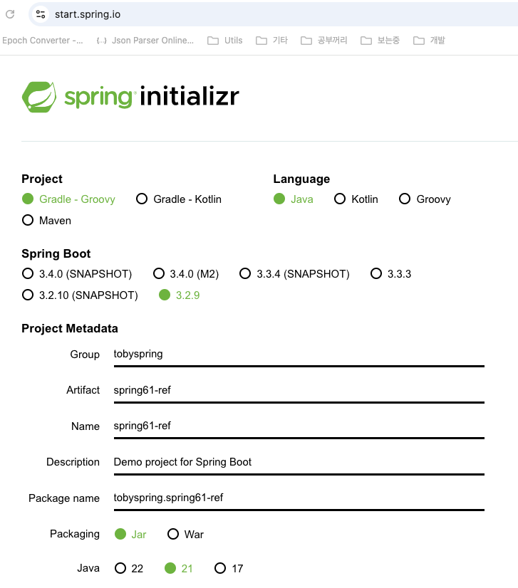

# 4. 템플릿

## 스프링과 JDK 업그레이드

---

- 스프링 6.0 → 스프링 6.1 (스프링 부트 **3.2**)
- JDK 21

- 책에서는 New project 함
    - IntelliJ IDEA Edu에는 spring initializr 선택할 수가 없어서 직접 생성함
        
        
        
- 여기서 참고할 것들만 가져올 예정
    1. `gradle/wrapper/gradle-wrapper.properties` 내용 기존 프로젝트에 복붙
        - AS-IS
            
            ```java
            distributionBase=GRADLE_USER_HOME
            distributionPath=wrapper/dists
            distributionUrl=https\://services.gradle.org/distributions/gradle-8.8-bin.zip
            networkTimeout=10000
            validateDistributionUrl=true
            zipStoreBase=GRADLE_USER_HOME
            zipStorePath=wrapper/dists
            ```
            
        - TO-BE
            
            ```java
            distributionBase=GRADLE_USER_HOME
            distributionPath=wrapper/dists
            distributionUrl=https\://services.gradle.org/distributions/gradle-8.10.1-bin.zip
            networkTimeout=10000
            validateDistributionUrl=true
            zipStoreBase=GRADLE_USER_HOME
            zipStorePath=wrapper/dists
            ```
            
    2. `build.gradle`: java version 부분만 복붙
    3. `settings.gradle`: rootProject.name 빼고 다른 내용은 삭제해준다.(나는 없었음)
    
    👉 spring framework 관련된 부분이 6.1점대 버전으로 셋팅되어 있으면 된다.
    

## 다시 보는 개방 폐쇄 원칙

---

- 개방 폐쇄 원칙(OCP)
    - 클래스나 모듈은 확장에는 열려 있어야 하고 변경에는 닫혀 있어야 한다.
    - 변화의 특성이 다른 부분을 구분하고 각각 다른 목적과 이유에 의해 다른 시점에 독립적으로 변경될 수 있는 효율적인 구조를 만들어야 한다.

- 템플릿: 변경이 거의 일어나지 않으며 일정한 패턴으로 유지되는 특성을 가진 부분
- 콜백: 자유롭게 변경되는 성질을 가진 부분

👉 코드 중에서 템플릿 부분을 콜백 부분으로부터 독립시켜서 효과적으로 활용할 수 있도록 하는 방법

- 템플릿: 고정된 작업 흐름 안에 변경할 수 있는 코드를 콜백 형태로 전달해서 사용할 수 있도록 만들어진 오브젝트
- 템플릿 메소드 패턴: 상속을 이용해서 고정된 템플릿과 변경 가능한 훅 메소드 등으로 분리하는 패턴

- 템플릿과 콜백을 사용하는 방식은 프레임워크에 적용되는 제어의 역전으로 설명할 수 있다.
    - 컨텍스트에 전략을 교체해서 쓰는 전략 패턴의 특별한 케이스로 볼 수도 있다.
    - 콜백은 인터페이스로 만들어지고 대부분 하나의 메소드만 가진다.

- 콜백을 이용해서 확장성을 추구하는 방식
    - 스프링을 만든 로드 존슨이 쓴 J2EE Design And Development에서 처음 소개되었다.
    - 책에서 예로 든 템플릿은 JDBC를 다루는 코드에 적용하도록 만들어진 `JdbcTemplate`이고, 후에 스프링 프레임워크가 만들어질 때 포함되었다.

- 메소드 호출 주입(Method call injection)
    - DI의 일종으로 컨테이너의 구성 정보에 포함되지 않고 메소드 실행 시점에 의존 오브젝트를 파라미터로 주입하는 방식으로 동작한다.
    - 스프링의 룩업 메소드 주입과는 다르다.
    - 스프링의 메소드 주입은 런타임 상속을 통해서 메소드의 구현 코드를 직접 주입하는 방식이다.

## WebApiExRateProvider 리팩터링

---

- Refactoring + Debugging
    1. 불필요한 `throws IOException` 제거
    2. Java20에서 `@Deprecated`된 `URL`을 `URI`로 전환
    3. WebApiExRateProvider 코드의 예외 처리
    4. `try-with-resource`를 이용한 리소스 반환(`AutoClosable`)

- AS-IS
    - WebApiExRateProvider.java
        
        ```java
        package tobyspring.hellospring.exrate;
        
        import com.fasterxml.jackson.databind.ObjectMapper;
        import tobyspring.hellospring.payment.ExRateProvider;
        
        import java.io.BufferedReader;
        import java.io.IOException;
        import java.io.InputStreamReader;
        import java.math.BigDecimal;
        import java.net.HttpURLConnection;
        import java.net.URL;
        import java.util.stream.Collectors;
        
        public class WebApiExRateProvider implements ExRateProvider {
            @Override
            public BigDecimal getExRate(String currency) throws IOException {
                {
                    URL url = new URL("https://open.er-api.com/v6/latest/" + currency);
                    HttpURLConnection connection = (HttpURLConnection) url.openConnection();
                    BufferedReader br = new BufferedReader(new InputStreamReader(connection.getInputStream()));
                    String response = br.lines().collect(Collectors.joining());
                    br.close();
        
                    ObjectMapper mapper = new ObjectMapper();
                    ExRateData data = mapper.readValue(response, ExRateData.class);
        
                    System.out.println("API ExRate: " + data.rates().get("KRW"));
        
                    return data.rates().get("KRW");
                }
            }
        }
        ```
        
    - WebApiExRateProvider가 외부 호출이 있어서 Stub을 만들어서 테스트했었다.
        - 직접 호출하는 테스트는 Client.java 실행을 통해서 가능하다.
    - `Deprecated`된 `URL` → `URI`로 변경한다.
    - `throws IOException`하는 부분 예외 처리: `CheckedException` → `RuntimeException`
        - 복구할만한 설계가 없다면 무시하게 던지게 하면 된다.
        - `connection` `open`/`close`의 경우, 기능을 수행하지 못한다.
            
            → PaymentService 까지 전파되는건 이상하다.
            
        - ExRateProvider 인터페이스의 `throws IOException` 제거
            - 이에 따른 Client.java, CachedExRateProvider.java, WebApiExRateProvider.java, PaymentService.java, ExRateProviderStub.java, PaymentServiceSpringTest.java, PaymentServiceTest.java 에서 `throws IOException` 제거
        - WebApiExRateProvider.java 결과
            
            ```java
            package tobyspring.hellospring.exrate;
            
            import com.fasterxml.jackson.core.JsonProcessingException;
            import com.fasterxml.jackson.databind.ObjectMapper;
            import tobyspring.hellospring.payment.ExRateProvider;
            
            import java.io.BufferedReader;
            import java.io.IOException;
            import java.io.InputStreamReader;
            import java.math.BigDecimal;
            import java.net.HttpURLConnection;
            import java.net.URI;
            import java.net.URISyntaxException;
            import java.util.stream.Collectors;
            
            public class WebApiExRateProvider implements ExRateProvider {
                @Override
                public BigDecimal getExRate(String currency) {
                    {
                        String url = "https://open.er-api.com/v6/latest/" + currency;
            
                        URI uri;
                        try {
                            uri = new URI(url);
                        } catch (URISyntaxException e) {
                            throw new RuntimeException(e);
                        }
            
                        String response;
                        try {
                            HttpURLConnection connection = (HttpURLConnection) uri.toURL().openConnection();
                            BufferedReader br = new BufferedReader(new InputStreamReader(connection.getInputStream()));
                            response = br.lines().collect(Collectors.joining());
                            br.close();
                        } catch (IOException e) {
                            throw new RuntimeException(e);
                        }
            
                        try {
                            ObjectMapper mapper = new ObjectMapper();
                            ExRateData data = mapper.readValue(response, ExRateData.class);
                            return data.rates().get("KRW");
                        } catch (JsonProcessingException e) {
                            throw new RuntimeException(e);
                        }
                    }
                }
            }
            ```
            
    - `try-with-resource`를 이용한 리소스 반환(`AutoClosable`)
        - `BufferedReader` 따라가면 `Closable`(`AutoClosable`) 타입임을 알 수 있다.
        - 이 타입이면, `try` 블럭에 선언해두면 이 resource를 `close` 해준다.
            
            ```java
            ...
            String response;
            try {
                HttpURLConnection connection = (HttpURLConnection) uri.toURL().openConnection();
                try (BufferedReader br = new BufferedReader(new InputStreamReader(connection.getInputStream()))) {
                    response = br.lines().collect(Collectors.joining());
                }
            } catch (IOException e) {
                throw new RuntimeException(e);
            }
            ...
            ```
            

## 변하는 코드 분리하기 - 메소드 추출

---

- WebApiExRateProvider의 구성
    1. URI를 준비하고 예외처리를 위한 작업을 하는 코드
        - API로부터 환율 정보를 가져오는 코드의 기본 틀 (바뀌지 않으려는 성질)
            
            
            
    2. API를 실행하고, 서버로부터 받은 응답을 가져오는 코드
        - API를 호출하는 기술과 방법이 변경될 수 있음 (변경가능)
    3. JSON 문자열을 파싱하고 필요한 환율정보를 추출하는 코드
        - API 응답의 JSON 구조에 따라 정보를 추출하는 방식이 변경될 수 있음 (변경가능)

- 일단 메소드 추출로 분리 해봅시다.
    - WebApiExRateProvider.java 결과
        
        ```java
        package tobyspring.hellospring.exrate;
        
        import com.fasterxml.jackson.core.JsonProcessingException;
        import com.fasterxml.jackson.databind.ObjectMapper;
        import tobyspring.hellospring.payment.ExRateProvider;
        
        import java.io.BufferedReader;
        import java.io.IOException;
        import java.io.InputStreamReader;
        import java.math.BigDecimal;
        import java.net.HttpURLConnection;
        import java.net.URI;
        import java.net.URISyntaxException;
        import java.util.stream.Collectors;
        
        public class WebApiExRateProvider implements ExRateProvider {
            @Override
            public BigDecimal getExRate(String currency) {
                {
                    String url = "https://open.er-api.com/v6/latest/" + currency;
        
                    URI uri;
                    try {
                        uri = new URI(url);
                    } catch (URISyntaxException e) {
                        throw new RuntimeException(e);
                    }
        
                    String response;
                    try {
                        response = executeApi(uri);
                    } catch (IOException e) {
                        throw new RuntimeException(e);
                    }
        
                    try {
                        return parseExRate(response);
                    } catch (JsonProcessingException e) {
                        throw new RuntimeException(e);
                    }
                }
            }
        
            private static BigDecimal parseExRate(String response) throws JsonProcessingException {
                ObjectMapper mapper = new ObjectMapper();
                ExRateData data = mapper.readValue(response, ExRateData.class);
                return data.rates().get("KRW");
            }
        
            private static String executeApi(URI uri) throws IOException {
                String response;
                HttpURLConnection connection = (HttpURLConnection) uri.toURL().openConnection();
                try (BufferedReader br = new BufferedReader(new InputStreamReader(connection.getInputStream()))) {
                    response = br.lines().collect(Collectors.joining());
                }
                return response;
            }
        }
        ```
        

## 변하지 않는 코드 분리하기 - 메소드 추출

---

- 템플릿(Template)
    - 템플릿은 어떤 목적을 위해 미리 만들어둔 모양이 있는 틀
    - 고정된 틀 안에 바꿀 수 있는 부분을 넣어서 사용하도록 만들어진 오브젝트
    - 템플릿 메소드 패턴도 템플릿을 사용
- 템플릿 메소드 패턴?
    - 템플릿 메소드 패턴은 고정된 틀의 로직을 가진 템플릿 메소드를 슈퍼클래스에 두고, 바뀌는 부분을 서브클래스의 메소드에 두는 구조로 이뤄진다.

🤔 지금 만들고 있는 템플릿에 적용되는 디자인 패턴은?

- 일단 메소드 추출로 분리 해봅시다.
    - `parseExRate` → `extractExRate`: 동작보다는 목적을 표현할 수 있는 메소드 이름이 더 좋다.
    - 재사용 할 수 있는, 고정된 틀(`runApiForExRate`)을 분리한다.
        
        ```java
        ...
        public BigDecimal getExRate(String currency) {
            String url = "https://open.er-api.com/v6/latest/" + currency;
        
            return runApiForExRate(url);
        }
        
        private static BigDecimal runApiForExRate(String url) {
            URI uri;
            try {
                uri = new URI(url);
            } catch (URISyntaxException e) {
                throw new RuntimeException(e);
            }
        
            String response;
            try {
                response = executeApi(uri);
            } catch (IOException e) {
                throw new RuntimeException(e);
            }
        
            try {
                return extractExRate(response);
            } catch (JsonProcessingException e) {
                throw new RuntimeException(e);
            }
        }
        ...
        ```
        
        - 현재는 클래스 종속적이어서 재사용 가능하기 어렵다. (확장성이 떨어지는 상태)

## ApiExecutor 분리 - 인터페이스 도입과 클래스 분리

---

- api 관련된 역할을 하는 디렉토리를 따로 만든 후 인터페이스, 구현체 정의한다.
    - ApiExecutor.java
        
        ```java
        package tobyspring.hellospring.api;
        
        import java.io.IOException;
        import java.net.URI;
        
        public interface ApiExecutor {
            String execute(URI uri) throws IOException;
        }
        ```
        
    - SimpleApiExecutor.java
        
        ```java
        package tobyspring.hellospring.api;
        
        import java.io.BufferedReader;
        import java.io.IOException;
        import java.io.InputStreamReader;
        import java.net.HttpURLConnection;
        import java.net.URI;
        import java.util.stream.Collectors;
        
        public class SimpleApiExecutor implements ApiExecutor {
            @Override
            public String execute(URI uri) throws IOException {
                String response;
                HttpURLConnection connection = (HttpURLConnection) uri.toURL().openConnection();
                try (BufferedReader br = new BufferedReader(new InputStreamReader(connection.getInputStream()))) {
                    response = br.lines().collect(Collectors.joining());
                }
                return response;
            }
        }
        ```
        
- 호출부 정리
    - WebApiExRateProvider.java
        
        ```java
        ...
        private static BigDecimal runApiForExRate(String url) {
            URI uri;
            try {
                uri = new URI(url);
            } catch (URISyntaxException e) {
                throw new RuntimeException(e);
            }
        
            String response;
            try {
                response = new SimpleApiExecutor().execute(uri);
            } catch (IOException e) {
                throw new RuntimeException(e);
            }
        ...
        ```
        

## ApiExecutor 콜백과 메소드 주입

---

- 콜백(Callback)
    - 콜백은 실행되는 것을 목적으로 다른 오브젝트의 메소드에 전달되는 오브젝트
    - 파라미터로 전달되지만 값을 참조하기 위한 것이 아니라 특정 로직을 담은 메소드를 실행시키는 것이 목적
    - 하나의 메소드를 가진 인터페이스 타입(SAM)의 오브젝트 또는 람다 오브젝트

- 템플릿/콜백은 전략 패턴의 특별한 케이스
    - 템플릿은 전략 패턴의 컨텍스트
    - 콜백은 전략 패턴의 전략
    - 템플릿/콜백은 메소드 하나만 가진 전략 인터페이스를 사용하는 전략 패턴

- 메소드 주입
    - 의존 오브젝트가 메소드 호출 시점에 파라미터로 전달되는 방식
    - 의존관계 주입의 한 종류
    - 메소드 호출 주입이라고도 한다.
    - 콜백은 템플릿에 메소드 주입 방식으로 전달된다.

- 템플릿/콜백의 작업 흐름
    
    
    

- ApiExecutor 콜백(`runApiForExRate`) 만들기: API를 실행하고, 서버로부터 받은 응답을 가져오는 코드
- 우리 코드(WebApiExRateProvider.java)에서 보면,
    - 클라이언트: getExRate, 콜백: new SimpleApiExecutor(), 템플릿: runApiForExRate
        
        ```java
        ...
        public class WebApiExRateProvider implements ExRateProvider {
            @Override
            public BigDecimal getExRate(String currency) {
                String url = "https://open.er-api.com/v6/latest/" + currency;
                return runApiForExRate(url, new SimpleApiExecutor());
            }
        
            private static BigDecimal runApiForExRate(String url, ApiExecutor apiExecutor) {
                URI uri;
                try {
                    uri = new URI(url);
                } catch (URISyntaxException e) {
                    throw new RuntimeException(e);
                }
        
                String response;
                try {
                    response = apiExecutor.execute(uri);
                } catch (IOException e) {
                    throw new RuntimeException(e);
                }
        ...
        ```
        
    - 콜백을 람다로 교체할 수도 있다.

## ExRateExtractor 콜백 - Callback + Method Injection

---

- ExRateExtractor 콜백(`extractExRate`) 만들기: JSON 문자열을 파싱하고 필요한 환율정보를 추출하는 코드 콜백으로 만들기
    - 1차 결과: 콜백 람다로 넘겨주는 버전
        - ExRateExtractor.java
            
            ```java
            package tobyspring.hellospring.api;
            
            import com.fasterxml.jackson.core.JsonProcessingException;
            
            import java.math.BigDecimal;
            
            public interface ExRateExtractor {
                BigDecimal extractExRate(String response) throws JsonProcessingException;
            }
            ```
            
        - WebApiExRateProvider.java
            
            ```java
            package tobyspring.hellospring.exrate;
            
            import com.fasterxml.jackson.core.JsonProcessingException;
            import com.fasterxml.jackson.databind.ObjectMapper;
            import tobyspring.hellospring.api.ApiExecutor;
            import tobyspring.hellospring.api.ExRateExtractor;
            import tobyspring.hellospring.api.SimpleApiExecutor;
            import tobyspring.hellospring.payment.ExRateProvider;
            
            import java.io.IOException;
            import java.math.BigDecimal;
            import java.net.URI;
            import java.net.URISyntaxException;
            
            public class WebApiExRateProvider implements ExRateProvider {
                @Override
                public BigDecimal getExRate(String currency) {
                    String url = "https://open.er-api.com/v6/latest/" + currency;
            
                    return runApiForExRate(url, new SimpleApiExecutor(), response -> {
                        ObjectMapper mapper = new ObjectMapper();
                        ExRateData data = mapper.readValue(response, ExRateData.class);
                        return data.rates().get("KRW");
                    });
                }
            
                private static BigDecimal runApiForExRate(String url, ApiExecutor apiExecutor, ExRateExtractor exRateExtractor) {
                    URI uri;
                    try {
                        uri = new URI(url);
                    } catch (URISyntaxException e) {
                        throw new RuntimeException(e);
                    }
            
                    String response;
                    try {
                        response = apiExecutor.execute(uri);
                    } catch (IOException e) {
                        throw new RuntimeException(e);
                    }
            
                    try {
                        return exRateExtractor.extractExRate(response);
                    } catch (JsonProcessingException e) {
                        throw new RuntimeException(e);
                    }
                }
            }
            ```
            
    - 2차 결과: 구현체로 넘겨주는 버전
        - ErApiExRateExtractor.java
            
            ```java
            package tobyspring.hellospring.api;
            
            import com.fasterxml.jackson.core.JsonProcessingException;
            import com.fasterxml.jackson.databind.ObjectMapper;
            import tobyspring.hellospring.exrate.ExRateData;
            
            import java.math.BigDecimal;
            
            public class ErApiExRateExtractor implements ExRateExtractor {
                @Override
                public BigDecimal extractExRate(String response) throws JsonProcessingException {
                    ObjectMapper mapper = new ObjectMapper();
                    ExRateData data = mapper.readValue(response, ExRateData.class);
                    return data.rates().get("KRW");
                }
            }
            ```
            
        - WebApiExRateProvider.java
            
            ```java
            ...
            public class WebApiExRateProvider implements ExRateProvider {
                @Override
                public BigDecimal getExRate(String currency) {
                    String url = "https://open.er-api.com/v6/latest/" + currency;
            
                    return runApiForExRate(url, new SimpleApiExecutor(), new ErApiExRateExtractor());
                }
            ...
            ```
            

## ApiTemplate 분리 - 환율정보 API의 기본 틀

---

- ApiTemplate
    - 환율정보 API로부터 환율을 가져오는 기능을 제공하는 오브젝트
    - API 호출과 정보 추출의 기본 틀 제공
    - 두 가지 콜백을 이용
    - 유사한 여러 오브젝트에서 재사용 가능

- 결과
    - `runApiForExRate` → apiTemplate.`getExRate`
        
        ```java
        package tobyspring.hellospring.api;
        
        import com.fasterxml.jackson.core.JsonProcessingException;
        
        import java.io.IOException;
        import java.math.BigDecimal;
        import java.net.URI;
        import java.net.URISyntaxException;
        
        public class ApiTemplate {
            public BigDecimal getExRate(String url, ApiExecutor apiExecutor, ExRateExtractor exRateExtractor) {
                URI uri;
                try {
                    uri = new URI(url);
                } catch (URISyntaxException e) {
                    throw new RuntimeException(e);
                }
        
                String response;
                try {
                    response = apiExecutor.execute(uri);
                } catch (IOException e) {
                    throw new RuntimeException(e);
                }
        
                try {
                    return exRateExtractor.extractExRate(response);
                } catch (JsonProcessingException e) {
                    throw new RuntimeException(e);
                }
            }
        }
        ```
        
    - ApiTemplate은 변경되는 부분이 아니므로 공유해서 사용한다.
        
        ```java
        package tobyspring.hellospring.exrate;
        
        import tobyspring.hellospring.api.ApiTemplate;
        import tobyspring.hellospring.api.ErApiExRateExtractor;
        import tobyspring.hellospring.api.SimpleApiExecutor;
        import tobyspring.hellospring.payment.ExRateProvider;
        
        import java.math.BigDecimal;
        
        public class WebApiExRateProvider implements ExRateProvider {
            ApiTemplate apiTemplate = new ApiTemplate();
        
            @Override
            public BigDecimal getExRate(String currency) {
                String url = "https://open.er-api.com/v6/latest/" + currency;
        
                return apiTemplate.getExRate(url, new SimpleApiExecutor(), new ErApiExRateExtractor());
            }
        }
        ```
        

- SimpleApiExecutor 말고 다른 콜백으로 변경한다. (람다식으로 `HttpClient` 사용 버전)
    
    ```java
    package tobyspring.hellospring.exrate;
    
    import tobyspring.hellospring.api.ApiTemplate;
    import tobyspring.hellospring.api.ErApiExRateExtractor;
    import tobyspring.hellospring.payment.ExRateProvider;
    
    import java.math.BigDecimal;
    import java.net.http.HttpClient;
    import java.net.http.HttpRequest;
    import java.net.http.HttpResponse;
    
    public class WebApiExRateProvider implements ExRateProvider {
        ApiTemplate apiTemplate = new ApiTemplate();
    
        @Override
        public BigDecimal getExRate(String currency) {
            String url = "https://open.er-api.com/v6/latest/" + currency;
    
            return apiTemplate.getExRate(url, uri -> {
                HttpRequest request = HttpRequest.newBuilder()
                        .uri(uri)
                        .GET()
                        .build();
    
                try (HttpClient client = HttpClient.newBuilder().build()) {
                    return client.send(request, HttpResponse.BodyHandlers.ofString()).body();
                } catch (InterruptedException e) {
                    throw new RuntimeException(e);
                }
            }, new ErApiExRateExtractor());
        }
    }
    ```
    
    - 별도의 구현체로 분리한다.
        
        ```java
        package tobyspring.hellospring.api;
        
        import java.io.IOException;
        import java.net.URI;
        import java.net.http.HttpClient;
        import java.net.http.HttpRequest;
        import java.net.http.HttpResponse;
        
        public class HttpClientApiExecutor implements ApiExecutor {
            @Override
            public String execute(URI uri) throws IOException {
                HttpRequest request = HttpRequest.newBuilder()
                        .uri(uri)
                        .GET()
                        .build();
        
                try (HttpClient client = HttpClient.newBuilder().build()) {
                    return client.send(request, HttpResponse.BodyHandlers.ofString()).body();
                } catch (InterruptedException e) {
                    throw new RuntimeException(e);
                }
            }
        }
        ```
        

## 디폴트 콜백과 템플릿 빈 - 재사용 가능한 Template Bean

---

- ApiTemplate 에 디폴트 콜백을 지정해준다. 편의 메소드도 추가해준다.
    
    ```java
    package tobyspring.hellospring.api;
    
    import com.fasterxml.jackson.core.JsonProcessingException;
    
    import java.io.IOException;
    import java.math.BigDecimal;
    import java.net.URI;
    import java.net.URISyntaxException;
    
    public class ApiTemplate {
        private final ApiExecutor apiExecutor;
        private final ExRateExtractor exRateExtractor;
    
        public ApiTemplate() {
            apiExecutor = new HttpClientApiExecutor();
            exRateExtractor = new ErApiExRateExtractor();
        }
    
        public BigDecimal getForExRate(String url) {
            return this.getForExRate(url, this.apiExecutor, this.exRateExtractor);
        }
    
        public BigDecimal getForExRate(String url, ApiExecutor apiExecutor) {
            return this.getForExRate(url, apiExecutor, this.exRateExtractor);
        }
    
        public BigDecimal getForExRate(String url, ExRateExtractor exRateExtractor) {
            return this.getForExRate(url, this.apiExecutor, exRateExtractor);
        }
    
        public BigDecimal getForExRate(String url, ApiExecutor apiExecutor, ExRateExtractor exRateExtractor) {
            URI uri;
            try {
                uri = new URI(url);
            } catch (URISyntaxException e) {
                throw new RuntimeException(e);
            }
    
            String response;
            try {
                response = apiExecutor.execute(uri);
            } catch (IOException e) {
                throw new RuntimeException(e);
            }
    
            try {
                return exRateExtractor.extractExRate(response);
            } catch (JsonProcessingException e) {
                throw new RuntimeException(e);
            }
        }
    }
    ```
    
- 클래스마다 ApiTemplate 객체가 생성되어야 하는가, 아니면 애플리케이션 레벨에 싱글톤 빈으로 올려서 사용하자.
    - PaymentConfig.java
        
        ```java
        package tobyspring.hellospring;
        
        import org.springframework.context.annotation.Bean;
        import org.springframework.context.annotation.Configuration;
        import tobyspring.hellospring.api.ApiTemplate;
        import tobyspring.hellospring.exrate.WebApiExRateProvider;
        import tobyspring.hellospring.payment.ExRateProvider;
        import tobyspring.hellospring.payment.PaymentService;
        
        import java.time.Clock;
        
        @Configuration
        public class PaymentConfig {
            @Bean
            public PaymentService paymentService() {
                return new PaymentService(exRateProvider(), clock());
            }
        
            @Bean
            public ApiTemplate apiTemplate() {
                return new ApiTemplate();
            }
        
            @Bean
            public ExRateProvider exRateProvider() {
                return new WebApiExRateProvider(apiTemplate());
            }
        
            @Bean
            public Clock clock() {
                return Clock.systemDefaultZone();
            }
        }
        ```
        
    - WebApiExRateProvider.java
        
        ```java
        package tobyspring.hellospring.exrate;
        
        import tobyspring.hellospring.api.ApiTemplate;
        import tobyspring.hellospring.payment.ExRateProvider;
        
        import java.math.BigDecimal;
        
        public class WebApiExRateProvider implements ExRateProvider {
            private final ApiTemplate apiTemplate;
        
            public WebApiExRateProvider(ApiTemplate apiTemplate) {
                this.apiTemplate = apiTemplate;
            }
        
            @Override
            public BigDecimal getExRate(String currency) {
                String url = "https://open.er-api.com/v6/latest/" + currency;
        
                return apiTemplate.getForExRate(url);
            }
        }
        ```
        
- 디폴트 콜백을 뭘 쓸지 확장 가능하도록 변경해보자.
    - ApiTemplate.java
        
        ```java
        ...
        public class ApiTemplate {
            private final ApiExecutor apiExecutor;
            private final ExRateExtractor exRateExtractor;
        
            public ApiTemplate() {
                this.apiExecutor = new HttpClientApiExecutor();
                this.exRateExtractor = new ErApiExRateExtractor();
            }
        
            public ApiTemplate(ApiExecutor apiExecutor, ExRateExtractor exRateExtractor) {
                this.apiExecutor = apiExecutor;
                this.exRateExtractor = exRateExtractor;
            }
        ...
        ```
        
    - PaymentConfig.java
        
        ```java
        ...
        @Configuration
        public class PaymentConfig {
            @Bean
            public PaymentService paymentService() {
                return new PaymentService(exRateProvider(), clock());
            }
        
            @Bean
            public ApiTemplate apiTemplate() {
                return new ApiTemplate(new SimpleApiExecutor(), new ErApiExRateExtractor());
            }
        ...
        ```
        

- 템플릿 만들 때, 디폴트 콜백을 주고, 디폴트 콜백도 지정할 수 있게 해주면 좋다.

## 스프링이 제공하는 템플릿

---

- `RestTemplate`, `JdbcTemplate`, `JmsTemplate`, `TransactionTemplate`, `JpaTemplate`, `HibernateTemplate`...
- `JdbcTemplate`([링크](https://docs.spring.io/spring-framework/reference/data-access/jdbc/core.html#jdbc-JdbcTemplate)): SQL 쿼리를 수행하거나 등록, 수정, 프로시저 호출을 할 때 사용할 수 있는 템플릿
    - 스프링 6에는 `JdbcTemplate`을 좀 더 모던하게 만든 `JdbcClient`([링크](https://docs.spring.io/spring-framework/reference/data-access/jdbc/core.html#jdbc-JdbcClient))가 추가되었다.
    - `JdbcTemplate`에서 사용하는 `RowMapper`와 같은 콜백을 사용할 수 있다.
- `RestTemplate`([링크](https://docs.spring.io/spring-framework/reference/integration/rest-clients.html#rest-resttemplate)): 스프링이 제공하는 가장 오래된 동기 방식의 REST 클라이언트 기술의 하나
    - `GET`과 `POST` 메소드를 사용한 간단한 HTTP API를 호출할 때 사용하기에 편리하다. 다양한 HTTP API 기술을 이용하도록 만들 수 있다.
    - 최근에 스프링에 추가된 `RestClient`를 이용하면 모던한 API 스타일로 된 HTTP API를 호출하는 코드를 만들 수 있다.
        - 여러가지 콜백 오브젝트를 지원한다.
- `TransactionTemplate`: 스프링의 트랜잭션 추상화 기술과 함께 사용 가능한 데이터 트랜잭션 작업용 템플릿
    - `@Transcational`이 제공하는 트랜잭션 경계설정 기능을 `TransactionTemplate`으로도 모두 적용할 수 있다.
    - JDBC, JPA, MyBatis, Hibernate 등의 다양한 데이터 기술에 모두 사용이 가능하다. ([링크](https://docs.spring.io/spring-framework/reference/data-access/transaction/programmatic.html#tx-prog-template))
- 그 외의 스프링의 Template
    - `JdbcTemplate`
    - `JmsTemplate`
    - `TransactionTemplate`
    - `HibernateTemplate`
    - `~~JpaTemplate~~`: JPA 사용 방식이 변경됨에 따라 제거됨

MyBatis

- `SqlSessionTemplate`

### 스프링이 제공하는 템플릿 중 제일 많이 쓰는 `RestTemplate`로 변경해보자

---

- `RestTemplate`: HTTP API 요청을 처리하는 템플릿
    - 결과
        - RestTemplateExRateProvider.java 생성해준다.
            
            ```java
            package tobyspring.hellospring.exrate;
            
            import org.springframework.web.client.RestTemplate;
            import tobyspring.hellospring.payment.ExRateProvider;
            
            import java.math.BigDecimal;
            
            public class RestTemplateExRateProvider implements ExRateProvider {
                private final RestTemplate restTemplate;
            
                public RestTemplateExRateProvider(RestTemplate restTemplate) {
                    this.restTemplate = restTemplate;
                }
            
                @Override
                public BigDecimal getExRate(String currency) {
                    String url = "https://open.er-api.com/v6/latest/" + currency;
            
                    return restTemplate.getForObject(url, ExRateData.class).rates().get("KRW");
                }
            }
            ```
            
        - PaymentConfig.java
            - ExRateProvider 구현체를 RestTemplateExRateProvider로 변경해준다.
                
                ```java
                ...
                @Configuration
                public class PaymentConfig {
                    @Bean
                    public PaymentService paymentService() {
                        return new PaymentService(exRateProvider(), clock());
                    }
                
                    @Bean
                    public ApiTemplate apiTemplate() {
                        return new ApiTemplate(new SimpleApiExecutor(), new ErApiExRateExtractor());
                    }
                
                    @Bean
                    public RestTemplate restTemplate() {
                        return new RestTemplate();
                    }
                
                    @Bean
                    public ExRateProvider exRateProvider() {
                        return new RestTemplateExRateProvider(restTemplate());
                    }
                ...
                ```
                

- HTTP Client 라이브러리 확장: `ClientHttpRequestFactory`
    - `ClientHttpRequestFactory`: HTTP Client 기술을 사용해서 `ClientHttpRequest`를 생성하는 전략
        - `SimpleClientHttpRequest` (`HttpURLConnection`) ← 디폴트 전략
        - `JdkClientHttpRequest` (`HttpClient`)
        - `NettyClientRequest`
        - `JettyClientRequest`
        - `OkHttp3ClientRequest`
        
        ```java
        @Bean
        public RestTemplate restTemplate() {
            return new RestTemplate(new JdkClientHttpRequestFactory());
        }
        ```
        
- Message Body를 변환하는 전략: `HttpMessageConverter`
- `doExecute()`: 핵심 workflow를 가지고 있는 템플릿 메소드. HTTP API 호출 workflow를 가지고 있는 템플릿 메소드로 두 개의 콜백을 받음
    - `RequestCallback`: `@Nullable` 파라미터다.
        - `void doWithRequest(ClientHttpRequest request) throws IOException;`
    - `ResponseExtractor`: `@Nullable` 파라미터다.
        - `T extractData(ClientHttpResponse response) throws IOException;`
    - `execute()`, `getForObject()`, `postForEntity()`, … 등등의 편리한 메소드 제공
        - `doExecute` 메소드에 두고 control + option + H 누르면 계층이 보인다.
        
        
