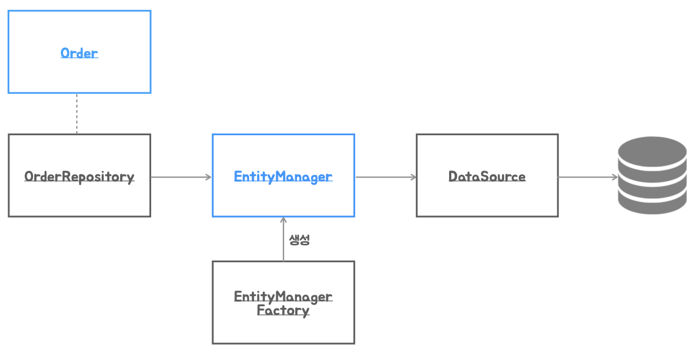

# 5. 예외

## 예외를 다루는 방법

---

### 예외

---

- 예외: 정상적인 흐름의 진행을 어렵게 만드는 이벤트 ([oracle 도큐먼트](https://docs.oracle.com/javase/tutorial/essential/exceptions/index.html))
- 예외적인 상황에서만 사용
- 많은 경우 예외는 프로그램 오류, 버그 때문에 발생

### 예외가 발생하면

---

- 예외 상황을 복구해서 정상적인 흐름으로 전환할 수 있는가?
    1. 재시도
    2. 대안
- 버그인가?
    1. 예외가 발생한 코드의 버그인가?
    2. 클라이언트의 버그인가?
- 제어할 수 없는 예외상황인가?

### 예외를 잘못 다루는 코드

---

- 예외를 무시하는 코드
    
    ```java
    try {
       ...
    } 
    catch (SQLException e) {
    }
    ```
    
    ```java
    catch (SQLException e) {
       e.printStackTrace();
    }
    ```
    
    - 로그 찍고서 다시 던져야 한다.
- 무의미하고 무책임한 `throws`
    
    ```java
    public void method1() throws Exception {
       method2();
       ...
    }
    
    public void method2() throws Exception {
       method3();
       ...
    }
    
    public void method3() throws Exception {
       ...
    }
    ```
    
    - 예외를 정상적으로 다룰 기회조차 뺏어버리는 코드가 된다.

### 예외의 종류

---

- `Error`
    - 시스템에 비정상적인 상황이 발생했을 때 사용되고 주로 JVM에서 발생시킨다
    - 일반적으로 애플리케이션에서 복구를 기대할 수 없는 종류의 예외의 슈퍼 클래스이다
    - `OutOfMemoryError`
    - ThreadDeath
- `Exception`과 체크 예외
    - `Exception`은 애플리케이션에서 복구를 기대할 수도 있는 모든 예외의 슈퍼 클래스이다
    - 현재 언체크 예외/런타임 예외가 아닌 애플리케이션에서 발생되는 예외는 체크 예외로 분류된다
    - 체크 예외는 `catch`로 잡아내든가, 메소드에서 `throws`를 정의해서 메소드 밖으로 던져야 한다.(강요)
    - 초기 라이브러리의 잘못된 예외 설계/사용
    - 복구할 수 없다면 `RuntimeException`이나 적절한 추상화 레벨의 예외로 전환해서 던질 것
- `RuntimeException`과 언체크 예외 ← 스프링에선 이걸로 사용해야 한다!
    - 명시적인 예외처리가 강제되지 않는다
    - `catch`/`throws`를 쓰지 않아도 문제 없이 컴파일된다

### 예외의 추상화와 전환

---

- 사용 기술에 따라 같은 문제에 대해 다른 종류의 예외 발생
- 적절한 예외 추상화와 예외 번역이 필요

## JPA를 이용한 Order 저장

---

- 자바에서 RDB를 사용하는 모든 기술(JDBC, JPA, MyBatis, ...)은 DB와의 연결 정보를 관리하는 `DataSource`를 사용한다.([문서](https://docs.oracle.com/javase/tutorial/jdbc/basics/sqldatasources.html))
    - `EmbeddedDatabaseBuilder`: 애플리케이션에 내장형 DB(H2, HSQL, Derby)를 빠르게 셋업하고 `DataSource`를 생성하는데 사용하는 빌더이다.([문서](https://docs.oracle.com/javase/tutorial/jdbc/basics/sqldatasources.html))
    - `LocalContainerEntityManagerFactoryBean`: `EntityManagerFactory`를 XML 없이 스프링의 빈 설정용 팩토리 메소드에서 간단히 생성하는데 사용된다.([문서](https://docs.spring.io/spring-framework/reference/data-access/orm/jpa.html#orm-jpa-setup-background))



- JPA의 `EntityManager`는 `EntityManagerFactory`가 있어야 만들 수 있다.
    - `EntityManagerFactory`는 스프링 컨테이너에서 하나만 있으면 된다. → 빈으로 만들어질 예정이다.
    - `EntityManager`는 매 트랜잭션마다 새로운걸로 만들어져야 한다. (파란색으로 표시함)

### 실습

---

- build.gradle 에 추가: JPA, DB driver
    
    ```java
    ...
    implementation 'org.springframework.boot:spring-boot-starter-data-jpa'
    ...
    runtimeOnly 'com.h2database:h2'
    ...
    ```
    
- Order 엔티티 구성해서 의존성이 잘 추가되었는지 확인
    
    ```java
    package tobyspring.hellospring.order;
    
    import jakarta.persistence.Column;
    import jakarta.persistence.Entity;
    import jakarta.persistence.GeneratedValue;
    import jakarta.persistence.Id;
    import jakarta.persistence.Table;
    
    import java.math.BigDecimal;
    
    @Entity
    @Table(name = "orders")
    public class Order {
        @Id
        @GeneratedValue
        private Long id;
    
        @Column(unique = true)
        private String no;
    
        private BigDecimal total;
    
        public Order() {
        }
    
        public Order(String no, BigDecimal total) {
            this.no = no;
            this.total = total;
        }
    
        @Override
        public String toString() {
            return "Order{" +
                    "id=" + id +
                    ", no='" + no + '\'' +
                    ", total=" + total +
                    '}';
        }
    }
    ```
    
- 인프라스트럭쳐 빈 등록
    
    ```java
    package tobyspring.hellospring;
    
    import org.springframework.context.annotation.Bean;
    import org.springframework.context.annotation.Configuration;
    import org.springframework.jdbc.datasource.embedded.EmbeddedDatabaseBuilder;
    import org.springframework.jdbc.datasource.embedded.EmbeddedDatabaseType;
    import org.springframework.orm.jpa.LocalContainerEntityManagerFactoryBean;
    import org.springframework.orm.jpa.vendor.Database;
    import org.springframework.orm.jpa.vendor.HibernateJpaVendorAdapter;
    
    import javax.sql.DataSource;
    
    @Configuration
    public class DataConfig {
        // data source
        @Bean
        public DataSource dataSource() {
            return new EmbeddedDatabaseBuilder().setType(EmbeddedDatabaseType.H2).build();
        }
    
        // entity manager factory
        public LocalContainerEntityManagerFactoryBean entityManagerFactory() {
            LocalContainerEntityManagerFactoryBean emf = new LocalContainerEntityManagerFactoryBean();
            emf.setDataSource(dataSource());
            emf.setPackagesToScan("tobyspring.hellospring");
            emf.setJpaVendorAdapter(new HibernateJpaVendorAdapter() {{
                setDatabase(Database.H2);
                setGenerateDdl(true);
                setShowSql(true);
            }});
    
            return emf;
        }
    }
    ```
    
- JPA 결과 확인하기
    
    ```java
    package tobyspring.hellospring;
    
    import jakarta.persistence.EntityManager;
    import jakarta.persistence.EntityManagerFactory;
    import org.springframework.beans.factory.BeanFactory;
    import org.springframework.context.annotation.AnnotationConfigApplicationContext;
    import tobyspring.hellospring.order.Order;
    
    import java.math.BigDecimal;
    
    public class DataClient {
        public static void main(String[] args) {
            BeanFactory beanFactory = new AnnotationConfigApplicationContext(DataConfig.class);
            EntityManagerFactory emf = beanFactory.getBean(EntityManagerFactory.class);
    
            // em
            EntityManager em = emf.createEntityManager();
            // transaction
            em.getTransaction().begin();
    
            Order order = new Order("100", BigDecimal.TEN);
            em.persist(order);
    
            System.out.println(order);
    
            // em.persist
            em.getTransaction().commit();
            em.close();
        }
    }
    ```
    
    - 결과
        
        ```powershell
        오후 11:04:44: Executing ':tobyspring.hellospring.DataClient.main()'...
        
        > Task :compileJava
        > Task :processResources NO-SOURCE
        > Task :classes
        
        > Task :tobyspring.hellospring.DataClient.main()
        23:04:46.016 [main] INFO org.springframework.jdbc.datasource.embedded.EmbeddedDatabaseFactory -- Starting embedded database: url='jdbc:h2:mem:testdb;DB_CLOSE_DELAY=-1;DB_CLOSE_ON_EXIT=false', username='sa'
        23:04:46.345 [main] INFO org.hibernate.jpa.internal.util.LogHelper -- HHH000204: Processing PersistenceUnitInfo [name: default]
        23:04:46.395 [main] INFO org.hibernate.Version -- HHH000412: Hibernate ORM core version 6.5.2.Final
        23:04:46.438 [main] INFO org.hibernate.cache.internal.RegionFactoryInitiator -- HHH000026: Second-level cache disabled
        23:04:46.841 [main] INFO org.springframework.orm.jpa.persistenceunit.SpringPersistenceUnitInfo -- No LoadTimeWeaver setup: ignoring JPA class transformer
        23:04:46.888 [main] WARN org.hibernate.orm.deprecation -- HHH90000025: H2Dialect does not need to be specified explicitly using 'hibernate.dialect' (remove the property setting and it will be selected by default)
        23:04:47.982 [main] INFO org.hibernate.engine.transaction.jta.platform.internal.JtaPlatformInitiator -- HHH000489: No JTA platform available (set 'hibernate.transaction.jta.platform' to enable JTA platform integration)
        Hibernate: create table orders (id bigint not null, no varchar(255), total numeric(38,2), primary key (id))
        Hibernate: alter table if exists orders drop constraint if exists UK43egxxciqr9ncgmxbdx2avi8n
        Hibernate: alter table if exists orders add constraint UK43egxxciqr9ncgmxbdx2avi8n unique (no)
        Hibernate: create sequence orders_SEQ start with 1 increment by 50
        23:04:48.025 [main] INFO org.springframework.orm.jpa.LocalContainerEntityManagerFactoryBean -- Initialized JPA EntityManagerFactory for persistence unit 'default'
        Hibernate: select next value for orders_SEQ
        Order{id=1, no='100', total=10}
        Hibernate: insert into orders (no,total,id) values (?,?,?)
        
        BUILD SUCCESSFUL in 3s
        2 actionable tasks: 2 executed
        오후 11:04:48: Execution finished ':tobyspring.hellospring.DataClient.main()'.
        ```
        
    - `persist` 할 때 id 값이 부여된다.
    - `insert into orders (no,total,id) values (?,?,?)` 쿼리는 `commit` 할 때 날아간다.
        - `TransactionImpl`.`commit` → `JdbcResourceLocalTransactionCoordinatorImpl`.`beforeCompletionCallback` → `JdbcCoordinatorImpl`.`beforeTransactionCompletion` → `SessionImpl`.`flushBeforeTransactionCompletion` 에서 수행한다.

- 스프링 부트의 자동 구성을 사용하면 yml 파일에 `DataSource` 설정을 조금 넣은적은 있겠지만,
    - 수동으로 빈으로 등록하지 않아도 `DataSource`, `EntityManagerFactory`를 인프라스트럭쳐 빈으로 등록해준다.
    
    → 이렇게 해야 JPA 기반기술이 제대로 구성된 것이다.
    

### `EntityManager`와 트랜잭션

---

- 코드에 의해서 엔티티 매니저를 생성하고 트랜잭션을 가져와 JPA의 기능을 사용하는 기본 코드는 다음과 같은 구조를 가진다.([문서](https://docs.jboss.org/hibernate/stable/entitymanager/reference/en/html/transactions.html#transactions-demarcation))
    
    ```java
    // Non-managed environment idiom
    EntityManager em = emf.createEntityManager();
    EntityTransaction tx = null;
    try {
        tx = em.getTransaction();
        tx.begin();
        // do some work
    ...
        tx.commit();
    }
    catch (RuntimeException e) {
        if ( tx != null && tx.isActive() ) tx.rollback();
        throw e; // or display error message
    }
    finally {
        em.close();
    }
    ```
    

## Order 리포지토리와 예외

---

- JDBC를 수행중에 발생하는 예외는 `SQLException`으로 만들어져서 던져진다.([문서](https://docs.oracle.com/javase/tutorial/jdbc/basics/sqlexception.html))
    - `java.sql.SQLException`
        - JDBC를 기반으로 하는 모든 기술에서 발생하는 예외
        - DB의 에러코드에 의존하거나, 데이터 기술에 의존적인 예외처리 코드
- JPA를 이용하는 코드에서 예외가 발생하면 주로 JDBC의 `SQLException`을 랩핑해서 JPA의 표준 예외로 만들어서 던져진다.
    - `jakarta.persistence.PersistenceException`
    - 표준 JPA의 예외 안에 JPA의 구현 기술(Hibernate 등)의 예외가 다시 랩핑되어서 던져진다.

### 실습

---

- OrderRepository 추가
    
    ```java
    package tobyspring.hellospring.data;
    
    import jakarta.persistence.EntityManager;
    import jakarta.persistence.EntityManagerFactory;
    import jakarta.persistence.EntityTransaction;
    import tobyspring.hellospring.order.Order;
    
    public class OrderRepository {
        private final EntityManagerFactory emf;
    
        public OrderRepository(EntityManagerFactory emf) {
            this.emf = emf;
        }
    
        public void save(Order order) {
            EntityManager em = emf.createEntityManager();
            EntityTransaction transaction = em.getTransaction();
            transaction.begin();
    
            try {
                em.persist(order);
    
                transaction.commit();
            } catch (RuntimeException e) {
                if (transaction.isActive()) transaction.rollback();
                throw e;
            } finally {
                if (em.isOpen()) em.close();
            }
        }
    }
    ```
    
- DataConfig에 OrderRepository 빈 추가
    
    ```java
    package tobyspring.hellospring;
    
    import jakarta.persistence.EntityManagerFactory;
    import org.springframework.context.annotation.Bean;
    import org.springframework.context.annotation.Configuration;
    import org.springframework.jdbc.datasource.embedded.EmbeddedDatabaseBuilder;
    import org.springframework.jdbc.datasource.embedded.EmbeddedDatabaseType;
    import org.springframework.orm.jpa.LocalContainerEntityManagerFactoryBean;
    import org.springframework.orm.jpa.vendor.Database;
    import org.springframework.orm.jpa.vendor.HibernateJpaVendorAdapter;
    import tobyspring.hellospring.data.OrderRepository;
    
    import javax.sql.DataSource;
    
    @Configuration
    public class DataConfig {
        // data source
        @Bean
        public DataSource dataSource() {
            return new EmbeddedDatabaseBuilder().setType(EmbeddedDatabaseType.H2).build();
        }
    
        // entity manager factory
        @Bean
        public LocalContainerEntityManagerFactoryBean entityManagerFactory() {
            LocalContainerEntityManagerFactoryBean emf = new LocalContainerEntityManagerFactoryBean();
            emf.setDataSource(dataSource());
            emf.setPackagesToScan("tobyspring.hellospring");
            emf.setJpaVendorAdapter(new HibernateJpaVendorAdapter() {{
                setDatabase(Database.H2);
                setGenerateDdl(true);
                setShowSql(true);
            }});
    
            return emf;
        }
    
        @Bean
        public OrderRepository orderRepository(EntityManagerFactory emf) {
            return new OrderRepository(emf);
        }
    }
    ```
    
- `jakarta.persistence.RollbackException` 발생
    - `org.hibernate.exception.ConstraintViolationException`
    - `org.h2.jdbc.JdbcSQLIntegrityConstraintViolationException`
    
    ```java
    package tobyspring.hellospring;
    
    import org.springframework.beans.factory.BeanFactory;
    import org.springframework.context.annotation.AnnotationConfigApplicationContext;
    import tobyspring.hellospring.data.OrderRepository;
    import tobyspring.hellospring.order.Order;
    
    import java.math.BigDecimal;
    
    public class DataClient {
        public static void main(String[] args) {
            BeanFactory beanFactory = new AnnotationConfigApplicationContext(DataConfig.class);
            OrderRepository repository = beanFactory.getBean(OrderRepository.class);
    
            Order order = new Order("100", BigDecimal.TEN);
            repository.save(order);
    
            System.out.println(order);
    
            Order order2 = new Order("100", BigDecimal.ONE);
            repository.save(order2);
    
        }
    }
    ```
    

## `DataAccessException`과 예외 추상화

---

- 스프링의 데이터 예외 추상화가 적용되면 JDBC의 `SQLException`, JPA의 `PersistenceException` 등이 스프링이 정의한 예외 계층구조의 예외로 변역되고, 실제 발생한 예외는 랩핑된 형태로 전달된다.
- `DataAccessException`([문서](https://docs.spring.io/spring-framework/reference/data-access/dao.html#dao-exceptions))
    - DB의 에러코드와 데이터 액세스 기술에 독립적인 예외 구조
    - 적절한 예외 번역(exception translation) 도구를 제공
    
    
    

### 스프링이 제공하는 DB 에러코드의 매핑 정보

---

```xml
<bean id="Oracle" class="org.springframework.jdbc.support.SQLErrorCodes">
   <property name="badSqlGrammarCodes"> <!-- 예외 클래스 종류 -->
      <value>900,903,904,917,936,942,17006</value> <!-- 매핑되는 DB 에러 코드가 세분화된 경우에는 여러 개가 들어가기도 한다 -->
   </property>
   <property name="invalidResultSetAccessCodes">
      <value>17003</value>
   </property>
   <property name="duplicateKeyCodes">
      <value>1</value>
   </property>
   <property name="dataIntegrityViolationCodes">
      <value>1400,1722,2291,2292</value>
   </property>
   <property name="dataAccessResourceFailureCodes">
      <value>17002,17447</value>
   </property>
   ...
</bean>
```

### 실습

---

- OrderRepository 에 `EntityManagerFactory` 빈 주입 안하도록 변경
    
    ```java
    package tobyspring.hellospring.data;
    
    import jakarta.persistence.EntityManager;
    import jakarta.persistence.PersistenceContext;
    import tobyspring.hellospring.order.Order;
    
    public class OrderRepository {
        @PersistenceContext
        private EntityManager entityManager;
    
        public void save(Order order) {
            entityManager.persist(order);
        }
    }
    ```
    
- OrderRepository 자체적으로 entityManager 주입받도록 함으로써 `EntityManagerFactory` 빈 주입부 제거, 그에 따른 `BeanPostProcessor`, `JpaTransactionManager` 빈 추가
    - `BeanPostProcessor`: JPA 애노테이션(`@PersistenceContext`, `@PersistenceUnit` 등)을 처리하는 역할을 한다.
        - `@PersistenceContext`: JPA에서 `EntityManager`를 주입할 때 사용되는 애노테이션
    - `JpaTransactionManager`: JPA를 사용하는 Spring 애플리케이션에서 트랜잭션 관리를 제공. `EntityManagerFactory`를 통해 JPA 트랜잭션을 관리한다.
        - 트랜잭션의 시작, 커밋, 롤백과 같은 작업을 자동으로 처리해준다.
        - ex> `@Transactional` 애노테이션이 붙은 메서드에서 트랜잭션이 필요할 때, 이를 처리한다.
    
    ```java
    package tobyspring.hellospring;
    
    import jakarta.persistence.EntityManagerFactory;
    import org.springframework.beans.factory.config.BeanPostProcessor;
    import org.springframework.context.annotation.Bean;
    import org.springframework.context.annotation.Configuration;
    import org.springframework.jdbc.datasource.embedded.EmbeddedDatabaseBuilder;
    import org.springframework.jdbc.datasource.embedded.EmbeddedDatabaseType;
    import org.springframework.orm.jpa.JpaTransactionManager;
    import org.springframework.orm.jpa.LocalContainerEntityManagerFactoryBean;
    import org.springframework.orm.jpa.support.PersistenceAnnotationBeanPostProcessor;
    import org.springframework.orm.jpa.vendor.Database;
    import org.springframework.orm.jpa.vendor.HibernateJpaVendorAdapter;
    import tobyspring.hellospring.data.OrderRepository;
    
    import javax.sql.DataSource;
    
    @Configuration
    public class DataConfig {
        // data source
        @Bean
        public DataSource dataSource() {
            return new EmbeddedDatabaseBuilder().setType(EmbeddedDatabaseType.H2).build();
        }
    
        // entity manager factory
        @Bean
        public LocalContainerEntityManagerFactoryBean entityManagerFactory() {
            LocalContainerEntityManagerFactoryBean emf = new LocalContainerEntityManagerFactoryBean();
            emf.setDataSource(dataSource());
            emf.setPackagesToScan("tobyspring.hellospring");
            emf.setJpaVendorAdapter(new HibernateJpaVendorAdapter() {{
                setDatabase(Database.H2);
                setGenerateDdl(true);
                setShowSql(true);
            }});
    
            return emf;
        }
    
        @Bean
        public BeanPostProcessor persistenceAnnotationBeanPostProcessor() {
            return new PersistenceAnnotationBeanPostProcessor();
        }
    
        @Bean
        public JpaTransactionManager transactionManager(EntityManagerFactory emf) {
            return new JpaTransactionManager(emf);
        }
    
        @Bean
        public OrderRepository orderRepository() {
            return new OrderRepository();
        }
    }
    ```
    
- `JpaTransactionManager`를 사용해서 트랜잭션을 관리하게 되면, Spring `DataAccessException`으로 추상화된다.
    
    ```java
    package tobyspring.hellospring;
    
    import jakarta.persistence.PersistenceException;
    import org.hibernate.exception.ConstraintViolationException;
    import org.springframework.beans.factory.BeanFactory;
    import org.springframework.context.annotation.AnnotationConfigApplicationContext;
    import org.springframework.dao.DataAccessException;
    import org.springframework.dao.DataIntegrityViolationException;
    import org.springframework.orm.jpa.JpaTransactionManager;
    import org.springframework.transaction.support.TransactionCallback;
    import org.springframework.transaction.support.TransactionTemplate;
    import tobyspring.hellospring.data.OrderRepository;
    import tobyspring.hellospring.order.Order;
    
    import java.math.BigDecimal;
    
    public class DataClient {
        public static void main(String[] args) {
            BeanFactory beanFactory = new AnnotationConfigApplicationContext(DataConfig.class);
            OrderRepository repository = beanFactory.getBean(OrderRepository.class);
            JpaTransactionManager transactionManager = beanFactory.getBean(JpaTransactionManager.class);
    
            try {
                new TransactionTemplate(transactionManager).execute((TransactionCallback<Order>) status -> {
                    // transaction begin
                    Order order = new Order("100", BigDecimal.TEN);
                    repository.save(order);
    
                    System.out.println(order);
    
                    Order order2 = new Order("100", BigDecimal.ONE);
                    repository.save(order2);
                    // commit
    
                    return null;
                });
            } catch (DataAccessException e) {
                // PersistenceException: JPA Exception
                // DataIntegrityViolationException: Spring Exception
                // ConstraintViolationException: Hibernate Exception
                if (e instanceof DataIntegrityViolationException || e.getCause() instanceof ConstraintViolationException) {
                    System.out.println("주문번호 충돌을 복구하는 작업");
                } else {
                    System.out.println("DataAccessException - not ConstraintViolationException !!");
                }
            }
    
    //        try {
    //            Order order2 = new Order("100", BigDecimal.ONE);
    //            repository.save(order2);
    //        } catch (PersistenceException e) {
    //            if (e.getCause() instanceof ConstraintViolationException) {
    //                System.out.println("주문번호 충돌을 복구하는 작업");
    //            } else {
    //                System.out.println("PersistenceException - not ConstraintViolationException !!");
    //            }
    //        }
        }
    }
    ```
    

❗체계적인 예외 구조를 만들고 적절한 예외 처리 방법을 사용하고 있는지 살펴봅시다
