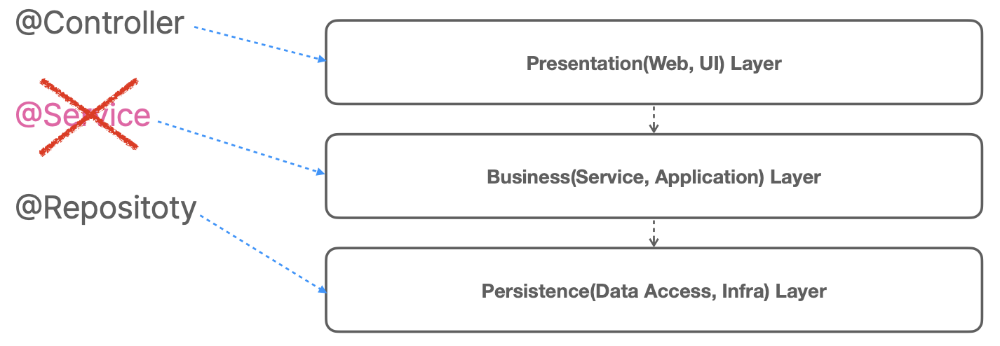

# 6. 서비스 추상화

## 서비스란 무엇인가?

---

- 스프링에 대한 오해
    
    😭 스프링은 `@Controller`, `@Service`, `@Repository`만 기계적으로 찍어내는 개발 방법이다.
    
- 스프링 애플리케이션의 빈이 존재하는 계층 구조
    - 3개의 전형적인(stereotype) 애노테이션을 사용하는 애플리케이션 빈
        
        
        

- 서비스는 일반적인 용어라서 쓰이는 곳에 따라 다른 의미를 가진다.
- 서비스: 클라이언트에게 서비스를 제공해주는 오브젝트나 모듈
    - 일반적으로 상태를 가지지 않음
        
        
        
    - 종류
        - 애플리케이션 서비스 (application service)
        - 도메인 서비스 (domain service)
        - 인프라 서비스 (infrastructure service)
            - 도메인/애플리케이션 로직에 참여하지 않는, 기술을 제공하는 서비스
            - 메일, 캐시, 트랜잭션, 메시징, …
            
            → 서비스 추상화 대상!!
            
    

- 자바 서버 기술(J2EE/JavaEE)은 여러 계층으로 구분해서 개발하는 레이어 아키텍처를 이용한다.
    - [Design Patterns - Oracle](https://docs.oracle.com/cd/E19644-01/817-5448/dgdesign.html)
    - [Organize Your Application Code in Three-Tier Architecture - OpenClassrooms](https://openclassrooms.com/en/courses/5684146-create-web-applications-efficiently-with-the-spring-boot-mvc-framework/6156961-organize-your-application-code-in-three-tier-architecture)
- 보통 애플리케이션의 비즈니스 로직/도메인 로직의 코드가 위치하는 계층을 서비스 계층이라고 부른다. 그 외에도 다양한 이름으로 불린다.
    - [Service Layer - Martin Fowler](https://martinfowler.com/eaaCatalog/serviceLayer.html)

## 애플리케이션 서비스 도입

---

### 애플리케이션 서비스

---

- `@Service` 빈으로 구성
- Application/Service 계층에 존재
    
    
    
- 애플리케이션/도메인 로직 도메인 오브젝트/엔티티 활용
- 인프라 서비스의 도움이 필요
- 가장 중요한 도메인/애플리케이션/비즈니스 로직
- 인프라 레이어에 존재하는 기술에 가능한 의존하지 않도록 만들어야 함
- PaymentService - ExRateService에 적용된 DIP

### 실습

---

- 목표
    
    
    

- OrderConfig 성격에 맞게 옮겨서 만들어준다.
    
    ```java
    package tobyspring.hellospring;
    
    import org.springframework.context.annotation.Bean;
    import org.springframework.context.annotation.Configuration;
    import org.springframework.context.annotation.Import;
    import org.springframework.orm.jpa.JpaTransactionManager;
    import tobyspring.hellospring.data.OrderRepository;
    import tobyspring.hellospring.order.OrderService;
    
    @Configuration
    @Import(DataConfig.class)
    public class OrderConfig {
        @Bean
        public OrderRepository orderRepository() {
            return new OrderRepository();
        }
    
        @Bean
        public OrderService orderService(JpaTransactionManager transactionManager) {
            return new OrderService(orderRepository(), transactionManager);
        }
    }
    ```
    
- `JpaTransactionManager`를 주입받아 트랜잭션을 구현하는 Order 서비스 만든다.
    
    ```java
    package tobyspring.hellospring.order;
    
    import org.springframework.orm.jpa.JpaTransactionManager;
    import org.springframework.stereotype.Service;
    import org.springframework.transaction.annotation.Transactional;
    import org.springframework.transaction.support.TransactionTemplate;
    import tobyspring.hellospring.data.OrderRepository;
    
    import java.math.BigDecimal;
    
    @Service
    public class OrderService {
        private final OrderRepository orderRepository;
        private final JpaTransactionManager transactionManager;
    
        public OrderService(OrderRepository orderRepository, JpaTransactionManager transactionManager) {
            this.orderRepository = orderRepository;
            this.transactionManager = transactionManager;
        }
    
        public Order createOrder(String no, BigDecimal total) {
            Order order = new Order(no, total);
    
            return new TransactionTemplate(transactionManager).execute(status -> {
                this.orderRepository.save(order);
                return order;
            });
        }
    }
    ```
    
- Order 서비스를 통해 저장되는것 체크한다.
    
    ```java
    package tobyspring.hellospring;
    
    import org.hibernate.exception.ConstraintViolationException;
    import org.springframework.beans.factory.BeanFactory;
    import org.springframework.context.annotation.AnnotationConfigApplicationContext;
    import org.springframework.dao.DataAccessException;
    import org.springframework.dao.DataIntegrityViolationException;
    import org.springframework.orm.jpa.JpaTransactionManager;
    import org.springframework.transaction.support.TransactionCallback;
    import org.springframework.transaction.support.TransactionTemplate;
    import tobyspring.hellospring.data.OrderRepository;
    import tobyspring.hellospring.order.Order;
    import tobyspring.hellospring.order.OrderService;
    
    import java.math.BigDecimal;
    
    public class OrderClient {
        public static void main(String[] args) {
            BeanFactory beanFactory = new AnnotationConfigApplicationContext(OrderConfig.class);
            OrderService orderService = beanFactory.getBean(OrderService.class);
    
            Order order = orderService.createOrder("100", BigDecimal.TEN);
            System.out.println(order);
        }
    }
    ```
    

## 기술에 독립적인 애플리케이션 서비스

---

- OrderService
    - 데이터 액세스 기술의 하나인 JPA에 의존
    - JPA를 사용하는 `Repository` 클래스에 의존
    - JPA Transaction Manager에 의존

- Order
    - `@Entity`가 붙은 JPA 엔티티로 작성
    - 컴파일 시점에만 JPA 라이브러리에 의존
    - 클래스 코드에는 JPA 기술과 관련된 내용이 들어가지 않음
    - JPA를 사용하지 않으면 런타임에는 JPA 라이브러리에 의존하지 않음

- Order에서 JPA 메타데이터 분리
    - 애노테이션(`@Entity`)은 컴파일타임 라이브러리 의존성만 가진다
    - 엔티티의 동작에는 영향을 주지 않기 때문에 엔티티 클래스를 다른 데이터 기술에서 사용해도 된다
    - 그래도 제거하고 싶다면 외부 XML 디스크립터를 사용할 수 있다
        - JPA 애노테이션 다 삭제 후 실행하면 `UnknownEntityTypeException` 발생
            
            ```java
            package tobyspring.hellospring.order;
            
            import java.math.BigDecimal;
            
            public class Order {
                private Long id;
            
                private String no;
            
                private BigDecimal total;
            
                public Order() {
                }
            
                public Order(String no, BigDecimal total) {
                    this.no = no;
                    this.total = total;
                }
            
                @Override
                public String toString() {
                    return "Order{" +
                            "id=" + id +
                            ", no='" + no + '\'' +
                            ", total=" + total +
                            '}';
                }
            }
            ```
            
        - /META-INF/orm.xml
            
            ```xml
            <?xml version="1.0" encoding="UTF-8" ?>
            <entity-mappings
                    version="3.1"
                    xmlns="https://jakarta.ee/xml/ns/persistence/orm"
                    xmlns:xsi="http://www.w3.org/2001/XMLSchema-instance"
                    xsi:schemaLocation="https://jakarta.ee/xml/ns/persistence/orm https://jakarta.ee/xml/ns/persistence/orm_3_1.xsd">
                <entity class="tobyspring.hellospring.order.Order" name="Order" access="FIELD">
                    <table name="orders"/>
                    <attributes>
                        <id name="id">
                            <generated-value strategy="AUTO"/>
                        </id>
                        <basic name="no">
                            <column name="no" length="255"/>
                        </basic>
                        <basic name="total">
                            <column name="total" column-definition="number(38,2)"/>
                        </basic>
                    </attributes>
                </entity>
            </entity-mappings>
            ```
            

## OrderRepository DIP

---

- 특정 기술(JPA)에 의존하지 않는 애플리케이션 서비스 만들기
    - JPA Repository - OrderRepository에 의존하지 않도록 변경
    - 의존관계 역전(DIP)
        
        
        

### 실습

---

- OrderRepository 위치를 order 하위로 옮겨서 인터페이스로 변경한 후 구현 내용을 삭제한다. data 디렉토리엔 JpaOrderRepository를 둔다.
    
    ```java
    package tobyspring.hellospring.data;
    
    import jakarta.persistence.EntityManager;
    import jakarta.persistence.PersistenceContext;
    import tobyspring.hellospring.order.Order;
    import tobyspring.hellospring.order.OrderRepository;
    
    public class JpaOrderRepository implements OrderRepository {
        @PersistenceContext
        private EntityManager entityManager;
    
        @Override
        public void save(Order order) {
            entityManager.persist(order);
        }
    }
    
    public interface OrderRepository {
        void save(Order order);
    }
    ```
    
- OrderConfig에서 구현체로 JpaOrderRepository 리턴하도록 변경한다.
    
    ```java
    package tobyspring.hellospring;
    
    import org.springframework.context.annotation.Bean;
    import org.springframework.context.annotation.Configuration;
    import org.springframework.context.annotation.Import;
    import org.springframework.orm.jpa.JpaTransactionManager;
    import tobyspring.hellospring.data.JpaOrderRepository;
    import tobyspring.hellospring.order.OrderRepository;
    import tobyspring.hellospring.order.OrderService;
    
    @Configuration
    @Import(DataConfig.class)
    public class OrderConfig {
        @Bean
        public OrderRepository orderRepository() {
            return new JpaOrderRepository();
        }
    
        @Bean
        public OrderService orderService(JpaTransactionManager transactionManager) {
            return new OrderService(orderRepository(), transactionManager);
        }
    
    }
    ```
    
- 테스트 코드를 작성한다.
    
    ```java
    package tobyspring.hellospring.order;
    
    import org.assertj.core.api.Assertions;
    import org.junit.jupiter.api.Test;
    import org.junit.jupiter.api.extension.ExtendWith;
    import org.springframework.beans.factory.annotation.Autowired;
    import org.springframework.test.context.ContextConfiguration;
    import org.springframework.test.context.junit.jupiter.SpringExtension;
    import tobyspring.hellospring.OrderConfig;
    
    import java.math.BigDecimal;
    
    @ExtendWith(SpringExtension.class)
    @ContextConfiguration(classes = OrderConfig.class)
    public class OrderServiceSpringTest {
        @Autowired
        OrderService orderService;
    
        @Test
        void createOrder() {
            var order = orderService.createOrder("0100", BigDecimal.ONE);
    
            Assertions.assertThat(order.getId()).isGreaterThan(0);
        }
    
    }
    ```
    

## 트랜잭션 서비스 추상화

---

- 스프링의 트랜잭션 관리 기술의 핵심은 트랜잭션 추상화이다.
    - [Transaction Strategies - Spring](https://docs.spring.io/spring-framework/reference/data-access/transaction/strategies.html#page-title)
- 데이터 액세스 기술에 상관없이 공통적으로 적용되는 트랜잭션 인터페이스인 `PlatformTransactionManager`이 제공된다.

- OrderService
    - ~~JPA를 사용하는 Repository 클래스에 의존~~ 완료
    - JPA Transaction Manager에 의존

- Transaction은 데이터 기술에 따라 방법이 다르다
    - JDBC
        
        ```java
        Connection con = ...
        con.setAutoCommit(false);
        ...
        con.commit();
        ```
        
    - JPA
        
        ```java
        EntityTransaction txn = entityManager.getTransaction();
        txn.begin();
        ...
        txn.commit();
        ```
        
    - MyBatis
    - Jooq

- 추상화
    - 구현의 복잡함과 디테일을 감추고 중요한 것만 남기는 기법
    - 여러 인프라 서비스 기술의 공통적이고 핵심적인 기능을 인터페이스로 정의하고 이를 구현하는 어댑터를 만들어 일관된 사용이 가능하게 만드는 것이 서비스 추상화
- 트랜잭션을 관리하는 오브젝트의 추상화
    
    
    

- `PlatformTransactionManager`
    
    ```java
    public interface PlatformTransactionManager extends TransactionManager {
      TransactionStatus getTransaction(@Nullable TransactionDefinition definition) throws TransactionException;
    
      void commit(TransactionStatus status) throws TransactionException;
      void rollback(TransactionStatus status) throws TransactionException;
    }
    ```
    

### 실습

---

- `JpaTransactionManager` → `PlatformTransactionManager` 로 교체한다.
    
    ```java
    package tobyspring.hellospring;
    
    import jakarta.persistence.EntityManagerFactory;
    import org.springframework.beans.factory.config.BeanPostProcessor;
    import org.springframework.context.annotation.Bean;
    import org.springframework.context.annotation.Configuration;
    import org.springframework.jdbc.datasource.embedded.EmbeddedDatabaseBuilder;
    import org.springframework.jdbc.datasource.embedded.EmbeddedDatabaseType;
    import org.springframework.orm.jpa.JpaTransactionManager;
    import org.springframework.orm.jpa.LocalContainerEntityManagerFactoryBean;
    import org.springframework.orm.jpa.support.PersistenceAnnotationBeanPostProcessor;
    import org.springframework.orm.jpa.vendor.Database;
    import org.springframework.orm.jpa.vendor.HibernateJpaVendorAdapter;
    import org.springframework.transaction.PlatformTransactionManager;
    
    import javax.sql.DataSource;
    
    @Configuration
    public class DataConfig {
        // data source
        @Bean
        public DataSource dataSource() {
            return new EmbeddedDatabaseBuilder().setType(EmbeddedDatabaseType.H2).build();
        }
    
        // entity manager factory
        @Bean
        public LocalContainerEntityManagerFactoryBean entityManagerFactory() {
            LocalContainerEntityManagerFactoryBean emf = new LocalContainerEntityManagerFactoryBean();
            emf.setDataSource(dataSource());
            emf.setPackagesToScan("tobyspring.hellospring");
            emf.setJpaVendorAdapter(new HibernateJpaVendorAdapter() {{
                setDatabase(Database.H2);
                setGenerateDdl(true);
                setShowSql(true);
            }});
    
            return emf;
        }
    
        @Bean
        public BeanPostProcessor persistenceAnnotationBeanPostProcessor() {
            return new PersistenceAnnotationBeanPostProcessor();
        }
    
        @Bean
        public PlatformTransactionManager transactionManager(EntityManagerFactory emf) {
            return new JpaTransactionManager(emf);
        }
    }
    ```
    
    ```java
    package tobyspring.hellospring.order;
    
    import org.springframework.orm.jpa.JpaTransactionManager;
    import org.springframework.stereotype.Service;
    import org.springframework.transaction.PlatformTransactionManager;
    import org.springframework.transaction.support.TransactionTemplate;
    
    import java.math.BigDecimal;
    
    @Service
    public class OrderService {
        private final OrderRepository orderRepository;
        private final PlatformTransactionManager transactionManager;
    
        public OrderService(OrderRepository orderRepository, PlatformTransactionManager transactionManager) {
            this.orderRepository = orderRepository;
            this.transactionManager = transactionManager;
        }
    
        public Order createOrder(String no, BigDecimal total) {
            Order order = new Order(no, total);
    
            return new TransactionTemplate(transactionManager).execute(status -> {
                this.orderRepository.save(order);
                return order;
            });
        }
    }
    ```
    

## JDBC 데이터 액세스 기술

---

- `JdbcClient`를 이용하면 SQL을 사용하는 간단한 코드로 안전하고, 트랜잭션 추상화가 적용된 DB 액세스 코드를 작성할 수 있다.
    - [JDBC Support - Spring](https://docs.spring.io/spring-framework/reference/data-access/jdbc/core.html#jdbc-JdbcClient)
- JDBC를 직접 사용하는 코드를 이용할 때는 `JdbcTransactionManager`를 트랜잭션 매니저 오브젝트로 등록해서 사용한다.

- `JdbcClient`
    - Spring 6.1에서 추가
    - SQL을 사용하는 JDBC 데이터 처리 코드를 유연하게 작성하도록 도와줌
    - 일종의 템플릿/콜백
    - 스프링의 `JdbcTemplate`의 대체 기술

- `DataSourceTransactionManager`
    - JDBC의 `Connection`을 이용하는 트랜잭션 매니저
    - `Connection`을 리턴하는 `DataSource` 오브젝트 필요

- JDBC 데이터 액세스용 구성 정보
    - `DataSource`
    - `DataSourceTransactionManager`

### 실습

---

- `PlatformTransactionManager` 구현체를 `DataSourceTransactionManager`로 변경한다.
    
    ```java
    package tobyspring.hellospring;
    
    import jakarta.persistence.EntityManagerFactory;
    import org.springframework.beans.factory.config.BeanPostProcessor;
    import org.springframework.context.annotation.Bean;
    import org.springframework.context.annotation.Configuration;
    import org.springframework.jdbc.datasource.DataSourceTransactionManager;
    import org.springframework.jdbc.datasource.embedded.EmbeddedDatabaseBuilder;
    import org.springframework.jdbc.datasource.embedded.EmbeddedDatabaseType;
    import org.springframework.orm.jpa.JpaTransactionManager;
    import org.springframework.orm.jpa.LocalContainerEntityManagerFactoryBean;
    import org.springframework.orm.jpa.support.PersistenceAnnotationBeanPostProcessor;
    import org.springframework.orm.jpa.vendor.Database;
    import org.springframework.orm.jpa.vendor.HibernateJpaVendorAdapter;
    import org.springframework.transaction.PlatformTransactionManager;
    
    import javax.sql.DataSource;
    
    @Configuration
    public class DataConfig {
        // data source
        @Bean
        public DataSource dataSource() {
            return new EmbeddedDatabaseBuilder().setType(EmbeddedDatabaseType.H2).build();
        }
    
        // entity manager factory
    //    @Bean
    //    public LocalContainerEntityManagerFactoryBean entityManagerFactory() {
    //        LocalContainerEntityManagerFactoryBean emf = new LocalContainerEntityManagerFactoryBean();
    //        emf.setDataSource(dataSource());
    //        emf.setPackagesToScan("tobyspring.hellospring");
    //        emf.setJpaVendorAdapter(new HibernateJpaVendorAdapter() {{
    //            setDatabase(Database.H2);
    //            setGenerateDdl(true);
    //            setShowSql(true);
    //        }});
    //
    //        return emf;
    //    }
    //
    //    @Bean
    //    public BeanPostProcessor persistenceAnnotationBeanPostProcessor() {
    //        return new PersistenceAnnotationBeanPostProcessor();
    //    }
    
        @Bean
        public PlatformTransactionManager transactionManager() {
            return new DataSourceTransactionManager(dataSource());
        }
    }
    ```
    
- OrderRepository 구현체를 JdbcOrderRepository로 교체한다.
    
    ```java
    package tobyspring.hellospring;
    
    import org.springframework.context.annotation.Bean;
    import org.springframework.context.annotation.Configuration;
    import org.springframework.context.annotation.Import;
    import org.springframework.transaction.PlatformTransactionManager;
    import tobyspring.hellospring.data.JdbcOrderRepository;
    import tobyspring.hellospring.order.OrderRepository;
    import tobyspring.hellospring.order.OrderService;
    
    import javax.sql.DataSource;
    
    @Configuration
    @Import(DataConfig.class)
    public class OrderConfig {
        @Bean
        public OrderRepository orderRepository(DataSource dataSource) {
            return new JdbcOrderRepository(dataSource);
        }
    
        @Bean
        public OrderService orderService(
                PlatformTransactionManager transactionManager,
                OrderRepository orderRepository
        ) {
            return new OrderService(orderRepository, transactionManager);
        }
    }
    ```
    
- JdbcOrderRepository 추가한다.
    
    ```java
    package tobyspring.hellospring.data;
    
    import jakarta.annotation.PostConstruct;
    import org.springframework.jdbc.core.simple.JdbcClient;
    import tobyspring.hellospring.order.Order;
    import tobyspring.hellospring.order.OrderRepository;
    
    import javax.sql.DataSource;
    
    public class JdbcOrderRepository implements OrderRepository {
        private final JdbcClient jdbcClient;
    
        public JdbcOrderRepository(DataSource datasource) {
            this.jdbcClient = JdbcClient.create(datasource);
        }
    
        @PostConstruct
        void initDb() {
            jdbcClient.sql("""
                        create table orders (id bigint not null, no varchar(255), total numeric(38,2), primary key (id));
                        alter table if exists orders drop constraint if exists UK43egxxciqr9ncgmxbdx2avi8n;
                        alter table if exists orders add constraint UK43egxxciqr9ncgmxbdx2avi8n unique (no);
                        create sequence orders_SEQ start with 1 increment by 50;
                    """).update();
        }
    
        @Override
        public void save(Order order) {
            Long id = jdbcClient.sql("select next value for orders_SEQ").query(Long.class).single();
            order.setId(id);
    
            jdbcClient.sql("insert into orders (no, total, id) values (?,?,?)")
                    .params(order.getNo(), order.getTotal(), order.getId())
                    .update();
        }
    }
    ```
    

## 트랜잭션 테스트

---

- OrderService에서 기술 관련 코드 제거
    - 데이터 기술이 변경되어도 기존 코드는 영향을 받지 않음
    - TransactionTemplate, PlatformTransactionManager와 같은 기술과 연관된 코드가 계속 등장함
    - 트랜잭션의 시작과 종료는 보통 애플리케이션 서비스 메소드 실행 전후
        
        ```java
        public Order createOrder(String no, BigDecimal total) {
          return new TransactionTemplate(transactionManager).execute(status -> {
            Order order = new Order(no, total);
            orderRepository.save(order);
            return order;
          });
        }
        ```
        

- 트랜잭션 테스트
    - 트랜잭션이 필요한 곳에 정확하게 적용되었는지 테스트 하기는 매우 어려움
    - JDBC 처럼 자동 커밋이 되거나 Spring Data JPA처럼 기본 리포지토리 구현에서 트랜잭션을 알아서 적용해주는 기술을 사용할 때 트랜잭션이 바르게 적용되지 않은 것을 놓치기 쉬움
    - 모든 작업이 성공하면 하나의 트랜잭션으로 진행된 것인지 여러개의 트랜잭션으로 쪼개진 것인지 확인하기 어려움
    - 트랜잭션 중간에 실패하는 케이스를 만들 수 있다면 롤백 여부로 확인할 수 있음

### 실습

---

- createOrders 추가
    
    ```java
    package tobyspring.hellospring.order;
    
    import org.springframework.stereotype.Service;
    import org.springframework.transaction.PlatformTransactionManager;
    import org.springframework.transaction.support.TransactionTemplate;
    
    import java.math.BigDecimal;
    import java.util.List;
    
    @Service
    public class OrderService {
        private final OrderRepository orderRepository;
        private final PlatformTransactionManager transactionManager;
    
        public OrderService(OrderRepository orderRepository, PlatformTransactionManager transactionManager) {
            this.orderRepository = orderRepository;
            this.transactionManager = transactionManager;
        }
    
        public Order createOrder(String no, BigDecimal total) {
            Order order = new Order(no, total);
    
            return new TransactionTemplate(transactionManager).execute(status -> {
                this.orderRepository.save(order);
                return order;
            });
        }
    
        public List<Order> createOrders(List<OrderReq> reqs) {
            return new TransactionTemplate(transactionManager).execute(status -> {
                return reqs.stream().map(req -> createOrder(req.no(), req.total())).toList();
            });
        }
    }
    ```
    
    ```java
    package tobyspring.hellospring.order;
    
    import java.math.BigDecimal;
    
    public record OrderReq(String no, BigDecimal total) {
    }
    ```
    
- 테스트코드 추가
    
    ```java
    package tobyspring.hellospring.order;
    
    import org.junit.jupiter.api.Test;
    import org.junit.jupiter.api.extension.ExtendWith;
    import org.springframework.beans.factory.annotation.Autowired;
    import org.springframework.dao.DataIntegrityViolationException;
    import org.springframework.jdbc.core.simple.JdbcClient;
    import org.springframework.test.context.ContextConfiguration;
    import org.springframework.test.context.junit.jupiter.SpringExtension;
    import tobyspring.hellospring.OrderConfig;
    
    import javax.sql.DataSource;
    import java.math.BigDecimal;
    import java.util.List;
    
    import static org.assertj.core.api.Assertions.assertThat;
    import static org.assertj.core.api.Assertions.assertThatThrownBy;
    
    @ExtendWith(SpringExtension.class)
    @ContextConfiguration(classes = OrderConfig.class)
    public class OrderServiceSpringTest {
        @Autowired
        OrderService orderService;
    
        @Autowired
        DataSource dataSource;
    
        @Test
        void createOrder() {
            var order = orderService.createOrder("0100", BigDecimal.ONE);
    
            assertThat(order.getId()).isGreaterThan(0);
        }
    
        @Test
        void createOrders() {
            List<OrderReq> orderReqs = List.of(
                    new OrderReq("0200", BigDecimal.ONE),
                    new OrderReq("0201", BigDecimal.TWO)
            );
    
            var orders = orderService.createOrders(orderReqs);
    
            assertThat(orders).hasSize(2);
            orders.forEach(order -> assertThat(order.getId()).isGreaterThan(0));
        }
    
        @Test
        void createDuplicatedOrders() {
            List<OrderReq> orderReqs = List.of(
                    new OrderReq("0300", BigDecimal.ONE),
                    new OrderReq("0300", BigDecimal.TWO)
            );
    
            assertThatThrownBy(() -> orderService.createOrders(orderReqs))
                    .isInstanceOf(DataIntegrityViolationException.class);
    
            JdbcClient client = JdbcClient.create(dataSource);
            Long count = client.sql("select count(*) from orders where no = '0300'").query(Long.class).single();
            assertThat(count).isEqualTo(0);
        }
    }
    ```
    

## 트랜잭션 프록시

---

- Decorator Pattern
    - [Decorator Pattern - Refactoring Guru](https://refactoring.guru/design-patterns/decorator)
- Proxy Pattern
    - [Proxy Pattern - Refactoring Guru](https://refactoring.guru/design-patterns/proxy)
- 스프링의 트랜잭션 프록시는 `ProxyFactoryBean`과 AOP 프록시를 이용해서 만들어진다.
    - [AOP Proxy Types - Spring](https://docs.spring.io/spring-framework/reference/core/aop-api/pfb.html#aop-pfb-proxy-types)

- 데코레이터 패턴
    - 오브젝트의 코드를 변경하지 않고 새로운 기능을 런타임에 부여하는 디자인 패턴
        
        
        
- 프록시 패턴
    - 타깃을 대신해서 존재하며 접근을 제거하거나 보안, 지연, 원격 접속 등의 기능을 제공
        
        
        

- 트랜잭션 프록시
    - OrderService 인터페이스 추출
    - 트랜잭션 부가 기능을 제공하는 OrderServiceTxProxy 프록시
        
        
        

- 트랜잭션 프록시 적용
    - 동일한 OrderService 인터페이스를 구현한 프록시를 OrderClient에 주입
        
        
        

### 실습

---

- OrderServiceTxProxy 추가해서 트랜잭션 작업을 분리한다.
    
    ```java
    package tobyspring.hellospring.order;
    
    import org.springframework.transaction.PlatformTransactionManager;
    import org.springframework.transaction.support.TransactionTemplate;
    
    import java.math.BigDecimal;
    import java.util.List;
    
    public class OrderServiceTxProxy implements OrderService {
        private final OrderService target;
        private final PlatformTransactionManager transactionManager;
    
        public OrderServiceTxProxy(OrderService target, PlatformTransactionManager transactionManager) {
            this.target = target;
            this.transactionManager = transactionManager;
        }
    
        @Override
        public Order createOrder(String no, BigDecimal total) {
            return new TransactionTemplate(transactionManager).execute(status ->
                    target.createOrder(no, total)
            );
        }
    
        @Override
        public List<Order> createOrders(List<OrderReq> reqs) {
            return new TransactionTemplate(transactionManager).execute(status ->
                    target.createOrders(reqs)
            );
        }
    }
    ```
    
    ```java
    package tobyspring.hellospring;
    
    import org.springframework.context.annotation.Bean;
    import org.springframework.context.annotation.Configuration;
    import org.springframework.context.annotation.Import;
    import org.springframework.transaction.PlatformTransactionManager;
    import tobyspring.hellospring.data.JdbcOrderRepository;
    import tobyspring.hellospring.order.OrderRepository;
    import tobyspring.hellospring.order.OrderService;
    import tobyspring.hellospring.order.OrderServiceImpl;
    import tobyspring.hellospring.order.OrderServiceTxProxy;
    
    import javax.sql.DataSource;
    
    @Configuration
    @Import(DataConfig.class)
    public class OrderConfig {
        @Bean
        public OrderRepository orderRepository(DataSource dataSource) {
            return new JdbcOrderRepository(dataSource);
        }
    
        @Bean
        public OrderService orderService(
                PlatformTransactionManager transactionManager,
                OrderRepository orderRepository
        ) {
            return new OrderServiceTxProxy(
                    new OrderServiceImpl(orderRepository),
                    transactionManager
            );
        }
    }
    ```
    
- OrderService 구현체와 인터페이스로 분리한다.
    
    ```java
    package tobyspring.hellospring.order;
    
    import org.springframework.stereotype.Service;
    
    import java.math.BigDecimal;
    import java.util.List;
    
    @Service
    public class OrderServiceImpl implements OrderService {
        private final OrderRepository orderRepository;
    
        public OrderServiceImpl(OrderRepository orderRepository) {
            this.orderRepository = orderRepository;
        }
    
        @Override
        public Order createOrder(String no, BigDecimal total) {
            Order order = new Order(no, total);
    
            this.orderRepository.save(order);
            return order;
        }
    
        @Override
        public List<Order> createOrders(List<OrderReq> reqs) {
            return reqs.stream().map(req -> createOrder(req.no(), req.total())).toList();
        }
    }
    ```
    

## `@Transactional`과 AOP

---

- 스프링이 만들어주는 트랜잭션 프록시
    - `@Tranactional` 애노테이션이 붙은 클래스의 메소드가 트랜잭션 안에서 실행되도록 프록시를 만들어 줌

- 스프링의 프록시 AOP
    - AOP는 스프링에서 그다지 성공하지 못한 핵심 기술 중의 하나
    - 활용 용도가 제한적이면서 막상 사용하기는 매우 어려움
    - 스프링이 만들어 놓은 트랜잭션과 보안 기술에서는 유용하게 활용
    - 직접 활용하려면 꽤 많은 학습이 필요함
    - AOP는 아니더라도 데코레이터/프록시 패턴의 동작원리를 이해하고 필요한 곳에 활용할 수 있음

### 실습

---

- 만들었던 OrderServiceTxProxy 주석하고, OrderConfig에 `@EnableTransactionManagement` 붙여준다.
    - `@EnableTransactionManagement`: Spring Framework에서 트랜잭션 관리를 활성화하는 애너테이션. Spring의 트랜잭션 관리를 사용할 수 있도록 설정할 수 있다.
        1. 트랜잭션 처리: 데이터베이스 작업을 트랜잭션으로 묶어서 원자성을 보장한다.
        2. 선언적 트랜잭션: 메서드에 `@Transactional` 애너테이션을 추가하여 트랜잭션의 시작과 끝을 쉽게 관리할 수 있다.
        3. 지원하는 다양한 트랜잭션 매니저: JPA, JDBC, Hibernate 등 다양한 데이터 접근 기술과 함께 사용할 수 있다.
    
    ```java
    package tobyspring.hellospring;
    
    import org.springframework.context.annotation.Bean;
    import org.springframework.context.annotation.Configuration;
    import org.springframework.context.annotation.Import;
    import org.springframework.transaction.PlatformTransactionManager;
    import org.springframework.transaction.annotation.EnableTransactionManagement;
    import tobyspring.hellospring.data.JdbcOrderRepository;
    import tobyspring.hellospring.order.OrderRepository;
    import tobyspring.hellospring.order.OrderService;
    import tobyspring.hellospring.order.OrderServiceImpl;
    
    import javax.sql.DataSource;
    
    @Configuration
    @Import(DataConfig.class)
    @EnableTransactionManagement
    public class OrderConfig {
        @Bean
        public OrderRepository orderRepository(DataSource dataSource) {
            return new JdbcOrderRepository(dataSource);
        }
    
        @Bean
        public OrderService orderService(
                PlatformTransactionManager transactionManager,
                OrderRepository orderRepository
        ) {
            return new OrderServiceImpl(orderRepository);
        }
    }
    ```
    
- 트랜잭션을 적용하고자 하는 OrderServiceImpl에 `@Transactional`를 붙여준다.
    
    ```java
    package tobyspring.hellospring.order;
    
    import org.springframework.stereotype.Service;
    import org.springframework.transaction.annotation.Transactional;
    
    import java.math.BigDecimal;
    import java.util.List;
    
    @Service
    @Transactional
    public class OrderServiceImpl implements OrderService {
        private final OrderRepository orderRepository;
    
        public OrderServiceImpl(OrderRepository orderRepository) {
            this.orderRepository = orderRepository;
        }
    
        @Override
        public Order createOrder(String no, BigDecimal total) {
            Order order = new Order(no, total);
    
            this.orderRepository.save(order);
            return order;
        }
    
        @Override
        public List<Order> createOrders(List<OrderReq> reqs) {
            return reqs.stream().map(req -> createOrder(req.no(), req.total())).toList();
        }
    }
    ```
