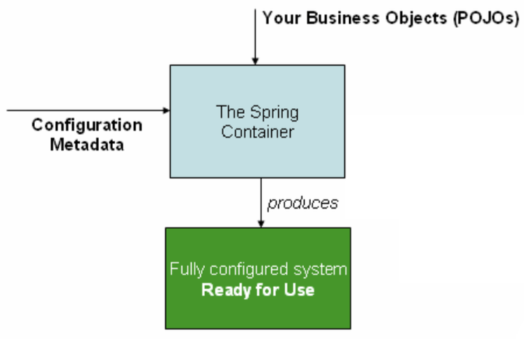

# 7. 스프링 학습 방법

## 스프링을 어떻게 공부할 것인가?

---

- 스프링 애플리케이션 개발은
    - 애플리케이션 코드를 설계하고 스프링 빈(bean) 선정
    - 구성정보 메타데이터 작성
    - 스프링 컨테이너 준비

- 스프링 애플리케이션이 만들어지는 구조
    
    
    
    
    

- 스프링 구성정보 메타데이터
    - 스프링 빈의 정의(클래스, 이름, 생성자, 프로퍼티, 오토와이어링)
    - 애노테이션 기반 구성정보 (`@Component`, `@Autowired`)
    - 자바 기반 구성정보 (`@Configuration`, `@Bean`)
    - 자동 구성정보(`@AutoConfiguration`) - SpringBoot

- 스프링이 제공하는 인프라 빈 활용
    - 스프링부트의 자동 구성과 프로퍼티 설정 을 통해서 활용 가능
    - 자동 구성에 의해 내부에서 만들어지는 빈의 구조를 이해
    - 프로퍼티 구성 정보를 이용한 커스토마이징
    - `@Bean` 오버라이딩을 이용한 구성
    - `@Enable`로 시작하는 기능

- 스프링의 각 모듈 기술 활용
    - 스프링과 이에 대응되는 스프링 부트의 기능을 함께 학습
    - 테스트
    - 데이터 액세스 (JDBC, JPA)
    - 웹MVC
    - REST Client (4가지)
    - 태스크 실행, 스케줄링
    - 캐시
    - 리액티브

- 스프링이 지원하는 언어
    - Java
    - Kotlin
    - Groovy

- 스프링 프로젝트 / 에코시스템
    - Spring Boot
    - Spring Data
    - Spring Security
    - Spring Cloud
    - Spring Session
    - Spring Integration
    - Spring Modulith
    - Spring Batch
    - Spring AI
    - …
