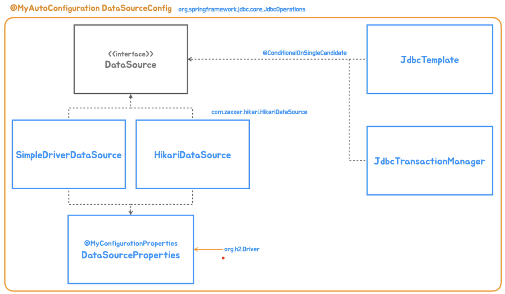

# 10. Spring JDBC 자동 구성 개발

## 자동 구성 클래스와 빈 설계

---

- 새로운 기술의 자동 구성 클래스를 작성할 때는 자동 구성 클래스에 적용할 조건과 만들어지는 빈 오브젝트의 종류 등을 먼저 설계한다.
    
    
    
- 두 개의 `DataSource` 구현 클래스를 조건에 따라 등록되도록 한다. 이 두 개의 빈은 `DataSourceProperties`라는 프로퍼티 클래스를 이용한다.

## DataSource 자동 구성 클래스

---

- `DataSourceConfig`은 `JdbcOperations` 클래스의 존재를 확인해서 등록되도록 한다.
- `DataSource` 빈 메소드에서 프로퍼티로 사용할 프로퍼티를 정의한다.
- `@EnableTransactionManagement`는 애노테이션을 활용한 트랜잭션 기능을 가능하게 해주는 구성용 애노테이션이다.
    
    ```java
    @MyAutoConfiguration
    @ConditionalMyOnClass("org.springframework.jdbc.core.JdbcOperations")
    @EnableMyConfigurationProperties(MyDataSourceProperties.class)
    @EnableTransactionManagement
    public class DataSourceConfig {
        ...
    }
    ```
    

- SimpleDriverDataSource는 간단한 테스트에서만 사용해야 한다. 운영 환경에서 사용하면 안 된다.
- `@ConditionalOnMissingBean`을 이용해서 앞에서 `DataSource`가 등록되면 빈을 만들지 않도록 한다.
    
    ```java
    @Bean
    @ConditionalOnMissingBean
    DataSource dataSource(MyDataSourceProperties properties) throws ClassNotFoundException {
        SimpleDriverDataSource dataSource = new SimpleDriverDataSource();
        dataSource.setDriverClass((Class<? extends Driver>) Class.forName(properties.getDriverClassName()));
        dataSource.setUrl(properties.getUrl());
        dataSource.setUsername(properties.getUsername());
        dataSource.setPassword(properties.getPassword());
        return dataSource;
    }
    ```
    

- `Hikari DataSource`는 `Hikari` 클래스가 존재하는 경우에만 만들어지도록 조건을 걸어준다.
    
    ```java
    @Bean
    @ConditionalMyOnClass("com.zaxxer.hikari.HikariDataSource")
    @ConditionalOnMissingBean
    DataSource hikariDataSource(MyDataSourceProperties properties) {
        HikariDataSource dataSource = new HikariDataSource();
        dataSource.setDriverClassName(properties.getDriverClassName());
        dataSource.setJdbcUrl(properties.getUrl());
        dataSource.setUsername(properties.getUsername());
        dataSource.setPassword(properties.getPassword());
        return dataSource;
    }
    ```
    

### 실습

---

- build.gradle
    - `org.springframework:spring-jdbc`, `com.h2database:h2` dependency 추가
- DataSourceConfig.java
    
    ```java
    package tobyspring.config.autoconfig;
    
    import org.springframework.context.annotation.Bean;
    import org.springframework.jdbc.datasource.SimpleDriverDataSource;
    import tobyspring.config.ConditionalMyOnClass;
    import tobyspring.config.EnableMyConfigurationProperties;
    import tobyspring.config.MyAutoConfiguration;
    
    import javax.sql.DataSource;
    import java.sql.Driver;
    
    @MyAutoConfiguration
    @ConditionalMyOnClass("org.springframework.jdbc.core.JdbcOperations")
    @EnableMyConfigurationProperties(MyDataSourceProperties.class)
    public class DataSourceConfig {
        @Bean
        DataSource dataSource(MyDataSourceProperties properties) throws ClassNotFoundException {
            SimpleDriverDataSource dataSource = new SimpleDriverDataSource();
    
            dataSource.setDriverClass((Class<? extends Driver>) Class.forName(properties.getDriverClassName()));
            dataSource.setUrl(properties.getUrl());
            dataSource.setUsername(properties.getUsername());
            dataSource.setPassword(properties.getPassword());
    
            return dataSource;
        }
    }
    ```
    
- /resources/META-INF/spring/tobyspring.config.MyAutoConfiguration.imports
    - DataSourceConfig 추가
- MyDataSourceProperties.java
    
    ```java
    package tobyspring.config.autoconfig;
    
    import tobyspring.config.MyConfigurationProperties;
    
    @MyConfigurationProperties(prefix = "data")
    public class MyDataSourceProperties {
        private String driverClassName;
        private String url;
        private String username;
        private String password;
    
        public String getDriverClassName() {
            return driverClassName;
        }
    
        public void setDriverClassName(String driverClassName) {
            this.driverClassName = driverClassName;
        }
    
        public String getUrl() {
            return url;
        }
    
        public void setUrl(String url) {
            this.url = url;
        }
    
        public String getUsername() {
            return username;
        }
    
        public void setUsername(String username) {
            this.username = username;
        }
    
        public String getPassword() {
            return password;
        }
    
        public void setPassword(String password) {
            this.password = password;
        }
    }
    ```
    
- application.properties
    - `data` 환경변수 추가
    
    ```java
    server.contextPath=/app
    server.port=9090
    data.driver-class-name=org.h2.Driver
    data.url=jdbc:h2:mem:
    data.username=sa
    data.password=
    ```
    
- DataSourceTest.java
    
    ```java
    package tobyspring.helloboot;
    
    import org.junit.jupiter.api.Test;
    import org.junit.jupiter.api.extension.ExtendWith;
    import org.springframework.beans.factory.annotation.Autowired;
    import org.springframework.test.context.ContextConfiguration;
    import org.springframework.test.context.TestPropertySource;
    import org.springframework.test.context.junit.jupiter.SpringExtension;
    
    import javax.sql.DataSource;
    import java.sql.Connection;
    import java.sql.SQLException;
    
    @ExtendWith(SpringExtension.class)
    @ContextConfiguration(classes = HellobootApplication.class)
    @TestPropertySource("classpath:/application.properties")
    public class DataSourceTest {
        @Autowired
        DataSource dataSource;
    
        @Test
        void connect() throws SQLException {
            Connection connection = dataSource.getConnection();
            connection.close();
        }
    }
    ```
    

- build.gradle
    - hikari-cp 의존성 추가
- DataSourceConfig.java
    - `HikariDataSource`가 없으면 `SimpleDriverDataSource` 생성하도록 추가
    
    ```java
    package tobyspring.config.autoconfig;
    
    import com.zaxxer.hikari.HikariDataSource;
    import org.springframework.boot.autoconfigure.condition.ConditionalOnMissingBean;
    import org.springframework.context.annotation.Bean;
    import org.springframework.jdbc.datasource.SimpleDriverDataSource;
    import tobyspring.config.ConditionalMyOnClass;
    import tobyspring.config.EnableMyConfigurationProperties;
    import tobyspring.config.MyAutoConfiguration;
    
    import javax.sql.DataSource;
    import java.sql.Driver;
    
    @MyAutoConfiguration
    @ConditionalMyOnClass("org.springframework.jdbc.core.JdbcOperations")
    @EnableMyConfigurationProperties(MyDataSourceProperties.class)
    public class DataSourceConfig {
        @Bean
        @ConditionalMyOnClass("com.zaxxer.hikari.HikariDataSource")
        @ConditionalOnMissingBean
        DataSource hikariDataSource(MyDataSourceProperties properties) {
            HikariDataSource dataSource = new HikariDataSource();
    
            dataSource.setDriverClassName(properties.getDriverClassName());
            dataSource.setJdbcUrl(properties.getUrl());
            dataSource.setUsername(properties.getUsername());
            dataSource.setPassword(properties.getPassword());
    
            return dataSource;
        }
    
        @Bean
        @ConditionalOnMissingBean
        DataSource dataSource(MyDataSourceProperties properties) throws ClassNotFoundException {
            SimpleDriverDataSource dataSource = new SimpleDriverDataSource();
    
            dataSource.setDriverClass((Class<? extends Driver>) Class.forName(properties.getDriverClassName()));
            dataSource.setUrl(properties.getUrl());
            dataSource.setUsername(properties.getUsername());
            dataSource.setPassword(properties.getPassword());
    
            return dataSource;
        }
    
    }
    ```
    
- 실행
    
    ```powershell
    > Task :compileJava
    Note: /Users/kim-yoonhee/IdeaProjects/helloboot/src/main/java/tobyspring/config/autoconfig/DataSourceConfig.java uses unchecked or unsafe operations.
    Note: Recompile with -Xlint:unchecked for details.
    > Task :processResources UP-TO-DATE
    > Task :classes
    > Task :compileTestJava UP-TO-DATE
    > Task :processTestResources NO-SOURCE
    > Task :testClasses UP-TO-DATE
    23:44:42.435 [Test worker] DEBUG org.springframework.test.context.BootstrapUtils - Instantiating CacheAwareContextLoaderDelegate from class [org.springframework.test.context.cache.DefaultCacheAwareContextLoaderDelegate]
    23:44:42.447 [Test worker] DEBUG org.springframework.test.context.BootstrapUtils - Instantiating BootstrapContext using constructor [public org.springframework.test.context.support.DefaultBootstrapContext(java.lang.Class,org.springframework.test.context.CacheAwareContextLoaderDelegate)]
    23:44:42.476 [Test worker] DEBUG org.springframework.test.context.BootstrapUtils - Instantiating TestContextBootstrapper for test class [tobyspring.helloboot.DataSourceTest] from class [org.springframework.test.context.support.DefaultTestContextBootstrapper]
    23:44:42.502 [Test worker] DEBUG org.springframework.test.context.support.AbstractDelegatingSmartContextLoader - Delegating to AnnotationConfigContextLoader to process context configuration [ContextConfigurationAttributes@72ea6193 declaringClass = 'tobyspring.helloboot.DataSourceTest', classes = '{class tobyspring.helloboot.HellobootApplication}', locations = '{}', inheritLocations = true, initializers = '{}', inheritInitializers = true, name = [null], contextLoaderClass = 'org.springframework.test.context.ContextLoader'].
    23:44:42.550 [Test worker] DEBUG org.springframework.test.context.support.ActiveProfilesUtils - Could not find an 'annotation declaring class' for annotation type [org.springframework.test.context.ActiveProfiles] and class [tobyspring.helloboot.DataSourceTest]
    23:44:42.551 [Test worker] DEBUG org.springframework.test.context.support.DefaultTestContextBootstrapper - @TestExecutionListeners is not present for class [tobyspring.helloboot.DataSourceTest]: using defaults.
    23:44:42.551 [Test worker] INFO org.springframework.test.context.support.DefaultTestContextBootstrapper - Loaded default TestExecutionListener class names from location [META-INF/spring.factories]: [org.springframework.boot.test.autoconfigure.restdocs.RestDocsTestExecutionListener, org.springframework.boot.test.autoconfigure.web.client.MockRestServiceServerResetTestExecutionListener, org.springframework.boot.test.autoconfigure.web.servlet.MockMvcPrintOnlyOnFailureTestExecutionListener, org.springframework.boot.test.autoconfigure.web.servlet.WebDriverTestExecutionListener, org.springframework.boot.test.autoconfigure.webservices.client.MockWebServiceServerTestExecutionListener, org.springframework.boot.test.mock.mockito.MockitoTestExecutionListener, org.springframework.boot.test.mock.mockito.ResetMocksTestExecutionListener, org.springframework.test.context.web.ServletTestExecutionListener, org.springframework.test.context.support.DirtiesContextBeforeModesTestExecutionListener, org.springframework.test.context.event.ApplicationEventsTestExecutionListener, org.springframework.test.context.support.DependencyInjectionTestExecutionListener, org.springframework.test.context.support.DirtiesContextTestExecutionListener, org.springframework.test.context.transaction.TransactionalTestExecutionListener, org.springframework.test.context.jdbc.SqlScriptsTestExecutionListener, org.springframework.test.context.event.EventPublishingTestExecutionListener]
    23:44:42.572 [Test worker] INFO org.springframework.test.context.support.DefaultTestContextBootstrapper - Using TestExecutionListeners: [org.springframework.test.context.web.ServletTestExecutionListener@83298d7, org.springframework.test.context.support.DirtiesContextBeforeModesTestExecutionListener@42a9e5d1, org.springframework.test.context.event.ApplicationEventsTestExecutionListener@5b080f3a, org.springframework.boot.test.mock.mockito.MockitoTestExecutionListener@773cbf4f, org.springframework.test.context.support.DependencyInjectionTestExecutionListener@6b54655f, org.springframework.test.context.support.DirtiesContextTestExecutionListener@665e9289, org.springframework.test.context.transaction.TransactionalTestExecutionListener@7d3430a7, org.springframework.test.context.jdbc.SqlScriptsTestExecutionListener@6f603e89, org.springframework.test.context.event.EventPublishingTestExecutionListener@2756c0a7, org.springframework.boot.test.autoconfigure.restdocs.RestDocsTestExecutionListener@350ec41e, org.springframework.boot.test.autoconfigure.web.client.MockRestServiceServerResetTestExecutionListener@69637b10, org.springframework.boot.test.autoconfigure.web.servlet.MockMvcPrintOnlyOnFailureTestExecutionListener@71984c3, org.springframework.boot.test.autoconfigure.web.servlet.WebDriverTestExecutionListener@165b2f7f, org.springframework.boot.test.autoconfigure.webservices.client.MockWebServiceServerTestExecutionListener@5536379e, org.springframework.boot.test.mock.mockito.ResetMocksTestExecutionListener@277f7dd3]
    23:44:42.574 [Test worker] DEBUG org.springframework.test.context.support.AbstractDirtiesContextTestExecutionListener - Before test class: context [DefaultTestContext@1c55f277 testClass = DataSourceTest, testInstance = [null], testMethod = [null], testException = [null], mergedContextConfiguration = [MergedContextConfiguration@5ddabb18 testClass = DataSourceTest, locations = '{}', classes = '{class tobyspring.helloboot.HellobootApplication}', contextInitializerClasses = '[]', activeProfiles = '{}', propertySourceLocations = '{classpath:/application.properties}', propertySourceProperties = '{}', contextCustomizers = set[org.springframework.boot.test.autoconfigure.actuate.metrics.MetricsExportContextCustomizerFactory$DisableMetricExportContextCustomizer@a776e, org.springframework.boot.test.autoconfigure.properties.PropertyMappingContextCustomizer@0, org.springframework.boot.test.autoconfigure.web.servlet.WebDriverContextCustomizerFactory$Customizer@5974109, org.springframework.boot.test.context.filter.ExcludeFilterContextCustomizer@75c9e76b, org.springframework.boot.test.json.DuplicateJsonObjectContextCustomizerFactory$DuplicateJsonObjectContextCustomizer@37b70343, org.springframework.boot.test.mock.mockito.MockitoContextCustomizer@0], contextLoader = 'org.springframework.test.context.support.DelegatingSmartContextLoader', parent = [null]], attributes = map[[empty]]], class annotated with @DirtiesContext [false] with mode [null].
    23:44:42.586 [Test worker] DEBUG org.springframework.test.context.support.DependencyInjectionTestExecutionListener - Performing dependency injection for test context [[DefaultTestContext@1c55f277 testClass = DataSourceTest, testInstance = tobyspring.helloboot.DataSourceTest@1c9f0a20, testMethod = [null], testException = [null], mergedContextConfiguration = [MergedContextConfiguration@5ddabb18 testClass = DataSourceTest, locations = '{}', classes = '{class tobyspring.helloboot.HellobootApplication}', contextInitializerClasses = '[]', activeProfiles = '{}', propertySourceLocations = '{classpath:/application.properties}', propertySourceProperties = '{}', contextCustomizers = set[org.springframework.boot.test.autoconfigure.actuate.metrics.MetricsExportContextCustomizerFactory$DisableMetricExportContextCustomizer@a776e, org.springframework.boot.test.autoconfigure.properties.PropertyMappingContextCustomizer@0, org.springframework.boot.test.autoconfigure.web.servlet.WebDriverContextCustomizerFactory$Customizer@5974109, org.springframework.boot.test.context.filter.ExcludeFilterContextCustomizer@75c9e76b, org.springframework.boot.test.json.DuplicateJsonObjectContextCustomizerFactory$DuplicateJsonObjectContextCustomizer@37b70343, org.springframework.boot.test.mock.mockito.MockitoContextCustomizer@0], contextLoader = 'org.springframework.test.context.support.DelegatingSmartContextLoader', parent = [null]], attributes = map['org.springframework.test.context.event.ApplicationEventsTestExecutionListener.recordApplicationEvents' -> false]]].
    23:44:42.586 [Test worker] DEBUG org.springframework.test.context.support.AbstractDelegatingSmartContextLoader - Delegating to AnnotationConfigContextLoader to load context from [MergedContextConfiguration@5ddabb18 testClass = DataSourceTest, locations = '{}', classes = '{class tobyspring.helloboot.HellobootApplication}', contextInitializerClasses = '[]', activeProfiles = '{}', propertySourceLocations = '{classpath:/application.properties}', propertySourceProperties = '{}', contextCustomizers = set[org.springframework.boot.test.autoconfigure.actuate.metrics.MetricsExportContextCustomizerFactory$DisableMetricExportContextCustomizer@a776e, org.springframework.boot.test.autoconfigure.properties.PropertyMappingContextCustomizer@0, org.springframework.boot.test.autoconfigure.web.servlet.WebDriverContextCustomizerFactory$Customizer@5974109, org.springframework.boot.test.context.filter.ExcludeFilterContextCustomizer@75c9e76b, org.springframework.boot.test.json.DuplicateJsonObjectContextCustomizerFactory$DuplicateJsonObjectContextCustomizer@37b70343, org.springframework.boot.test.mock.mockito.MockitoContextCustomizer@0], contextLoader = 'org.springframework.test.context.support.DelegatingSmartContextLoader', parent = [null]].
    23:44:42.587 [Test worker] DEBUG org.springframework.test.context.support.AbstractGenericContextLoader - Loading ApplicationContext for merged context configuration [[MergedContextConfiguration@5ddabb18 testClass = DataSourceTest, locations = '{}', classes = '{class tobyspring.helloboot.HellobootApplication}', contextInitializerClasses = '[]', activeProfiles = '{}', propertySourceLocations = '{classpath:/application.properties}', propertySourceProperties = '{}', contextCustomizers = set[org.springframework.boot.test.autoconfigure.actuate.metrics.MetricsExportContextCustomizerFactory$DisableMetricExportContextCustomizer@a776e, org.springframework.boot.test.autoconfigure.properties.PropertyMappingContextCustomizer@0, org.springframework.boot.test.autoconfigure.web.servlet.WebDriverContextCustomizerFactory$Customizer@5974109, org.springframework.boot.test.context.filter.ExcludeFilterContextCustomizer@75c9e76b, org.springframework.boot.test.json.DuplicateJsonObjectContextCustomizerFactory$DuplicateJsonObjectContextCustomizer@37b70343, org.springframework.boot.test.mock.mockito.MockitoContextCustomizer@0], contextLoader = 'org.springframework.test.context.support.DelegatingSmartContextLoader', parent = [null]]].
    23:44:42.621 [Test worker] DEBUG org.springframework.core.env.StandardEnvironment - Activating profiles []
    23:44:42.624 [Test worker] DEBUG org.springframework.test.context.support.AnnotationConfigContextLoader - Registering component classes: {class tobyspring.helloboot.HellobootApplication}
    23:44:42.668 [Test worker] DEBUG org.springframework.context.support.GenericApplicationContext - Refreshing org.springframework.context.support.GenericApplicationContext@42b64ab8
    23:44:42.682 [Test worker] DEBUG org.springframework.beans.factory.support.DefaultListableBeanFactory - Creating shared instance of singleton bean 'org.springframework.context.annotation.internalConfigurationAnnotationProcessor'
    23:44:42.743 [Test worker] DEBUG org.springframework.context.annotation.ClassPathBeanDefinitionScanner - Identified candidate component class: file [/Users/kim-yoonhee/IdeaProjects/helloboot/build/classes/java/main/tobyspring/helloboot/HelloController.class]
    23:44:42.745 [Test worker] DEBUG org.springframework.context.annotation.ClassPathBeanDefinitionScanner - Identified candidate component class: file [/Users/kim-yoonhee/IdeaProjects/helloboot/build/classes/java/main/tobyspring/helloboot/HelloDecorator.class]
    23:44:42.746 [Test worker] DEBUG org.springframework.context.annotation.ClassPathBeanDefinitionScanner - Ignored because not a concrete top-level class: file [/Users/kim-yoonhee/IdeaProjects/helloboot/build/classes/java/main/tobyspring/helloboot/MyComponent.class]
    23:44:42.749 [Test worker] DEBUG org.springframework.context.annotation.ClassPathBeanDefinitionScanner - Identified candidate component class: file [/Users/kim-yoonhee/IdeaProjects/helloboot/build/classes/java/main/tobyspring/helloboot/SimpleHelloService.class]
    23:44:42.749 [Test worker] DEBUG org.springframework.context.annotation.ClassPathBeanDefinitionScanner - Identified candidate component class: file [/Users/kim-yoonhee/IdeaProjects/helloboot/build/classes/java/main/tobyspring/helloboot/WebServerConfiguration.class]
    23:44:42.900 [Test worker] DEBUG org.springframework.beans.factory.support.DefaultListableBeanFactory - Creating shared instance of singleton bean 'propertySourcesPlaceholderConfigurer'
    23:44:42.902 [Test worker] DEBUG org.springframework.beans.factory.support.DefaultListableBeanFactory - Creating shared instance of singleton bean 'tobyspring.config.autoconfig.PropertyPlaceholderConfig'
    23:44:42.906 [Test worker] DEBUG org.springframework.beans.factory.support.DefaultListableBeanFactory - Creating shared instance of singleton bean 'org.springframework.boot.test.mock.mockito.MockitoPostProcessor'
    23:44:42.921 [Test worker] DEBUG org.springframework.beans.factory.support.DefaultListableBeanFactory - Creating shared instance of singleton bean 'org.springframework.context.event.internalEventListenerProcessor'
    23:44:42.923 [Test worker] DEBUG org.springframework.beans.factory.support.DefaultListableBeanFactory - Creating shared instance of singleton bean 'org.springframework.context.event.internalEventListenerFactory'
    23:44:42.924 [Test worker] DEBUG org.springframework.beans.factory.support.DefaultListableBeanFactory - Creating shared instance of singleton bean 'org.springframework.context.annotation.internalAutowiredAnnotationProcessor'
    23:44:42.926 [Test worker] DEBUG org.springframework.beans.factory.support.DefaultListableBeanFactory - Creating shared instance of singleton bean 'org.springframework.context.annotation.internalCommonAnnotationProcessor'
    23:44:42.930 [Test worker] DEBUG org.springframework.beans.factory.support.DefaultListableBeanFactory - Creating shared instance of singleton bean 'org.springframework.boot.test.mock.mockito.MockitoPostProcessor$SpyPostProcessor'
    23:44:42.931 [Test worker] DEBUG org.springframework.beans.factory.support.DefaultListableBeanFactory - Creating shared instance of singleton bean 'propertyPostProcessor'
    23:44:42.931 [Test worker] DEBUG org.springframework.beans.factory.support.DefaultListableBeanFactory - Creating shared instance of singleton bean 'tobyspring.config.autoconfig.PropertyPostProcessorConfig'
    23:44:42.961 [Test worker] INFO org.springframework.context.support.PostProcessorRegistrationDelegate$BeanPostProcessorChecker - Bean 'tobyspring.config.autoconfig.PropertyPostProcessorConfig' of type [tobyspring.config.autoconfig.PropertyPostProcessorConfig] is not eligible for getting processed by all BeanPostProcessors (for example: not eligible for auto-proxying)
    23:44:42.963 [Test worker] DEBUG org.springframework.beans.factory.support.DefaultListableBeanFactory - Autowiring by type from bean name 'propertyPostProcessor' via factory method to bean named 'environment'
    23:44:42.970 [Test worker] DEBUG org.springframework.beans.factory.support.DefaultListableBeanFactory - Creating shared instance of singleton bean 'hellobootApplication'
    23:44:42.975 [Test worker] DEBUG org.springframework.beans.factory.support.DefaultListableBeanFactory - Creating shared instance of singleton bean 'helloController'
    23:44:42.977 [Test worker] DEBUG org.springframework.beans.factory.support.DefaultListableBeanFactory - Creating shared instance of singleton bean 'helloDecorator'
    23:44:42.977 [Test worker] DEBUG org.springframework.beans.factory.support.DefaultListableBeanFactory - Creating shared instance of singleton bean 'simpleHelloService'
    23:44:42.979 [Test worker] DEBUG org.springframework.beans.factory.support.DefaultListableBeanFactory - Autowiring by type from bean name 'helloDecorator' via constructor to bean named 'simpleHelloService'
    23:44:42.980 [Test worker] DEBUG org.springframework.beans.factory.support.DefaultListableBeanFactory - Autowiring by type from bean name 'helloController' via constructor to bean named 'helloDecorator'
    23:44:42.983 [Test worker] DEBUG org.springframework.beans.factory.support.DefaultListableBeanFactory - Creating shared instance of singleton bean 'webServerConfiguration'
    23:44:42.984 [Test worker] DEBUG org.springframework.beans.factory.support.DefaultListableBeanFactory - Creating shared instance of singleton bean 'tobyspring.config.autoconfig.MyDataSourceProperties'
    23:44:43.070 [Test worker] DEBUG org.springframework.beans.factory.support.DefaultListableBeanFactory - Creating shared instance of singleton bean 'tobyspring.config.autoconfig.DataSourceConfig'
    23:44:43.072 [Test worker] DEBUG org.springframework.beans.factory.support.DefaultListableBeanFactory - Creating shared instance of singleton bean 'hikariDataSource'
    23:44:43.072 [Test worker] DEBUG org.springframework.beans.factory.support.DefaultListableBeanFactory - Autowiring by type from bean name 'hikariDataSource' via factory method to bean named 'tobyspring.config.autoconfig.MyDataSourceProperties'
    23:44:43.076 [Test worker] DEBUG com.zaxxer.hikari.HikariConfig - Driver class org.h2.Driver found in Thread context class loader jdk.internal.loader.ClassLoaders$AppClassLoader@277050dc
    23:44:43.092 [Test worker] DEBUG org.springframework.beans.factory.support.DefaultListableBeanFactory - Creating shared instance of singleton bean 'tobyspring.config.autoconfig.ServerProperties'
    23:44:43.094 [Test worker] DEBUG org.springframework.beans.factory.support.DefaultListableBeanFactory - Creating shared instance of singleton bean 'tobyspring.config.autoconfig.TomcatWebServerConfig'
    23:44:43.096 [Test worker] DEBUG org.springframework.beans.factory.support.DefaultListableBeanFactory - Creating shared instance of singleton bean 'tomcatWebServerFactory'
    23:44:43.096 [Test worker] DEBUG org.springframework.beans.factory.support.DefaultListableBeanFactory - Autowiring by type from bean name 'tomcatWebServerFactory' via factory method to bean named 'tobyspring.config.autoconfig.ServerProperties'
    23:44:43.160 [Test worker] DEBUG org.springframework.beans.factory.support.DefaultListableBeanFactory - Creating shared instance of singleton bean 'tobyspring.config.autoconfig.DispatcherServletConfig'
    23:44:43.161 [Test worker] DEBUG org.springframework.beans.factory.support.DefaultListableBeanFactory - Creating shared instance of singleton bean 'dispatcherServlet'
    23:44:43.208 [Test worker] DEBUG org.springframework.test.context.cache.DefaultCacheAwareContextLoaderDelegate - Storing ApplicationContext [1119242936] in cache under key [[MergedContextConfiguration@5ddabb18 testClass = DataSourceTest, locations = '{}', classes = '{class tobyspring.helloboot.HellobootApplication}', contextInitializerClasses = '[]', activeProfiles = '{}', propertySourceLocations = '{classpath:/application.properties}', propertySourceProperties = '{}', contextCustomizers = set[org.springframework.boot.test.autoconfigure.actuate.metrics.MetricsExportContextCustomizerFactory$DisableMetricExportContextCustomizer@a776e, org.springframework.boot.test.autoconfigure.properties.PropertyMappingContextCustomizer@0, org.springframework.boot.test.autoconfigure.web.servlet.WebDriverContextCustomizerFactory$Customizer@5974109, org.springframework.boot.test.context.filter.ExcludeFilterContextCustomizer@75c9e76b, org.springframework.boot.test.json.DuplicateJsonObjectContextCustomizerFactory$DuplicateJsonObjectContextCustomizer@37b70343, org.springframework.boot.test.mock.mockito.MockitoContextCustomizer@0], contextLoader = 'org.springframework.test.context.support.DelegatingSmartContextLoader', parent = [null]]]
    23:44:43.208 [Test worker] DEBUG org.springframework.test.context.cache - Spring test ApplicationContext cache statistics: [DefaultContextCache@504e1599 size = 1, maxSize = 32, parentContextCount = 0, hitCount = 0, missCount = 1]
    23:44:43.213 [Test worker] DEBUG org.springframework.test.context.cache.DefaultCacheAwareContextLoaderDelegate - Retrieved ApplicationContext [1119242936] from cache with key [[MergedContextConfiguration@5ddabb18 testClass = DataSourceTest, locations = '{}', classes = '{class tobyspring.helloboot.HellobootApplication}', contextInitializerClasses = '[]', activeProfiles = '{}', propertySourceLocations = '{classpath:/application.properties}', propertySourceProperties = '{}', contextCustomizers = set[org.springframework.boot.test.autoconfigure.actuate.metrics.MetricsExportContextCustomizerFactory$DisableMetricExportContextCustomizer@a776e, org.springframework.boot.test.autoconfigure.properties.PropertyMappingContextCustomizer@0, org.springframework.boot.test.autoconfigure.web.servlet.WebDriverContextCustomizerFactory$Customizer@5974109, org.springframework.boot.test.context.filter.ExcludeFilterContextCustomizer@75c9e76b, org.springframework.boot.test.json.DuplicateJsonObjectContextCustomizerFactory$DuplicateJsonObjectContextCustomizer@37b70343, org.springframework.boot.test.mock.mockito.MockitoContextCustomizer@0], contextLoader = 'org.springframework.test.context.support.DelegatingSmartContextLoader', parent = [null]]]
    23:44:43.214 [Test worker] DEBUG org.springframework.test.context.cache - Spring test ApplicationContext cache statistics: [DefaultContextCache@504e1599 size = 1, maxSize = 32, parentContextCount = 0, hitCount = 1, missCount = 1]
    23:44:43.219 [Test worker] DEBUG org.springframework.test.context.support.AbstractDirtiesContextTestExecutionListener - Before test method: context [DefaultTestContext@1c55f277 testClass = DataSourceTest, testInstance = tobyspring.helloboot.DataSourceTest@1c9f0a20, testMethod = connect@DataSourceTest, testException = [null], mergedContextConfiguration = [MergedContextConfiguration@5ddabb18 testClass = DataSourceTest, locations = '{}', classes = '{class tobyspring.helloboot.HellobootApplication}', contextInitializerClasses = '[]', activeProfiles = '{}', propertySourceLocations = '{classpath:/application.properties}', propertySourceProperties = '{}', contextCustomizers = set[org.springframework.boot.test.autoconfigure.actuate.metrics.MetricsExportContextCustomizerFactory$DisableMetricExportContextCustomizer@a776e, org.springframework.boot.test.autoconfigure.properties.PropertyMappingContextCustomizer@0, org.springframework.boot.test.autoconfigure.web.servlet.WebDriverContextCustomizerFactory$Customizer@5974109, org.springframework.boot.test.context.filter.ExcludeFilterContextCustomizer@75c9e76b, org.springframework.boot.test.json.DuplicateJsonObjectContextCustomizerFactory$DuplicateJsonObjectContextCustomizer@37b70343, org.springframework.boot.test.mock.mockito.MockitoContextCustomizer@0], contextLoader = 'org.springframework.test.context.support.DelegatingSmartContextLoader', parent = [null]], attributes = map['org.springframework.test.context.event.ApplicationEventsTestExecutionListener.recordApplicationEvents' -> false]], class annotated with @DirtiesContext [false] with mode [null], method annotated with @DirtiesContext [false] with mode [null].
    23:44:43.225 [Test worker] DEBUG org.springframework.test.context.cache.DefaultCacheAwareContextLoaderDelegate - Retrieved ApplicationContext [1119242936] from cache with key [[MergedContextConfiguration@5ddabb18 testClass = DataSourceTest, locations = '{}', classes = '{class tobyspring.helloboot.HellobootApplication}', contextInitializerClasses = '[]', activeProfiles = '{}', propertySourceLocations = '{classpath:/application.properties}', propertySourceProperties = '{}', contextCustomizers = set[org.springframework.boot.test.autoconfigure.actuate.metrics.MetricsExportContextCustomizerFactory$DisableMetricExportContextCustomizer@a776e, org.springframework.boot.test.autoconfigure.properties.PropertyMappingContextCustomizer@0, org.springframework.boot.test.autoconfigure.web.servlet.WebDriverContextCustomizerFactory$Customizer@5974109, org.springframework.boot.test.context.filter.ExcludeFilterContextCustomizer@75c9e76b, org.springframework.boot.test.json.DuplicateJsonObjectContextCustomizerFactory$DuplicateJsonObjectContextCustomizer@37b70343, org.springframework.boot.test.mock.mockito.MockitoContextCustomizer@0], contextLoader = 'org.springframework.test.context.support.DelegatingSmartContextLoader', parent = [null]]]
    23:44:43.225 [Test worker] DEBUG org.springframework.test.context.cache - Spring test ApplicationContext cache statistics: [DefaultContextCache@504e1599 size = 1, maxSize = 32, parentContextCount = 0, hitCount = 2, missCount = 1]
    23:44:43.226 [Test worker] DEBUG org.springframework.test.context.cache.DefaultCacheAwareContextLoaderDelegate - Retrieved ApplicationContext [1119242936] from cache with key [[MergedContextConfiguration@5ddabb18 testClass = DataSourceTest, locations = '{}', classes = '{class tobyspring.helloboot.HellobootApplication}', contextInitializerClasses = '[]', activeProfiles = '{}', propertySourceLocations = '{classpath:/application.properties}', propertySourceProperties = '{}', contextCustomizers = set[org.springframework.boot.test.autoconfigure.actuate.metrics.MetricsExportContextCustomizerFactory$DisableMetricExportContextCustomizer@a776e, org.springframework.boot.test.autoconfigure.properties.PropertyMappingContextCustomizer@0, org.springframework.boot.test.autoconfigure.web.servlet.WebDriverContextCustomizerFactory$Customizer@5974109, org.springframework.boot.test.context.filter.ExcludeFilterContextCustomizer@75c9e76b, org.springframework.boot.test.json.DuplicateJsonObjectContextCustomizerFactory$DuplicateJsonObjectContextCustomizer@37b70343, org.springframework.boot.test.mock.mockito.MockitoContextCustomizer@0], contextLoader = 'org.springframework.test.context.support.DelegatingSmartContextLoader', parent = [null]]]
    23:44:43.226 [Test worker] DEBUG org.springframework.test.context.cache - Spring test ApplicationContext cache statistics: [DefaultContextCache@504e1599 size = 1, maxSize = 32, parentContextCount = 0, hitCount = 3, missCount = 1]
    23:44:43.629 [Test worker] DEBUG org.springframework.test.context.cache.DefaultCacheAwareContextLoaderDelegate - Retrieved ApplicationContext [1119242936] from cache with key [[MergedContextConfiguration@5ddabb18 testClass = DataSourceTest, locations = '{}', classes = '{class tobyspring.helloboot.HellobootApplication}', contextInitializerClasses = '[]', activeProfiles = '{}', propertySourceLocations = '{classpath:/application.properties}', propertySourceProperties = '{}', contextCustomizers = set[org.springframework.boot.test.autoconfigure.actuate.metrics.MetricsExportContextCustomizerFactory$DisableMetricExportContextCustomizer@a776e, org.springframework.boot.test.autoconfigure.properties.PropertyMappingContextCustomizer@0, org.springframework.boot.test.autoconfigure.web.servlet.WebDriverContextCustomizerFactory$Customizer@5974109, org.springframework.boot.test.context.filter.ExcludeFilterContextCustomizer@75c9e76b, org.springframework.boot.test.json.DuplicateJsonObjectContextCustomizerFactory$DuplicateJsonObjectContextCustomizer@37b70343, org.springframework.boot.test.mock.mockito.MockitoContextCustomizer@0], contextLoader = 'org.springframework.test.context.support.DelegatingSmartContextLoader', parent = [null]]]
    23:44:43.629 [Test worker] DEBUG org.springframework.test.context.cache - Spring test ApplicationContext cache statistics: [DefaultContextCache@504e1599 size = 1, maxSize = 32, parentContextCount = 0, hitCount = 4, missCount = 1]
    23:44:43.636 [Test worker] DEBUG com.zaxxer.hikari.HikariConfig - HikariPool-1 - configuration:
    23:44:43.638 [Test worker] DEBUG com.zaxxer.hikari.HikariConfig - allowPoolSuspension................................false
    23:44:43.638 [Test worker] DEBUG com.zaxxer.hikari.HikariConfig - autoCommit................................true
    23:44:43.639 [Test worker] DEBUG com.zaxxer.hikari.HikariConfig - catalog................................none
    23:44:43.639 [Test worker] DEBUG com.zaxxer.hikari.HikariConfig - connectionInitSql................................none
    23:44:43.639 [Test worker] DEBUG com.zaxxer.hikari.HikariConfig - connectionTestQuery................................none
    23:44:43.639 [Test worker] DEBUG com.zaxxer.hikari.HikariConfig - connectionTimeout................................30000
    23:44:43.639 [Test worker] DEBUG com.zaxxer.hikari.HikariConfig - dataSource................................none
    23:44:43.639 [Test worker] DEBUG com.zaxxer.hikari.HikariConfig - dataSourceClassName................................none
    23:44:43.639 [Test worker] DEBUG com.zaxxer.hikari.HikariConfig - dataSourceJNDI................................none
    23:44:43.640 [Test worker] DEBUG com.zaxxer.hikari.HikariConfig - dataSourceProperties................................{password=<masked>}
    23:44:43.640 [Test worker] DEBUG com.zaxxer.hikari.HikariConfig - driverClassName................................"org.h2.Driver"
    23:44:43.640 [Test worker] DEBUG com.zaxxer.hikari.HikariConfig - exceptionOverrideClassName................................none
    23:44:43.641 [Test worker] DEBUG com.zaxxer.hikari.HikariConfig - healthCheckProperties................................{}
    23:44:43.641 [Test worker] DEBUG com.zaxxer.hikari.HikariConfig - healthCheckRegistry................................none
    23:44:43.641 [Test worker] DEBUG com.zaxxer.hikari.HikariConfig - idleTimeout................................600000
    23:44:43.641 [Test worker] DEBUG com.zaxxer.hikari.HikariConfig - initializationFailTimeout................................1
    23:44:43.642 [Test worker] DEBUG com.zaxxer.hikari.HikariConfig - isolateInternalQueries................................false
    23:44:43.642 [Test worker] DEBUG com.zaxxer.hikari.HikariConfig - jdbcUrl................................jdbc:h2:mem:
    23:44:43.642 [Test worker] DEBUG com.zaxxer.hikari.HikariConfig - keepaliveTime................................0
    23:44:43.643 [Test worker] DEBUG com.zaxxer.hikari.HikariConfig - leakDetectionThreshold................................0
    23:44:43.643 [Test worker] DEBUG com.zaxxer.hikari.HikariConfig - maxLifetime................................1800000
    23:44:43.643 [Test worker] DEBUG com.zaxxer.hikari.HikariConfig - maximumPoolSize................................10
    23:44:43.643 [Test worker] DEBUG com.zaxxer.hikari.HikariConfig - metricRegistry................................none
    23:44:43.643 [Test worker] DEBUG com.zaxxer.hikari.HikariConfig - metricsTrackerFactory................................none
    23:44:43.644 [Test worker] DEBUG com.zaxxer.hikari.HikariConfig - minimumIdle................................10
    23:44:43.644 [Test worker] DEBUG com.zaxxer.hikari.HikariConfig - password................................<masked>
    23:44:43.644 [Test worker] DEBUG com.zaxxer.hikari.HikariConfig - poolName................................"HikariPool-1"
    23:44:43.644 [Test worker] DEBUG com.zaxxer.hikari.HikariConfig - readOnly................................false
    23:44:43.645 [Test worker] DEBUG com.zaxxer.hikari.HikariConfig - registerMbeans................................false
    23:44:43.645 [Test worker] DEBUG com.zaxxer.hikari.HikariConfig - scheduledExecutor................................none
    23:44:43.645 [Test worker] DEBUG com.zaxxer.hikari.HikariConfig - schema................................none
    23:44:43.645 [Test worker] DEBUG com.zaxxer.hikari.HikariConfig - threadFactory................................internal
    23:44:43.645 [Test worker] DEBUG com.zaxxer.hikari.HikariConfig - transactionIsolation................................default
    23:44:43.646 [Test worker] DEBUG com.zaxxer.hikari.HikariConfig - username................................"sa"
    23:44:43.646 [Test worker] DEBUG com.zaxxer.hikari.HikariConfig - validationTimeout................................5000
    23:44:43.646 [Test worker] INFO com.zaxxer.hikari.HikariDataSource - HikariPool-1 - Starting...
    23:44:43.863 [Test worker] DEBUG com.zaxxer.hikari.pool.HikariPool - HikariPool-1 - Added connection conn0: url=jdbc:h2:mem: user=SA
    23:44:43.865 [Test worker] INFO com.zaxxer.hikari.HikariDataSource - HikariPool-1 - Start completed.
    23:44:43.887 [Test worker] DEBUG org.springframework.test.context.cache.DefaultCacheAwareContextLoaderDelegate - Retrieved ApplicationContext [1119242936] from cache with key [[MergedContextConfiguration@5ddabb18 testClass = DataSourceTest, locations = '{}', classes = '{class tobyspring.helloboot.HellobootApplication}', contextInitializerClasses = '[]', activeProfiles = '{}', propertySourceLocations = '{classpath:/application.properties}', propertySourceProperties = '{}', contextCustomizers = set[org.springframework.boot.test.autoconfigure.actuate.metrics.MetricsExportContextCustomizerFactory$DisableMetricExportContextCustomizer@a776e, org.springframework.boot.test.autoconfigure.properties.PropertyMappingContextCustomizer@0, org.springframework.boot.test.autoconfigure.web.servlet.WebDriverContextCustomizerFactory$Customizer@5974109, org.springframework.boot.test.context.filter.ExcludeFilterContextCustomizer@75c9e76b, org.springframework.boot.test.json.DuplicateJsonObjectContextCustomizerFactory$DuplicateJsonObjectContextCustomizer@37b70343, org.springframework.boot.test.mock.mockito.MockitoContextCustomizer@0], contextLoader = 'org.springframework.test.context.support.DelegatingSmartContextLoader', parent = [null]]]
    23:44:43.887 [Test worker] DEBUG org.springframework.test.context.cache - Spring test ApplicationContext cache statistics: [DefaultContextCache@504e1599 size = 1, maxSize = 32, parentContextCount = 0, hitCount = 5, missCount = 1]
    23:44:43.889 [Test worker] DEBUG org.springframework.test.context.cache.DefaultCacheAwareContextLoaderDelegate - Retrieved ApplicationContext [1119242936] from cache with key [[MergedContextConfiguration@5ddabb18 testClass = DataSourceTest, locations = '{}', classes = '{class tobyspring.helloboot.HellobootApplication}', contextInitializerClasses = '[]', activeProfiles = '{}', propertySourceLocations = '{classpath:/application.properties}', propertySourceProperties = '{}', contextCustomizers = set[org.springframework.boot.test.autoconfigure.actuate.metrics.MetricsExportContextCustomizerFactory$DisableMetricExportContextCustomizer@a776e, org.springframework.boot.test.autoconfigure.properties.PropertyMappingContextCustomizer@0, org.springframework.boot.test.autoconfigure.web.servlet.WebDriverContextCustomizerFactory$Customizer@5974109, org.springframework.boot.test.context.filter.ExcludeFilterContextCustomizer@75c9e76b, org.springframework.boot.test.json.DuplicateJsonObjectContextCustomizerFactory$DuplicateJsonObjectContextCustomizer@37b70343, org.springframework.boot.test.mock.mockito.MockitoContextCustomizer@0], contextLoader = 'org.springframework.test.context.support.DelegatingSmartContextLoader', parent = [null]]]
    23:44:43.889 [Test worker] DEBUG org.springframework.test.context.cache - Spring test ApplicationContext cache statistics: [DefaultContextCache@504e1599 size = 1, maxSize = 32, parentContextCount = 0, hitCount = 6, missCount = 1]
    23:44:43.890 [Test worker] DEBUG org.springframework.test.context.cache.DefaultCacheAwareContextLoaderDelegate - Retrieved ApplicationContext [1119242936] from cache with key [[MergedContextConfiguration@5ddabb18 testClass = DataSourceTest, locations = '{}', classes = '{class tobyspring.helloboot.HellobootApplication}', contextInitializerClasses = '[]', activeProfiles = '{}', propertySourceLocations = '{classpath:/application.properties}', propertySourceProperties = '{}', contextCustomizers = set[org.springframework.boot.test.autoconfigure.actuate.metrics.MetricsExportContextCustomizerFactory$DisableMetricExportContextCustomizer@a776e, org.springframework.boot.test.autoconfigure.properties.PropertyMappingContextCustomizer@0, org.springframework.boot.test.autoconfigure.web.servlet.WebDriverContextCustomizerFactory$Customizer@5974109, org.springframework.boot.test.context.filter.ExcludeFilterContextCustomizer@75c9e76b, org.springframework.boot.test.json.DuplicateJsonObjectContextCustomizerFactory$DuplicateJsonObjectContextCustomizer@37b70343, org.springframework.boot.test.mock.mockito.MockitoContextCustomizer@0], contextLoader = 'org.springframework.test.context.support.DelegatingSmartContextLoader', parent = [null]]]
    23:44:43.890 [Test worker] DEBUG org.springframework.test.context.cache - Spring test ApplicationContext cache statistics: [DefaultContextCache@504e1599 size = 1, maxSize = 32, parentContextCount = 0, hitCount = 7, missCount = 1]
    23:44:43.891 [Test worker] DEBUG org.springframework.test.context.cache.DefaultCacheAwareContextLoaderDelegate - Retrieved ApplicationContext [1119242936] from cache with key [[MergedContextConfiguration@5ddabb18 testClass = DataSourceTest, locations = '{}', classes = '{class tobyspring.helloboot.HellobootApplication}', contextInitializerClasses = '[]', activeProfiles = '{}', propertySourceLocations = '{classpath:/application.properties}', propertySourceProperties = '{}', contextCustomizers = set[org.springframework.boot.test.autoconfigure.actuate.metrics.MetricsExportContextCustomizerFactory$DisableMetricExportContextCustomizer@a776e, org.springframework.boot.test.autoconfigure.properties.PropertyMappingContextCustomizer@0, org.springframework.boot.test.autoconfigure.web.servlet.WebDriverContextCustomizerFactory$Customizer@5974109, org.springframework.boot.test.context.filter.ExcludeFilterContextCustomizer@75c9e76b, org.springframework.boot.test.json.DuplicateJsonObjectContextCustomizerFactory$DuplicateJsonObjectContextCustomizer@37b70343, org.springframework.boot.test.mock.mockito.MockitoContextCustomizer@0], contextLoader = 'org.springframework.test.context.support.DelegatingSmartContextLoader', parent = [null]]]
    23:44:43.891 [Test worker] DEBUG org.springframework.test.context.cache - Spring test ApplicationContext cache statistics: [DefaultContextCache@504e1599 size = 1, maxSize = 32, parentContextCount = 0, hitCount = 8, missCount = 1]
    23:44:43.893 [Test worker] DEBUG org.springframework.test.context.cache.DefaultCacheAwareContextLoaderDelegate - Retrieved ApplicationContext [1119242936] from cache with key [[MergedContextConfiguration@5ddabb18 testClass = DataSourceTest, locations = '{}', classes = '{class tobyspring.helloboot.HellobootApplication}', contextInitializerClasses = '[]', activeProfiles = '{}', propertySourceLocations = '{classpath:/application.properties}', propertySourceProperties = '{}', contextCustomizers = set[org.springframework.boot.test.autoconfigure.actuate.metrics.MetricsExportContextCustomizerFactory$DisableMetricExportContextCustomizer@a776e, org.springframework.boot.test.autoconfigure.properties.PropertyMappingContextCustomizer@0, org.springframework.boot.test.autoconfigure.web.servlet.WebDriverContextCustomizerFactory$Customizer@5974109, org.springframework.boot.test.context.filter.ExcludeFilterContextCustomizer@75c9e76b, org.springframework.boot.test.json.DuplicateJsonObjectContextCustomizerFactory$DuplicateJsonObjectContextCustomizer@37b70343, org.springframework.boot.test.mock.mockito.MockitoContextCustomizer@0], contextLoader = 'org.springframework.test.context.support.DelegatingSmartContextLoader', parent = [null]]]
    23:44:43.893 [Test worker] DEBUG org.springframework.test.context.cache - Spring test ApplicationContext cache statistics: [DefaultContextCache@504e1599 size = 1, maxSize = 32, parentContextCount = 0, hitCount = 9, missCount = 1]
    23:44:43.896 [Test worker] DEBUG org.springframework.test.context.cache.DefaultCacheAwareContextLoaderDelegate - Retrieved ApplicationContext [1119242936] from cache with key [[MergedContextConfiguration@5ddabb18 testClass = DataSourceTest, locations = '{}', classes = '{class tobyspring.helloboot.HellobootApplication}', contextInitializerClasses = '[]', activeProfiles = '{}', propertySourceLocations = '{classpath:/application.properties}', propertySourceProperties = '{}', contextCustomizers = set[org.springframework.boot.test.autoconfigure.actuate.metrics.MetricsExportContextCustomizerFactory$DisableMetricExportContextCustomizer@a776e, org.springframework.boot.test.autoconfigure.properties.PropertyMappingContextCustomizer@0, org.springframework.boot.test.autoconfigure.web.servlet.WebDriverContextCustomizerFactory$Customizer@5974109, org.springframework.boot.test.context.filter.ExcludeFilterContextCustomizer@75c9e76b, org.springframework.boot.test.json.DuplicateJsonObjectContextCustomizerFactory$DuplicateJsonObjectContextCustomizer@37b70343, org.springframework.boot.test.mock.mockito.MockitoContextCustomizer@0], contextLoader = 'org.springframework.test.context.support.DelegatingSmartContextLoader', parent = [null]]]
    23:44:43.896 [Test worker] DEBUG org.springframework.test.context.cache - Spring test ApplicationContext cache statistics: [DefaultContextCache@504e1599 size = 1, maxSize = 32, parentContextCount = 0, hitCount = 10, missCount = 1]
    23:44:43.897 [Test worker] DEBUG org.springframework.test.context.support.AbstractDirtiesContextTestExecutionListener - After test method: context [DefaultTestContext@1c55f277 testClass = DataSourceTest, testInstance = tobyspring.helloboot.DataSourceTest@1c9f0a20, testMethod = connect@DataSourceTest, testException = [null], mergedContextConfiguration = [MergedContextConfiguration@5ddabb18 testClass = DataSourceTest, locations = '{}', classes = '{class tobyspring.helloboot.HellobootApplication}', contextInitializerClasses = '[]', activeProfiles = '{}', propertySourceLocations = '{classpath:/application.properties}', propertySourceProperties = '{}', contextCustomizers = set[org.springframework.boot.test.autoconfigure.actuate.metrics.MetricsExportContextCustomizerFactory$DisableMetricExportContextCustomizer@a776e, org.springframework.boot.test.autoconfigure.properties.PropertyMappingContextCustomizer@0, org.springframework.boot.test.autoconfigure.web.servlet.WebDriverContextCustomizerFactory$Customizer@5974109, org.springframework.boot.test.context.filter.ExcludeFilterContextCustomizer@75c9e76b, org.springframework.boot.test.json.DuplicateJsonObjectContextCustomizerFactory$DuplicateJsonObjectContextCustomizer@37b70343, org.springframework.boot.test.mock.mockito.MockitoContextCustomizer@0], contextLoader = 'org.springframework.test.context.support.DelegatingSmartContextLoader', parent = [null]], attributes = map['org.springframework.test.context.event.ApplicationEventsTestExecutionListener.recordApplicationEvents' -> false]], class annotated with @DirtiesContext [false] with mode [null], method annotated with @DirtiesContext [false] with mode [null].
    23:44:43.909 [Test worker] DEBUG org.springframework.test.context.cache.DefaultCacheAwareContextLoaderDelegate - Retrieved ApplicationContext [1119242936] from cache with key [[MergedContextConfiguration@5ddabb18 testClass = DataSourceTest, locations = '{}', classes = '{class tobyspring.helloboot.HellobootApplication}', contextInitializerClasses = '[]', activeProfiles = '{}', propertySourceLocations = '{classpath:/application.properties}', propertySourceProperties = '{}', contextCustomizers = set[org.springframework.boot.test.autoconfigure.actuate.metrics.MetricsExportContextCustomizerFactory$DisableMetricExportContextCustomizer@a776e, org.springframework.boot.test.autoconfigure.properties.PropertyMappingContextCustomizer@0, org.springframework.boot.test.autoconfigure.web.servlet.WebDriverContextCustomizerFactory$Customizer@5974109, org.springframework.boot.test.context.filter.ExcludeFilterContextCustomizer@75c9e76b, org.springframework.boot.test.json.DuplicateJsonObjectContextCustomizerFactory$DuplicateJsonObjectContextCustomizer@37b70343, org.springframework.boot.test.mock.mockito.MockitoContextCustomizer@0], contextLoader = 'org.springframework.test.context.support.DelegatingSmartContextLoader', parent = [null]]]
    23:44:43.909 [Test worker] DEBUG org.springframework.test.context.cache - Spring test ApplicationContext cache statistics: [DefaultContextCache@504e1599 size = 1, maxSize = 32, parentContextCount = 0, hitCount = 11, missCount = 1]
    23:44:43.910 [Test worker] DEBUG org.springframework.test.context.support.AbstractDirtiesContextTestExecutionListener - After test class: context [DefaultTestContext@1c55f277 testClass = DataSourceTest, testInstance = [null], testMethod = [null], testException = [null], mergedContextConfiguration = [MergedContextConfiguration@5ddabb18 testClass = DataSourceTest, locations = '{}', classes = '{class tobyspring.helloboot.HellobootApplication}', contextInitializerClasses = '[]', activeProfiles = '{}', propertySourceLocations = '{classpath:/application.properties}', propertySourceProperties = '{}', contextCustomizers = set[org.springframework.boot.test.autoconfigure.actuate.metrics.MetricsExportContextCustomizerFactory$DisableMetricExportContextCustomizer@a776e, org.springframework.boot.test.autoconfigure.properties.PropertyMappingContextCustomizer@0, org.springframework.boot.test.autoconfigure.web.servlet.WebDriverContextCustomizerFactory$Customizer@5974109, org.springframework.boot.test.context.filter.ExcludeFilterContextCustomizer@75c9e76b, org.springframework.boot.test.json.DuplicateJsonObjectContextCustomizerFactory$DuplicateJsonObjectContextCustomizer@37b70343, org.springframework.boot.test.mock.mockito.MockitoContextCustomizer@0], contextLoader = 'org.springframework.test.context.support.DelegatingSmartContextLoader', parent = [null]], attributes = map['org.springframework.test.context.event.ApplicationEventsTestExecutionListener.recordApplicationEvents' -> false]], class annotated with @DirtiesContext [false] with mode [null].
    23:44:43.930 [SpringContextShutdownHook] DEBUG org.springframework.context.support.GenericApplicationContext - Closing org.springframework.context.support.GenericApplicationContext@42b64ab8, started on Sun Dec 22 23:44:42 KST 2024
    23:44:43.933 [SpringContextShutdownHook] INFO com.zaxxer.hikari.HikariDataSource - HikariPool-1 - Shutdown initiated...
    23:44:43.933 [SpringContextShutdownHook] DEBUG com.zaxxer.hikari.pool.HikariPool - HikariPool-1 - Before shutdown stats (total=1, active=0, idle=1, waiting=0)
    23:44:43.936 [HikariPool-1 connection closer] DEBUG com.zaxxer.hikari.pool.PoolBase - HikariPool-1 - Closing connection conn0: url=jdbc:h2:mem: user=SA: (connection evicted)
    23:44:43.937 [SpringContextShutdownHook] DEBUG com.zaxxer.hikari.pool.HikariPool - HikariPool-1 - After shutdown stats (total=0, active=0, idle=0, waiting=0)
    23:44:43.937 [SpringContextShutdownHook] INFO com.zaxxer.hikari.HikariDataSource - HikariPool-1 - Shutdown completed.
    > Task :test
    Deprecated Gradle features were used in this build, making it incompatible with Gradle 9.0.
    You can use '--warning-mode all' to show the individual deprecation warnings and determine if they come from your own scripts or plugins.
    For more on this, please refer to https://docs.gradle.org/8.10.2/userguide/command_line_interface.html#sec:command_line_warnings in the Gradle documentation.
    BUILD SUCCESSFUL in 3s
    4 actionable tasks: 2 executed, 2 up-to-date
    오후 11:44:44: Execution finished ':test --tests "tobyspring.helloboot.DataSourceTest.connect"'.
    ```
    

## JdbcTemplate과 트랜잭션 매니저 구성

---

- `@ConditionalOnSingleCandidate`는 빈 구성정보에 해당 타입의 빈이 한 개만 등록되어있는 경우에 조건이 매칭된다.
- `JdbcTemplate`은 `DataSource`를 주입 받아서 생성한다.
    
    ```java
    @Bean
    @ConditionalOnSingleCandidate(DataSource.class)
    @ConditionalOnMissingBean
    JdbcTemplate jdbcTemplate(DataSource dataSource) {
        return new JdbcTemplate(dataSource);
    }
    ```
    
- 스프링의 트랜잭션 추상화 기능을 활용하기 위해서 트랜잭션 매니저 빈도 만들어준다.
    
    ```java
    @Bean
    @ConditionalOnSingleCandidate(DataSource.class)
    @ConditionalOnMissingBean
    JdbcTransactionManager jdbcTransactionManager(DataSource dataSource) {
        return new JdbcTransactionManager(dataSource);
    }
    ```
    
- 애노테이션을 이용하는 트랜잭션 기능을 이용하기 위해 `@EnableTransactionManagement`를 클래스 레벨에 넣는 것도 잊지 말아야 한다.

### 실습

---

- DataSourceConfig.java
    - `JdbcTemplate`, `JdbcTransactionManager` 빈 추가
    
    ```java
    package tobyspring.config.autoconfig;
    
    import com.zaxxer.hikari.HikariDataSource;
    import org.springframework.boot.autoconfigure.condition.ConditionalOnMissingBean;
    import org.springframework.boot.autoconfigure.condition.ConditionalOnSingleCandidate;
    import org.springframework.context.annotation.Bean;
    import org.springframework.jdbc.core.JdbcTemplate;
    import org.springframework.jdbc.datasource.SimpleDriverDataSource;
    import org.springframework.jdbc.support.JdbcTransactionManager;
    import org.springframework.transaction.annotation.EnableTransactionManagement;
    import tobyspring.config.ConditionalMyOnClass;
    import tobyspring.config.EnableMyConfigurationProperties;
    import tobyspring.config.MyAutoConfiguration;
    
    import javax.sql.DataSource;
    import java.sql.Driver;
    
    @MyAutoConfiguration
    @ConditionalMyOnClass("org.springframework.jdbc.core.JdbcOperations")
    @EnableMyConfigurationProperties(MyDataSourceProperties.class)
    @EnableTransactionManagement
    public class DataSourceConfig {
        @Bean
        @ConditionalMyOnClass("com.zaxxer.hikari.HikariDataSource")
        @ConditionalOnMissingBean
        DataSource hikariDataSource(MyDataSourceProperties properties) {
            HikariDataSource dataSource = new HikariDataSource();
    
            dataSource.setDriverClassName(properties.getDriverClassName());
            dataSource.setJdbcUrl(properties.getUrl());
            dataSource.setUsername(properties.getUsername());
            dataSource.setPassword(properties.getPassword());
    
            return dataSource;
        }
    
        @Bean
        @ConditionalOnMissingBean
        DataSource dataSource(MyDataSourceProperties properties) throws ClassNotFoundException {
            SimpleDriverDataSource dataSource = new SimpleDriverDataSource();
    
            dataSource.setDriverClass((Class<? extends Driver>) Class.forName(properties.getDriverClassName()));
            dataSource.setUrl(properties.getUrl());
            dataSource.setUsername(properties.getUsername());
            dataSource.setPassword(properties.getPassword());
    
            return dataSource;
        }
    
        @Bean
        @ConditionalOnSingleCandidate(DataSource.class)
        @ConditionalOnMissingBean
        JdbcTemplate jdbcTemplate(DataSource dataSource) {
            return new JdbcTemplate(dataSource);
        }
    
        @Bean
        @ConditionalOnSingleCandidate(DataSource.class)
        @ConditionalOnMissingBean
        JdbcTransactionManager jdbcTransactionManager(DataSource dataSource) {
            return new JdbcTransactionManager(dataSource);
        }
    
    }
    ```
    
- HelloBootTest.java
    - 테스트용 어노테이션 추가
    
    ```java
    package tobyspring.helloboot;
    
    import org.junit.jupiter.api.extension.ExtendWith;
    import org.springframework.test.context.ContextConfiguration;
    import org.springframework.test.context.TestPropertySource;
    import org.springframework.test.context.junit.jupiter.SpringExtension;
    import org.springframework.transaction.annotation.Transactional;
    
    import java.lang.annotation.ElementType;
    import java.lang.annotation.Retention;
    import java.lang.annotation.RetentionPolicy;
    import java.lang.annotation.Target;
    
    @Retention(RetentionPolicy.RUNTIME)
    @Target(ElementType.TYPE)
    @ExtendWith(SpringExtension.class)
    @ContextConfiguration(classes = HellobootApplication.class)
    @TestPropertySource("classpath:/application.properties")
    @Transactional
    public @interface HelloBootTest {
    }
    ```
    
- JdbcTemplateTest.java
    
    ```java
    package tobyspring.helloboot;
    
    import org.junit.jupiter.api.BeforeEach;
    import org.junit.jupiter.api.Test;
    import org.springframework.beans.factory.annotation.Autowired;
    import org.springframework.jdbc.core.JdbcTemplate;
    import org.springframework.test.annotation.Rollback;
    
    import static org.assertj.core.api.Assertions.assertThat;
    
    @HelloBootTest
    //@Rollback(false)
    public class JdbcTemplateTest {
        @Autowired
        JdbcTemplate jdbcTemplate;
    
        @BeforeEach
        void init() {
            jdbcTemplate.execute("create table if not exists hello(name varchar(50) primary key, count int)");
        }
    
        @Test
        void insertAndQuery() {
            jdbcTemplate.update("insert into hello values(?, ?)", "Toby", 3);
            jdbcTemplate.update("insert into hello values(?, ?)", "Spring", 1);
    
            Long count = jdbcTemplate.queryForObject("select count(*) from hello", Long.class);
            assertThat(count).isEqualTo(2);
        }
    
        @Test
        void insertAndQuery2() {
            jdbcTemplate.update("insert into hello values(?, ?)", "Toby", 3);
            jdbcTemplate.update("insert into hello values(?, ?)", "Spring", 1);
    
            Long count = jdbcTemplate.queryForObject("select count(*) from hello", Long.class);
            assertThat(count).isEqualTo(2);
        }
    }
    ```
    

## Hello 리포지토리

---

❗인터페이스에 `default` 메소드, `static` 메소드를 넣어서 활용하는 방법은 자바의 `Comparator<T>` 인터페이스를 참고하면 도움이 된다.

- `JdbcTemplate`의 `queryForObject`를 이용해서 하나의 조회 결과를 가져올 수 있다. 오브젝트에 컬럼 값을 매핑하는 경우 `RowMapper` 인터페이스를 구현해서 `ResultSet`을 데이터 오브젝트로 전환하는 코드를 넣어 콜백으로 전달해 사용한다.
    
    ```java
    <T> T queryForObject(String sql, RowMapper<T> rowMapper) throws DataAccessException;
    ```
    
    ```java
    @FunctionalInterface
    public interface RowMapper<T> {
        @Nullable
        T mapRow(ResultSet rs, int rowNum) throws SQLException;
    }
    ```
    
- 데이터를 변경할 때는 `JdbcTemplate`의 `update()`를 이용한다.

### 실습

---

- HelloRepository.java
    
    ```java
    package tobyspring.helloboot;
    
    public interface HelloRepository {
        Hello findHello(String name);
    
        void increaseCount(String name);
    
        default int countOf(String name) {
            Hello hello = findHello(name);
            return hello == null ? 0 : hello.getCount();
        }
    }
    ```
    
- Hello.java
    
    ```java
    package tobyspring.helloboot;
    
    public class Hello {
        private String name;
        private int count;
    
        public Hello(String name, int count) {
            this.name = name;
            this.count = count;
        }
    
        public String getName() {
            return name;
        }
    
        public int getCount() {
            return count;
        }
    }
    ```
    
- HelloRepositoryJdbc.java
    
    ```java
    package tobyspring.helloboot;
    
    import org.springframework.dao.EmptyResultDataAccessException;
    import org.springframework.jdbc.core.JdbcTemplate;
    import org.springframework.stereotype.Repository;
    
    @Repository
    public class HelloRepositoryJdbc implements HelloRepository {
        private final JdbcTemplate jdbcTemplate;
    
        public HelloRepositoryJdbc(JdbcTemplate jdbcTemplate) {
            this.jdbcTemplate = jdbcTemplate;
        }
    
        @Override
        public Hello findHello(String name) {
            try {
                return jdbcTemplate.queryForObject("select * from hello where name = '" + name + "'",
                        (rs, rowNum) -> new Hello(
                                rs.getString("name"), rs.getInt("count")
                        ));
            } catch (EmptyResultDataAccessException e) {
                return null;
            }
        }
    
        @Override
        public void increaseCount(String name) {
            Hello hello = findHello(name);
            if (hello == null) jdbcTemplate.update("insert into hello values(?, ?)", name, 1);
            else jdbcTemplate.update("update hello set count = ? where name = ?", hello.getCount() + 1, name);
        }
    }
    ```
    
- HelloRepositoryTest.java
    
    ```java
    package tobyspring.helloboot;
    
    import org.junit.jupiter.api.BeforeEach;
    import org.junit.jupiter.api.Test;
    import org.springframework.beans.factory.annotation.Autowired;
    import org.springframework.jdbc.core.JdbcTemplate;
    
    import static org.assertj.core.api.Assertions.assertThat;
    
    @HelloBootTest
    public class HelloRepositoryTest {
        @Autowired
        JdbcTemplate jdbcTemplate;
        @Autowired HelloRepository helloRepository;
    
        @BeforeEach
        void init() {
            jdbcTemplate.execute("create table if not exists hello(name varchar(50) primary key, count int)");
        }
    
        @Test
        void findHelloFailed() {
            assertThat(helloRepository.findHello("Toby")).isNull();
        }
    
        @Test
        void increaseCount() {
            assertThat(helloRepository.countOf("Toby")).isEqualTo(0);
    
            helloRepository.increaseCount("Toby");
            assertThat(helloRepository.countOf("Toby")).isEqualTo(1);
    
            helloRepository.increaseCount("Toby");
            assertThat(helloRepository.countOf("Toby")).isEqualTo(2);
        }
    }
    ```
    

## 리포지토리를 사용하는 HelloService

---

- 테스트 코드에 사용되는 애노테이션도 합성 애노테이션으로 만들어 사용하면 편리하다.
    
    ```java
    @Retention(RetentionPolicy.RUNTIME)
    @Target(ElementType.TYPE)
    @ExtendWith(SpringExtension.class)
    @ContextConfiguration(classes = HellobootApplication.class)
    @TestPropertySource("classpath:/application.properties")
    @Transactional
    public @interface HellobootTest {
    }
    ```
    

### 실습

---

- SimpleHelloService.java
    - HelloRepository 사용하도록 추가
    
    ```java
    package tobyspring.helloboot;
    
    import org.springframework.stereotype.Service;
    
    @Service
    public class SimpleHelloService implements HelloService {
        private final HelloRepository helloRepository;
    
        public SimpleHelloService(HelloRepository helloRepository) {
            this.helloRepository = helloRepository;
        }
    
        @Override
        public String sayHello(String name) {
            helloRepository.increaseCount(name);
    
            return "Hello " + name;
        }
    }
    ```
    
- HelloServiceTest.java
    - HelloService에 HelloRepository 추가됨에 따라 깨지는 코드 보완
    
    ```java
    package tobyspring.helloboot;
    
    import org.junit.jupiter.api.Test;
    
    import java.lang.annotation.ElementType;
    import java.lang.annotation.Retention;
    import java.lang.annotation.RetentionPolicy;
    import java.lang.annotation.Target;
    
    import static org.assertj.core.api.Assertions.assertThat;
    //...
    public class HelloServiceTest {
        @FastUnitTest
        void simpleHelloService() {
            // 기본적인 기능을 테스트하기 위한 단위 테스트이기 때문에, Mocking 한다.
            HelloService helloService = new SimpleHelloService(helloRepositoryStub);
    
            String ret = helloService.sayHello("Test");
    
            assertThat(ret).isEqualTo("Hello Test");
        }
    
        private static HelloRepository helloRepositoryStub = new HelloRepository() {
            @Override
            public Hello findHello(String name) {
                return null;
            }
    
            @Override
            public void increaseCount(String name) {
    
            }
        };
    //...
    }
    ```
    
- HelloServiceCountTest.java
    
    ```java
    package tobyspring;
    
    import org.assertj.core.api.Assertions;
    import org.junit.jupiter.api.Test;
    import org.springframework.beans.factory.annotation.Autowired;
    import tobyspring.helloboot.HelloBootTest;
    import tobyspring.helloboot.HelloRepository;
    import tobyspring.helloboot.HelloService;
    
    import java.util.stream.IntStream;
    
    @HelloBootTest
    public class HelloServiceCountTest {
        @Autowired
        HelloService helloService;
        @Autowired
        HelloRepository helloRepository;
    
        @Test
        void sayHelloIncreaseCount() {
            IntStream.rangeClosed(1, 10).forEach(count -> {
                helloService.sayHello("Toby");
                Assertions.assertThat(helloRepository.countOf("Toby")).isEqualTo(count);
            });
        }
    }
    ```
    

- HelloController.java
    - count 메서드 추가
    
    ```java
    //...
        @GetMapping("/count")
        public String count(String name) {
            return name + ": "+ helloService.countOf(name);
        }
    //...
    ```
    
- HelloService.java
    
    ```java
    package tobyspring.helloboot;
    
    public interface HelloService {
        String sayHello(String name);
    
        default int countOf(String name) {
            return 0;
        }
    }
    ```
    
- SimpleHelloService.java
    
    ```java
    //...
        @Override
        public int countOf(String name) {
            return helloRepository.countOf(name);
        }
    }
    ```
