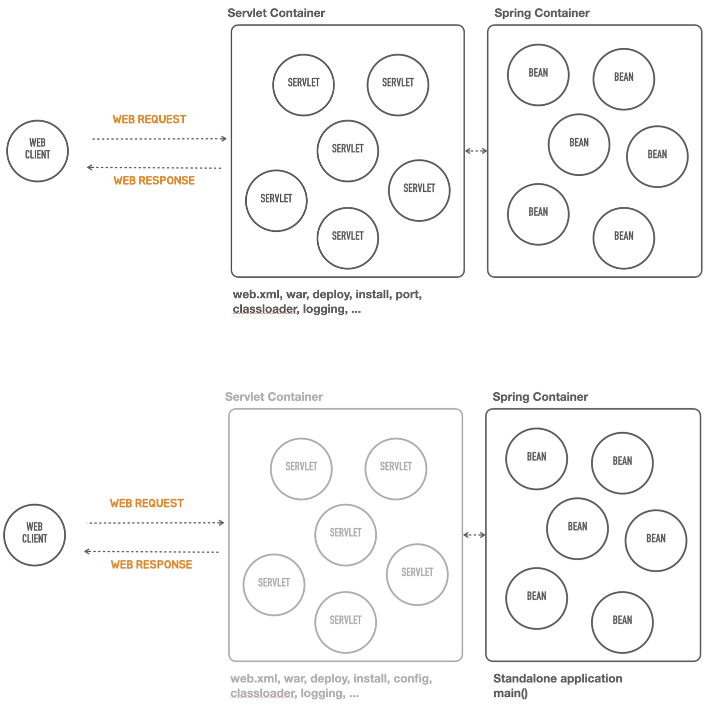

# 2. 스프링 부트 살펴보기

## 스프링 부트 소개

---

- 스프링 부트(Spring Boot): 스프링을 기반으로 실무 환경에 사용 가능한 수준의 독립실행형 애플리케이션을 복잡한 고민 없이 빠르게 작성할 수 있게 도와주는 여러가지 도구의 모음이다.
    
    <aside>
    💡
    
    스프링 ≠ 스프링 부트!!
    
    </aside>
    

### 스프링 부트의 핵심 목표

---

- 매우 빠르고 광범위한 영역의 스프링 개발 경험을 제공
- 강한 주장을 가지고 즉시 적용 가능한 기술 조합을 제공하면서, 필요에 따라 원하는 방식으로 손쉽게 변형 가능
- 프로젝트에서 필요로 하는 다양한 비기능적인 기술(내장형 서버, 보안, 메트릭, 상태 체크, 외부 설정 방식 등) 제공
- 코드 생성이나 XML 설정을 필요로 하지 않음

## 스프링 부트의 역사

---

- 2012년 스프링 프레임워크 프로젝트에 이슈로 등록된 "Containerless 웹 개발 아키텍처의 지원" 요청에서 논의와 개발 시작
    - [https://github.com/spring-projects/spring-framework/issues/14521](https://github.com/spring-projects/spring-framework/issues/14521)
- 2013년 0.5.0.M1 공개
    - [https://spring.io/blog/2013/08/06/spring-boot-simplifying-spring-for-everyone/](https://spring.io/blog/2013/08/06/spring-boot-simplifying-spring-for-everyone/)
- 2014년 1.0 GA 공개
    - [https://spring.io/blog/2014/04/01/spring-boot-1-0-ga-released](https://spring.io/blog/2014/04/01/spring-boot-1-0-ga-released)
- 2018년 2.0 GA 공개
    - [https://spring.io/blog/2018/03/01/spring-boot-2-0-goes-ga](https://spring.io/blog/2018/03/01/spring-boot-2-0-goes-ga)
- 2022년 2.7.5 공개
    - [https://spring.io/blog/2022/10/20/spring-boot-2-7-5-available-now](https://spring.io/blog/2022/10/20/spring-boot-2-7-5-available-now)

## Containerless

---

- 컨테이너리스 개발
    
    
    
    - Web component == Servlet
    - AS-IS(위), 컨테이너리스 TO-BE(아래) ← 스프링부트 적용된 버전
- 스프링 애플리케이션 개발에 요구되는 서블릿 컨테이너의 설치, WAR 폴더 구조, web.xml, WAR 빌드, 컨테이너로 배치, 포트 설정, 클래스로더, 로깅 등과 같은 필요하지만 애플리케이션 개발의 핵심이 아닌 단순 반복 작업을 제거해주는 개발 도구와 아키텍처 지원한다.
    - web.xml 예시
        
        
        
- 설치된 컨테이너로 배포하지 않고 독립실행형(standalone) 자바 애플리케이션으로 동작

## Opinionated

---

### 강한 주장을 가진(opinionated) 도구

---

- 스프링 버전, 스프링 생태계의 프레임워크, 표준 자바 기술, 오픈소스 라이브러리 등의 의존 관계를 확인하고 버전 호환성을 체크하는 작업은 매우 고된 일이고 성공적으로 잘 해내기 쉽지 않다.
- 스프링 부트는 매 버전마다 사용할 기술의 종류를 선정하는 것만으로 사전 검증된 추천 기술과 라이브러리 구성, 의존 관계와 적용할 버전, 각 라이브러리의 세부 구성과 디폴트 설정을 제공한다.
- 스프링 부트를 사용한다면 스프링 부트가 추천하는 구성과 설정을 이용하려는 자세가 필요하다.
- 하지만 원한다면 스프링 부트가 제시한 구성을 오버라이드 하거나 재구성하는 것이 가능한데, 매우 안전하고 명료한 방법을 통해서 원하는 방법으로 재구성할 수 있다.
- 정말 원한다면 스프링 부트로 시작한 프로젝트의 애플리케이션 코드를 전혀 손대지 않고, 스프링 부트를 단계적으로 제거하는 것도 가능하다.
- 개발팀 또는 서비스의 특성에 맞게 스프링 부트 스타일의 도구를 만들어 적용할 수 있는 방법을 제공한다.

### 스프링 프레임워크의 설계 철학

---

- 극단적인 유연함 추구
- 다양한 관점을 수용
- Not opinionated
- 수많은 선택지를 다 포용
- 하지만…
    
    👉 개발자가 호환성까지 고려해서 뭘 사용할지 다 고민해야 한다.
    

### 스프링 부트의 설계 철학

---

- Opinionated - 자기 주장이 강한, 자기 의견을 고집하는, 독선적인
- 일단 정해주는 대로 빠르게 개발하고 고민은 나중에
- 스프링을 잘 활용하는 뛰어난 방법을 제공

### 사용 기술과 의존 라이브러리 결정

---

- 업계에서 검증된 스프링 생태계 프로젝트, 표준 자바 기술, 오픈소스 기술의 종류와 의존관계, 사용 버전을 정해줌
    
    
    
- 각 기술을 스프링에 적용하는 방식(DI 구성)과 디폴트 설정값 제공
    - AS-IS 예제>
        
        
        

### 유연한 확장

---

- 스프링 부트에 내장된 디폴트 구성을 커스토마이징 하는 매우 자연스럽고 유연한 방법 제공
- 스프링 부트가 스프링을 사용하는 방식을 이해한다면 언제라도 스프링 부트를 제거하고 원하는 방식으로 재구성 가능
- 스프링 부트처럼 기술과 구성을 간편하게 제공하는 나만의 모듈 작성

## 스프링 부트의 이해

---

- 스프링 부트가 제공하는 기술 조합과 구성으로 빠르게 시스템 개발을 시작할 수 있다.
- 하지만 스프링 부트가 어떻게, 무엇을 제공하는지를 잘 모르면 작은 기술적인 요구 변화에도 당황하게 된다. 시스템의 발전에 따른 다양한 요구를 수용하기 힘들어진다.
- 스프링 부트를 이해한다는 건 스프링 부트가 제안하는 스프링 사용 방법을 이해하는 것이다. 스프링 부트를 잘 알게 되면 스프링을 더 잘 활용할 수 있다.
- 스프링 부트를 스프링을 사용하는 애플리케이션 개발을 위한 하나의 프레임워크라고 접근할 수 있다.

- 스프링 부트가 현재의 모습을 띠게 되는 과정을 살펴보면서 부트가 동작하는 기본 원리를 살펴보고, 이를 통해서 스프링이 제공하는 기능을 잘 활용하는 방법도 익혀나간다면, 이후 스프링 부트의 다양한 기능을 빠르게 파악하고 활용할 수 있는데 도움이 될 것이다.

### 스프링 부트를 이용한 개발 방법

---

- 부트가 결정한 기술과 구성, 디폴트 설정을 수용
- 외부 설정 파일을 이용한 설정 변경 방법을 활용
- 아주 빠르게 개발을 시작할 수 있다
- 하지만...

### 스프링 부트를 이용한 개발의 오해와 한계

---

- 애플리케이션 기능 코드만 잘 작성하면 된다
- 스프링을 몰라도 개발을 잘 할 수 있다
- 스프링 부트가 직접적으로 보여주지 않는 것은 몰라도 된다
- 뭔가 기술적인 필요가 생기면 검색을 해서 해결한다

### 스프링 부트를 이해하게 되면

---

- 스프링 부트가 스프링의 기술을 어떻게 활용하는지 배우고 응용할 수 있다
- 스프링 부트가 선택한 기술, 자동으로 만들어주는 구성, 디폴트 설정이 어떤 것인지 확인할 수 있다
- 필요할 때 부트의 기본 구성을 수정하거나, 확장할 수 있다
- 나만의 스프링 부트 모듈을 만들어 활용할 수 있다

### 강의에서 살펴볼 내용

---

- 컨테이너 (관련 작업이) 없는 독립실행형 애플리케이션은 어떻게 만드는가
- 다양한 기술을 빠르게 적용하고 이를 유연하게 확장하게 해주는 스프링 부트의 기술은 어떤 것이고 어떻게 동작하는가
- 스프링 부트는 스프링을 어떻게 잘 활용하는가!

### 강의의 목표

---

- 스프링 부트로 만든 스프링 애플리케이션의 기술과 구성 정보를 직접 확인할 수 있다
- 적용 가능한 설정 항목을 파악할 수 있다
- 직접 만든 빈 구성 정보를 적용하고, 그에 따른 변화를 분석할 수 있다
- 스프링 부트의 기술을 꼼꼼히 살펴볼 수 있다

> "프레임워크를 효과적으로 재사용하기 위해서는 프레임워크의 최종 모습뿐만 아니라 현재의 모습을 띠게 되기까지 진화한 과정을 살펴 보는 것이 가장 효과적이다. 프레임워크의 진화 과정 속에는 프레임워크의 구성 원리 및 설계 원칙, 재사용 가능한 컨텍스트와 변경 가능성에 관련된 다양한 정보가 들어 있기 때문이다."
> 
> 
> - 조영호 (프레임워크 3부): http://aeternum.egloos.com/2640343
>
