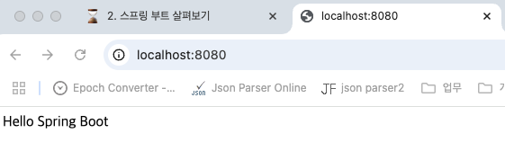

# 3. 스프링 부트 시작하기

## 개발환경 준비

---

- 스프링 부트 개발환경
    - SpringBoot 2.7.6 기준
- JDK: JDK 8, 11, 17 설치
    - 공개 JDK 다운로드 후 설치
        - Eclipse Temurin
        - Microsoft OpenJDK
        - Amazon Corretto
        - Azul JDK
        - Oracle JDK
    - [https://sdkman.io/](https://sdkman.io/)
    - [https://github.com/shyiko/jabba](https://github.com/shyiko/jabba)
- IDE
    - IntelliJ IDEA : https://www.jetbrains.com/idea/download
        - Ultimate
        - Community
    - STS : https://spring.io/tools
    - Visual Studio Code : https://code.visualstudio.com/
- SpringBoot
    - Spring Boot CLI: https://docs.spring.io/spring-boot/docs/2.7.x/reference/htmlsingle/#getting-started.installing.cli

- Spring Boot CLI 실행
    1. `sdk install springboot 2.7.6`
        
        ```powershell
        yoonhee@Yoonhee kyh1126 % sdk install springboot 2.7.6
        
        Downloading: springboot 2.7.6
        
        In progress...
        
        #################################################################################################### 100.0%
        
        Installing: springboot 2.7.6
        Done installing!
        
        Setting springboot 2.7.6 as default.
        yoonhee@Yoonhee kyh1126 % spring
        usage: spring [--help] [--version]
               <command> [<args>]
        
        Available commands are:
        
          run [options] <files> [--] [args]
            Run a spring groovy script
        
          grab
            Download a spring groovy script's dependencies to ./repository
        
          jar [options] <jar-name> <files>
            Create a self-contained executable jar file from a Spring Groovy script
        
          war [options] <war-name> <files>
            Create a self-contained executable war file from a Spring Groovy script
        
          install [options] <coordinates>
            Install dependencies to the lib/ext directory
        
          uninstall [options] <coordinates>
            Uninstall dependencies from the lib/ext directory
        
          init [options] [location]
            Initialize a new project using Spring Initializr (start.spring.io)
        
          encodepassword [options] <password to encode>
            Encode a password for use with Spring Security
        
          shell
            Start a nested shell
        
        Common options:
        
          --debug Verbose mode
            Print additional status information for the command you are running
        
        See 'spring help <command>' for more information on a specific command.
        ```
        
    2. `vi hello.groovy`
        
        ```powershell
        yoonhee@Yoonhee kyh1126 % mkdir myproject
        yoonhee@Yoonhee kyh1126 % cd myproject
        yoonhee@Yoonhee myproject % vi hello.groovy
        @RestController
        class HelloController {
            @GetMapping("/")
            def hello() {
                return "Hello Spring Boot"
            }
        }
        ```
        
    3. `spring run hello.groovy`
        
        ```powershell
        yoonhee@Yoonhee myproject % spring run hello.groovy
        Resolving dependencies.....
        
          .   ____          _            __ _ _
         /\\ / ___'_ __ _ _(_)_ __  __ _ \ \ \ \
        ( ( )\___ | '_ | '_| | '_ \/ _` | \ \ \ \
         \\/  ___)| |_)| | | | | || (_| |  ) ) ) )
          '  |____| .__|_| |_|_| |_\__, | / / / /
         =========|_|==============|___/=/_/_/_/
         :: Spring Boot ::                (v2.7.6)
        
        2024-11-03 20:46:37.312  INFO 68888 --- [       runner-0] o.s.boot.SpringApplication               : Starting application using Java 17.0.11 on Yoonhee with PID 68888 (started by yoonhee in /Users/yoonhee/kyh1126/myproject)
        2024-11-03 20:46:37.315  INFO 68888 --- [       runner-0] o.s.boot.SpringApplication               : No active profile set, falling back to 1 default profile: "default"
        2024-11-03 20:46:37.618  INFO 68888 --- [       runner-0] o.s.b.w.embedded.tomcat.TomcatWebServer  : Tomcat initialized with port(s): 8080 (http)
        2024-11-03 20:46:37.622  INFO 68888 --- [       runner-0] o.apache.catalina.core.StandardService   : Starting service [Tomcat]
        2024-11-03 20:46:37.622  INFO 68888 --- [       runner-0] org.apache.catalina.core.StandardEngine  : Starting Servlet engine: [Apache Tomcat/9.0.69]
        2024-11-03 20:46:37.633  INFO 68888 --- [       runner-0] org.apache.catalina.loader.WebappLoader  : Unknown class loader [org.springframework.boot.cli.compiler.ExtendedGroovyClassLoader$DefaultScopeParentClassLoader@61baa894] of class [class org.springframework.boot.cli.compiler.ExtendedGroovyClassLoader$DefaultScopeParentClassLoader]
        2024-11-03 20:46:37.643  INFO 68888 --- [       runner-0] o.a.c.c.C.[Tomcat].[localhost].[/]       : Initializing Spring embedded WebApplicationContext
        2024-11-03 20:46:37.643  INFO 68888 --- [       runner-0] w.s.c.ServletWebServerApplicationContext : Root WebApplicationContext: initialization completed in 271 ms
        2024-11-03 20:46:37.690  WARN 68888 --- [       runner-0] o.s.b.a.AutoConfigurationPackages        : @EnableAutoConfiguration was declared on a class in the default package. Automatic @Repository and @Entity scanning is not enabled.
        2024-11-03 20:46:37.834  INFO 68888 --- [       runner-0] o.s.b.w.embedded.tomcat.TomcatWebServer  : Tomcat started on port(s): 8080 (http) with context path ''
        2024-11-03 20:46:37.838  INFO 68888 --- [       runner-0] o.s.boot.SpringApplication               : Started application in 0.672 seconds (JVM running for 6.225)
        ```
        
    4. 실행
        
        
        

## 프로젝트 생성

---

- HelloBoot 웹 프로젝트 생성
    - 스프링 부트 프로젝트 생성
        - 웹 Spring Initializr - https://start.spring.io/
            
            
            
        - IDE의 Spring Initializr 프로젝트 생성 메뉴
            
            
            
        - Spring Boot CLI
            - `init --list`: 사용 가능한 디펜던시 보여준다
            
            ```powershell
            yoonhee@Yoonhee kyh1126 % mkdir tobyspring
            yoonhee@Yoonhee kyh1126 % spring shell
            Spring Boot (v2.7.6)
            Hit TAB to complete. Type 'help' and hit RETURN for help, and 'exit' to quit.
            $ init --list
            ...
            Parameters
            +-------------+------------------------------------------+------------------------------+
            | Id          | Description                              | Default value                |
            +-------------+------------------------------------------+------------------------------+
            | artifactId  | project coordinates (infer archive name) | demo                         |
            | bootVersion | spring boot version                      | 3.3.5                        |
            | description | project description                      | Demo project for Spring Boot |
            | groupId     | project coordinates                      | com.example                  |
            | javaVersion | language level                           | 17                           |
            | language    | programming language                     | java                         |
            | name        | project name (infer application name)    | demo                         |
            | packageName | root package                             | com.example.demo             |
            | packaging   | project packaging                        | jar                          |
            | type        | project type                             | gradle-project               |
            | version     | project version                          | 0.0.1-SNAPSHOT               |
            +-------------+------------------------------------------+------------------------------+
            
            $ init -b 2.7.6 -d web -g tobyspring -j 11 -n helloboot -x helloboot
            Using service at https://start.spring.io
            Project extracted to '/Users/yoonhee/kyh1126/helloboot'
            $ exit
            yoonhee@Yoonhee kyh1126 % cd helloboot
            yoonhee@Yoonhee helloboot % ./gradlew bootRun
            Downloading https://services.gradle.org/distributions/gradle-8.10.2-bin.zip
            .............10%.............20%.............30%.............40%.............50%.............60%.............70%.............80%.............90%.............100%
            
            Welcome to Gradle 8.10.2!
            
            Here are the highlights of this release:
             - Support for Java 23
             - Faster configuration cache
             - Better configuration cache reports
            
            For more details see https://docs.gradle.org/8.10.2/release-notes.html
            
            Starting a Gradle Daemon (subsequent builds will be faster)
            
            > Task :bootRun
            
              .   ____          _            __ _ _
             /\\ / ___'_ __ _ _(_)_ __  __ _ \ \ \ \
            ( ( )\___ | '_ | '_| | '_ \/ _` | \ \ \ \
             \\/  ___)| |_)| | | | | || (_| |  ) ) ) )
              '  |____| .__|_| |_|_| |_\__, | / / / /
             =========|_|==============|___/=/_/_/_/
             :: Spring Boot ::                (v3.2.0)
            
            2024-11-03T21:10:40.568+09:00  INFO 69718 --- [helloboot] [           main] t.helloboot.HellobootApplication         : Starting HellobootApplication using Java 17.0.11 with PID 69718 (/Users/yoonhee/kyh1126/helloboot/build/classes/java/main started by yoonhee in /Users/yoonhee/kyh1126/helloboot)
            2024-11-03T21:10:40.569+09:00  INFO 69718 --- [helloboot] [           main] t.helloboot.HellobootApplication         : No active profile set, falling back to 1 default profile: "default"
            2024-11-03T21:10:40.798+09:00  INFO 69718 --- [helloboot] [           main] o.s.b.w.embedded.tomcat.TomcatWebServer  : Tomcat initialized with port 8080 (http)
            2024-11-03T21:10:40.801+09:00  INFO 69718 --- [helloboot] [           main] o.apache.catalina.core.StandardService   : Starting service [Tomcat]
            2024-11-03T21:10:40.801+09:00  INFO 69718 --- [helloboot] [           main] o.apache.catalina.core.StandardEngine    : Starting Servlet engine: [Apache Tomcat/10.1.16]
            2024-11-03T21:10:40.820+09:00  INFO 69718 --- [helloboot] [           main] o.a.c.c.C.[Tomcat].[localhost].[/]       : Initializing Spring embedded WebApplicationContext
            2024-11-03T21:10:40.820+09:00  INFO 69718 --- [helloboot] [           main] w.s.c.ServletWebServerApplicationContext : Root WebApplicationContext: initialization completed in 237 ms
            2024-11-03T21:10:40.902+09:00  INFO 69718 --- [helloboot] [           main] o.s.b.w.embedded.tomcat.TomcatWebServer  : Tomcat started on port 8080 (http) with context path ''
            2024-11-03T21:10:40.905+09:00  INFO 69718 --- [helloboot] [           main] t.helloboot.HellobootApplication         : Started HellobootApplication in 0.44 seconds (process running for 0.535)
            ```
            
            - Spring Boot가 뿌려주는 정상적인 에러 화면
                
                
                
    - 생성 옵션
        - Project: Gradle
        - Langauge: Java
        - SpringBoot Version: 2.7.6
        - Group Id: tobyspring
        - Name: hello
        - Packaging: Jar
        - Java Version: 11
        - Dependency: Web
    - 생성된 myboot 프로젝트 빌드와 실행
        - zip 파일로 생성된 경우엔 압축을 풀어준다
        - 프로젝트 루트에서 다음 명령을 실행(윈도우에서는 `gradlew.bat`)
            
            ```powershell
            ./gradlew bootRun
            ```
            
        - 웹 브라우저에서 다음과 같이 404 메시지가 뜨면 생성된 스프링 부트 애플리케이션이 정상적으로 빌드와 실행된 것임을 알 수 있다.
        
        <aside>
        💡
        
        Gradle과 IDE의 빌드와 실행 옵션이 미묘하게 다르게 설정되는 경우가 있으니 주의. IDE에서 프로젝트를 오픈한 뒤에 프로젝트 자바 버전을 확인하자. Gradle의 자바 버전도 확인한다.
        
        </aside>
        

## Hello 컨트롤러

---

```java
package tobyspring.helloboot;

import org.springframework.web.bind.annotation.GetMapping;
import org.springframework.web.bind.annotation.RestController;

@RestController
public class HelloController {
    @GetMapping("/hello")
    public String hello(String name) {
        return "Hello " + name;
    }
}
```

- 쿼리스트링으로 name 전달해준다.
- 실행
    
    
    
- 프로젝트 디렉토리로 가서 `idea .` 해도 IntelliJ 가 열린다.

## Hello API 테스트

---

- hello() 컨트롤러 메소드를 호출할 수 있는 HTTP Request를 생성하고 리턴되는 HTTP Response를 확인한다.
    - HTTP 요청을 만들고 응답을 확인하는 데 사용되는 도구
        - 웹 브라우저 개발자 도구
        - curl
        - HTTPie
            
            ```powershell
            yoonhee@Yoonhee helloboot % http -v ":8080/hello?name=Spring"
            GET /hello?name=Spring HTTP/1.1
            Accept: */*
            Accept-Encoding: gzip, deflate
            Connection: keep-alive
            Host: localhost:8080
            User-Agent: HTTPie/3.2.3
            
            HTTP/1.1 200 
            Connection: keep-alive
            Content-Length: 12
            Content-Type: text/plain;charset=UTF-8
            Date: Sun, 03 Nov 2024 12:22:00 GMT
            Keep-Alive: timeout=60
            
            Hello Spring
            ```
            
        - IntelliJ IDEA Ultimate - http request
        - Postman API Platform
        - JUnit Test
        - 각종 API 테스트 도구

## HTTP 요청과 응답

---

- 웹 Request와 Response의 기본 구조를 이해하고 내용을 확인할 수 있어야 한다.
- Request
    - Request Line: Method, Path, HTTP Version
    - Headers
    - Message Body
- Response
    - Status Line: HTTP Version, Status Code, Status Text
    - Headers
    - Message Body
