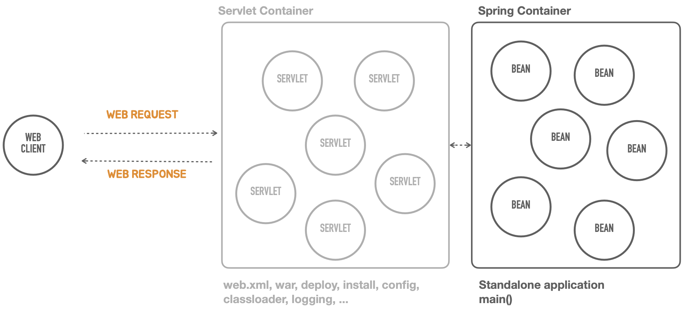

# 4. 독립 실행형 서블릿 애플리케이션

## Containerless 개발 준비

---

- 컨테이너 설치와 배포 등의 작업을 하지 않고 서블릿 컨테이너를 동작시키는 방법을 코드로 구현해본다.
- 스프링 부트가 사용하는 것으로 보이는 다음 두 라인을 제거하고 빈 main() 메소드만 남긴다
    
    ```java
    @SpringBootApplication
    SpringApplication.run(HellobootApplication.class, args);
    ```
    

## 서블릿 컨테이너 띄우기

---

- 아래 사진과 같이, 서블릿 컨테이너 없이 Standalone 으로 만들어야 한다.
    
    
    

- 스프링 부트 프로젝트를 만들 때 `web` 모듈을 선택하면 다음과 같은 내장형 톰캣 라이브러리가 추가된다.
    
    
    
- 내장형 톰캣 초기화 작업과 간편한 설정을 지원하도록 스프링 부트가 제공하는 `TomcatServletWebServerFactory`를 사용하면 톰캣 웹 서버(서블릿 컨테이너)를 실행하는 코드를 만들 수 있다.
    
    ```java
    package tobyspring.helloboot;
    
    import org.apache.catalina.startup.Tomcat;
    import org.springframework.boot.SpringApplication;
    import org.springframework.boot.autoconfigure.SpringBootApplication;
    import org.springframework.boot.web.embedded.tomcat.TomcatServletWebServerFactory;
    import org.springframework.boot.web.server.WebServer;
    import org.springframework.boot.web.servlet.server.ServletWebServerFactory;
    
    //@SpringBootApplication
    public class HellobootApplication {
    
    	public static void main(String[] args) {
    //		SpringApplication.run(HellobootApplication.class, args);
    		ServletWebServerFactory serverFactory = new TomcatServletWebServerFactory();
    		WebServer webServer = serverFactory.getWebServer();
    		webServer.start();
    	}
    
    }
    ```
    

- 실행
    
    ```powershell
    PM 7:08:38: Executing ':HellobootApplication.main()'...
    
    Starting Gradle Daemon...
    Gradle Daemon started in 1 s 34 ms
    > Task :compileJava
    > Task :processResources UP-TO-DATE
    > Task :classes
    
    > Task :HellobootApplication.main()
    19:08:44.516 [main] DEBUG org.springframework.boot.web.embedded.tomcat.TomcatServletWebServerFactory - Code archive: /Users/yoonhee/.gradle/caches/modules-2/files-2.1/org.springframework.boot/spring-boot/2.7.6/f96f89eba708a591704db5dcbfc03e8822a503aa/spring-boot-2.7.6.jar
    19:08:44.517 [main] DEBUG org.springframework.boot.web.embedded.tomcat.TomcatServletWebServerFactory - Code archive: /Users/yoonhee/.gradle/caches/modules-2/files-2.1/org.springframework.boot/spring-boot/2.7.6/f96f89eba708a591704db5dcbfc03e8822a503aa/spring-boot-2.7.6.jar
    19:08:44.517 [main] DEBUG org.springframework.boot.web.embedded.tomcat.TomcatServletWebServerFactory - None of the document roots [src/main/webapp, public, static] point to a directory and will be ignored.
    19:08:44.529 [main] INFO org.springframework.boot.web.embedded.tomcat.TomcatWebServer - Tomcat initialized with port(s): 8080 (http)
    19:08:44.616 [main] INFO org.springframework.boot.web.embedded.tomcat.TomcatWebServer - Tomcat started on port(s): 8080 (http) with context path ''
    11월 10, 2024 7:08:44 오후 org.apache.coyote.AbstractProtocol init
    정보: Initializing ProtocolHandler ["http-nio-8080"]
    11월 10, 2024 7:08:44 오후 org.apache.catalina.core.StandardService startInternal
    정보: Starting service [Tomcat]
    11월 10, 2024 7:08:44 오후 org.apache.catalina.core.StandardEngine startInternal
    정보: Starting Servlet engine: [Apache Tomcat/9.0.69]
    11월 10, 2024 7:08:44 오후 org.apache.coyote.AbstractProtocol start
    정보: Starting ProtocolHandler ["http-nio-8080"]
    ```
    
- HTTP 요청
    
    ```powershell
    yoonhee@Yoonhee helloboot % http -v :8080
    GET / HTTP/1.1
    Accept: */*
    Accept-Encoding: gzip, deflate
    Connection: keep-alive
    Host: localhost:8080
    User-Agent: HTTPie/3.2.3
    
    HTTP/1.1 404 
    Connection: keep-alive
    Content-Language: en
    Content-Length: 682
    Content-Type: text/html;charset=utf-8
    Date: Sun, 10 Nov 2024 10:09:31 GMT
    Keep-Alive: timeout=60
    
    <!doctype html><html lang="en"><head><title>HTTP Status 404 – Not Found</title><style type="text/css">body {font-family:Tahoma,Arial,sans-serif;} h1, h2, h3, b {color:white;background-color:#525D76;} h1 {font-size:22px;} h2 {font-size:16px;} h3 {font-size:14px;} p {font-size:12px;} a {color:black;} .line {height:1px;background-color:#525D76;border:none;}</style></head><body><h1>HTTP Status 404 – Not Found</h1><hr class="line" /><p><b>Type</b> Status Report</p><p><b>Description</b> The origin server did not find a current representation for the target resource or is not willing to disclose that one exists.</p><hr class="line" /><h3>Apache Tomcat/9.0.69</h3></body></html>
    ```
    

## 서블릿 등록

---


- Request
    - Request Line: Method, Path, HTTP Version
    - Headers
    - Message Body
- Response
    - Status Line: HTTP Version, Status Code, Status Text
    - Headers
    - Message Body

- 코드에서 서블릿을 등록하려면 `ServletContext`가 필요하다. `ServletContext`를 전달해서 서블릿 등록과 같은 초기화 작업을 할 때는 `ServletContextInitializer`를 구현한 오브젝트를 `ServletWebServerFactory`의 `getWebServer()` 메소드에 전달한다.
    - `ServletContextInitializer`는 `@FunctionalInterface`이므로 람다식으로 전환해서 사용하면 편리하다.
        
        ```java
        @FunctionalInterface
        public interface ServletContextInitializer {
            void onStartup(ServletContext servletContext) throws ServletException;
        }
        ```
        

- 서블릿은 `HttpServlet` 클래스를 상속해서 필요한 메소드를 오버라이딩 하는 방식으로 만들 수 있다.
    - [https://docs.oracle.com/javaee/7/api/javax/servlet/http/HttpServlet.html](https://docs.oracle.com/javaee/7/api/javax/servlet/http/HttpServlet.html)

- 서블릿을 등록할 때는 서블릿 이름과 서블릿 오브젝트를 이용한다. 서블릿 등록 정보에는 매핑할 URL 정보를 지정해야 한다.
    
    ```java
    servletContext.addServlet("hello", new HttpServlet() {
        @Override
        protected void service(HttpServletRequest req, HttpServletResponse resp) throws ServletException, IOException {
        }
    }).addMapping("/hello");
    ```
    

- 서블릿에서는 `HttpServletRequest`를 이용해서 요청 정보를 가져오고, `HttpServletResponse`를 이용해서 응답을 만드는 작업을 수행한다.
    - 3가지 요소(상태 코드, 헤더, 바디)를 이용해서 웹 요청을 생성한다.
        
        ```java
        resp.setStatus(HttpStatus.OK.value());
        resp.setHeader(HttpHeaders.CONTENT_TYPE, MediaType.TEXT_PLAIN_VALUE);
        resp.getWriter().println("Hello Servlet");
        ```
        
    - 상태코드가 OK인 경우엔 생략이 가능하다.
    - ContentType을 헤더를 지정할 때는 `setContentType()` 메소드를 이용할 수 있다.
        
        ```java
        resp.setContentType(MediaType.TEXT_PLAIN_VALUE);
        ```
        

### 실습

---

- HellobootApplication.java
    
    ```java
    package tobyspring.helloboot;
    
    import org.springframework.boot.web.embedded.tomcat.TomcatServletWebServerFactory;
    import org.springframework.boot.web.server.WebServer;
    import org.springframework.boot.web.servlet.ServletContextInitializer;
    import org.springframework.boot.web.servlet.server.ServletWebServerFactory;
    
    import javax.servlet.ServletContext;
    import javax.servlet.ServletException;
    import javax.servlet.http.HttpServlet;
    import javax.servlet.http.HttpServletRequest;
    import javax.servlet.http.HttpServletResponse;
    import java.io.IOException;
    
    //@SpringBootApplication
    public class HellobootApplication {
    
        public static void main(String[] args) {
    //		SpringApplication.run(HellobootApplication.class, args);
            ServletWebServerFactory serverFactory = new TomcatServletWebServerFactory();
            WebServer webServer = serverFactory.getWebServer(new ServletContextInitializer() {
                @Override
                public void onStartup(ServletContext servletContext) throws ServletException {
                    servletContext.addServlet("hello", new HttpServlet() {
                        @Override
                        protected void service(HttpServletRequest req, HttpServletResponse resp) throws ServletException, IOException {
    //                        super.service(req, resp);
                            resp.setStatus(200);
                            resp.setHeader("Content-Type", "text/plain");
                            resp.getWriter().println("Hello Servlet");
                        }
                    }).addMapping("/hello");
                }
    
            });
            webServer.start();
        }
    
    }
    ```
    
- HTTP 요청
    
    ```powershell
    yoonhee@Yoonhee helloboot % http -v :8080/hello                                           
    GET /hello HTTP/1.1
    Accept: */*
    Accept-Encoding: gzip, deflate
    Connection: keep-alive
    Host: localhost:8080
    User-Agent: HTTPie/3.2.3
    
    HTTP/1.1 200 
    Connection: keep-alive
    Content-Length: 14
    Content-Type: text/plain;charset=ISO-8859-1
    Date: Sun, 10 Nov 2024 10:45:39 GMT
    Keep-Alive: timeout=60
    
    Hello Servlet
    ```
    

## 서블릿 요청 처리

---

- 웹 클라이언트로부터 전달 받은 요청 정보를 서블릿 기능을 작성할 때 활용할 수 있다.
    - 대표적으로 URL 등으로 전달된 파라미터 값을 추출해서 사용하는 방법이 있다.
- `HttpServletRequest`에서 `name` 파라미터의 값을 가져올 때는 `getParameter()` 메소드를 이용한다.
    
    ```java
    String name = req.getParameter("name");
    ```
    
    - 요청으로부터 가져온 정보를 활용해서 웹 애플리케이션 로직을 수행하는 코드를 작성한다.

### 실습

---

- HellobootApplication.java
    
    ```java
    package tobyspring.helloboot;
    
    import org.springframework.boot.web.embedded.tomcat.TomcatServletWebServerFactory;
    import org.springframework.boot.web.server.WebServer;
    import org.springframework.boot.web.servlet.server.ServletWebServerFactory;
    import org.springframework.http.HttpHeaders;
    import org.springframework.http.HttpStatus;
    import org.springframework.http.MediaType;
    
    import javax.servlet.ServletException;
    import javax.servlet.http.HttpServlet;
    import javax.servlet.http.HttpServletRequest;
    import javax.servlet.http.HttpServletResponse;
    import java.io.IOException;
    
    //@SpringBootApplication
    public class HellobootApplication {
    
        public static void main(String[] args) {
    //		SpringApplication.run(HellobootApplication.class, args);
            ServletWebServerFactory serverFactory = new TomcatServletWebServerFactory();
            WebServer webServer = serverFactory.getWebServer(servletContext -> {
                servletContext.addServlet("hello",
                        new HttpServlet() {
                            @Override
                            protected void service(HttpServletRequest req, HttpServletResponse resp) throws ServletException, IOException {
                                String name = req.getParameter("name");
    
                                resp.setStatus(HttpStatus.OK.value());
                                resp.setHeader(HttpHeaders.CONTENT_TYPE, MediaType.TEXT_PLAIN_VALUE);
                                resp.getWriter().println("Hello " + name);
                            }
                        }).addMapping("/hello");
    
            });
            webServer.start();
        }
    
    }
    ```
    
- HTTP 요청
    
    ```powershell
    yoonhee@Yoonhee helloboot % http -v ":8080/hello?name=Spring"
    GET /hello?name=Spring HTTP/1.1
    Accept: */*
    Accept-Encoding: gzip, deflate
    Connection: keep-alive
    Host: localhost:8080
    User-Agent: HTTPie/3.2.3
    
    HTTP/1.1 200 
    Connection: keep-alive
    Content-Length: 13
    Content-Type: text/plain;charset=ISO-8859-1
    Date: Sun, 10 Nov 2024 10:54:08 GMT
    Keep-Alive: timeout=60
    
    Hello Spring
    ```
    

## 프론트 컨트롤러

---


- 프론트 컨트롤러 패턴: 여러 요청을 처리하는데 반복적으로 등장하게 되는 공통 작업을 하나의 오브젝트에서 일괄적으로 처리하게 만드는 방식
    - [https://martinfowler.com/eaaCatalog/frontController.html](https://martinfowler.com/eaaCatalog/frontController.html)
    - 인증, 보안, 다국어처리, 공통 기능 등이 주로 프론트 컨트롤러 패턴으로 자리잡았다.
- 서블릿을 프론트 컨트롤러로 만들려면 모든 요청, 혹은 일정 패턴을 가진 요청을 하나의 서블릿이 담당하도록 매핑해준다.

## 프론트 컨트롤러로 전환

---

- 프론트 컨트롤러가 모든 URL을 다 처리할 수 있도록 서블릿 바인딩을 변경한다.
    
    ```java
    }).addMapping("/*");
    ```
    

- 서블릿 내에서 HTTP 요청 정보를 이용해서 각 요청을 분리한다. 만약 처리할 수 있는 HTTP 요청 정보가 없다면 상태 코드를 404로 설정한다.
    
    ```java
    if (req.getRequestURI().equals("/hello") && req.getMethod().equals(HttpMethod.GET.name())) {
        // ...
    }
    else if (req.getRequestURI().equals("/user")) {
        // ...
    }
    else {
        resp.setStatus(HttpStatus.NOT_FOUND.value());
    }
    ```
    

### 실습

---

- HellobootApplication.java
    
    ```java
    package tobyspring.helloboot;
    
    import org.springframework.boot.web.embedded.tomcat.TomcatServletWebServerFactory;
    import org.springframework.boot.web.server.WebServer;
    import org.springframework.boot.web.servlet.server.ServletWebServerFactory;
    import org.springframework.http.HttpHeaders;
    import org.springframework.http.HttpMethod;
    import org.springframework.http.HttpStatus;
    import org.springframework.http.MediaType;
    
    import javax.servlet.ServletException;
    import javax.servlet.http.HttpServlet;
    import javax.servlet.http.HttpServletRequest;
    import javax.servlet.http.HttpServletResponse;
    import java.io.IOException;
    
    //@SpringBootApplication
    public class HellobootApplication {
    
        public static void main(String[] args) {
    //		SpringApplication.run(HellobootApplication.class, args);
            ServletWebServerFactory serverFactory = new TomcatServletWebServerFactory();
            WebServer webServer = serverFactory.getWebServer(servletContext -> {
                servletContext.addServlet("frontcontroller",
                        new HttpServlet() {
                            @Override
                            protected void service(HttpServletRequest req, HttpServletResponse resp) throws ServletException, IOException {
                                // 인증, 보안, 다국어, 공통 기능
                                if (req.getRequestURI().equals("/hello") && req.getMethod().equals(HttpMethod.GET.name())) {
    
                                    String name = req.getParameter("name");
    
                                    resp.setStatus(HttpStatus.OK.value());
                                    resp.setHeader(HttpHeaders.CONTENT_TYPE, MediaType.TEXT_PLAIN_VALUE);
                                    resp.getWriter().println("Hello " + name);
                                } else if (req.getRequestURI().equals("/user")) {
                                    // ...
                                    resp.setStatus(HttpStatus.OK.value());
                                } else {
                                    resp.setStatus(HttpStatus.NOT_FOUND.value());
                                }
                            }
                        }).addMapping("/*");
            });
            webServer.start();
        }
    
    }
    ```
    
- HTTP 요청
    
    ```powershell
    yoonhee@Yoonhee helloboot % http -v POST ":8080/hello?name=Spring"
    POST /hello?name=Spring HTTP/1.1
    Accept: */*
    Accept-Encoding: gzip, deflate
    Connection: keep-alive
    Content-Length: 0
    Host: localhost:8080
    User-Agent: HTTPie/3.2.3
    
    HTTP/1.1 404 
    Connection: keep-alive
    Content-Length: 0
    Date: Sun, 10 Nov 2024 11:02:16 GMT
    Keep-Alive: timeout=60
    ```
    

## Hello 컨트롤러 매핑과 바인딩

---

- 프론트 컨트롤러가 요청을 분석해서 처리할 요청을 구분한 뒤에 이를 처리할 핸들러(컨트롤러 메소드)로 요청을 전달한다. 핸들러가 처리하고 돌려준 리턴 값을 해석해서 웹 요청을 생성한다.
- 프론트 컨트롤러의 두 가지 중요한 기능
    - 매핑: 프론트 컨트롤러가 HTTP 요청을 처리할 핸들러를 결정하고 연동하는 작업
    - 바인딩: 핸들러에게 웹 요청 정보를 추출하고 의미있는 오브젝트에 담아서 전달하는 작업
    
    ```java
    if (req.getRequestURI().equals("/hello") && req.getMethod().equals(HttpMethod.GET.name())) {
        String name = req.getParameter("name");
        
        String ret = helloController.hello(name);
        
        resp.setStatus(HttpStatus.OK.value());
        resp.setHeader(HttpHeaders.CONTENT_TYPE, MediaType.TEXT_PLAIN_VALUE);
        resp.getWriter().println(ret);
    }
    ```
    

- 매핑과 바인딩은 세밀한 규칙을 부여하면 매번 코드를 작성하지 않고도 공통 코드를 이용해서 이를 처리할 수 있도록 만들 수 있다.

### 실습

---

- HellobootApplication.java
    
    ```java
    package tobyspring.helloboot;
    
    import org.springframework.boot.web.embedded.tomcat.TomcatServletWebServerFactory;
    import org.springframework.boot.web.server.WebServer;
    import org.springframework.boot.web.servlet.server.ServletWebServerFactory;
    import org.springframework.http.HttpHeaders;
    import org.springframework.http.HttpMethod;
    import org.springframework.http.HttpStatus;
    import org.springframework.http.MediaType;
    
    import javax.servlet.ServletException;
    import javax.servlet.http.HttpServlet;
    import javax.servlet.http.HttpServletRequest;
    import javax.servlet.http.HttpServletResponse;
    import java.io.IOException;
    
    //@SpringBootApplication
    public class HellobootApplication {
    
        public static void main(String[] args) {
    //		SpringApplication.run(HellobootApplication.class, args);
            ServletWebServerFactory serverFactory = new TomcatServletWebServerFactory();
            WebServer webServer = serverFactory.getWebServer(servletContext -> {
                HelloController helloController = new HelloController();
    
                servletContext.addServlet("frontcontroller",
                        new HttpServlet() {
                            @Override
                            protected void service(HttpServletRequest req, HttpServletResponse resp) throws ServletException, IOException {
                                // 인증, 보안, 다국어, 공통 기능
                                if (req.getRequestURI().equals("/hello") && req.getMethod().equals(HttpMethod.GET.name())) {
                                    String name = req.getParameter("name");
    
                                    String ret = helloController.hello(name);
    
                                    resp.setStatus(HttpStatus.OK.value());
                                    resp.setHeader(HttpHeaders.CONTENT_TYPE, MediaType.TEXT_PLAIN_VALUE);
                                    resp.getWriter().println(ret);
                                } else if (req.getRequestURI().equals("/user")) {
                                    // ...
                                    resp.setStatus(HttpStatus.OK.value());
                                } else {
                                    resp.setStatus(HttpStatus.NOT_FOUND.value());
                                }
                            }
                        }).addMapping("/*");
            });
            webServer.start();
        }
    
    }
    ```
    
- HelloController.java
    
    ```java
    package tobyspring.helloboot;
    
    import org.springframework.web.bind.annotation.GetMapping;
    import org.springframework.web.bind.annotation.RestController;
    
    //@RestController
    public class HelloController {
    //    @GetMapping("/hello")
        public String hello(String name) {
            return "Hello " + name;
        }
    }
    ```
    
- HTTP 요청
    
    ```powershell
    yoonhee@Yoonhee helloboot % http -v ":8080/hello?name=Spring"     
    GET /hello?name=Spring HTTP/1.1
    Accept: */*
    Accept-Encoding: gzip, deflate
    Connection: keep-alive
    Host: localhost:8080
    User-Agent: HTTPie/3.2.3
    
    HTTP/1.1 200 
    Connection: keep-alive
    Content-Length: 13
    Content-Type: text/plain;charset=ISO-8859-1
    Date: Sun, 10 Nov 2024 11:06:07 GMT
    Keep-Alive: timeout=60
    
    Hello Spring
    ```
