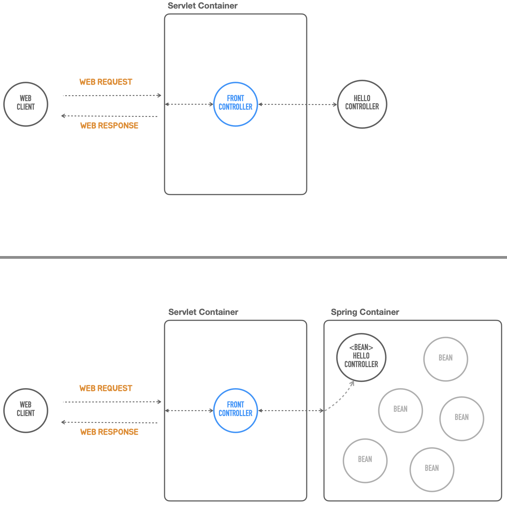

# 5. 독립 실행형 스프링 애플리케이션

## 스프링 컨테이너 사용

---

- 서블릿 컨테이너(FrontController)에서 생성해서 쓰는 것이 아닌, 스프링 컨테이너에 만들어 놓고 사용한다.
    
    
    
    - 스프링 컨테이너는 애플리케이션 로직이 담긴 평범한 자바 오브젝트, 일명 POJO와 구성 정보(Configuration Metadata)를 런타임에 조합해서 동작하는 최종 애플리케이션을 만들어낸다.
        
        
        

- 코드로 스프링 컨테이너를 만드는 가장 간단한 방법은 컨테이너를 대표하는 인터페이스인 `ApplicationContext`를 구현한 `GenericApplicationContext`를 이용하는 것이다.
    - 이를 통해서 컨테이너에 등록할 빈 오브젝트 클래스 정보를 직접 등록할 수 있다. 이를 참고해서 컨테이너가 빈 오브젝트를 직접 생성한다.
        
        ```java
        GenericApplicationContext applicationContext = new GenericApplicationContext();
        applicationContext.registerBean(HelloController.class);
        applicationContext.refresh();
        ```
        
        - 컨테이너에 필요한 정보를 등록하고 `refresh()`를 이용해서 초기화 작업을 진행한다.
            
            → `ApplicationContext`가 빈 오브젝트를 다 만들어준다.
            
- ApplicationContext의 getBean() 메소드를 이용해서 컨테이너가 관리하는 빈 오브젝트를 가져올 수 있다. 빈의 타입(클래스, 인터페이스) 정보를 이용해서 해당 타입의 빈을 요청한다.
    
    ```java
    HelloController helloController = applicationContext.getBean(HelloController.class);
    ```
    

### 실습

---

- HellobootApplication.java
    
    ```java
    package tobyspring.helloboot;
    
    import org.springframework.boot.web.embedded.tomcat.TomcatServletWebServerFactory;
    import org.springframework.boot.web.server.WebServer;
    import org.springframework.boot.web.servlet.server.ServletWebServerFactory;
    import org.springframework.context.ApplicationContext;
    import org.springframework.context.support.GenericApplicationContext;
    import org.springframework.http.HttpMethod;
    import org.springframework.http.HttpStatus;
    import org.springframework.http.MediaType;
    
    import javax.servlet.ServletException;
    import javax.servlet.http.HttpServlet;
    import javax.servlet.http.HttpServletRequest;
    import javax.servlet.http.HttpServletResponse;
    import java.io.IOException;
    
    //@SpringBootApplication
    public class HellobootApplication {
    
        public static void main(String[] args) {
            GenericApplicationContext applicationContext = new GenericApplicationContext();
            applicationContext.registerBean(HelloController.class);
            applicationContext.refresh();
    
            ServletWebServerFactory serverFactory = new TomcatServletWebServerFactory();
            WebServer webServer = serverFactory.getWebServer(servletContext -> {
    
                servletContext.addServlet("frontcontroller",
                        new HttpServlet() {
                            @Override
                            protected void service(HttpServletRequest req, HttpServletResponse resp) throws ServletException, IOException {
                                // 인증, 보안, 다국어, 공통 기능
                                if (req.getRequestURI().equals("/hello") && req.getMethod().equals(HttpMethod.GET.name())) {
                                    String name = req.getParameter("name");
    
                                    HelloController helloController = applicationContext.getBean(HelloController.class);
                                    String ret = helloController.hello(name);
    
                                    resp.setContentType(MediaType.TEXT_PLAIN_VALUE);
                                    resp.getWriter().println(ret);
                                } else {
                                    resp.setStatus(HttpStatus.NOT_FOUND.value());
                                }
                            }
                        }).addMapping("/*");
            });
            webServer.start();
        }
    
    }
    ```
    

## 의존 오브젝트 추가

---

- 스프링 컨테이너는 싱글톤 패턴과 유사하게 애플리케이션이 동작하는 동안 딱 하나의 오브젝트만을 만들고 사용되게 만들어준다. 이런 면에서 스프링 컨테이너는 싱글톤 레지스트리라고도 한다.
- HelloController가 기능을 의존해서 사용하는 SimpleHelloService라는 클래스를 작성한다. 이 클래스의 오브젝트가 필요한데, 일단 이 작업은 HelloController에서 진행하도록 한다.
    
    ```java
    public String Hello(String name) {
        SimpleHelloService helloService = new SimpleHelloService();
        
        return helloService.sayHello(Objects.requireNonNull(name));
    }
    ```
    

### 실습

---

- HelloController.java
    
    ```java
    package tobyspring.helloboot;
    
    import java.util.Objects;
    
    public class HelloController {
        public String hello(String name) {
            SimpleHelloService helloService = new SimpleHelloService();
    
            return helloService.sayHello(Objects.requireNonNull(name));
        }
    }
    ```
    
- SimpleHelloService.java
    
    ```java
    package tobyspring.helloboot;
    
    public class SimpleHelloService {
        String sayHello(String name) {
            return "Hello " + name;
        }
    }
    
    ```
    
- HTTP 요청
    
    ```powershell
    yoonhee@Yoonhee helloboot % http -v ":8080/hello?name=Spring"                         
    GET /hello?name=Spring HTTP/1.1
    Accept: */*
    Accept-Encoding: gzip, deflate
    Connection: keep-alive
    Host: localhost:8080
    User-Agent: HTTPie/3.2.3
    
    HTTP/1.1 200 
    Connection: keep-alive
    Content-Length: 13
    Content-Type: text/plain;charset=ISO-8859-1
    Date: Mon, 18 Nov 2024 11:49:25 GMT
    Keep-Alive: timeout=60
    
    Hello Spring
    ```
    

## Dependency Injection

---

- 스프링 컨테이너는 DI 컨테이너이다. 스프링은 DI를 적극적으로 활용해서 만들어져 있고, 스프링을 이용해서 애플리케이션을 개발할 때 DI를 손쉽게 적용할 수 있도록 지원해준다.

- DI에는 두 개의 오브젝트가 동적으로 의존관계를 가지는 것을 도와주는 제3의 존재가 필요하다 → 어셈블러
    
    
    
- 스프링 컨테이너는 DI를 가능하게 해주는 어셈블러로 동작한다.
    - 코드 레벨의 의존관계 주입을 없앤다.
    
    
    

## 의존 오브젝트 DI 적용

---

- 의존 오브젝트를 생성자를 통해서 DI 어셈블러인 컨테이너가 주입을 할 수 있게 생성자 파라미터를 정의한다. 주입받은 오브젝트는 내부 멤버 필드로 저장해두고 이용할 수 있게 한다.
    
    ```java
    public class HelloController {
        private final HelloService helloService;
    
        public HelloController(HelloService helloService) {
            this.helloService = helloService;
        }
    
        public String hello(String name) {
            return helloService.sayHello(Objects.requireNonNull(name));
        }
    }
    ```
    
    - 주입받은 의존 오브젝트는 외부에 노출할 필요가 없으니 `private`으로, 이후 변경될 이유도 없으니 `final`로 정의한다.

- 스프링 컨테이너는 빈 오브젝트 사이의 의존관계를 여러 방법을 통해서 자동으로 파악한다. 만약 빈 클래스가 단일 생성자를 가지고 있다면 생성자의 파라미터 타입의 빈 오브젝트가 있는지 확인하고, 있다면 이를 생성자 호출 시 주입해준다.
    - 빈 등록(`applicationContext.registerBean`) 순서 상관없이 잘 관리해준다.
    - 명시적으로 의존 오브젝트를 주입하는 정보를 컨테이너에게 제공하려면 `@Autowired`와 같은 애노테이션을 지정할 수 있다.

### 실습

---

- 메소드명에서 우클릭 > refactor로 인터페이스 만들 수 있다.
    
    
    
- HelloService.java
    
    ```java
    package tobyspring.helloboot;
    
    public interface HelloService {
        String sayHello(String name);
    }
    ```
    
- HelloController.java
    
    ```java
    package tobyspring.helloboot;
    
    import java.util.Objects;
    
    public class HelloController {
        private final HelloService helloService;
    
        public HelloController(HelloService helloService) {
            this.helloService = helloService;
        }
    
        public String hello(String name) {
            return helloService.sayHello(Objects.requireNonNull(name));
        }
    }
    ```
    
- SimpleHelloService.java
    
    ```java
    package tobyspring.helloboot;
    
    public class SimpleHelloService implements HelloService {
        @Override
        public String sayHello(String name) {
            return "Hello " + name;
        }
    }
    ```
    
- HellobootApplication.java
    
    ```java
    package tobyspring.helloboot;
    
    import org.springframework.boot.web.embedded.tomcat.TomcatServletWebServerFactory;
    import org.springframework.boot.web.server.WebServer;
    import org.springframework.boot.web.servlet.server.ServletWebServerFactory;
    import org.springframework.context.ApplicationContext;
    import org.springframework.context.support.GenericApplicationContext;
    import org.springframework.http.HttpMethod;
    import org.springframework.http.HttpStatus;
    import org.springframework.http.MediaType;
    
    import javax.servlet.ServletException;
    import javax.servlet.http.HttpServlet;
    import javax.servlet.http.HttpServletRequest;
    import javax.servlet.http.HttpServletResponse;
    import java.io.IOException;
    
    //@SpringBootApplication
    public class HellobootApplication {
    
        public static void main(String[] args) {
            GenericApplicationContext applicationContext = new GenericApplicationContext();
            applicationContext.registerBean(HelloController.class);
            applicationContext.registerBean(SimpleHelloService.class);
            applicationContext.refresh();
    // ...
    ```
    

## `DispatcherServlet`으로 전환

---

- 스프링에는 앞에서 만들었던 프론트 컨트롤러와 같은 역할을 담당하는 `DispatcherServlet`이 있다.
    - `DispatcherServlet`은 서블릿으로 등록되어서 동작하면서, 스프링 컨테이너를 이용해서 요청을 전달할 핸들러인 컨트롤러 오브젝트를 가져와 사용한다.
    - `DispatcherServlet`이 사용하는 스프링 컨테이너는 `GenericWebApplicationContext`를 이용해서 작성한다.

### 실습

---

- HellobootApplication.java
    
    ```java
    package tobyspring.helloboot;
    
    import org.springframework.boot.web.embedded.tomcat.TomcatServletWebServerFactory;
    import org.springframework.boot.web.server.WebServer;
    import org.springframework.boot.web.servlet.server.ServletWebServerFactory;
    import org.springframework.web.context.support.GenericWebApplicationContext;
    import org.springframework.web.servlet.DispatcherServlet;
    
    //@SpringBootApplication
    public class HellobootApplication {
    
        public static void main(String[] args) {
            GenericWebApplicationContext applicationContext = new GenericWebApplicationContext();
            applicationContext.registerBean(HelloController.class);
            applicationContext.registerBean(SimpleHelloService.class);
            applicationContext.refresh();
    
            ServletWebServerFactory serverFactory = new TomcatServletWebServerFactory();
            WebServer webServer = serverFactory.getWebServer(servletContext -> {
                servletContext.addServlet("dispatcherServlet",
                        new DispatcherServlet(applicationContext)
                ).addMapping("/*");
            });
            webServer.start();
        }
    
    }
    ```
    
    
    
- HTTP 요청
    
    ```powershell
    yoonhee@Yoonhee helloboot % http -v ":8080/hello?name=Spring"
    GET /hello?name=Spring HTTP/1.1
    Accept: */*
    Accept-Encoding: gzip, deflate
    Connection: keep-alive
    Host: localhost:8080
    User-Agent: HTTPie/3.2.3
    
    HTTP/1.1 404 
    Connection: keep-alive
    Content-Language: en
    Content-Length: 682
    Content-Type: text/html;charset=utf-8
    Date: Mon, 18 Nov 2024 13:09:25 GMT
    Keep-Alive: timeout=60
    
    <!doctype html><html lang="en"><head><title>HTTP Status 404 – Not Found</title><style type="text/css">body {font-family:Tahoma,Arial,sans-serif;} h1, h2, h3, b {color:white;background-color:#525D76;} h1 {font-size:22px;} h2 {font-size:16px;} h3 {font-size:14px;} p {font-size:12px;} a {color:black;} .line {height:1px;background-color:#525D76;border:none;}</style></head><body><h1>HTTP Status 404 – Not Found</h1><hr class="line" /><p><b>Type</b> Status Report</p><p><b>Description</b> The origin server did not find a current representation for the target resource or is not willing to disclose that one exists.</p><hr class="line" /><h3>Apache Tomcat/9.0.69</h3></body></html>
    ```
    

## 애노테이션 매핑 정보 사용

---

- `DispatcherServlet`은 스프링 컨테이너에 등록된 빈 클래스에 있는 매핑 애노테이션 정보를 참고해서 웹 요청을 전달할 오브젝트와 메소드를 선정할 수 있다.
    
    ```java
    @RequestMapping("/hello")
    public class HelloController {
        ...
        @GetMapping
        @ResponseBody
        public String hello(String name) {
            return helloService.sayHello(Objects.requireNonNull(name));
        }
    }
    ```
    
    - 클래스 레벨의 `@RequestMapping`과 메소드 레벨의 `@GetMapping` 두 가지의 정보를 조합해서 매핑에 사용할 최종 정보를 생성한다.
    - 컨트롤러 메소드의 리턴값을 웹 요청의 바디에 적용하도록 `@ResponseBody`를 넣어줘야 한다. 그렇지 않으면 `String` 타입의 응답은 뷰 이름으로 해석하고 Thymeleaf와 같은 뷰 템플릿을 찾으려고 한다. 이 경우 404 에러가 나올 수 있다.
    - 처음 사용한 `@RestController`는 `@ResponseBody`를 포함하고 있기 때문에 메소드 레벨의 `@ResponseBody`를 넣지 않아도 적용된 것처럼 동작한다.

### 실습

---

- HelloController.java
    
    ```java
    package tobyspring.helloboot;
    
    import org.springframework.web.bind.annotation.GetMapping;
    import org.springframework.web.bind.annotation.RequestMapping;
    import org.springframework.web.bind.annotation.ResponseBody;
    
    import java.util.Objects;
    
    @RequestMapping
    public class HelloController {
        private final HelloService helloService;
    
        public HelloController(HelloService helloService) {
            this.helloService = helloService;
        }
    
        @GetMapping("/hello")
        @ResponseBody
        public String hello(String name) {
            return helloService.sayHello(Objects.requireNonNull(name));
        }
    }
    ```
    
- HTTP 요청
    - `@ResponseBody` 안붙이면
        
        ```powershell
        yoonhee@Yoonhee helloboot % http -v ":8080/hello?name=Spring"
        GET /hello?name=Spring HTTP/1.1
        Accept: */*
        Accept-Encoding: gzip, deflate
        Connection: keep-alive
        Host: localhost:8080
        User-Agent: HTTPie/3.2.3
        
        HTTP/1.1 404 
        Connection: keep-alive
        Content-Language: en
        Content-Length: 682
        Content-Type: text/html;charset=utf-8
        Date: Mon, 18 Nov 2024 13:21:57 GMT
        Keep-Alive: timeout=60
        
        <!doctype html><html lang="en"><head><title>HTTP Status 404 – Not Found</title><style type="text/css">body {font-family:Tahoma,Arial,sans-serif;} h1, h2, h3, b {color:white;background-color:#525D76;} h1 {font-size:22px;} h2 {font-size:16px;} h3 {font-size:14px;} p {font-size:12px;} a {color:black;} .line {height:1px;background-color:#525D76;border:none;}</style></head><body><h1>HTTP Status 404 – Not Found</h1><hr class="line" /><p><b>Type</b> Status Report</p><p><b>Description</b> The origin server did not find a current representation for the target resource or is not willing to disclose that one exists.</p><hr class="line" /><h3>Apache Tomcat/9.0.69</h3></body></html>
        ```
        
    - `@ResponseBody` 붙이면
        
        ```powershell
        yoonhee@Yoonhee helloboot % http -v ":8080/hello?name=Spring"
        GET /hello?name=Spring HTTP/1.1
        Accept: */*
        Accept-Encoding: gzip, deflate
        Connection: keep-alive
        Host: localhost:8080
        User-Agent: HTTPie/3.2.3
        
        HTTP/1.1 200 
        Connection: keep-alive
        Content-Length: 12
        Content-Type: text/plain;charset=ISO-8859-1
        Date: Mon, 18 Nov 2024 13:29:06 GMT
        Keep-Alive: timeout=60
        
        Hello Spring
        ```
        

## 스프링 컨테이너로 통합

---

- 스프링 컨테이너의 초기화 작업 중에 호출되는 훅 메소드에 서블릿 컨테이너(톰캣)을 초기화하고 띄우는 코드를 넣는다.
    
    ```java
    package tobyspring.helloboot;
    
    import org.springframework.boot.web.embedded.tomcat.TomcatServletWebServerFactory;
    import org.springframework.boot.web.server.WebServer;
    import org.springframework.boot.web.servlet.server.ServletWebServerFactory;
    import org.springframework.web.context.support.GenericWebApplicationContext;
    import org.springframework.web.servlet.DispatcherServlet;
    
    //@SpringBootApplication
    public class HellobootApplication {
    
        public static void main(String[] args) {
            GenericWebApplicationContext applicationContext = new GenericWebApplicationContext() {
                @Override
                protected void onRefresh() {
                    super.onRefresh();
                    ServletWebServerFactory serverFactory = new TomcatServletWebServerFactory();
                    WebServer webServer = serverFactory.getWebServer(servletContext -> {
                        servletContext.addServlet("dispatcherServlet",
                                new DispatcherServlet(this)
                        ).addMapping("/*");
                    });
                    webServer.start();
                }
            };
            applicationContext.registerBean(HelloController.class);
            applicationContext.registerBean(SimpleHelloService.class);
            applicationContext.refresh();
        }
    
    }
    ```
    
    - `DispatcherServlet`를 생성할 때는 현재 실행중인 메소드가 속한 컨테이너 자체를 전달하면 되기 때문에 `this`를 전달할 수 있다.

## 자바코드 구성 정보 사용

---

- `@Bean` 팩토리 메소드를 사용하면 자바 코드를 이용해서 구성 정보를 만들 수 있다. 자바 코드를 이용하기 때문에 빈 오브젝트를 직접 생성하고 초기화하는 등의 작업을 임시적으로 작성할 수 있다.
    
    ```java
    @Configuration
    public class HellobootApplication {
        @Bean
        public HelloController helloController(HelloService helloService) {
            return new HelloController(helloService);
        }
    
        @Bean
        public HelloService helloService() {
            return new SimpleHelloService();
        }
    }
    ```
    
    - `@Bean` 메소드의 리턴 타입은 이 빈을 의존 오브젝트로 주입 받을 다른 빈에서 참조하는 타입(주로 인터페이스)으로 지정하는 것이 좋다.
    - 빈 오브젝트를 생성할 때 주입할 의존 오브젝트는 `@Bean` 메소드의 파라미터로 정의하면 스프링 컨테이너가 이를 전달해 준다.
    - `@Bean` 메소드가 있는 클래스에는 `@Configuration` 애노테이션을 붙여줘야 한다.
- 자바 코드를 이용한 구성 정보를 사용하려면 `AnnotationConfigWebApplicationContext` 클래스로 컨테이너를 만들어야 한다.

### 실습

---

- HellobootApplication.java
    
    ```java
    package tobyspring.helloboot;
    
    import org.springframework.boot.web.embedded.tomcat.TomcatServletWebServerFactory;
    import org.springframework.boot.web.server.WebServer;
    import org.springframework.boot.web.servlet.server.ServletWebServerFactory;
    import org.springframework.context.annotation.Bean;
    import org.springframework.context.annotation.Configuration;
    import org.springframework.web.context.support.AnnotationConfigWebApplicationContext;
    import org.springframework.web.context.support.GenericWebApplicationContext;
    import org.springframework.web.servlet.DispatcherServlet;
    
    @Configuration
    public class HellobootApplication {
        @Bean
        public HelloController helloController(HelloService helloService) {
            return new HelloController(helloService);
        }
    
        @Bean
        public HelloService helloService() {
            return new SimpleHelloService();
        }
    
        public static void main(String[] args) {
            AnnotationConfigWebApplicationContext applicationContext = new AnnotationConfigWebApplicationContext() {
                @Override
                protected void onRefresh() {
                    super.onRefresh();
                    ServletWebServerFactory serverFactory = new TomcatServletWebServerFactory();
                    WebServer webServer = serverFactory.getWebServer(servletContext -> {
                        servletContext.addServlet("dispatcherServlet",
                                new DispatcherServlet(this)
                        ).addMapping("/*");
                    });
                    webServer.start();
                }
            };
            applicationContext.register(HellobootApplication.class);
            applicationContext.refresh();
        }
    
    }
    ```
    
    
    

## `@Component` 스캔

---

- 클래스에 일정의 레이블에 해당하는 애노테이션을 붙여주고, 이를 스캔해서 스프링 컨테이너의 빈으로 자동 등록해주는 방법을 사용할 수 있다.
- 애플리케이션의 메인 클래스에는 `@ComponentScan` 애노테이션을 붙여준다.
    
    ```java
    @Configuration
    @ComponentScan
    public class HellobootApplication {
    ```
    
    - 등록 대상이 될 클래스에는 `@Component` 애노테이션을 붙여준다.
    - `@Component`를 메타 애노테이션으로 가지고 있는 애노테이션도 사용할 수 있다. 대표적으로 스프링이 제공하는 `@Controller`, `@RestController`, `@Service` 등이 있다.

- 스캔을 통해서 빈을 등록하는 것은 매우 편리하지만 어떤 빈이 등록되는지 확인하려면 번거로울 수 있다.
- 메타 애노테이션은 애노테이션에 붙은 애노테이션이다. 애노테이션을 정의할 때는 `@Retention`과 `@Target`을 지정한다.

- 메타 애노테이션은 여러 단계로 중첩되기도 한다. 대표적으로 `@RestController`가 있다. `@RestController`는 `@Controller`를 메타 애노테이션으로 가지고 있고, `@Controller`는 `@Component`를 메타 애노테이션으로 가지고 있고, `@Controller`는 `@Component`를 메타 애노테이션으로 가지고 있다.이 경우에 `@RestController`는 `@Component` 애노테이션이 붙은 것과 같은 효과를 가진다.
- `@RestController`는 `@Controller` 외에 `@ResponseBody`도 메타 애노테이션으로 가진다.
    
    ```java
    @Target(ElementType.TYPE)
    @Retention(RetentionPolicy.RUNTIME)
    @Documented
    @Controller
    @ResponseBody
    public @interface RestController {
    ```
    
- `@RestController`가 붙은 경우엔 DispatcherServlet의 매핑 정보 탐색 대상이 되므로 클래스 레벨에 매핑 애노테이션(`@RequestMapping`)을 붙이지 않아도 된다.

### 실습

---

- HelloController.java
    
    ```java
    package tobyspring.helloboot;
    
    import org.springframework.web.bind.annotation.GetMapping;
    import org.springframework.web.bind.annotation.RequestMapping;
    import org.springframework.web.bind.annotation.ResponseBody;
    
    import java.util.Objects;
    
    @RequestMapping
    @MyComponent
    public class HelloController {
    //...
    ```
    
- HellobootApplication.java
    
    
    
- MyComponent.java
    
    ```java
    package tobyspring.helloboot;
    
    import org.springframework.stereotype.Component;
    
    import java.lang.annotation.ElementType;
    import java.lang.annotation.Retention;
    import java.lang.annotation.RetentionPolicy;
    import java.lang.annotation.Target;
    
    @Retention(RetentionPolicy.RUNTIME)
    @Target(ElementType.TYPE)
    @Component
    public @interface MyComponent {
    }
    ```
    
- SimpleHelloService.java
    
    ```java
    package tobyspring.helloboot;
    
    @MyComponent
    public class SimpleHelloService implements HelloService {
    //...
    ```
    

## Bean의 생명주기 메소드

---

- 톰캣 서블릿 서버팩토리와 `DispatcherServlet`도 빈으로 등록한 뒤 가져와 사용할 수 있다.
- `@Bean` 메소드에서 독립적으로 생성되지 않는 경우, `DispatcherServlet`이 필요로 하는 `WebApplicationContext` 타입 컨테이너 오브젝트는 스프링 컨테이너의 빈 생명주기 메소드를 이용해서 주입받게 된다.
    - `DispatcherServlet`은 `ApplicationContextAware`라는 스프링 컨테이너를 `setter` 메소드로 주입해주는 메소드를 가진 인터페이스를 구현해놨고, 이런 생애주기 빈 메소드를 가진 빈이 등록되면 스프링은 자신을 직접 주입해준다.
        
        ```java
        @RequestMapping
        @RestController
        public class HelloController implements ApplicationContextAware {
            @Override
            public void setApplicationContext(ApplicationContext applicationContext) throws BeansException {
                System.out.println("applicationContext = " + applicationContext);
            }
        //...
        ```
        
        - 스프링이 제공하는 생명주기 메소드는 다음과 같은 것들이 있다.
            - `BeanNameAware`'s `setBeanName`
            - `BeanClassLoaderAware`'s `setBeanClassLoader`
            - `BeanFactoryAware`'s `setBeanFactory`
            - `EnvironmentAware`'s `setEnvironment`
            - `EmbeddedValueResolverAware`'s `setEmbeddedValueResolver`
            - `ResourceLoaderAware`'s `setResourceLoader` (only applicable when running in an application context)
            - `ApplicationEventPublisherAware`'s `setApplicationEventPublisher` (only applicable when running in an application context)
            - `MessageSourceAware`'s `setMessageSource` (only applicable when running in an application context)
            - `ApplicationContextAware`'s `setApplicationContext` (only applicable when running in an application context)
            - `ServletContextAware`'s `setServletContext` (only applicable when running in a web application context)
            - `postProcessBeforeInitialization` methods of `BeanPostProcessors`
            - `InitializingBean`'s `afterPropertiesSet`
            - a custom `init-method` definition
            - `postProcessAfterInitialization` methods of `BeanPostProcessors`

👉

- 빈 생명주기 메소드를 통해서 주입되는 오브젝트는, 스프링 컨테이너가 스스로 빈으로 등록해서 빈으로 가져와 사용할 수도 있게 해준다.
    
    ```java
    @RequestMapping
    @RestController
    public class HelloController {
        private final HelloService helloService;
        private final ApplicationContext applicationContext;
    
        public HelloController(HelloService helloService, ApplicationContext applicationContext) {
            this.helloService = helloService;
            this.applicationContext = applicationContext;
    
            System.out.println("applicationContext = " + applicationContext);
        }
    //...
    ```
    
    - 결과
        
        ```java
        applicationContext = Root WebApplicationContext, started on Mon Nov 18 23:24:44 KST 2024
        ```
        

### 실습

---

- HellobootApplication.java
    
    ```java
    package tobyspring.helloboot;
    
    import org.springframework.boot.web.embedded.tomcat.TomcatServletWebServerFactory;
    import org.springframework.boot.web.server.WebServer;
    import org.springframework.boot.web.servlet.server.ServletWebServerFactory;
    import org.springframework.context.annotation.Bean;
    import org.springframework.context.annotation.ComponentScan;
    import org.springframework.context.annotation.Configuration;
    import org.springframework.web.context.support.AnnotationConfigWebApplicationContext;
    import org.springframework.web.servlet.DispatcherServlet;
    
    @Configuration
    @ComponentScan
    public class HellobootApplication {
        @Bean
        public ServletWebServerFactory servletWebServerFactory() {
            return new TomcatServletWebServerFactory();
        }
    
        @Bean
        public DispatcherServlet dispatcherServlet() {
            return new DispatcherServlet();
        }
    
        public static void main(String[] args) {
            AnnotationConfigWebApplicationContext applicationContext = new AnnotationConfigWebApplicationContext() {
                @Override
                protected void onRefresh() {
                    super.onRefresh();
    
                    ServletWebServerFactory serverFactory = this.getBean(ServletWebServerFactory.class);
                    DispatcherServlet dispatcherServlet = this.getBean(DispatcherServlet.class);
    
                    WebServer webServer = serverFactory.getWebServer(servletContext -> {
                        servletContext.addServlet("dispatcherServlet", dispatcherServlet)
                                .addMapping("/*");
                    });
                    webServer.start();
                }
            };
            applicationContext.register(HellobootApplication.class);
            applicationContext.refresh();
        }
    
    }
    ```
    
    
    
- HTTP 요청 - 성공
    
    ```powershell
    yoonhee@Yoonhee helloboot % http -v ":8080/hello?name=Spring"
    GET /hello?name=Spring HTTP/1.1
    Accept: */*
    Accept-Encoding: gzip, deflate
    Connection: keep-alive
    Host: localhost:8080
    User-Agent: HTTPie/3.2.3
    
    HTTP/1.1 200 
    Connection: keep-alive
    Content-Length: 12
    Content-Type: text/plain;charset=ISO-8859-1
    Date: Mon, 18 Nov 2024 13:29:06 GMT
    Keep-Alive: timeout=60
    
    Hello Spring
    ```
    

## SpringBootApplication

---

- 지금까지 구현한 `main()`의 코드를 MySpringApplication 클래스에 만들어 `run()` 메소드로 넣고, 메인 클래스를 파라미터로 받아서 사용하도록 만들면, 스프링 부트의 `main()` 메소드가 있는 클래스와 유사한 코드가 만들어진다.
    
    ```java
    package tobyspring.helloboot;
    
    import org.springframework.boot.SpringApplication;
    import org.springframework.boot.autoconfigure.SpringBootApplication;
    
    @SpringBootApplication
    public class HellobootApplication {
    
    	public static void main(String[] args) {
    		SpringApplication.run(HellobootApplication.class, args);
    	}
    }
    ```
    
    ```java
    @Configuration
    @ComponentScan
    public class HellobootApplication {
        @Bean
        public ServletWebServerFactory servletWebServerFactory() {
            return new TomcatServletWebServerFactory();
        }
    
        @Bean
        public DispatcherServlet dispatcherServlet() {
            return new DispatcherServlet();
        }
    
        public static void main(String[] args) {
            MySpringApplication.run(HellobootApplication.class, args);
        }
    }
    ```
    
    - 다른 점은 애노테이션 2개가 붙어있는 것과 서블릿 컨테이너와 `DispatcherServlet`을 만드는 `@Bean` 메소드가 들어있는 것이다.

❗스프링 부트와 동일한 방식의 코드를 만들려면 여기에 추가적인 작업을 진행해야 한다.

- MySpringApplication은 스프링 부트의 `SpringApplication` 클래스로 교체해도 동일하게 동작한다.

### 실습

---

- HellobootApplication.java
    
    ```java
    package tobyspring.helloboot;
    
    import org.springframework.boot.SpringApplication;
    import org.springframework.boot.web.embedded.tomcat.TomcatServletWebServerFactory;
    import org.springframework.boot.web.server.WebServer;
    import org.springframework.boot.web.servlet.server.ServletWebServerFactory;
    import org.springframework.context.annotation.Bean;
    import org.springframework.context.annotation.ComponentScan;
    import org.springframework.context.annotation.Configuration;
    import org.springframework.web.context.support.AnnotationConfigWebApplicationContext;
    import org.springframework.web.servlet.DispatcherServlet;
    
    @Configuration
    @ComponentScan
    public class HellobootApplication {
        @Bean
        public ServletWebServerFactory servletWebServerFactory() {
            return new TomcatServletWebServerFactory();
        }
    
        @Bean
        public DispatcherServlet dispatcherServlet() {
            return new DispatcherServlet();
        }
    
        public static void main(String[] args) {
            SpringApplication.run(HellobootApplication.class, args);
        }
    }
    ```
    
- MySpringApplication.java
    
    ```java
    package tobyspring.helloboot;
    
    import org.springframework.boot.web.server.WebServer;
    import org.springframework.boot.web.servlet.server.ServletWebServerFactory;
    import org.springframework.web.context.support.AnnotationConfigWebApplicationContext;
    import org.springframework.web.servlet.DispatcherServlet;
    
    public class MySpringApplication {
        public static void run(Class<?> applicationClass, String... args) {
            AnnotationConfigWebApplicationContext applicationContext = new AnnotationConfigWebApplicationContext() {
                @Override
                protected void onRefresh() {
                    super.onRefresh();
    
                    ServletWebServerFactory serverFactory = this.getBean(ServletWebServerFactory.class);
                    DispatcherServlet dispatcherServlet = this.getBean(DispatcherServlet.class);
    
                    WebServer webServer = serverFactory.getWebServer(servletContext -> {
                        servletContext.addServlet("dispatcherServlet", dispatcherServlet)
                                .addMapping("/*");
                    });
                    webServer.start();
                }
            };
            applicationContext.register(applicationClass);
            applicationContext.refresh();
        }
    }
    ```
