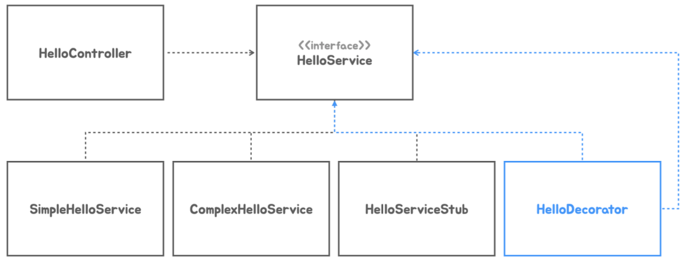

# 6. DI와 테스트, 디자인 패턴

## 테스트 코드를 이용한 테스트

---

### `TestRestTemplate`

---

- 번거로운 수동 테스트 대신 자동화된 테스트 코드를 이용한 테스트 방식으로 전환한다. 웹 서버에 HTTP 요청을 보내고 응답을 받아서 검증하는 테스트에서는 `TestRestTemplate`을 사용하면 편리하다.

```java
@Test
void hello() {
    TestRestTemplate restTemplate = new TestRestTemplate();

    ResponseEntity<String> res = restTemplate.getForEntity(
        "http://localhost:8080/hello?name={name}", String.class, "Spring");

    assertThat(res.getStatusCode()).isEqualTo(HttpStatus.OK);
    assertThat(res.getHeaders().getFirst(HttpHeaders.CONTENT_TYPE)
        .startsWith(MediaType.TEXT_PLAIN_VALUE)).isTrue();
    assertThat(res.getBody().trim()).isEqualTo("Hello Spring");
}
```

- HTTP 응답의 3가지 요소인 상태코드, 헤더(Content-Type), 바디를 검증한다.

- `TestRestTemplate` 특징 (vs `RestTemplate`)
    - 서버에 인증이 필요한 경우 기본적으로 HTTP Basic 인증을 쉽게 설정할 수 있습니다.
    - `RestTemplate`은 기본적으로 스프링 컨텍스트와 연결되지 않지만, `TestRestTemplate`은 스프링 부트의 테스트 환경과 통합되어 작동한다.
    - `RestTemplate`을 사용할 경우 추가적인 설정 작업(ex> `ObjectMapper`, `HttpMessageConverter` 등)이 필요할 수 있지만, `TestRestTemplate`은 스프링 부트의 테스트 환경에 적합한 설정을 기본적으로 포함한다.
    - `TestRestTemplate`은 테스트 스코프에서 생성되므로, 프로덕션 코드와 명확히 분리되어 안전하다.

### 실습

---

- HelloApiTest.java
    
    ```java
    package tobyspring.helloboot;
    
    import org.junit.jupiter.api.Test;
    import org.springframework.boot.test.web.client.TestRestTemplate;
    import org.springframework.http.HttpHeaders;
    import org.springframework.http.HttpStatus;
    import org.springframework.http.MediaType;
    import org.springframework.http.ResponseEntity;
    
    import java.util.Objects;
    
    import static org.assertj.core.api.Assertions.assertThat;
    
    public class HelloApiTest {
        @Test
        void helloApi() {
            // http localhost:8080/hello?name=Spring
            TestRestTemplate restTemplate = new TestRestTemplate();
    
            ResponseEntity<String> res = restTemplate.getForEntity("http://localhost:8080/hello?name={name}", String.class, "Spring");
    
            // status code 200
            assertThat(res.getStatusCode()).isEqualTo(HttpStatus.OK);
            // header(content-type) text/plain
            assertThat(Objects.requireNonNull(res.getHeaders().getFirst(HttpHeaders.CONTENT_TYPE)).startsWith(MediaType.TEXT_PLAIN_VALUE)).isTrue();
            // Hello Spring
            assertThat(Objects.requireNonNull(res.getBody()).trim()).isEqualTo("Hello Spring");
        }
    }
    ```
    

## DI와 단위 테스트

---

- DI는 컨테이너 없이도 자바 코드로 활용이 가능하다. 테스트 코드를 작성할 때 이용하면 의존 관계 주입을 이용해서 고립된 테스트를 작성할 수 있다. 의존 오브젝트가 없는 코드는 단순하게 인스턴스를 만들어서 메소드를 호출하는 방법으로 테스트할 수 있다.
    
    ```java
    @Test
    void simpleHelloService() {
        SimpleHelloService helloService = new SimpleHelloService();
    
        String ret = helloService.sayHello("Test");
    }
    ```
    
- 의존 오브젝트가 있는 경우, 테스트가 실행되는 동안에 수행될 최소한의 기능을 가진 의존 오브젝트 코드를 테스트용으로 만들어서 사용할 수 있다. 의존 오브젝트의 인터페이스를 구현한 간단한 클래스 또는 익명 클래스, 혹은 인터페이스가 하나라면 람다식을 사용할 수 있다.
    
    ```java
    @Test
    void helloController() {
        HelloController helloController = new HelloController(name -> name);
        
        String ret = helloController.hello("Test");
        
        Assertions.assertThat(ret).isEqualTo("Test");
    }
    ```
    
- 예외가 발생하는, 실패한 경우에 대한 테스트도 작성해야 한다.

### 실습

---

- 단위 테스트: 컨테이너 없이 수행한다.
- HelloControllerTest.java
    
    ```java
    package tobyspring.helloboot;
    
    import org.assertj.core.api.Assertions;
    import org.junit.jupiter.api.Test;
    
    public class HelloControllerTest {
        @Test
        void helloController() {
            HelloController helloController = new HelloController(name -> name);
    
            String ret = helloController.hello("Test");
    
            Assertions.assertThat(ret).isEqualTo("Test");
        }
    
        @Test
        void failsHelloController() {
            HelloController helloController = new HelloController(name -> name);
    
            Assertions.assertThatThrownBy(() -> {
                helloController.hello(null);
            }).isInstanceOf(IllegalArgumentException.class);
    
            Assertions.assertThatThrownBy(() -> {
                helloController.hello("");
            }).isInstanceOf(IllegalArgumentException.class);
        }
    }
    
    ```
    
- HelloServiceTest.java
    
    ```java
    package tobyspring.helloboot;
    
    import org.junit.jupiter.api.Test;
    
    import static org.assertj.core.api.Assertions.assertThat;
    
    public class HelloServiceTest {
         @Test
         void simpleHelloService() {
             SimpleHelloService helloService = new SimpleHelloService();
    
             String ret = helloService.sayHello("Test");
    
             assertThat(ret).isEqualTo("Hello Test");
         }
    }
    ```
    
- HelloApiTest.java
    
    ```java
    package tobyspring.helloboot;
    
    import org.junit.jupiter.api.Test;
    import org.springframework.boot.test.web.client.TestRestTemplate;
    import org.springframework.http.HttpHeaders;
    import org.springframework.http.HttpStatus;
    import org.springframework.http.MediaType;
    import org.springframework.http.ResponseEntity;
    
    import java.util.Objects;
    
    import static org.assertj.core.api.Assertions.assertThat;
    
    public class HelloApiTest {
        @Test
        void helloApi() {
            TestRestTemplate restTemplate = new TestRestTemplate();
    
            ResponseEntity<String> res = restTemplate.getForEntity("http://localhost:8080/hello?name={name}", String.class, "Spring");
    
            assertThat(res.getStatusCode()).isEqualTo(HttpStatus.OK);
            assertThat(Objects.requireNonNull(res.getHeaders().getFirst(HttpHeaders.CONTENT_TYPE)).startsWith(MediaType.TEXT_PLAIN_VALUE)).isTrue();
            assertThat(Objects.requireNonNull(res.getBody()).trim()).isEqualTo("Hello Spring");
        }
    
        @Test
        void failsHelloApi() {
            TestRestTemplate restTemplate = new TestRestTemplate();
    
            ResponseEntity<String> res = restTemplate.getForEntity("http://localhost:8080/hello?name=", String.class);
    
            assertThat(res.getStatusCode()).isEqualTo(HttpStatus.INTERNAL_SERVER_ERROR);
        }
    }
    ```
    

## DI를 이용한 Decorator, Proxy 패턴

---

### Decorator Pattern

---

- 기존 코드에 동적으로 책임을 추가할 때 쓰는 패턴
- 오브젝트 합성 구조로 확장이 가능하도록 설계되어있고 DI를 적용해서 의존관계를 런타임에 주입할 수 있다면 의존 오브젝트와 동일한 인터페이스를 구현한 확장기능(데코레이터)을 동적으로 추가할 수 있다. 재귀적인 구조로 여러 개의 책임을 부가하는 것도 가능하다.
    
    
    
- 데코레이터는 자기가 구현하는 인터페이스 타입의 다른 오브젝트를 의존한다. 추가 책임, 기능의 적용 중에 의존 오브젝트를 호출한다.
    
    
    
    
    

### `@Primary`

---

- 여러 개의 DI 후보 오브젝트가 있을 때 우선순위를 부여해서 단일 의존 오브젝트로 취급될 수 있게 하는 식별자

### 실습

---

- HelloDecorator.java
    
    ```java
    package tobyspring.helloboot;
    
    import org.springframework.context.annotation.Primary;
    import org.springframework.stereotype.Service;
    
    @Primary
    @Service
    public class HelloDecorator implements HelloService {
        private final HelloService helloService;
    
        public HelloDecorator(HelloService helloService) {
            this.helloService = helloService;
        }
    
        @Override
        public String sayHello(String name) {
            return "*" + helloService.sayHello(name) + "*";
        }
    }
    ```
    

### Proxy Pattern

---

- 프록시 패턴에서 프록시는 다른 오브젝트의 대리자 혹은 플레이스 홀더 역할을 한다. 프록시는 리모트 오브젝트에 대한 로컬 접근이 가능하게 하거나, 필요가 있을 때만 대상 오브젝트를 생성하는 필요가 있을 때 사용할 수 있다. 보안이나 접속 제어 등에 사용하기도 한다.
    
    
    
    
    
- 프록시 패턴의 프록시와 일반적용 용어 프록시, 자바의 다이나믹 프록시가 동일한 건 아니다.
