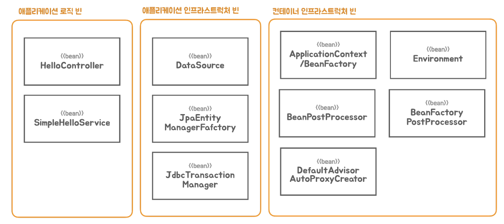

# 7. 자동 구성 기반 애플리케이션

## 메타 애노테이션과 합성 애노테이션

---

### Meta-annotation

---

```java
package org.springframework.stereotype;

import java.lang.annotation.Documented;
import java.lang.annotation.ElementType;
import java.lang.annotation.Retention;
import java.lang.annotation.RetentionPolicy;
import java.lang.annotation.Target;

import org.springframework.core.annotation.AliasFor;

@Target(ElementType.TYPE)
@Retention(RetentionPolicy.RUNTIME)
@Documented
@Component
public @interface Service {

	@AliasFor(annotation = Component.class)
	String value() default "";

}
```

- 애노테이션에 적용한 애노테이션을 메타 애노테이션이라고 한다. 스프링은 코드에서 사용된 애노테이션의 메타 애노테이션의 효력을 적용해준다.
- `@Service` 애노테이션이 부여된 클래스는 `@Service`의 메타 애노테이션인 `@Component`가 직접 사용된 것처럼 컴포넌트 스캔의 대상이 된다.

### Composed-annotation

---

```java
package org.springframework.web.bind.annotation;

import java.lang.annotation.Documented;
import java.lang.annotation.ElementType;
import java.lang.annotation.Retention;
import java.lang.annotation.RetentionPolicy;
import java.lang.annotation.Target;

import org.springframework.core.annotation.AliasFor;
import org.springframework.stereotype.Controller;

@Target(ElementType.TYPE)
@Retention(RetentionPolicy.RUNTIME)
@Documented
@Controller
@ResponseBody
public @interface RestController {

	@AliasFor(annotation = Controller.class)
	String value() default "";

}
```

- 합성(composed) 애노테이션은 하나 이상의 메타 애노테이션이 적용된 애노테이션을 말한다. 합성 애노테이션을 사용하면 모든 메타 애노테이션이 적용된 것과 동일한 효과를 갖는다.
- `@RestController`를 클래스에 적용하면 `@Component`와 `@ResponseBody`를 둘 다 사용한 것과 동일한 결과를 가져온다.

### 실습

---

- HelloServiceTest.java
    
    ```java
    package tobyspring.helloboot;
    
    import org.junit.jupiter.api.Test;
    
    import java.lang.annotation.ElementType;
    import java.lang.annotation.Retention;
    import java.lang.annotation.RetentionPolicy;
    import java.lang.annotation.Target;
    
    import static org.assertj.core.api.Assertions.assertThat;
    
    @Retention(RetentionPolicy.RUNTIME)
    @Target(ElementType.METHOD)
    @UnitTest
    @interface FastUnitTest {
    }
    
    @Retention(RetentionPolicy.RUNTIME)
    @Target({ElementType.ANNOTATION_TYPE, ElementType.METHOD})
    @Test
    @interface UnitTest {
    }
    
    public class HelloServiceTest {
        @FastUnitTest
        void simpleHelloService() {
            HelloService helloService = new SimpleHelloService();
    
            String ret = helloService.sayHello("Test");
    
            assertThat(ret).isEqualTo("Hello Test");
        }
    
        @Test
        void helloDecorator() {
            HelloService helloService = new HelloDecorator(name -> name);
    
            String ret = helloService.sayHello("Test");
    
            assertThat(ret).isEqualTo("*Test*");
        }
    }
    ```
    

## 합성 애노테이션의 적용

---

- `@Configuration`과 `@ComponentScan` 애노테이션을 메타 애노테이션으로 가지는 새로운 애노테이션을 만들어서 `HellobootApplication`에 적용한다.
    
    ```java
    @Retention(RetentionPolicy.RUNTIME)
    @Target(ElementType.TYPE)
    @Configuration
    @ComponentScan
    public @interface MySpringBootApplication {
    }
    ```
    
- `@Configuration`도 `@Component`를 메타 애노테이션으로 가지는 애노테이션이다.
    
    ```java
    package org.springframework.context.annotation;
    
    import java.lang.annotation.Documented;
    import java.lang.annotation.ElementType;
    import java.lang.annotation.Retention;
    import java.lang.annotation.RetentionPolicy;
    import java.lang.annotation.Target;
    
    import org.springframework.beans.factory.annotation.Autowired;
    import org.springframework.beans.factory.annotation.Value;
    import org.springframework.core.annotation.AliasFor;
    import org.springframework.stereotype.Component;
    
    @Target(ElementType.TYPE)
    @Retention(RetentionPolicy.RUNTIME)
    @Documented
    @Component
    public @interface Configuration {
    
    	@AliasFor(annotation = Component.class)
    	String value() default "";
    
    	boolean proxyBeanMethods() default true;
    
    }
    ```
    
- 런타임까지 애노테이션이 살아있게 하기위하여 `@Retention(RetentionPolicy.RUNTIME)`로 준다.

### 실습

---

- MySpringBootAnnotation.java
    
    ```java
    package tobyspring.helloboot;
    
    import org.springframework.context.annotation.ComponentScan;
    import org.springframework.context.annotation.Configuration;
    
    import java.lang.annotation.ElementType;
    import java.lang.annotation.Retention;
    import java.lang.annotation.RetentionPolicy;
    import java.lang.annotation.Target;
    
    @Retention(RetentionPolicy.RUNTIME)
    @Target(ElementType.TYPE)
    @Configuration
    @ComponentScan
    public @interface MySpringBootAnnotation {
    }
    ```
    
- HellobootApplication.java
    - `@Configuration` + `@ComponentScan` 대신에 `@MySpringBootAnnotation`를 달아준다.
    
    ```java
    package tobyspring.helloboot;
    
    import org.springframework.boot.SpringApplication;
    import org.springframework.boot.web.embedded.tomcat.TomcatServletWebServerFactory;
    import org.springframework.boot.web.servlet.server.ServletWebServerFactory;
    import org.springframework.context.annotation.Bean;
    import org.springframework.web.servlet.DispatcherServlet;
    
    @MySpringBootAnnotation
    public class HellobootApplication {
    
        public static void main(String[] args) {
            SpringApplication.run(HellobootApplication.class, args);
        }
    }
    ```
    
- Config.java
    
    ```java
    package tobyspring.helloboot;
    
    import org.springframework.boot.web.embedded.tomcat.TomcatServletWebServerFactory;
    import org.springframework.boot.web.servlet.server.ServletWebServerFactory;
    import org.springframework.context.annotation.Bean;
    import org.springframework.context.annotation.Configuration;
    import org.springframework.web.servlet.DispatcherServlet;
    
    @Configuration
    public class Config {
        @Bean
        public ServletWebServerFactory servletWebServerFactory() {
            return new TomcatServletWebServerFactory();
        }
    
        @Bean
        public DispatcherServlet dispatcherServlet() {
            return new DispatcherServlet();
        }
    }
    ```
    

## 빈 오브젝트의 역할과 구분

---

### 애플리케이션 로직 빈

---

- 애플리케이션의 비즈니스 로직을 담고 있는 클래스로 만들어지는 빈. 컴포넌트 스캐너에 의해서 빈 구성 정보가 생성되고 빈 오브젝트로 등록된다.

### 애플리케이션 인프라스트럭처 빈

---

- 빈 구성 정보에 의해 컨테이너에 등록되는 빈이지만 애플리케이션의 로직이 아니라 애플리케이션이 동작하는데 꼭 필요한 기술 기반을 제공하는 빈이다.
- 전통적인 스프링 애플리케이션에서는 빈으로 등록되지 않지만 스프링 부트에서 구성 정보에 의해 빈으로 등록되어지는 `ServletWebServerFactory`나 `DispatcherServlet` 등도 애플리케이션 인프라 빈이라고 볼 수 있다.

### 컨테이너 인프라스트럭처 빈

---

- 스프링 컨테이너의 기능을 확장해서 빈의 등록과 생성, 관계설정, 초기화 등의 작업에 참여하는 빈을 컨테이너 인프라스트럭처 빈, 줄여서 컨테이너 인프라 빈이라고 한다. 개발자가 작성한 구성 정보에 의해서 생성되는 게 아니라 컨테이너가 직접 만들고 사용하는 빈이기 때문에 애플리케이션 빈과 구분한다.
- 필요한 경우 일부 컨테이너 인프라 빈은 주입 받아서 활용할 수 있다.



- 스프링 부트의 빈 구성 정보는 컴포넌트 스캔에 의해서 등록되는 빈과 자동 구성에 의해서 등록되는 빈으로 구분된다. 일반적으로 애플리케이션 인프라 빈은 자동 구성에 의해서 등록되지만 개발자가 작성한 코드 구성 정보에 의해서도 등록할 수도 있다.
- 자동 구성 메커니즘을 확장하면 애플리케이션 로직을 담은 라이브러리를 만들어 자동 구성에 의해서 등록되도록 만드는 것도 가능하다.
    
    
    

## 인프라 빈 구성 정보의 분리

---

- `@Import`를 이용하면 스캔 대상이 아닌 클래스를 빈으로 등록하도록 추가할 수 있다.
    - 스프링 프레임웍 3.0 시절부터 있었다. 구성 정보에 직접 추가할 수 있다.
- 보통 `@Configuration` 애노테이션이 붙은 클래스를 가져온다. `@Component`가 붙은 클래스도 빈으로 등록시킬 수 있다.
- 애플리케이션 인프라스트럭처 빈 구성 정보 클래스는 스프링 부트의 자동 구성 메커니즘에 의해서 등록이 되도록 분리하는 작업이 우선 필요하다. 분리된 클래스는 `@Import`로 포함시킨다.
- 자동으로 등록되는 대상인 자동 구성 클래스는 애노테이션을 하나 만들어서 그 안에서 `@Import` 시킨다. `@Import`도 메타 애노테이션으로 사용할 수 있다.
    
    ```java
    @Retention(RetentionPolicy.RUNTIME)
    @Target(ElementType.TYPE)
    @Import({DispatcherServletConfig.class, TomcatWebServerConfig.class})
    public @interface EnableMyAutoConfiguration {
    }
    ```
    

- 이 애노테이션을 애플리케이션 메인 애노테이션에도 메타 애노테이션으로 추가해준다.
    
    ```java
    @Retention(RetentionPolicy.RUNTIME)
    @Target(ElementType.TYPE)
    @Configuration
    @ComponentScan
    @EnableMyAutoConfiguration
    public @interface MySpringBootApplication {
    }
    ```
    

### 실습

---

- 톰캣 만드는 팩토리 빈(`TomcatServletWebServerFactory`)과 `DispatcherServlet` 빈은 유저 구성 정보에 포함시키지 않아야 한다.
    - 자동으로 등록되게 만들어야 함 → 컴포넌트 스캔 대상에서 제외시켜야 한다.
    - config 디렉토리 하위로 Config.java로 옮기면 스캔을 못해서 실패한다.
- tobyspring.config.autoconfig 하위에 config 클래스들을 놓는다.
    
    ```java
    package tobyspring.config.autoconfig;
    
    import org.springframework.context.annotation.Bean;
    import org.springframework.context.annotation.Configuration;
    import org.springframework.web.servlet.DispatcherServlet;
    
    @Configuration
    public class DispatcherServletConfig {
        @Bean
        public DispatcherServlet dispatcherServlet() {
            return new DispatcherServlet();
        }
    }
    ```
    
    ```java
    package tobyspring.config.autoconfig;
    
    import org.springframework.boot.web.embedded.tomcat.TomcatServletWebServerFactory;
    import org.springframework.boot.web.servlet.server.ServletWebServerFactory;
    import org.springframework.context.annotation.Bean;
    import org.springframework.context.annotation.Configuration;
    
    @Configuration
    public class TomcatWebServerConfig {
        @Bean
        public ServletWebServerFactory servletWebServerFactory() {
            return new TomcatServletWebServerFactory();
        }
    }
    ```
    
- EnableMyAutoConfiguration.java
    
    ```java
    package tobyspring.config;
    
    import org.springframework.context.annotation.Import;
    import tobyspring.config.autoconfig.DispatcherServletConfig;
    import tobyspring.config.autoconfig.TomcatWebServerConfig;
    
    import java.lang.annotation.ElementType;
    import java.lang.annotation.Retention;
    import java.lang.annotation.RetentionPolicy;
    import java.lang.annotation.Target;
    
    @Retention(RetentionPolicy.RUNTIME)
    @Target(ElementType.TYPE)
    @Import({DispatcherServletConfig.class, TomcatWebServerConfig.class})
    public @interface EnableMyAutoConfiguration {
    }
    ```
    
- MySpringBootApplication.java
    
    ```java
    package tobyspring.helloboot;
    
    import org.springframework.context.annotation.ComponentScan;
    import org.springframework.context.annotation.Configuration;
    import org.springframework.context.annotation.Import;
    import tobyspring.config.EnableMyAutoConfiguration;
    import tobyspring.config.autoconfig.DispatcherServletConfig;
    import tobyspring.config.autoconfig.TomcatWebServerConfig;
    
    import java.lang.annotation.ElementType;
    import java.lang.annotation.Retention;
    import java.lang.annotation.RetentionPolicy;
    import java.lang.annotation.Target;
    
    @Retention(RetentionPolicy.RUNTIME)
    @Target(ElementType.TYPE)
    @Configuration
    @ComponentScan
    @EnableMyAutoConfiguration
    public @interface MySpringBootApplication {
    }
    ```
    
- 최종 디렉토리 구조
    
    
    
    
    

## 동적인 자동 구성 정보 등록

---

```java
package org.springframework.context.annotation;

import java.util.function.Predicate;

import org.springframework.core.type.AnnotationMetadata;
import org.springframework.lang.Nullable;

public interface ImportSelector {

	String[] selectImports(AnnotationMetadata importingClassMetadata);

	@Nullable
	default Predicate<String> getExclusionFilter() {
		return null;
	}

}
```

- `ImportSelector`의 구현 클래스를 `@Import`하면 `selectImports`가 리턴하는 클래스 이름으로 `@Configuration` 클래스를 찾아서 구성 정보로 사용한다. 코드에 의해서 `@Import` 대상을 외부에서 가져오고 선택할 수 있는 동적인 방법을 제공한다.
- 가져올 클래스 정보는 문자열 배열로 리턴한다.

- ex> MyAutoConfigImportSelector 구현
    
    ```java
    public class MyAutoConfigImportSelector implements DeferredImportSelector {
        @Override
        public String[] selectImports(AnnotationMetadata importingClassMetadata) {
            return new String[] {
                "tobyspring.config.autoconfig.DispatcherServletConfig",
                "tobyspring.config.autoconfig.TomcatWebServerConfig"
            };
        }
    }
    ```
    
    
    

### 실습

---

- MyAutoConfigImportSelector.java
    
    ```java
    package tobyspring.config;
    
    import org.springframework.context.annotation.DeferredImportSelector;
    import org.springframework.core.type.AnnotationMetadata;
    
    public class MyAutoConfigImportSelector implements DeferredImportSelector {
        @Override
        public String[] selectImports(AnnotationMetadata importingClassMetadata) {
            return new String[]{
                    "tobyspring.config.autoconfig.DispatcherServletConfig",
                    "tobyspring.config.autoconfig.TomcatWebServerConfig"
            };
        }
    }
    ```
    
- EnableMyAutoConfiguration.java
    - MyAutoConfigImportSelector를 `@Import`
    
    ```java
    package tobyspring.config;
    
    import org.springframework.context.annotation.Import;
    import tobyspring.config.autoconfig.DispatcherServletConfig;
    import tobyspring.config.autoconfig.TomcatWebServerConfig;
    
    import java.lang.annotation.ElementType;
    import java.lang.annotation.Retention;
    import java.lang.annotation.RetentionPolicy;
    import java.lang.annotation.Target;
    
    @Retention(RetentionPolicy.RUNTIME)
    @Target(ElementType.TYPE)
    @Import(MyAutoConfigImportSelector.class)
    public @interface EnableMyAutoConfiguration {
    }
    ```
    

## 자동 구성 정보 파일 분리

---

```java
@Override
public String[] selectImports(AnnotationMetadata importingClassMetadata) {
    List<String> autoConfigs = new ArrayList<>();

    ImportCandidates.load(MyAutoConfiguration.class, classLoader).forEach(autoConfigs::add);

    return autoConfigs.toArray(new String[0]);
}
```

- `@MyAutoConfiguration` 애노테이션을 만들고 이 클래스 이름 뒤에 `.imports`가 붙은 파일을 META-INF/spring 폴더 아래 만들어 `selectImports()`에서 가져와 컨테이너에 등록시킬 `@Configuration` 클래스 목록을 저장해둔다.

### 실습

---

- MyAutoConfiguration.java
    
    ```java
    package tobyspring.config;
    
    import org.springframework.context.annotation.Configuration;
    
    import java.lang.annotation.ElementType;
    import java.lang.annotation.Retention;
    import java.lang.annotation.RetentionPolicy;
    import java.lang.annotation.Target;
    
    @Retention(RetentionPolicy.RUNTIME)
    @Target(ElementType.TYPE)
    @Configuration
    public @interface MyAutoConfiguration {
    }
    ```
    
- MyAutoConfigImportSelector.java
    
    ```java
    package tobyspring.config;
    
    import org.springframework.boot.context.annotation.ImportCandidates;
    import org.springframework.context.annotation.DeferredImportSelector;
    import org.springframework.core.type.AnnotationMetadata;
    
    import java.util.stream.StreamSupport;
    
    public class MyAutoConfigImportSelector implements DeferredImportSelector {
        private final ClassLoader classLoader;
    
        public MyAutoConfigImportSelector(ClassLoader classLoader) {
            this.classLoader = classLoader;
        }
    
        @Override
        public String[] selectImports(AnnotationMetadata importingClassMetadata) {
            Iterable<String> candidates = ImportCandidates.load(MyAutoConfiguration.class, classLoader);
            return StreamSupport.stream(candidates.spliterator(), false).toArray(String[]::new);
        }
    }
    ```
    
- resources/META-INF/spring 하위에 `tobyspring.config.MyAutoConfiguration.imports` 파일을 만든다.
    - `tobyspring.MyAutoConfiguration.imports`로 만들면 못 읽어오고 실패한다.
    
    ```
    tobyspring.config.autoconfig.TomcatWebServerConfig
    tobyspring.config.autoconfig.DispatcherServletConfig
    ```
    

## 자동 구성 애노테이션 적용

---

- `@Configuration`을 메타 애노테이션으로 가지는 `@MyAutoConfiguration` 애노테이션을 정의하고 인프라 빈 클래스에 `@Configuration`을 대체해서 부여한다.
    
    ```java
    @MyAutoConfiguration
    public class DispatcherServletConfig {
        @Bean
        public DispatcherServlet dispatcherServlet() {
            return new DispatcherServlet();
        }
    }
    ```
    

- 지금까지 적용한 자동 구성 정보를 다루는 구조는 다음과 같다.
    
    
    

### 실습

---

- MyAutoConfiguration.java
    - `@Configuration(proxyBeanMethods = false)`로 변경해준다
    
    ```java
    package tobyspring.config;
    
    import org.springframework.context.annotation.Configuration;
    
    import java.lang.annotation.ElementType;
    import java.lang.annotation.Retention;
    import java.lang.annotation.RetentionPolicy;
    import java.lang.annotation.Target;
    
    @Retention(RetentionPolicy.RUNTIME)
    @Target(ElementType.TYPE)
    @Configuration(proxyBeanMethods = false)
    public @interface MyAutoConfiguration {
    }
    ```
    
- DispatcherServletConfig.java, TomcatWebServerConfig.java
    - `@Configuration`를 `@MyAutoConfiguration`로 교체한다.
    
    ```java
    package tobyspring.config.autoconfig;
    
    import org.springframework.context.annotation.Bean;
    import org.springframework.web.servlet.DispatcherServlet;
    import tobyspring.config.MyAutoConfiguration;
    
    @MyAutoConfiguration
    public class DispatcherServletConfig {
        @Bean
        public DispatcherServlet dispatcherServlet() {
            return new DispatcherServlet();
        }
    }
    ```
    
    ```java
    package tobyspring.config.autoconfig;
    
    import org.springframework.boot.web.embedded.tomcat.TomcatServletWebServerFactory;
    import org.springframework.boot.web.servlet.server.ServletWebServerFactory;
    import org.springframework.context.annotation.Bean;
    import tobyspring.config.MyAutoConfiguration;
    
    @MyAutoConfiguration
    public class TomcatWebServerConfig {
        @Bean
        public ServletWebServerFactory servletWebServerFactory() {
            return new TomcatServletWebServerFactory();
        }
    }
    ```
    

## `@Configuration`과 `proxyBeanMethods`

---

### `@Configuration` 클래스의 동작 방식

---

- `MyAutoConfiguration` 애노테이션은 `@Configuration`을 메타 애노테이션으로 가지면서 `proxyBeanMethods` 엘리먼트를 `false`로 지정한다.
    
    ```java
    @Retention(RetentionPolicy.RUNTIME)
    @Target(ElementType.TYPE)
    @Configuration(proxyBeanMethods = false)
    public @interface MyAutoConfiguration {
    }
    ```
    

- `proxyBeanMethods`는 디폴트로 `true` 값을 가진다.
    - 이 경우 `@Configuration`이 붙은 클래스는 CGLib을 이용해서 프록시 클래스로 확장한 후 `@Bean`이 붙은 메소드의 동작 방식을 변경한다.
    - `@Bean` 메소드를 직접 호출해서 다른 빈의 의존 관계를 설정할 때 여러 번 호출되더라도 싱글톤 빈처럼 참조할 수 있도록 매번 같은 오브젝트를 리턴하게 한다.
- 만약 `@Bean` 메소드 직접 호출로 빈 의존관계 주입을 하지 않는다면 굳이 복잡한 프록시 생성을 할 필요가 없다.
    - 이 경우 `proxyBeanMethods`를 `false`로 지정해도 된다.
    - `@Bean` 메소드는 평범한 팩토리 메소드처럼 동작한다.
- `proxyBeanMethods`는 스프링 5.2 버전부터 지원되기 시작했고 지금은 스프링과 스프링 부트의 상당히 많은 `@Configuration` 클래스 설정에 적용되고 있다.
- `@Bean`은 `@Configuration`이 붙은 클래스에서도 사용될 수 있다.
    - 이를 `@Bean` 라이트 모드(lite mode)라고 부른다.
    - 빈으로 등록되는 클래스는 단순 팩토리 메소드로 사용된다.

### 실습

---

- 첫 번째: 단순히 같음을 비교하면 다르다.
    
    ```java
    package tobyspring.study;
    
    import org.assertj.core.api.Assertions;
    import org.junit.jupiter.api.Test;
    import org.springframework.context.annotation.Bean;
    import org.springframework.context.annotation.Configuration;
    
    public class ConfigurationTest {
        @Test
        void configuration() {
            // false
    //        Assertions.assertThat(new Common()).isSameAs(new Common());
            // true
    //        Common common = new Common();
    //        Assertions.assertThat(common).isSameAs(common);
    
            // false
            MyConfig myConfig = new MyConfig();
            Bean1 bean1 = myConfig.bean1();
            Bean2 bean2 = myConfig.bean2();
    
            Assertions.assertThat(bean1.common).isSameAs(bean2.common);
        }
    
        // Bean1 <-- Common
        // Bean2 <-- Common
        @Configuration
        static class MyConfig {
            @Bean
            Common common() {
                return new Common();
            }
    
            @Bean
            Bean1 bean1() {
                return new Bean1(common());
            }
    
            @Bean
            Bean2 bean2() {
                return new Bean2(common());
            }
        }
    
        static class Bean1 {
            private final Common common;
    
            public Bean1(Common common) {
                this.common = common;
            }
        }
    
        static class Bean2 {
            private final Common common;
    
            public Bean2(Common common) {
                this.common = common;
            }
        }
    
        static class Common {
        }
    }
    ```
    
- 두 번째: `ApplicationContext` 통해서 가져오면, 같다고 여겨진다.
    
    ```java
    package tobyspring.study;
    
    import org.assertj.core.api.Assertions;
    import org.junit.jupiter.api.Test;
    import org.springframework.context.annotation.AnnotationConfigApplicationContext;
    import org.springframework.context.annotation.Bean;
    import org.springframework.context.annotation.Configuration;
    
    public class ConfigurationTest {
        @Test
        void configuration() {
            AnnotationConfigApplicationContext ac = new AnnotationConfigApplicationContext();
            ac.register(MyConfig.class);
            ac.refresh();
    
            // false
            Bean1 bean1 = ac.getBean(Bean1.class);
            Bean2 bean2 = ac.getBean(Bean2.class);
    
            Assertions.assertThat(bean1.common).isSameAs(bean2.common);
        }
    ...
    }
    ```
    
    - `proxyBeanMethods`가 (디폴트 값인) `true`로 설정되어 있는 경우에는, MyConfig라는 빈이 등록될 때 프록시 오브젝트를 앞에 하나 두고, 그게 빈으로 등록된다.
- 세 번째: Proxy 통해서 가져오면, 같다고 여겨진다.
    
    ```java
    package tobyspring.study;
    
    import org.assertj.core.api.Assertions;
    import org.junit.jupiter.api.Test;
    import org.springframework.context.annotation.AnnotationConfigApplicationContext;
    import org.springframework.context.annotation.Bean;
    import org.springframework.context.annotation.Configuration;
    
    public class ConfigurationTest {
    ...
        @Test
        void proxyCommonMethod() {
            // true
            MyConfigProxy myConfigProxy = new MyConfigProxy();
            Bean1 bean1 = myConfigProxy.bean1();
            Bean2 bean2 = myConfigProxy.bean2();
    
            Assertions.assertThat(bean1.common).isSameAs(bean2.common);
        }
    
        static class MyConfigProxy extends MyConfig {
            private Common common;
    
            @Bean
            Common common() {
                if (this.common == null) this.common = super.common();
                return this.common;
            }
        }
    ...
    }
    ```
