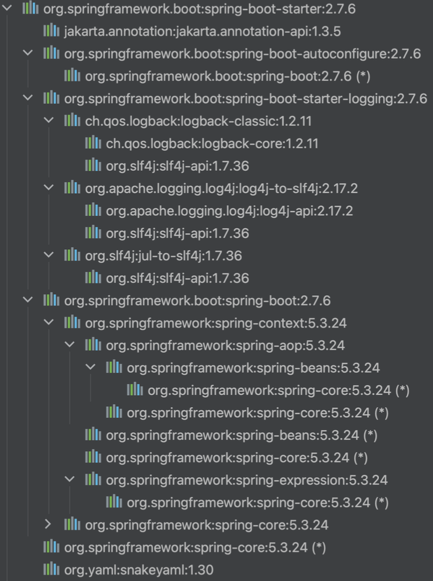

# 8. 조건부 자동 구성

## 스**타터와 Jetty 서버 구성 추가**

---

- `@AutoConfiguration`에 의해서 환경설정 되는 목록
    - `.../spring-boot-autoconfigure-2.7.6.jar!/META-INF/spring/org.springframework.boot.autoconfigure.AutoConfiguration.imports`
        
        ```powershell
        org.springframework.boot.autoconfigure.admin.SpringApplicationAdminJmxAutoConfiguration
        org.springframework.boot.autoconfigure.aop.AopAutoConfiguration
        org.springframework.boot.autoconfigure.amqp.RabbitAutoConfiguration
        org.springframework.boot.autoconfigure.batch.BatchAutoConfiguration
        org.springframework.boot.autoconfigure.cache.CacheAutoConfiguration
        org.springframework.boot.autoconfigure.cassandra.CassandraAutoConfiguration
        org.springframework.boot.autoconfigure.context.ConfigurationPropertiesAutoConfiguration
        org.springframework.boot.autoconfigure.context.LifecycleAutoConfiguration
        org.springframework.boot.autoconfigure.context.MessageSourceAutoConfiguration
        org.springframework.boot.autoconfigure.context.PropertyPlaceholderAutoConfiguration
        org.springframework.boot.autoconfigure.couchbase.CouchbaseAutoConfiguration
        org.springframework.boot.autoconfigure.dao.PersistenceExceptionTranslationAutoConfiguration
        org.springframework.boot.autoconfigure.data.cassandra.CassandraDataAutoConfiguration
        org.springframework.boot.autoconfigure.data.cassandra.CassandraReactiveDataAutoConfiguration
        org.springframework.boot.autoconfigure.data.cassandra.CassandraReactiveRepositoriesAutoConfiguration
        org.springframework.boot.autoconfigure.data.cassandra.CassandraRepositoriesAutoConfiguration
        org.springframework.boot.autoconfigure.data.couchbase.CouchbaseDataAutoConfiguration
        org.springframework.boot.autoconfigure.data.couchbase.CouchbaseReactiveDataAutoConfiguration
        org.springframework.boot.autoconfigure.data.couchbase.CouchbaseReactiveRepositoriesAutoConfiguration
        org.springframework.boot.autoconfigure.data.couchbase.CouchbaseRepositoriesAutoConfiguration
        org.springframework.boot.autoconfigure.data.elasticsearch.ElasticsearchDataAutoConfiguration
        org.springframework.boot.autoconfigure.data.elasticsearch.ElasticsearchRepositoriesAutoConfiguration
        org.springframework.boot.autoconfigure.data.elasticsearch.ReactiveElasticsearchRepositoriesAutoConfiguration
        org.springframework.boot.autoconfigure.data.elasticsearch.ReactiveElasticsearchRestClientAutoConfiguration
        org.springframework.boot.autoconfigure.data.jdbc.JdbcRepositoriesAutoConfiguration
        org.springframework.boot.autoconfigure.data.jpa.JpaRepositoriesAutoConfiguration
        org.springframework.boot.autoconfigure.data.ldap.LdapRepositoriesAutoConfiguration
        org.springframework.boot.autoconfigure.data.mongo.MongoDataAutoConfiguration
        org.springframework.boot.autoconfigure.data.mongo.MongoReactiveDataAutoConfiguration
        org.springframework.boot.autoconfigure.data.mongo.MongoReactiveRepositoriesAutoConfiguration
        org.springframework.boot.autoconfigure.data.mongo.MongoRepositoriesAutoConfiguration
        org.springframework.boot.autoconfigure.data.neo4j.Neo4jDataAutoConfiguration
        org.springframework.boot.autoconfigure.data.neo4j.Neo4jReactiveDataAutoConfiguration
        org.springframework.boot.autoconfigure.data.neo4j.Neo4jReactiveRepositoriesAutoConfiguration
        org.springframework.boot.autoconfigure.data.neo4j.Neo4jRepositoriesAutoConfiguration
        org.springframework.boot.autoconfigure.data.r2dbc.R2dbcDataAutoConfiguration
        org.springframework.boot.autoconfigure.data.r2dbc.R2dbcRepositoriesAutoConfiguration
        org.springframework.boot.autoconfigure.data.redis.RedisAutoConfiguration
        org.springframework.boot.autoconfigure.data.redis.RedisReactiveAutoConfiguration
        org.springframework.boot.autoconfigure.data.redis.RedisRepositoriesAutoConfiguration
        org.springframework.boot.autoconfigure.data.rest.RepositoryRestMvcAutoConfiguration
        org.springframework.boot.autoconfigure.data.web.SpringDataWebAutoConfiguration
        org.springframework.boot.autoconfigure.elasticsearch.ElasticsearchRestClientAutoConfiguration
        org.springframework.boot.autoconfigure.flyway.FlywayAutoConfiguration
        org.springframework.boot.autoconfigure.freemarker.FreeMarkerAutoConfiguration
        org.springframework.boot.autoconfigure.graphql.GraphQlAutoConfiguration
        org.springframework.boot.autoconfigure.graphql.data.GraphQlReactiveQueryByExampleAutoConfiguration
        org.springframework.boot.autoconfigure.graphql.data.GraphQlReactiveQuerydslAutoConfiguration
        org.springframework.boot.autoconfigure.graphql.data.GraphQlQueryByExampleAutoConfiguration
        org.springframework.boot.autoconfigure.graphql.data.GraphQlQuerydslAutoConfiguration
        org.springframework.boot.autoconfigure.graphql.reactive.GraphQlWebFluxAutoConfiguration
        org.springframework.boot.autoconfigure.graphql.rsocket.GraphQlRSocketAutoConfiguration
        org.springframework.boot.autoconfigure.graphql.rsocket.RSocketGraphQlClientAutoConfiguration
        org.springframework.boot.autoconfigure.graphql.security.GraphQlWebFluxSecurityAutoConfiguration
        org.springframework.boot.autoconfigure.graphql.security.GraphQlWebMvcSecurityAutoConfiguration
        org.springframework.boot.autoconfigure.graphql.servlet.GraphQlWebMvcAutoConfiguration
        org.springframework.boot.autoconfigure.groovy.template.GroovyTemplateAutoConfiguration
        org.springframework.boot.autoconfigure.gson.GsonAutoConfiguration
        org.springframework.boot.autoconfigure.h2.H2ConsoleAutoConfiguration
        org.springframework.boot.autoconfigure.hateoas.HypermediaAutoConfiguration
        org.springframework.boot.autoconfigure.hazelcast.HazelcastAutoConfiguration
        org.springframework.boot.autoconfigure.hazelcast.HazelcastJpaDependencyAutoConfiguration
        org.springframework.boot.autoconfigure.http.HttpMessageConvertersAutoConfiguration
        org.springframework.boot.autoconfigure.http.codec.CodecsAutoConfiguration
        org.springframework.boot.autoconfigure.influx.InfluxDbAutoConfiguration
        org.springframework.boot.autoconfigure.info.ProjectInfoAutoConfiguration
        org.springframework.boot.autoconfigure.integration.IntegrationAutoConfiguration
        org.springframework.boot.autoconfigure.jackson.JacksonAutoConfiguration
        org.springframework.boot.autoconfigure.jdbc.DataSourceAutoConfiguration
        org.springframework.boot.autoconfigure.jdbc.JdbcTemplateAutoConfiguration
        org.springframework.boot.autoconfigure.jdbc.JndiDataSourceAutoConfiguration
        org.springframework.boot.autoconfigure.jdbc.XADataSourceAutoConfiguration
        org.springframework.boot.autoconfigure.jdbc.DataSourceTransactionManagerAutoConfiguration
        org.springframework.boot.autoconfigure.jms.JmsAutoConfiguration
        org.springframework.boot.autoconfigure.jmx.JmxAutoConfiguration
        org.springframework.boot.autoconfigure.jms.JndiConnectionFactoryAutoConfiguration
        org.springframework.boot.autoconfigure.jms.activemq.ActiveMQAutoConfiguration
        org.springframework.boot.autoconfigure.jms.artemis.ArtemisAutoConfiguration
        org.springframework.boot.autoconfigure.jersey.JerseyAutoConfiguration
        org.springframework.boot.autoconfigure.jooq.JooqAutoConfiguration
        org.springframework.boot.autoconfigure.jsonb.JsonbAutoConfiguration
        org.springframework.boot.autoconfigure.kafka.KafkaAutoConfiguration
        org.springframework.boot.autoconfigure.availability.ApplicationAvailabilityAutoConfiguration
        org.springframework.boot.autoconfigure.ldap.embedded.EmbeddedLdapAutoConfiguration
        org.springframework.boot.autoconfigure.ldap.LdapAutoConfiguration
        org.springframework.boot.autoconfigure.liquibase.LiquibaseAutoConfiguration
        org.springframework.boot.autoconfigure.mail.MailSenderAutoConfiguration
        org.springframework.boot.autoconfigure.mail.MailSenderValidatorAutoConfiguration
        org.springframework.boot.autoconfigure.mongo.embedded.EmbeddedMongoAutoConfiguration
        org.springframework.boot.autoconfigure.mongo.MongoAutoConfiguration
        org.springframework.boot.autoconfigure.mongo.MongoReactiveAutoConfiguration
        org.springframework.boot.autoconfigure.mustache.MustacheAutoConfiguration
        org.springframework.boot.autoconfigure.neo4j.Neo4jAutoConfiguration
        org.springframework.boot.autoconfigure.netty.NettyAutoConfiguration
        org.springframework.boot.autoconfigure.orm.jpa.HibernateJpaAutoConfiguration
        org.springframework.boot.autoconfigure.quartz.QuartzAutoConfiguration
        org.springframework.boot.autoconfigure.r2dbc.R2dbcAutoConfiguration
        org.springframework.boot.autoconfigure.r2dbc.R2dbcTransactionManagerAutoConfiguration
        org.springframework.boot.autoconfigure.rsocket.RSocketMessagingAutoConfiguration
        org.springframework.boot.autoconfigure.rsocket.RSocketRequesterAutoConfiguration
        org.springframework.boot.autoconfigure.rsocket.RSocketServerAutoConfiguration
        org.springframework.boot.autoconfigure.rsocket.RSocketStrategiesAutoConfiguration
        org.springframework.boot.autoconfigure.security.servlet.SecurityAutoConfiguration
        org.springframework.boot.autoconfigure.security.servlet.UserDetailsServiceAutoConfiguration
        org.springframework.boot.autoconfigure.security.servlet.SecurityFilterAutoConfiguration
        org.springframework.boot.autoconfigure.security.reactive.ReactiveSecurityAutoConfiguration
        org.springframework.boot.autoconfigure.security.reactive.ReactiveUserDetailsServiceAutoConfiguration
        org.springframework.boot.autoconfigure.security.rsocket.RSocketSecurityAutoConfiguration
        org.springframework.boot.autoconfigure.security.saml2.Saml2RelyingPartyAutoConfiguration
        org.springframework.boot.autoconfigure.sendgrid.SendGridAutoConfiguration
        org.springframework.boot.autoconfigure.session.SessionAutoConfiguration
        org.springframework.boot.autoconfigure.security.oauth2.client.servlet.OAuth2ClientAutoConfiguration
        org.springframework.boot.autoconfigure.security.oauth2.client.reactive.ReactiveOAuth2ClientAutoConfiguration
        org.springframework.boot.autoconfigure.security.oauth2.resource.servlet.OAuth2ResourceServerAutoConfiguration
        org.springframework.boot.autoconfigure.security.oauth2.resource.reactive.ReactiveOAuth2ResourceServerAutoConfiguration
        org.springframework.boot.autoconfigure.solr.SolrAutoConfiguration
        org.springframework.boot.autoconfigure.sql.init.SqlInitializationAutoConfiguration
        org.springframework.boot.autoconfigure.task.TaskExecutionAutoConfiguration
        org.springframework.boot.autoconfigure.task.TaskSchedulingAutoConfiguration
        org.springframework.boot.autoconfigure.thymeleaf.ThymeleafAutoConfiguration
        org.springframework.boot.autoconfigure.transaction.TransactionAutoConfiguration
        org.springframework.boot.autoconfigure.transaction.jta.JtaAutoConfiguration
        org.springframework.boot.autoconfigure.validation.ValidationAutoConfiguration
        org.springframework.boot.autoconfigure.web.client.RestTemplateAutoConfiguration
        org.springframework.boot.autoconfigure.web.embedded.EmbeddedWebServerFactoryCustomizerAutoConfiguration
        org.springframework.boot.autoconfigure.web.reactive.HttpHandlerAutoConfiguration
        org.springframework.boot.autoconfigure.web.reactive.ReactiveMultipartAutoConfiguration
        org.springframework.boot.autoconfigure.web.reactive.ReactiveWebServerFactoryAutoConfiguration
        org.springframework.boot.autoconfigure.web.reactive.WebFluxAutoConfiguration
        org.springframework.boot.autoconfigure.web.reactive.WebSessionIdResolverAutoConfiguration
        org.springframework.boot.autoconfigure.web.reactive.error.ErrorWebFluxAutoConfiguration
        org.springframework.boot.autoconfigure.web.reactive.function.client.ClientHttpConnectorAutoConfiguration
        org.springframework.boot.autoconfigure.web.reactive.function.client.WebClientAutoConfiguration
        org.springframework.boot.autoconfigure.web.servlet.DispatcherServletAutoConfiguration
        org.springframework.boot.autoconfigure.web.servlet.ServletWebServerFactoryAutoConfiguration
        org.springframework.boot.autoconfigure.web.servlet.error.ErrorMvcAutoConfiguration
        org.springframework.boot.autoconfigure.web.servlet.HttpEncodingAutoConfiguration
        org.springframework.boot.autoconfigure.web.servlet.MultipartAutoConfiguration
        org.springframework.boot.autoconfigure.web.servlet.WebMvcAutoConfiguration
        org.springframework.boot.autoconfigure.websocket.reactive.WebSocketReactiveAutoConfiguration
        org.springframework.boot.autoconfigure.websocket.servlet.WebSocketServletAutoConfiguration
        org.springframework.boot.autoconfigure.websocket.servlet.WebSocketMessagingAutoConfiguration
        org.springframework.boot.autoconfigure.webservices.WebServicesAutoConfiguration
        org.springframework.boot.autoconfigure.webservices.client.WebServiceTemplateAutoConfiguration
        ```
        
    - 144개 `@AutoConfiguration`이 등록되어 있다. 300개 이상의 bean이 등록된다.

- 스프링 부트의 Starter는 애플리케이션에 포함시킬 의존 라이브러리 정보를 담고 있다.
- Maven 또는 Gradle의 의존 라이브러리 목록에 추가해서 스프링 부트가 선정한 기술의 종류와 버전에 해당하는 라이브러리 모듈을 프로젝트에 포함시킨다.
- `./gradlew dependencies -—configuration compileClasspath`

### spring-boot-starter

---

- 가장 기본이 되는 스타터이다. 스프링 코어, 스프링 부트 코어를 포함해서 자동 구성, 애노테이션, 로깅 등에 필요한 의존 라이브러리가 포함되어 있다.
    
    
    

### spring-boot-starter-web

---

- Spring Initializr에서 web 모듈을 선택하면 이 스타터가 추가된다. spring-boot-starter를 포함한다. SpringWeb, SpringMVC와 Json, Tomcat 라이브러리가 추가된다.
    
    
    

### **spring-boot-starter-jetty**

---

- Jetty 서블릿 컨테이너를 이용하는데 필요한 라이브러리로 구성된다.

### 실습

---

- build.gradle
    - `spring-boot-starter-jetty` 추가
    
    ```powershell
    // ...
    	implementation 'org.springframework.boot:spring-boot-starter-jetty'
    // ...
    ```
    
- JettyWebServerConfig.java
    
    ```java
    package tobyspring.config.autoconfig;
    
    import org.springframework.boot.web.embedded.jetty.JettyServletWebServerFactory;
    import org.springframework.boot.web.servlet.server.ServletWebServerFactory;
    import org.springframework.context.annotation.Bean;
    import tobyspring.config.MyAutoConfiguration;
    
    @MyAutoConfiguration
    public class JettyWebServerConfig {
        @Bean("jettyWebServerFactory")
        public ServletWebServerFactory servletWebServerFactory() {
            return new JettyServletWebServerFactory();
        }
    }
    ```
    
- src/main/resources/META-INF/spring/tobyspring.config.MyAutoConfiguration.imports
    
    ```java
    tobyspring.config.autoconfig.TomcatWebServerConfig
    tobyspring.config.autoconfig.JettyWebServerConfig
    tobyspring.config.autoconfig.DispatcherServletConfig
    ```
    
- 에러 발생
    
    ```powershell
    Caused by: org.springframework.context.ApplicationContextException: Unable to start ServletWebServerApplicationContext due to multiple ServletWebServerFactory beans : tomcatWebServerFactory,jettyWebServerFactory
    ```
    

## **`@Conditional`과 `Condition`**

---

- `@Conditional`은 스프링 4.0에 추가된 애노테이션으로 모든 조건을 만족하는 경우에만 컨테이너에 빈으로 등록되도록 한다.
    
    ```java
    @Target({ElementType.TYPE, ElementType.METHOD})
    @Retention(RetentionPolicy.RUNTIME)
    @Documented
    public @interface Conditional {
    
        /**
         * All {@link Condition} classes that must {@link Condition#matches match}
         * in order for the component to be registered.
         */
        Class<? extends Condition>[] value();
    
    }
    ```
    
- `Condition`은 `@Conditional`에 지정되어서 구체적인 매칭 조건을 가진 클래스가 구현해야 할 인터페이스이다.
    
    ```java
    @FunctionalInterface
    public interface Condition {
    
        /**
         * Determine if the condition matches.
         */
        boolean matches(ConditionContext context, AnnotatedTypeMetadata metadata);
    
    }
    ```
    
- `@Conditional`은 `@Configuration` 클래스와 `@Bean` 메소드에 적용 가능하다. 클래스 조건을 만족하지 못하는 경우 메소드는 무시된다.


- 스프링 부트가 제공하는 `ApplicationContextRunner`를 사용하면 스프링 컨테이너에 빈이 등록됐는지를 테스트할 때 편리하다. `@Conditional`이 적용된 자동 구성 클래스의 적용 여부를 테스트할 때 사용한다.
    
    ```java
    ApplicationContextRunner contextRunner = new ApplicationContextRunner();
    contextRunner.withUserConfiguration(Config1.class)
        .run(context -> {
            assertThat(context).hasSingleBean(MyBean.class);
            assertThat(context).hasSingleBean(Config1.class);
        });
    ```
    
    ```java
    new ApplicationContextRunner().withUserConfiguration(Config2.class)
        .run(context -> {
            assertThat(context).doesNotHaveBean(MyBean.class);
            assertThat(context).doesNotHaveBean(Config1.class);
        });
    ```
    

- `Condition`의 `matches` 메서드는 `@Conditional` 애노테이션의 엘리먼트 정보를 가져올 수 있는 `AnnotatedTypeMetadata`를 전달받는다.
    
    ```java
    class BooleanCondition implements Condition {
        @Override
        public boolean matches(ConditionContext context, AnnotatedTypeMetadata metadata) {
            Map<String, Object> annotationAttributes = metadata.getAnnotationAttributes(BooleanConditional.class.getName());
            Boolean value = (Boolean) annotationAttributes.get("value");
            return value;
        }
    }
    ```
    

### 실습

---

- JettyWebServerConfig.java
    
    ```java
    // ...
    @MyAutoConfiguration
    @Conditional(JettyWebServerConfig.JettyCondition.class)
    public class JettyWebServerConfig {
        @Bean("jettyWebServerFactory")
        public ServletWebServerFactory servletWebServerFactory() {
            return new JettyServletWebServerFactory();
        }
    
        static class JettyCondition implements Condition {
            @Override
            public boolean matches(ConditionContext context, AnnotatedTypeMetadata metadata) {
                return false;
            }
        }
    }
    ```
    
- TomcatWebServerConfig.java
    
    ```java
    // ...
    @MyAutoConfiguration
    @Conditional(TomcatWebServerConfig.TomcatCondition.class)
    public class TomcatWebServerConfig {
        @Bean("tomcatWebServerFactory")
        public ServletWebServerFactory servletWebServerFactory() {
            return new TomcatServletWebServerFactory();
        }
    
        static class TomcatCondition implements Condition {
            @Override
            public boolean matches(ConditionContext context, AnnotatedTypeMetadata metadata) {
                return true;
            }
        }
    }
    ```
    

## **`@Conditional` 학습테스트**

---

- ConditionalTest.java
    
    ```java
    package tobyspring.study;
    
    import org.junit.jupiter.api.Test;
    import org.springframework.boot.test.context.runner.ApplicationContextRunner;
    import org.springframework.context.annotation.AnnotationConfigApplicationContext;
    import org.springframework.context.annotation.Bean;
    import org.springframework.context.annotation.Condition;
    import org.springframework.context.annotation.ConditionContext;
    import org.springframework.context.annotation.Conditional;
    import org.springframework.context.annotation.Configuration;
    import org.springframework.core.type.AnnotatedTypeMetadata;
    
    import java.lang.annotation.ElementType;
    import java.lang.annotation.Retention;
    import java.lang.annotation.RetentionPolicy;
    import java.lang.annotation.Target;
    import java.util.Map;
    
    import static org.assertj.core.api.Assertions.assertThat;
    
    public class ConditionalTest {
    
        @Test
        void conditional() {
            // true
            ApplicationContextRunner contextRunner = new ApplicationContextRunner();
            contextRunner.withUserConfiguration(Config1.class)
                    .run(context -> {
                        assertThat(context).hasSingleBean(MyBean.class);
                        assertThat(context).hasSingleBean(Config1.class);
                    });
    //        AnnotationConfigApplicationContext ac = new AnnotationConfigApplicationContext();
    //        ac.register(Config1.class);
    //        ac.refresh();
    
    //        MyBean bean = ac.getBean(MyBean.class);
    
            // false
            new ApplicationContextRunner().withUserConfiguration(Config2.class)
                    .run(context -> {
                        assertThat(context).doesNotHaveBean(MyBean.class);
                        assertThat(context).doesNotHaveBean(Config1.class);
                    });
    //        AnnotationConfigApplicationContext ac2 = new AnnotationConfigApplicationContext();
    //        ac2.register(Config2.class);
    //        ac2.refresh();
    //
    //        MyBean bean2 = ac2.getBean(MyBean.class);
    
        }
    
    //    @Retention(RetentionPolicy.RUNTIME)
    //    @Target(ElementType.TYPE)
    //    @Conditional(TrueCondition.class)
    //    @interface TrueConditional {
    //    }
    
        @Retention(RetentionPolicy.RUNTIME)
        @Target(ElementType.TYPE)
        @Conditional(BooleanCondition.class)
        @interface BooleanConditional {
            boolean value();
        }
    
        @Configuration
        @BooleanConditional(true)
    //    @Conditional(TrueCondition.class)
        static class Config1 {
            @Bean
            MyBean myBean() {
                return new MyBean();
            }
        }
    
    //    @Retention(RetentionPolicy.RUNTIME)
    //    @Target(ElementType.TYPE)
    //    @Conditional(FalseCondition.class)
    //    @interface FalseConditional {
    //    }
    
        @Configuration
        @BooleanConditional(false)
    //    @FalseConditional
    //    @Conditional(FalseCondition.class)
        static class Config2 {
            @Bean
            MyBean myBean() {
                return new MyBean();
            }
        }
    
        static class MyBean {
        }
    
        static class TrueCondition implements Condition {
    
            @Override
            public boolean matches(ConditionContext context, AnnotatedTypeMetadata metadata) {
                return true;
            }
        }
    
        static class FalseCondition implements Condition {
    
            @Override
            public boolean matches(ConditionContext context, AnnotatedTypeMetadata metadata) {
                return false;
            }
        }
    
        static class BooleanCondition implements Condition {
            @Override
            public boolean matches(ConditionContext context, AnnotatedTypeMetadata metadata) {
                Map<String, Object> annotationAttributes = metadata.getAnnotationAttributes(BooleanConditional.class.getName());
                return (Boolean) annotationAttributes.get("value");
            }
        }
    }
    ```
    

## **커스톰 `@Conditional`**

---

### 클래스 기준 조건부 구성

---

- 스프링 부트가 사용하는 `@Conditional`의 가장 대표적인 방법은 클래스의 존재를 확인하는 것이다. 스타터를 이용하거나 직접 의존 라이브러리 등록을 통해서 어떤 기술의 클래스를 애플리케이션이 사용하도록 포함시켰다면, 이 기술을 사용할 의도가 있다는 것으로 보고 관련 자동 구성 클래스를 등록시켜준다.
- Tomcat과 Jetty 중에서 어떤 서블릿 컨테이너를 사용할지는 해당 서버 라이브러리 클래스가 프로젝트에 포함되어있는지를 확인하는 방법을 사용하면 된다.
- 특정 클래스가 현재 프로젝트에 포함되어서 클래스패스에 존재하는지 확인할 때는 스프링 `ClassUtils.isPresent()`를 사용하면 된다.
    
    ```java
    public class MyOnClassCondition implements Condition {
        @Override
        public boolean matches(ConditionContext context, AnnotatedTypeMetadata metadata) {
            Map<String, Object> attrs = metadata.getAnnotationAttributes(ConditionalMyOnClass.class.getName());
            String value = (String) attrs.get("value");
            return ClassUtils.isPresent(value, context.getClassLoader());
        }
    }
    ```
    

- 커스텀 `@Conditional`을 사용할 때의 동작 방식은 아래와 같다.
    
    
    

### 실습

---

- JettyWebServerConfig.java
    
    ```java
    // ...
    @MyAutoConfiguration
    @Conditional(JettyWebServerConfig.JettyCondition.class)
    public class JettyWebServerConfig {
        @Bean("jettyWebServerFactory")
        public ServletWebServerFactory servletWebServerFactory() {
            return new JettyServletWebServerFactory();
        }
    
        static class JettyCondition implements Condition {
            @Override
            public boolean matches(ConditionContext context, AnnotatedTypeMetadata metadata) {
                return ClassUtils.isPresent("org.eclipse.jetty.server.Server", context.getClassLoader());
            }
        }
    }
    ```
    
- TomcatWebServerConfig.java
    
    ```java
    // ...
    @MyAutoConfiguration
    @Conditional(TomcatWebServerConfig.TomcatCondition.class)
    public class TomcatWebServerConfig {
        @Bean("tomcatWebServerFactory")
        public ServletWebServerFactory servletWebServerFactory() {
            return new TomcatServletWebServerFactory();
        }
    
        static class TomcatCondition implements Condition {
            @Override
            public boolean matches(ConditionContext context, AnnotatedTypeMetadata metadata) {
                return ClassUtils.isPresent("org.apache.catalina.startup.Tomcat", context.getClassLoader());
            }
        }
    }
    ```
    
- 에러 발생
    
    ```java
    Caused by: org.springframework.context.ApplicationContextException: Unable to start ServletWebServerApplicationContext due to multiple ServletWebServerFactory beans : tomcatWebServerFactory,jettyWebServerFactory
    ```
    
- build.gradle
    - tomcat, jetty 제거하면 정상동작 한다.
    
    ```java
    implementation('org.springframework.boot:spring-boot-starter-web') {
    	exclude group: 'org.springframework.boot', module: 'spring-boot-starter-tomcat'
    }
    //	implementation 'org.springframework.boot:spring-boot-starter-jetty'
    ```
    
- ConditionalMyOnClass.java
    
    ```java
    package tobyspring.config;
    
    import org.springframework.context.annotation.Conditional;
    
    import java.lang.annotation.ElementType;
    import java.lang.annotation.Retention;
    import java.lang.annotation.RetentionPolicy;
    import java.lang.annotation.Target;
    
    @Retention(RetentionPolicy.RUNTIME)
    @Target({ElementType.TYPE, ElementType.METHOD})
    @Conditional(MyOnClassCondition.class)
    public @interface ConditionalMyOnClass {
        String value();
    }
    ```
    
- MyOnClassCondition.java
    
    ```java
    package tobyspring.config;
    
    import org.springframework.context.annotation.Condition;
    import org.springframework.context.annotation.ConditionContext;
    import org.springframework.core.type.AnnotatedTypeMetadata;
    import org.springframework.util.ClassUtils;
    
    import java.util.Map;
    
    public class MyOnClassCondition implements Condition {
        @Override
        public boolean matches(ConditionContext context, AnnotatedTypeMetadata metadata) {
            Map<String, Object> attrs = metadata.getAnnotationAttributes(ConditionalMyOnClass.class.getName());
            String value = (String) attrs.get("value");
            return ClassUtils.isPresent(value, context.getClassLoader());
        }
    }
    ```
    
- TomcatWebServerConfig.java, JettyWebServerConfig.java
    
    ```java
    package tobyspring.config.autoconfig;
    
    import org.springframework.boot.web.embedded.tomcat.TomcatServletWebServerFactory;
    import org.springframework.boot.web.servlet.server.ServletWebServerFactory;
    import org.springframework.context.annotation.Bean;
    import org.springframework.context.annotation.Condition;
    import org.springframework.context.annotation.ConditionContext;
    import org.springframework.context.annotation.Conditional;
    import org.springframework.core.type.AnnotatedTypeMetadata;
    import org.springframework.util.ClassUtils;
    import tobyspring.config.ConditionalMyOnClass;
    import tobyspring.config.MyAutoConfiguration;
    
    @MyAutoConfiguration
    //@Conditional(TomcatWebServerConfig.TomcatCondition.class)
    @ConditionalMyOnClass("org.apache.catalina.startup.Tomcat")
    public class TomcatWebServerConfig {
        @Bean("tomcatWebServerFactory")
        public ServletWebServerFactory servletWebServerFactory() {
            return new TomcatServletWebServerFactory();
        }
    //    static class TomcatCondition implements Condition {
    //        @Override
    //        public boolean matches(ConditionContext context, AnnotatedTypeMetadata metadata) {
    //            return ClassUtils.isPresent("org.apache.catalina.startup.Tomcat", context.getClassLoader());
    //        }
    //    }
    }
    ```
    

## **자동 구성 정보 대체하기**

---

- 자동 구성 정보는 다음의 과정으로 구성 정보가 등록된다
    1. `imports` 파일에서 자동 구성 정보 클래스 후보가 로딩된다.
    2. `@Conditional` 조건 체크를 통해서 선택된 클래스가 빈으로 등록된다.
    - `@Conditional`의 조건은 개발자가 프로젝트를 어떻게 구성하는지, 어떤 라이브러리가 포함되도록 하는지에 따라서 대부분 결정된다.

- 개발자가 자동 구성으로 등록되는 빈과 동일한 타입의 빈을 `@Configuration`/`@Bean`을 이용해서 직접 정의하는 경우, 이 빈 구성이 자동 구성을 대체할 수 있다.
- 자동 구성 클래스의 `@Bean` 메소드에 `@ConditionalOnMissingBean`이 있는 경우엔 유저 구성에 지정한 타입의 빈이 정의되어 있으면 자동 구성 빈의 조건이 충족되지 않아 등록되지 않는다.
    
    ```java
    @Bean("tomcatWebServerFactory")
    @ConditionalOnMissingBean
    public ServletWebServerFactory servletWebServerFactory() {
        return new TomcatServletWebServerFactory();
    }
    ```
    
- 애플리케이션 코드에 다음과 같은 빈이 등록되어 있으면 이게 우선이 된다.
    
    ```java
    @Configuration(proxyBeanMethods = false)
    public class WebServerConfiguration {
        @Bean
        ServletWebServerFactory customerWebServerFactory() {
            TomcatServletWebServerFactory serverFactory = new TomcatServletWebServerFactory();
            serverFactory.setPort(9090);
            return serverFactory;
        }
    }
    ```
    


### 실습

---

- JettyWebServerConfig.java, TomcatWebServerConfig.java
    
    ```java
    package tobyspring.config.autoconfig;
    
    import org.springframework.boot.autoconfigure.condition.ConditionalOnMissingBean;
    import org.springframework.boot.web.embedded.tomcat.TomcatServletWebServerFactory;
    import org.springframework.boot.web.servlet.server.ServletWebServerFactory;
    import org.springframework.context.annotation.Bean;
    import tobyspring.config.ConditionalMyOnClass;
    import tobyspring.config.MyAutoConfiguration;
    
    @MyAutoConfiguration
    @ConditionalMyOnClass("org.apache.catalina.startup.Tomcat")
    public class TomcatWebServerConfig {
        @Bean("tomcatWebServerFactory")
        @ConditionalOnMissingBean
        public ServletWebServerFactory servletWebServerFactory() {
            return new TomcatServletWebServerFactory();
        }
    }
    ```
    
- WebServerConfiguration.java
    
    ```java
    package tobyspring.helloboot;
    
    import org.springframework.boot.web.embedded.tomcat.TomcatServletWebServerFactory;
    import org.springframework.boot.web.servlet.server.ServletWebServerFactory;
    import org.springframework.context.annotation.Bean;
    import org.springframework.context.annotation.Configuration;
    
    @Configuration(proxyBeanMethods = false)
    public class WebServerConfiguration {
        @Bean
        ServletWebServerFactory customerWebServerFactory() {
            TomcatServletWebServerFactory serverFactory = new TomcatServletWebServerFactory();
            serverFactory.setPort(9090);
            return serverFactory;
        }
    }
    ```
    
- 실행
    
    ```powershell
    오전 1:49:11: Executing ':tobyspring.helloboot.HellobootApplication.main()'...
    
    > Task :compileJava
    > Task :processResources UP-TO-DATE
    > Task :classes
    
    > Task :tobyspring.helloboot.HellobootApplication.main()
    
      .   ____          _            __ _ _
     /\\ / ___'_ __ _ _(_)_ __  __ _ \ \ \ \
    ( ( )\___ | '_ | '_| | '_ \/ _` | \ \ \ \
     \\/  ___)| |_)| | | | | || (_| |  ) ) ) )
      '  |____| .__|_| |_|_| |_\__, | / / / /
     =========|_|==============|___/=/_/_/_/
     :: Spring Boot ::                (v2.7.6)
    
    2024-12-09 01:49:14.514  INFO 31432 --- [           main] t.helloboot.HellobootApplication         : Starting HellobootApplication using Java 17.0.11 on gim-yunhuiui-MacBookPro-2.local with PID 31432 (/Users/kim-yoonhee/IdeaProjects/helloboot/build/classes/java/main started by kim-yoonhee in /Users/kim-yoonhee/IdeaProjects/helloboot)
    2024-12-09 01:49:14.517  INFO 31432 --- [           main] t.helloboot.HellobootApplication         : No active profile set, falling back to 1 default profile: "default"
    2024-12-09 01:49:14.846  INFO 31432 --- [           main] o.s.b.w.embedded.tomcat.TomcatWebServer  : Tomcat initialized with port(s): 9090 (http)
    2024-12-09 01:49:14.855  INFO 31432 --- [           main] o.apache.catalina.core.StandardService   : Starting service [Tomcat]
    2024-12-09 01:49:14.855  INFO 31432 --- [           main] org.apache.catalina.core.StandardEngine  : Starting Servlet engine: [Apache Tomcat/9.0.69]
    2024-12-09 01:49:14.932  INFO 31432 --- [           main] o.a.c.c.C.[Tomcat].[localhost].[/]       : Initializing Spring embedded WebApplicationContext
    2024-12-09 01:49:14.932  INFO 31432 --- [           main] w.s.c.ServletWebServerApplicationContext : Root WebApplicationContext: initialization completed in 381 ms
    2024-12-09 01:49:14.995  INFO 31432 --- [           main] o.s.b.w.embedded.tomcat.TomcatWebServer  : Tomcat started on port(s): 9090 (http) with context path ''
    2024-12-09 01:49:14.999  INFO 31432 --- [           main] t.helloboot.HellobootApplication         : Started HellobootApplication in 0.824 seconds (JVM running for 1.199)
    ```
    

## **스프링 부트의 `@Conditional`**

---

- 스프링 프레임워크의 `@Profile`도 `@Conditional` 애노테이션이다.
    
    ```java
    @Conditional(ProfileCondition.class)
    public @interface Profile {
    }
    ```
    

- 스프링 부트는 다음과 같은 종류의 `@Conditional` 애노테이션과 `Condition`을 제공한다. 스프링 부트의 자동 구성은 이 `@Conditional`을 이용한다.

- Class Conditions: `@ConditionalOnClass`, `@ConditionalOnMissingClass`
    - 지정한 클래스의 프로젝트 내 존재를 확인해서 포함 여부를 결정한다.
    - 주로 `@Configuration` 클래스 레벨에서 사용하지만 `@Bean` 메소드에도 적용 가능하다. 단, 클래스 레벨의 검증 없이 `@Bean` 메소드에만 적용하면 불필요하게 `@Configuration` 클래스가 빈으로 등록되기 때문에, 클래스 레벨 사용을 우선해야 한다.
- Bean Conditions: `@ConditionalOnBean`, `@ConditionalOnMissingBean`
    - 빈의 존재 여부를 기준으로 포함 여부를 결정한다. 빈의 타입 또는 이름을 지정할 수 있다. 지정된 빈 정보가 없으면 메소드의 리턴 타입을 기준으로 빈의 존재 여부를 체크한다.
    - 컨테이너에 등록된 빈 정보를 기준으로 체크하기 때문에 자동 구성 사이에 적용하려면 `@Configuration` 클래스의 적용 순서가 중요하다. 개발자가 직접 정의한 커스텀 빈 구성 정보가 자동 구성 정보 처리보다 우선하기 때문에 이 관계에 적용하는 것은 안전하다. 반대로 커스텀 빈 구성 정보에 적용하는 건 피해야 한다.

<aside>
💡

`@Configuration` 클래스 레벨의 `@ConditionalOnClass` 와 `@Bean` 메소드 레벨의 `@ConditionalOnMissingBean` 조합은 가장 대표적으로 사용되는 방식이다.

클래스의 존재를 통해 기술의 사용 여부를 확인하고, 직접 추가한 커스텀 빈 구성의 존재를 확인해서 자동 구성의 빈 오브젝트를 이용할지 최종 결정한다.

</aside>

- Property Conditions: `@ConditionalOnProperty`
    - 스프링의 환경 프로퍼티 정보를 이용한다. 지정된 프로퍼티가 존재하고 값이 `false`가 아니면 포함 대상이 된다. 특정 값을 가진 경우를 확인하거나 프로퍼티가 존재하지 않을 때 조건을 만족하게 할 수도 있다.
    - 프로퍼티의 존재를 확인해서 빈 오브젝트를 추가하고, 해당 빈 오브젝트에서 프로퍼티 값을 이용해서 세밀하게 빈 구성을 할 수도 있다.
- Resource Conditions: `@ConditionalOnResource`
    - 지정된 리소스(파일)의 존재를 확인하는 조건이다.
- Web Application Conditions: `@ConditionalOnWebApplication`, `@ConditionalOnNotWebApplication`
    - 웹 애플리케이션 여부를 확인한다. 모든 스프링 부트 프로젝트가 웹 기술을 사용해야 하는 것은 아니다.
- SpEL Expression Conditions: `@ConditionalOnExpression`
    - 스프링 SpEL(스프링 표현식)의 처리 결과를 기준으로 판단한다. 매우 상세한 조건 설정이 가능하다.
