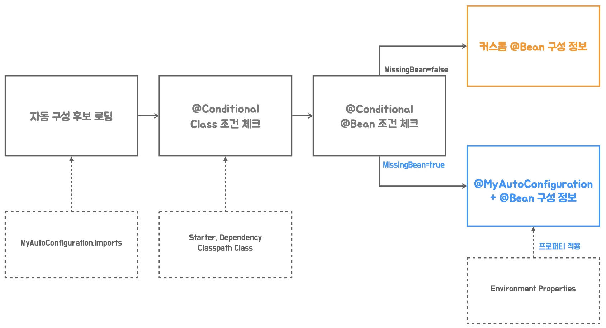

# 9. 외부 설정을 이용한 자동 구성

## `Environment` 추상화와 프로퍼티

---




- 스프링의 Environment 추상화는 애플리케이션의 두 가지 환경 정보 모델인 `profile`과 `properties`를 제공한다.
- 자동 구성 정보의 일부 내용을 변경하거나 설정해야할 때 `Environment`를 통해서 프로퍼티 값을 가져와 활용할 수 있다. 커스텀 빈 등록을 하는 방법에 비해서 간단하게 자동 구성의 디폴트 설정을 변경하는 게 가능하다.
- 프로퍼티 정보는 시스템 프로퍼티, 환경 변수, 서블릿 파라미터, JNDI 등에서 우선순위에 따라서 가져온다. 애플리케이션 코드에서 `@PropertySource`로 프로퍼티 값을 가져올 대상을 지정할 수 있다.
- 스프링 부트는 기본적으로 `application.properties`, `application.xml`, `application.yml` 등의 파일에서 프로퍼티를 읽어오는 기능을 추가했다.

## 자동 구성에 `Environment` 프로퍼티 적용

---

- 스프링 부트의 모든 애플리케이션 초기화 작업이 끝나고 나면 실행되는 코드를 만들 때 `ApplicationRunner` 인터페이스를 구현한 오브젝트 또는 람다식을 빈으로 등록하면 된다.
    
    ```java
    @Bean
    ApplicationRunner applicationRunner(Environment environment) {
        return args -> {
            String name = environment.getProperty("my.name");
            System.out.println("my.name: " + name);
        };
    }
    ```
    
- 자동 구성 클래스의 메서드에도 Environment를 주입 받아서 빈 속성으로 지정할 프로퍼티 값을 가져올 수 있다.
    
    ```java
    @Bean("tomcatWebServerFactory")
    @ConditionalOnMissingBean
    public ServletWebServerFactory servletWebServerFactory(Environment env) {
        TomcatServletWebServerFactory factory = new TomcatServletWebServerFactory();
        factory.setContextPath(env.getProperty("contextPath"));
        return factory;
    }
    ```
    

### 실습

---

- WebServerConfiguration.java
    - `@Bean` 제거
    
    ```java
    package tobyspring.helloboot;
    
    import org.springframework.boot.web.embedded.tomcat.TomcatServletWebServerFactory;
    import org.springframework.boot.web.servlet.server.ServletWebServerFactory;
    import org.springframework.context.annotation.Bean;
    import org.springframework.context.annotation.Configuration;
    
    @Configuration(proxyBeanMethods = false)
    public class WebServerConfiguration {
    //    @Bean
        ServletWebServerFactory customerWebServerFactory() {
            TomcatServletWebServerFactory serverFactory = new TomcatServletWebServerFactory();
            serverFactory.setPort(9090);
            return serverFactory;
        }
    }
    ```
    
- HellobootApplication.java
    
    ```java
    package tobyspring.helloboot;
    
    import org.springframework.boot.ApplicationRunner;
    import org.springframework.boot.SpringApplication;
    import org.springframework.context.annotation.Bean;
    import org.springframework.core.env.Environment;
    import tobyspring.config.MySpringBootApplication;
    
    @MySpringBootApplication
    public class HellobootApplication {
    
        @Bean
        ApplicationRunner applicationRunner(Environment env) {
            return args -> {
                String name = env.getProperty("my.name");
                System.out.println("my.name:" + name);
            };
        }
    
        public static void main(String[] args) {
            SpringApplication.run(HellobootApplication.class, args);
        }
    }
    ```
    
- application.properties
    
    ```java
    my.name=ApplicationProperties
    ```
    
    - 실행
        
        ```java
        /Users/yoonhee/.sdkman/candidates/java/11.0.24-tem/bin/java -XX:TieredStopAtLevel=1 -noverify -Dspring.output.ansi.enabled=always -Dcom.sun.management.jmxremote -Dspring.jmx.enabled=true -Dspring.liveBeansView.mbeanDomain -Dspring.application.admin.enabled=true -Dmanagement.endpoints.jmx.exposure.include=* -javaagent:/Applications/IntelliJ IDEA.app/Contents/lib/idea_rt.jar=54761:/Applications/IntelliJ IDEA.app/Contents/bin -Dfile.encoding=UTF-8 -classpath /Users/yoonhee/kyh1126/helloboot/build/classes/java/main:/Users/yoonhee/kyh1126/helloboot/build/resources/main:/Users/yoonhee/.gradle/caches/modules-2/files-2.1/org.springframework.boot/spring-boot-starter-web/2.7.6/9d0166a0390df593243bdc798ca7a1db20ddea9c/spring-boot-starter-web-2.7.6.jar:/Users/yoonhee/.gradle/caches/modules-2/files-2.1/org.springframework.boot/spring-boot-starter-json/2.7.6/77017e2aa78224c3fa10444d659c2ce8765b910/spring-boot-starter-json-2.7.6.jar:/Users/yoonhee/.gradle/caches/modules-2/files-2.1/org.springframework.boot/spring-boot-starter/2.7.6/d15341c0fc0b1d1362ce6c737b34679ad1f836c/spring-boot-starter-2.7.6.jar:/Users/yoonhee/.gradle/caches/modules-2/files-2.1/org.springframework.boot/spring-boot-starter-tomcat/2.7.6/ec920cd7f951f3cff3a0b7af80bb8f7116a3d8a5/spring-boot-starter-tomcat-2.7.6.jar:/Users/yoonhee/.gradle/caches/modules-2/files-2.1/org.springframework/spring-webmvc/5.3.24/33d2187c2bf1cb2c222bd1cc18b618736babcf3d/spring-webmvc-5.3.24.jar:/Users/yoonhee/.gradle/caches/modules-2/files-2.1/org.springframework/spring-web/5.3.24/d89bbcaabb1ff247a089875cbc4211bfe96c9a59/spring-web-5.3.24.jar:/Users/yoonhee/.gradle/caches/modules-2/files-2.1/com.fasterxml.jackson.datatype/jackson-datatype-jsr310/2.13.4/e6d820112871f33cd94a1dcc54eef58874753b5/jackson-datatype-jsr310-2.13.4.jar:/Users/yoonhee/.gradle/caches/modules-2/files-2.1/com.fasterxml.jackson.module/jackson-module-parameter-names/2.13.4/858ccf6624b5fac6044813e845063edb6a62cf37/jackson-module-parameter-names-2.13.4.jar:/Users/yoonhee/.gradle/caches/modules-2/files-2.1/com.fasterxml.jackson.datatype/jackson-datatype-jdk8/2.13.4/557dbba5d8dfc7b7f944c58fe084109afcb5670b/jackson-datatype-jdk8-2.13.4.jar:/Users/yoonhee/.gradle/caches/modules-2/files-2.1/com.fasterxml.jackson.core/jackson-databind/2.13.4.2/325c06bdfeb628cfb80ebaaf1a26cc1eb558a585/jackson-databind-2.13.4.2.jar:/Users/yoonhee/.gradle/caches/modules-2/files-2.1/org.springframework.boot/spring-boot-autoconfigure/2.7.6/4ad7e89accd25c69bfe84f52202deaf09430be2/spring-boot-autoconfigure-2.7.6.jar:/Users/yoonhee/.gradle/caches/modules-2/files-2.1/org.springframework.boot/spring-boot/2.7.6/f96f89eba708a591704db5dcbfc03e8822a503aa/spring-boot-2.7.6.jar:/Users/yoonhee/.gradle/caches/modules-2/files-2.1/org.springframework.boot/spring-boot-starter-logging/2.7.6/33a2d9e08d33a6a6f8051ed38daac14046e2f97c/spring-boot-starter-logging-2.7.6.jar:/Users/yoonhee/.gradle/caches/modules-2/files-2.1/jakarta.annotation/jakarta.annotation-api/1.3.5/59eb84ee0d616332ff44aba065f3888cf002cd2d/jakarta.annotation-api-1.3.5.jar:/Users/yoonhee/.gradle/caches/modules-2/files-2.1/org.springframework/spring-core/5.3.24/d095c329f30baf2b6d44eccbd2352d7a2f840c72/spring-core-5.3.24.jar:/Users/yoonhee/.gradle/caches/modules-2/files-2.1/org.yaml/snakeyaml/1.30/8fde7fe2586328ac3c68db92045e1c8759125000/snakeyaml-1.30.jar:/Users/yoonhee/.gradle/caches/modules-2/files-2.1/org.apache.tomcat.embed/tomcat-embed-websocket/9.0.69/c5da77c17a667b4e7a6bb01fb3b28c46c2717123/tomcat-embed-websocket-9.0.69.jar:/Users/yoonhee/.gradle/caches/modules-2/files-2.1/org.apache.tomcat.embed/tomcat-embed-core/9.0.69/27f2530eba96238aca56593bbd98edfdb038d9ef/tomcat-embed-core-9.0.69.jar:/Users/yoonhee/.gradle/caches/modules-2/files-2.1/org.apache.tomcat.embed/tomcat-embed-el/9.0.69/9c89a289c35b9ec20bdfb692a22dab87256bbe67/tomcat-embed-el-9.0.69.jar:/Users/yoonhee/.gradle/caches/modules-2/files-2.1/org.springframework/spring-context/5.3.24/e48634d7b8f40d4d0fe978830be0247bfc2ff2cd/spring-context-5.3.24.jar:/Users/yoonhee/.gradle/caches/modules-2/files-2.1/org.springframework/spring-aop/5.3.24/efd01bc1048a2e1b6a7442fbd78170bc02c342b7/spring-aop-5.3.24.jar:/Users/yoonhee/.gradle/caches/modules-2/files-2.1/org.springframework/spring-beans/5.3.24/e487ea6de09b9a7c36548028feeafa511a593532/spring-beans-5.3.24.jar:/Users/yoonhee/.gradle/caches/modules-2/files-2.1/org.springframework/spring-expression/5.3.24/ae7410418e7b4bd27a01e3fb1c2fed35b2bc1e84/spring-expression-5.3.24.jar:/Users/yoonhee/.gradle/caches/modules-2/files-2.1/com.fasterxml.jackson.core/jackson-annotations/2.13.4/858c6cc78e1f08a885b1613e1d817c829df70a6e/jackson-annotations-2.13.4.jar:/Users/yoonhee/.gradle/caches/modules-2/files-2.1/com.fasterxml.jackson.core/jackson-core/2.13.4/cf934c681294b97ef6d80082faeefbe1edadf56/jackson-core-2.13.4.jar:/Users/yoonhee/.gradle/caches/modules-2/files-2.1/ch.qos.logback/logback-classic/1.2.11/4741689214e9d1e8408b206506cbe76d1c6a7d60/logback-classic-1.2.11.jar:/Users/yoonhee/.gradle/caches/modules-2/files-2.1/org.apache.logging.log4j/log4j-to-slf4j/2.17.2/17dd0fae2747d9a28c67bc9534108823d2376b46/log4j-to-slf4j-2.17.2.jar:/Users/yoonhee/.gradle/caches/modules-2/files-2.1/org.slf4j/jul-to-slf4j/1.7.36/ed46d81cef9c412a88caef405b58f93a678ff2ca/jul-to-slf4j-1.7.36.jar:/Users/yoonhee/.gradle/caches/modules-2/files-2.1/org.springframework/spring-jcl/5.3.24/2b30878663ceed2af07238dc54e92e5bf001438d/spring-jcl-5.3.24.jar:/Users/yoonhee/.gradle/caches/modules-2/files-2.1/ch.qos.logback/logback-core/1.2.11/a01230df5ca5c34540cdaa3ad5efb012f1f1f792/logback-core-1.2.11.jar:/Users/yoonhee/.gradle/caches/modules-2/files-2.1/org.slf4j/slf4j-api/1.7.36/6c62681a2f655b49963a5983b8b0950a6120ae14/slf4j-api-1.7.36.jar:/Users/yoonhee/.gradle/caches/modules-2/files-2.1/org.apache.logging.log4j/log4j-api/2.17.2/f42d6afa111b4dec5d2aea0fe2197240749a4ea6/log4j-api-2.17.2.jar tobyspring.helloboot.HellobootApplication
        
          .   ____          _            __ _ _
         /\\ / ___'_ __ _ _(_)_ __  __ _ \ \ \ \
        ( ( )\___ | '_ | '_| | '_ \/ _` | \ \ \ \
         \\/  ___)| |_)| | | | | || (_| |  ) ) ) )
          '  |____| .__|_| |_|_| |_\__, | / / / /
         =========|_|==============|___/=/_/_/_/
         :: Spring Boot ::                (v2.7.6)
        
        2024-12-16 00:18:53.870  INFO 44023 --- [           main] t.helloboot.HellobootApplication         : Starting HellobootApplication using Java 11.0.24 on Yoonhee with PID 44023 (/Users/yoonhee/kyh1126/helloboot/build/classes/java/main started by yoonhee in /Users/yoonhee/kyh1126/helloboot)
        2024-12-16 00:18:53.871  INFO 44023 --- [           main] t.helloboot.HellobootApplication         : No active profile set, falling back to 1 default profile: "default"
        2024-12-16 00:18:53.980  INFO 44023 --- [           main] o.s.b.w.embedded.tomcat.TomcatWebServer  : Tomcat initialized with port(s): 9090 (http)
        2024-12-16 00:18:53.983  INFO 44023 --- [           main] o.apache.catalina.core.StandardService   : Starting service [Tomcat]
        2024-12-16 00:18:53.983  INFO 44023 --- [           main] org.apache.catalina.core.StandardEngine  : Starting Servlet engine: [Apache Tomcat/9.0.69]
        2024-12-16 00:18:54.016  INFO 44023 --- [           main] o.a.c.c.C.[Tomcat].[localhost].[/]       : Initializing Spring embedded WebApplicationContext
        2024-12-16 00:18:54.016  INFO 44023 --- [           main] w.s.c.ServletWebServerApplicationContext : Root WebApplicationContext: initialization completed in 132 ms
        2024-12-16 00:18:54.037  INFO 44023 --- [           main] o.s.b.w.embedded.tomcat.TomcatWebServer  : Tomcat started on port(s): 9090 (http) with context path ''
        2024-12-16 00:18:54.039  INFO 44023 --- [           main] t.helloboot.HellobootApplication         : Started HellobootApplication in 0.262 seconds (JVM running for 0.462)
        my.name:ApplicationProperties
        ```
        
- Environment variable 셋팅
    - `MY_NAME=EnvironmentVariable`
    
    
    
    - 실행
        
        ```java
        /Users/yoonhee/.sdkman/candidates/java/11.0.24-tem/bin/java -XX:TieredStopAtLevel=1 -noverify -Dspring.output.ansi.enabled=always -Dcom.sun.management.jmxremote -Dspring.jmx.enabled=true -Dspring.liveBeansView.mbeanDomain -Dspring.application.admin.enabled=true -Dmanagement.endpoints.jmx.exposure.include=* -javaagent:/Applications/IntelliJ IDEA.app/Contents/lib/idea_rt.jar=54847:/Applications/IntelliJ IDEA.app/Contents/bin -Dfile.encoding=UTF-8 -classpath /Users/yoonhee/kyh1126/helloboot/build/classes/java/main:/Users/yoonhee/kyh1126/helloboot/build/resources/main:/Users/yoonhee/.gradle/caches/modules-2/files-2.1/org.springframework.boot/spring-boot-starter-web/2.7.6/9d0166a0390df593243bdc798ca7a1db20ddea9c/spring-boot-starter-web-2.7.6.jar:/Users/yoonhee/.gradle/caches/modules-2/files-2.1/org.springframework.boot/spring-boot-starter-json/2.7.6/77017e2aa78224c3fa10444d659c2ce8765b910/spring-boot-starter-json-2.7.6.jar:/Users/yoonhee/.gradle/caches/modules-2/files-2.1/org.springframework.boot/spring-boot-starter/2.7.6/d15341c0fc0b1d1362ce6c737b34679ad1f836c/spring-boot-starter-2.7.6.jar:/Users/yoonhee/.gradle/caches/modules-2/files-2.1/org.springframework.boot/spring-boot-starter-tomcat/2.7.6/ec920cd7f951f3cff3a0b7af80bb8f7116a3d8a5/spring-boot-starter-tomcat-2.7.6.jar:/Users/yoonhee/.gradle/caches/modules-2/files-2.1/org.springframework/spring-webmvc/5.3.24/33d2187c2bf1cb2c222bd1cc18b618736babcf3d/spring-webmvc-5.3.24.jar:/Users/yoonhee/.gradle/caches/modules-2/files-2.1/org.springframework/spring-web/5.3.24/d89bbcaabb1ff247a089875cbc4211bfe96c9a59/spring-web-5.3.24.jar:/Users/yoonhee/.gradle/caches/modules-2/files-2.1/com.fasterxml.jackson.datatype/jackson-datatype-jsr310/2.13.4/e6d820112871f33cd94a1dcc54eef58874753b5/jackson-datatype-jsr310-2.13.4.jar:/Users/yoonhee/.gradle/caches/modules-2/files-2.1/com.fasterxml.jackson.module/jackson-module-parameter-names/2.13.4/858ccf6624b5fac6044813e845063edb6a62cf37/jackson-module-parameter-names-2.13.4.jar:/Users/yoonhee/.gradle/caches/modules-2/files-2.1/com.fasterxml.jackson.datatype/jackson-datatype-jdk8/2.13.4/557dbba5d8dfc7b7f944c58fe084109afcb5670b/jackson-datatype-jdk8-2.13.4.jar:/Users/yoonhee/.gradle/caches/modules-2/files-2.1/com.fasterxml.jackson.core/jackson-databind/2.13.4.2/325c06bdfeb628cfb80ebaaf1a26cc1eb558a585/jackson-databind-2.13.4.2.jar:/Users/yoonhee/.gradle/caches/modules-2/files-2.1/org.springframework.boot/spring-boot-autoconfigure/2.7.6/4ad7e89accd25c69bfe84f52202deaf09430be2/spring-boot-autoconfigure-2.7.6.jar:/Users/yoonhee/.gradle/caches/modules-2/files-2.1/org.springframework.boot/spring-boot/2.7.6/f96f89eba708a591704db5dcbfc03e8822a503aa/spring-boot-2.7.6.jar:/Users/yoonhee/.gradle/caches/modules-2/files-2.1/org.springframework.boot/spring-boot-starter-logging/2.7.6/33a2d9e08d33a6a6f8051ed38daac14046e2f97c/spring-boot-starter-logging-2.7.6.jar:/Users/yoonhee/.gradle/caches/modules-2/files-2.1/jakarta.annotation/jakarta.annotation-api/1.3.5/59eb84ee0d616332ff44aba065f3888cf002cd2d/jakarta.annotation-api-1.3.5.jar:/Users/yoonhee/.gradle/caches/modules-2/files-2.1/org.springframework/spring-core/5.3.24/d095c329f30baf2b6d44eccbd2352d7a2f840c72/spring-core-5.3.24.jar:/Users/yoonhee/.gradle/caches/modules-2/files-2.1/org.yaml/snakeyaml/1.30/8fde7fe2586328ac3c68db92045e1c8759125000/snakeyaml-1.30.jar:/Users/yoonhee/.gradle/caches/modules-2/files-2.1/org.apache.tomcat.embed/tomcat-embed-websocket/9.0.69/c5da77c17a667b4e7a6bb01fb3b28c46c2717123/tomcat-embed-websocket-9.0.69.jar:/Users/yoonhee/.gradle/caches/modules-2/files-2.1/org.apache.tomcat.embed/tomcat-embed-core/9.0.69/27f2530eba96238aca56593bbd98edfdb038d9ef/tomcat-embed-core-9.0.69.jar:/Users/yoonhee/.gradle/caches/modules-2/files-2.1/org.apache.tomcat.embed/tomcat-embed-el/9.0.69/9c89a289c35b9ec20bdfb692a22dab87256bbe67/tomcat-embed-el-9.0.69.jar:/Users/yoonhee/.gradle/caches/modules-2/files-2.1/org.springframework/spring-context/5.3.24/e48634d7b8f40d4d0fe978830be0247bfc2ff2cd/spring-context-5.3.24.jar:/Users/yoonhee/.gradle/caches/modules-2/files-2.1/org.springframework/spring-aop/5.3.24/efd01bc1048a2e1b6a7442fbd78170bc02c342b7/spring-aop-5.3.24.jar:/Users/yoonhee/.gradle/caches/modules-2/files-2.1/org.springframework/spring-beans/5.3.24/e487ea6de09b9a7c36548028feeafa511a593532/spring-beans-5.3.24.jar:/Users/yoonhee/.gradle/caches/modules-2/files-2.1/org.springframework/spring-expression/5.3.24/ae7410418e7b4bd27a01e3fb1c2fed35b2bc1e84/spring-expression-5.3.24.jar:/Users/yoonhee/.gradle/caches/modules-2/files-2.1/com.fasterxml.jackson.core/jackson-annotations/2.13.4/858c6cc78e1f08a885b1613e1d817c829df70a6e/jackson-annotations-2.13.4.jar:/Users/yoonhee/.gradle/caches/modules-2/files-2.1/com.fasterxml.jackson.core/jackson-core/2.13.4/cf934c681294b97ef6d80082faeefbe1edadf56/jackson-core-2.13.4.jar:/Users/yoonhee/.gradle/caches/modules-2/files-2.1/ch.qos.logback/logback-classic/1.2.11/4741689214e9d1e8408b206506cbe76d1c6a7d60/logback-classic-1.2.11.jar:/Users/yoonhee/.gradle/caches/modules-2/files-2.1/org.apache.logging.log4j/log4j-to-slf4j/2.17.2/17dd0fae2747d9a28c67bc9534108823d2376b46/log4j-to-slf4j-2.17.2.jar:/Users/yoonhee/.gradle/caches/modules-2/files-2.1/org.slf4j/jul-to-slf4j/1.7.36/ed46d81cef9c412a88caef405b58f93a678ff2ca/jul-to-slf4j-1.7.36.jar:/Users/yoonhee/.gradle/caches/modules-2/files-2.1/org.springframework/spring-jcl/5.3.24/2b30878663ceed2af07238dc54e92e5bf001438d/spring-jcl-5.3.24.jar:/Users/yoonhee/.gradle/caches/modules-2/files-2.1/ch.qos.logback/logback-core/1.2.11/a01230df5ca5c34540cdaa3ad5efb012f1f1f792/logback-core-1.2.11.jar:/Users/yoonhee/.gradle/caches/modules-2/files-2.1/org.slf4j/slf4j-api/1.7.36/6c62681a2f655b49963a5983b8b0950a6120ae14/slf4j-api-1.7.36.jar:/Users/yoonhee/.gradle/caches/modules-2/files-2.1/org.apache.logging.log4j/log4j-api/2.17.2/f42d6afa111b4dec5d2aea0fe2197240749a4ea6/log4j-api-2.17.2.jar tobyspring.helloboot.HellobootApplication
        
          .   ____          _            __ _ _
         /\\ / ___'_ __ _ _(_)_ __  __ _ \ \ \ \
        ( ( )\___ | '_ | '_| | '_ \/ _` | \ \ \ \
         \\/  ___)| |_)| | | | | || (_| |  ) ) ) )
          '  |____| .__|_| |_|_| |_\__, | / / / /
         =========|_|==============|___/=/_/_/_/
         :: Spring Boot ::                (v2.7.6)
        
        2024-12-16 00:20:10.036  INFO 44058 --- [           main] t.helloboot.HellobootApplication         : Starting HellobootApplication using Java 11.0.24 on Yoonhee with PID 44058 (/Users/yoonhee/kyh1126/helloboot/build/classes/java/main started by yoonhee in /Users/yoonhee/kyh1126/helloboot)
        2024-12-16 00:20:10.037  INFO 44058 --- [           main] t.helloboot.HellobootApplication         : No active profile set, falling back to 1 default profile: "default"
        2024-12-16 00:20:10.143  INFO 44058 --- [           main] o.s.b.w.embedded.tomcat.TomcatWebServer  : Tomcat initialized with port(s): 9090 (http)
        2024-12-16 00:20:10.146  INFO 44058 --- [           main] o.apache.catalina.core.StandardService   : Starting service [Tomcat]
        2024-12-16 00:20:10.146  INFO 44058 --- [           main] org.apache.catalina.core.StandardEngine  : Starting Servlet engine: [Apache Tomcat/9.0.69]
        2024-12-16 00:20:10.176  INFO 44058 --- [           main] o.a.c.c.C.[Tomcat].[localhost].[/]       : Initializing Spring embedded WebApplicationContext
        2024-12-16 00:20:10.176  INFO 44058 --- [           main] w.s.c.ServletWebServerApplicationContext : Root WebApplicationContext: initialization completed in 126 ms
        2024-12-16 00:20:10.202  INFO 44058 --- [           main] o.s.b.w.embedded.tomcat.TomcatWebServer  : Tomcat started on port(s): 9090 (http) with context path ''
        2024-12-16 00:20:10.205  INFO 44058 --- [           main] t.helloboot.HellobootApplication         : Started HellobootApplication in 0.27 seconds (JVM running for 0.581)
        my.name:EnvironmentVariable
        ```
        
- System property
    - `-Dmy.name=SystemProperty`
    
    
    
    - 실행
        
        ```java
        /Users/yoonhee/.sdkman/candidates/java/11.0.24-tem/bin/java -Dmy.name=SystemProperty -XX:TieredStopAtLevel=1 -noverify -Dspring.output.ansi.enabled=always -Dcom.sun.management.jmxremote -Dspring.jmx.enabled=true -Dspring.liveBeansView.mbeanDomain -Dspring.application.admin.enabled=true -Dmanagement.endpoints.jmx.exposure.include=* -javaagent:/Applications/IntelliJ IDEA.app/Contents/lib/idea_rt.jar=54989:/Applications/IntelliJ IDEA.app/Contents/bin -Dfile.encoding=UTF-8 -classpath /Users/yoonhee/kyh1126/helloboot/build/classes/java/main:/Users/yoonhee/kyh1126/helloboot/build/resources/main:/Users/yoonhee/.gradle/caches/modules-2/files-2.1/org.springframework.boot/spring-boot-starter-web/2.7.6/9d0166a0390df593243bdc798ca7a1db20ddea9c/spring-boot-starter-web-2.7.6.jar:/Users/yoonhee/.gradle/caches/modules-2/files-2.1/org.springframework.boot/spring-boot-starter-json/2.7.6/77017e2aa78224c3fa10444d659c2ce8765b910/spring-boot-starter-json-2.7.6.jar:/Users/yoonhee/.gradle/caches/modules-2/files-2.1/org.springframework.boot/spring-boot-starter/2.7.6/d15341c0fc0b1d1362ce6c737b34679ad1f836c/spring-boot-starter-2.7.6.jar:/Users/yoonhee/.gradle/caches/modules-2/files-2.1/org.springframework.boot/spring-boot-starter-tomcat/2.7.6/ec920cd7f951f3cff3a0b7af80bb8f7116a3d8a5/spring-boot-starter-tomcat-2.7.6.jar:/Users/yoonhee/.gradle/caches/modules-2/files-2.1/org.springframework/spring-webmvc/5.3.24/33d2187c2bf1cb2c222bd1cc18b618736babcf3d/spring-webmvc-5.3.24.jar:/Users/yoonhee/.gradle/caches/modules-2/files-2.1/org.springframework/spring-web/5.3.24/d89bbcaabb1ff247a089875cbc4211bfe96c9a59/spring-web-5.3.24.jar:/Users/yoonhee/.gradle/caches/modules-2/files-2.1/com.fasterxml.jackson.datatype/jackson-datatype-jsr310/2.13.4/e6d820112871f33cd94a1dcc54eef58874753b5/jackson-datatype-jsr310-2.13.4.jar:/Users/yoonhee/.gradle/caches/modules-2/files-2.1/com.fasterxml.jackson.module/jackson-module-parameter-names/2.13.4/858ccf6624b5fac6044813e845063edb6a62cf37/jackson-module-parameter-names-2.13.4.jar:/Users/yoonhee/.gradle/caches/modules-2/files-2.1/com.fasterxml.jackson.datatype/jackson-datatype-jdk8/2.13.4/557dbba5d8dfc7b7f944c58fe084109afcb5670b/jackson-datatype-jdk8-2.13.4.jar:/Users/yoonhee/.gradle/caches/modules-2/files-2.1/com.fasterxml.jackson.core/jackson-databind/2.13.4.2/325c06bdfeb628cfb80ebaaf1a26cc1eb558a585/jackson-databind-2.13.4.2.jar:/Users/yoonhee/.gradle/caches/modules-2/files-2.1/org.springframework.boot/spring-boot-autoconfigure/2.7.6/4ad7e89accd25c69bfe84f52202deaf09430be2/spring-boot-autoconfigure-2.7.6.jar:/Users/yoonhee/.gradle/caches/modules-2/files-2.1/org.springframework.boot/spring-boot/2.7.6/f96f89eba708a591704db5dcbfc03e8822a503aa/spring-boot-2.7.6.jar:/Users/yoonhee/.gradle/caches/modules-2/files-2.1/org.springframework.boot/spring-boot-starter-logging/2.7.6/33a2d9e08d33a6a6f8051ed38daac14046e2f97c/spring-boot-starter-logging-2.7.6.jar:/Users/yoonhee/.gradle/caches/modules-2/files-2.1/jakarta.annotation/jakarta.annotation-api/1.3.5/59eb84ee0d616332ff44aba065f3888cf002cd2d/jakarta.annotation-api-1.3.5.jar:/Users/yoonhee/.gradle/caches/modules-2/files-2.1/org.springframework/spring-core/5.3.24/d095c329f30baf2b6d44eccbd2352d7a2f840c72/spring-core-5.3.24.jar:/Users/yoonhee/.gradle/caches/modules-2/files-2.1/org.yaml/snakeyaml/1.30/8fde7fe2586328ac3c68db92045e1c8759125000/snakeyaml-1.30.jar:/Users/yoonhee/.gradle/caches/modules-2/files-2.1/org.apache.tomcat.embed/tomcat-embed-websocket/9.0.69/c5da77c17a667b4e7a6bb01fb3b28c46c2717123/tomcat-embed-websocket-9.0.69.jar:/Users/yoonhee/.gradle/caches/modules-2/files-2.1/org.apache.tomcat.embed/tomcat-embed-core/9.0.69/27f2530eba96238aca56593bbd98edfdb038d9ef/tomcat-embed-core-9.0.69.jar:/Users/yoonhee/.gradle/caches/modules-2/files-2.1/org.apache.tomcat.embed/tomcat-embed-el/9.0.69/9c89a289c35b9ec20bdfb692a22dab87256bbe67/tomcat-embed-el-9.0.69.jar:/Users/yoonhee/.gradle/caches/modules-2/files-2.1/org.springframework/spring-context/5.3.24/e48634d7b8f40d4d0fe978830be0247bfc2ff2cd/spring-context-5.3.24.jar:/Users/yoonhee/.gradle/caches/modules-2/files-2.1/org.springframework/spring-aop/5.3.24/efd01bc1048a2e1b6a7442fbd78170bc02c342b7/spring-aop-5.3.24.jar:/Users/yoonhee/.gradle/caches/modules-2/files-2.1/org.springframework/spring-beans/5.3.24/e487ea6de09b9a7c36548028feeafa511a593532/spring-beans-5.3.24.jar:/Users/yoonhee/.gradle/caches/modules-2/files-2.1/org.springframework/spring-expression/5.3.24/ae7410418e7b4bd27a01e3fb1c2fed35b2bc1e84/spring-expression-5.3.24.jar:/Users/yoonhee/.gradle/caches/modules-2/files-2.1/com.fasterxml.jackson.core/jackson-annotations/2.13.4/858c6cc78e1f08a885b1613e1d817c829df70a6e/jackson-annotations-2.13.4.jar:/Users/yoonhee/.gradle/caches/modules-2/files-2.1/com.fasterxml.jackson.core/jackson-core/2.13.4/cf934c681294b97ef6d80082faeefbe1edadf56/jackson-core-2.13.4.jar:/Users/yoonhee/.gradle/caches/modules-2/files-2.1/ch.qos.logback/logback-classic/1.2.11/4741689214e9d1e8408b206506cbe76d1c6a7d60/logback-classic-1.2.11.jar:/Users/yoonhee/.gradle/caches/modules-2/files-2.1/org.apache.logging.log4j/log4j-to-slf4j/2.17.2/17dd0fae2747d9a28c67bc9534108823d2376b46/log4j-to-slf4j-2.17.2.jar:/Users/yoonhee/.gradle/caches/modules-2/files-2.1/org.slf4j/jul-to-slf4j/1.7.36/ed46d81cef9c412a88caef405b58f93a678ff2ca/jul-to-slf4j-1.7.36.jar:/Users/yoonhee/.gradle/caches/modules-2/files-2.1/org.springframework/spring-jcl/5.3.24/2b30878663ceed2af07238dc54e92e5bf001438d/spring-jcl-5.3.24.jar:/Users/yoonhee/.gradle/caches/modules-2/files-2.1/ch.qos.logback/logback-core/1.2.11/a01230df5ca5c34540cdaa3ad5efb012f1f1f792/logback-core-1.2.11.jar:/Users/yoonhee/.gradle/caches/modules-2/files-2.1/org.slf4j/slf4j-api/1.7.36/6c62681a2f655b49963a5983b8b0950a6120ae14/slf4j-api-1.7.36.jar:/Users/yoonhee/.gradle/caches/modules-2/files-2.1/org.apache.logging.log4j/log4j-api/2.17.2/f42d6afa111b4dec5d2aea0fe2197240749a4ea6/log4j-api-2.17.2.jar tobyspring.helloboot.HellobootApplication
        
          .   ____          _            __ _ _
         /\\ / ___'_ __ _ _(_)_ __  __ _ \ \ \ \
        ( ( )\___ | '_ | '_| | '_ \/ _` | \ \ \ \
         \\/  ___)| |_)| | | | | || (_| |  ) ) ) )
          '  |____| .__|_| |_|_| |_\__, | / / / /
         =========|_|==============|___/=/_/_/_/
         :: Spring Boot ::                (v2.7.6)
        
        2024-12-16 00:21:15.076  INFO 44076 --- [           main] t.helloboot.HellobootApplication         : Starting HellobootApplication using Java 11.0.24 on Yoonhee with PID 44076 (/Users/yoonhee/kyh1126/helloboot/build/classes/java/main started by yoonhee in /Users/yoonhee/kyh1126/helloboot)
        2024-12-16 00:21:15.077  INFO 44076 --- [           main] t.helloboot.HellobootApplication         : No active profile set, falling back to 1 default profile: "default"
        2024-12-16 00:21:15.183  INFO 44076 --- [           main] o.s.b.w.embedded.tomcat.TomcatWebServer  : Tomcat initialized with port(s): 9090 (http)
        2024-12-16 00:21:15.186  INFO 44076 --- [           main] o.apache.catalina.core.StandardService   : Starting service [Tomcat]
        2024-12-16 00:21:15.186  INFO 44076 --- [           main] org.apache.catalina.core.StandardEngine  : Starting Servlet engine: [Apache Tomcat/9.0.69]
        2024-12-16 00:21:15.218  INFO 44076 --- [           main] o.a.c.c.C.[Tomcat].[localhost].[/]       : Initializing Spring embedded WebApplicationContext
        2024-12-16 00:21:15.218  INFO 44076 --- [           main] w.s.c.ServletWebServerApplicationContext : Root WebApplicationContext: initialization completed in 127 ms
        2024-12-16 00:21:15.239  INFO 44076 --- [           main] o.s.b.w.embedded.tomcat.TomcatWebServer  : Tomcat started on port(s): 9090 (http) with context path ''
        2024-12-16 00:21:15.241  INFO 44076 --- [           main] t.helloboot.HellobootApplication         : Started HellobootApplication in 0.257 seconds (JVM running for 0.447)
        my.name:SystemProperty
        ```
        

- TomcatWebServerConfig.java
    - `factory.setContextPath` 추가
    
    ```java
    package tobyspring.config.autoconfig;
    
    import org.springframework.boot.autoconfigure.condition.ConditionalOnMissingBean;
    import org.springframework.boot.web.embedded.tomcat.TomcatServletWebServerFactory;
    import org.springframework.boot.web.servlet.server.ServletWebServerFactory;
    import org.springframework.context.annotation.Bean;
    import tobyspring.config.ConditionalMyOnClass;
    import tobyspring.config.MyAutoConfiguration;
    
    @MyAutoConfiguration
    @ConditionalMyOnClass("org.apache.catalina.startup.Tomcat")
    public class TomcatWebServerConfig {
        @Bean("tomcatWebServerFactory")
        @ConditionalOnMissingBean
        public ServletWebServerFactory servletWebServerFactory() {
            TomcatServletWebServerFactory factory = new TomcatServletWebServerFactory();
            factory.setContextPath("/app");
            return factory;
        }
    }
    ```
    
    - 실행
        
        ```java
        /Users/yoonhee/.sdkman/candidates/java/11.0.24-tem/bin/java -Dmy.name=SystemProperty -XX:TieredStopAtLevel=1 -noverify -Dspring.output.ansi.enabled=always -Dcom.sun.management.jmxremote -Dspring.jmx.enabled=true -Dspring.liveBeansView.mbeanDomain -Dspring.application.admin.enabled=true -Dmanagement.endpoints.jmx.exposure.include=* -javaagent:/Applications/IntelliJ IDEA.app/Contents/lib/idea_rt.jar=55454:/Applications/IntelliJ IDEA.app/Contents/bin -Dfile.encoding=UTF-8 -classpath /Users/yoonhee/kyh1126/helloboot/build/classes/java/main:/Users/yoonhee/kyh1126/helloboot/build/resources/main:/Users/yoonhee/.gradle/caches/modules-2/files-2.1/org.springframework.boot/spring-boot-starter-web/2.7.6/9d0166a0390df593243bdc798ca7a1db20ddea9c/spring-boot-starter-web-2.7.6.jar:/Users/yoonhee/.gradle/caches/modules-2/files-2.1/org.springframework.boot/spring-boot-starter-json/2.7.6/77017e2aa78224c3fa10444d659c2ce8765b910/spring-boot-starter-json-2.7.6.jar:/Users/yoonhee/.gradle/caches/modules-2/files-2.1/org.springframework.boot/spring-boot-starter/2.7.6/d15341c0fc0b1d1362ce6c737b34679ad1f836c/spring-boot-starter-2.7.6.jar:/Users/yoonhee/.gradle/caches/modules-2/files-2.1/org.springframework.boot/spring-boot-starter-tomcat/2.7.6/ec920cd7f951f3cff3a0b7af80bb8f7116a3d8a5/spring-boot-starter-tomcat-2.7.6.jar:/Users/yoonhee/.gradle/caches/modules-2/files-2.1/org.springframework/spring-webmvc/5.3.24/33d2187c2bf1cb2c222bd1cc18b618736babcf3d/spring-webmvc-5.3.24.jar:/Users/yoonhee/.gradle/caches/modules-2/files-2.1/org.springframework/spring-web/5.3.24/d89bbcaabb1ff247a089875cbc4211bfe96c9a59/spring-web-5.3.24.jar:/Users/yoonhee/.gradle/caches/modules-2/files-2.1/com.fasterxml.jackson.datatype/jackson-datatype-jsr310/2.13.4/e6d820112871f33cd94a1dcc54eef58874753b5/jackson-datatype-jsr310-2.13.4.jar:/Users/yoonhee/.gradle/caches/modules-2/files-2.1/com.fasterxml.jackson.module/jackson-module-parameter-names/2.13.4/858ccf6624b5fac6044813e845063edb6a62cf37/jackson-module-parameter-names-2.13.4.jar:/Users/yoonhee/.gradle/caches/modules-2/files-2.1/com.fasterxml.jackson.datatype/jackson-datatype-jdk8/2.13.4/557dbba5d8dfc7b7f944c58fe084109afcb5670b/jackson-datatype-jdk8-2.13.4.jar:/Users/yoonhee/.gradle/caches/modules-2/files-2.1/com.fasterxml.jackson.core/jackson-databind/2.13.4.2/325c06bdfeb628cfb80ebaaf1a26cc1eb558a585/jackson-databind-2.13.4.2.jar:/Users/yoonhee/.gradle/caches/modules-2/files-2.1/org.springframework.boot/spring-boot-autoconfigure/2.7.6/4ad7e89accd25c69bfe84f52202deaf09430be2/spring-boot-autoconfigure-2.7.6.jar:/Users/yoonhee/.gradle/caches/modules-2/files-2.1/org.springframework.boot/spring-boot/2.7.6/f96f89eba708a591704db5dcbfc03e8822a503aa/spring-boot-2.7.6.jar:/Users/yoonhee/.gradle/caches/modules-2/files-2.1/org.springframework.boot/spring-boot-starter-logging/2.7.6/33a2d9e08d33a6a6f8051ed38daac14046e2f97c/spring-boot-starter-logging-2.7.6.jar:/Users/yoonhee/.gradle/caches/modules-2/files-2.1/jakarta.annotation/jakarta.annotation-api/1.3.5/59eb84ee0d616332ff44aba065f3888cf002cd2d/jakarta.annotation-api-1.3.5.jar:/Users/yoonhee/.gradle/caches/modules-2/files-2.1/org.springframework/spring-core/5.3.24/d095c329f30baf2b6d44eccbd2352d7a2f840c72/spring-core-5.3.24.jar:/Users/yoonhee/.gradle/caches/modules-2/files-2.1/org.yaml/snakeyaml/1.30/8fde7fe2586328ac3c68db92045e1c8759125000/snakeyaml-1.30.jar:/Users/yoonhee/.gradle/caches/modules-2/files-2.1/org.apache.tomcat.embed/tomcat-embed-websocket/9.0.69/c5da77c17a667b4e7a6bb01fb3b28c46c2717123/tomcat-embed-websocket-9.0.69.jar:/Users/yoonhee/.gradle/caches/modules-2/files-2.1/org.apache.tomcat.embed/tomcat-embed-core/9.0.69/27f2530eba96238aca56593bbd98edfdb038d9ef/tomcat-embed-core-9.0.69.jar:/Users/yoonhee/.gradle/caches/modules-2/files-2.1/org.apache.tomcat.embed/tomcat-embed-el/9.0.69/9c89a289c35b9ec20bdfb692a22dab87256bbe67/tomcat-embed-el-9.0.69.jar:/Users/yoonhee/.gradle/caches/modules-2/files-2.1/org.springframework/spring-context/5.3.24/e48634d7b8f40d4d0fe978830be0247bfc2ff2cd/spring-context-5.3.24.jar:/Users/yoonhee/.gradle/caches/modules-2/files-2.1/org.springframework/spring-aop/5.3.24/efd01bc1048a2e1b6a7442fbd78170bc02c342b7/spring-aop-5.3.24.jar:/Users/yoonhee/.gradle/caches/modules-2/files-2.1/org.springframework/spring-beans/5.3.24/e487ea6de09b9a7c36548028feeafa511a593532/spring-beans-5.3.24.jar:/Users/yoonhee/.gradle/caches/modules-2/files-2.1/org.springframework/spring-expression/5.3.24/ae7410418e7b4bd27a01e3fb1c2fed35b2bc1e84/spring-expression-5.3.24.jar:/Users/yoonhee/.gradle/caches/modules-2/files-2.1/com.fasterxml.jackson.core/jackson-annotations/2.13.4/858c6cc78e1f08a885b1613e1d817c829df70a6e/jackson-annotations-2.13.4.jar:/Users/yoonhee/.gradle/caches/modules-2/files-2.1/com.fasterxml.jackson.core/jackson-core/2.13.4/cf934c681294b97ef6d80082faeefbe1edadf56/jackson-core-2.13.4.jar:/Users/yoonhee/.gradle/caches/modules-2/files-2.1/ch.qos.logback/logback-classic/1.2.11/4741689214e9d1e8408b206506cbe76d1c6a7d60/logback-classic-1.2.11.jar:/Users/yoonhee/.gradle/caches/modules-2/files-2.1/org.apache.logging.log4j/log4j-to-slf4j/2.17.2/17dd0fae2747d9a28c67bc9534108823d2376b46/log4j-to-slf4j-2.17.2.jar:/Users/yoonhee/.gradle/caches/modules-2/files-2.1/org.slf4j/jul-to-slf4j/1.7.36/ed46d81cef9c412a88caef405b58f93a678ff2ca/jul-to-slf4j-1.7.36.jar:/Users/yoonhee/.gradle/caches/modules-2/files-2.1/org.springframework/spring-jcl/5.3.24/2b30878663ceed2af07238dc54e92e5bf001438d/spring-jcl-5.3.24.jar:/Users/yoonhee/.gradle/caches/modules-2/files-2.1/ch.qos.logback/logback-core/1.2.11/a01230df5ca5c34540cdaa3ad5efb012f1f1f792/logback-core-1.2.11.jar:/Users/yoonhee/.gradle/caches/modules-2/files-2.1/org.slf4j/slf4j-api/1.7.36/6c62681a2f655b49963a5983b8b0950a6120ae14/slf4j-api-1.7.36.jar:/Users/yoonhee/.gradle/caches/modules-2/files-2.1/org.apache.logging.log4j/log4j-api/2.17.2/f42d6afa111b4dec5d2aea0fe2197240749a4ea6/log4j-api-2.17.2.jar tobyspring.helloboot.HellobootApplication
        
          .   ____          _            __ _ _
         /\\ / ___'_ __ _ _(_)_ __  __ _ \ \ \ \
        ( ( )\___ | '_ | '_| | '_ \/ _` | \ \ \ \
         \\/  ___)| |_)| | | | | || (_| |  ) ) ) )
          '  |____| .__|_| |_|_| |_\__, | / / / /
         =========|_|==============|___/=/_/_/_/
         :: Spring Boot ::                (v2.7.6)
        
        2024-12-16 00:28:51.267  INFO 44559 --- [           main] t.helloboot.HellobootApplication         : Starting HellobootApplication using Java 11.0.24 on Yoonhee with PID 44559 (/Users/yoonhee/kyh1126/helloboot/build/classes/java/main started by yoonhee in /Users/yoonhee/kyh1126/helloboot)
        2024-12-16 00:28:51.268  INFO 44559 --- [           main] t.helloboot.HellobootApplication         : No active profile set, falling back to 1 default profile: "default"
        2024-12-16 00:28:51.376  INFO 44559 --- [           main] o.s.b.w.embedded.tomcat.TomcatWebServer  : Tomcat initialized with port(s): 8080 (http)
        2024-12-16 00:28:51.378  INFO 44559 --- [           main] o.apache.catalina.core.StandardService   : Starting service [Tomcat]
        2024-12-16 00:28:51.378  INFO 44559 --- [           main] org.apache.catalina.core.StandardEngine  : Starting Servlet engine: [Apache Tomcat/9.0.69]
        2024-12-16 00:28:51.410  INFO 44559 --- [           main] o.a.c.c.C.[Tomcat].[localhost].[/app]    : Initializing Spring embedded WebApplicationContext
        2024-12-16 00:28:51.410  INFO 44559 --- [           main] w.s.c.ServletWebServerApplicationContext : Root WebApplicationContext: initialization completed in 129 ms
        2024-12-16 00:28:51.428  INFO 44559 --- [           main] o.s.b.w.embedded.tomcat.TomcatWebServer  : Tomcat started on port(s): 8080 (http) with context path '/app'
        2024-12-16 00:28:51.430  INFO 44559 --- [           main] t.helloboot.HellobootApplication         : Started HellobootApplication in 0.255 seconds (JVM running for 0.439)
        ```
        
    - `Environment`에서 꺼내서 셋팅하기
        
        ```java
        package tobyspring.config.autoconfig;
        
        import org.springframework.boot.autoconfigure.condition.ConditionalOnMissingBean;
        import org.springframework.boot.web.embedded.tomcat.TomcatServletWebServerFactory;
        import org.springframework.boot.web.servlet.server.ServletWebServerFactory;
        import org.springframework.context.annotation.Bean;
        import org.springframework.core.env.Environment;
        import tobyspring.config.ConditionalMyOnClass;
        import tobyspring.config.MyAutoConfiguration;
        
        @MyAutoConfiguration
        @ConditionalMyOnClass("org.apache.catalina.startup.Tomcat")
        public class TomcatWebServerConfig {
            @Bean("tomcatWebServerFactory")
            @ConditionalOnMissingBean
            public ServletWebServerFactory servletWebServerFactory(Environment env) {
                TomcatServletWebServerFactory factory = new TomcatServletWebServerFactory();
        //        factory.setContextPath("/app");
                factory.setContextPath(env.getProperty("contextPath"));
                return factory;
            }
        }
        ```
        
    - application.properties
        
        ```java
        my.name=ApplicationProperties
        contextPath=/app
        ```
        

## `@Value`와 `PropertySourcesPlaceholderConfigurer`

---

- `@Value` 애노테이션은 엘리먼트로 치환자(placeholder)를 지정하고 컨테이너 초기화시 프로퍼티 값으로 이를 대체할 수 있다.
- `@Value`의 치환자를 프로퍼티 값으로 교체하려면 `PropertySourcesPlaceholderConfigurer` 타입의 빈을 등록해줘야 한다. `PropertySourcesPlaceholderConfigurer`는 빈 팩토리의 후처리기로 동작해서 초기 구성 정보에서 치환자를 찾아서 교체하는 기능을 담당한다.
- `PropertySourcesPlaceholderConfigurer`도 자동 구성 빈으로 등록되게 한다.
    
    ```java
    @MyAutoConfiguration
    public class PropertyPlaceholderConfig {
        @Bean PropertySourcesPlaceholderConfigurer propertySourcesPlaceholderConfigurer() {
            return new PropertySourcesPlaceholderConfigurer();
        }
    }
    ```
    

### 실습

---

- TomcatWebServerConfig.java
    - 이렇게 해서 실행해도, 환경 변수로 치환되지 않았다.
    
    ```java
    package tobyspring.config.autoconfig;
    
    import org.springframework.beans.factory.annotation.Value;
    import org.springframework.boot.autoconfigure.condition.ConditionalOnMissingBean;
    import org.springframework.boot.web.embedded.tomcat.TomcatServletWebServerFactory;
    import org.springframework.boot.web.servlet.server.ServletWebServerFactory;
    import org.springframework.context.annotation.Bean;
    import org.springframework.core.env.Environment;
    import tobyspring.config.ConditionalMyOnClass;
    import tobyspring.config.MyAutoConfiguration;
    
    @MyAutoConfiguration
    @ConditionalMyOnClass("org.apache.catalina.startup.Tomcat")
    public class TomcatWebServerConfig {
        @Value("${contextPath}")
        String contextPath;
    
        @Bean("tomcatWebServerFactory")
        @ConditionalOnMissingBean
        public ServletWebServerFactory servletWebServerFactory(Environment env) {
            TomcatServletWebServerFactory factory = new TomcatServletWebServerFactory();
            factory.setContextPath(contextPath);
            return factory;
        }
    }
    ```
    
    - 실행
        - 에러 발생
        
        ```java
        /Users/yoonhee/.sdkman/candidates/java/11.0.24-tem/bin/java -Dmy.name=SystemProperty -XX:TieredStopAtLevel=1 -noverify -Dspring.output.ansi.enabled=always -Dcom.sun.management.jmxremote -Dspring.jmx.enabled=true -Dspring.liveBeansView.mbeanDomain -Dspring.application.admin.enabled=true -Dmanagement.endpoints.jmx.exposure.include=* -javaagent:/Applications/IntelliJ IDEA.app/Contents/lib/idea_rt.jar=57117:/Applications/IntelliJ IDEA.app/Contents/bin -Dfile.encoding=UTF-8 -classpath /Users/yoonhee/kyh1126/helloboot/build/classes/java/main:/Users/yoonhee/kyh1126/helloboot/build/resources/main:/Users/yoonhee/.gradle/caches/modules-2/files-2.1/org.springframework.boot/spring-boot-starter-web/2.7.6/9d0166a0390df593243bdc798ca7a1db20ddea9c/spring-boot-starter-web-2.7.6.jar:/Users/yoonhee/.gradle/caches/modules-2/files-2.1/org.springframework.boot/spring-boot-starter-json/2.7.6/77017e2aa78224c3fa10444d659c2ce8765b910/spring-boot-starter-json-2.7.6.jar:/Users/yoonhee/.gradle/caches/modules-2/files-2.1/org.springframework.boot/spring-boot-starter/2.7.6/d15341c0fc0b1d1362ce6c737b34679ad1f836c/spring-boot-starter-2.7.6.jar:/Users/yoonhee/.gradle/caches/modules-2/files-2.1/org.springframework.boot/spring-boot-starter-tomcat/2.7.6/ec920cd7f951f3cff3a0b7af80bb8f7116a3d8a5/spring-boot-starter-tomcat-2.7.6.jar:/Users/yoonhee/.gradle/caches/modules-2/files-2.1/org.springframework/spring-webmvc/5.3.24/33d2187c2bf1cb2c222bd1cc18b618736babcf3d/spring-webmvc-5.3.24.jar:/Users/yoonhee/.gradle/caches/modules-2/files-2.1/org.springframework/spring-web/5.3.24/d89bbcaabb1ff247a089875cbc4211bfe96c9a59/spring-web-5.3.24.jar:/Users/yoonhee/.gradle/caches/modules-2/files-2.1/com.fasterxml.jackson.datatype/jackson-datatype-jsr310/2.13.4/e6d820112871f33cd94a1dcc54eef58874753b5/jackson-datatype-jsr310-2.13.4.jar:/Users/yoonhee/.gradle/caches/modules-2/files-2.1/com.fasterxml.jackson.module/jackson-module-parameter-names/2.13.4/858ccf6624b5fac6044813e845063edb6a62cf37/jackson-module-parameter-names-2.13.4.jar:/Users/yoonhee/.gradle/caches/modules-2/files-2.1/com.fasterxml.jackson.datatype/jackson-datatype-jdk8/2.13.4/557dbba5d8dfc7b7f944c58fe084109afcb5670b/jackson-datatype-jdk8-2.13.4.jar:/Users/yoonhee/.gradle/caches/modules-2/files-2.1/com.fasterxml.jackson.core/jackson-databind/2.13.4.2/325c06bdfeb628cfb80ebaaf1a26cc1eb558a585/jackson-databind-2.13.4.2.jar:/Users/yoonhee/.gradle/caches/modules-2/files-2.1/org.springframework.boot/spring-boot-autoconfigure/2.7.6/4ad7e89accd25c69bfe84f52202deaf09430be2/spring-boot-autoconfigure-2.7.6.jar:/Users/yoonhee/.gradle/caches/modules-2/files-2.1/org.springframework.boot/spring-boot/2.7.6/f96f89eba708a591704db5dcbfc03e8822a503aa/spring-boot-2.7.6.jar:/Users/yoonhee/.gradle/caches/modules-2/files-2.1/org.springframework.boot/spring-boot-starter-logging/2.7.6/33a2d9e08d33a6a6f8051ed38daac14046e2f97c/spring-boot-starter-logging-2.7.6.jar:/Users/yoonhee/.gradle/caches/modules-2/files-2.1/jakarta.annotation/jakarta.annotation-api/1.3.5/59eb84ee0d616332ff44aba065f3888cf002cd2d/jakarta.annotation-api-1.3.5.jar:/Users/yoonhee/.gradle/caches/modules-2/files-2.1/org.springframework/spring-core/5.3.24/d095c329f30baf2b6d44eccbd2352d7a2f840c72/spring-core-5.3.24.jar:/Users/yoonhee/.gradle/caches/modules-2/files-2.1/org.yaml/snakeyaml/1.30/8fde7fe2586328ac3c68db92045e1c8759125000/snakeyaml-1.30.jar:/Users/yoonhee/.gradle/caches/modules-2/files-2.1/org.apache.tomcat.embed/tomcat-embed-websocket/9.0.69/c5da77c17a667b4e7a6bb01fb3b28c46c2717123/tomcat-embed-websocket-9.0.69.jar:/Users/yoonhee/.gradle/caches/modules-2/files-2.1/org.apache.tomcat.embed/tomcat-embed-core/9.0.69/27f2530eba96238aca56593bbd98edfdb038d9ef/tomcat-embed-core-9.0.69.jar:/Users/yoonhee/.gradle/caches/modules-2/files-2.1/org.apache.tomcat.embed/tomcat-embed-el/9.0.69/9c89a289c35b9ec20bdfb692a22dab87256bbe67/tomcat-embed-el-9.0.69.jar:/Users/yoonhee/.gradle/caches/modules-2/files-2.1/org.springframework/spring-context/5.3.24/e48634d7b8f40d4d0fe978830be0247bfc2ff2cd/spring-context-5.3.24.jar:/Users/yoonhee/.gradle/caches/modules-2/files-2.1/org.springframework/spring-aop/5.3.24/efd01bc1048a2e1b6a7442fbd78170bc02c342b7/spring-aop-5.3.24.jar:/Users/yoonhee/.gradle/caches/modules-2/files-2.1/org.springframework/spring-beans/5.3.24/e487ea6de09b9a7c36548028feeafa511a593532/spring-beans-5.3.24.jar:/Users/yoonhee/.gradle/caches/modules-2/files-2.1/org.springframework/spring-expression/5.3.24/ae7410418e7b4bd27a01e3fb1c2fed35b2bc1e84/spring-expression-5.3.24.jar:/Users/yoonhee/.gradle/caches/modules-2/files-2.1/com.fasterxml.jackson.core/jackson-annotations/2.13.4/858c6cc78e1f08a885b1613e1d817c829df70a6e/jackson-annotations-2.13.4.jar:/Users/yoonhee/.gradle/caches/modules-2/files-2.1/com.fasterxml.jackson.core/jackson-core/2.13.4/cf934c681294b97ef6d80082faeefbe1edadf56/jackson-core-2.13.4.jar:/Users/yoonhee/.gradle/caches/modules-2/files-2.1/ch.qos.logback/logback-classic/1.2.11/4741689214e9d1e8408b206506cbe76d1c6a7d60/logback-classic-1.2.11.jar:/Users/yoonhee/.gradle/caches/modules-2/files-2.1/org.apache.logging.log4j/log4j-to-slf4j/2.17.2/17dd0fae2747d9a28c67bc9534108823d2376b46/log4j-to-slf4j-2.17.2.jar:/Users/yoonhee/.gradle/caches/modules-2/files-2.1/org.slf4j/jul-to-slf4j/1.7.36/ed46d81cef9c412a88caef405b58f93a678ff2ca/jul-to-slf4j-1.7.36.jar:/Users/yoonhee/.gradle/caches/modules-2/files-2.1/org.springframework/spring-jcl/5.3.24/2b30878663ceed2af07238dc54e92e5bf001438d/spring-jcl-5.3.24.jar:/Users/yoonhee/.gradle/caches/modules-2/files-2.1/ch.qos.logback/logback-core/1.2.11/a01230df5ca5c34540cdaa3ad5efb012f1f1f792/logback-core-1.2.11.jar:/Users/yoonhee/.gradle/caches/modules-2/files-2.1/org.slf4j/slf4j-api/1.7.36/6c62681a2f655b49963a5983b8b0950a6120ae14/slf4j-api-1.7.36.jar:/Users/yoonhee/.gradle/caches/modules-2/files-2.1/org.apache.logging.log4j/log4j-api/2.17.2/f42d6afa111b4dec5d2aea0fe2197240749a4ea6/log4j-api-2.17.2.jar tobyspring.helloboot.HellobootApplication
        
          .   ____          _            __ _ _
         /\\ / ___'_ __ _ _(_)_ __  __ _ \ \ \ \
        ( ( )\___ | '_ | '_| | '_ \/ _` | \ \ \ \
         \\/  ___)| |_)| | | | | || (_| |  ) ) ) )
          '  |____| .__|_| |_|_| |_\__, | / / / /
         =========|_|==============|___/=/_/_/_/
         :: Spring Boot ::                (v2.7.6)
        
        2024-12-16 00:40:14.719  INFO 46047 --- [           main] t.helloboot.HellobootApplication         : Starting HellobootApplication using Java 11.0.24 on Yoonhee with PID 46047 (/Users/yoonhee/kyh1126/helloboot/build/classes/java/main started by yoonhee in /Users/yoonhee/kyh1126/helloboot)
        2024-12-16 00:40:14.720  INFO 46047 --- [           main] t.helloboot.HellobootApplication         : No active profile set, falling back to 1 default profile: "default"
        2024-12-16 00:40:14.801  WARN 46047 --- [           main] ConfigServletWebServerApplicationContext : Exception encountered during context initialization - cancelling refresh attempt: org.springframework.context.ApplicationContextException: Unable to start web server; nested exception is org.springframework.beans.factory.BeanCreationException: Error creating bean with name 'tomcatWebServerFactory' defined in class path resource [tobyspring/config/autoconfig/TomcatWebServerConfig.class]: Bean instantiation via factory method failed; nested exception is org.springframework.beans.BeanInstantiationException: Failed to instantiate [org.springframework.boot.web.servlet.server.ServletWebServerFactory]: Factory method 'servletWebServerFactory' threw exception; nested exception is java.lang.IllegalArgumentException: ContextPath must start with '/' and not end with '/'
        2024-12-16 00:40:14.803  INFO 46047 --- [           main] ConditionEvaluationReportLoggingListener : 
        
        Error starting ApplicationContext. To display the conditions report re-run your application with 'debug' enabled.
        2024-12-16 00:40:14.810 ERROR 46047 --- [           main] o.s.boot.SpringApplication               : Application run failed
        
        org.springframework.context.ApplicationContextException: Unable to start web server; nested exception is org.springframework.beans.factory.BeanCreationException: Error creating bean with name 'tomcatWebServerFactory' defined in class path resource [tobyspring/config/autoconfig/TomcatWebServerConfig.class]: Bean instantiation via factory method failed; nested exception is org.springframework.beans.BeanInstantiationException: Failed to instantiate [org.springframework.boot.web.servlet.server.ServletWebServerFactory]: Factory method 'servletWebServerFactory' threw exception; nested exception is java.lang.IllegalArgumentException: ContextPath must start with '/' and not end with '/'
        	at org.springframework.boot.web.servlet.context.ServletWebServerApplicationContext.onRefresh(ServletWebServerApplicationContext.java:165) ~[spring-boot-2.7.6.jar:2.7.6]
        	at org.springframework.context.support.AbstractApplicationContext.refresh(AbstractApplicationContext.java:577) ~[spring-context-5.3.24.jar:5.3.24]
        	at org.springframework.boot.web.servlet.context.ServletWebServerApplicationContext.refresh(ServletWebServerApplicationContext.java:147) ~[spring-boot-2.7.6.jar:2.7.6]
        	at org.springframework.boot.SpringApplication.refresh(SpringApplication.java:731) ~[spring-boot-2.7.6.jar:2.7.6]
        	at org.springframework.boot.SpringApplication.refreshContext(SpringApplication.java:408) ~[spring-boot-2.7.6.jar:2.7.6]
        	at org.springframework.boot.SpringApplication.run(SpringApplication.java:307) ~[spring-boot-2.7.6.jar:2.7.6]
        	at org.springframework.boot.SpringApplication.run(SpringApplication.java:1303) ~[spring-boot-2.7.6.jar:2.7.6]
        	at org.springframework.boot.SpringApplication.run(SpringApplication.java:1292) ~[spring-boot-2.7.6.jar:2.7.6]
        	at tobyspring.helloboot.HellobootApplication.main(HellobootApplication.java:10) ~[main/:na]
        Caused by: org.springframework.beans.factory.BeanCreationException: Error creating bean with name 'tomcatWebServerFactory' defined in class path resource [tobyspring/config/autoconfig/TomcatWebServerConfig.class]: Bean instantiation via factory method failed; nested exception is org.springframework.beans.BeanInstantiationException: Failed to instantiate [org.springframework.boot.web.servlet.server.ServletWebServerFactory]: Factory method 'servletWebServerFactory' threw exception; nested exception is java.lang.IllegalArgumentException: ContextPath must start with '/' and not end with '/'
        	at org.springframework.beans.factory.support.ConstructorResolver.instantiate(ConstructorResolver.java:658) ~[spring-beans-5.3.24.jar:5.3.24]
        	at org.springframework.beans.factory.support.ConstructorResolver.instantiateUsingFactoryMethod(ConstructorResolver.java:638) ~[spring-beans-5.3.24.jar:5.3.24]
        	at org.springframework.beans.factory.support.AbstractAutowireCapableBeanFactory.instantiateUsingFactoryMethod(AbstractAutowireCapableBeanFactory.java:1352) ~[spring-beans-5.3.24.jar:5.3.24]
        	at org.springframework.beans.factory.support.AbstractAutowireCapableBeanFactory.createBeanInstance(AbstractAutowireCapableBeanFactory.java:1195) ~[spring-beans-5.3.24.jar:5.3.24]
        	at org.springframework.beans.factory.support.AbstractAutowireCapableBeanFactory.doCreateBean(AbstractAutowireCapableBeanFactory.java:582) ~[spring-beans-5.3.24.jar:5.3.24]
        	at org.springframework.beans.factory.support.AbstractAutowireCapableBeanFactory.createBean(AbstractAutowireCapableBeanFactory.java:542) ~[spring-beans-5.3.24.jar:5.3.24]
        	at org.springframework.beans.factory.support.AbstractBeanFactory.lambda$doGetBean$0(AbstractBeanFactory.java:335) ~[spring-beans-5.3.24.jar:5.3.24]
        	at org.springframework.beans.factory.support.DefaultSingletonBeanRegistry.getSingleton(DefaultSingletonBeanRegistry.java:234) ~[spring-beans-5.3.24.jar:5.3.24]
        	at org.springframework.beans.factory.support.AbstractBeanFactory.doGetBean(AbstractBeanFactory.java:333) ~[spring-beans-5.3.24.jar:5.3.24]
        	at org.springframework.beans.factory.support.AbstractBeanFactory.getBean(AbstractBeanFactory.java:213) ~[spring-beans-5.3.24.jar:5.3.24]
        	at org.springframework.boot.web.servlet.context.ServletWebServerApplicationContext.getWebServerFactory(ServletWebServerApplicationContext.java:219) ~[spring-boot-2.7.6.jar:2.7.6]
        	at org.springframework.boot.web.servlet.context.ServletWebServerApplicationContext.createWebServer(ServletWebServerApplicationContext.java:182) ~[spring-boot-2.7.6.jar:2.7.6]
        	at org.springframework.boot.web.servlet.context.ServletWebServerApplicationContext.onRefresh(ServletWebServerApplicationContext.java:162) ~[spring-boot-2.7.6.jar:2.7.6]
        	... 8 common frames omitted
        Caused by: org.springframework.beans.BeanInstantiationException: Failed to instantiate [org.springframework.boot.web.servlet.server.ServletWebServerFactory]: Factory method 'servletWebServerFactory' threw exception; nested exception is java.lang.IllegalArgumentException: ContextPath must start with '/' and not end with '/'
        	at org.springframework.beans.factory.support.SimpleInstantiationStrategy.instantiate(SimpleInstantiationStrategy.java:185) ~[spring-beans-5.3.24.jar:5.3.24]
        	at org.springframework.beans.factory.support.ConstructorResolver.instantiate(ConstructorResolver.java:653) ~[spring-beans-5.3.24.jar:5.3.24]
        	... 20 common frames omitted
        Caused by: java.lang.IllegalArgumentException: ContextPath must start with '/' and not end with '/'
        	at org.springframework.boot.web.servlet.server.AbstractServletWebServerFactory.checkContextPath(AbstractServletWebServerFactory.java:140) ~[spring-boot-2.7.6.jar:2.7.6]
        	at org.springframework.boot.web.servlet.server.AbstractServletWebServerFactory.setContextPath(AbstractServletWebServerFactory.java:129) ~[spring-boot-2.7.6.jar:2.7.6]
        	at tobyspring.config.autoconfig.TomcatWebServerConfig.servletWebServerFactory(TomcatWebServerConfig.java:22) ~[main/:na]
        	at java.base/jdk.internal.reflect.NativeMethodAccessorImpl.invoke0(Native Method) ~[na:na]
        	at java.base/jdk.internal.reflect.NativeMethodAccessorImpl.invoke(NativeMethodAccessorImpl.java:62) ~[na:na]
        	at java.base/jdk.internal.reflect.DelegatingMethodAccessorImpl.invoke(DelegatingMethodAccessorImpl.java:43) ~[na:na]
        	at java.base/java.lang.reflect.Method.invoke(Method.java:566) ~[na:na]
        	at org.springframework.beans.factory.support.SimpleInstantiationStrategy.instantiate(SimpleInstantiationStrategy.java:154) ~[spring-beans-5.3.24.jar:5.3.24]
        	... 21 common frames omitted
        
        Process finished with exit code 1
        ```
        

- 자동구성 추가
    - PropertyPlaceholderConfig.java
        
        ```java
        package tobyspring.config.autoconfig;
        
        import org.springframework.context.annotation.Bean;
        import org.springframework.context.support.PropertySourcesPlaceholderConfigurer;
        import tobyspring.config.MyAutoConfiguration;
        
        @MyAutoConfiguration
        public class PropertyPlaceholderConfig {
            @Bean
            PropertySourcesPlaceholderConfigurer propertySourcesPlaceholderConfigurer() {
                return new PropertySourcesPlaceholderConfigurer();
            }
        }
        ```
        
    - /resources/META-INF/spring/tobyspring.config.MyAutoConfiguration.imports
        - `tobyspring.config.autoconfig.PropertyPlaceholderConfig` 추가
        
        ```java
        tobyspring.config.autoconfig.PropertyPlaceholderConfig
        tobyspring.config.autoconfig.TomcatWebServerConfig
        tobyspring.config.autoconfig.JettyWebServerConfig
        tobyspring.config.autoconfig.DispatcherServletConfig
        ```
        
    - 실행
        
        ```java
        /Users/yoonhee/.sdkman/candidates/java/11.0.24-tem/bin/java -Dmy.name=SystemProperty -XX:TieredStopAtLevel=1 -noverify -Dspring.output.ansi.enabled=always -Dcom.sun.management.jmxremote -Dspring.jmx.enabled=true -Dspring.liveBeansView.mbeanDomain -Dspring.application.admin.enabled=true -Dmanagement.endpoints.jmx.exposure.include=* -javaagent:/Applications/IntelliJ IDEA.app/Contents/lib/idea_rt.jar=57766:/Applications/IntelliJ IDEA.app/Contents/bin -Dfile.encoding=UTF-8 -classpath /Users/yoonhee/kyh1126/helloboot/build/classes/java/main:/Users/yoonhee/kyh1126/helloboot/build/resources/main:/Users/yoonhee/.gradle/caches/modules-2/files-2.1/org.springframework.boot/spring-boot-starter-web/2.7.6/9d0166a0390df593243bdc798ca7a1db20ddea9c/spring-boot-starter-web-2.7.6.jar:/Users/yoonhee/.gradle/caches/modules-2/files-2.1/org.springframework.boot/spring-boot-starter-json/2.7.6/77017e2aa78224c3fa10444d659c2ce8765b910/spring-boot-starter-json-2.7.6.jar:/Users/yoonhee/.gradle/caches/modules-2/files-2.1/org.springframework.boot/spring-boot-starter/2.7.6/d15341c0fc0b1d1362ce6c737b34679ad1f836c/spring-boot-starter-2.7.6.jar:/Users/yoonhee/.gradle/caches/modules-2/files-2.1/org.springframework.boot/spring-boot-starter-tomcat/2.7.6/ec920cd7f951f3cff3a0b7af80bb8f7116a3d8a5/spring-boot-starter-tomcat-2.7.6.jar:/Users/yoonhee/.gradle/caches/modules-2/files-2.1/org.springframework/spring-webmvc/5.3.24/33d2187c2bf1cb2c222bd1cc18b618736babcf3d/spring-webmvc-5.3.24.jar:/Users/yoonhee/.gradle/caches/modules-2/files-2.1/org.springframework/spring-web/5.3.24/d89bbcaabb1ff247a089875cbc4211bfe96c9a59/spring-web-5.3.24.jar:/Users/yoonhee/.gradle/caches/modules-2/files-2.1/com.fasterxml.jackson.datatype/jackson-datatype-jsr310/2.13.4/e6d820112871f33cd94a1dcc54eef58874753b5/jackson-datatype-jsr310-2.13.4.jar:/Users/yoonhee/.gradle/caches/modules-2/files-2.1/com.fasterxml.jackson.module/jackson-module-parameter-names/2.13.4/858ccf6624b5fac6044813e845063edb6a62cf37/jackson-module-parameter-names-2.13.4.jar:/Users/yoonhee/.gradle/caches/modules-2/files-2.1/com.fasterxml.jackson.datatype/jackson-datatype-jdk8/2.13.4/557dbba5d8dfc7b7f944c58fe084109afcb5670b/jackson-datatype-jdk8-2.13.4.jar:/Users/yoonhee/.gradle/caches/modules-2/files-2.1/com.fasterxml.jackson.core/jackson-databind/2.13.4.2/325c06bdfeb628cfb80ebaaf1a26cc1eb558a585/jackson-databind-2.13.4.2.jar:/Users/yoonhee/.gradle/caches/modules-2/files-2.1/org.springframework.boot/spring-boot-autoconfigure/2.7.6/4ad7e89accd25c69bfe84f52202deaf09430be2/spring-boot-autoconfigure-2.7.6.jar:/Users/yoonhee/.gradle/caches/modules-2/files-2.1/org.springframework.boot/spring-boot/2.7.6/f96f89eba708a591704db5dcbfc03e8822a503aa/spring-boot-2.7.6.jar:/Users/yoonhee/.gradle/caches/modules-2/files-2.1/org.springframework.boot/spring-boot-starter-logging/2.7.6/33a2d9e08d33a6a6f8051ed38daac14046e2f97c/spring-boot-starter-logging-2.7.6.jar:/Users/yoonhee/.gradle/caches/modules-2/files-2.1/jakarta.annotation/jakarta.annotation-api/1.3.5/59eb84ee0d616332ff44aba065f3888cf002cd2d/jakarta.annotation-api-1.3.5.jar:/Users/yoonhee/.gradle/caches/modules-2/files-2.1/org.springframework/spring-core/5.3.24/d095c329f30baf2b6d44eccbd2352d7a2f840c72/spring-core-5.3.24.jar:/Users/yoonhee/.gradle/caches/modules-2/files-2.1/org.yaml/snakeyaml/1.30/8fde7fe2586328ac3c68db92045e1c8759125000/snakeyaml-1.30.jar:/Users/yoonhee/.gradle/caches/modules-2/files-2.1/org.apache.tomcat.embed/tomcat-embed-websocket/9.0.69/c5da77c17a667b4e7a6bb01fb3b28c46c2717123/tomcat-embed-websocket-9.0.69.jar:/Users/yoonhee/.gradle/caches/modules-2/files-2.1/org.apache.tomcat.embed/tomcat-embed-core/9.0.69/27f2530eba96238aca56593bbd98edfdb038d9ef/tomcat-embed-core-9.0.69.jar:/Users/yoonhee/.gradle/caches/modules-2/files-2.1/org.apache.tomcat.embed/tomcat-embed-el/9.0.69/9c89a289c35b9ec20bdfb692a22dab87256bbe67/tomcat-embed-el-9.0.69.jar:/Users/yoonhee/.gradle/caches/modules-2/files-2.1/org.springframework/spring-context/5.3.24/e48634d7b8f40d4d0fe978830be0247bfc2ff2cd/spring-context-5.3.24.jar:/Users/yoonhee/.gradle/caches/modules-2/files-2.1/org.springframework/spring-aop/5.3.24/efd01bc1048a2e1b6a7442fbd78170bc02c342b7/spring-aop-5.3.24.jar:/Users/yoonhee/.gradle/caches/modules-2/files-2.1/org.springframework/spring-beans/5.3.24/e487ea6de09b9a7c36548028feeafa511a593532/spring-beans-5.3.24.jar:/Users/yoonhee/.gradle/caches/modules-2/files-2.1/org.springframework/spring-expression/5.3.24/ae7410418e7b4bd27a01e3fb1c2fed35b2bc1e84/spring-expression-5.3.24.jar:/Users/yoonhee/.gradle/caches/modules-2/files-2.1/com.fasterxml.jackson.core/jackson-annotations/2.13.4/858c6cc78e1f08a885b1613e1d817c829df70a6e/jackson-annotations-2.13.4.jar:/Users/yoonhee/.gradle/caches/modules-2/files-2.1/com.fasterxml.jackson.core/jackson-core/2.13.4/cf934c681294b97ef6d80082faeefbe1edadf56/jackson-core-2.13.4.jar:/Users/yoonhee/.gradle/caches/modules-2/files-2.1/ch.qos.logback/logback-classic/1.2.11/4741689214e9d1e8408b206506cbe76d1c6a7d60/logback-classic-1.2.11.jar:/Users/yoonhee/.gradle/caches/modules-2/files-2.1/org.apache.logging.log4j/log4j-to-slf4j/2.17.2/17dd0fae2747d9a28c67bc9534108823d2376b46/log4j-to-slf4j-2.17.2.jar:/Users/yoonhee/.gradle/caches/modules-2/files-2.1/org.slf4j/jul-to-slf4j/1.7.36/ed46d81cef9c412a88caef405b58f93a678ff2ca/jul-to-slf4j-1.7.36.jar:/Users/yoonhee/.gradle/caches/modules-2/files-2.1/org.springframework/spring-jcl/5.3.24/2b30878663ceed2af07238dc54e92e5bf001438d/spring-jcl-5.3.24.jar:/Users/yoonhee/.gradle/caches/modules-2/files-2.1/ch.qos.logback/logback-core/1.2.11/a01230df5ca5c34540cdaa3ad5efb012f1f1f792/logback-core-1.2.11.jar:/Users/yoonhee/.gradle/caches/modules-2/files-2.1/org.slf4j/slf4j-api/1.7.36/6c62681a2f655b49963a5983b8b0950a6120ae14/slf4j-api-1.7.36.jar:/Users/yoonhee/.gradle/caches/modules-2/files-2.1/org.apache.logging.log4j/log4j-api/2.17.2/f42d6afa111b4dec5d2aea0fe2197240749a4ea6/log4j-api-2.17.2.jar tobyspring.helloboot.HellobootApplication
        
          .   ____          _            __ _ _
         /\\ / ___'_ __ _ _(_)_ __  __ _ \ \ \ \
        ( ( )\___ | '_ | '_| | '_ \/ _` | \ \ \ \
         \\/  ___)| |_)| | | | | || (_| |  ) ) ) )
          '  |____| .__|_| |_|_| |_\__, | / / / /
         =========|_|==============|___/=/_/_/_/
         :: Spring Boot ::                (v2.7.6)
        
        2024-12-16 00:45:14.019  INFO 46311 --- [           main] t.helloboot.HellobootApplication         : Starting HellobootApplication using Java 11.0.24 on Yoonhee with PID 46311 (/Users/yoonhee/kyh1126/helloboot/build/classes/java/main started by yoonhee in /Users/yoonhee/kyh1126/helloboot)
        2024-12-16 00:45:14.020  INFO 46311 --- [           main] t.helloboot.HellobootApplication         : No active profile set, falling back to 1 default profile: "default"
        2024-12-16 00:45:14.143  INFO 46311 --- [           main] o.s.b.w.embedded.tomcat.TomcatWebServer  : Tomcat initialized with port(s): 8080 (http)
        2024-12-16 00:45:14.146  INFO 46311 --- [           main] o.apache.catalina.core.StandardService   : Starting service [Tomcat]
        2024-12-16 00:45:14.146  INFO 46311 --- [           main] org.apache.catalina.core.StandardEngine  : Starting Servlet engine: [Apache Tomcat/9.0.69]
        2024-12-16 00:45:14.179  INFO 46311 --- [           main] o.a.c.c.C.[Tomcat].[localhost].[/app]    : Initializing Spring embedded WebApplicationContext
        2024-12-16 00:45:14.179  INFO 46311 --- [           main] w.s.c.ServletWebServerApplicationContext : Root WebApplicationContext: initialization completed in 135 ms
        2024-12-16 00:45:14.202  INFO 46311 --- [           main] o.s.b.w.embedded.tomcat.TomcatWebServer  : Tomcat started on port(s): 8080 (http) with context path '/app'
        2024-12-16 00:45:14.204  INFO 46311 --- [           main] t.helloboot.HellobootApplication         : Started HellobootApplication in 0.274 seconds (JVM running for 0.612)
        ```
        

## 프로퍼티 클래스의 분리

---

- 자동 구성에 적용할 프로퍼티의 갯수가 많아지고 프로퍼티를 처리할 로직이 추가되어야 한다면, 프로퍼티를 다루는 기능을 별도의 클래스로 분리하는 것이 좋다.
- 기본적인 프로퍼티 클래스는 프로퍼티 값을 가지고 있는 단순한 클래스로 작성할 수 있다.
    
    ```java
    public class ServerProperties {
        private String contextPath;
    
        private int port;
    
        public String getContextPath() {
            return contextPath;
        }
    
        public void setContextPath(String contextPath) {
            this.contextPath = contextPath;
        }
    
        public int getPort() {
            return port;
        }
    
        public void setPort(int port) {
            this.port = port;
        }
    }
    ```
    

- 이 클래스를 빈으로 등록하는 자동 구성 클래스를 추가한다. `Environment`에서 프로퍼티 값을 가져와 오브젝트에 주입하는 것은 스프링 부트의 Binder 클래스를 이용하면 편리하다.
    
    ```java
    @MyAutoConfiguration
    public class ServerPropertiesConfig {
        @Bean
        public ServerProperties serverProperties(Environment environment) {
            return Binder.get(environment).bind("", ServerProperties.class).get();
        }
    }
    ```
    
- 프로퍼티 클래스로 만든 빈은 자동 구성 빈을 만들 때 주입 받아서 사용한다.
    
    ```java
    @Bean("tomcatWebServerFactory")
    @ConditionalOnMissingBean
    public ServletWebServerFactory servletWebServerFactory(ServerProperties properties) {
        TomcatServletWebServerFactory factory = new TomcatServletWebServerFactory();
    
        factory.setContextPath(properties.getContextPath());
        factory.setPort(properties.getPort());
    
        return factory;
    }
    ```
    

### 실습

---

- TomcatWebServerConfig.java
    - 디폴트값 추가 후 application.properties에서 제거
    
    ```java
    package tobyspring.config.autoconfig;
    
    import org.springframework.beans.factory.annotation.Value;
    import org.springframework.boot.autoconfigure.condition.ConditionalOnMissingBean;
    import org.springframework.boot.web.embedded.tomcat.TomcatServletWebServerFactory;
    import org.springframework.boot.web.servlet.server.ServletWebServerFactory;
    import org.springframework.context.annotation.Bean;
    import org.springframework.core.env.Environment;
    import tobyspring.config.ConditionalMyOnClass;
    import tobyspring.config.MyAutoConfiguration;
    
    @MyAutoConfiguration
    @ConditionalMyOnClass("org.apache.catalina.startup.Tomcat")
    public class TomcatWebServerConfig {
        @Value("${contextPath:}")
        String contextPath;
    
        @Value("${port:8080}")
        int port;
    
        @Bean("tomcatWebServerFactory")
        @ConditionalOnMissingBean
        public ServletWebServerFactory servletWebServerFactory() {
            TomcatServletWebServerFactory factory = new TomcatServletWebServerFactory();
    
            factory.setContextPath(contextPath);
            factory.setPort(port);
    
            return factory;
        }
    }
    ```
    

- ServerProperties.java
    - 환경변수 전용 클래스 분리
    
    ```java
    package tobyspring.config.autoconfig;
    
    public class ServerProperties {
        private String contextPath;
    
        private int port;
    
        public String getContextPath() {
            return contextPath;
        }
    
        public void setContextPath(String contextPath) {
            this.contextPath = contextPath;
        }
    
        public int getPort() {
            return port;
        }
    
        public void setPort(int port) {
            this.port = port;
        }
    }
    ```
    
- ServerProperties 빈 추가
    - ServerPropertiesConfig.java
        
        ```java
        package tobyspring.config.autoconfig;
        
        import org.springframework.context.annotation.Bean;
        import org.springframework.core.env.Environment;
        import tobyspring.config.MyAutoConfiguration;
        
        @MyAutoConfiguration
        public class ServerPropertiesConfig {
        
            @Bean
            public ServerProperties properties(Environment env) {
                ServerProperties properties = new ServerProperties();
        
                properties.setContextPath(env.getProperty("contextPath", ""));
                properties.setPort(env.getProperty("port", Integer.class, 8080));
        
                return properties;
            }
        }
        
        ```
        
    - /resources/META-INF/spring/tobyspring.config.MyAutoConfiguration.imports
        - `tobyspring.config.autoconfig.ServerPropertiesConfig` 추가
    - TomcatWebServerConfig.java
        
        ```java
        package tobyspring.config.autoconfig;
        
        import org.springframework.beans.factory.annotation.Value;
        import org.springframework.boot.autoconfigure.condition.ConditionalOnMissingBean;
        import org.springframework.boot.web.embedded.tomcat.TomcatServletWebServerFactory;
        import org.springframework.boot.web.servlet.server.ServletWebServerFactory;
        import org.springframework.context.annotation.Bean;
        import org.springframework.core.env.Environment;
        import tobyspring.config.ConditionalMyOnClass;
        import tobyspring.config.MyAutoConfiguration;
        
        @MyAutoConfiguration
        @ConditionalMyOnClass("org.apache.catalina.startup.Tomcat")
        public class TomcatWebServerConfig {
        
            @Bean("tomcatWebServerFactory")
            @ConditionalOnMissingBean
            public ServletWebServerFactory servletWebServerFactory(ServerProperties properties) {
                TomcatServletWebServerFactory factory = new TomcatServletWebServerFactory();
        
                factory.setContextPath(properties.getContextPath());
                factory.setPort(properties.getPort());
        
                return factory;
            }
        }
        ```
        

- Binder 사용
    - application.properties
        - contextPath, port 추가
        
        ```java
        my.name=ApplicationProperties
        contextPath=/app
        port=9090
        ```
        
    - ServerPropertiesConfig.java
        
        ```java
        package tobyspring.config.autoconfig;
        
        import org.springframework.boot.context.properties.bind.Binder;
        import org.springframework.context.annotation.Bean;
        import org.springframework.core.env.Environment;
        import tobyspring.config.MyAutoConfiguration;
        
        @MyAutoConfiguration
        public class ServerPropertiesConfig {
        
            @Bean
            public ServerProperties properties(Environment env) {
                return Binder.get(env).bind("", ServerProperties.class).get();
            }
        }
        ```
        
    - 실행
        
        ```java
        /Users/yoonhee/.sdkman/candidates/java/11.0.24-tem/bin/java -Dmy.name=SystemProperty -XX:TieredStopAtLevel=1 -noverify -Dspring.output.ansi.enabled=always -Dcom.sun.management.jmxremote -Dspring.jmx.enabled=true -Dspring.liveBeansView.mbeanDomain -Dspring.application.admin.enabled=true -Dmanagement.endpoints.jmx.exposure.include=* -javaagent:/Applications/IntelliJ IDEA.app/Contents/lib/idea_rt.jar=60373:/Applications/IntelliJ IDEA.app/Contents/bin -Dfile.encoding=UTF-8 -classpath /Users/yoonhee/kyh1126/helloboot/build/classes/java/main:/Users/yoonhee/kyh1126/helloboot/build/resources/main:/Users/yoonhee/.gradle/caches/modules-2/files-2.1/org.springframework.boot/spring-boot-starter-web/2.7.6/9d0166a0390df593243bdc798ca7a1db20ddea9c/spring-boot-starter-web-2.7.6.jar:/Users/yoonhee/.gradle/caches/modules-2/files-2.1/org.springframework.boot/spring-boot-starter-json/2.7.6/77017e2aa78224c3fa10444d659c2ce8765b910/spring-boot-starter-json-2.7.6.jar:/Users/yoonhee/.gradle/caches/modules-2/files-2.1/org.springframework.boot/spring-boot-starter/2.7.6/d15341c0fc0b1d1362ce6c737b34679ad1f836c/spring-boot-starter-2.7.6.jar:/Users/yoonhee/.gradle/caches/modules-2/files-2.1/org.springframework.boot/spring-boot-starter-tomcat/2.7.6/ec920cd7f951f3cff3a0b7af80bb8f7116a3d8a5/spring-boot-starter-tomcat-2.7.6.jar:/Users/yoonhee/.gradle/caches/modules-2/files-2.1/org.springframework/spring-webmvc/5.3.24/33d2187c2bf1cb2c222bd1cc18b618736babcf3d/spring-webmvc-5.3.24.jar:/Users/yoonhee/.gradle/caches/modules-2/files-2.1/org.springframework/spring-web/5.3.24/d89bbcaabb1ff247a089875cbc4211bfe96c9a59/spring-web-5.3.24.jar:/Users/yoonhee/.gradle/caches/modules-2/files-2.1/com.fasterxml.jackson.datatype/jackson-datatype-jsr310/2.13.4/e6d820112871f33cd94a1dcc54eef58874753b5/jackson-datatype-jsr310-2.13.4.jar:/Users/yoonhee/.gradle/caches/modules-2/files-2.1/com.fasterxml.jackson.module/jackson-module-parameter-names/2.13.4/858ccf6624b5fac6044813e845063edb6a62cf37/jackson-module-parameter-names-2.13.4.jar:/Users/yoonhee/.gradle/caches/modules-2/files-2.1/com.fasterxml.jackson.datatype/jackson-datatype-jdk8/2.13.4/557dbba5d8dfc7b7f944c58fe084109afcb5670b/jackson-datatype-jdk8-2.13.4.jar:/Users/yoonhee/.gradle/caches/modules-2/files-2.1/com.fasterxml.jackson.core/jackson-databind/2.13.4.2/325c06bdfeb628cfb80ebaaf1a26cc1eb558a585/jackson-databind-2.13.4.2.jar:/Users/yoonhee/.gradle/caches/modules-2/files-2.1/org.springframework.boot/spring-boot-autoconfigure/2.7.6/4ad7e89accd25c69bfe84f52202deaf09430be2/spring-boot-autoconfigure-2.7.6.jar:/Users/yoonhee/.gradle/caches/modules-2/files-2.1/org.springframework.boot/spring-boot/2.7.6/f96f89eba708a591704db5dcbfc03e8822a503aa/spring-boot-2.7.6.jar:/Users/yoonhee/.gradle/caches/modules-2/files-2.1/org.springframework.boot/spring-boot-starter-logging/2.7.6/33a2d9e08d33a6a6f8051ed38daac14046e2f97c/spring-boot-starter-logging-2.7.6.jar:/Users/yoonhee/.gradle/caches/modules-2/files-2.1/jakarta.annotation/jakarta.annotation-api/1.3.5/59eb84ee0d616332ff44aba065f3888cf002cd2d/jakarta.annotation-api-1.3.5.jar:/Users/yoonhee/.gradle/caches/modules-2/files-2.1/org.springframework/spring-core/5.3.24/d095c329f30baf2b6d44eccbd2352d7a2f840c72/spring-core-5.3.24.jar:/Users/yoonhee/.gradle/caches/modules-2/files-2.1/org.yaml/snakeyaml/1.30/8fde7fe2586328ac3c68db92045e1c8759125000/snakeyaml-1.30.jar:/Users/yoonhee/.gradle/caches/modules-2/files-2.1/org.apache.tomcat.embed/tomcat-embed-websocket/9.0.69/c5da77c17a667b4e7a6bb01fb3b28c46c2717123/tomcat-embed-websocket-9.0.69.jar:/Users/yoonhee/.gradle/caches/modules-2/files-2.1/org.apache.tomcat.embed/tomcat-embed-core/9.0.69/27f2530eba96238aca56593bbd98edfdb038d9ef/tomcat-embed-core-9.0.69.jar:/Users/yoonhee/.gradle/caches/modules-2/files-2.1/org.apache.tomcat.embed/tomcat-embed-el/9.0.69/9c89a289c35b9ec20bdfb692a22dab87256bbe67/tomcat-embed-el-9.0.69.jar:/Users/yoonhee/.gradle/caches/modules-2/files-2.1/org.springframework/spring-context/5.3.24/e48634d7b8f40d4d0fe978830be0247bfc2ff2cd/spring-context-5.3.24.jar:/Users/yoonhee/.gradle/caches/modules-2/files-2.1/org.springframework/spring-aop/5.3.24/efd01bc1048a2e1b6a7442fbd78170bc02c342b7/spring-aop-5.3.24.jar:/Users/yoonhee/.gradle/caches/modules-2/files-2.1/org.springframework/spring-beans/5.3.24/e487ea6de09b9a7c36548028feeafa511a593532/spring-beans-5.3.24.jar:/Users/yoonhee/.gradle/caches/modules-2/files-2.1/org.springframework/spring-expression/5.3.24/ae7410418e7b4bd27a01e3fb1c2fed35b2bc1e84/spring-expression-5.3.24.jar:/Users/yoonhee/.gradle/caches/modules-2/files-2.1/com.fasterxml.jackson.core/jackson-annotations/2.13.4/858c6cc78e1f08a885b1613e1d817c829df70a6e/jackson-annotations-2.13.4.jar:/Users/yoonhee/.gradle/caches/modules-2/files-2.1/com.fasterxml.jackson.core/jackson-core/2.13.4/cf934c681294b97ef6d80082faeefbe1edadf56/jackson-core-2.13.4.jar:/Users/yoonhee/.gradle/caches/modules-2/files-2.1/ch.qos.logback/logback-classic/1.2.11/4741689214e9d1e8408b206506cbe76d1c6a7d60/logback-classic-1.2.11.jar:/Users/yoonhee/.gradle/caches/modules-2/files-2.1/org.apache.logging.log4j/log4j-to-slf4j/2.17.2/17dd0fae2747d9a28c67bc9534108823d2376b46/log4j-to-slf4j-2.17.2.jar:/Users/yoonhee/.gradle/caches/modules-2/files-2.1/org.slf4j/jul-to-slf4j/1.7.36/ed46d81cef9c412a88caef405b58f93a678ff2ca/jul-to-slf4j-1.7.36.jar:/Users/yoonhee/.gradle/caches/modules-2/files-2.1/org.springframework/spring-jcl/5.3.24/2b30878663ceed2af07238dc54e92e5bf001438d/spring-jcl-5.3.24.jar:/Users/yoonhee/.gradle/caches/modules-2/files-2.1/ch.qos.logback/logback-core/1.2.11/a01230df5ca5c34540cdaa3ad5efb012f1f1f792/logback-core-1.2.11.jar:/Users/yoonhee/.gradle/caches/modules-2/files-2.1/org.slf4j/slf4j-api/1.7.36/6c62681a2f655b49963a5983b8b0950a6120ae14/slf4j-api-1.7.36.jar:/Users/yoonhee/.gradle/caches/modules-2/files-2.1/org.apache.logging.log4j/log4j-api/2.17.2/f42d6afa111b4dec5d2aea0fe2197240749a4ea6/log4j-api-2.17.2.jar tobyspring.helloboot.HellobootApplication
        
          .   ____          _            __ _ _
         /\\ / ___'_ __ _ _(_)_ __  __ _ \ \ \ \
        ( ( )\___ | '_ | '_| | '_ \/ _` | \ \ \ \
         \\/  ___)| |_)| | | | | || (_| |  ) ) ) )
          '  |____| .__|_| |_|_| |_\__, | / / / /
         =========|_|==============|___/=/_/_/_/
         :: Spring Boot ::                (v2.7.6)
        
        2024-12-16 01:04:53.250  INFO 48462 --- [           main] t.helloboot.HellobootApplication         : Starting HellobootApplication using Java 11.0.24 on Yoonhee with PID 48462 (/Users/yoonhee/kyh1126/helloboot/build/classes/java/main started by yoonhee in /Users/yoonhee/kyh1126/helloboot)
        2024-12-16 01:04:53.251  INFO 48462 --- [           main] t.helloboot.HellobootApplication         : No active profile set, falling back to 1 default profile: "default"
        2024-12-16 01:04:53.368  INFO 48462 --- [           main] o.s.b.w.embedded.tomcat.TomcatWebServer  : Tomcat initialized with port(s): 9090 (http)
        2024-12-16 01:04:53.371  INFO 48462 --- [           main] o.apache.catalina.core.StandardService   : Starting service [Tomcat]
        2024-12-16 01:04:53.371  INFO 48462 --- [           main] org.apache.catalina.core.StandardEngine  : Starting Servlet engine: [Apache Tomcat/9.0.69]
        2024-12-16 01:04:53.427  INFO 48462 --- [           main] o.a.c.c.C.[Tomcat].[localhost].[/app]    : Initializing Spring embedded WebApplicationContext
        2024-12-16 01:04:53.427  INFO 48462 --- [           main] w.s.c.ServletWebServerApplicationContext : Root WebApplicationContext: initialization completed in 162 ms
        2024-12-16 01:04:53.450  INFO 48462 --- [           main] o.s.b.w.embedded.tomcat.TomcatWebServer  : Tomcat started on port(s): 9090 (http) with context path '/app'
        2024-12-16 01:04:53.453  INFO 48462 --- [           main] t.helloboot.HellobootApplication         : Started HellobootApplication in 0.305 seconds (JVM running for 0.528)
        ```
        

## 프로퍼티 빈의 후처리기 도입

---

- 프로퍼티 클래스를 빈 등록을 위한 자동 구성을 따로 만드는 필요할 곳에서 `@Import`해서 사용할 수 있다.
- `@MyConfigurationProperties`라는 마커 애노테이션을 만들고, 이를 `BeanPostProcessor`를 만들어서 빈 오브젝트 생성 후에 후처리 작업을 진행시킬 수 있다.
    
    ```java
    public interface BeanPostProcessor {
        default Object postProcessBeforeInitialization(Object bean, String beanName) throws BeansException {
            return bean;
        }
    
        default Object postProcessAfterInitialization(Object bean, String beanName) throws BeansException {
            return bean;
        }
    }
    ```
    
- 마커 애노테이션을 찾아서 프로퍼티를 주입하는 기능을 이 인터페이스를 구현해서 만들고 자동 구성으로 등록되게 한다.
    
    ```java
    @MyAutoConfiguration
    public class PropertyPostProcessorConfig {
        @Bean BeanPostProcessor propertyPostProcessor(Environment env) {
            return new BeanPostProcessor() {
                @Override
                public Object postProcessAfterInitialization(Object bean, String beanName) throws BeansException {
                    MyConfigurationProperties annotation = findAnnotation(bean.getClass(), MyConfigurationProperties.class);
                    if (annotation == null) return bean;
    
                    Map<String, Object> attrs = getAnnotationAttributes(annotation);
                    String prefix = (String) attrs.get("Prefix");
    
                    return Binder.get(env).bindOrCreate(prefix, bean.getClass());
                }
            };
        }
    }
    ```
    
- 마커 애노테이션에 `prefix` 엘리먼트를 지정하게 하고, 이를 이용해서 프로퍼티 이름 앞에 접두어를 붙이도록 할 수 있다.
    
    ```java
    @Retention(RetentionPolicy.RUNTIME)
    @Target(ElementType.TYPE)
    @Component
    public @interface MyConfigurationProperties {
        String prefix();
    }
    ```
    
- 애노테이션과 `ImportSelector`를 조합해서 애노테이션의 엘리먼트 값으로 지정한 클래스를 빈으로 등록하는 방법도 가능하다.
    
    ```java
    public class MyConfigurationPropertiesImportSelector implements DeferredImportSelector {
        @Override
        public String[] selectImports(AnnotationMetadata importingClassMetadata) {
            MultiValueMap<String, Object> attr = importingClassMetadata.getAllAnnotationAttributes(EnableMyConfigurationProperties.class.getName());
            Class propertyClass = (Class) attr.get("value");
            return new String[] { propertyClass.getName() };
        }
    }
    ```
    
    - 이때는 기본 엘리먼트 타입을 `Class` 타입으로 만들어 사용한다.

### 실습

---

- /resources/META-INF/spring/tobyspring.config.MyAutoConfiguration.imports
    - tobyspring.config.autoconfig.ServerPropertiesConfig 제거
- ServerProperties.java
    - `@Component` 추가
- TomcatWebServerConfig.java
    - `@Import(ServerProperties.class)`추가
- 실행
    
    ```java
    /Users/yoonhee/.sdkman/candidates/java/11.0.24-tem/bin/java -Dmy.name=SystemProperty -XX:TieredStopAtLevel=1 -noverify -Dspring.output.ansi.enabled=always -Dcom.sun.management.jmxremote -Dspring.jmx.enabled=true -Dspring.liveBeansView.mbeanDomain -Dspring.application.admin.enabled=true -Dmanagement.endpoints.jmx.exposure.include=* -javaagent:/Applications/IntelliJ IDEA.app/Contents/lib/idea_rt.jar=61285:/Applications/IntelliJ IDEA.app/Contents/bin -Dfile.encoding=UTF-8 -classpath /Users/yoonhee/kyh1126/helloboot/build/classes/java/main:/Users/yoonhee/kyh1126/helloboot/build/resources/main:/Users/yoonhee/.gradle/caches/modules-2/files-2.1/org.springframework.boot/spring-boot-starter-web/2.7.6/9d0166a0390df593243bdc798ca7a1db20ddea9c/spring-boot-starter-web-2.7.6.jar:/Users/yoonhee/.gradle/caches/modules-2/files-2.1/org.springframework.boot/spring-boot-starter-json/2.7.6/77017e2aa78224c3fa10444d659c2ce8765b910/spring-boot-starter-json-2.7.6.jar:/Users/yoonhee/.gradle/caches/modules-2/files-2.1/org.springframework.boot/spring-boot-starter/2.7.6/d15341c0fc0b1d1362ce6c737b34679ad1f836c/spring-boot-starter-2.7.6.jar:/Users/yoonhee/.gradle/caches/modules-2/files-2.1/org.springframework.boot/spring-boot-starter-tomcat/2.7.6/ec920cd7f951f3cff3a0b7af80bb8f7116a3d8a5/spring-boot-starter-tomcat-2.7.6.jar:/Users/yoonhee/.gradle/caches/modules-2/files-2.1/org.springframework/spring-webmvc/5.3.24/33d2187c2bf1cb2c222bd1cc18b618736babcf3d/spring-webmvc-5.3.24.jar:/Users/yoonhee/.gradle/caches/modules-2/files-2.1/org.springframework/spring-web/5.3.24/d89bbcaabb1ff247a089875cbc4211bfe96c9a59/spring-web-5.3.24.jar:/Users/yoonhee/.gradle/caches/modules-2/files-2.1/com.fasterxml.jackson.datatype/jackson-datatype-jsr310/2.13.4/e6d820112871f33cd94a1dcc54eef58874753b5/jackson-datatype-jsr310-2.13.4.jar:/Users/yoonhee/.gradle/caches/modules-2/files-2.1/com.fasterxml.jackson.module/jackson-module-parameter-names/2.13.4/858ccf6624b5fac6044813e845063edb6a62cf37/jackson-module-parameter-names-2.13.4.jar:/Users/yoonhee/.gradle/caches/modules-2/files-2.1/com.fasterxml.jackson.datatype/jackson-datatype-jdk8/2.13.4/557dbba5d8dfc7b7f944c58fe084109afcb5670b/jackson-datatype-jdk8-2.13.4.jar:/Users/yoonhee/.gradle/caches/modules-2/files-2.1/com.fasterxml.jackson.core/jackson-databind/2.13.4.2/325c06bdfeb628cfb80ebaaf1a26cc1eb558a585/jackson-databind-2.13.4.2.jar:/Users/yoonhee/.gradle/caches/modules-2/files-2.1/org.springframework.boot/spring-boot-autoconfigure/2.7.6/4ad7e89accd25c69bfe84f52202deaf09430be2/spring-boot-autoconfigure-2.7.6.jar:/Users/yoonhee/.gradle/caches/modules-2/files-2.1/org.springframework.boot/spring-boot/2.7.6/f96f89eba708a591704db5dcbfc03e8822a503aa/spring-boot-2.7.6.jar:/Users/yoonhee/.gradle/caches/modules-2/files-2.1/org.springframework.boot/spring-boot-starter-logging/2.7.6/33a2d9e08d33a6a6f8051ed38daac14046e2f97c/spring-boot-starter-logging-2.7.6.jar:/Users/yoonhee/.gradle/caches/modules-2/files-2.1/jakarta.annotation/jakarta.annotation-api/1.3.5/59eb84ee0d616332ff44aba065f3888cf002cd2d/jakarta.annotation-api-1.3.5.jar:/Users/yoonhee/.gradle/caches/modules-2/files-2.1/org.springframework/spring-core/5.3.24/d095c329f30baf2b6d44eccbd2352d7a2f840c72/spring-core-5.3.24.jar:/Users/yoonhee/.gradle/caches/modules-2/files-2.1/org.yaml/snakeyaml/1.30/8fde7fe2586328ac3c68db92045e1c8759125000/snakeyaml-1.30.jar:/Users/yoonhee/.gradle/caches/modules-2/files-2.1/org.apache.tomcat.embed/tomcat-embed-websocket/9.0.69/c5da77c17a667b4e7a6bb01fb3b28c46c2717123/tomcat-embed-websocket-9.0.69.jar:/Users/yoonhee/.gradle/caches/modules-2/files-2.1/org.apache.tomcat.embed/tomcat-embed-core/9.0.69/27f2530eba96238aca56593bbd98edfdb038d9ef/tomcat-embed-core-9.0.69.jar:/Users/yoonhee/.gradle/caches/modules-2/files-2.1/org.apache.tomcat.embed/tomcat-embed-el/9.0.69/9c89a289c35b9ec20bdfb692a22dab87256bbe67/tomcat-embed-el-9.0.69.jar:/Users/yoonhee/.gradle/caches/modules-2/files-2.1/org.springframework/spring-context/5.3.24/e48634d7b8f40d4d0fe978830be0247bfc2ff2cd/spring-context-5.3.24.jar:/Users/yoonhee/.gradle/caches/modules-2/files-2.1/org.springframework/spring-aop/5.3.24/efd01bc1048a2e1b6a7442fbd78170bc02c342b7/spring-aop-5.3.24.jar:/Users/yoonhee/.gradle/caches/modules-2/files-2.1/org.springframework/spring-beans/5.3.24/e487ea6de09b9a7c36548028feeafa511a593532/spring-beans-5.3.24.jar:/Users/yoonhee/.gradle/caches/modules-2/files-2.1/org.springframework/spring-expression/5.3.24/ae7410418e7b4bd27a01e3fb1c2fed35b2bc1e84/spring-expression-5.3.24.jar:/Users/yoonhee/.gradle/caches/modules-2/files-2.1/com.fasterxml.jackson.core/jackson-annotations/2.13.4/858c6cc78e1f08a885b1613e1d817c829df70a6e/jackson-annotations-2.13.4.jar:/Users/yoonhee/.gradle/caches/modules-2/files-2.1/com.fasterxml.jackson.core/jackson-core/2.13.4/cf934c681294b97ef6d80082faeefbe1edadf56/jackson-core-2.13.4.jar:/Users/yoonhee/.gradle/caches/modules-2/files-2.1/ch.qos.logback/logback-classic/1.2.11/4741689214e9d1e8408b206506cbe76d1c6a7d60/logback-classic-1.2.11.jar:/Users/yoonhee/.gradle/caches/modules-2/files-2.1/org.apache.logging.log4j/log4j-to-slf4j/2.17.2/17dd0fae2747d9a28c67bc9534108823d2376b46/log4j-to-slf4j-2.17.2.jar:/Users/yoonhee/.gradle/caches/modules-2/files-2.1/org.slf4j/jul-to-slf4j/1.7.36/ed46d81cef9c412a88caef405b58f93a678ff2ca/jul-to-slf4j-1.7.36.jar:/Users/yoonhee/.gradle/caches/modules-2/files-2.1/org.springframework/spring-jcl/5.3.24/2b30878663ceed2af07238dc54e92e5bf001438d/spring-jcl-5.3.24.jar:/Users/yoonhee/.gradle/caches/modules-2/files-2.1/ch.qos.logback/logback-core/1.2.11/a01230df5ca5c34540cdaa3ad5efb012f1f1f792/logback-core-1.2.11.jar:/Users/yoonhee/.gradle/caches/modules-2/files-2.1/org.slf4j/slf4j-api/1.7.36/6c62681a2f655b49963a5983b8b0950a6120ae14/slf4j-api-1.7.36.jar:/Users/yoonhee/.gradle/caches/modules-2/files-2.1/org.apache.logging.log4j/log4j-api/2.17.2/f42d6afa111b4dec5d2aea0fe2197240749a4ea6/log4j-api-2.17.2.jar tobyspring.helloboot.HellobootApplication
    
      .   ____          _            __ _ _
     /\\ / ___'_ __ _ _(_)_ __  __ _ \ \ \ \
    ( ( )\___ | '_ | '_| | '_ \/ _` | \ \ \ \
     \\/  ___)| |_)| | | | | || (_| |  ) ) ) )
      '  |____| .__|_| |_|_| |_\__, | / / / /
     =========|_|==============|___/=/_/_/_/
     :: Spring Boot ::                (v2.7.6)
    
    2024-12-16 01:11:04.479  INFO 48896 --- [           main] t.helloboot.HellobootApplication         : Starting HellobootApplication using Java 11.0.24 on Yoonhee with PID 48896 (/Users/yoonhee/kyh1126/helloboot/build/classes/java/main started by yoonhee in /Users/yoonhee/kyh1126/helloboot)
    2024-12-16 01:11:04.480  INFO 48896 --- [           main] t.helloboot.HellobootApplication         : No active profile set, falling back to 1 default profile: "default"
    2024-12-16 01:11:04.562  WARN 48896 --- [           main] ConfigServletWebServerApplicationContext : Exception encountered during context initialization - cancelling refresh attempt: org.springframework.context.ApplicationContextException: Unable to start web server; nested exception is org.springframework.beans.factory.BeanCreationException: Error creating bean with name 'tomcatWebServerFactory' defined in class path resource [tobyspring/config/autoconfig/TomcatWebServerConfig.class]: Bean instantiation via factory method failed; nested exception is org.springframework.beans.BeanInstantiationException: Failed to instantiate [org.springframework.boot.web.servlet.server.ServletWebServerFactory]: Factory method 'servletWebServerFactory' threw exception; nested exception is java.lang.IllegalArgumentException: ContextPath must not be null
    2024-12-16 01:11:04.563  INFO 48896 --- [           main] ConditionEvaluationReportLoggingListener : 
    
    Error starting ApplicationContext. To display the conditions report re-run your application with 'debug' enabled.
    2024-12-16 01:11:04.571 ERROR 48896 --- [           main] o.s.boot.SpringApplication               : Application run failed
    
    org.springframework.context.ApplicationContextException: Unable to start web server; nested exception is org.springframework.beans.factory.BeanCreationException: Error creating bean with name 'tomcatWebServerFactory' defined in class path resource [tobyspring/config/autoconfig/TomcatWebServerConfig.class]: Bean instantiation via factory method failed; nested exception is org.springframework.beans.BeanInstantiationException: Failed to instantiate [org.springframework.boot.web.servlet.server.ServletWebServerFactory]: Factory method 'servletWebServerFactory' threw exception; nested exception is java.lang.IllegalArgumentException: ContextPath must not be null
    	at org.springframework.boot.web.servlet.context.ServletWebServerApplicationContext.onRefresh(ServletWebServerApplicationContext.java:165) ~[spring-boot-2.7.6.jar:2.7.6]
    	at org.springframework.context.support.AbstractApplicationContext.refresh(AbstractApplicationContext.java:577) ~[spring-context-5.3.24.jar:5.3.24]
    	at org.springframework.boot.web.servlet.context.ServletWebServerApplicationContext.refresh(ServletWebServerApplicationContext.java:147) ~[spring-boot-2.7.6.jar:2.7.6]
    	at org.springframework.boot.SpringApplication.refresh(SpringApplication.java:731) ~[spring-boot-2.7.6.jar:2.7.6]
    	at org.springframework.boot.SpringApplication.refreshContext(SpringApplication.java:408) ~[spring-boot-2.7.6.jar:2.7.6]
    	at org.springframework.boot.SpringApplication.run(SpringApplication.java:307) ~[spring-boot-2.7.6.jar:2.7.6]
    	at org.springframework.boot.SpringApplication.run(SpringApplication.java:1303) ~[spring-boot-2.7.6.jar:2.7.6]
    	at org.springframework.boot.SpringApplication.run(SpringApplication.java:1292) ~[spring-boot-2.7.6.jar:2.7.6]
    	at tobyspring.helloboot.HellobootApplication.main(HellobootApplication.java:10) ~[main/:na]
    Caused by: org.springframework.beans.factory.BeanCreationException: Error creating bean with name 'tomcatWebServerFactory' defined in class path resource [tobyspring/config/autoconfig/TomcatWebServerConfig.class]: Bean instantiation via factory method failed; nested exception is org.springframework.beans.BeanInstantiationException: Failed to instantiate [org.springframework.boot.web.servlet.server.ServletWebServerFactory]: Factory method 'servletWebServerFactory' threw exception; nested exception is java.lang.IllegalArgumentException: ContextPath must not be null
    	at org.springframework.beans.factory.support.ConstructorResolver.instantiate(ConstructorResolver.java:658) ~[spring-beans-5.3.24.jar:5.3.24]
    	at org.springframework.beans.factory.support.ConstructorResolver.instantiateUsingFactoryMethod(ConstructorResolver.java:638) ~[spring-beans-5.3.24.jar:5.3.24]
    	at org.springframework.beans.factory.support.AbstractAutowireCapableBeanFactory.instantiateUsingFactoryMethod(AbstractAutowireCapableBeanFactory.java:1352) ~[spring-beans-5.3.24.jar:5.3.24]
    	at org.springframework.beans.factory.support.AbstractAutowireCapableBeanFactory.createBeanInstance(AbstractAutowireCapableBeanFactory.java:1195) ~[spring-beans-5.3.24.jar:5.3.24]
    	at org.springframework.beans.factory.support.AbstractAutowireCapableBeanFactory.doCreateBean(AbstractAutowireCapableBeanFactory.java:582) ~[spring-beans-5.3.24.jar:5.3.24]
    	at org.springframework.beans.factory.support.AbstractAutowireCapableBeanFactory.createBean(AbstractAutowireCapableBeanFactory.java:542) ~[spring-beans-5.3.24.jar:5.3.24]
    	at org.springframework.beans.factory.support.AbstractBeanFactory.lambda$doGetBean$0(AbstractBeanFactory.java:335) ~[spring-beans-5.3.24.jar:5.3.24]
    	at org.springframework.beans.factory.support.DefaultSingletonBeanRegistry.getSingleton(DefaultSingletonBeanRegistry.java:234) ~[spring-beans-5.3.24.jar:5.3.24]
    	at org.springframework.beans.factory.support.AbstractBeanFactory.doGetBean(AbstractBeanFactory.java:333) ~[spring-beans-5.3.24.jar:5.3.24]
    	at org.springframework.beans.factory.support.AbstractBeanFactory.getBean(AbstractBeanFactory.java:213) ~[spring-beans-5.3.24.jar:5.3.24]
    	at org.springframework.boot.web.servlet.context.ServletWebServerApplicationContext.getWebServerFactory(ServletWebServerApplicationContext.java:219) ~[spring-boot-2.7.6.jar:2.7.6]
    	at org.springframework.boot.web.servlet.context.ServletWebServerApplicationContext.createWebServer(ServletWebServerApplicationContext.java:182) ~[spring-boot-2.7.6.jar:2.7.6]
    	at org.springframework.boot.web.servlet.context.ServletWebServerApplicationContext.onRefresh(ServletWebServerApplicationContext.java:162) ~[spring-boot-2.7.6.jar:2.7.6]
    	... 8 common frames omitted
    Caused by: org.springframework.beans.BeanInstantiationException: Failed to instantiate [org.springframework.boot.web.servlet.server.ServletWebServerFactory]: Factory method 'servletWebServerFactory' threw exception; nested exception is java.lang.IllegalArgumentException: ContextPath must not be null
    	at org.springframework.beans.factory.support.SimpleInstantiationStrategy.instantiate(SimpleInstantiationStrategy.java:185) ~[spring-beans-5.3.24.jar:5.3.24]
    	at org.springframework.beans.factory.support.ConstructorResolver.instantiate(ConstructorResolver.java:653) ~[spring-beans-5.3.24.jar:5.3.24]
    	... 20 common frames omitted
    Caused by: java.lang.IllegalArgumentException: ContextPath must not be null
    	at org.springframework.util.Assert.notNull(Assert.java:201) ~[spring-core-5.3.24.jar:5.3.24]
    	at org.springframework.boot.web.servlet.server.AbstractServletWebServerFactory.checkContextPath(AbstractServletWebServerFactory.java:134) ~[spring-boot-2.7.6.jar:2.7.6]
    	at org.springframework.boot.web.servlet.server.AbstractServletWebServerFactory.setContextPath(AbstractServletWebServerFactory.java:129) ~[spring-boot-2.7.6.jar:2.7.6]
    	at tobyspring.config.autoconfig.TomcatWebServerConfig.servletWebServerFactory(TomcatWebServerConfig.java:21) ~[main/:na]
    	at java.base/jdk.internal.reflect.NativeMethodAccessorImpl.invoke0(Native Method) ~[na:na]
    	at java.base/jdk.internal.reflect.NativeMethodAccessorImpl.invoke(NativeMethodAccessorImpl.java:62) ~[na:na]
    	at java.base/jdk.internal.reflect.DelegatingMethodAccessorImpl.invoke(DelegatingMethodAccessorImpl.java:43) ~[na:na]
    	at java.base/java.lang.reflect.Method.invoke(Method.java:566) ~[na:na]
    	at org.springframework.beans.factory.support.SimpleInstantiationStrategy.instantiate(SimpleInstantiationStrategy.java:154) ~[spring-beans-5.3.24.jar:5.3.24]
    	... 21 common frames omitted
    
    Process finished with exit code 1
    ```
    
    - 이제 ServerProperties.java에 환경변수를 매핑해줘야 한다.

- MyConfigurationProperties.java
    
    ```java
    package tobyspring.config;
    
    import org.springframework.stereotype.Component;
    
    import java.lang.annotation.ElementType;
    import java.lang.annotation.Retention;
    import java.lang.annotation.Target;
    
    @Retention(java.lang.annotation.RetentionPolicy.RUNTIME)
    @Target(ElementType.TYPE)
    @Component
    public @interface MyConfigurationProperties {
    }
    ```
    
- PropertyPostProcessorConfig.java
    
    ```java
    package tobyspring.config.autoconfig;
    
    import org.springframework.beans.factory.config.BeanPostProcessor;
    import org.springframework.boot.context.properties.bind.Binder;
    import org.springframework.context.annotation.Bean;
    import org.springframework.core.annotation.AnnotationUtils;
    import org.springframework.core.env.Environment;
    import tobyspring.config.MyConfigurationProperties;
    
    @MyAutoConfiguration
    public class PropertyPostProcessorConfig {
        @Bean
        public BeanPostProcessor propertyPostProcessor(Environment env) {
            return new BeanPostProcessor() {
                @Override
                public Object postProcessBeforeInitialization(Object bean, String beanName) {
                    MyConfigurationProperties annotation = AnnotationUtils.findAnnotation(bean.getClass(), MyConfigurationProperties.class);
                    if (annotation == null) return bean;
    
                    return Binder.get(env).bindOrCreate("", bean.getClass());
                }
            };
        }
    }
    ```
    
- /resources/META-INF/spring/tobyspring.config.MyAutoConfiguration.imports
    - tobyspring.config.autoconfig.PropertyPostProcessorConfig 추가
- ServerProperties.java
    - `@MyConfigurationProperties` 붙여준다.
- 실행
    
    ```java
    /Users/yoonhee/.sdkman/candidates/java/11.0.24-tem/bin/java -Dmy.name=SystemProperty -XX:TieredStopAtLevel=1 -noverify -Dspring.output.ansi.enabled=always -Dcom.sun.management.jmxremote -Dspring.jmx.enabled=true -Dspring.liveBeansView.mbeanDomain -Dspring.application.admin.enabled=true -Dmanagement.endpoints.jmx.exposure.include=* -javaagent:/Applications/IntelliJ IDEA.app/Contents/lib/idea_rt.jar=62592:/Applications/IntelliJ IDEA.app/Contents/bin -Dfile.encoding=UTF-8 -classpath /Users/yoonhee/kyh1126/helloboot/build/classes/java/main:/Users/yoonhee/kyh1126/helloboot/build/resources/main:/Users/yoonhee/.gradle/caches/modules-2/files-2.1/org.springframework.boot/spring-boot-starter-web/2.7.6/9d0166a0390df593243bdc798ca7a1db20ddea9c/spring-boot-starter-web-2.7.6.jar:/Users/yoonhee/.gradle/caches/modules-2/files-2.1/org.springframework.boot/spring-boot-starter-json/2.7.6/77017e2aa78224c3fa10444d659c2ce8765b910/spring-boot-starter-json-2.7.6.jar:/Users/yoonhee/.gradle/caches/modules-2/files-2.1/org.springframework.boot/spring-boot-starter/2.7.6/d15341c0fc0b1d1362ce6c737b34679ad1f836c/spring-boot-starter-2.7.6.jar:/Users/yoonhee/.gradle/caches/modules-2/files-2.1/org.springframework.boot/spring-boot-starter-tomcat/2.7.6/ec920cd7f951f3cff3a0b7af80bb8f7116a3d8a5/spring-boot-starter-tomcat-2.7.6.jar:/Users/yoonhee/.gradle/caches/modules-2/files-2.1/org.springframework/spring-webmvc/5.3.24/33d2187c2bf1cb2c222bd1cc18b618736babcf3d/spring-webmvc-5.3.24.jar:/Users/yoonhee/.gradle/caches/modules-2/files-2.1/org.springframework/spring-web/5.3.24/d89bbcaabb1ff247a089875cbc4211bfe96c9a59/spring-web-5.3.24.jar:/Users/yoonhee/.gradle/caches/modules-2/files-2.1/com.fasterxml.jackson.datatype/jackson-datatype-jsr310/2.13.4/e6d820112871f33cd94a1dcc54eef58874753b5/jackson-datatype-jsr310-2.13.4.jar:/Users/yoonhee/.gradle/caches/modules-2/files-2.1/com.fasterxml.jackson.module/jackson-module-parameter-names/2.13.4/858ccf6624b5fac6044813e845063edb6a62cf37/jackson-module-parameter-names-2.13.4.jar:/Users/yoonhee/.gradle/caches/modules-2/files-2.1/com.fasterxml.jackson.datatype/jackson-datatype-jdk8/2.13.4/557dbba5d8dfc7b7f944c58fe084109afcb5670b/jackson-datatype-jdk8-2.13.4.jar:/Users/yoonhee/.gradle/caches/modules-2/files-2.1/com.fasterxml.jackson.core/jackson-databind/2.13.4.2/325c06bdfeb628cfb80ebaaf1a26cc1eb558a585/jackson-databind-2.13.4.2.jar:/Users/yoonhee/.gradle/caches/modules-2/files-2.1/org.springframework.boot/spring-boot-autoconfigure/2.7.6/4ad7e89accd25c69bfe84f52202deaf09430be2/spring-boot-autoconfigure-2.7.6.jar:/Users/yoonhee/.gradle/caches/modules-2/files-2.1/org.springframework.boot/spring-boot/2.7.6/f96f89eba708a591704db5dcbfc03e8822a503aa/spring-boot-2.7.6.jar:/Users/yoonhee/.gradle/caches/modules-2/files-2.1/org.springframework.boot/spring-boot-starter-logging/2.7.6/33a2d9e08d33a6a6f8051ed38daac14046e2f97c/spring-boot-starter-logging-2.7.6.jar:/Users/yoonhee/.gradle/caches/modules-2/files-2.1/jakarta.annotation/jakarta.annotation-api/1.3.5/59eb84ee0d616332ff44aba065f3888cf002cd2d/jakarta.annotation-api-1.3.5.jar:/Users/yoonhee/.gradle/caches/modules-2/files-2.1/org.springframework/spring-core/5.3.24/d095c329f30baf2b6d44eccbd2352d7a2f840c72/spring-core-5.3.24.jar:/Users/yoonhee/.gradle/caches/modules-2/files-2.1/org.yaml/snakeyaml/1.30/8fde7fe2586328ac3c68db92045e1c8759125000/snakeyaml-1.30.jar:/Users/yoonhee/.gradle/caches/modules-2/files-2.1/org.apache.tomcat.embed/tomcat-embed-websocket/9.0.69/c5da77c17a667b4e7a6bb01fb3b28c46c2717123/tomcat-embed-websocket-9.0.69.jar:/Users/yoonhee/.gradle/caches/modules-2/files-2.1/org.apache.tomcat.embed/tomcat-embed-core/9.0.69/27f2530eba96238aca56593bbd98edfdb038d9ef/tomcat-embed-core-9.0.69.jar:/Users/yoonhee/.gradle/caches/modules-2/files-2.1/org.apache.tomcat.embed/tomcat-embed-el/9.0.69/9c89a289c35b9ec20bdfb692a22dab87256bbe67/tomcat-embed-el-9.0.69.jar:/Users/yoonhee/.gradle/caches/modules-2/files-2.1/org.springframework/spring-context/5.3.24/e48634d7b8f40d4d0fe978830be0247bfc2ff2cd/spring-context-5.3.24.jar:/Users/yoonhee/.gradle/caches/modules-2/files-2.1/org.springframework/spring-aop/5.3.24/efd01bc1048a2e1b6a7442fbd78170bc02c342b7/spring-aop-5.3.24.jar:/Users/yoonhee/.gradle/caches/modules-2/files-2.1/org.springframework/spring-beans/5.3.24/e487ea6de09b9a7c36548028feeafa511a593532/spring-beans-5.3.24.jar:/Users/yoonhee/.gradle/caches/modules-2/files-2.1/org.springframework/spring-expression/5.3.24/ae7410418e7b4bd27a01e3fb1c2fed35b2bc1e84/spring-expression-5.3.24.jar:/Users/yoonhee/.gradle/caches/modules-2/files-2.1/com.fasterxml.jackson.core/jackson-annotations/2.13.4/858c6cc78e1f08a885b1613e1d817c829df70a6e/jackson-annotations-2.13.4.jar:/Users/yoonhee/.gradle/caches/modules-2/files-2.1/com.fasterxml.jackson.core/jackson-core/2.13.4/cf934c681294b97ef6d80082faeefbe1edadf56/jackson-core-2.13.4.jar:/Users/yoonhee/.gradle/caches/modules-2/files-2.1/ch.qos.logback/logback-classic/1.2.11/4741689214e9d1e8408b206506cbe76d1c6a7d60/logback-classic-1.2.11.jar:/Users/yoonhee/.gradle/caches/modules-2/files-2.1/org.apache.logging.log4j/log4j-to-slf4j/2.17.2/17dd0fae2747d9a28c67bc9534108823d2376b46/log4j-to-slf4j-2.17.2.jar:/Users/yoonhee/.gradle/caches/modules-2/files-2.1/org.slf4j/jul-to-slf4j/1.7.36/ed46d81cef9c412a88caef405b58f93a678ff2ca/jul-to-slf4j-1.7.36.jar:/Users/yoonhee/.gradle/caches/modules-2/files-2.1/org.springframework/spring-jcl/5.3.24/2b30878663ceed2af07238dc54e92e5bf001438d/spring-jcl-5.3.24.jar:/Users/yoonhee/.gradle/caches/modules-2/files-2.1/ch.qos.logback/logback-core/1.2.11/a01230df5ca5c34540cdaa3ad5efb012f1f1f792/logback-core-1.2.11.jar:/Users/yoonhee/.gradle/caches/modules-2/files-2.1/org.slf4j/slf4j-api/1.7.36/6c62681a2f655b49963a5983b8b0950a6120ae14/slf4j-api-1.7.36.jar:/Users/yoonhee/.gradle/caches/modules-2/files-2.1/org.apache.logging.log4j/log4j-api/2.17.2/f42d6afa111b4dec5d2aea0fe2197240749a4ea6/log4j-api-2.17.2.jar tobyspring.helloboot.HellobootApplication
    
      .   ____          _            __ _ _
     /\\ / ___'_ __ _ _(_)_ __  __ _ \ \ \ \
    ( ( )\___ | '_ | '_| | '_ \/ _` | \ \ \ \
     \\/  ___)| |_)| | | | | || (_| |  ) ) ) )
      '  |____| .__|_| |_|_| |_\__, | / / / /
     =========|_|==============|___/=/_/_/_/
     :: Spring Boot ::                (v2.7.6)
    
    2024-12-16 01:22:12.549  INFO 49945 --- [           main] t.helloboot.HellobootApplication         : Starting HellobootApplication using Java 11.0.24 on Yoonhee with PID 49945 (/Users/yoonhee/kyh1126/helloboot/build/classes/java/main started by yoonhee in /Users/yoonhee/kyh1126/helloboot)
    2024-12-16 01:22:12.549  INFO 49945 --- [           main] t.helloboot.HellobootApplication         : No active profile set, falling back to 1 default profile: "default"
    2024-12-16 01:22:12.629  INFO 49945 --- [           main] trationDelegate$BeanPostProcessorChecker : Bean 'tobyspring.config.autoconfig.PropertyPostProcessorConfig' of type [tobyspring.config.autoconfig.PropertyPostProcessorConfig] is not eligible for getting processed by all BeanPostProcessors (for example: not eligible for auto-proxying)
    2024-12-16 01:22:12.673  INFO 49945 --- [           main] o.s.b.w.embedded.tomcat.TomcatWebServer  : Tomcat initialized with port(s): 9090 (http)
    2024-12-16 01:22:12.676  INFO 49945 --- [           main] o.apache.catalina.core.StandardService   : Starting service [Tomcat]
    2024-12-16 01:22:12.676  INFO 49945 --- [           main] org.apache.catalina.core.StandardEngine  : Starting Servlet engine: [Apache Tomcat/9.0.69]
    2024-12-16 01:22:12.708  INFO 49945 --- [           main] o.a.c.c.C.[Tomcat].[localhost].[/app]    : Initializing Spring embedded WebApplicationContext
    2024-12-16 01:22:12.708  INFO 49945 --- [           main] w.s.c.ServletWebServerApplicationContext : Root WebApplicationContext: initialization completed in 143 ms
    2024-12-16 01:22:12.726  INFO 49945 --- [           main] o.s.b.w.embedded.tomcat.TomcatWebServer  : Tomcat started on port(s): 9090 (http) with context path '/app'
    2024-12-16 01:22:12.729  INFO 49945 --- [           main] t.helloboot.HellobootApplication         : Started HellobootApplication in 0.287 seconds (JVM running for 0.719)
    ```
    

- prefix 추가하기
    - MyConfigurationProperties.java
        
        ```java
        package tobyspring.config;
        
        import org.springframework.stereotype.Component;
        
        import java.lang.annotation.ElementType;
        import java.lang.annotation.Retention;
        import java.lang.annotation.Target;
        
        @Retention(java.lang.annotation.RetentionPolicy.RUNTIME)
        @Target(ElementType.TYPE)
        @Component
        public @interface MyConfigurationProperties {
            String prefix();
        }
        ```
        
    - PropertyPostProcessorConfig.java
        
        ```java
        package tobyspring.config.autoconfig;
        
        import org.springframework.beans.factory.config.BeanPostProcessor;
        import org.springframework.boot.context.properties.bind.Binder;
        import org.springframework.context.annotation.Bean;
        import org.springframework.core.annotation.AnnotationUtils;
        import org.springframework.core.env.Environment;
        import tobyspring.config.MyAutoConfiguration;
        import tobyspring.config.MyConfigurationProperties;
        
        import java.util.Map;
        
        @MyAutoConfiguration
        public class PropertyPostProcessorConfig {
            @Bean
            public BeanPostProcessor propertyPostProcessor(Environment env) {
                return new BeanPostProcessor() {
                    @Override
                    public Object postProcessBeforeInitialization(Object bean, String beanName) {
                        MyConfigurationProperties annotation = AnnotationUtils.findAnnotation(bean.getClass(), MyConfigurationProperties.class);
                        if (annotation == null) return bean;
        
                        Map<String, Object> attrs = AnnotationUtils.getAnnotationAttributes(annotation);
                        String prefix = (String) attrs.get("prefix");
        
                        return Binder.get(env).bindOrCreate(prefix, bean.getClass());
                    }
                };
            }
        }
        ```
        
    - ServerProperties.java
        - `@MyConfigurationProperties(prefix = "server")`로 교체
    - application.properties
        
        ```java
        server.contextPath=/app
        server.port=9090
        ```
        

- `@Import(ServerProperties.class)` 자동구성으로 대체하기
    - TomcatWebServerConfig.java
        - `@Import(ServerProperties.class)` → `@EnableMyConfigurationProperties(ServerProperties.class)`
    - EnableMyConfigurationProperties.java
        
        ```java
        package tobyspring.config;
        
        import org.springframework.context.annotation.Import;
        
        import java.lang.annotation.ElementType;
        import java.lang.annotation.Retention;
        import java.lang.annotation.RetentionPolicy;
        import java.lang.annotation.Target;
        
        @Retention(RetentionPolicy.RUNTIME)
        @Target(ElementType.TYPE)
        @Import(MyConfigurationPropertiesImportSelector.class)
        public @interface EnableMyConfigurationProperties {
            Class<?> value();
        }
        ```
        
    - MyConfigurationPropertiesImportSelector.java
        
        ```java
        package tobyspring.config;
        
        import org.springframework.context.annotation.DeferredImportSelector;
        import org.springframework.core.type.AnnotationMetadata;
        import org.springframework.util.MultiValueMap;
        
        public class MyConfigurationPropertiesImportSelector implements DeferredImportSelector {
        
            @Override
            public String[] selectImports(AnnotationMetadata importingClassMetadata) {
                MultiValueMap<String, Object> attr = importingClassMetadata.getAllAnnotationAttributes(EnableMyConfigurationProperties.class.getName());
                Class propertyClass = (Class) attr.getFirst("value");
                return new String[]{propertyClass.getName()};
            }
        }
        ```
