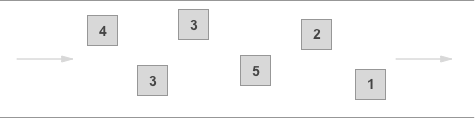

# Amazon SQS 란 무엇입니까?

## 1. Amazon SQS 사용의 이점

- 보안: [제어할 수 있는 도구](https://docs.aws.amazon.com/ko_kr/AWSSimpleQueueService/latest/SQSDeveloperGuide/sqs-authentication-and-access-control.html)Amazon SQS 대기열과 메시지를 전송 및 수신할 수 있는 사용자
    - [서버 측 암호화 (SSE)](https://docs.aws.amazon.com/ko_kr/AWSSimpleQueueService/latest/SQSDeveloperGuide/sqs-server-side-encryption.html)에서 관리되는 키를 사용하여 대기열의 메시지 내용을 보호함으로써 중요한 데이터를 전송할 수 있다. AWS Key Management Service(AWS KMS).
- 내구성: Amazon SQS 메시지를 안전하게 보호하기 위해 이를 여러 서버에 저장한다. 표준 대기열 지원 [최소 1회 전송](https://docs.aws.amazon.com/ko_kr/AWSSimpleQueueService/latest/SQSDeveloperGuide/standard-queues.html#standard-queues-at-least-once-delivery) 및 FIFO 큐는 [정확히 한 번 메시지 처리](https://docs.aws.amazon.com/ko_kr/AWSSimpleQueueService/latest/SQSDeveloperGuide/FIFO-queues-exactly-once-processing.html)한다.
- 가용성: Amazon SQS [중복 인프라](https://docs.aws.amazon.com/ko_kr/AWSSimpleQueueService/latest/SQSDeveloperGuide/sqs-basic-architecture.html)를 사용하면 메시지에 대한 고도의 동시 액세스와 메시지 생성 및 소비에 대한 고가용성을 제공할 수 있다.
- 확장성: Amazon SQS 각 [버퍼링된 요청](https://docs.aws.amazon.com/ko_kr/AWSSimpleQueueService/latest/SQSDeveloperGuide/sqs-client-side-buffering-request-batching.html) 독립적으로 확장하여 프로비저닝 명령 없이도 로드 증가나 급증을 처리할 수 있다.
- 안정성: Amazon SQS 처리 중에 메시지를 잠그므로 여러 생산자와 소비자가 동시에 메시지를 전송하고 수신할 수 있다.
- 사용자 지정: 큐는 정확히 같을 필요는 없다. 예를 들어 [대기열의 기본 지연 설정](https://docs.aws.amazon.com/ko_kr/AWSSimpleQueueService/latest/SQSDeveloperGuide/sqs-delay-queues.html). 256KB 보다 큰 메시지 내용을 저장할 수 있다. [Amazon Simple Storage Service (Amazon S3) 사용](https://docs.aws.amazon.com/ko_kr/AWSSimpleQueueService/latest/SQSDeveloperGuide/sqs-s3-messages.html) 또는 Amazon DynamoDB 사용하여 Amazon SQS 에서 Amazon S3 객체에 대한 포인터를 보유하거나 큰 메시지를 작은 메시지로 분할할 수 있다.

## 2. Amazon SQS, Amazon MQ 및 Amazon SNS 차이점

- Amazon SQS 및 [Amazon SNS](http://aws.amazon.com/sns/)
    - 확장성이 우수하고 사용하기 쉬우며 메시지 브로커를 설정할 필요가 없는 큐 및 topic 서비스
    - 이러한 서비스는 무제한에 가까운 확장성과 간편한 API 를 활용할 수 있는 새로운 애플리케이션에 사용하면 좋다.
- [Amazon MQ](http://aws.amazon.com/amazon-mq/)
    - 널리 사용되는 다양한 메시지 브로커와 호환되는 관리형 메시지 브로커 서비스
    - JMS 등과 같은 API 또는 AMQP, MQTT, OpenWire 및 STOMP 와 같은 프로토콜과 호환되는 기존 메시지 브로커의 애플리케이션을 마이그레이션할 때 Amazon MQ 를 사용하면 좋다.

## 3. Queue 타입

- Standard queue
    - 무제한 처리량(Throughput): 표준 대기열은 API 작업별 초당 거의 무제한의 API 호출 수를 지원한다(`SendMessage`, `ReceiveMessage`, `DeleteMessage`)
    - 최소 1회 전송: 메시지가 최소 한 번 전송되지만 때때로 두 개 이상의 메시지 복사본이 전송될 수 있다.
    - 최고의 노력(Best-Effort) 순서: 때때로 메시지가 전송된 순서와 다른 순서로 전송될 수 있다.
    
    
    
    - 다음 예와 같이 처리량이 중요할 때 애플리케이션 간에 데이터를 전송한다.
        - ex1> 실시간 사용자 요청을 집중적인 background 작업과 분리: 미디어 크기를 조정하거나 인코딩하는 동안 미디어 업로드도 할 수 있다.
        - ex2> 작업을 여러 worker 노드에 할당: 대량의 신용카드 validation 요청을 처리한다.
        - ex3> 미래의 처리를 위해 메시지를 배치 처리한다: 다수의 항목이 DB 에 추가되도록 예약한다.
- FIFO queue
    - 높은 처리량(Throughput): 사용하는 도구 [배치](https://docs.aws.amazon.com/ko_kr/AWSSimpleQueueService/latest/SQSDeveloperGuide/sqs-batch-api-actions.html)에서 FIFO 대기열은 API 메서드별 초당 최대 3,000개의 메시지를 지원한다(`SendMessageBatch`, `ReceiveMessage`, `DeleteMessageBatch`) 초당 3,000개의 메시지는 300개의 API 호출을 나타내며, 각각 10개의 메시지를 배치 처리한다. 할당량 증가를 요청하려면 [지원 요청을 제출](https://console.aws.amazon.com/support/home#/case/create?issueType=service-limit-increase&limitType=service-code-sqs)해라. 배치 처리가 없으면 FIFO 대기열은 API 메서드(`SendMessage`, `ReceiveMessage`, `DeleteMessage`)별 초당 최대 300개의 API 호출을 지원한다.
    - 정확히 1회 처리: 메시지가 한 번 전달되고 소비자가 이를 처리 및 삭제할 때까지 유지된다. 중복 항목을 대기열에 삽입하지 않는다.
    - 선입선출 배송: 메시지가 전송되고 수신되는 순서가 엄격하게 유지된다.
    
    
    
    - 다음 예와 같이 이벤트 순서가 중요할 때 애플리케이션 간에 데이터를 전송한다.
        - ex1> 사용자가 입력한 명령이 올바른 순서로 실행되도록 한다.
        - ex2> 가격 수정을 올바른 순서로 전송하여 올바른 제품 가격 표시
        - ex3> 학생이 계정 등록 전에 과정에 등록하지 못하도록 차단한다.

## 4. Amazon SQS 시작과 관련된 일반적인 작업

- 첫 번째 큐를 생성하고 메시지를 전송, 수신, 삭제하려면: [Amazon SQS 시작하기](https://docs.aws.amazon.com/ko_kr/AWSSimpleQueueService/latest/SQSDeveloperGuide/sqs-getting-started.html)
- Lambda 함수를 트리거하려면: [대기열을 구성하여AWS Lambda함수 (콘솔)](https://docs.aws.amazon.com/ko_kr/AWSSimpleQueueService/latest/SQSDeveloperGuide/sqs-configure-lambda-function-trigger.html)
- SQS 기능 및 아키텍처에 대해 알아보려면: [Amazon SQS 작동](https://docs.aws.amazon.com/ko_kr/AWSSimpleQueueService/latest/SQSDeveloperGuide/sqs-how-it-works.html)
- Amazon SQS 를 최대한 활용하는 데 도움이 될 지침 및 주의 사항에 대해 알아보려면: [Amazon SQS 모범 사례](https://docs.aws.amazon.com/ko_kr/AWSSimpleQueueService/latest/SQSDeveloperGuide/sqs-best-practices.html)
- AWS SDK 예제: [AWS SDK for Java 2.x개발자 안내서](https://docs.aws.amazon.com/sdk-for-java/latest/developer-guide/)
- Amazon SQS 작업에 대해 알아보려면: [Amazon Simple Queue Service API](https://docs.aws.amazon.com/AWSSimpleQueueService/latest/APIReference/)
- AWS CLI 명령에 대한 자세한 내용은: [AWS CLI명령 참조](https://docs.aws.amazon.com/cli/latest/reference/sqs/index.html)
