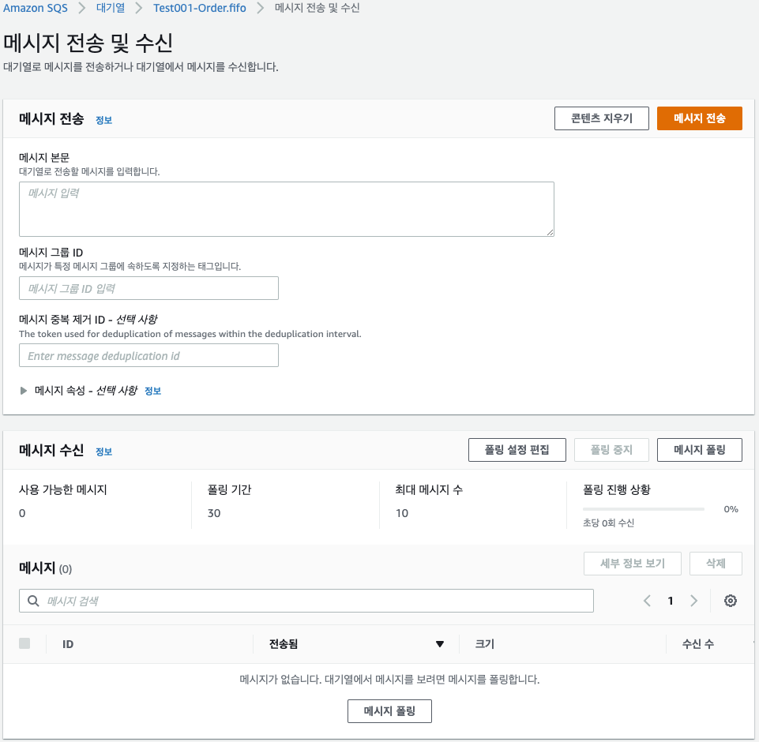

# Amazon SQS 시작하기

- Amazon SQS 콘솔을 사용하여 대기열과 메시지를 관리하는 방법을 설명한다.

## 단계 1: 대기열 생성

1. Amazon SQS 콘솔을[https://console.aws.amazon.com/sqs/](https://console.aws.amazon.com/sqs/)를 선택한다.
2. 대기열 생성을 선택한다.
3. 대기열 생성 페이지에서 올바른 리전을 지정한다.
4. 표준 큐 타입이 기본적으로 선택된다. FIFO를 선택한다. 큐 생성 후에는 큐 타입을 변경할 수 없다.
5. 큐 이름을 추가한다. `.fifo` 접미사로 끝나야 한다.
6. 기본 파라미터로 대기열을 생성하려면 하단으로 스크롤한 다음 대기열 생성을 선택한다. Amazon SQS 큐를 생성하고 큐의 세부 정보 페이지로 이동한다. Amazon SQS 시스템 전체에 새 큐에 대한 정보를 전파한다. Amazon SQS 분산 시스템이므로, 대기열이 **Queues** 페이지에 보이기까지 지연이 조금 있을 수 있다.

## 단계 2: 메시지 전송

1. Queues 메뉴를 선택하고 대기열 목록에서 자신이 생성한 대기열을 선택한다.
2. Actions 를 선택하고 메시지 전송 및 수신을 선택한다.
    
    
    
3. 메시지 본문 안에 메시지를 입력한다.

    

4. 큐의 메시지 그룹 ID 를 입력한다. 자세한 내용은 [FIFO 전송 로직](https://docs.aws.amazon.com/ko_kr/AWSSimpleQueueService/latest/SQSDeveloperGuide/FIFO-queues-understanding-logic.html) 단원 참조
5. 메시지 중복 제거 ID(선택 사항) 를 입력한다. content-based 중복 제거가 설정되어 있으면 메시지 중복 제거 ID가 필요하지 않다. 자세한 내용은 [FIFO 전송 로직](https://docs.aws.amazon.com/ko_kr/AWSSimpleQueueService/latest/SQSDeveloperGuide/FIFO-queues-understanding-logic.html) 단원 참조
6. 메시지 전송을 선택하면 메시지가 전송되고 콘솔이 성공 메시지를 표시한다. 세부 정보 보기 선택시 전송된 메시지에 대한 정보를 표시한다.
    
    
    

## 단계 3: 메시지 수신 및 삭제

- 큐로 메시지를 전송한 후 그 메시지를 큐에서 검색할 수 있다. 큐의 메시지를 요청할 때는 검색할 메시지를 지정할 수는 없지만 검색할 메시지의 최대 개수(최대 10개)는 지정할 수 있다.
1. Queues 페이지에서 큐를 선택한다.
2. 대기열 작업 에서 메시지 전송 및 수신을 선택한다. 메시지 전송 및 수신 선택한다.
3. 메시지 폴링 선택하면 Amazon SQS 는 큐에서 메시지를 찾기 위해 서버들을 폴링하기 시작한다. 섹션 오른쪽에 폴링 진행 상황이 표시된다.
메시지 섹션에는 수신된 메시지 목록이 표시된다. 각 메시지에 대해 목록에는 메시지 ID, 보낸 날짜, 크기, 수신 횟수가 표시된다.
    
    
    
4. 메시지를 삭제하려면 삭제하려는 메시지를 선택한 다음 삭제를 선택한다.

## 단계 4: 대기열을 삭제합니다.

1. 큐 목록에서 자신이 생성한 큐를 선택한다.
2. Queues 페이지에서 삭제할 큐를 선택한다.
3. 대기열 삭제를 선택한다. delete 를 입력한다.
4. 삭제를 선택합니다.

- 우아콘 설계
    
    
