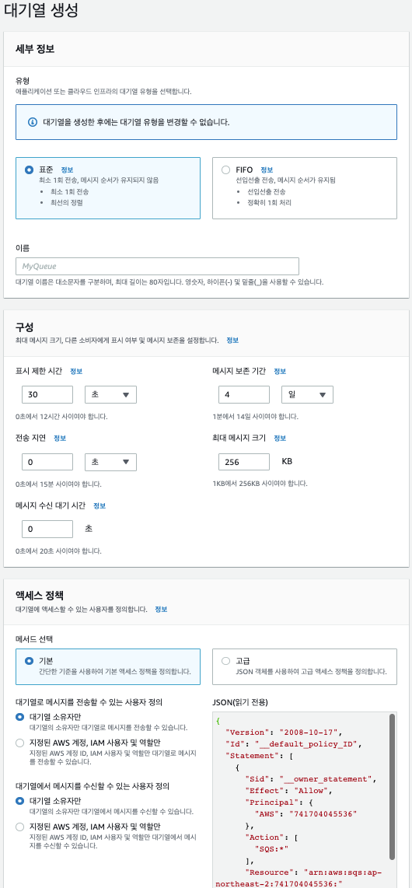

# Amazon SQS 구성

## 1. Amazon SQS 대기열을 생성하려면 (콘솔)

1. Amazon SQS 콘솔을 연다.[https://console.aws.amazon.com/sqs/](https://console.aws.amazon.com/sqs/).
2. 대기열 생성을 선택한다.
    - 화면
        
        
        
3. 표준 타입이 기본적으로 설정된다. FIFO 큐를 생성하려면 FIFO 선택
    - 참고: 큐를 생성한 후에는 큐 타입을 변경할 수 없다.
4. 이름을 입력한다. FIFO 큐의 이름은 `.fifo`로 끝나야 한다.
5. (선택 사항) 콘솔이 큐의 기본값을 설정한다.([구성 파라미터](https://docs.aws.amazon.com/ko_kr/AWSSimpleQueueService/latest/SQSDeveloperGuide/sqs-configure-queue-parameters.html)) 구성에서 다음 파라미터 값을 설정할 수 있다.
    1. 표시 제한 시간에 기간과 단위를 입력한다. 범위는 0초~12시간. 기본값은 30초.
        - 한 consumer 가 큐에서 받은 메시지가 다른 메시지 consumer 에게 표시되지 않는 시간 길이
        
        <aside>
        💡 콘솔을 사용하여 표시 제한 시간을 구성하면 큐에 있는 모든 메시지에 대한 시간 초과 값이 구성된다. 단일 또는 여러 메시지에 대한 시간 제한을 구성하려면 AWS SDK 사용.
        
        </aside>
        
    2. 메시지 보존 기간에 기간과 단위를 입력한다. 범위는 1분~14일. 기본값은 4일.
        - Amazon SQS 가 큐에 남아 있는 메시지를 보관하는 시간. 기본적으로 큐는 4일 동안 메시지를 보존한다. 메시지를 최대 14일 동안 유지하도록 대기열을 구성할 수 있다.
    3. 전송 지연에 기간과 단위를 입력한다. 범위는 0초~15분. 기본값은 0초.
        - Amazon SQS 가 큐로 추가된 메시지를 전송하기 전에 지연되는 시간
    4. 최대 메시지 크기에 값을 입력한다. 범위는 1~256KB. 기본값은 256KB.
    5. 메시지 수신 대기 시간에 값을 입력한다. 범위는 0~20초. 기본값은 0초이며 [짧은 폴링](https://docs.aws.amazon.com/ko_kr/AWSSimpleQueueService/latest/SQSDeveloperGuide/sqs-short-and-long-polling.html)(0이 아니면 긴 폴링을 설정한다)
        - 큐가 수신 요청을 받은 후 Amazon SQS 에서 메시지를 사용할 수 있을 때까지 대기하는 최대 시간
    6. FIFO 큐의 경우 콘텐츠 기반 중복 제거 활성화. 기본 설정은 비활성.
        - 메시지 본문을 기반으로 중복 제거 ID 를 자동으로 생성할 수 있다.
        - 화면
            
            
            
    7. (선택 사항) FIFO 큐의 경우, 큐에서 메시지를 보내고 받는 데 더 높은 처리량을 사용하려면 높은 처리량 FIFO 활성화 선택한다.
        - 이 옵션을 선택하면 관련 옵션(중복 제거 범위 및 FIFO 처리량 한도)을 필요한 설정으로 설정한다. 자세한 내용은 [FIFO 대기열에 대한 높은 처리량](https://docs.aws.amazon.com/ko_kr/AWSSimpleQueueService/latest/SQSDeveloperGuide/high-throughput-fifo.html) 및 [메시지 관련 할당량](https://docs.aws.amazon.com/ko_kr/AWSSimpleQueueService/latest/SQSDeveloperGuide/quotas-messages.html) 단원을 참조해라.
            
            
            
    8. 리드라이브 허용 정책: 모두 허용(기본값), 대기열 기준, 모두 거부를 선택한다. 대기열 기준을 선택할 때 Amazon 리소스 이름(ARN)별로 최대 10개의 소스 대기열 목록을 지정한다.
        - 화면
            
            
            
6. (선택 사항) [액세스 정책](https://docs.aws.amazon.com/ko_kr/AWSSimpleQueueService/latest/SQSDeveloperGuide/sqs-creating-custom-policies-access-policy-examples.html)은 큐에 액세스할 수 있는 계정, 사용자 및 역할을 정의한다. 또한 사용자가 액세스 할 수 있는 작업(ex> `SendMessage`, `ReceiveMessage`, `DeleteMessage`)을 정의한다. 기본 정책은 큐 소유자만 메시지를 보내고 받을 수 있도록 허용한다.
    - 기본: 대기열로 메시지를 전송할 수 있는 사용자와 대기열의 메시지를 수신할 수 있는 사용자를 구성할 수 있다. 콘솔은 선택 사항에 따라 정책을 생성하고 결과 액세스 정책을 읽기 전용 JSON 패널에 표시한다.
    - 고급: JSON 액세스 정책을 직접 수정할 수 있다. 이렇게 하면 각 보안 주체(계정, 사용자 또는 역할)가 수행할 수 있는 사용자 지정 작업 집합을 지정할 수 있다.
7. (선택 사항) [암호화](https://docs.aws.amazon.com/ko_kr/AWSSimpleQueueService/latest/SQSDeveloperGuide/sqs-configure-sse-existing-queue.html) 확장 가능
    - 대기열에 대해 서버 측 암호화(SSE)를 구성할 수 있다.
8. (선택 사항) [배달 못한 편지 대기열](https://docs.aws.amazon.com/ko_kr/AWSSimpleQueueService/latest/SQSDeveloperGuide/sqs-configure-dead-letter-queue.html): 배달할 수 없는 메시지를 수신한다.
    - 하나 이상의 원본 큐에서 성공적으로 소비되지 않은 메시지에 사용할 수 있는 큐이다.
    - Amazon SQS 는 배달 못한 편지 대기열을 자동으로 생성하지 않는다. 큐를 배달 못한 편지 대기열로 사용하기 전에 다른 큐를 먼저 생성해야 한다.
    - FIFO 큐의 배달 못한 편지 대기열은 FIFO 큐여야 한다.(표준 큐의 배달 못한 편지 대기열 역시 표준 큐)
    - 메시지를 배달 못한 편지 대기열로 보내기 전까지 시도할 수신 횟수(최대 수신)를 1~1,000 사이로 설정
9. (선택 사항) 태그 확장 가능
    - 큐를 쉽게 구성하고 식별할 수 있도록 비용 할당 태그를 추가할 수 있다.
10. 대기열 생성을 선택하면 Amazon SQS 큐를 생성하고 세부 정보 페이지로 이동한다.
- Amazon SQS 시스템 전체에 새 큐에 대한 정보를 전파한다. Amazon SQS 는 분산 시스템이므로, 콘솔이 대기열 페이지에 큐를 표시하기 전 약간의 지연이 발생할 수 있다.
- 큐를 만든 후 [메시지 전송](https://docs.aws.amazon.com/ko_kr/AWSSimpleQueueService/latest/SQSDeveloperGuide/sqs-using-send-messages.html), [메시지 수신 및 삭제](https://docs.aws.amazon.com/ko_kr/AWSSimpleQueueService/latest/SQSDeveloperGuide/sqs-using-receive-delete-message.html), 대기열 유형을 제외한 모든 큐 구성 설정을 수정할 수 있다.

## 2. Amazon SNS topic 에 Amazon SQS 대기열 구독

- Amazon SNS topic 은 Amazon SQS 큐를 하나 이상 구독할 수 있다. 메시지를 topic 에 게시하면 SNS 는 구독 중인 각 큐에 해당 메시지를 전송한다. Amazon SQS 는 구독 및 필요한 권한을 관리한다.
- SNS topic 이 큐를 구독하려면
    1.  Amazon SQS 대기열 메뉴 목록에서 SNS topic 에 구독할 큐를 선택한다.
    2. 작업 - Amazon SNS 주제 구독 - 대기열에서 사용할 수 있는 Amazon SNS 주제 지정 에서 큐에 대한 SNS topic 을 선택한다. SNS topic 이 메뉴에 나열되어 있지 않으면 SNS topic ARN 을 입력한다.
    3. 저장을 선택한다.
    4. 구독 결과를 확인하려면 topic 에 메시지를 게시한 다음, topic 이 대기열에 전송하는 메시지를 확인한다.
- SQS 큐와 SNS topic 이 서로 다른 AWS 계정을 선택하면 topic 소유자가 먼저 구독을 확인해야 한다.

## 3. 대기열로 AWS Lambda 함수 트리거 구성

- AWS Lambda 함수를 사용하여 SQS 큐의 메시지를 처리할 수 있다.
- Lambda 는 큐를 폴링하고 큐 메시지가 포함된 이벤트와 동기적으로 Lambda 함수를 호출한다. 당신은 Lambda 함수에서 처리할 수 없는 메시지에 대하여 배달 못한 편지 대기열 역할을 할 다른 큐를 지정할 수 있다.
- Lambda 함수는 여러 큐로 부터 항목들을 처리할 수 있다.(각 큐에서 한 Lambda 이벤트 소스를 사용하여) 여러 Lambda 함수에서 동일한 대기열을 사용할 수 있다.
- 만약 암호화된 대기열을 Lambda 함수와 연결했지만 Lambda가 메시지를 폴링하지 않는 경우, `kms:Decrypt`권한을 Lambda 실행 역할에 추가해라.

- 제한 사항
    - 큐와 Lambda 함수는 동일한 AWS 리전이어야 한다.
    - 기본 키(SQS 용 AWS 관리형 CMK)쓰는 [암호화된 대기열](https://docs.aws.amazon.com/ko_kr/AWSSimpleQueueService/latest/SQSDeveloperGuide/sqs-server-side-encryption.html)은 다른 AWS 계정의 Lambda 함수를 호출할 수 없다.
- Lambda 함수 트리거 구성을 위한 요구 사항
    - IAM 사용자를 사용하는 경우 Amazon SQS 역할에 다음 권한이 포함되어야 한다.
        - `lambda:CreateEventSourceMapping`
        - `lambda:ListEventSourceMappings`
        - `lambda:ListFunctions`
    - Lambda 실행 역할에는 다음 권한이 포함되어야 한다.
        - `sqs:DeleteMessage`
        - `sqs:GetQueueAttributes`
        - `sqs:ReceiveMessage`
    - 암호화된 대기열을 Lambda 함수와 연결하는 경우 `kms:Decrypt`권한을 Lambda 실행 역할에 추가한다.

### Lambda 함수를 트리거하도록 대기열을 구성하려면 (콘솔)

---

1. Amazon SQS 의 Queues 에서 구성할 큐를 선택한다.
2. 큐 페이지에서 Lambda 함수 트리거 구성을 클릭한다.
3. 지정 목록에서 필요한 Lambda 함수의 Amazon 리소스 이름 (ARN) 을 입력하거나 기존 리소스를 선택한 후 저장을 선택한다.
    - Lambda 함수가 대기열에 연결되기 까지 약 1분 정도 소요된다.
4. 구성 결과를 확인하려면 대기열에 메시지를 보낸 다음 Lambda 콘솔에서 트리거된 Lambda 함수를 확인해라.
