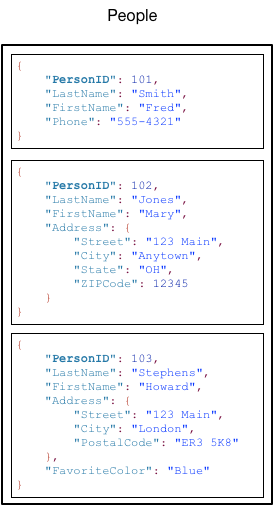

# 작동 방식

- 레퍼런스: [https://docs.aws.amazon.com/ko_kr/amazondynamodb/latest/developerguide/HowItWorks.html](https://docs.aws.amazon.com/ko_kr/amazondynamodb/latest/developerguide/HowItWorks.html)

## 핵심 구성 요소

- 핵심 구성 요소: 테이블(table), 항목(item), 속성(attribute)
    - table: item 의 집합
    - item: attribute 의 집합

- DynamoDB 는 기본 키(PK)를 사용하여 테이블의 각 항목(item)을 고유하게 식별하고 보조(secondary) 인덱스를 사용하여 보다 유연하게 쿼리를 작성하도록 해준다.
- DynamoDB Stream 을 사용하여 테이블의 데이터 수정 이벤트를 캡처할 수 있다.
- DynamoDB 에는 제한이 있다 → [Amazon DynamoDB 의 서비스, 계정 및 테이블 할당량](https://docs.aws.amazon.com/ko_kr/amazondynamodb/latest/developerguide/Limits.html)

### 1. 테이블, 항목, 속성 (Tables, Items, Attributes)

---

- **테이블:** 다른 DB 시스템과 마찬가지로, DynamoDB 는 데이터를 테이블에 저장한다.
    - *테이블*은 데이터의 집합
    - ex> 친구, 가족, 기타 사람에 대한 정보를 저장하는 *People* 테이블, 사람들이 운전하는 차량에 대한 정보를 저장할 *Cars* 테이블
- **항목:** 각 테이블에는 0개 이상의 항목이 있다. 다른 DB 시스템의 행, 레코드 또는 튜플과 유사하다.
    - *항목*은 모든 기타 항목 중에서 고유하게 식별할 수 있는 속성들의 집합
    - ex1 > *People* 테이블에서 각 항목은 한 사람을 나타낸다.
    - ex2 > *Cars* 테이블의 경우, 각 항목은 차량 한 대를 나타낸다.
    - DynamoDB 에서는, 테이블에 저장할 수 있는 항목 수에 제한이 없다.
- **속성:** 각 항목은 하나 이상의 속성으로 구성된다. 다른 DB 시스템의 필드 또는 열과 유사하다.
    - *속성*은 기본적인 데이터 요소로서, 더 이상 나뉠 필요 없는 것
    - ex1 > *People* 테이블 항목에는 *PersonID*, *LastName*, *FirstName* 등의 속성이 있다.
    - ex2 > *Department* 테이블의 항목에 *DepartmentID*, *Name*, *Manager* 등의 속성이 있을 수 있다.

- People 테이블 예제

    

    - 테이블의 각 항목에는, 항목을 테이블의 다른 모든 항목과 구별해 주는 고유 식별자인 기본 키가 있다.

        → *People* 테이블에서 기본 키(PK)는 한 개의 속성(*`PersonID`*)으로 구성된다.

    - 기본 키를 제외하고, *People* 테이블에는 스키마가 없다.

        → 속성이나 데이터 형식을 미리 정의할 필요가 없음을 의미. 각 항목에는 자체 고유 속성이 있을 수 있다.

    - 대부분의 속성은 *스칼라*인데, 이는 하나의 값만 가질 수 있다는 의미. ex> 스칼라: 문자열, 숫자
    - 일부 항목은 중첩된(nested) 속성(*`Address`*)

        → DynamoDB 는 최대 32개 수준 깊이까지 중첩된(nested) 속성을 지원한다.

- Music 테이블 예제: 음악 파일 테이블

    

    - *Music*의 기본 키는 두 개의 속성(*`Artist`* 및 *`SongTitle`*)으로 구성되어 있다. *`Artist` +* *`SongTitle`* 조합은 테이블의 각 항목을 구별해준다.
    - 기본 키를 제외하고, *Music* 테이블에는 스키마가 없다.

        → 속성이나 데이터 형식을 미리 정의할 필요가 없음을 의미. 각 항목에는 자체 고유 속성이 있을 수 있다.

    - 항목 중 하나(*`PromotionInfo`*)에는 다른 중첩 속성이 포함되어 있는, 중첩된(nested) 속성이 있다.

        → DynamoDB 는 최대 32개 수준 깊이까지 중첩된 속성을 지원한다.

### 2. 기본 키 (Primary Key)

---

- 테이블을 생성할 때는 기본 키를 지정해야 한다.

- 기본 키: 테이블의 각 항목을 나타내는 고유 식별자. 두 항목이 동일 키를 가질 수 없다.
- DynamoDB 가 지원하는 두 가지의 기본 키
    - 파티션 키: 한 속성으로 구성된 simple PK. 파티션 키라고 알려져있다.
        - DynamoDB 는 파티션 키의 값을 내부 해시 함수의 input 으로 사용한다. 해시 함수 output 에 따라 항목을 저장할 파티션(DynamoDB 내부의 물리적 스토리지)이 결정된다.
        - 파티션 키로만 구성되어 있는 테이블에서는, 어떤 두 개의 항목도 동일한 파티션 키를 가질 수 없다.
        - People 테이블은 simple PK(*`PersonID`*).

            → *`PersonId`*값을 항목에 부여함으로써, People 테이블의 모든 항목에 직접 액세스 할 수 있다.

    - 파티션 키 및 정렬 키: 두 속성으로 구성된 composite PK. 첫 번째 속성은 파티션 키, 두 번째 속성은 정렬 키이다.
        - DynamoDB 는 파티션 키의 값을 내부 해시 함수의 input 으로 사용한다. 해시 함수 output 에 따라 항목을 저장할 파티션 (DynamoDB 내부의 물리적 스토리지) 이 결정된다.
            - 파티션 키 값이 동일한 모든 항목은, 정렬 키 값 기준으로 정렬되어 함께 저장된다.
        - 파티션 키 + 정렬 키로 구성되어 있는 테이블에서는, 두 개의 항목이 동일한 파티션 키 값을 가질 수 있다.
            - 그러나 두 아이템의 정렬 키 값은 달라야한다.
        - Music 테이블은 [](https://docs.aws.amazon.com/ko_kr/amazondynamodb/latest/developerguide/HowItWorks.CoreComponents.html#HowItWorks.CoreComponents.TablesItemsAttributes)composite PK(`Artist` and `SongTitle`).

            → 해당 항목에 대한 `Artist`와 `SongTitle`을 제공하는 경우, Music 테이블의 모든 항목에 직접 액세스할 수 있다.

        - composite PK를 사용하면 보다 유연하게 데이터를 쿼리할 수 있다.
            - ex> `Artist` 값만 제공하는 경우, DynamoDB 는 해당 `Artist`의 모든 노래를 검색한다. *`Artist`* 값과 함께 *`SongTitle`* 값 범위를 입력하여 특정 아티스트의 노래 중 일부만 검색할 수도 있다.

파티션 키를 *해시 속성* 이라고도 한다.
*해시 속성* 용어는 DynamoDB 에서 파티션 키 값을 바탕으로, 데이터 항목을 파티션에 균등하게 분산하는 내부 해시 함수를 사용하는 것에서 유래되었다.

정렬 키를 *범위 속성* 이라고도 한다.
*범위 속성* 용어는 DynamoDB 가 동일한 파티션 키를 지닌, 물리적으로 상호 근접한 항목들을 정렬 키 값에 의한 순서로 저장하는 방식에서 유래되었다.

- 각 기본 키 속성은 스칼라여야 한다. (단일 값만 가질 수 있음)
    - 기본 키 속성에 허용되는 데이터 형식은 문자열, 숫자, 이진수 뿐.
    - 키가 아닌 속성에는 이러한 제한이 없다.

### 3. 보조 인덱스 (Secondary Indexes)

---

- 테이블에서 하나 이상의 보조 인덱스를 생성할 수 있다.

- 보조 인덱스: 기본 키에 대한 쿼리, 대체 키를 사용한 쿼리까지 실행할 수 있다.
    - DynamoDB 는 인덱스를 사용하도록 요구하지 않으면서도, 데이터를 쿼리할 때 애플리케이션에 보다 유연성을 제공한다.
- 테이블에서 보조 인덱스를 생성한 후에는, 테이블에서 데이터를 읽는 것 같이 인덱스에서 데이터를 읽을 수 있다.
- DynamoDB 는 두 가지 종류의 인덱스를 지원한다.
    - 전역 보조 인덱스: 테이블것과 다를 수 있는 인덱스(파티션 키 및 정렬 키)
    - 로컬 보조 인덱스: 파티션 키는 테이블과 동일하지만, 정렬 키는 다른 인덱스
- DynamoDB 의 각 테이블에는 테이블 당 20개 글로벌 보조 인덱스(default), 5개 로컬 보조 인덱스가 할당되어 있다.
- ex > Music 테이블에서는 *`Artist`*(파티션 키) 또는 *`Artist`* 와 *`SongTitle`*(파티션 키 및 정렬 키) 기준으로 항목 쿼리가 가능하다. 만약 *`Genre`* 와 *`AlbumTitle`*로 쿼리하고 싶다면? → *`Genre`* 및 *`AlbumTitle`*에 대해 인덱스를 생성 후, 인덱스를 쿼리하면 된다.

- Music 테이블과 새 인덱스 `GenreAlbumTitle` 예제
    - 인덱스에서 *`Genre`*는 파티션 키, *`AlbumTitle`*은 정렬 키이다.

    

    - `GenreAlbumTitle` 인덱스
        - 모든 인덱스는 테이블에 속해있고, 이를 인덱스의 *기본 테이블(base table)*이라고 한다.

            → Music 은 *GenreAlbumTitle* 인덱스의 기본 테이블

        - DynamoDB 는 인덱스를 자동으로 유지한다.
            - 기본 테이블의 항목을 추가, 업데이트, 삭제하면 → DynamoDB 가 해당 테이블에 속하는 모든 인덱스의 해당 항목을 추가, 업데이트, 삭제한다.
        - 인덱스를 생성할 때, (기본 테이블 → 인덱스로) 복사하거나 *프로젝션* 할 속성을 지정해야 한다.
            - DynamoDB 는 기본 테이블의 키 속성을 인덱스로 프로젝션 한다.
            - `GenreAlbumTitle`의 경우가 그러한데, Music 테이블의 키 속성만 인덱스로 프로젝션 된다.
    - `GenreAlbumTitle` 인덱스를 쿼리하여 특정 장르의 앨범을 모두 찾을 수 있다. (예: 모든 Rock 앨범)
    - 인덱스를 쿼리하여 특정 앨범 제목의 특정 장르에 속하는 모든 앨범을 찾을 수도 있다. (예: 제목이 알파벳 H로 시작하는 모든 Country 앨범)

### 4. DynamoDB Streams

---

- DynamoDB Streams: DynamoDB 테이블의 데이터 수정 이벤트를 캡처하는 선택적 기능
    - 수정 이벤트에 대한 데이터가 이벤트가 발생한 순서대로 준-실시간으로 스트림에 표시된다.
- 각 이벤트는 *스트림 레코드* 에 의해 나타난다.

    테이블에서 스트림을 설정하면, 다음 이벤트가 발생할 때마다 스트림 레코드를 기록한다.

    - 테이블에 새 항목 추가: 전체 항목(모든 속성을 모두 포함한)의 이미지를 캡처한다.
    - 항목 업데이트: 항목에서 수정된 속성의 "전", "후" 이미지를 캡처한다.
    - 테이블에서 항목 삭제: 항목이 삭제되기 전에 전체 항목의 이미지를 캡처한다.

➕ 각 스트림 레코드에는 테이블명, 이벤트 타임스탬프, 다른 메타데이터가 포함되어 있다.

- 스트림 레코드의 수명은 24시간이며, 24시간이 지나면 스트림에서 자동으로 제거된다.

- DynamoDB Streams *트리거*를 만드려면 AWS Lambda를 쓸 수 있다. (관심 이벤트가 스트림에 나타날 때마다 자동 실행되는 코드)
    - ex > 회사의 고객 정보가 들어 있는 Customers 테이블. 새 고객마다 "환영" 이메일을 보내려고 한다고 가정해보자. 해당 테이블에서 스트림을 설정한 다음, 스트림을 Lambda 함수와 연결할 수 있다. Lambda 함수는 Customers 에 새 항목 추가되는 새로운 스트림 레코드가 나타날 때마다 실행된다.

        `EmailAddress`속성이 있는 모든 항목의 경우, Lambda 함수는 Simple Email Service(Amazon SES)를 호출하여 해당 주소에 이메일을 보낸다.

    

- 트리거 뿐 아니라, DynamoDB Streams 은 AWS 리전 내/외에서 데이터 복제와 DynamoDB 테이블의 구체화된 view, Kinesis 구체화 뷰를 사용한 데이터 분석 등과 같은 강력한 솔루션을 제공한다.


## DynamoDB API

- Amazon DynamoDB 를 사용하려면, 애플리케이션에서 간단한 API 기능 몇 가지를 사용해야 한다.

### 1. 제어 플레인 (Control Plane)

---

- 제어 플레인: DynamoDB 테이블을 생성, 관리하고, 인덱스, 스트림, 테이블에 따른 다양한 객체를 사용하도록 해준다.
    - `CreateTable`: 새 테이블을 만든다. 선택적으로, 하나 이상의 보조 인덱스를 생성하고, 테이블에 대해 DynamoDB Streams 을 활성화 할 수 있다.
    - `DescribeTable`: 기본 키(PK) 스키마, 처리량(throughput) 설정, 인덱스 정보 같은, 테이블에 대한 정보를 반환한다.
    - `ListTables`: 목록에 있는 모든 테이블명을 반환한다.
    - `UpdateTable`: 테이블 설정이나 인덱스를 수정하거나, 테이블에 새 인덱스 생성/제거하거나, 테이블의 DynamoDB Streams 설정을 수정한다.
    - `DeleteTable`: DynamoDB 에서 테이블과 해당 종속 객체 모두를 제거한다.

### 2. 데이터 플레인 (Data Plane)

---

- 데이터 플레인: 테이블 데이터에 대해 생성, 읽기, 업데이트, 삭제(*CRUD*)하도록 해준다. 일부 데이터 플레인 작업은 보조 인덱스에서 데이터를 읽도록 해준다.

- PartiQL - SQL 호환 쿼리 언어
    - `ExecuteStatement`: 테이블에서 여러 항목을 읽는다. 단일 항목을 쓰거나 업데이트할 수도 있다. 단일 항목을 쓰거나 업데이트할 때, 기본 키(PK) 속성을 지정해야 한다.
    - `BatchExecuteStatement`: 테이블에서 여러 항목을 쓰기, 업데이트, 읽는다. 이것은 항목을 쓰거나 읽을 때 애플리케이션이 네트워크를 한 번만 왕복하면 되므로 `ExecuteStatement`보다 효율적이다.
- 클래식 API
    - 데이터 생성
        - `PutItem`: 테이블에 단일 항목을 쓴다. 기본 키(PK) 속성은 꼭 지정해야 한다.
        - `BatchWriteItem`: 테이블에 최대 25개의 항목을 쓴다. 항목을 쓸 때 애플리케이션이 네트워크를 한 번만 왕복하면 되므로 `PutItem` 여러 번 호출하는 것보다 효율적이다. 하나 이상의 테이블에서 여러 항목을 삭제하는 경우에도 사용할 수 있다.
    - 데이터 읽기
        - `GetItem`: 테이블에서 단일 항목을 조회한다. 원하는 항목의 기본 키(PK)를 지정해야 한다. 전체 항목 또는 항목의 일부 속성만 가져올 수 있다.
        - `BatchGetItem`: 하나 이상의 테이블에서 최대 100개의 항목을 가져온다. 항목을 읽을 때 애플리케이션이 네트워크를 한 번만 왕복하면 되므로 `GetItem` 여러 번 호출하는 것보다 효율적이다.
        - `Query`: 특정 파티션 키가 있는 모든 항목을 가져온다. 파티션 키 값을 지정해야 한다. 전체 항목 또는 항목의 일부 속성만 가져올 수 있다.
            - 선택적으로, 정렬 키 값에 조건을 적용하여 동일 파티션 키의 하위 집합만 검색할 수도 있다.
            - 테이블에 파티션 키와 정렬 키가 모두 있는 경우, 이 작업을 테이블에 사용할 수 있다.
            - 또한, 인덱스에 파티션 키와 정렬 키가 모두 있는 경우, 이러한 작업을 인덱스에 사용할 수 있다.
        - `Scan`: 지정된 테이블 또는 인덱스의 모든 항목을 가져온다. 전체 항목 또는 항목의 일부 속성만 가져올 수 있다. 선택적으로, 필터링 조건을 적용하여 필요한 값만 반환하고 나머지는 버릴 수 있다.
    - 데이터 업데이트
        - `UpdateItem`: 항목에서 하나 이상의 속성을 수정한다. 수정하려는 항목의 기본 키를 지정해야 한다.
            - 새로운 속성을 추가할 수 있으며, 기존 속성을 수정/제거할 수 있다.
            - 조건부 업데이트를 수행하여, 사용자 정의 조건을 만족할 때만 업데이트가 수행되도록 할 수도 있다.
            - 선택적으로, 원자성 카운터(atomic counter)를 구현할 수 있다. 이는 다른 쓰기 요청과 충돌하지 않고, 숫자(numeric) 속성을 증감한다.
    - 데이터 삭제
        - `DeleteItem`: 테이블에서 단일 항목을 삭제한다. 삭제하려는 항목의 기본 키를 지정해야 한다.
        - `BatchWriteItem`: 하나 이상의 테이블에서 최대 25개의 항목을 삭제한다. 항목을 삭제할 때 애플리케이션이 네트워크를 한 번만 왕복하면 되므로 `DeleteItem` 여러 번 호출하는 것보다 효율적이다. 하나 이상의 테이블에 여러 아이템을 추가할 수도 있다.

### 3. DynamoDB Streams

---

- DynamoDB Streams*:* 테이블에 스트림을 설정하거나 해제할 수 있으며, 스트림에 포함되어 있는 (데이터 수정) 레코드에 액세스할 수 있다.
    - `ListStreams`: 모든 스트림 목록 또는 특정 테이블의 스트림만 반환한다.
    - `DescribeStream`: ARN(Amazon 리소스 이름) 및 애플리케이션이 처음 스트림 레코드를 읽기 시작할 수 있는 위치 같은, 스트림에 대한 정보를 반환한다.
    - `GetShardIterator`: *샤드 반복기* 를 반환한다 - 애플리케이션이 스트림으로부터 레코드를 가져오는 데 사용하는 데이터 구조
    - `GetRecords`: 지정된 샤드 반복자를 사용하여, 하나 이상의 스트림 레코드를 가져온다.

### 4. Transactions

---

- 트랜잭션: 원자성, 일관성, 격리 및 내구성(ACID)을 제공하여 애플리케이션에서 데이터의 정확성을 더 쉽게 유지할 수 있다.

- PartiQL - SQL 호환 쿼리 언어
    - `ExecuteTransaction`: all-or-nothing 결과를 보장하는 테이블 내 및 전체의 여러 항목에 대한 CRUD 작업을 허용하는 배치 작업
- 클래식 API
    - `TransactWriteItems`: 일괄 `Put`,`Update`, `Delete` 기능을 테이블 내 및 전체의 여러 항목에 all-or-nothing 결과를 보장하며 작업할 수 있다.
    - `TransactGetItems`: 일괄 `Get` 기능으로, 하나 이상의 테이블에서 여러 항목을 검색할 수 있다.


## 이름 지정 규칙 및 데이터 형식

### 1. 이름 지정 규칙 (Naming Rules)

---

- DynamoDB 의 테이블, 속성 및 기타 객체는 모두 이름이 있어야 한다.
- 이름은 의미 있고 간결해야 한다. ex> Products, Books, Authors 는 자명하다.

- DynamoDB 의 이름 지정 규칙
    - 모든 이름은 UTF-8 인코딩되어야 하며, 대소문자를 구분한다.
    - 테이블, 인덱스 이름은 3~255자로 이루어져야 하며, 다음 문자만 포함할 수 있다.
        - `a-z`
        - `A-Z`
        - `0-9`
        - `_` (밑줄)
        - `-`(대시)
        - `.`(점)
    - 속성 이름은 1자 이상이어야 하며 64KB를 초과할 수 없다. 다음의 예외가 있고, 이러한 속성 이름은 255자 이내여야 한다.
        - 보조 인덱스 파티션 키 이름
        - 보조 인덱스 정렬 키 이름
        - 사용자 지정 프로젝션 속성 이름 (로컬 보조 인덱스에만 적용 가능)

- 예약어 및 특수 문자
    - DynamoDB 에는 예약어 목록과 특수 문자가 있다. 또한, **`#`**(해시) 및 **`:`**(콜론) 문자는 특별한 의미를 갖는다.
    - DynamoDB 이름에 이러한 예약어 및 특수 문자를 사용할 수 있지만, 표현식에서 이러한 이름을 사용할 때마다 자리표시자 변수(placeholder variables)를 정의해야 하기 때문에 사용하지 않는 것이 좋다.

### 2. 데이터 형식 (Data Types)

---

- 스칼라(Scalar) 형식: 하나의 값만 표현할 수 있다. → 숫자, 문자열, 이진수(binary), Boolean, null
    - **Number**: 양수, 음수, 0
        - 숫자는 최대 38자리 수까지 지원된다. 제한 초과 시, 예외 발생
            - 양의 범위: `1E-130` ~ `9.9999999999999999999999999999999999999E+125`
            - 음의 범위: `-9.9999999999999999999999999999999999999E+125` ~ `-1E-130`
        - DynamoDB 에서 숫자는 가변 길이로 나타낸다. 앞과 끝의 0은 잘린다.
        - 모든 번호는 문자열 형태로 네트워크를 통해 DynamoDB 로 전송되어 다양한 언어, 라이브러리 호환성이 극대화된다. DynamoDB 에서는 수학적인 작업 시, 이들을 숫자 형식의 속성으로 처리한다.
            - 숫자 정밀도가 중요한 경우, 숫자 형식을 문자열로 변환하여 DynamoDB 에 전달해야 한다.
        - epoch time 을 사용하여, 날짜 또는 타임스탬프를 표현할 수 있다.
    - **String**: UTF-8 이진수 인코딩을 사용하는 유니코드이다.
        - 문자열의 최소 길이는 0일 수 있다.
            - 속성이 인덱스, 테이블의 키로 사용되지 않고, 최대 DynamoDB 항목 크기 제한인 400KB로 제한되는 경우
        - 문자열 형식 기본 키(PK) 속성의 추가 제약
            - simple PK: 첫 번째 속성 값(파티션 키)의 최대 길이는 2048 byte
            - 복합 PK: 두 번째 속성 값(정렬 키)의 최대 길이는 1024 byte
        - DynamoDB 는 UTF-8 문자열 인코딩의 바이트로 문자열을 수집하고 비교한다.
            - ex> "`a`"(0x61)는 "`A`"(0x41)보다 크고, "`¿`"(0xC2BF)는 "`z`"(0x7A)보다 크다.
        - 문자열 형식을 사용하면, 날짜 또는 타임스탬프를 표현할 수 있다. 다음과 같이, ISO 8601 문자열을 사용하여 가능하다.
            - `2016-02-15`
            - `2015-12-21T17:42:34Z`
            - `20150311T122706Z`
    - **Binary**: 압축 텍스트, 암호화 데이터, 이미지 같은 모든 이진수 데이터가 저장될 수 있다.
        - DynamoDB 가 이진수 값을 비교할 때, 이진수 데이터의 각 바이트를 부호가 없는 것으로 처리한다.
        - 이진 속성의 길이는 0일 수 있다.
            - 속성이 인덱스, 테이블의 키로 사용되지 않고, 400KB(최대 DynamoDB 항목 크기 제한)로 제한되는 경우
        - 이진수 형식 기본 키(PK) 속성의 추가 제약
            - simple PK: 첫 번째 속성 값(파티션 키)의 최대 길이는 2048 byte
            - 복합 PK: 두 번째 속성 값(정렬 키)의 최대 길이는 1024 byte
        - 애플리케이션에서 DynamoDB 로 이진수 값을 전송하기 전, Base64 인코딩해야 한다.
            - DynamoDB 는 이러한 값을 받아 데이터를 부호가 없는 바이트 배열로 디코딩하고, 이진수 속성의 길이로 사용합니다.
            - base64로 인코딩 된 이진수 형식 ex> `dGhpcyB0ZXh0IGlzIGJhc2U2NC1lbmNvZGVk`
    - **Boolean**: `true` 또는 `false`를 저장할 수 있다.
    - **Null**: 알려지지 않았거나 정의되지 않은 상태의 속성을 나타낸다.
- 문서(Document) 형식: 중첩 속성의 복잡한 구조를 표현할 수 있다. → 목록(list), 맵(map)
    - 서로 중첩이 가능하여 최대 32단계 깊이의 복잡한 데이터 구조까지 나타낼 수 있다.(ex> JSON 문서)
    - 목록 또는 맵 내 값의 수에는 제한이 없다. 단, 값을 포함하는 항목이 DynamoDB 항목 크기 제한 (400KB)을 초과하지 않아야 한다.
    - 속성값은 빈 문자열이거나 빈 이진 값일 수 있다. 빈 집합(문자열 집합, 숫자 집합, 이진 집합)일 순 없다.
        - 속성이 테이블, 인덱스 키로 사용되지 않는 경우
    - **List**: 순서가 지정된 값 모음을 저장할 수 있다. 목록은 대괄호(`[ ... ]`)로 묶는다.
        - 목록은 JSON 배열과 유사하다.
        - 목록에 저장할 수 있는 데이터 형식은 제한이 없으며, 목록 내 요소의 형식이 달라도 상관없다.

        ```sql
        FavoriteThings: ["Cookies", "Coffee", 3.14159]
        ```

    - **Map**: 정렬되지 않은 이름-값 pair 모음을 저장할 수 있다. 맵은 중괄호(`{ ... }`)로 묶는다.
        - 맵은 JSON 객체와 유사하다.
        - 맵에 저장할 수 있는 데이터 형식은 제한이 없으며, 맵에 형식이 다른 요소도 함께 있을 수 있다.
        - 맵은 DynamoDB 에 JSON 문서를 저장하는 데 이상적이다.

        ```sql
        {
            Day: "Monday",
            UnreadEmails: 42,
            ItemsOnMyDesk: [
                "Coffee Cup",
                "Telephone",
                {
                    Pens: { Quantity : 3},
                    Pencils: { Quantity : 2},
                    Erasers: { Quantity : 1}
                }
            ]
        }
        ```

- 집합(Set) 형식: 여러 스칼라 값을 표현할 수 있다. → 문자열 집합, 숫자 집합, 이진수 집합
    - 숫자, 문자열 및 이진수 값 집합의 형식을 지원한다.
    - 집합 내 모든 요소의 형식은 동일해야 한다.

        ```sql
        ["Black", "Green", "Red"]

        [42.2, -19, 7.5, 3.14]

        ["U3Vubnk=", "UmFpbnk=", "U25vd3k="]
        ```

- 테이블이나 보조 인덱스를 생성할 때는 각 기본 키(PK) 속성(파티션 키 및 정렬 키) 이름 및 데이터 형식을 지정해야 한다. 기본 키(PK) 속성은 문자열, 숫자 또는 이진수 형식으로 정의해야 한다.
- DynamoDB 는 NoSQL 데이터베이스로, *스키마리스* 이다. 이는 테이블을 생성할 때 기본 키 속성 외, 다른 속성이나 데이터 형식을 정의할 필요가 없다는 의미
    - 그에 비해, RDB 는 테이블을 생성할 때 각 열의 이름 및 데이터 형식을 정의해야 한다.


## 읽기 일관성

- Amazon DynamoDB 는 대부분의 AWS 리전에서 사용 가능하다. 각 리전은 독립적이고 다른 AWS 리전과 격리되어 있다.
    - ex > People 테이블이 *us-east-2* 리전에 있고, 다른 People 테이블이 *us-west-2* 리전에 있으면, 완전히 별개의 두 테이블로 간주된다.
- 모든 AWS 리전은 가용 영역(Availability Zones)이라는 여러개의 구별되는 위치로 구성된다.
    - 각 가용 영역은 다른 가용 영역의 실패로부터 격리되어 있으며, 같은 리전의 다른 가용 영역에 경제적이고 지연 시간이 낮은(low-latency) 네트워크 연결을 제공한다.
    - 따라서 한 리전의 여러 가용 영역 간 빠른 데이터 복제가 가능하다.
- 애플리케이션에서 DynamoDB 테이블에 데이터를 쓰고 HTTP 200 응답(`OK`)을 받는 경우, 쓰기가 발생한 것이고, 이는 지속 가능한 상태이다. 데이터는 보통 1초 이내에 모든 스토리지 위치에서 최종 일관성(eventually consistent)을 갖게 된다.
- DynamoDB 는 *최종 일관성*(eventually consistent*)* 및 *강력한 일관성*(strongly consistent)있는 읽기를 지원한다.

### 1. 최종적 일관된 읽기 (Eventually Consistent Reads)

---

- 테이블에서 데이터를 읽을 때, 응답은 최근 완료된 쓰기 작업의 결과를 반영하지 않을 수 있다.
- 응답에는 이전의 데이터가 일부 포함될 수 있다. 잠시 후 다시 읽기 요청을 하면, 응답이 최신 데이터를 반환한다.

### 2. 강력한 일관된 읽기 (Strongly Consistent Read)

---

- 성공한 모든 쓰기 작업의 업데이트를 반영하여 가장 최신 데이터가 포함된 응답을 반환한다. 하지만 이러한 일관성은 다음과 같은 몇 가지 단점을 수반한다.
    - 네트워크 지연 또는 중단이 발생한 경우에 사용이 어려울 수 있다. 이 경우, DynamoDB 가 서버오류(HTTP 500)를 반환할 수도 있다.
    - 최종적 일관된 읽기보다 지연 시간이 더 길 수 있다.
    - 글로벌 보조 인덱스에서는 지원되지 않는다.
    - 최종적 일관된 읽기보다 처리 용량을 더 많이 사용한다.

DynamoDB 는 default 로 최종적 일관된 읽기를 사용한다. `GetItem`, `Query`, `Scan` 같은 읽기 기능은 `ConsistentRead` 파라미터를 제공하는데, `true`로 설정하면 DynamoDB 는 강력한 일관된 읽기를 사용한다.


## 읽기/쓰기 용량 모드

- DynamoDB 에는 테이블에 대한 읽기 및 쓰기 처리를 위한 두 가지 읽기/쓰기 용량 모드(Read/Write Capacity Mode)가 있다.
    - 온디맨드
    - 프로비저닝됨(기본값, 프리 티어 이용 가능)
- 읽기/쓰기 용량 모드: 읽기 및 쓰기 처리량(throughput)에 대한 청구 방법과 용량(capacity) 관리 방법을 제어한다. 테이블을 생성할 때 읽기/쓰기 용량 모드를 설정하거나 나중에 변경할 수 있다.
- 로컬 보조 인덱스는 기본 테이블에서 읽기/쓰기 용량 모드를 상속한다.

### 1. 온디맨드 모드 (On-Demand Mode)

---

- 온디맨드: 용량 계획 없이 초당 수천 개의 요청을 처리할 수 있는 유연한 청구 옵션. 읽기 및 쓰기 요청에 대해 요청당 지불 가격을 제공하므로 사용하는 만큼에 대해서만 비용을 지불하면 된다.
- 온디맨드 모드를 선택하면, 이전에 도달한 트래픽 수준까지 확장 또는 축소할 때 즉시 워크로드를 수용한다.
- 만약 워크로드 트래픽 수준이 새로운 피크를 기록할 경우에는, DynamoDB 는 워크로드를 수용하기 위해 신속하게 조정을 수행한다.
- 온디맨드 모드 테이블은 한 자릿수 밀리초 지연 시간, 서비스 수준 계약(SLA) 약정 및 보안을 제공한다. 새 테이블과 기존 테이블에 모두 온디맨드를 선택할 수 있으며, 코드를 변경하지 않고 기존 DynamoDB API 를 계속 사용할 수 있다.

- 온디맨드 모드는 다음의 경우, 유용한 옵션이다.
    - 알 수 없는 워크로드를 포함하는 테이블을 새로 만들 경우
    - 애플리케이션 트래픽이 예측 불가능한 경우
    - 사용한 만큼에 대해서만 지불하는 요금제를 사용하려는 경우

- 요청 빈도는 DynamoDB 처리량 default 테이블 할당량에 의해서만 제한되지만, 요청에 따라 늘릴 수 있다.
- 온디맨드 방식을 시작하려면, 온디맨드 모드를 사용하도록 테이블을 생성하거나 업데이트 하면 된다.
- 24시간마다 읽기/쓰기 용량 모드를 전환할 수 있다.

- 읽기 요청 단위 및 쓰기 요청 단위 (Read Request Units and Write Request Units)
    - 온디맨드 모드 테이블의 경우, 애플리케이션에서 수행할 것으로 예상되는 읽기 및 쓰기 처리량을 지정할 필요가 없다. DynamoDB 는 읽기 요청 단위 및 쓰기 요청 단위로 요금을 부과한다.
        - 하나의 *읽기 요청 단위* 는 최대 4KB 크기의 항목에 대해, 강력한 일관된 읽기 요청 1개 or 최종적 일관된 읽기 요청 2개를 나타낸다. 트랜잭션 읽기 1회는 읽기 요청 단위 2개를 나타낸다.
            - 4KB 보다 큰 항목을 읽어야 하는 경우, DynamoDB 에 추가 읽기 요청 단위가 필요하다. 필요한 총 읽기 요청 단위 수는 항목 크기 및 최종적 일관된 읽기와 강력한 일관된 읽기 중 어느 것을 원하는지에 따라 달라진다.
            - ex > 항목 크기가 8KB인 경우,
                - 강력한 일관된 읽기 1회 → 읽기 요청 단위 2개가 필요,
                - 최종적 일관된 읽기 → 읽기 요청 단위 1개가 필요,
                - 트랜잭션 읽기 요청 → 읽기 요청 단위 4개가 필요하다.
        - 하나의 *쓰기 요청 단위* 는 최대 1KB 크기의 항목에 대해 쓰기 1회를 나타낸다. 트랜잭션 1회 쓰기 요청은 2개의 쓰기 요청 단위가 필요하다.
            - 1KB 보다 큰 항목을 써야 하는 경우, 추가 쓰기 요청 단위를 사용해야 한다.
            - ex > 항목 크기가 2KB인 경우,
                - 쓰기 요청 1회 → 쓰기 요청 단위 2개가 필요,
                - 트랜잭션 쓰기 요청 → 쓰기 요청 단위 4개가 필요하다.
- 피크 트래픽 및 조정 속성 (Peak Traffic and Scaling Properties)
    - 온디맨드 테이블은 애플리케이션의 트래픽 볼륨에 맞게 자동 조정된다. 이전 피크 트래픽의 최대 2배 용량을 즉시 수용한다.
        - ex > 애플리케이션의 트래픽 패턴이 초당 25,000~50,000회 사이의 강력한 일관된 읽기 범위이고, 이전 트래픽 피크의 초당 읽기 횟수가 50,000회인 경우,
            - 온디맨드 용량 모드에서는 초당 최대 100,000회 읽기 지속적 트래픽을 즉시 수용한다.
            - 애플리케이션이 초당 100,000회 읽기 트래픽을 지속하는 경우, 해당 피크가 새로운 이전 피크가 되어 후속 트래픽은 초당 최대 200,000회 읽기에 도달할 수 있다.
    - 만약 테이블에 이전 피크의 2배 이상 용량이 필요한 경우, DynamoDB 는 트래픽 볼륨이 증가할 때 워크로드 조절(throttling)이 발생하지 않도록 더 많은 용량을 자동으로 할당한다. 하지만 30분 이내에 이전 피크의 2배 용량을 초과할 경우, 조절(throttling)이 발생할 수 있다.
        - ex > 애플리케이션의 트래픽 패턴이 초당 25,000~50,000회 사이의 강력한 일관된 읽기 범위이고, 이전 트래픽 피크의 초당 읽기 횟수가 50,000회인 경우,
            - DynamoDB 에서 최대 100,000회 이상 읽기를 구동하기 전에, 최소 30분 이상의 간격을 두고서 트래픽을 늘리는 것을 추천한다.
- 온디맨드 용량 모드의 초기 처리량 (Initial Throughput for On-Demand Capacity Mode)
    - 최근에 처음 기존 테이블을 온디맨드 용량 모드로 전환했거나, 온디맨드 용량 모드를 활성화한 상태에서 새 테이블을 생성한 경우, (이전에 온디맨드 용량 모드로 테이블에서 트래픽을 처리한 적이 없더라도) 테이블의 이전 피크 설정은 다음과 같다.
        - **온디맨드 용량 모드로 새로 생성된 테이블:** 이전 피크는 2,000회 쓰기 요청 단위 또는 6,000회 읽기 요청 단위이다.
            - 이전 피크의 최대 2배를 즉시 구동할 수 있으므로 새로 생성된 온디맨드 테이블에서 최대 4,000회 쓰기 요청 단위, 12,000회 읽기 요청 단위 또는 이 둘을 linear 하게 조합한 용량을 처리할 수 있다.
        - **온디맨드 용량 모드로 전환된 기존 테이블:** 테이블은 온디맨드 용량 모드로 전환되기 전과 같은 처리량을 제공한다.
            - 이전 피크는 테이블이 생성된 이후 프로비저닝된 최대 쓰기 용량 유닛 및 읽기 용량 유닛의 절반 또는 온디맨드 용량 모드를 통해 새로 생성된 테이블의 설정 중 더 큰 값이다.
- 읽기/쓰기 용량 모드 전환 중 테이블 동작 (Table Behavior while Switching Read/Write Capacity Mode)
    - 테이블을 온디맨드 용량 모드로 전환할 경우, 테이블 및 파티션의 구조가 다양하게 변경된다. 이 프로세스는 몇 분 정도 걸릴 수 있다.
        - 전환 기간동안, 테이블은 이전에 프로비저닝된 쓰기 용량 단위 및 읽기 용량 단위량과 일치하는 처리량을 제공한다.
        - 온디맨드 용량 모드에서 프로비저닝된 용량 모드로 다시 전환할 경우, 테이블이 온디맨드 용량 모드로 설정되었을 때 도달한 이전 피크와 일치하는 처리량을 제공한다.

### 2. 프로비저닝된 모드 (Provisioned Mode)

---

- 프로비저닝된 모드: 애플리케이션에 필요한 초당 읽기 및 쓰기 횟수를 지정한다. Auto Scaling 을 사용하여 트래픽 변화에 따라 테이블의 프로비저닝 용량을 자동으로 조정할 수 있다. 이를 통해 DynamoDB 사용을 통제하여 정의된 요청 속도 이하로 유지함으로써 비용을 예측하는 데 도움이 된다.

- 프로비저닝된 모드는 다음의 경우, 유용한 옵션이다.
    - 애플리케이션 트래픽이 예측 가능한 경우
    - 트래픽이 일관되거나 점진적으로 변화하는 애플리케이션을 실행할 경우
    - 비용 관리를 위해 용량 요구 사항을 예측할 수 있는 경우

- 읽기 용량 단위 및 쓰기 용량 단위 (Read Capacity Units and Write Capacity Units)
    - 프로비저닝된 모드 테이블의 경우, 읽기 용량 단위(RCU) 및 쓰기 용량 단위(WCU)로 처리량을 지정한다.
        - 하나의 *읽기 용량* 은 (최대 4KB 크기의 항목에 대해) 초당 강력한 일관된 읽기 1개 또는 최종적 일관된 읽기 2개를 나타낸다. 트랜잭션 읽기 요청은 초당 읽기 1회에 2개의 읽기 용량 단위가 필요하다.
            - 4KB보다 큰 항목을 읽어야 하는 경우, 추가 읽기 용량 단위를 사용해야 한다. 필요한 총 읽기 용량 단위 수는 항목 크기 및 최종적 일관된 읽기와 강력한 일관된 읽기 중 어느 것을 원하는지에 따라 달라진다.
            - ex > 항목 크기가 8KB인 경우,
                - 강력한 일관된 초당 읽기 1회 → 읽기 용량 단위 2개가 필요,
                - 최종적 일관된 읽기 → 읽기 용량 단위 1개가 필요,
                - 트랜잭션 읽기 요청 → 읽기 용량 단위 4개가 필요하다.
        - 하나의 *쓰기 용량 단위* 는 최대 1KB 크기의 항목에 대해 초당 쓰기 1회를 나타낸다. 트랜잭션 쓰기 요청은 초당 1회 쓰기는 2개의 쓰기 용량 단위가 필요하다.
            - 1KB 보다 큰 항목을 써야 하는 경우, 추가 쓰기 용량 단위를 사용해야 한다. 필요한 총 쓰기 용량 단위 수는 항목 크기에 따라 결정된다.
            - ex > 항목 크기가 2KB인 경우,
                - 초당 쓰기 요청 1회 → 쓰기 용량 단위 2개가 필요,
                - 트랜잭션 쓰기 요청 → 쓰기 용량 단위 4개가 필요하다.
    - 애플리케이션이 더 큰 항목(최대 항목 크기 400KB까지)을 읽거나 쓸 경우 더 많은 용량 단위를 사용한다.
        - ex > 읽기 용량 단위 6개와 쓰기 용량 단위 6개를 수용하는 프로비저닝된 테이블을 생성하면 애플리케이션에서 다음을 수행할 수 있습니다.
            - 초당 최대 24KB의 강력한 일관된 읽기 수행 (4KB × 6 읽기 용량 단위)
            - 초당 최대 48KB의 최종적 일관된 읽기 수행(읽기 처리량(throughput)의 2배)
            - 초당 최대 12KB의 트랜잭션 읽기 요청을 수행
            - 초당 최대 6KB를 쓴다.(1KB x 6 쓰기 용량 단위)
            - 초당 최대 3KB의 트랜잭션 쓰기 요청 수행
    - *프로비저닝된 처리량* 은 애플리케이션이 테이블, 인덱스에서 사용할 수 있는 최대 용량이다. 테이블, 인덱스에 대해 프로비저닝된 처리량을 애플리케이션에서 초과할 경우 요청 조정(throttling)이 적용된다.
        - 조정(throttling) 기능은 애플리케이션에서 용량 단위를 너무 많이 사용하지 않도록 방지한다.
        - 요청이 조정될 경우, 요청은 HTTP 400 코드(`Bad Request`) 및 `ProvisionedThroughputExceededException`과 함께 실패한다.
        - AWS SDK 는 조절된 요청 재시도를 기본적으로 지원하므로, 이 로직을 직접 작성할 필요는 없다.
        - AWS Management Console을 사용하여 프로비저닝된 처리량과 실제 처리량을 모니터링하고, 필요한 경우 처리량 설정을 수정할 수 있다.

    온디맨드 테이블에서 `DescribeTable`을 호출할 경우, 읽기 용량 단위와 쓰기 용량 단위는 0으로 설정된다.

- DynamoDB Auto Scaling
    - 테이블 및 글로벌 보조 인덱스에 대한 처리량(throughput)을 적극적으로 관리한다.
    - Auto Scaling 을 사용하면, 읽기 및 쓰기 용량 단위에 범위(상한 및 하한)를 지정할 수 있다. 또한, 해당 범위 내에서 목표 사용률 퍼센트를 정의한다.
        - DynamoDB Auto Scaling은 애플리케이션 워크로드가 증가하거나 감소하는 경우에도 목표 사용률을 유지하려고 시도한다.
    - DynamoDB Auto Scaling 을 사용하면, 테이블 또는 글로벌 보조 인덱스는 요청 조정(throttling)없이 갑작스러운 트래픽 증가를 처리할 수 있다.
        - 워크로드가 감소할 경우, DynamoDB Auto Scaling 은 사용하지 않는 프로비저닝된 용량에 대해 요금을 지불하지 않도록 처리량을 줄일 수 있습니다.

    AWS Management Console를 사용하여 테이블 또는 글로벌 보조 인덱스를 생성한 경우, DynamoDB Auto Scaling 이 기본적으로 활성화된다. Auto Scaling 설정은 콘솔, AWS CLI, AWS SDK 를 사용하여 언제든지 관리할 수 있다.

- 예약 용량 (Reserved Capacity)
    - DynamoDB 고객은 사전에 *예약 용량* 을 구매할 수 있다. 예약 용량은 선결제 요금을 1회 지불하고, 일정 기간에 대해 최소 프로비저닝된 사용량 수준을 약정한다.
        - 예약 용량에는 시간당 예약 용량 요금이 청구된다.
        - 미리 읽기 및 쓰기 용량 단위를 예약하면, 온디맨드 또는 프로비저닝된 처리량 설정에 비해 비용을 크게 절감할 수 있다.
        - 예약 용량을 초과하여 프로비저닝하는 용량에는 프로비저닝된 용량 표준 요금이 청구된다.

    온디맨드 모드에서는 예약 용량을 사용할 수 없다.


## 파티션 및 데이터 분산

- Amazon DynamoDB 는 데이터를 파티션에 저장한다.
- *partition:* SSD(Solid State Drive)로 백업되는 테이블용 스토리지 할당, AWS 리전 내의 여러 가용 영역(Availability Zones)에 걸쳐 자동으로 복제된다.
    - 파티션 관리는 DynamoDB 에 의해 전적으로 처리되므로 파티션을 직접 관리할 필요가 없다.
- 테이블을 생성할 때, 테이블 초기 상태는 `CREATING`이다. 이 단계에서, DynamoDB 는 테이블에 충분한 파티션을 할당하여 프로비저닝된 처리량 요구 사항을 만족할 수 있도록 한다. 테이블 상태가 `ACTIVE`로 전환되면, 테이블 데이터를 쓰거나 읽을 수 있다.

- DynamoDB 는 다음 상황에서 테이블에 추가 파티션을 할당한다.
    - 기존 파티션이 지원할 수 있는 한도를 초과하여, 테이블의 프로비전된 처리량(throughput) 설정을 늘리는 경우
    - 기존 파티션 용량이 다 차서 추가 스토리지 공간이 필요한 경우

- 파티션 관리는 백그라운드에서 자동으로 이루어지므로 애플리케이션에는 표시되지 않는다.
    - 테이블은 사용 가능한 처리량을 유지하며 프로비저닝된 처리량 요구 사항을 완전히 지원한다.
- DynamoDB 의 글로벌 보조 인덱스도 파티션으로 구성된다.
    - 글로벌 보조 인덱스의 데이터는 기본 테이블의 데이터와 별도로 저장되지만, 인덱스 파티션은 테이블 파티션과 동일한 방식으로 동작한다.

### 1. 데이터 분산: 파티션 키

---

- 테이블에 simple 기본 키(파티션 키 only)가 있는 경우, DynamoDB 는 파티션 키 값을 바탕으로 각 항목을 저장하고 검색한다.
- 테이블에 항목을 기록하기 위해, DynamoDB 는 내부 해시 함수의 input 으로 파티션 키 값을 사용한다. 해시 함수 output 값은 항목을 저장할 파티션을 결정한다.
- 테이블에서 항목을 읽으려면 항목의 파티션 키 값을 지정해야 한다. DynamoDB 는 이 값을 해당 해시 함수의 input 으로 사용하여 항목을 찾을 수 있는 파티션을 결정한다.
- ex > 여러 파티션에 걸쳐 데이터가 저장된 *Pets* 테이블
    - 테이블의 기본 키(PK)는 *AnimalType*(이 키 속성만 표시됨)
    - DynamoDB 는 해시 함수를 사용하여 새 항목을 저장할 위치를 결정한다.
        - 이 경우 문자열 *Dog* 의 해시 값을 기준으로 사용된다.
    - 항목은 정렬 순서대로 저장되지 않는다. 각 항목의 위치는 파티션 키의 해시 값으로 결정된다.

    

DynamoDB 는 파티션 수와 상관없이, 항목을 테이블의 파티션에 균일하게 분배하는 데 최적화되어 있다. 테이블 항목 수에 비해 많은 수의 고유 값을 가질 수 있는 파티션 키를 선택할 것을 권장한다.

### 2. 데이터 분산: 파티션 키 및 정렬 키

---

- 테이블에 복합 기본 키(파티션 키 및 정렬 키)가 있는 경우, DynamoDB 는 simple 기본 키(파티션 키 only)의 경우와 동일한 방식으로, 파티션 키의 해시값을 계산한다.
    - 그러나 동일한 파티션 키 값을 가진 모든 항목을 정렬 키 값의 순서대로 정렬하여 물리적으로 가깝게 저장한다.
- 테이블에 항목을 기록하기 위해 DynamoDB 는 파티션 키의 해시 값을 계산하여 항목을 저장할 파티션을 결정한다. 해당 파티션에서는 여러 항목이 동일한 파티션 키 값을 가질 수 있다. 따라서 DynamoDB 는 파티션 키가 동일한 다른 항목 간에 정렬 키에 의해 오름차순으로 항목을 저장한다.
- 테이블에서 항목을 읽으려면 항목의 파티션 키 값과 정렬 키 값을 지정해야 한다.
    - DynamoDB 는 파티션 키의 해시 값을 계산하여 항목을 찾을 수 있는 파티션을 결정한다.
- 원하는 항목들이 동일한 파티션 키 값을 가질 경우, 한 번의 작업(`Query`)으로 테이블에서 여러 항목을 읽을 수 있다.
    - DynamoDB 는 해당 파티션 키 값을 가진 모든 항목을 반환한다.
    - 특정 값 범위의 항목만 반환되도록 정렬 키에 조건을 적용할 수 있다.(선택 사항)
- ex > *AnimalType*(파티션 키)와 *Name*(정렬 키)으로 구성된 복합 기본 키를 가진 *Pets* 테이블
    - DynamoDB 파티션 키 값이 *Dog* 이고 **정렬 키 값이 *Fido* 인 항목을 쓰는 것을 보여준다.

    

    - *Pets* 테이블에서 동일한 항목을 읽으려면, DynamoDB 는 *Dog* 의 해시 값을 계산하여, 이 항목이 저장될 파티션을 찾아낸다. 그런 다음 DynamoDB 가 *Fido* 를 찾을 때까지 정렬 키 속성 값을 검색한다.
    - *AnimalType* 이 *Dog* 인 항목을 모두 읽으려면, 정렬 키 조건을 지정하지 않고 `Query` 기능을 실행한다. 기본적으로 항목은 정렬 순서대로 (정렬 키 기준 오름차순) 반환된다. 선택 사항으로, 내림차순을 요청할 수 있다.
    - *Dog* 항목들의 일부만 쿼리하려면, 정렬 키에 조건을 적용할 수 있다. (ex > *Name* 이 **`A`~`K` 범위 문자로 시작하는 *Dog* 항목)

DynamoDB 테이블의 경우, 파티션 키 당 고유 정렬 키의 수는 제한이 없다. 만약 *Pets* 테이블에 *Dog* 항목 수십억개를 저장해야 하는 경우, DynamoDB 은 자동으로 요구 사항을 처리할 수 있는 충분한 스토리지를 할당한다.


- [Notion link](https://jennyuni.notion.site/713148b091b343ba88b2bd4049c8c0fb)
