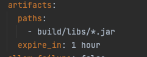

# Packaging executable, plain archives

- 레퍼런스: [https://docs.spring.io/spring-boot/docs/current/gradle-plugin/reference/htmlsingle/#packaging-executable.and-plain-archives](https://docs.spring.io/spring-boot/docs/current/gradle-plugin/reference/htmlsingle/#packaging-executable.and-plain-archives)

## 문제점

---



- 위의 설정으로 artifacts 를 지정해두었고, 프로젝트 내에서 아래와 같이 archive 설정하였기 때문에

    ```kotlin
    tasks.getByName<org.springframework.boot.gradle.tasks.bundling.BootJar>("bootJar") {
    	this.archiveFileName.set("app.jar")
    }
    ```

- Dockerfile 에서 아래와 같이 하면 잘 작동할 것이라 생각했다.

    ```bash
    FROM openjdk:11-jre-slim AS builder
    EXPOSE 4008
    COPY build/libs/*.jar app.jar
    ENTRYPOINT ["java","-jar","/app.jar"]
    ```

→ docker build 시 `When using COPY with more than one source file, the destination must be a directory and end with a /` 발생


- 정말 2개의 `jar` 가 생겨있었다.

## 원인

---

- 배포 시 `artifacts` 는 test 단계에서 생성해둔 것을 가져오는데,
- `./gradlew test`실행 시 실행되는 단계는 다음과 같다.

    ```bash
    > Task :kaptGenerateStubsKotlin
    > Task :kaptKotlin
    > Task :compileKotlin
    > Task :compileJava
    > Task :processResources
    > Task :classes
    > Task :inspectClassesForKotlinIC
    > Task :jar SKIPPED
    > Task :kaptGenerateStubsTestKotlin
    > Task :kaptTestKotlin
    > Task :compileTestKotlin
    > Task :compileTestJava
    > Task :processTestResources
    > Task :testClasses
    > Task :test
    ```

- `./gradlew bootJar`, `./gradlew build` 실행 시 실행되는 단계

    ```bash
    > Task :kaptGenerateStubsKotlin
    > Task :kaptKotlin
    > Task :compileKotlin
    > Task :compileJava
    > Task :processResources
    > Task :classes
    > Task :bootJarMainClassName
    > Task :bootJar
    # --- 여기부터 build --- #
    > Task :inspectClassesForKotlinIC
    > Task :jar SKIPPED
    > Task :assemble
    > Task :kaptGenerateStubsTestKotlin
    > Task :kaptTestKotlin
    > Task :compileTestKotlin
    > Task :compileTestJava NO-SOURCE
    > Task :processTestResources UP-TO-DATE
    > Task :testClasses UP-TO-DATE
    > Task :test
    > Task :check
    > Task :build
    ```

- 레퍼런스에서 나오듯, 스프링부트 2.5 부터, `:bootJar`가 설정되었을 때, `:jar` 는 `plain`이라는 컨벤션으로 archive를 생성하여, 실행가능한 archive 와 plain archive를 동시에 생성할 수 있다.

### bootJar 와 Jar 의 차이

---

- 기본적으로 SpringBoot 에서 `build` 실행시, `:bootJar` 는 실행하고 `:jar` 는 스킵하도록 되어있다.
- 아래와 같이 설정하여 `:jar`를 스킵하지 않고 `.jar`를 만들어도 "기본 Manifest 속성이 없습니다." 라고 뜨며 부트 앱이 뜨지 않는다.

    ```kotlin
    tasks.getByName<Jar>("jar"){
    	enabled = true
    }
    ```

## 해결

---

- `:jar`를 스킵하도록 설정하였다.

```kotlin
tasks.getByName<Jar>("jar"){
	enabled = false
}
```

- 참고
    - [https://umbum.dev/853](https://umbum.dev/853)


- [Notion link](https://jennyuni.notion.site/Packaging-executable-plain-archives-163c8e6fe24d4fb18657b5be788d1454)
